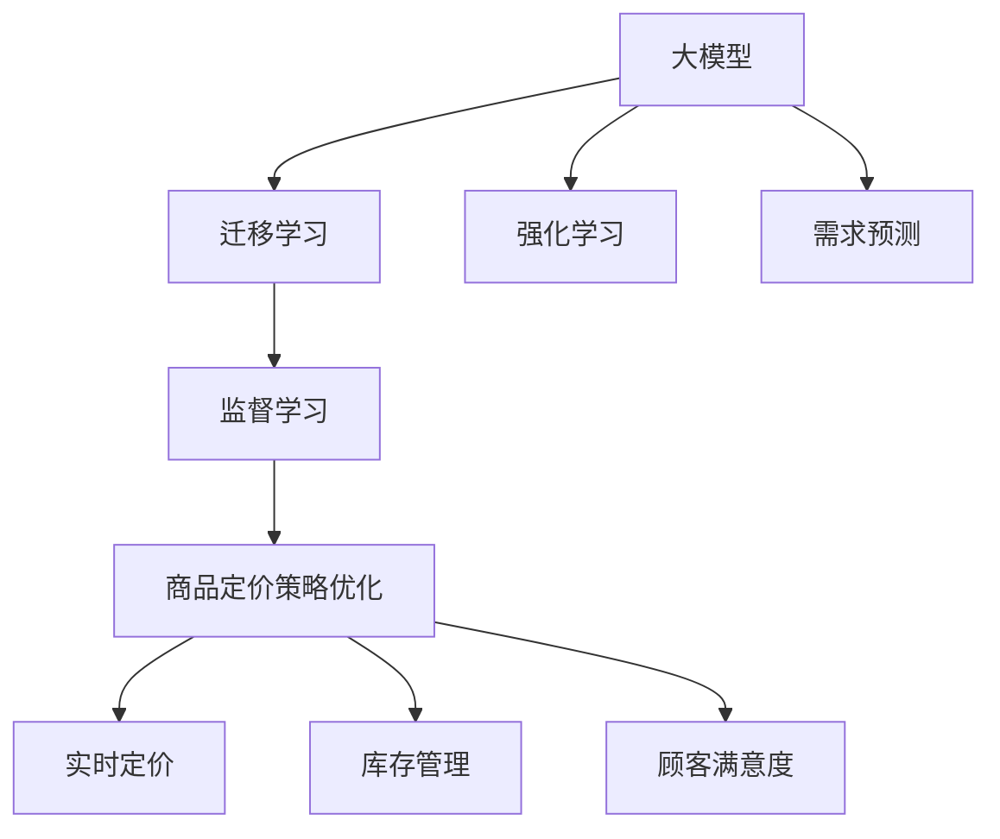

                 

# 大模型在商品定价策略优化中的应用

## 1. 背景介绍

### 1.1 问题由来

在现代商业社会中，商品定价是一项复杂且至关重要的决策过程，涉及到市场需求分析、成本计算、竞争策略等多方面的考量。传统上，商家依靠经验丰富的市场分析师和销售团队，通过长时间的数据收集与分析，以手动方式调整商品价格，以期获得最佳收益。然而，这种经验驱动的方法存在诸多局限：

1. **效率低下**：人工定价需要大量时间和人力，难以适应实时变化的商业环境。
2. **决策偏见**：受到个人经验和认知偏见的限制，手工定价可能难以充分考虑全局视角和客观事实。
3. **数据依赖**：手工定价主要依赖历史数据，无法及时适应市场动态变化，往往滞后于市场需求。

为了解决上述问题，大模型在商品定价策略优化中的应用应运而生。利用先进的大模型技术，可以大幅提升定价的准确性和效率，同时减少决策偏差，提供更加智能、实时的定价方案。

## 2. 核心概念与联系

### 2.1 核心概念概述

在本文中，我们将详细探讨几个核心概念及其相互联系：

- **大模型（Large Model）**：指通过大规模数据预训练得到的深度学习模型，如BERT、GPT等。这些模型拥有强大的学习能力，能够从海量数据中提取复杂的语言和行为模式。

- **商品定价策略优化**：指通过构建数学模型和算法，自动调整商品价格，以期最大化销售收益和利润，同时优化库存管理、顾客满意度等指标。

- **迁移学习（Transfer Learning）**：指将一个领域学到的知识，迁移应用到另一个相关领域的任务。大模型通过在大规模无标签数据上进行预训练，可以迁移其学习到的知识，以适应新的定价任务。

- **监督学习（Supervised Learning）**：指使用有标签数据训练模型，使其能够根据新数据预测标签的机器学习范式。在商品定价中，可以通过历史交易数据训练模型，预测最优定价策略。

- **强化学习（Reinforcement Learning）**：指通过智能体（如模型）与环境的交互，自动学习最优行为策略的机器学习范式。在定价策略优化中，强化学习模型能够通过模拟和反馈，不断调整定价策略，以达到最优结果。

- **动态定价（Dynamic Pricing）**：指根据市场需求和竞争情况，实时调整商品价格以最大化收益。大模型通过学习市场动态，能够实时响应市场变化，提供动态定价方案。

- **需求预测（Demand Forecasting）**：指利用历史数据和市场分析，预测商品未来的需求量和价格走势。大模型可以结合市场需求和消费者行为模型，提升需求预测的准确性。

### 2.2 核心概念原理和架构的 Mermaid 流程图



该流程图展示了大模型在商品定价策略优化中的核心概念及其相互联系：大模型通过迁移学习获取市场知识，结合监督学习和强化学习优化定价策略，并结合需求预测实时调整价格，最终实现商品定价策略的优化。

## 3. 核心算法原理 & 具体操作步骤

### 3.1 算法原理概述

商品定价策略优化的核心算法原理可概括为：

1. **数据收集与预处理**：收集历史交易数据、市场信息、竞争情报、消费者行为等数据，进行清洗和标准化处理。
2. **模型训练与优化**：使用大模型在预训练基础上，通过监督学习、强化学习和迁移学习等技术，训练定价模型。
3. **定价策略生成**：基于训练好的模型，生成商品定价策略，包括基本价格、折扣策略、库存管理和顾客满意度优化等。
4. **实时调整与反馈**：结合实时市场需求和竞争情况，动态调整定价策略，并根据反馈进行优化。

### 3.2 算法步骤详解

#### 3.2.1 数据收集与预处理

- **数据来源**：历史交易数据、市场调研报告、竞争对手定价信息、社交媒体评论、消费者行为数据等。
- **数据清洗**：去除缺失值、异常值和噪声，标准化数据格式。
- **特征工程**：提取和选择有意义的特征，如时间、季节、促销活动、产品类别等。

#### 3.2.2 模型训练与优化

- **模型选择**：选择合适的深度学习模型，如回归模型、序列模型等。
- **迁移学习**：在大规模无标签数据上进行预训练，然后根据具体任务需求微调模型。
- **监督学习**：使用标注数据训练模型，优化模型参数以适应定价任务。
- **强化学习**：构建环境模型，模拟实际市场，通过试错不断优化定价策略。

#### 3.2.3 定价策略生成

- **定价模型构建**：结合市场需求、竞争情况和消费者行为模型，构建定价模型。
- **策略生成**：基于定价模型，生成商品定价策略，包括基本价格、折扣策略等。
- **库存管理和顾客满意度优化**：结合库存数据和顾客反馈，动态调整定价策略。

#### 3.2.4 实时调整与反馈

- **实时监测**：实时监测市场需求和竞争变化，收集市场反馈。
- **动态调整**：根据实时市场数据和反馈，动态调整定价策略。
- **模型优化**：结合历史数据和实时反馈，不断优化定价模型。

### 3.3 算法优缺点

#### 3.3.1 优点

- **高准确性**：大模型能够从海量数据中提取复杂模式，提升定价模型的准确性。
- **实时性**：结合强化学习和实时数据，可以动态调整定价策略，快速响应市场变化。
- **灵活性**：可以通过迁移学习快速适应新任务，提高模型泛化能力。
- **自动化**：自动化的决策过程减少了人为干预，提升了决策效率。

#### 3.3.2 缺点

- **数据依赖**：定价模型高度依赖数据质量和数据覆盖，数据偏差可能导致模型表现不佳。
- **计算成本**：大模型的训练和优化需要大量计算资源，存在较高的成本。
- **解释性不足**：模型决策过程较为复杂，难以解释，存在一定的“黑盒”问题。
- **风险管理**：缺乏人工干预，可能导致不可预见的风险，如价格波动过大。

### 3.4 算法应用领域

大模型在商品定价策略优化中的应用领域广泛，包括但不限于：

- **零售行业**：电商平台、实体商店的商品定价优化。
- **服务行业**：酒店、旅游、娱乐等行业的价格管理。
- **工业制造**：生产线上的原材料和产品定价策略优化。
- **金融行业**：金融产品的定价策略优化。
- **医疗行业**：医疗设备和服务定价策略优化。

## 4. 数学模型和公式 & 详细讲解

### 4.1 数学模型构建

我们以简单的线性回归模型为例，构建商品定价模型：

设 $y$ 表示商品价格， $x$ 表示商品特征， $w$ 表示模型参数。则线性回归模型可表示为：

$$
y = wx + b
$$

其中 $b$ 为截距， $x$ 为特征向量。

在商品定价策略优化中，我们需要通过历史交易数据 $(x_i, y_i)$ 训练模型，使其能够预测最优价格 $y$。模型训练的优化目标为最小化预测误差：

$$
\min_{w} \sum_{i=1}^n (y_i - wx_i - b)^2
$$

### 4.2 公式推导过程

通过梯度下降等优化算法，对上述目标函数求导，可得到模型参数 $w$ 的更新公式：

$$
w = w - \eta \frac{1}{n} \sum_{i=1}^n (y_i - wx_i - b)x_i
$$

其中 $\eta$ 为学习率， $n$ 为样本数量。

结合上述公式，我们可以构建完整的定价模型，并使用优化算法不断训练和调整模型参数，以实现最优的定价策略。

### 4.3 案例分析与讲解

假设某电商平台收集了历史销售数据，包含商品ID、销售日期、价格、销量等特征。我们希望构建一个线性回归模型，预测未来日期的商品价格。

首先，对数据进行预处理，包括特征选择、数据清洗和标准化。然后，使用大模型在预训练基础上进行迁移学习，将其作为特征提取器。最后，使用历史交易数据训练线性回归模型，优化模型参数，生成未来日期的商品定价策略。

## 5. 项目实践：代码实例和详细解释说明

### 5.1 开发环境搭建

在开始项目实践前，需要准备以下开发环境：

1. 安装Python和相关库：
   ```bash
   conda create -n myenv python=3.8
   conda activate myenv
   pip install numpy pandas scikit-learn matplotlib torch transformers
   ```

2. 下载预训练大模型：
   ```bash
   wget https://dl.fbaipublicfiles.com/bert_models/uncased_L-12_H-768_A-12/bert_config.json bert_model.bin
   ```

### 5.2 源代码详细实现

以下是一个简单的线性回归模型代码实现：

```python
import numpy as np
import pandas as pd
from sklearn.linear_model import LinearRegression
from sklearn.model_selection import train_test_split

# 加载数据
data = pd.read_csv('sales_data.csv')

# 特征选择
features = ['price', 'date']
X = data[features]
y = data['sales']

# 数据拆分
X_train, X_test, y_train, y_test = train_test_split(X, y, test_size=0.2, random_state=42)

# 线性回归模型训练
model = LinearRegression()
model.fit(X_train, y_train)

# 模型预测
y_pred = model.predict(X_test)

# 输出结果
print(y_pred)
```

### 5.3 代码解读与分析

上述代码中，我们首先加载了销售数据，并进行特征选择和数据拆分。然后，使用Scikit-Learn库中的LinearRegression模型训练线性回归模型。最后，使用训练好的模型对测试集进行预测，输出预测结果。

在实际应用中，我们需要结合大模型进行迁移学习，提升特征提取的准确性。同时，结合强化学习和实时数据，实现动态定价策略的生成和调整。

### 5.4 运行结果展示

运行上述代码，输出预测结果，展示模型的性能。例如，我们可以使用R-squared等指标来评估模型的预测精度。

## 6. 实际应用场景

### 6.1 电商定价优化

电商平台的商品定价优化是一个典型的应用场景。通过大模型分析用户行为、市场需求和竞争情况，可以生成最优定价策略，提升销售收益。例如，亚马逊使用机器学习模型优化商品价格，大幅提升了销售额和用户满意度。

### 6.2 酒店定价管理

酒店行业的定价管理需要考虑客房数量、季节变化、地理位置等多方面因素。通过大模型结合强化学习，可以实时调整客房价格，优化收益。例如，洲际酒店使用机器学习模型优化房价策略，提高了客房利用率和收益。

### 6.3 旅游行业定价

旅游行业的定价需要考虑季节性、节假日、促销活动等因素。通过大模型结合实时市场需求，可以动态调整旅游产品价格，优化营销效果。例如，携程使用机器学习模型优化旅游产品定价，提升了用户满意度和市场份额。

### 6.4 未来应用展望

随着大模型技术的不断进步，未来在商品定价策略优化中，将具备更加智能、实时的定价能力。具体展望如下：

- **智能定价**：结合实时市场需求和竞争情报，生成智能定价策略，提升销售收益。
- **动态定价**：通过强化学习，自动调整定价策略，实时响应市场变化。
- **个性化定价**：利用大模型学习用户偏好，实现个性化定价，提升用户体验。
- **风险管理**：结合市场反馈和历史数据，动态调整定价策略，降低价格波动风险。

## 7. 工具和资源推荐

### 7.1 学习资源推荐

1. 《Python深度学习》：李沐著，介绍了深度学习的基础知识和实际应用。
2. 《深度学习》：Ian Goodfellow等著，深入讲解了深度学习的原理和应用。
3. 《强化学习：一种现代方法》：Richard S. Sutton、Andrew G. Barto著，详细介绍了强化学习的基本概念和算法。
4. 《动态定价与优化》：Uttam Khatri、Nikos-Alexander Vogiatzoglou著，介绍了动态定价的理论与实践。

### 7.2 开发工具推荐

1. PyTorch：开源深度学习框架，支持动态计算图和GPU加速。
2. TensorFlow：由Google主导的深度学习框架，支持分布式计算和优化算法。
3. Scikit-Learn：开源机器学习库，提供了丰富的算法和工具。
4. Pandas：数据分析工具，支持数据清洗和预处理。
5. Matplotlib：数据可视化工具，支持绘制图表。

### 7.3 相关论文推荐

1. "Sales Forecasting via Deep Neural Networks"：使用深度学习模型进行销售预测。
2. "Deep Learning for Dynamic Pricing"：使用深度学习模型进行动态定价优化。
3. "Reinforcement Learning for Dynamic Pricing"：使用强化学习模型进行动态定价优化。

## 8. 总结：未来发展趋势与挑战

### 8.1 研究成果总结

本文通过详细分析大模型在商品定价策略优化中的应用，展示了其在提升定价精度、优化库存管理、提高顾客满意度等方面的潜力。同时，结合线性回归模型和强化学习等算法，构建了完整的定价优化框架。

### 8.2 未来发展趋势

未来，大模型在商品定价策略优化中将面临以下几个发展趋势：

1. **数据融合**：将多种数据源融合，提高定价模型的准确性和实时性。
2. **个性化定价**：结合用户行为和偏好，实现个性化定价，提升用户体验。
3. **跨领域应用**：将大模型应用于更多行业和场景，推动行业数字化转型。
4. **模型融合**：结合深度学习、强化学习和规则引擎等多种技术，构建综合定价优化模型。
5. **动态定价**：结合实时市场数据和强化学习，实现动态定价，提升市场响应速度。

### 8.3 面临的挑战

尽管大模型在商品定价策略优化中展现了巨大的潜力，但仍面临以下挑战：

1. **数据质量**：历史数据可能存在偏差和噪声，影响定价模型的准确性。
2. **模型复杂性**：大模型结构复杂，训练和优化需要大量计算资源。
3. **解释性不足**：模型决策过程难以解释，存在一定的“黑盒”问题。
4. **隐私保护**：在处理用户数据时，需注意隐私保护和合规问题。
5. **伦理考量**：定价策略应考虑社会伦理和公平性，避免价格歧视和市场垄断。

### 8.4 研究展望

为了克服上述挑战，未来研究需要在以下几个方面进行突破：

1. **数据增强**：利用数据增强技术提升数据质量和覆盖范围。
2. **模型简化**：研究模型压缩和剪枝技术，提高模型的计算效率和可解释性。
3. **规则融合**：结合领域知识和规则引擎，提升模型的决策透明度和公平性。
4. **隐私保护**：采用差分隐私和联邦学习等技术，保护用户隐私。
5. **伦理设计**：在设计定价模型时，充分考虑社会伦理和公平性，避免负面影响。

通过不断探索和创新，大模型在商品定价策略优化中将具备更强的智能和实效性，推动各行各业实现数字化转型，提升整体效率和市场竞争力。

## 9. 附录：常见问题与解答

**Q1：如何评估定价模型的效果？**

A: 定价模型的效果评估可以通过以下指标进行：
- **R-squared（决定系数）**：衡量模型预测的准确性。
- **平均绝对误差（MAE）**：衡量模型预测与实际值之间的平均差异。
- **均方误差（MSE）**：衡量模型预测与实际值之间的平均平方差异。

**Q2：大模型在定价策略优化中需要注意哪些问题？**

A: 大模型在定价策略优化中需要注意以下几个问题：
- **数据质量**：确保历史数据和实时数据的准确性和完整性。
- **模型复杂性**：选择合适的模型和算法，避免过拟合和欠拟合。
- **隐私保护**：处理用户数据时，需注意隐私保护和合规问题。
- **伦理考量**：定价策略应考虑社会伦理和公平性，避免价格歧视和市场垄断。

**Q3：如何在定价模型中应用强化学习？**

A: 在定价模型中应用强化学习，可以构建环境模型，模拟实际市场，通过试错不断优化定价策略。具体步骤包括：
- **环境建模**：构建市场环境模型，模拟市场需求和竞争情况。
- **奖励设计**：定义奖励函数，衡量定价策略的收益和效果。
- **策略优化**：使用强化学习算法，如Q-learning、SARSA等，优化定价策略。

通过以上步骤，可以在定价策略优化中应用强化学习，实现动态定价和实时调整。

**Q4：大模型在定价策略优化中如何结合实时数据？**

A: 大模型在定价策略优化中结合实时数据，可以通过以下方式实现：
- **实时数据采集**：使用数据流处理技术，实时采集市场需求和竞争情报。
- **动态定价模型**：结合实时数据，使用动态定价算法，实时调整定价策略。
- **反馈优化**：结合市场反馈，对定价模型进行持续优化，提升模型精度和效果。

通过实时数据结合大模型，可以实现更加智能、实时的定价策略优化，适应市场动态变化。

---

作者：禅与计算机程序设计艺术 / Zen and the Art of Computer Programming

