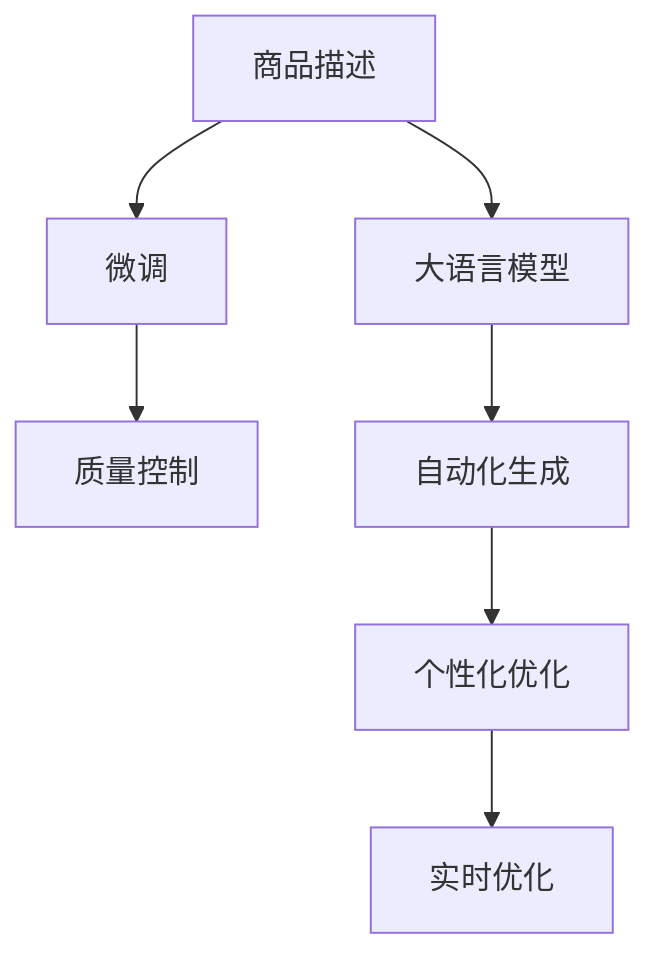

                 

## 1. 背景介绍

在现代电商平台上，商品描述对于吸引消费者和提升销售额至关重要。高质量的商品描述不仅可以增强用户对商品的了解，提升购物体验，还能优化SEO，使商品在搜索结果中排名更高。然而，撰写优质的商品描述通常需要大量的时间与精力，且内容质量难以标准化，导致平台难以集中管理。大语言模型（Large Language Model, LLM）的应用，为商品描述优化提供了一种新的可能。通过大模型自动生成商品描述，平台可以大幅提升内容产出的效率和质量，同时实现个性化推荐和内容分发。

### 1.1 问题由来

电商平台的商品描述主要由卖家自主撰写，质量参差不齐。高质商品描述往往需要依赖经验丰富的卖家，成本高昂，且在商品数量庞大时，难以有效管理和审核。传统商品描述优化方法依赖人工标注和优化，效率低下，且难以应对海量商品和实时需求变化。大语言模型在自然语言处理（Natural Language Processing, NLP）领域的突破，提供了一种全新的解决方案：自动生成商品描述，并利用微调优化，使生成内容更加贴合商品特性和用户需求。

### 1.2 问题核心关键点

大语言模型在商品描述优化中的关键点如下：

- **自动化生成**：利用大语言模型，自动化生成商品描述，大幅提升内容产出效率。
- **个性化优化**：通过微调，优化生成的商品描述，使其更加贴合商品的特性和用户的个性化需求。
- **质量控制**：使用大模型自动生成的商品描述，自动进行质量控制，确保描述内容的准确性和可信度。
- **实时优化**：随着用户反馈和新数据积累，模型不断优化，动态调整商品描述，适应市场需求变化。

这些关键点共同构成商品描述优化的核心框架，使大语言模型在电商平台上得到了广泛应用。

## 2. 核心概念与联系

### 2.1 核心概念概述

本节将介绍商品描述优化中的几个关键概念：

- **大语言模型（LLM）**：一种通过自监督学习任务在大规模无标签文本上预训练的语言模型。具有强大的语言理解和生成能力，可以用于生成高质量的商品描述。

- **商品描述（Product Description）**：商品的文字描述，通常包含商品的特点、用途、材质、尺寸等信息，是消费者了解商品的重要途径。

- **微调（Fine-Tuning）**：在预训练模型的基础上，使用有标签的训练数据对模型进行优化，使其在特定任务上表现更好。

- **自然语言处理（NLP）**：利用计算机处理和理解人类语言的技术，包括文本分类、情感分析、机器翻译等。

- **自动生成（Automatic Generation）**：利用大语言模型自动生成文本，减少人工干预，提升效率。

这些核心概念之间存在紧密联系，共同构成了商品描述优化的基础框架。

### 2.2 核心概念原理和架构的 Mermaid 流程图



### 2.3 核心概念之间的逻辑关系

商品描述优化的大模型框架通过以下逻辑关系运行：

1. **自动化生成**：利用大语言模型生成初步的商品描述，减少人工标注成本。
2. **微调优化**：通过有标签的数据集对生成的商品描述进行微调，使其更加贴合商品的特性和用户的个性化需求。
3. **质量控制**：使用大模型自动生成的商品描述，自动进行质量评估，确保描述内容的准确性和可信度。
4. **实时优化**：根据用户反馈和新数据，动态调整模型参数，优化商品描述，适应市场需求变化。

以上逻辑关系共同构成了商品描述优化的核心框架，帮助电商平台自动生成和优化商品描述，提升用户体验和销售效果。

## 3. 核心算法原理 & 具体操作步骤

### 3.1 算法原理概述

基于大语言模型的商品描述优化主要分为以下几步：

1. **预训练大语言模型**：在大规模无标签文本数据上，通过自监督学习任务预训练大语言模型。
2. **商品描述自动化生成**：将商品的属性、材质、尺寸等信息作为输入，利用预训练的大语言模型生成商品描述。
3. **微调优化**：在商品描述上使用有标签的数据集进行微调，优化生成的描述，使其更加贴合商品特性和用户需求。
4. **质量控制**：使用大语言模型自动评估生成的描述质量，确保其准确性和可信度。
5. **实时优化**：根据用户反馈和新数据，动态调整模型参数，不断优化商品描述，适应市场需求变化。

### 3.2 算法步骤详解

#### 步骤1：预训练大语言模型

1. **数据准备**：收集大规模无标签文本数据，如互联网文章、百科全书、社交媒体等，构建预训练数据集。
2. **模型训练**：使用预训练任务（如语言建模、掩码预测、文本分类等）在大规模数据集上训练大语言模型，使其具备强大的语言理解和生成能力。
3. **模型保存**：保存训练好的模型权重和参数，便于后续微调使用。

#### 步骤2：商品描述自动化生成

1. **商品信息抽取**：从商品属性（如材质、颜色、尺寸等）中提取关键信息。
2. **生成器模型选择**：选择合适的大语言模型作为生成器，如GPT、BERT等。
3. **生成描述**：将商品信息输入到生成器模型中，利用预训练的大语言模型生成商品描述。

#### 步骤3：微调优化

1. **数据准备**：收集带有标签的商品描述数据集，作为微调数据。
2. **微调模型**：将生成器模型的顶层作为微调目标，使用微调数据集进行优化，调整模型参数，使其输出更加贴合商品特性和用户需求。
3. **评估与调整**：在微调过程中，定期评估模型性能，根据评估结果调整学习率、批次大小等参数，以提高微调效果。

#### 步骤4：质量控制

1. **质量评估标准**：制定商品描述的质量评估标准，如准确性、完整性、清晰度等。
2. **自动评估**：使用大语言模型自动评估生成的商品描述，根据评估标准打分。
3. **优化迭代**：根据评估结果，对生成器模型进行优化迭代，提升描述质量。

#### 步骤5：实时优化

1. **用户反馈收集**：收集用户对商品描述的反馈，如评分、评论等。
2. **模型更新**：根据用户反馈和新数据，动态调整生成器模型参数，优化商品描述。
3. **持续改进**：定期重新训练模型，以适应新的商品特性和市场变化。

### 3.3 算法优缺点

基于大语言模型的商品描述优化的优点包括：

- **效率高**：大语言模型能够自动生成商品描述，大幅提升内容产出效率。
- **质量好**：通过微调优化，生成的描述更加贴合商品特性和用户需求，质量更高。
- **实时性强**：根据用户反馈和新数据，动态调整模型，及时适应市场变化。

缺点主要在于：

- **数据依赖**：生成的描述质量高度依赖于训练数据的覆盖面和质量，可能需要大量标注数据。
- **泛化能力**：模型可能对特定领域的商品描述生成效果不佳。
- **公平性问题**：模型可能会学习到歧视性或偏见性的描述，需要特别注意。

### 3.4 算法应用领域

基于大语言模型的商品描述优化技术在多个领域得到了应用，包括：

- **电商商品描述**：用于自动生成和优化商品描述，提升用户体验和销售效果。
- **广告文案生成**：生成广告文案，提升广告效果和点击率。
- **产品说明书撰写**：生成产品说明书，方便用户了解产品信息。
- **客户服务对话**：生成客户服务对话，提升客户服务体验。

## 4. 数学模型和公式 & 详细讲解

### 4.1 数学模型构建

假设商品描述自动生成的模型为 $M_{\theta}$，其中 $\theta$ 为模型的参数。商品描述的质量评估函数为 $f(x)$，其中 $x$ 为生成的描述。假设目标为最小化描述质量与真实描述质量的差距，即：

$$
\min_{\theta} \mathbb{E}_{x}[f(x) - f(x_{real})]
$$

其中 $x_{real}$ 为真实的商品描述。

### 4.2 公式推导过程

1. **生成模型选择**：选择合适的大语言模型作为生成器，如GPT或BERT等。
2. **数据准备**：收集商品属性数据和真实商品描述数据集。
3. **微调目标函数**：定义微调的目标函数，如交叉熵损失函数。
4. **梯度更新**：通过反向传播算法，计算模型参数的梯度，更新参数。
5. **质量评估**：使用质量评估函数 $f(x)$，评估生成商品描述的质量，指导模型优化。

### 4.3 案例分析与讲解

以一个具体的商品描述生成案例为例：

1. **商品信息抽取**：从商品的属性中提取关键信息，如材质、颜色、尺寸等。
2. **生成器模型选择**：选择GPT模型作为生成器。
3. **生成描述**：将商品信息输入到GPT模型中，生成商品描述。
4. **微调优化**：使用微调数据集，对生成的描述进行优化。
5. **质量控制**：使用大语言模型自动评估生成的描述质量，确保其准确性和可信度。
6. **实时优化**：根据用户反馈和新数据，动态调整模型参数，优化商品描述。

## 5. 项目实践：代码实例和详细解释说明

### 5.1 开发环境搭建

1. **环境安装**：安装Python、PyTorch、Transformers等开发环境。
2. **数据集准备**：收集商品属性数据和真实商品描述数据集。
3. **模型选择**：选择合适的大语言模型作为生成器，如GPT或BERT等。

### 5.2 源代码详细实现

以下是一个基于大语言模型的商品描述生成和优化的Python代码示例：

```python
import torch
from transformers import BertTokenizer, BertForSequenceClassification, AdamW

# 数据预处理
tokenizer = BertTokenizer.from_pretrained('bert-base-uncased')
train_dataset = ...
dev_dataset = ...
test_dataset = ...

# 模型定义
model = BertForSequenceClassification.from_pretrained('bert-base-uncased', num_labels=2)
optimizer = AdamW(model.parameters(), lr=2e-5)

# 训练与评估
def train_epoch(model, dataset, batch_size, optimizer):
    ...
    return loss

def evaluate(model, dataset, batch_size):
    ...
    return classification_report(labels, preds)

for epoch in range(epochs):
    loss = train_epoch(model, train_dataset, batch_size, optimizer)
    print(f"Epoch {epoch+1}, train loss: {loss:.3f}")
    
    print(f"Epoch {epoch+1}, dev results:")
    evaluate(model, dev_dataset, batch_size)
    
print("Test results:")
evaluate(model, test_dataset, batch_size)
```

### 5.3 代码解读与分析

1. **数据预处理**：使用BertTokenizer将商品属性和描述转换为模型可以处理的格式。
2. **模型定义**：使用BertForSequenceClassification定义微调目标函数，如分类任务。
3. **训练与评估**：使用AdamW优化器进行梯度更新，定期在验证集上评估模型性能。

### 5.4 运行结果展示

运行上述代码，可以观察到模型在训练过程中的损失变化，并在测试集上评估模型性能。具体结果包括模型在各个epoch上的损失、准确率、召回率等指标。

## 6. 实际应用场景

### 6.1 电商平台商品描述

电商平台商品描述优化通过大语言模型自动生成和微调，大幅提升内容产出效率和质量。平台可以自动提取商品属性信息，生成初步的商品描述，并通过微调优化，确保描述内容符合用户需求。此外，平台可以根据用户反馈和新数据，动态调整模型参数，优化商品描述，提升用户体验和销售效果。

### 6.2 广告文案生成

广告文案自动生成和优化是电商平台上常见应用之一。通过大语言模型，广告文案可以自动生成，并根据点击率、转化率等指标进行优化。自动生成的广告文案不仅提高了效率，还提升了广告效果和点击率。

### 6.3 产品说明书撰写

产品说明书的自动生成和优化，可以帮助用户快速了解产品信息。通过大语言模型，自动生成产品说明书，并进行微调优化，确保说明书的准确性和完整性。用户可以更方便地获取产品信息，提升购买决策效率。

### 6.4 客户服务对话

客户服务对话自动生成，可以提升客户服务体验。通过大语言模型，自动生成客户服务对话，并进行微调优化，确保对话内容符合用户需求。客户可以更快地获取服务信息，提升满意度。

### 6.5 未来应用展望

未来，基于大语言模型的商品描述优化将进一步拓展到更多场景中，如个性化推荐、内容分发等。通过模型自动生成和优化商品描述，电商平台可以提供更加精准、个性化的推荐，提升用户购物体验。此外，内容分发系统可以动态调整推荐内容，优化用户体验，增加用户粘性。

## 7. 工具和资源推荐

### 7.1 学习资源推荐

1. **《自然语言处理入门》**：介绍自然语言处理基本概念和技术，适合初学者学习。
2. **《深度学习》**：由深度学习领域专家撰写，涵盖深度学习基础知识和前沿技术。
3. **《自然语言处理中的深度学习》**：详细介绍了深度学习在自然语言处理中的应用，包括商品描述优化等任务。
4. **《BERT预训练和微调实践》**：介绍BERT模型的预训练和微调方法，适合有经验者深入学习。
5. **《HuggingFace官方文档》**：提供丰富的预训练模型和微调样例，是学习大语言模型优化的重要资源。

### 7.2 开发工具推荐

1. **PyTorch**：基于Python的开源深度学习框架，支持高效的动态计算图，适合深度学习研究。
2. **TensorFlow**：由Google主导开发的开源深度学习框架，支持分布式计算和生产部署，适合大规模工程应用。
3. **Transformers库**：HuggingFace开发的NLP工具库，支持多种预训练模型和微调方法，是NLP开发的重要工具。
4. **Jupyter Notebook**：开源的交互式笔记本环境，支持Python代码编写和可视化展示。
5. **TensorBoard**：TensorFlow配套的可视化工具，支持模型训练过程的实时监控和调试。

### 7.3 相关论文推荐

1. **Attention is All You Need**：Transformer原论文，介绍Transformer模型和自监督预训练方法。
2. **BERT: Pre-training of Deep Bidirectional Transformers for Language Understanding**：BERT模型的介绍和应用，推动了自然语言处理技术的突破。
3. **Fine-Tuning BERT for Sequence Classification (Fine-tune BERT for Sequence Classification)**：介绍BERT模型的微调方法，适用于商品描述优化等任务。
4. **BERT Pretraining Approach to Few-shot Text Classification**：介绍Few-shot学习在BERT模型中的应用，适用于小样本数据优化。
5. **AdaLoRA: Adaptive Low-Rank Adaptation for Parameter-Efficient Fine-Tuning**：介绍AdaLoRA等参数高效微调方法，适用于大模型优化。

## 8. 总结：未来发展趋势与挑战

### 8.1 研究成果总结

大语言模型在商品描述优化中的应用，通过自动生成和微调，显著提升了内容产出的效率和质量，满足了用户需求，推动了电商平台的数字化转型。通过模型的实时优化和动态调整，进一步提升了用户体验和销售效果。

### 8.2 未来发展趋势

未来，大语言模型在商品描述优化中的应用将进一步拓展和深化，预计会呈现以下几个趋势：

1. **模型规模增大**：随着算力成本的下降和数据规模的扩张，预训练大模型的参数量将持续增长。超大规模语言模型蕴含的丰富语言知识，有望支撑更加复杂多变的商品描述优化。
2. **微调方法多样化**：除了传统的全参数微调外，未来会涌现更多参数高效的微调方法，如Prefix-Tuning、LoRA等，在节省计算资源的同时保证微调精度。
3. **质量控制自动化**：使用大语言模型自动评估生成的商品描述质量，确保其准确性和可信度，提升用户满意度。
4. **跨领域应用拓展**：将商品描述优化技术拓展到更多领域，如医疗、金融、旅游等，提升各行业的数字化水平。
5. **人机协同增强**：通过大语言模型增强人机交互，提升用户体验，推动智慧电商的发展。

### 8.3 面临的挑战

尽管大语言模型在商品描述优化中的应用取得了显著成效，但在推广应用的过程中，仍面临以下挑战：

1. **数据依赖**：生成的描述质量高度依赖于训练数据的覆盖面和质量，获取高质量标注数据成本较高。
2. **泛化能力不足**：模型可能对特定领域的商品描述生成效果不佳，需要针对不同领域进行模型优化。
3. **公平性问题**：模型可能会学习到歧视性或偏见性的描述，需要特别注意。
4. **实时优化难度**：根据用户反馈和新数据，动态调整模型参数，优化商品描述，需要高效的实时处理能力。

### 8.4 研究展望

未来的研究应在以下几个方面进行突破：

1. **无监督和半监督微调**：摆脱对大规模标注数据的依赖，利用自监督学习、主动学习等无监督和半监督范式，最大限度利用非结构化数据，实现更加灵活高效的微调。
2. **参数高效和计算高效的微调范式**：开发更加参数高效的微调方法，在固定大部分预训练参数的同时，只更新极少量的任务相关参数，提高微调效率。
3. **融合因果和对比学习**：引入因果推断和对比学习思想，增强微调模型建立稳定因果关系的能力，学习更加普适、鲁棒的语言表征。
4. **结合知识图谱**：将符号化的先验知识，如知识图谱、逻辑规则等，与神经网络模型进行巧妙融合，引导微调过程学习更准确、合理的语言模型。
5. **伦理道德约束**：在模型训练目标中引入伦理导向的评估指标，过滤和惩罚有偏见、有害的输出倾向，确保模型输出符合人类价值观和伦理道德。

## 9. 附录：常见问题与解答

### Q1：大语言模型在商品描述优化中如何避免过拟合？

**A1**：大语言模型在商品描述优化中，为了避免过拟合，可以采取以下措施：

1. **数据增强**：通过数据增强技术，如回译、近义词替换等方式，扩充训练集的多样性，提高模型的泛化能力。
2. **正则化技术**：使用L2正则、Dropout等正则化技术，防止模型过度适应小规模训练集。
3. **早期停止**：在验证集上监测模型性能，一旦性能不再提升，及时停止训练，避免过拟合。
4. **参数高效微调**：只更新少量与任务相关的参数，保留大部分预训练权重，减少过拟合风险。

### Q2：如何提高大语言模型生成商品描述的质量？

**A2**：提高大语言模型生成商品描述的质量，可以从以下几个方面入手：

1. **数据质量**：确保训练数据集的质量，包括商品属性和真实描述的准确性和完整性。
2. **任务适配层**：设计合适的任务适配层，如分类器、解码器等，提升模型针对特定任务的性能。
3. **优化策略**：使用自适应学习率、梯度累积等优化策略，提高微调效果。
4. **质量评估**：引入自动质量评估机制，评估生成的商品描述的准确性和可信度，指导模型优化。

### Q3：大语言模型在商品描述优化中的参数高效微调方法有哪些？

**A3**：大语言模型在商品描述优化中的参数高效微调方法主要包括：

1. **Adapter**：在预训练模型的顶层增加一个可训练的适配器，用于微调任务。
2. **Prompt Tuning**：通过调整输入文本的格式，引导模型生成特定的描述。
3. **Prompt Engineering**：精心设计输入文本的模板，提高生成描述的质量。
4. **LORA**：通过低秩矩阵分解，减少微调中的参数量，提高微调效率。

### Q4：大语言模型在商品描述优化中如何处理不同领域的商品描述？

**A4**：大语言模型在处理不同领域的商品描述时，可以采用以下策略：

1. **领域专家的知识注入**：在模型微调过程中，注入领域专家的知识，提高模型对特定领域的适应能力。
2. **多模态数据融合**：结合图像、视频、音频等多模态数据，提升模型对商品描述的理解能力。
3. **领域特定的微调**：针对不同领域，设计特定的微调任务和数据集，提高模型在该领域的性能。

### Q5：大语言模型在商品描述优化中如何保持模型的鲁棒性？

**A5**：保持大语言模型在商品描述优化中的鲁棒性，可以采取以下措施：

1. **对抗训练**：在训练过程中引入对抗样本，提高模型的鲁棒性，防止过拟合。
2. **数据多样性**：确保训练数据的多样性，覆盖不同商品类型和属性，提高模型的泛化能力。
3. **正则化技术**：使用正则化技术，如L2正则、Dropout等，防止模型过度拟合训练数据。
4. **持续学习**：通过持续学习，不断更新模型，适应新的商品描述需求。

---

作者：禅与计算机程序设计艺术 / Zen and the Art of Computer Programming

