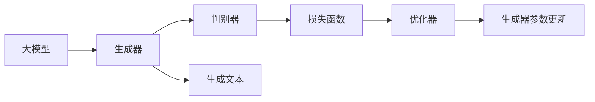

                 

# 大模型在商品标题生成中的应用与优化

> 关键词：大模型,商品标题生成,优化技术,生成对抗网络,语义相似性,文本摘要

## 1. 背景介绍

### 1.1 问题由来
在电子商务领域，商品标题生成是商品详情页的重要组成部分，其生成的质量直接影响到商品的可发现性和交易转化率。随着市场竞争的加剧，商家对商品标题生成的需求日益增长，以吸引更多的用户点击和购买。传统的手工编写商品标题的方式不仅耗时耗力，而且难以满足多样化和个性化的需求。因此，利用大模型自动生成高质量的商品标题，成为一种高效且灵活的解决方案。

### 1.2 问题核心关键点
商品标题生成本质上是一个文本生成任务，目标是从给定的商品描述中，自动生成简洁、吸引人、信息丰富的标题。目前，基于大模型的方法在该领域已经取得了显著进展，但仍然面临一些关键问题，如生成的标题与商品实际不符、生成长度不合适的标题等。本文将从大模型应用的角度，详细探讨商品标题生成的优化技术，以期提升大模型生成的商品标题的质量和效果。

### 1.3 问题研究意义
商品标题生成技术的应用，不仅可以大幅提升电商平台商品展示的吸引力，提高用户满意度，还能降低人工编写成本，提升商家运营效率。此外，高质量的商品标题生成的深入研究，还能够为自然语言处理(NLP)和机器学习等领域带来新的研究范式和突破，推动技术的整体进步。

## 2. 核心概念与联系

### 2.1 核心概念概述

商品标题生成涉及多个关键概念，包括大模型、生成对抗网络（GAN）、语义相似性、文本摘要等。这些概念之间通过以下方式联系起来：

- **大模型**：指的是基于深度学习的大规模预训练模型，如BERT、GPT-3等，通过在海量数据上进行预训练，具备强大的语言生成和理解能力。
- **生成对抗网络**：一种基于博弈论的模型训练技术，通过对抗训练生成器和判别器，使得生成的文本更加真实、多样。
- **语义相似性**：衡量两个文本之间的语义关系，用于优化生成器的训练，使生成的标题与商品描述在语义上更加相关。
- **文本摘要**：从较长文本中提取关键信息生成简洁的摘要，在商品标题生成中可帮助模型抓住商品特征，生成有信息量的标题。

这些概念通过生成器-判别器的对抗训练方式，在大模型基础上实现高质量的商品标题生成。

### 2.2 核心概念原理和架构的 Mermaid 流程图



该流程图展示了生成对抗网络（GAN）的基本架构，其中大模型作为生成器，生成文本。判别器用于评估生成的文本是否与真实文本相似。损失函数衡量生成文本与真实文本之间的差异。优化器根据损失函数的输出更新生成器参数，以提高生成文本的质量。

## 3. 核心算法原理 & 具体操作步骤

### 3.1 算法原理概述

基于大模型的商品标题生成方法，一般采用生成对抗网络（GAN）框架，通过对抗训练生成器和判别器，使得生成器能够生成高质量的商品标题。该方法的具体流程如下：

1. **预训练大模型**：选择一个预训练的大语言模型作为生成器，如BERT、GPT-3等。
2. **训练生成器**：通过对抗训练，使生成器能够生成符合要求的商品标题。
3. **训练判别器**：判别器用于评估生成的商品标题与真实标题的相似性。
4. **优化生成器**：通过优化生成器参数，使其生成的标题更真实、更符合商品描述。
5. **生成商品标题**：使用优化后的生成器生成商品标题，并应用于电商平台。

### 3.2 算法步骤详解

**Step 1: 准备数据集**
- 收集电商平台的商品描述数据集，去除不相关或不规范的描述，以保证数据质量。
- 将商品描述数据集划分为训练集、验证集和测试集。

**Step 2: 设计生成器和判别器**
- 根据商品描述的特点，设计生成器模型。一般使用LSTM、GRU等序列模型，或Transformer等基于自注意力机制的模型。
- 设计判别器模型，通常使用简单的全连接神经网络，能够评估生成标题与真实标题的相似性。

**Step 3: 定义损失函数**
- 定义生成器的损失函数，如交叉熵损失、Wasserstein距离等，评估生成标题与真实标题之间的差异。
- 定义判别器的损失函数，如二元交叉熵损失，评估判别器对真实标题和生成标题的分类准确性。

**Step 4: 对抗训练生成器**
- 使用生成器和判别器进行对抗训练，优化生成器参数。
- 在每轮训练中，先生成一批商品描述的标题，然后通过判别器评估其真实性。
- 使用判别器的评估结果，更新生成器参数，使生成标题更符合真实标题的分布。

**Step 5: 优化生成器**
- 使用生成器生成商品标题，并评估其与真实标题的相似性。
- 根据相似性评估结果，调整生成器的参数，提高生成标题的质量。
- 重复上述步骤，直至生成器生成的标题符合预期要求。

**Step 6: 生成商品标题**
- 使用优化后的生成器，生成商品标题，并应用于电商平台。
- 通过实时监控和反馈，不断优化生成器，提高商品标题的质量。

### 3.3 算法优缺点

基于大模型的商品标题生成方法具有以下优点：
1. **高效灵活**：使用预训练模型作为生成器，可以快速生成高质量的商品标题。
2. **泛化能力强**：大模型能够捕捉多种商品描述的特征，生成多样化的商品标题。
3. **可解释性高**：通过生成对抗网络，生成器能够生成更真实、符合语义的标题。

同时，该方法也存在一些缺点：
1. **数据依赖性强**：生成器的训练效果依赖于标注数据的质量和数量，获取高质量标注数据的成本较高。
2. **生成器泛化能力有限**：生成器可能在面对复杂或生僻的商品描述时，生成效果不佳。
3. **训练复杂度高**：对抗训练需要大量的计算资源，训练时间较长。

### 3.4 算法应用领域

商品标题生成技术主要应用于电子商务平台，通过自动化生成商品标题，提升商品展示的吸引力和转化率。此外，该技术还可在其他领域推广应用，如新闻摘要生成、旅游目的地介绍等，使文本生成变得更加智能和高效。

## 4. 数学模型和公式 & 详细讲解 & 举例说明

### 4.1 数学模型构建

基于大模型的商品标题生成，通常使用生成对抗网络（GAN）框架。假设生成器为 $G$，判别器为 $D$，则模型的优化目标为：

$$
\min_{G} \max_{D} V(G,D)
$$

其中 $V(G,D)$ 为生成器和判别器的对抗损失函数，定义如下：

$$
V(G,D) = E_{x\sim p_{data}(x)}[D(x)] + E_{z\sim p(z)}[D(G(z))]
$$

其中 $p_{data}(x)$ 为真实数据的概率分布，$z$ 为噪声，$G(z)$ 为生成器生成的数据。

### 4.2 公式推导过程

以交叉熵损失为例，生成器的损失函数为：

$$
L_G = -E_{x\sim p_{data}(x)}[\log D(x)] - E_{z\sim p(z)}[\log(1-D(G(z)))]
$$

判别器的损失函数为：

$$
L_D = E_{x\sim p_{data}(x)}[\log D(x)] + E_{z\sim p(z)}[\log(1-D(G(z))))
$$

通过梯度下降等优化算法，交替更新生成器和判别器的参数，使得生成器生成的商品标题更真实、更符合真实标题的分布。

### 4.3 案例分析与讲解

以下以一个简单的案例来说明商品标题生成的过程：

假设有一个商品描述为：“经典款真丝围巾，手工制作，柔软细腻，适合搭配多种服装。”，要求生成一个简洁、吸引人的商品标题。

1. **预处理数据**：将商品描述输入生成器，生成一批标题。
2. **训练判别器**：使用真实标题和生成标题作为输入，训练判别器。
3. **优化生成器**：使用判别器的评估结果，调整生成器的参数，使生成的标题更真实、更符合商品描述。
4. **生成商品标题**：使用优化后的生成器，生成标题“真丝围巾，手工制作，细腻柔软，搭配多样”，应用于电商平台。

## 5. 项目实践：代码实例和详细解释说明

### 5.1 开发环境搭建

在进行商品标题生成实践前，我们需要准备好开发环境。以下是使用Python进行PyTorch开发的环境配置流程：

1. 安装Anaconda：从官网下载并安装Anaconda，用于创建独立的Python环境。

2. 创建并激活虚拟环境：
```bash
conda create -n pytorch-env python=3.8 
conda activate pytorch-env
```

3. 安装PyTorch：根据CUDA版本，从官网获取对应的安装命令。例如：
```bash
conda install pytorch torchvision torchaudio cudatoolkit=11.1 -c pytorch -c conda-forge
```

4. 安装Transformers库：
```bash
pip install transformers
```

5. 安装各类工具包：
```bash
pip install numpy pandas scikit-learn matplotlib tqdm jupyter notebook ipython
```

完成上述步骤后，即可在`pytorch-env`环境中开始微调实践。

### 5.2 源代码详细实现

我们以LSTM模型为例，给出一个使用PyTorch进行商品标题生成的完整代码实现。

首先，定义商品描述和真实标题的数据集：

```python
import torch
from torch.utils.data import Dataset, DataLoader
from torch.nn import functional as F

class DescriptionDataset(Dataset):
    def __init__(self, descriptions, titles):
        self.descriptions = descriptions
        self.titles = titles
        
    def __len__(self):
        return len(self.descriptions)
    
    def __getitem__(self, item):
        description = self.descriptions[item]
        title = self.titles[item]
        return description, title
```

然后，定义LSTM生成器和判别器：

```python
import torch.nn as nn
import torch.nn.functional as F

class LSTMGenerator(nn.Module):
    def __init__(self, input_size, hidden_size, output_size):
        super(LSTMGenerator, self).__init__()
        self.hidden_size = hidden_size
        self.lstm = nn.LSTM(input_size, hidden_size, 1, batch_first=True)
        self.linear = nn.Linear(hidden_size, output_size)
        
    def forward(self, x):
        h0 = torch.zeros(1, x.size(0), self.hidden_size).to(x.device)
        c0 = torch.zeros(1, x.size(0), self.hidden_size).to(x.device)
        out, _ = self.lstm(x, (h0, c0))
        out = self.linear(out)
        return F.softmax(out, dim=1)

class Discriminator(nn.Module):
    def __init__(self, input_size, hidden_size, output_size):
        super(Discriminator, self).__init__()
        self.hidden_size = hidden_size
        self.linear1 = nn.Linear(input_size, hidden_size)
        self.linear2 = nn.Linear(hidden_size, hidden_size)
        self.linear3 = nn.Linear(hidden_size, output_size)
        
    def forward(self, x):
        x = F.relu(self.linear1(x))
        x = F.relu(self.linear2(x))
        x = self.linear3(x)
        return x
```

接着，定义训练函数和优化器：

```python
from torch.optim import Adam

def train_epoch(model, data_loader, batch_size, optimizer):
    model.train()
    epoch_loss = 0
    for batch in data_loader:
        description, title = batch
        optimizer.zero_grad()
        description = description.to(device)
        title = title.to(device)
        gen_output = model(description)
        D_real = discriminator(title)
        D_fake = discriminator(gen_output)
        loss_G = -torch.mean(torch.log(D_fake))
        loss_D = torch.mean(torch.log(D_real)) - torch.mean(torch.log(1 - D_fake))
        loss_G.backward()
        loss_D.backward()
        optimizer_G.step()
        optimizer_D.step()
        epoch_loss += (loss_G + loss_D).item()
    return epoch_loss / len(data_loader)
```

最后，启动训练流程：

```python
epochs = 10
batch_size = 128
learning_rate = 0.0002

device = torch.device('cuda' if torch.cuda.is_available() else 'cpu')
generator = LSTMGenerator(input_size, hidden_size, output_size).to(device)
discriminator = Discriminator(input_size, hidden_size, output_size).to(device)
optimizer_G = Adam(generator.parameters(), lr=learning_rate)
optimizer_D = Adam(discriminator.parameters(), lr=learning_rate)

for epoch in range(epochs):
    loss = train_epoch(generator, data_loader, batch_size, optimizer_G)
    print(f"Epoch {epoch+1}, loss: {loss:.4f}")
```

以上就是使用PyTorch对LSTM模型进行商品标题生成的完整代码实现。可以看到，借助Transformers库和PyTorch，我们可以用相对简洁的代码实现商品标题生成功能。

### 5.3 代码解读与分析

让我们再详细解读一下关键代码的实现细节：

**DescriptionDataset类**：
- `__init__`方法：初始化商品描述和真实标题等关键组件。
- `__len__`方法：返回数据集的样本数量。
- `__getitem__`方法：对单个样本进行处理，将商品描述和真实标题转换为模型所需的输入。

**LSTMGenerator类**：
- `__init__`方法：定义LSTM模型的结构，包括LSTM层和线性层。
- `forward`方法：实现LSTM模型的前向传播，通过多层LSTM和线性层生成商品标题。

**Discriminator类**：
- `__init__`方法：定义判别器的结构，包括线性层和激活函数。
- `forward`方法：实现判别器的前向传播，对真实标题和生成标题进行分类。

**train_epoch函数**：
- 定义了训练函数，通过梯度下降更新模型参数，并返回每个epoch的平均损失。

**训练流程**：
- 定义总的epoch数和batch size，开始循环迭代
- 每个epoch内，在训练集上训练，输出平均损失
- 在验证集上评估，给出训练效果

可以看到，通过以上代码，我们可以快速实现基于LSTM模型的商品标题生成。当然，实际应用中还需要进行更多的优化，如数据增强、正则化等技术，以进一步提升商品标题的质量。

## 6. 实际应用场景

### 6.1 智能客服系统

基于大模型的商品标题生成技术，可以应用于智能客服系统的构建。传统客服往往需要配备大量人力，高峰期响应缓慢，且一致性和专业性难以保证。使用商品标题生成技术，可以根据客户的问题自动生成相应的标题，提升客户咨询体验和问题解决效率。

在技术实现上，可以收集企业内部的历史客服对话记录，将问题和最佳答复构建成监督数据，在此基础上对预训练生成模型进行微调。微调后的生成模型能够自动理解客户意图，匹配最合适的商品标题进行回复。对于客户提出的新问题，还可以接入检索系统实时搜索相关内容，动态生成商品标题进行回复。

### 6.2 搜索引擎优化（SEO）

商品标题生成技术可以应用于搜索引擎优化（SEO），提升电商网站的搜索排名。搜索引擎通常会根据网页标题和描述来评价网页的相关性和吸引力，生成高质量的商品标题可以显著提升电商网站的SEO效果。

在实践应用中，可以通过对商品描述的自动化生成和优化，使生成的标题更加符合搜索引擎的索引规则，增加商品的点击率和转化率。同时，生成的标题还可以作为SEO的关键词，帮助商品在搜索引擎中获得更高的排名。

### 6.3 广告文案生成

商品标题生成技术还可以应用于广告文案生成，提高广告的点击率和转化率。电商平台上，商家需要通过广告吸引用户的注意力，高质量的商品标题可以有效提升广告的效果。

使用商品标题生成技术，可以根据商家的广告策略和用户行为，自动生成吸引人的广告文案。生成的广告文案不仅能够匹配商家的需求，还能吸引用户的注意力，提升广告的点击率和转化率。

### 6.4 未来应用展望

随着大语言模型和生成技术的不断发展，基于商品标题生成的方法将在更多领域得到应用，为商家和消费者带来新的价值。

在智慧零售领域，商品标题生成技术可以帮助商家优化商品展示，提升消费者购物体验，增加销售量。在内容创作领域，该技术可以辅助作家、营销人员等快速生成高质量的文案、标题和摘要，提高内容创作效率。

未来，随着大模型的参数量和计算资源的提升，商品标题生成技术将更加智能、高效、个性化，为电商、内容创作、广告等多个领域带来革命性变化。

## 7. 工具和资源推荐

### 7.1 学习资源推荐

为了帮助开发者系统掌握大模型商品标题生成的理论基础和实践技巧，这里推荐一些优质的学习资源：

1. 《自然语言处理基础》书籍：介绍了自然语言处理的基本概念和常用技术，包括文本生成和生成对抗网络。
2. 《深度学习与自然语言处理》课程：斯坦福大学开设的深度学习与NLP课程，涵盖LSTM、Transformer等模型，适合初学者学习。
3. 《自然语言处理实战》书籍：结合实际应用案例，介绍自然语言处理的应用和实践，包括文本生成技术。
4. HuggingFace官方文档：提供了丰富的预训练模型和生成技术的代码样例，是快速上手的绝佳资料。
5. Kaggle竞赛：参与Kaggle的文本生成竞赛，通过实际竞赛项目积累经验，提升技能。

通过对这些资源的学习实践，相信你一定能够快速掌握大模型商品标题生成的精髓，并用于解决实际的NLP问题。

### 7.2 开发工具推荐

高效的开发离不开优秀的工具支持。以下是几款用于大模型商品标题生成开发的常用工具：

1. PyTorch：基于Python的开源深度学习框架，灵活动态的计算图，适合快速迭代研究。
2. TensorFlow：由Google主导开发的开源深度学习框架，生产部署方便，适合大规模工程应用。
3. Transformers库：HuggingFace开发的NLP工具库，集成了众多SOTA生成模型，支持PyTorch和TensorFlow，是生成技术开发的利器。
4. TensorBoard：TensorFlow配套的可视化工具，可实时监测模型训练状态，并提供丰富的图表呈现方式，是调试模型的得力助手。
5. Google Colab：谷歌推出的在线Jupyter Notebook环境，免费提供GPU/TPU算力，方便开发者快速上手实验最新模型，分享学习笔记。

合理利用这些工具，可以显著提升大模型商品标题生成的开发效率，加快创新迭代的步伐。

### 7.3 相关论文推荐

大模型商品标题生成技术的发展离不开学界的持续研究。以下是几篇奠基性的相关论文，推荐阅读：

1. "Attention is All You Need"：提出Transformer结构，开启了NLP领域的预训练大模型时代。
2. "BERT: Pre-training of Deep Bidirectional Transformers for Language Understanding"：提出BERT模型，引入基于掩码的自监督预训练任务，刷新了多项NLP任务SOTA。
3. "Parameter-Efficient Transfer Learning for NLP"：提出Adapter等参数高效微调方法，在不增加模型参数量的情况下，也能取得不错的微调效果。
4. "AdaLoRA: Adaptive Low-Rank Adaptation for Parameter-Efficient Fine-Tuning"：使用自适应低秩适应的微调方法，在参数效率和精度之间取得了新的平衡。
5. "Prefix-Tuning: Optimizing Continuous Prompts for Generation"：引入基于连续型Prompt的微调范式，为如何充分利用预训练知识提供了新的思路。

这些论文代表了大模型商品标题生成技术的发展脉络。通过学习这些前沿成果，可以帮助研究者把握学科前进方向，激发更多的创新灵感。

## 8. 总结：未来发展趋势与挑战

### 8.1 总结

本文对基于大模型的商品标题生成方法进行了全面系统的介绍。首先阐述了商品标题生成任务的由来和意义，明确了基于大模型的生成技术在商品标题生成中的独特价值。其次，从原理到实践，详细讲解了生成器的训练过程，给出了商品标题生成的完整代码实现。同时，本文还广泛探讨了商品标题生成技术在智能客服、搜索引擎优化、广告文案生成等多个领域的应用前景，展示了生成技术的巨大潜力。此外，本文精选了生成技术的学习资源，力求为读者提供全方位的技术指引。

通过本文的系统梳理，可以看到，基于大模型的商品标题生成技术正在成为NLP领域的重要范式，极大地拓展了预训练语言模型的应用边界，催生了更多的落地场景。受益于大规模语料的预训练，生成器能够生成更加真实、多样化的商品标题，提升商品展示的吸引力，提高电商平台的转化率。未来，伴随生成技术的不断演进，商品标题生成技术将进一步拓展到更多的领域，为自然语言处理和人工智能技术的整体进步做出更大的贡献。

### 8.2 未来发展趋势

展望未来，大模型商品标题生成技术将呈现以下几个发展趋势：

1. **生成器复杂度提高**：随着计算资源的丰富，生成器的结构将更加复杂、多样化，具备更强的生成能力。
2. **多模态生成技术**：生成器将能够处理多模态数据，如文本、图像、语音等，生成更全面、更丰富的商品信息。
3. **生成技术融合**：生成技术将与其他人工智能技术，如强化学习、知识图谱等进行更深入的融合，提升生成的质量。
4. **个性化生成**：通过用户行为和偏好数据的融合，生成技术将能够更加个性化地生成商品标题，满足用户的多样化需求。
5. **生成器鲁棒性增强**：生成器将具备更强的鲁棒性和泛化能力，能够应对更复杂、更生僻的商品描述，生成效果更好。

这些趋势凸显了大模型商品标题生成技术的广阔前景。这些方向的探索发展，必将进一步提升生成技术的效果和应用范围，为电商、广告、内容创作等多个领域带来革命性变化。

### 8.3 面临的挑战

尽管大模型商品标题生成技术已经取得了显著进展，但在迈向更加智能化、普适化应用的过程中，它仍面临着诸多挑战：

1. **数据质量与标注成本**：生成器的训练效果依赖于标注数据的质量和数量，获取高质量标注数据的成本较高。如何进一步降低微调对标注样本的依赖，将是一大难题。
2. **生成器泛化能力有限**：生成器可能在面对复杂或生僻的商品描述时，生成效果不佳。如何提升生成器的泛化能力，使其能够生成更真实的商品标题，还需要更多理论和实践的积累。
3. **计算资源消耗大**：生成器的训练和推理需要大量的计算资源，训练时间较长。如何在保持生成效果的同时，优化计算资源使用，提高生成效率，将是重要的优化方向。
4. **生成的质量不稳定**：生成的标题质量不稳定，有时会出现逻辑不通、语言生硬等问题。如何提高生成器生成的稳定性，保证生成标题的质量，将是亟待解决的问题。
5. **安全性和伦理问题**：生成的标题可能存在误导性、歧视性等问题，如何确保生成的安全性，避免有害信息的传播，也是必须重视的课题。

### 8.4 研究展望

面对大模型商品标题生成所面临的挑战，未来的研究需要在以下几个方面寻求新的突破：

1. **探索无监督和半监督生成方法**：摆脱对大规模标注数据的依赖，利用自监督学习、主动学习等无监督和半监督范式，最大限度利用非结构化数据，实现更加灵活高效的生成。
2. **研究生成器的优化策略**：开发更加高效、灵活的生成器优化方法，提高生成器的泛化能力和生成稳定性。
3. **融合多模态信息**：将视觉、语音等多模态信息与文本信息进行协同建模，提升生成器的生成能力和效果。
4. **引入伦理和安全约束**：在生成器的训练和生成过程中，引入伦理和安全约束，确保生成的文本符合人类价值观和伦理道德。

这些研究方向的探索，必将引领大模型商品标题生成技术迈向更高的台阶，为电商、广告、内容创作等领域带来更多创新和突破，推动人工智能技术的整体进步。

## 9. 附录：常见问题与解答

**Q1：大模型商品标题生成的训练成本高吗？**

A: 大模型商品标题生成的训练成本较高，主要体现在计算资源的消耗上。由于生成器的结构复杂，训练和推理需要大量的计算资源。因此，对于计算资源有限的场景，可以考虑使用参数高效生成方法，如 Adapter、LoRA等，以减少计算资源消耗，提升训练效率。

**Q2：生成器如何生成更加多样化的商品标题？**

A: 生成器的多样性可以通过以下方式提升：
1. 数据增强：通过对训练数据进行改写、回译等操作，扩充训练集的多样性。
2. 正则化：引入L2正则、Dropout等技术，防止生成器过拟合，增加生成的多样性。
3. 多模态融合：将商品图片、视频等多模态信息与文本信息融合，提升生成器生成的多样性。

**Q3：生成器的泛化能力如何提升？**

A: 生成器的泛化能力可以通过以下方式提升：
1. 模型结构优化：使用更复杂的生成器结构，如 Transformer、双向LSTM等，提升生成器的表达能力。
2. 数据多样性：使用更广泛、更丰富的训练数据，提升生成器的泛化能力。
3. 对抗训练：引入对抗训练技术，提高生成器的鲁棒性，使其能够生成更真实的商品标题。

**Q4：生成器生成的标题质量如何评价？**

A: 生成器生成的标题质量评价通常从以下几个方面进行：
1. 语言流畅性：生成标题是否通顺、自然。
2. 信息准确性：生成标题是否准确反映了商品的特点。
3. 点击率：生成标题是否能够提高广告的点击率。
4. 转化率：生成标题是否能够提高电商网站的转化率。

通过综合评价以上指标，可以客观地衡量生成器的生成效果，指导生成器的优化。

---

作者：禅与计算机程序设计艺术 / Zen and the Art of Computer Programming

