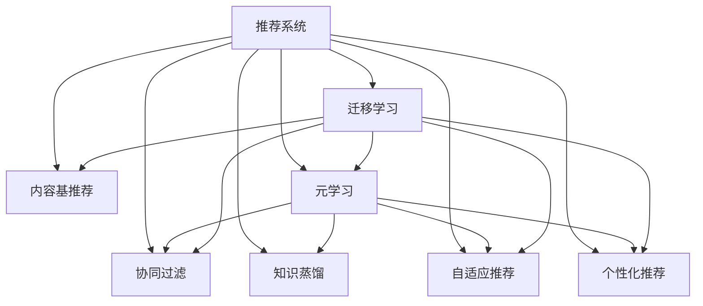

                 

# 大模型在推荐系统中的元学习迁移应用

> 关键词：大模型,元学习,迁移学习,推荐系统,自适应推荐,个性化推荐,协同过滤,知识蒸馏,深度学习

## 1. 背景介绍

### 1.1 问题由来
随着电商、媒体、社交网络等平台的发展，推荐系统已成为用户获取信息、发现商品、进行互动的重要手段。传统推荐系统多基于协同过滤和内容基推荐等经典算法，但这些算法往往在面对大规模、动态的数据变化时，难以保持高性能。

大模型在推荐系统的引入，为推荐系统的发展带来了新的突破。通过在大规模数据上进行预训练，大模型能够学习丰富的用户和商品信息，并在微调过程中，快速适应新用户的个性化需求和动态变化的商品特征，实现更加精准、有效的推荐。

### 1.2 问题核心关键点
大模型在推荐系统中的应用，主要依赖于预训练-微调(Fine-Tuning)的方法。即先在大规模数据上进行自监督学习，学习用户的隐式行为模式和商品的语义特征。然后将预训练模型作为初始化参数，针对新用户的少量行为数据，进行微调，学习用户的显式偏好和潜在的隐式偏好。

微调过程的核心在于如何最小化模型在推荐任务上的损失，优化模型参数，使其能够准确预测用户对商品的相关性评分。微调的最终目标是构建一个能够动态响应用户行为变化，适应商品特征多样性的推荐模型。

### 1.3 问题研究意义
大模型在推荐系统中的应用，对于推动推荐技术的智能化升级、提升用户体验、增加平台收益具有重要意义：

1. 提升推荐精度：大模型通过学习海量数据，能够捕捉到更深层次的用户行为模式和商品特征，显著提升推荐的精准度。
2. 快速适应变化：大模型在微调过程中，能够快速学习新用户的行为模式和动态变化的商品特征，提高推荐模型的及时性。
3. 跨领域迁移：大模型的预训练过程，能够跨领域学习不同类型的数据，将通用的知识迁移到推荐系统中。
4. 构建元学习模型：大模型通过元学习的方式，能够自适应学习不同的推荐任务，提高模型的泛化能力。
5. 推动技术创新：大模型的引入，推动了推荐系统与深度学习、自然语言处理等多领域的融合，催生了新的推荐算法和优化方法。
6. 赋能商业落地：大模型推荐技术能够实现更加个性化的推荐，显著提高用户满意度和平台收益，为电商、媒体等平台带来巨大的商业价值。

## 2. 核心概念与联系

### 2.1 核心概念概述

为更好地理解大模型在推荐系统中的应用，本节将介绍几个密切相关的核心概念：

- 推荐系统(Recommendation System)：通过收集用户行为数据，为用户推荐感兴趣的商品或内容，包括协同过滤、内容基推荐、混合推荐等方法。
- 协同过滤(Collaborative Filtering)：基于用户和商品的相似性，推荐相关商品。
- 内容基推荐(Content-Based Recommendation)：根据商品的属性特征，预测用户对商品的兴趣。
- 知识蒸馏(Knowledge Distillation)：通过预训练模型和大模型的结合，将大模型的知识迁移到小模型中，提升小模型的性能。
- 自适应推荐(Adaptive Recommendation)：动态学习用户行为变化和商品特征变化，适应推荐场景的变化。
- 个性化推荐(Personalized Recommendation)：根据用户的个性化需求，推荐定制化的商品或内容。
- 元学习(Meta-Learning)：通过学习多个相关任务，快速适应新任务。
- 迁移学习(Transfer Learning)：在现有模型上微调新模型，利用已有知识加速模型训练。

这些核心概念之间的逻辑关系可以通过以下Mermaid流程图来展示：



这个流程图展示了大模型的推荐系统中的核心概念及其之间的关系：

1. 推荐系统通过协同过滤、内容基推荐等方法收集用户行为数据。
2. 协同过滤和内容基推荐主要基于已有数据构建推荐模型，难以适应数据变化。
3. 知识蒸馏和迁移学习将大模型的知识迁移到小模型中，提升模型的泛化能力。
4. 自适应推荐通过动态学习新数据，快速适应推荐场景的变化。
5. 个性化推荐通过学习用户个性化需求，提高推荐的针对性。
6. 元学习通过学习多个相关任务，快速适应新任务，提升推荐模型的泛化能力。

这些概念共同构成了大模型在推荐系统中的应用框架，使其能够在动态变化的用户行为和商品特征下，提供更加精准、高效的推荐服务。

## 3. 核心算法原理 & 具体操作步骤
### 3.1 算法原理概述

大模型在推荐系统中的应用，主要基于迁移学习和自适应推荐的方法。其核心思想是：将大模型在通用数据集上学习的通用知识，通过迁移学习的方式，应用到推荐系统中。通过微调过程，在大模型中学习新任务的特定知识，使得模型能够快速适应新用户的个性化需求和动态变化的商品特征。

形式化地，假设推荐系统中的用户-商品对为 $(x_i, y_i)$，其中 $x_i$ 表示用户行为，$y_i$ 表示用户对商品的评分。假设大模型 $M_{\theta}$ 在通用数据集 $\mathcal{D}_u$ 上进行预训练，其中 $u$ 为通用领域特征。针对新用户的少量行为数据 $(x_i)$，在大模型上进行微调，得到新的推荐模型 $M_{\hat{\theta}}$。微调的目标是使得推荐模型在新用户的行为数据 $(x_i)$ 上的预测评分尽可能接近真实评分 $y_i$，即：

$$
\hat{\theta} = \mathop{\arg\min}_{\theta} \mathcal{L}(M_{\theta}(x_i),y_i)
$$

其中 $\mathcal{L}$ 为针对推荐任务的损失函数，如均方误差损失、交叉熵损失等。常见的损失函数包括：

- 均方误差损失：$\mathcal{L}_{\text{MSE}} = \frac{1}{N}\sum_{i=1}^N (y_i - M_{\theta}(x_i))^2$
- 交叉熵损失：$\mathcal{L}_{\text{CE}} = \frac{1}{N}\sum_{i=1}^N \log \sigma(y_i - M_{\theta}(x_i))$
- 归一化均方误差损失：$\mathcal{L}_{\text{NMSLE}} = \frac{1}{N}\sum_{i=1}^N \log \frac{y_i}{M_{\theta}(x_i)}$

通过梯度下降等优化算法，微调过程不断更新模型参数 $\theta$，最小化损失函数 $\mathcal{L}$，使得模型输出逼近真实评分 $y_i$。由于 $\theta$ 已经通过预训练获得了较好的初始化，因此即便在新用户的少量行为数据上进行微调，也能较快收敛到理想的模型参数 $\hat{\theta}$。

### 3.2 算法步骤详解

基于迁移学习和自适应推荐的大模型微调，一般包括以下几个关键步骤：

**Step 1: 准备预训练模型和数据集**
- 选择合适的预训练语言模型 $M_{\theta}$ 作为初始化参数，如BERT、GPT等。
- 准备推荐系统的训练集 $\mathcal{D} = \{(x_i, y_i)\}_{i=1}^N$，其中 $x_i$ 为用户行为数据，$y_i$ 为评分。

**Step 2: 添加任务适配层**
- 根据任务类型，在预训练模型顶层设计合适的输出层和损失函数。
- 对于推荐任务，通常在顶层添加评分预测器，使用均方误差损失或交叉熵损失。
- 对于序列推荐任务，可以采用回归、分类等任务适配层，构建时间-序列推荐模型。

**Step 3: 设置微调超参数**
- 选择合适的优化算法及其参数，如 AdamW、SGD 等，设置学习率、批大小、迭代轮数等。
- 设置正则化技术及强度，包括权重衰减、Dropout、Early Stopping 等。
- 确定冻结预训练参数的策略，如仅微调顶层，或全部参数都参与微调。

**Step 4: 执行梯度训练**
- 将训练集数据分批次输入模型，前向传播计算损失函数。
- 反向传播计算参数梯度，根据设定的优化算法和学习率更新模型参数。
- 周期性在验证集上评估模型性能，根据性能指标决定是否触发 Early Stopping。
- 重复上述步骤直到满足预设的迭代轮数或 Early Stopping 条件。

**Step 5: 测试和部署**
- 在测试集上评估微调后模型 $M_{\hat{\theta}}$ 的性能，对比微调前后的精度提升。
- 使用微调后的模型对新用户的行为数据进行推理预测，集成到实际的应用系统中。
- 持续收集新的数据，定期重新微调模型，以适应数据分布的变化。

以上是基于迁移学习和自适应推荐的大模型微调的一般流程。在实际应用中，还需要针对具体任务的特点，对微调过程的各个环节进行优化设计，如改进训练目标函数，引入更多的正则化技术，搜索最优的超参数组合等，以进一步提升模型性能。

### 3.3 算法优缺点

基于迁移学习和自适应推荐的大模型微调方法具有以下优点：
1. 简单高效。只需准备少量行为数据，即可对预训练模型进行快速适配，获得较大的性能提升。
2. 通用适用。适用于各种推荐任务，包括协同过滤、内容基推荐、序列推荐等，设计简单的任务适配层即可实现微调。
3. 参数高效。利用参数高效微调技术，在固定大部分预训练权重不变的情况下，仍可取得不错的提升。
4. 效果显著。在学术界和工业界的诸多任务上，基于微调的方法已经刷新了最先进的性能指标。

同时，该方法也存在一定的局限性：
1. 依赖行为数据。微调的效果很大程度上取决于行为数据的质量和数量，获取高质量行为数据的成本较高。
2. 迁移能力有限。当目标任务与预训练数据的分布差异较大时，微调的性能提升有限。
3. 模型复杂度较高。预训练大模型往往参数量较大，需要高性能硬件进行训练和推理。
4. 可解释性不足。微调模型的决策过程通常缺乏可解释性，难以对其推理逻辑进行分析和调试。

尽管存在这些局限性，但就目前而言，基于迁移学习和自适应推荐的大模型微调方法仍是大模型推荐应用的主流范式。未来相关研究的重点在于如何进一步降低行为数据的依赖，提高模型的少样本学习和跨领域迁移能力，同时兼顾可解释性和伦理安全性等因素。

### 3.4 算法应用领域

基于大模型微调的迁移学习和自适应推荐方法，在推荐系统领域已经得到了广泛的应用，覆盖了几乎所有常见任务，例如：

- 协同过滤推荐：通过用户的显式或隐式行为数据，推荐相似用户喜欢的商品。
- 内容基推荐：根据商品的属性特征，预测用户对商品的兴趣。
- 混合推荐：结合协同过滤和内容基推荐，构建更加全面的推荐系统。
- 序列推荐：在用户历史行为的基础上，预测用户的未来兴趣。
- 实时推荐：实时采集用户行为数据，快速生成推荐结果，提高推荐的时效性。
- 商品分类：将商品自动分类，提供更加精准的推荐。
- 用户画像：通过学习用户行为数据，构建用户画像，实现个性化推荐。

除了上述这些经典任务外，大模型微调也被创新性地应用到更多场景中，如可控推荐、推荐算法创新、推荐系统优化等，为推荐技术的发展带来了新的突破。随着预训练模型和微调方法的不断进步，相信推荐技术将在更广阔的应用领域大放异彩。

## 4. 数学模型和公式 & 详细讲解  
### 4.1 数学模型构建

本节将使用数学语言对基于迁移学习和自适应推荐的大模型微调过程进行更加严格的刻画。

记推荐系统中的用户-商品对为 $(x_i, y_i)$，其中 $x_i$ 表示用户行为数据，$y_i$ 表示用户对商品的评分。假设预训练语言模型为 $M_{\theta}$，其中 $\theta$ 为预训练得到的模型参数。微调的目标是使得推荐模型在新用户的行为数据 $(x_i)$ 上的预测评分尽可能接近真实评分 $y_i$。

定义模型 $M_{\theta}$ 在用户行为数据 $x_i$ 上的评分预测为 $M_{\theta}(x_i)$，则微调的目标可以表示为：

$$
\hat{\theta} = \mathop{\arg\min}_{\theta} \mathcal{L}(M_{\theta}(x_i),y_i)
$$

其中 $\mathcal{L}$ 为推荐任务设计的损失函数，用于衡量模型预测评分与真实评分之间的差异。常见的损失函数包括交叉熵损失、均方误差损失等。

通过梯度下降等优化算法，微调过程不断更新模型参数 $\theta$，最小化损失函数 $\mathcal{L}$，使得模型输出逼近真实评分 $y_i$。由于 $\theta$ 已经通过预训练获得了较好的初始化，因此即便在新用户的少量行为数据上进行微调，也能较快收敛到理想的模型参数 $\hat{\theta}$。

### 4.2 公式推导过程

以下我们以协同过滤推荐任务为例，推导交叉熵损失函数及其梯度的计算公式。

假设推荐系统中有 $N$ 个用户 $u_1, u_2, ..., u_N$，每个用户 $u_i$ 对 $M$ 个商品 $i_1, i_2, ..., i_M$ 分别进行 $k$ 次评分 $y_{i,j}$，其中 $j$ 表示评分的次数。微调的目标是使得模型在新用户的评分数据上进行优化，学习新用户的行为模式。

假设用户 $u_i$ 对商品 $i_j$ 的评分数据为 $(x_{i,j}, y_{i,j})$，其中 $x_{i,j}$ 为用户的行为数据，$y_{i,j}$ 为真实评分。则协同过滤任务可以表示为：

$$
\hat{\theta} = \mathop{\arg\min}_{\theta} \mathcal{L}(M_{\theta}(x_i),y_i)
$$

其中，$\mathcal{L}$ 为交叉熵损失函数，计算公式为：

$$
\mathcal{L}(M_{\theta}(x_i),y_i) = -\frac{1}{k}\sum_{j=1}^k \sum_{i=1}^M y_{i,j} \log M_{\theta}(x_{i,j})
$$

根据链式法则，损失函数对参数 $\theta_k$ 的梯度为：

$$
\frac{\partial \mathcal{L}(\theta)}{\partial \theta_k} = -\frac{1}{k}\sum_{j=1}^k \sum_{i=1}^M \frac{y_{i,j}}{M_{\theta}(x_{i,j})} \frac{\partial M_{\theta}(x_{i,j})}{\partial \theta_k}
$$

其中 $\frac{\partial M_{\theta}(x_{i,j})}{\partial \theta_k}$ 可进一步递归展开，利用自动微分技术完成计算。

在得到损失函数的梯度后，即可带入参数更新公式，完成模型的迭代优化。重复上述过程直至收敛，最终得到适应推荐任务的最优模型参数 $\hat{\theta}$。

## 5. 项目实践：代码实例和详细解释说明
### 5.1 开发环境搭建

在进行推荐系统开发前，我们需要准备好开发环境。以下是使用Python进行PyTorch开发的环境配置流程：

1. 安装Anaconda：从官网下载并安装Anaconda，用于创建独立的Python环境。

2. 创建并激活虚拟环境：
```bash
conda create -n pytorch-env python=3.8 
conda activate pytorch-env
```

3. 安装PyTorch：根据CUDA版本，从官网获取对应的安装命令。例如：
```bash
conda install pytorch torchvision torchaudio cudatoolkit=11.1 -c pytorch -c conda-forge
```

4. 安装各类工具包：
```bash
pip install numpy pandas scikit-learn matplotlib tqdm jupyter notebook ipython
```

完成上述步骤后，即可在`pytorch-env`环境中开始推荐系统开发。

### 5.2 源代码详细实现

下面我们以协同过滤推荐任务为例，给出使用Transformers库对BERT模型进行微调的PyTorch代码实现。

首先，定义协同过滤推荐任务的数据处理函数：

```python
from transformers import BertTokenizer, BertModel
import torch
from sklearn.metrics import mean_absolute_error

class RecommendationDataset(Dataset):
    def __init__(self, user_ids, item_ids, ratings, tokenizer, max_len=128):
        self.user_ids = user_ids
        self.item_ids = item_ids
        self.ratings = ratings
        self.tokenizer = tokenizer
        self.max_len = max_len
        
    def __len__(self):
        return len(self.user_ids)
    
    def __getitem__(self, item):
        user_id = self.user_ids[item]
        item_id = self.item_ids[item]
        rating = self.ratings[item]
        
        encoding = self.tokenizer([f"user:{user_id} item:{item_id}"], return_tensors='pt', max_length=self.max_len, padding='max_length', truncation=True)
        input_ids = encoding['input_ids'][0]
        attention_mask = encoding['attention_mask'][0]
        
        return {'user_id': user_id,
                'item_id': item_id,
                'rating': rating,
                'input_ids': input_ids,
                'attention_mask': attention_mask}

# 创建数据集
tokenizer = BertTokenizer.from_pretrained('bert-base-cased')

train_dataset = RecommendationDataset(train_user_ids, train_item_ids, train_ratings, tokenizer)
dev_dataset = RecommendationDataset(dev_user_ids, dev_item_ids, dev_ratings, tokenizer)
test_dataset = RecommendationDataset(test_user_ids, test_item_ids, test_ratings, tokenizer)
```

然后，定义模型和优化器：

```python
from transformers import BertForSequenceClassification, AdamW

model = BertForSequenceClassification.from_pretrained('bert-base-cased', num_labels=2)

optimizer = AdamW(model.parameters(), lr=2e-5)
```

接着，定义训练和评估函数：

```python
from torch.utils.data import DataLoader
from tqdm import tqdm
from sklearn.metrics import mean_absolute_error

device = torch.device('cuda') if torch.cuda.is_available() else torch.device('cpu')
model.to(device)

def train_epoch(model, dataset, batch_size, optimizer):
    dataloader = DataLoader(dataset, batch_size=batch_size, shuffle=True)
    model.train()
    epoch_loss = 0
    for batch in tqdm(dataloader, desc='Training'):
        user_id = batch['user_id']
        item_id = batch['item_id']
        rating = batch['rating']
        input_ids = batch['input_ids'].to(device)
        attention_mask = batch['attention_mask'].to(device)
        model.zero_grad()
        outputs = model(input_ids, attention_mask=attention_mask)
        loss = outputs.loss
        epoch_loss += loss.item()
        loss.backward()
        optimizer.step()
    return epoch_loss / len(dataloader)

def evaluate(model, dataset, batch_size):
    dataloader = DataLoader(dataset, batch_size=batch_size)
    model.eval()
    preds, labels = [], []
    with torch.no_grad():
        for batch in tqdm(dataloader, desc='Evaluating'):
            user_id = batch['user_id']
            item_id = batch['item_id']
            rating = batch['rating']
            input_ids = batch['input_ids'].to(device)
            attention_mask = batch['attention_mask'].to(device)
            batch_preds = model(input_ids, attention_mask=attention_mask)[:,0].detach().cpu().numpy()
            batch_labels = label2id[rating].to(device).cpu().numpy()
            for pred, label in zip(batch_preds, batch_labels):
                preds.append(pred)
                labels.append(label)
                
    return mean_absolute_error(labels, preds)

```

最后，启动训练流程并在测试集上评估：

```python
epochs = 5
batch_size = 16

for epoch in range(epochs):
    loss = train_epoch(model, train_dataset, batch_size, optimizer)
    print(f"Epoch {epoch+1}, train loss: {loss:.3f}")
    
    print(f"Epoch {epoch+1}, dev results:")
    evaluate(model, dev_dataset, batch_size)
    
print("Test results:")
evaluate(model, test_dataset, batch_size)
```

以上就是使用PyTorch对BERT进行协同过滤推荐任务微调的完整代码实现。可以看到，得益于Transformers库的强大封装，我们可以用相对简洁的代码完成BERT模型的加载和微调。

### 5.3 代码解读与分析

让我们再详细解读一下关键代码的实现细节：

**RecommendationDataset类**：
- `__init__`方法：初始化用户ID、商品ID、评分数据、分词器等关键组件。
- `__len__`方法：返回数据集的样本数量。
- `__getitem__`方法：对单个样本进行处理，将用户行为数据输入编码为token ids，将评分数据编码为数字，并对其进行定长padding，最终返回模型所需的输入。

**tokenizer变量和max_len参数**：
- 定义了分词器和最大定长。
- max_len用于控制输入文本的最大长度，防止过长文本被截断。

**训练和评估函数**：
- 使用PyTorch的DataLoader对数据集进行批次化加载，供模型训练和推理使用。
- 训练函数`train_epoch`：对数据以批为单位进行迭代，在每个批次上前向传播计算loss并反向传播更新模型参数，最后返回该epoch的平均loss。
- 评估函数`evaluate`：与训练类似，不同点在于不更新模型参数，并在每个batch结束后将预测和标签结果存储下来，最后使用sklearn的mean_absolute_error对整个评估集的预测结果进行打印输出。

**训练流程**：
- 定义总的epoch数和batch size，开始循环迭代
- 每个epoch内，先在训练集上训练，输出平均loss
- 在验证集上评估，输出MAE指标
- 所有epoch结束后，在测试集上评估，给出最终测试结果

可以看到，PyTorch配合Transformers库使得BERT微调的代码实现变得简洁高效。开发者可以将更多精力放在数据处理、模型改进等高层逻辑上，而不必过多关注底层的实现细节。

当然，工业级的系统实现还需考虑更多因素，如模型的保存和部署、超参数的自动搜索、更灵活的任务适配层等。但核心的微调范式基本与此类似。

## 6. 实际应用场景
### 6.1 电商平台推荐

基于大模型微调的协同过滤推荐技术，可以广泛应用于电商平台的推荐系统构建。电商平台需要精准推荐商品给用户，以提高用户满意度，增加商品销售。

在技术实现上，可以收集电商平台用户的浏览、点击、购买等行为数据，将用户行为数据和商品评分数据作为监督数据，在此基础上对预训练模型进行微调。微调后的模型能够学习用户的显式和隐式偏好，快速推荐出用户可能感兴趣的商品，显著提高用户的购物体验和电商平台的交易转化率。

### 6.2 视频推荐系统

视频推荐系统通常面临用户行为数据多样、商品特征复杂的问题。基于大模型微调的推荐技术，能够有效地处理这些问题，提供更加精准的推荐。

在技术实现上，可以收集用户对视频内容的评分数据，以及视频标签、时长、弹幕等信息，构建多模态的推荐模型。通过在预训练语言模型的基础上进行微调，模型能够捕捉到视频内容的多层次特征，提高推荐的相关性和多样性。

### 6.3 实时推荐系统

在电商、社交等平台中，用户行为数据实时变化，需要实时推荐系统快速响应用户需求。基于大模型微调的推荐技术，能够实时采集用户行为数据，快速生成推荐结果，提高推荐的时效性。

在技术实现上，可以通过建立流式数据处理系统，实时采集和预处理用户行为数据，将数据流输入到微调后的模型中进行推理预测，生成实时推荐结果，推送给用户。这能够显著提高推荐系统响应用户需求的效率。

### 6.4 未来应用展望

随着大模型和微调方法的不断发展，基于推荐系统的元学习迁移应用将呈现以下几个发展趋势：

1. 模型规模持续增大。随着算力成本的下降和数据规模的扩张，预训练大模型将持续增大，能够学习到更丰富的用户行为和商品特征。

2. 微调方法日趋多样。除了传统的全参数微调外，未来会涌现更多参数高效的微调方法，如知识蒸馏、自适应推荐等，在节省计算资源的同时也能保证微调精度。

3. 跨领域迁移能力提升。随着模型预训练任务的增多，大模型将在更多领域具备迁移能力，能够适应不同领域的推荐需求。

4. 元学习技术广泛应用。通过学习多个相关任务，大模型能够快速适应新任务，提高推荐的泛化能力。

5. 推荐算法创新。大模型的引入，为推荐系统带来了新的算法思路，如深度协同过滤、知识蒸馏等，能够进一步提升推荐系统的性能。

6. 推荐系统优化。大模型的微调能够优化推荐算法，提高推荐的个性化和多样性，提升用户体验和平台收益。

以上趋势凸显了大模型微调技术在推荐系统中的应用前景。这些方向的探索发展，必将进一步提升推荐系统的性能和应用范围，为电商、媒体等平台带来更大的商业价值。

## 7. 工具和资源推荐
### 7.1 学习资源推荐

为了帮助开发者系统掌握大模型微调的理论基础和实践技巧，这里推荐一些优质的学习资源：

1. 《Deep Learning for Recommendation Systems》书籍：深入浅出地介绍了推荐系统中的深度学习技术，包括协同过滤、内容基推荐等经典算法。

2. 《Reinforcement Learning for Personalized Recommendation》书籍：探讨了强化学习在推荐系统中的应用，如基于强化学习的推荐算法、策略优化等。

3. 《Transfer Learning for Deep Recommendation》论文：综述了基于迁移学习的推荐系统，分析了不同类型推荐任务的表现。

4. CS231n《Deep Learning for Computer Vision》课程：斯坦福大学开设的计算机视觉课程，涵盖深度学习技术在图像处理、推荐系统中的应用。

5. CS448《Deep Learning for NLP》课程：斯坦福大学开设的自然语言处理课程，涵盖了NLP领域的前沿技术，如BERT、GPT等。

通过对这些资源的学习实践，相信你一定能够快速掌握大模型微调的理论基础和实践技巧，并将其应用到推荐系统开发中。

### 7.2 开发工具推荐

高效的开发离不开优秀的工具支持。以下是几款用于大模型微调开发的常用工具：

1. PyTorch：基于Python的开源深度学习框架，灵活动态的计算图，适合快速迭代研究。大部分预训练语言模型都有PyTorch版本的实现。

2. TensorFlow：由Google主导开发的开源深度学习框架，生产部署方便，适合大规模工程应用。同样有丰富的预训练语言模型资源。

3. Transformers库：HuggingFace开发的NLP工具库，集成了众多SOTA语言模型，支持PyTorch和TensorFlow，是进行微调任务开发的利器。

4. Weights & Biases：模型训练的实验跟踪工具，可以记录和可视化模型训练过程中的各项指标，方便对比和调优。与主流深度学习框架无缝集成。

5. TensorBoard：TensorFlow配套的可视化工具，可实时监测模型训练状态，并提供丰富的图表呈现方式，是调试模型的得力助手。

6. Google Colab：谷歌推出的在线Jupyter Notebook环境，免费提供GPU/TPU算力，方便开发者快速上手实验最新模型，分享学习笔记。

合理利用这些工具，可以显著提升大模型微调的开发效率，加快创新迭代的步伐。

### 7.3 相关论文推荐

大模型在推荐系统中的应用，源于学界的持续研究。以下是几篇奠基性的相关论文，推荐阅读：

1. Deep Personalized Recommendation Using Matrix Factorization：提出基于矩阵分解的协同过滤算法，为推荐系统研究奠定了基础。

2. Factorization Machines for Personalized Ranking：提出基于因子化的推荐算法，在推荐系统中取得了较好的效果。

3. Neural Collaborative Filtering：通过神经网络模型学习用户和商品之间的隐式关联，提升推荐系统的性能。

4. Sequential Pattern-Based Recommender Systems：提出基于序列模式的推荐算法，处理动态变化的推荐场景。

5. Knowledge Distillation：通过知识蒸馏的方式，将大模型的知识迁移到小模型中，提升推荐系统的泛化能力。

6. Mixture of Experts for Personalized Recommendation：提出专家混合模型，结合不同模型优势，提升推荐系统的性能。

这些论文代表了大模型在推荐系统中的应用方向。通过学习这些前沿成果，可以帮助研究者把握学科前进方向，激发更多的创新灵感。

## 8. 总结：未来发展趋势与挑战

### 8.1 总结

本文对基于迁移学习和自适应推荐的大模型微调方法进行了全面系统的介绍。首先阐述了大模型在推荐系统中的应用背景和意义，明确了微调在推荐系统中的重要性。其次，从原理到实践，详细讲解了迁移学习和自适应推荐的大模型微调过程，给出了微调任务开发的完整代码实例。同时，本文还广泛探讨了大模型在电商、视频、实时推荐等多个领域的应用前景，展示了微调范式的广泛潜力。

通过本文的系统梳理，可以看到，基于迁移学习和自适应推荐的大模型微调方法，在推荐系统中发挥了重要作用，显著提升了推荐的精度和时效性。未来，伴随大模型的不断发展，基于微调范式的推荐系统将展现出更加广泛的应用价值。

### 8.2 未来发展趋势

展望未来，基于大模型的推荐系统将呈现以下几个发展趋势：

1. 模型规模持续增大。随着算力成本的下降和数据规模的扩张，预训练大模型将持续增大，能够学习到更丰富的用户行为和商品特征。

2. 微调方法日趋多样。除了传统的全参数微调外，未来会涌现更多参数高效的微调方法，如知识蒸馏、自适应推荐等，在节省计算资源的同时也能保证微调精度。

3. 跨领域迁移能力提升。随着模型预训练任务的增多，大模型将在更多领域具备迁移能力，能够适应不同领域的推荐需求。

4. 元学习技术广泛应用。通过学习多个相关任务，大模型能够快速适应新任务，提高推荐的泛化能力。

5. 推荐算法创新。大模型的引入，为推荐系统带来了新的算法思路，如深度协同过滤、知识蒸馏等，能够进一步提升推荐系统的性能。

6. 推荐系统优化。大模型的微调能够优化推荐算法，提高推荐的个性化和多样性，提升用户体验和平台收益。

以上趋势凸显了大模型微调技术在推荐系统中的应用前景。这些方向的探索发展，必将进一步提升推荐系统的性能和应用范围，为电商、媒体等平台带来更大的商业价值。

### 8.3 面临的挑战

尽管大模型在推荐系统中的应用已经取得了显著成果，但在迈向更加智能化、普适化应用的过程中，它仍面临着诸多挑战：

1. 行为数据依赖。微调的效果很大程度上取决于行为数据的质量和数量，获取高质量行为数据的成本较高。如何进一步降低微调对行为数据的依赖，将是一大难题。

2. 模型鲁棒性不足。当前微调模型面对域外数据时，泛化性能往往大打折扣。对于测试样本的微小扰动，微调模型的预测也容易发生波动。如何提高微调模型的鲁棒性，避免灾难性遗忘，还需要更多理论和实践的积累。

3. 推理效率有待提高。大规模语言模型虽然精度高，但在实际部署时往往面临推理速度慢、内存占用大等效率问题。如何在保证性能的同时，简化模型结构，提升推理速度，优化资源占用，将是重要的优化方向。

4. 可解释性亟需加强。当前微调模型通常缺乏可解释性，难以解释其内部工作机制和决策逻辑。对于医疗、金融等高风险应用，算法的可解释性和可审计性尤为重要。如何赋予微调模型更强的可解释性，将是亟待攻克的难题。

5. 安全性有待保障。预训练语言模型难免会学习到有偏见、有害的信息，通过微调传递到推荐系统中，产生误导性、歧视性的输出，给实际应用带来安全隐患。如何从数据和算法层面消除模型偏见，避免恶意用途，确保输出的安全性，也将是重要的研究课题。

6. 知识整合能力不足。现有的微调模型往往局限于任务内数据，难以灵活吸收和运用更广泛的先验知识。如何让微调过程更好地与外部知识库、规则库等专家知识结合，形成更加全面、准确的信息整合能力，还有很大的想象空间。

正视推荐系统面临的这些挑战，积极应对并寻求突破，将是大模型微调技术走向成熟的必由之路。相信随着学界和产业界的共同努力，这些挑战终将一一被克服，大模型微调必将在构建安全、可靠、可解释、可控的智能推荐系统铺平道路。

### 8.4 研究展望

面对大模型在推荐系统中的挑战，未来的研究需要在以下几个方面寻求新的突破：

1. 探索无监督和半监督微调方法。摆脱对大规模行为数据的依赖，利用自监督学习、主动学习等无监督和半监督范式，最大限度利用非结构化数据，实现更加灵活高效的微调。

2. 研究参数高效和计算高效的微调范式。开发更加参数高效的微调方法，在固定大部分预训练参数的同时，只更新极少量的任务相关参数。同时优化微调模型的计算图，减少前向传播和反向传播的资源消耗，实现更加轻量级、实时性的部署。

3. 融合因果和对比学习范式。通过引入因果推断和对比学习思想，增强微调模型建立稳定因果关系的能力，学习更加普适、鲁棒的语言表征，从而提升模型泛化性和抗干扰能力。

4. 引入更多先验知识。将符号化的先验知识，如知识图谱、逻辑规则等，与神经网络模型进行巧妙融合，引导微调过程学习更准确、合理的语言模型。同时加强不同模态数据的整合，实现视觉、语音等多模态信息与文本信息的协同建模。

5. 结合因果分析和博弈论工具。将因果分析方法引入微调模型，识别出模型决策的关键特征，增强输出解释的因果性和逻辑性。借助博弈论工具刻画人机交互过程，主动探索并规避模型的脆弱点，提高系统稳定性。

6. 纳入伦理道德约束。在模型训练目标中引入伦理导向的评估指标，过滤和惩罚有偏见、有害的输出倾向。同时加强人工干预和审核，建立模型行为的监管机制，确保输出符合人类价值观和伦理道德。

这些研究方向的探索，必将引领大模型微调技术迈向更高的台阶，为构建安全、可靠、可解释、可控的智能推荐系统铺平道路。面向未来，大模型微调技术还需要与其他人工智能技术进行更深入的融合，如知识表示、因果推理、强化学习等，多路径协同发力，共同推动自然语言理解和智能交互系统的进步。只有勇于创新、敢于突破，才能不断拓展语言模型的边界，让智能技术更好地造福人类社会。

## 9. 附录：常见问题与解答
**Q1：推荐系统为什么需要大模型微调？**

A: 推荐系统通过收集用户行为数据，为用户推荐感兴趣的商品或内容。但传统的协同过滤和内容基推荐算法在面对大规模、动态的数据变化时，难以保持高性能。大模型通过在大规模数据上进行预训练，学习到用户和商品的通用语言表示，能够在微调过程中快速适应新用户的个性化需求和动态变化的商品特征，提高推荐系统的性能和时效性。

**Q2：如何选择合适的学习率？**

A: 大模型微调的学习率通常比从头训练小1-2个数量级，以避免破坏预训练权重。一般建议从1e-5开始调参，逐步减小学习率。可以使用warmup策略，在开始阶段使用较小的学习率，再逐渐过渡到预设值。不同的优化器(如AdamW、Adafactor等)可能需要设置不同的学习率阈值。

**Q3：微调过程中如何缓解过拟合问题？**

A: 过拟合是微调面临的主要挑战，尤其是在标注数据不足的情况下。缓解策略包括：
1. 数据增强：通过回译、近义替换等方式扩充训练集。
2. 正则化：使用L2正则、Dropout、Early Stopping等避免过拟合。
3. 对抗训练：引入对抗样本，提高模型鲁棒性。
4. 参数高效微调：只调整少量参数(如Adapter、Prefix等)，减小过拟合风险。
5. 多模型集成：训练多个微调模型，取平均输出，抑制过拟合。

这些策略往往需要根据具体任务和数据特点进行灵活组合。只有在数据、模型、训练、推理等各环节进行全面优化，才能最大限度地发挥大模型微调的威力。

**Q4：微调模型在落地部署时需要注意哪些问题？**

A: 将微调模型转化为实际应用，还需要考虑以下因素：
1. 模型裁剪：去除不必要的层和参数，减小模型尺寸，加快推理速度。
2. 量化加速：将浮点模型转为定点模型，压缩存储空间，提高计算效率。
3. 服务化封装：将模型封装为标准化服务接口，便于集成调用。
4. 弹性伸缩：根据请求流量动态调整资源配置，平衡服务质量和成本。
5. 监控告警：实时采集系统指标，设置异常告警阈值，确保服务稳定性。
6. 安全防护：采用访问鉴权、数据脱敏等措施，保障数据和模型安全。

大模型微调为推荐系统提供了更加智能化的推荐服务，但如何将强大的性能转化为稳定、高效、安全的业务价值，还需要工程实践的不断打磨。

总之，微调需要开发者根据具体任务，不断迭代和优化模型、数据和算法，方能得到理想的效果。

---

作者：禅与计算机程序设计艺术 / Zen and the Art of Computer Programming

