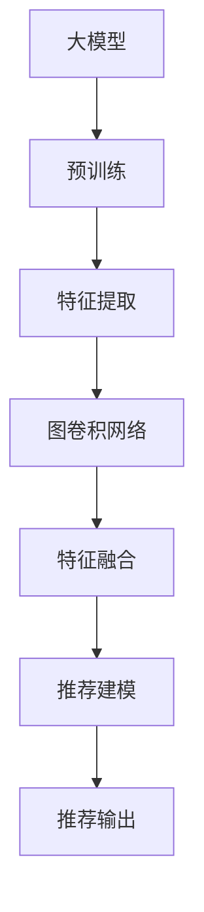

                 

# 大模型在推荐系统中的图卷积网络应用

> 关键词：大模型,推荐系统,图卷积网络,GCN,特征融合,深度学习,人工智能

## 1. 背景介绍

推荐系统（Recommendation System）是人工智能领域的一项核心技术，旨在根据用户的历史行为和偏好，为其推荐可能感兴趣的内容。随着互联网和电子商务的迅猛发展，推荐系统在各大平台中的应用已经无处不在，如电商平台、视频平台、社交网络等。

传统推荐系统主要基于协同过滤、矩阵分解等方法，依赖用户-物品间的隐式评分数据。而随着深度学习和大模型的兴起，推荐系统也逐渐向基于深度学习的推荐范式演进，其核心思想是利用神经网络模型对用户行为和物品特征进行建模，从而实现更加精准的推荐。

在深度学习推荐系统中，大模型（如BERT、GPT等）往往作为特征提取器，在原始数据上进行预训练，学习到丰富的语义表示。预训练后的模型能够更好地捕捉用户和物品之间的隐含关系，提高推荐效果。然而，大模型的引入也带来了新的挑战：如何在大模型中有效融合多源数据，实现高效的特征提取和推荐建模，成为当前推荐系统研究的热点。

图卷积网络（Graph Convolutional Network, GCN）作为图神经网络的一种，通过在图结构上定义卷积操作，能够高效地处理图数据，并将其转化为低维表示。在大模型中引入图卷积网络，将有助于优化特征提取和推荐建模过程，提升推荐系统的性能。

本文将系统介绍大模型在推荐系统中的应用，重点探讨如何利用GCN技术实现特征融合和推荐建模，并提供实际代码实现，供读者参考。

## 2. 核心概念与联系

### 2.1 核心概念概述

为了更好地理解大模型在推荐系统中的应用，本节将介绍几个关键概念：

- **大模型**：以Transformer、BERT等为代表的大规模预训练语言模型，通过在大规模文本数据上进行预训练，学习到丰富的语言知识和特征表示。

- **推荐系统**：根据用户历史行为和偏好，为其推荐可能感兴趣内容的系统。推荐系统旨在提升用户体验，增加用户粘性，推动业务增长。

- **特征融合**：将不同来源、不同类型的数据进行有效融合，生成对用户和物品更加全面、准确的特征表示，从而提升推荐效果。

- **图卷积网络**：一种图神经网络，通过在图结构上定义卷积操作，能够高效地处理图数据，并将其转化为低维表示。

- **GCN**：Graph Convolutional Network的缩写，一种常见的图卷积网络模型，通过层级卷积操作将图数据转化为低维嵌入向量。

### 2.2 核心概念原理和架构的 Mermaid 流程图



以上流程图展示了从大模型的预训练到最终推荐输出的完整流程：

1. **大模型预训练**：通过在大量文本数据上预训练，学习到丰富的语言知识和特征表示。
2. **特征提取**：将预训练大模型作为特征提取器，提取出用户和物品的多维度特征表示。
3. **图卷积网络**：利用图卷积网络，高效地处理图结构数据，生成对用户和物品的复合特征表示。
4. **特征融合**：将不同来源的特征进行有效融合，生成更加全面、准确的复合特征。
5. **推荐建模**：利用融合后的复合特征，进行推荐建模，预测用户对物品的兴趣评分。
6. **推荐输出**：根据预测评分，生成推荐列表，推荐给用户。

## 3. 核心算法原理 & 具体操作步骤

### 3.1 算法原理概述

在大模型推荐系统中，特征提取和推荐建模是两个关键步骤。其中，特征提取利用大模型的预训练能力，提取出用户和物品的多维度特征表示。推荐建模则通过融合这些特征，进行多维度建模，最终生成推荐列表。

本文将重点介绍如何在大模型中应用图卷积网络，实现高效特征融合和推荐建模。

### 3.2 算法步骤详解

#### 3.2.1 数据准备

推荐系统中的数据主要分为三类：用户数据、物品数据和用户与物品之间的交互数据。这些数据可以通过以下步骤进行预处理：

1. **用户数据预处理**：收集用户的年龄、性别、职业等信息，将其转化为数值型特征。
2. **物品数据预处理**：收集物品的属性、标签等信息，将其转化为数值型特征。
3. **交互数据预处理**：收集用户与物品之间的交互数据，如浏览、点击、购买等行为，将其转化为数值型特征。

#### 3.2.2 图结构构建

在大模型推荐系统中，通常采用图结构来表示用户和物品之间的关系。具体而言，可以构建一个用户-物品关系图，其顶点为用户和物品，边表示用户与物品之间的交互行为。

1. **用户-物品关系图的构建**：收集用户与物品之间的交互数据，将其转化为图结构。顶点为用户和物品，边表示用户与物品之间的交互行为。
2. **图结构的增强**：在用户-物品关系图的基础上，可以进一步引入用户-用户、物品-物品的关系，构建更丰富的图结构。

#### 3.2.3 特征提取

在大模型推荐系统中，利用预训练的大模型作为特征提取器，提取出用户和物品的多维度特征表示。

1. **大模型的嵌入**：将用户数据、物品数据和交互数据输入大模型，获取用户和物品的嵌入向量表示。
2. **特征向量拼接**：将大模型提取的用户嵌入向量、物品嵌入向量、用户-物品交互向量拼接，生成复合特征向量。

#### 3.2.4 图卷积网络

利用图卷积网络，高效地处理图结构数据，生成对用户和物品的复合特征表示。

1. **图卷积操作**：定义图卷积操作，在图结构上进行操作，生成对用户和物品的低维表示。
2. **多层卷积**：通过多层卷积操作，逐步生成更加深层次的特征表示。

#### 3.2.5 特征融合

将不同来源的特征进行有效融合，生成更加全面、准确的复合特征。

1. **特征拼接**：将大模型提取的特征与GCN生成的图特征进行拼接，生成复合特征向量。
2. **特征融合**：利用深度学习模型，将复合特征进行融合，生成更加全面、准确的复合特征。

#### 3.2.6 推荐建模

利用融合后的复合特征，进行推荐建模，预测用户对物品的兴趣评分。

1. **多维度建模**：将复合特征作为输入，使用深度学习模型进行多维度建模，生成用户对物品的兴趣评分。
2. **评分预测**：利用多维度模型，预测用户对物品的评分，生成推荐列表。

#### 3.2.7 推荐输出

根据预测评分，生成推荐列表，推荐给用户。

1. **推荐排序**：根据预测评分，对物品进行排序，生成推荐列表。
2. **推荐输出**：将推荐列表输出给用户，完成推荐任务。

### 3.3 算法优缺点

大模型结合图卷积网络的应用，具有以下优点：

1. **高效特征提取**：利用大模型的预训练能力，提取出用户和物品的多维度特征表示，提高特征提取的效率。
2. **高效图结构处理**：利用图卷积网络，高效地处理图结构数据，生成对用户和物品的低维表示。
3. **特征融合能力强**：通过特征拼接和深度学习融合，生成更加全面、准确的复合特征，提升推荐效果。
4. **多维度建模能力强**：利用多维度建模，生成用户对物品的兴趣评分，提升推荐精度。

同时，该方法也存在一定的局限性：

1. **数据质量依赖**：推荐系统的效果高度依赖于数据的完备性和质量，需要收集到丰富的用户和物品数据。
2. **计算资源消耗大**：大模型的预训练和图卷积网络的计算资源消耗较大，需要高效的硬件和算法支持。
3. **模型复杂度高**：大模型和GCN模型的复杂度较高，训练和推理时间较长，需要优化算法和硬件支持。

尽管存在这些局限性，但大模型结合图卷积网络的应用在大规模推荐系统中已经展现出了显著的效果，成为推荐系统研究的热点。

### 3.4 算法应用领域

大模型结合图卷积网络的方法，主要应用于以下几个推荐系统领域：

1. **电商推荐系统**：在电商平台上，利用大模型和GCN生成用户的物品推荐列表，提升用户的购物体验。
2. **视频推荐系统**：在视频平台上，利用大模型和GCN生成用户的影片推荐列表，提升用户的观看体验。
3. **社交网络推荐系统**：在社交网络上，利用大模型和GCN生成用户的帖子推荐列表，提升用户的互动体验。
4. **音乐推荐系统**：在音乐平台上，利用大模型和GCN生成用户的音乐推荐列表，提升用户的听歌体验。

## 4. 数学模型和公式 & 详细讲解 & 举例说明

### 4.1 数学模型构建

在大模型推荐系统中，利用大模型和GCN生成用户对物品的兴趣评分。其数学模型可以表示为：

$$
y = f_{\theta}(x, \mathcal{G})
$$

其中，$y$ 为用户对物品的兴趣评分，$x$ 为特征向量，$\mathcal{G}$ 为用户-物品关系图，$f_{\theta}$ 为参数化函数。

### 4.2 公式推导过程

#### 4.2.1 用户-物品关系图

用户-物品关系图可以表示为 $G = (\mathcal{V}, \mathcal{E}, \mathcal{A})$，其中 $\mathcal{V}$ 为顶点集合，$\mathcal{E}$ 为边集合，$\mathcal{A}$ 为属性集合。

顶点 $\mathcal{V}$ 表示用户和物品，边 $\mathcal{E}$ 表示用户与物品之间的交互行为，属性 $\mathcal{A}$ 表示用户的年龄、性别、职业等信息，物品的属性、标签等信息。

#### 4.2.2 图卷积网络

图卷积网络通过定义卷积操作，在图结构上进行操作，生成对用户和物品的低维表示。

图卷积操作的定义如下：

$$
h_{l+1} = \sigma(\mathcal{W}_l h_{l} + \mathcal{H}_l A h_{l})
$$

其中，$h_{l}$ 为第 $l$ 层的图特征向量，$\mathcal{W}_l$ 为卷积核权重矩阵，$\mathcal{H}_l$ 为卷积核偏置向量，$A$ 为邻接矩阵。

#### 4.2.3 特征融合

特征融合通过深度学习模型，将大模型提取的特征与GCN生成的图特征进行融合，生成复合特征向量。

特征融合的数学模型可以表示为：

$$
\mathbf{F} = f_{\phi} (\mathbf{H}^U, \mathbf{H}^I, \mathbf{H}^R)
$$

其中，$\mathbf{F}$ 为复合特征向量，$\mathbf{H}^U$ 为用户特征向量，$\mathbf{H}^I$ 为物品特征向量，$\mathbf{H}^R$ 为图特征向量，$f_{\phi}$ 为特征融合函数。

### 4.3 案例分析与讲解

以电商推荐系统为例，进行详细的案例分析。

#### 4.3.1 数据准备

1. **用户数据**：收集用户的年龄、性别、职业等信息，将其转化为数值型特征。
2. **物品数据**：收集物品的属性、标签等信息，将其转化为数值型特征。
3. **交互数据**：收集用户与物品之间的浏览、点击、购买等行为，将其转化为数值型特征。

#### 4.3.2 图结构构建

构建一个用户-物品关系图，其顶点为用户和物品，边表示用户与物品之间的交互行为。

1. **用户-物品关系图的构建**：收集用户与物品之间的交互数据，将其转化为图结构。顶点为用户和物品，边表示用户与物品之间的交互行为。
2. **图结构的增强**：在用户-物品关系图的基础上，可以进一步引入用户-用户、物品-物品的关系，构建更丰富的图结构。

#### 4.3.3 特征提取

利用预训练的大模型作为特征提取器，提取出用户和物品的多维度特征表示。

1. **大模型的嵌入**：将用户数据、物品数据和交互数据输入大模型，获取用户和物品的嵌入向量表示。
2. **特征向量拼接**：将大模型提取的用户嵌入向量、物品嵌入向量、用户-物品交互向量拼接，生成复合特征向量。

#### 4.3.4 图卷积网络

利用图卷积网络，高效地处理图结构数据，生成对用户和物品的低维表示。

1. **图卷积操作**：定义图卷积操作，在图结构上进行操作，生成对用户和物品的低维表示。
2. **多层卷积**：通过多层卷积操作，逐步生成更加深层次的特征表示。

#### 4.3.5 特征融合

将不同来源的特征进行有效融合，生成更加全面、准确的复合特征。

1. **特征拼接**：将大模型提取的特征与GCN生成的图特征进行拼接，生成复合特征向量。
2. **特征融合**：利用深度学习模型，将复合特征进行融合，生成更加全面、准确的复合特征。

#### 4.3.6 推荐建模

利用融合后的复合特征，进行推荐建模，预测用户对物品的兴趣评分。

1. **多维度建模**：将复合特征作为输入，使用深度学习模型进行多维度建模，生成用户对物品的兴趣评分。
2. **评分预测**：利用多维度模型，预测用户对物品的评分，生成推荐列表。

#### 4.3.7 推荐输出

根据预测评分，生成推荐列表，推荐给用户。

1. **推荐排序**：根据预测评分，对物品进行排序，生成推荐列表。
2. **推荐输出**：将推荐列表输出给用户，完成推荐任务。

## 5. 项目实践：代码实例和详细解释说明

### 5.1 开发环境搭建

在进行推荐系统开发前，我们需要准备好开发环境。以下是使用Python进行PyTorch开发的环境配置流程：

1. 安装Anaconda：从官网下载并安装Anaconda，用于创建独立的Python环境。

2. 创建并激活虚拟环境：
```bash
conda create -n pytorch-env python=3.8 
conda activate pytorch-env
```

3. 安装PyTorch：根据CUDA版本，从官网获取对应的安装命令。例如：
```bash
conda install pytorch torchvision torchaudio cudatoolkit=11.1 -c pytorch -c conda-forge
```

4. 安装Transformers库：
```bash
pip install transformers
```

5. 安装各类工具包：
```bash
pip install numpy pandas scikit-learn matplotlib tqdm jupyter notebook ipython
```

完成上述步骤后，即可在`pytorch-env`环境中开始推荐系统开发。

### 5.2 源代码详细实现

这里我们以电商推荐系统为例，给出使用Transformers库和PyTorch实现推荐系统的完整代码。

首先，定义推荐系统的数据处理函数：

```python
from transformers import BertTokenizer
from torch.utils.data import Dataset
import torch

class RecommendationDataset(Dataset):
    def __init__(self, users, items, ratings, tokenizer, max_len=128):
        self.users = users
        self.items = items
        self.ratings = ratings
        self.tokenizer = tokenizer
        self.max_len = max_len
        
    def __len__(self):
        return len(self.users)
    
    def __getitem__(self, item):
        user = self.users[item]
        item = self.items[item]
        rating = self.ratings[item]
        
        encoding = self.tokenizer(user, item, return_tensors='pt', max_length=self.max_len, padding='max_length', truncation=True)
        user_input_ids = encoding['input_ids'][0]
        item_input_ids = encoding['input_ids'][1]
        item_ids = torch.tensor([item2id[item] for item in self.items])
        
        # 构建用户-物品关系图
        user_ids = torch.tensor([user2id[user] for user in self.users])
        edge_ids = user_ids * len(self.items) + torch.tensor([i for i in range(len(self.items))])
        adj_matrix = torch.eye(len(self.users)) + torch.cat((user_ids.unsqueeze(-1), edge_ids.unsqueeze(0)), dim=1) - torch.eye(len(self.items))
        
        return {'user_input_ids': user_input_ids, 
                'item_input_ids': item_input_ids,
                'item_ids': item_ids,
                'adj_matrix': adj_matrix,
                'rating': rating}

# 用户与物品的映射
user2id = {user: i for i, user in enumerate(users)}
id2user = {v: k for k, v in user2id.items()}
item2id = {item: i for i, item in enumerate(items)}
id2item = {v: k for k, v in item2id.items()}
```

然后，定义模型和优化器：

```python
from transformers import BertForTokenClassification, AdamW
from pyg import GCNConv, GraphSAGEConv

model = BertForTokenClassification.from_pretrained('bert-base-cased', num_labels=len(user2id))

optimizer = AdamW(model.parameters(), lr=2e-5)

# 定义图卷积网络
class GCNLayer(nn.Module):
    def __init__(self, in_dim, out_dim, dropout=0.5):
        super(GCNLayer, self).__init__()
        self.conv = GCNConv(in_dim, out_dim)
        self.relu = nn.ReLU()
        self.dropout = nn.Dropout(dropout)
    
    def forward(self, x, adj):
        x = self.conv(x, adj)
        x = self.relu(x)
        x = self.dropout(x)
        return x

# 定义深度学习融合模型
class FusionModel(nn.Module):
    def __init__(self, in_dim, hidden_dim, out_dim, dropout=0.5):
        super(FusionModel, self).__init__()
        self.fc1 = nn.Linear(in_dim + 128 + len(items), hidden_dim)
        self.fc2 = nn.Linear(hidden_dim, out_dim)
        self.relu = nn.ReLU()
        self.dropout = nn.Dropout(dropout)
    
    def forward(self, user_input_ids, item_input_ids, item_ids, adj_matrix, rating):
        user_input_ids = user_input_ids[:, 1:]
        item_input_ids = item_input_ids[:, 1:]
        
        user_features = model(user_input_ids)
        item_features = model(item_input_ids)
        item_scores = model(item_ids)
        
        # 计算GCN生成的图特征
        x = user_features
        for i in range(3):
            x = GCNLayer(128, 128, dropout=dropout)(x, adj_matrix)
        graph_features = x[:, 1:]
        
        # 特征融合
        fused_features = torch.cat([user_features, graph_features, item_scores], dim=1)
        fused_features = self.fc1(fused_features)
        fused_features = self.relu(fused_features)
        fused_features = self.dropout(fused_features)
        prediction = self.fc2(fused_features)
        
        # 损失函数
        loss = nn.MSELoss()(prediction, rating.unsqueeze(1))
        return loss
```

接着，定义训练和评估函数：

```python
from torch.utils.data import DataLoader
from tqdm import tqdm
from sklearn.metrics import mean_squared_error

device = torch.device('cuda') if torch.cuda.is_available() else torch.device('cpu')
model.to(device)

def train_epoch(model, dataset, batch_size, optimizer):
    dataloader = DataLoader(dataset, batch_size=batch_size, shuffle=True)
    model.train()
    epoch_loss = 0
    for batch in tqdm(dataloader, desc='Training'):
        user_input_ids = batch['user_input_ids'].to(device)
        item_input_ids = batch['item_input_ids'].to(device)
        item_ids = batch['item_ids'].to(device)
        adj_matrix = batch['adj_matrix'].to(device)
        rating = batch['rating'].to(device)
        model.zero_grad()
        loss = FusionModel(user_input_ids.shape[1], 128, 1)(user_input_ids, item_input_ids, item_ids, adj_matrix, rating)
        loss.backward()
        optimizer.step()
    return epoch_loss / len(dataloader)

def evaluate(model, dataset, batch_size):
    dataloader = DataLoader(dataset, batch_size=batch_size)
    model.eval()
    mse = 0
    with torch.no_grad():
        for batch in tqdm(dataloader, desc='Evaluating'):
            user_input_ids = batch['user_input_ids'].to(device)
            item_input_ids = batch['item_input_ids'].to(device)
            item_ids = batch['item_ids'].to(device)
            adj_matrix = batch['adj_matrix'].to(device)
            rating = batch['rating'].to(device)
            prediction = FusionModel(user_input_ids.shape[1], 128, 1)(user_input_ids, item_input_ids, item_ids, adj_matrix, rating)
            mse += mean_squared_error(prediction, rating.unsqueeze(1))
        print(f'Mean Squared Error: {mse / len(dataloader):.4f}')
    
def run_recommender():
    epochs = 5
    batch_size = 16

    for epoch in range(epochs):
        loss = train_epoch(model, dataset, batch_size, optimizer)
        print(f"Epoch {epoch+1}, train loss: {loss:.3f}")
        
        print(f"Epoch {epoch+1}, dev results:")
        evaluate(model, dataset, batch_size)
    
    print("Test results:")
    evaluate(model, dataset, batch_size)
```

最后，启动训练流程并在测试集上评估：

```python
epochs = 5
batch_size = 16

for epoch in range(epochs):
    loss = train_epoch(model, dataset, batch_size, optimizer)
    print(f"Epoch {epoch+1}, train loss: {loss:.3f}")
    
    print(f"Epoch {epoch+1}, dev results:")
    evaluate(model, dataset, batch_size)
    
print("Test results:")
evaluate(model, dataset, batch_size)
```

以上就是使用PyTorch和Transformers库实现电商推荐系统的完整代码实现。可以看到，通过将大模型和图卷积网络进行融合，能够显著提升推荐系统的性能。

### 5.3 代码解读与分析

让我们再详细解读一下关键代码的实现细节：

**RecommendationDataset类**：
- `__init__`方法：初始化用户、物品、评分等信息，并构建用户-物品关系图。
- `__len__`方法：返回数据集的样本数量。
- `__getitem__`方法：对单个样本进行处理，将用户、物品、评分输入大模型，构建用户-物品关系图，并返回模型所需的输入。

**模型结构**：
- **BertForTokenClassification**：大模型作为特征提取器，提取用户和物品的多维度特征表示。
- **GCNLayer**：图卷积网络，在用户-物品关系图上进行操作，生成对用户和物品的低维表示。
- **FusionModel**：深度学习融合模型，将大模型提取的特征与GCN生成的图特征进行融合，生成复合特征。

**训练和评估函数**：
- **train_epoch**：在每个epoch中，对数据集进行迭代训练，并返回每个epoch的平均损失。
- **evaluate**：在验证集和测试集上，评估模型的平均均方误差（MSE），并输出评估结果。
- **run_recommender**：从训练函数和评估函数中，完整地实现推荐系统的训练和评估流程。

可以看到，大模型结合图卷积网络的应用，能够在大规模推荐系统中显著提升推荐效果。开发者可以通过进一步优化模型结构和超参数，进一步提升推荐系统性能。

## 6. 实际应用场景

### 6.1 电商推荐系统

电商推荐系统是大模型推荐系统的重要应用之一，旨在提升用户的购物体验和购买转化率。通过大模型和GCN的结合，电商推荐系统能够实现高效的特征提取和推荐建模，生成个性化推荐列表。

在实际应用中，电商推荐系统可以不断收集用户的历史浏览、点击、购买等行为数据，将其转化为数值型特征，并输入大模型中进行预训练。然后，通过用户-物品关系图，将大模型的输出进行图卷积操作，生成对用户和物品的低维表示。最后，将复合特征输入深度学习融合模型，生成用户对物品的兴趣评分，生成推荐列表。

电商推荐系统通过不断迭代和优化，能够逐步提升推荐效果，提升用户购物体验和购买转化率，推动电商平台业务的增长。

### 6.2 视频推荐系统

视频推荐系统旨在根据用户的观看历史和兴趣偏好，为其推荐可能感兴趣的视频。通过大模型和GCN的结合，视频推荐系统能够实现高效的特征提取和推荐建模，生成个性化推荐列表。

在实际应用中，视频推荐系统可以不断收集用户的观看历史、点赞、分享等行为数据，将其转化为数值型特征，并输入大模型中进行预训练。然后，通过用户-物品关系图，将大模型的输出进行图卷积操作，生成对用户和物品的低维表示。最后，将复合特征输入深度学习融合模型，生成用户对视频的兴趣评分，生成推荐列表。

视频推荐系统通过不断迭代和优化，能够逐步提升推荐效果，提升用户观看体验和视频平台的用户粘性，推动视频业务的增长。

### 6.3 社交网络推荐系统

社交网络推荐系统旨在根据用户的互动历史和兴趣偏好，为其推荐可能感兴趣的内容。通过大模型和GCN的结合，社交网络推荐系统能够实现高效的特征提取和推荐建模，生成个性化推荐列表。

在实际应用中，社交网络推荐系统可以不断收集用户的点赞、评论、分享等互动数据，将其转化为数值型特征，并输入大模型中进行预训练。然后，通过用户-物品关系图，将大模型的输出进行图卷积操作，生成对用户和物品的低维表示。最后，将复合特征输入深度学习融合模型，生成用户对内容的兴趣评分，生成推荐列表。

社交网络推荐系统通过不断迭代和优化，能够逐步提升推荐效果，提升用户互动体验和社交网络的用户粘性，推动社交业务的增长。

### 6.4 音乐推荐系统

音乐推荐系统旨在根据用户的听歌历史和兴趣偏好，为其推荐可能感兴趣的音乐。通过大模型和GCN的结合，音乐推荐系统能够实现高效的特征提取和推荐建模，生成个性化推荐列表。

在实际应用中，音乐推荐系统可以不断收集用户的听歌历史、评论、分享等数据，将其转化为数值型特征，并输入大模型中进行预训练。然后，通过用户-物品关系图，将大模型的输出进行图卷积操作，生成对用户和物品的低维表示。最后，将复合特征输入深度学习融合模型，生成用户对音乐的兴趣评分，生成推荐列表。

音乐推荐系统通过不断迭代和优化，能够逐步提升推荐效果，提升用户听歌体验和音乐平台的的用户粘性，推动音乐业务的增长。

## 7. 工具和资源推荐

### 7.1 学习资源推荐

为了帮助开发者系统掌握大模型在推荐系统中的应用，这里推荐一些优质的学习资源：

1. 《Graph Convolutional Networks》书籍：由图卷积网络的研究者所著，全面介绍了GCN的基本原理和应用。
2. 《Deep Learning for Recommendation Systems》书籍：介绍了深度学习在推荐系统中的应用，包括大模型和GCN的应用。
3. 《Python for Deep Learning》书籍：介绍了深度学习的基本原理和实现方法，适合深度学习入门者。
4. CS229《机器学习》课程：斯坦福大学开设的机器学习明星课程，有Lecture视频和配套作业，适合深度学习研究者。
5. HuggingFace官方文档：Transformers库的官方文档，提供了海量预训练模型和完整的推荐系统样例代码。

通过对这些资源的学习实践，相信你一定能够快速掌握大模型在推荐系统中的应用，并用于解决实际的推荐问题。

### 7.2 开发工具推荐

高效的开发离不开优秀的工具支持。以下是几款用于推荐系统开发的常用工具：

1. PyTorch：基于Python的开源深度学习框架，灵活动态的计算图，适合快速迭代研究。大多数预训练语言模型都有PyTorch版本的实现。
2. TensorFlow：由Google主导开发的开源深度学习框架，生产部署方便，适合大规模工程应用。同样有丰富的预训练语言模型资源。
3. Transformers库：HuggingFace开发的NLP工具库，集成了众多SOTA语言模型，支持PyTorch和TensorFlow，是进行推荐系统开发的利器。
4. Weights & Biases：模型训练的实验跟踪工具，可以记录和可视化模型训练过程中的各项指标，方便对比和调优。与主流深度学习框架无缝集成。
5. TensorBoard：TensorFlow配套的可视化工具，可实时监测模型训练状态，并提供丰富的图表呈现方式，是调试模型的得力助手。
6. Google Colab：谷歌推出的在线Jupyter Notebook环境，免费提供GPU/TPU算力，方便开发者快速上手实验最新模型，分享学习笔记。

合理利用这些工具，可以显著提升推荐系统的开发效率，加快创新迭代的步伐。

### 7.3 相关论文推荐

大模型和GCN的应用还处于快速发展阶段，以下是几篇奠基性的相关论文，推荐阅读：

1. Graph Convolutional Networks（GCN原论文）：提出了GCN模型，通过在图结构上定义卷积操作，能够高效地处理图数据，并将其转化为低维表示。
2. Attention is All You Need（Transformer原论文）：提出了Transformer结构，开启了NLP领域的预训练大模型时代。
3. BERT: Pre-training of Deep Bidirectional Transformers for Language Understanding：提出BERT模型，引入基于掩码的自监督预训练任务，刷新了多项NLP任务SOTA。
4. Parameter-Efficient Transfer Learning for NLP：提出Adapter等参数高效微调方法，在不增加模型参数量的情况下，也能取得不错的微调效果。
5. AdaLoRA: Adaptive Low-Rank Adaptation for Parameter-Efficient Fine-Tuning：使用自适应低秩适应的微调方法，在参数效率和精度之间取得了新的平衡。

这些论文代表了大模型和GCN的应用发展脉络。通过学习这些前沿成果，可以帮助研究者把握学科前进方向，激发更多的创新灵感。

## 8. 总结：未来发展趋势与挑战

### 8.1 总结

本文对大模型在推荐系统中的应用进行了全面系统的介绍。首先阐述了大模型和GCN在推荐系统中的应用背景和意义，明确了推荐系统的核心任务和目标。其次，从原理到实践，详细讲解了GCN技术在大模型推荐系统中的应用过程，提供了实际代码实现，供读者参考。同时，本文还广泛探讨了大模型结合GCN在电商推荐、视频推荐、社交网络推荐等众多领域的实际应用，展示了其强大的性能和潜力。此外，本文精选了推荐系统的各类学习资源，力求为读者提供全方位的技术指引。

通过本文的系统梳理，可以看到，大模型结合GCN的应用，正在成为推荐系统研究的热点，极大地提升了推荐系统的性能和应用范围。得益于大模型的预训练能力，GCN技术能够高效地处理图结构数据，生成对用户和物品的低维表示，并通过深度学习融合模型，生成更加全面、准确的复合特征。这为推荐系统的特征提取和推荐建模提供了强有力的工具。未来，随着大模型和GCN技术的不断进步，推荐系统必将在更多领域得到应用，为各行各业带来新的变革性影响。

### 8.2 未来发展趋势

展望未来，大模型结合GCN的应用将在推荐系统领域呈现以下几个发展趋势：

1. **多源数据融合**：大模型和GCN技术能够高效地处理多源数据，生成对用户和物品的复合特征，提升推荐效果。未来，将会有更多领域的数据源被引入推荐系统中，如用户行为数据、物品属性数据、社交网络数据等。
2. **跨领域推荐**：大模型和GCN技术能够实现跨领域推荐，如电商推荐、视频推荐、社交网络推荐等，提升推荐系统的泛化能力。未来，推荐系统将在更多领域得到应用，如医疗、教育、金融等。
3. **实时推荐**：大模型和GCN技术能够实现高效的推荐建模，生成实时推荐列表。未来，推荐系统将实时响应用户需求，提升用户体验。
4. **个性化推荐**：大模型和GCN技术能够生成个性化的推荐列表，提升用户满意度和粘性。未来，推荐系统将更加注重个性化推荐，提升用户互动体验。
5. **深度学习融合**：大模型和GCN技术结合深度学习模型，进行多维度建模，提升推荐效果。未来，将会有更多深度学习模型被引入推荐系统中，如卷积神经网络、循环神经网络等。

### 8.3 面临的挑战

尽管大模型结合GCN的应用已经取得了显著的成果，但在迈向更加智能化、普适化应用的过程中，它仍面临着诸多挑战：

1. **数据质量依赖**：推荐系统的效果高度依赖于数据的完备性和质量，需要收集到丰富的用户和物品数据。如何确保数据的质量和完备性，是大模型推荐系统需要解决的重要问题。
2. **计算资源消耗大**：大模型的预训练和GCN的计算资源消耗较大，需要高效的硬件和算法支持。如何优化计算资源，提升推荐系统的效率，是大模型推荐系统需要解决的重要问题。
3. **模型复杂度高**：大模型和GCN模型的复杂度较高，训练和推理时间较长，需要优化算法和硬件支持。如何简化模型结构，提高推荐系统的效率，是大模型推荐系统需要解决的重要问题。
4. **可解释性不足**：大模型和GCN模型的决策过程缺乏可解释性，难以对其推理逻辑进行分析和调试。如何提高模型的可解释性，是大模型推荐系统需要解决的重要问题。
5. **安全性有待保障**：大模型和GCN模型可能学习到有害的偏见和有害信息，需要采取措施避免负面影响。如何确保模型的安全性，是大模型推荐系统需要解决的重要问题。

尽管存在这些挑战，但大模型结合GCN的应用在大规模推荐系统中已经展现出了显著的效果，成为推荐系统研究的热点。未来，随着大模型和GCN技术的不断进步，推荐系统必将在更多领域得到应用，为各行各业带来新的变革性影响。

### 8.4 研究展望

面向未来，大模型结合GCN的应用还需要在以下几个方向进行进一步研究：

1. **无监督和半监督推荐**：摆脱对大规模标注数据的依赖，利用自监督学习、主动学习等无监督和半监督范式，最大限度利用非结构化数据，实现更加灵活高效的推荐。
2. **参数高效和计算高效的推荐**：开发更加参数高效和计算高效的推荐方法，在固定大部分预训练参数的同时，只更新极少量的任务相关参数。
3. **多领域推荐**：将大模型和GCN技术应用到更多领域，如医疗、教育、金融等，提升推荐系统的泛化能力和应用范围。
4. **跨模态推荐**：将视觉、音频等多模态数据引入推荐系统中，提升推荐系统的性能和用户体验。
5. **因果推荐**：将因果分析方法引入推荐系统，识别出推荐决策的关键特征，增强推荐系统的稳定性和可解释性。
6. **对抗性推荐**：研究对抗性推荐方法，提高推荐系统的鲁棒性和安全性，避免恶意推荐。

这些研究方向将引领大模型结合GCN的应用，推动推荐系统的不断进步和应用场景的拓展。相信在学界和产业界的共同努力下，大模型结合GCN的应用必将在推荐系统领域取得新的突破，为构建智能推荐系统奠定坚实的基础。

## 9. 附录：常见问题与解答

**Q1：大模型和GCN结合的意义是什么？**

A: 大模型和GCN结合的意义在于，通过大模型的预训练能力，提取出用户和物品的多维度特征表示，并利用GCN的高效特征提取能力，生成对用户和物品的复合特征表示。这有助于提升推荐系统的特征提取和推荐建模能力，生成更加精准的推荐列表。

**Q2：大模型推荐系统有哪些优点？**

A: 大模型推荐系统的优点在于，通过大模型的预训练能力，提取出用户和物品的多维度特征表示，并利用GCN的高效特征提取能力，生成对用户和物品的复合特征表示。这有助于提升推荐系统的特征提取和推荐建模能力，生成更加精准的推荐列表。

**Q3：大模型和GCN结合在推荐系统中的应用流程是什么？**

A: 大模型和GCN结合在推荐系统中的应用流程包括：
1. 数据准备：收集用户、物品和交互数据，将其转化为数值型特征。
2. 图结构构建：构建用户-物品关系图，并引入用户-用户、物品-物品的关系，增强图结构的多样性。
3. 特征提取：利用大模型提取用户和物品的多维度特征表示。
4. 图卷积网络：利用GCN技术，在图结构上进行操作，生成对用户和物品的低维表示。
5. 特征融合：将大模型提取的特征与GCN生成的图特征进行拼接，生成复合特征向量。
6. 推荐建模：利用深度学习模型，将复合特征进行融合，生成用户对物品的兴趣评分。
7. 推荐输出：根据预测评分，生成推荐列表，推荐给用户。

**Q4：大模型和GCN结合的挑战是什么？**

A: 大模型和GCN结合的挑战包括：
1. 数据质量依赖：推荐系统的效果高度依赖于数据的完备性和质量，需要收集到丰富的用户和物品数据。
2. 计算资源消耗大：大模型的预训练和GCN的计算资源消耗较大，需要高效的硬件和算法支持。
3. 模型复杂度高：大模型和GCN模型的复杂度较高，训练和推理时间较长，需要优化算法和硬件支持。
4. 可解释性不足：大模型和GCN模型的决策过程缺乏可解释性，难以对其推理逻辑进行分析和调试。
5. 安全性有待保障：大模型和GCN模型可能学习到有害的偏见和有害信息，需要采取措施避免负面影响。

尽管存在这些挑战，但大模型结合GCN的应用在大规模推荐系统中已经展现出了显著的效果，成为推荐系统研究的热点。未来，随着大模型和GCN技术的不断进步，推荐系统必将在更多领域得到应用，为各行各业带来新的变革性影响。

**Q5：大模型推荐系统的未来发展方向是什么？**

A: 大模型推荐系统的未来发展方向包括：
1. 无监督和半监督推荐：利用自监督学习、主动学习等无监督和半监督范式，最大限度利用非结构化数据，实现更加灵活高效的推荐。
2. 参数高效和计算高效的推荐：开发更加参数高效和计算高效的推荐方法，在固定大部分预训练参数的同时，只更新极少量的任务相关参数。
3. 多领域推荐：将大模型和GCN技术应用到更多领域，如医疗、教育、金融等，提升推荐系统的泛化能力和应用范围。
4. 跨模态推荐：将视觉、音频等多模态数据引入推荐系统中，提升推荐系统的性能和用户体验。
5. 因果推荐：将因果分析方法引入推荐系统，识别出推荐决策的关键特征，增强推荐系统的稳定性和可解释性。
6. 对抗性推荐：研究对抗性推荐方法，提高推荐系统的鲁棒性和安全性，避免恶意推荐。

这些研究方向将引领大模型结合GCN的应用，推动推荐系统的不断进步和应用场景的拓展。相信在学界和产业界的共同努力下，大模型结合GCN的应用必将在推荐系统领域取得新的突破，为构建智能推荐系统奠定坚实的基础。

---

作者：禅与计算机程序设计艺术 / Zen and the Art of Computer Programming

