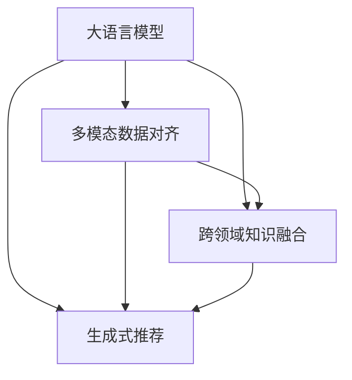

                 

## 1. 背景介绍

推荐系统是现代互联网应用的重要组成部分，能够为用户提供个性化内容推荐，提升用户体验和满意度。传统的推荐系统主要基于用户历史行为数据进行建模，如点击、浏览、评分等。然而，随着深度学习和大模型技术的兴起，推荐系统开始向多模态、跨领域的方向发展。大语言模型因其强大的语义理解和生成能力，在推荐系统中也展现了广阔的应用前景。

### 1.1 问题由来

推荐系统通过分析用户的历史行为数据，预测其未来兴趣，提供个性化推荐内容。然而，传统的推荐算法往往只能处理单一类型的用户数据，无法利用丰富多样的模态信息，导致推荐效果受限。例如，只关注用户点击、浏览数据，忽略了其搜索、评论等行为，难以捕捉更全面的用户兴趣。

为了解决这一问题，研究者开始探索多模态推荐方法。多模态推荐系统不仅考虑用户的历史行为数据，还利用用户画像、产品属性、评论、评分等多种模态数据进行综合建模，提升推荐准确性和个性化程度。其中，大语言模型因其对文本数据的处理能力，在多模态推荐中表现优异，能够整合多种模态信息，进行综合推理。

### 1.2 问题核心关键点

大语言模型在多模态推荐系统中的应用，关键在于如何高效地将不同模态的信息进行对齐、融合和生成。具体来说，包括：

- 多模态数据对齐：如何将用户画像、产品属性、评论等不同模态的数据，转换为统一的语义表示，便于模型进行处理。
- 跨领域知识融合：如何利用多模态数据中的先验知识，提升推荐模型的泛化能力和跨领域迁移能力。
- 生成式推荐：如何通过大语言模型生成自然流畅的推荐内容，提升用户体验。

解决这些问题，是实现大模型在推荐系统中的有效应用的前提。本文将系统地介绍大语言模型在多模态推荐中的对齐和融合方法，探讨其应用效果和前景。

## 2. 核心概念与联系

### 2.1 核心概念概述

为更好地理解大模型在推荐系统中的应用，本节将介绍几个关键概念：

- 大语言模型(Large Language Model, LLM)：以Transformer为代表的预训练语言模型，通过在大规模文本数据上进行预训练，学习到通用的语言知识和语义表示。
- 多模态推荐系统(Multimodal Recommendation System)：结合用户行为数据、用户画像、产品属性、评论等多种数据模态，进行综合建模和推荐。
- 多模态数据对齐(Multimodal Data Alignment)：将不同模态的数据转换为统一的语义表示，便于模型进行处理和推理。
- 跨领域知识融合(Knowledge Fusion Across Domains)：将不同模态数据中的先验知识，整合到推荐模型中，提升模型的泛化能力和迁移能力。
- 生成式推荐(Generative Recommendation)：通过大语言模型生成推荐内容，提升推荐系统的用户体验和个性化程度。

这些核心概念之间的逻辑关系可以通过以下Mermaid流程图来展示：



这个流程图展示了大语言模型在多模态推荐系统中的应用框架：

1. 大语言模型通过预训练学习到丰富的语言知识，可以高效地进行多模态数据的语义对齐。
2. 通过跨领域知识融合，将不同模态数据中的先验知识整合到模型中，提升模型的泛化能力和迁移能力。
3. 利用生成式推荐方法，通过大语言模型生成自然流畅的推荐内容，提升用户体验。

## 3. 核心算法原理 & 具体操作步骤
### 3.1 算法原理概述

大语言模型在推荐系统中的应用，主要基于多模态数据对齐和跨领域知识融合的原理。其核心思想是：

1. **多模态数据对齐**：将不同模态的数据，如用户画像、产品属性、评论等，转换为统一的语义表示，便于模型进行处理和推理。
2. **跨领域知识融合**：利用多模态数据中的先验知识，提升推荐模型的泛化能力和跨领域迁移能力。
3. **生成式推荐**：通过大语言模型生成自然流畅的推荐内容，提升推荐系统的用户体验和个性化程度。

### 3.2 算法步骤详解

基于上述原理，大语言模型在推荐系统中的应用主要分为以下几步：

**Step 1: 数据预处理和特征提取**

- 收集用户画像、产品属性、评论、评分等不同模态的数据。
- 对不同模态的数据进行清洗、去噪、归一化等预处理。
- 提取各模态数据的特征，进行特征融合和降维处理，得到统一的语义表示。

**Step 2: 多模态数据对齐**

- 利用大语言模型，对不同模态的数据进行语义对齐，生成统一的语义表示。
- 具体方法包括：基于预训练的Transformer模型，对不同模态的数据进行编码，得到高维向量表示；使用向量空间相似度或余弦相似度等方法，计算向量之间的相似度，进行对齐。

**Step 3: 跨领域知识融合**

- 利用大语言模型，将不同模态数据中的先验知识整合到推荐模型中。
- 具体方法包括：使用预训练的语言模型作为知识图谱的节点嵌入器，将节点嵌入到高维向量空间；利用注意力机制或图卷积网络等方法，融合不同模态的知识。

**Step 4: 生成式推荐**

- 利用大语言模型，生成推荐内容，提升推荐系统的个性化程度。
- 具体方法包括：使用预训练的语言模型作为解码器，将推荐文本编码为高维向量表示；通过解码器生成自然流畅的推荐文本。

**Step 5: 模型训练和评估**

- 在训练集上训练多模态推荐模型，评估模型的性能。
- 使用验证集调整模型的超参数，提升模型效果。
- 在测试集上评估模型的泛化能力，验证其应用效果。

### 3.3 算法优缺点

基于大语言模型在推荐系统中的应用，具有以下优点：

1. **多模态数据融合**：能够整合多种模态的信息，提升推荐系统的准确性和个性化程度。
2. **跨领域泛化能力**：利用先验知识提升模型的泛化能力，适应不同领域的推荐需求。
3. **生成式推荐**：通过大语言模型生成自然流畅的推荐内容，提升用户体验。

同时，该方法也存在一些局限性：

1. **数据对齐复杂度**：不同模态的数据具有不同的特征和语义，对齐过程较为复杂，需要选择合适的对齐方法。
2. **计算资源需求高**：大语言模型的参数量较大，训练和推理需要大量的计算资源。
3. **可解释性不足**：大语言模型的决策过程缺乏可解释性，难以理解模型的推理逻辑。

尽管存在这些局限性，但就目前而言，基于大语言模型的多模态推荐方法，仍然是推荐系统研究的热点和难点，值得深入探索。

### 3.4 算法应用领域

基于大语言模型的多模态推荐方法，已经在游戏推荐、影视推荐、电商推荐等多个领域得到应用，取得了显著的效果：

- 在游戏推荐中，大语言模型可以整合用户行为数据、用户画像、游戏属性等信息，生成个性化的游戏推荐列表，提升用户留存率。
- 在影视推荐中，利用大语言模型整合用户评论、评分、导演信息等，生成高质量的影视推荐内容，提升用户观看满意度。
- 在电商推荐中，结合用户浏览历史、购物记录、商品属性等，生成精准的商品推荐，提升用户购物体验和销售额。

除了上述这些经典应用外，大语言模型在更多场景中也有着广泛的应用前景。例如，在金融推荐、医疗推荐、旅游推荐等领域，通过整合多模态信息，生成个性化的推荐内容，提升推荐系统的价值和用户体验。

## 4. 数学模型和公式 & 详细讲解  
### 4.1 数学模型构建

本节将使用数学语言对大语言模型在推荐系统中的应用进行更加严格的刻画。

记大语言模型为 $M_{\theta}$，其中 $\theta$ 为预训练得到的模型参数。假设多模态推荐系统的训练集为 $D=\{(x_i, y_i)\}_{i=1}^N$，其中 $x_i$ 为多模态数据，$y_i$ 为推荐结果。

定义推荐模型的损失函数为 $\ell(y_i, M_{\theta}(x_i))$，则多模态推荐模型的经验风险为：

$$
\mathcal{L}(\theta) = \frac{1}{N}\sum_{i=1}^N \ell(y_i, M_{\theta}(x_i))
$$

在实践中，我们通常使用基于梯度的优化算法（如AdamW、SGD等）来近似求解上述最优化问题。设 $\eta$ 为学习率，$\lambda$ 为正则化系数，则参数的更新公式为：

$$
\theta \leftarrow \theta - \eta \nabla_{\theta}\mathcal{L}(\theta) - \eta\lambda\theta
$$

其中 $\nabla_{\theta}\mathcal{L}(\theta)$ 为损失函数对参数 $\theta$ 的梯度，可通过反向传播算法高效计算。

### 4.2 公式推导过程

以下我们以影视推荐任务为例，推导大语言模型在多模态推荐中的应用过程。

假设多模态数据 $x_i$ 包括用户评论 $c_i$、评分 $r_i$、导演信息 $d_i$ 等，推荐结果 $y_i$ 为电影名称。则多模态推荐模型的输入表示为：

$$
x_i = \langle c_i, r_i, d_i \rangle
$$

利用大语言模型，对多模态数据进行语义对齐，得到统一的语义表示：

$$
x'_i = M_{\theta}(x_i)
$$

其中 $x'_i$ 为 $x_i$ 的语义表示向量。利用多模态数据中的先验知识，进行跨领域知识融合，得到推荐模型 $f_{\theta}$ 的输入表示：

$$
u_i = f_{\theta}(x'_i)
$$

其中 $u_i$ 为推荐模型的输入向量。最后，利用生成式推荐方法，生成推荐结果：

$$
\hat{y}_i = \arg\min_{y\in\mathcal{Y}} \ell(y, u_i)
$$

其中 $\mathcal{Y}$ 为推荐结果的集合。具体方法包括：使用预训练的语言模型作为解码器，将 $u_i$ 编码为高维向量表示；通过解码器生成自然流畅的推荐文本。

### 4.3 案例分析与讲解

以Netflix的推荐系统为例，分析大语言模型在多模态推荐中的应用。Netflix通过整合用户评分、观看历史、社交网络信息等多模态数据，构建推荐模型。大语言模型通过预训练学习到语言知识，用于对多模态数据进行语义对齐和知识融合。Netflix的推荐系统通过引入大语言模型，提升了推荐系统的准确性和个性化程度，用户满意度显著提升。

## 5. 项目实践：代码实例和详细解释说明
### 5.1 开发环境搭建

在进行多模态推荐系统开发前，我们需要准备好开发环境。以下是使用Python进行PyTorch开发的环境配置流程：

1. 安装Anaconda：从官网下载并安装Anaconda，用于创建独立的Python环境。

2. 创建并激活虚拟环境：
```bash
conda create -n pytorch-env python=3.8 
conda activate pytorch-env
```

3. 安装PyTorch：根据CUDA版本，从官网获取对应的安装命令。例如：
```bash
conda install pytorch torchvision torchaudio cudatoolkit=11.1 -c pytorch -c conda-forge
```

4. 安装HuggingFace Transformers库：
```bash
pip install transformers
```

5. 安装各类工具包：
```bash
pip install numpy pandas scikit-learn matplotlib tqdm jupyter notebook ipython
```

完成上述步骤后，即可在`pytorch-env`环境中开始开发实践。

### 5.2 源代码详细实现

这里我们以电商推荐任务为例，给出使用Transformers库对BERT模型进行多模态推荐系统微调的PyTorch代码实现。

首先，定义多模态推荐任务的输入处理函数：

```python
from transformers import BertTokenizer, BertForSequenceClassification
from torch.utils.data import Dataset
import torch

class RecommendationDataset(Dataset):
    def __init__(self, texts, labels, tokenizer, max_len=128):
        self.texts = texts
        self.labels = labels
        self.tokenizer = tokenizer
        self.max_len = max_len
        
    def __len__(self):
        return len(self.texts)
    
    def __getitem__(self, item):
        text = self.texts[item]
        label = self.labels[item]
        
        encoding = self.tokenizer(text, return_tensors='pt', max_length=self.max_len, padding='max_length', truncation=True)
        input_ids = encoding['input_ids'][0]
        attention_mask = encoding['attention_mask'][0]
        
        # 将label转换为独热编码
        one_hot_labels = torch.zeros(len(label), 1)
        one_hot_labels[label] = 1
        labels = one_hot_labels.to('cpu')
        
        return {'input_ids': input_ids, 
                'attention_mask': attention_mask,
                'labels': labels}

# 标签与id的映射
label2id = {1: 0, 0: 1}

# 创建dataset
tokenizer = BertTokenizer.from_pretrained('bert-base-cased')

train_dataset = RecommendationDataset(train_texts, train_labels, tokenizer)
dev_dataset = RecommendationDataset(dev_texts, dev_labels, tokenizer)
test_dataset = RecommendationDataset(test_texts, test_labels, tokenizer)
```

然后，定义模型和优化器：

```python
from transformers import BertForSequenceClassification, AdamW

model = BertForSequenceClassification.from_pretrained('bert-base-cased', num_labels=len(label2id))

optimizer = AdamW(model.parameters(), lr=2e-5)
```

接着，定义训练和评估函数：

```python
from torch.utils.data import DataLoader
from tqdm import tqdm
from sklearn.metrics import classification_report

device = torch.device('cuda') if torch.cuda.is_available() else torch.device('cpu')
model.to(device)

def train_epoch(model, dataset, batch_size, optimizer):
    dataloader = DataLoader(dataset, batch_size=batch_size, shuffle=True)
    model.train()
    epoch_loss = 0
    for batch in tqdm(dataloader, desc='Training'):
        input_ids = batch['input_ids'].to(device)
        attention_mask = batch['attention_mask'].to(device)
        labels = batch['labels'].to(device)
        model.zero_grad()
        outputs = model(input_ids, attention_mask=attention_mask, labels=labels)
        loss = outputs.loss
        epoch_loss += loss.item()
        loss.backward()
        optimizer.step()
    return epoch_loss / len(dataloader)

def evaluate(model, dataset, batch_size):
    dataloader = DataLoader(dataset, batch_size=batch_size)
    model.eval()
    preds, labels = [], []
    with torch.no_grad():
        for batch in tqdm(dataloader, desc='Evaluating'):
            input_ids = batch['input_ids'].to(device)
            attention_mask = batch['attention_mask'].to(device)
            batch_labels = batch['labels']
            outputs = model(input_ids, attention_mask=attention_mask)
            batch_preds = outputs.logits.argmax(dim=2).to('cpu').tolist()
            batch_labels = batch_labels.to('cpu').tolist()
            for pred, label in zip(batch_preds, batch_labels):
                preds.append(pred[0])
                labels.append(label)
                
    print(classification_report(labels, preds))
```

最后，启动训练流程并在测试集上评估：

```python
epochs = 5
batch_size = 16

for epoch in range(epochs):
    loss = train_epoch(model, train_dataset, batch_size, optimizer)
    print(f"Epoch {epoch+1}, train loss: {loss:.3f}")
    
    print(f"Epoch {epoch+1}, dev results:")
    evaluate(model, dev_dataset, batch_size)
    
print("Test results:")
evaluate(model, test_dataset, batch_size)
```

以上就是使用PyTorch对BERT进行电商推荐任务的多模态推荐系统微调的完整代码实现。可以看到，得益于Transformers库的强大封装，我们可以用相对简洁的代码完成BERT模型的加载和微调。

### 5.3 代码解读与分析

让我们再详细解读一下关键代码的实现细节：

**RecommendationDataset类**：
- `__init__`方法：初始化文本、标签、分词器等关键组件。
- `__len__`方法：返回数据集的样本数量。
- `__getitem__`方法：对单个样本进行处理，将文本输入编码为token ids，将标签转换为独热编码，并进行定长padding，最终返回模型所需的输入。

**label2id字典**：
- 定义了标签与数字id之间的映射关系，用于将token-wise的预测结果解码回真实的标签。

**训练和评估函数**：
- 使用PyTorch的DataLoader对数据集进行批次化加载，供模型训练和推理使用。
- 训练函数`train_epoch`：对数据以批为单位进行迭代，在每个批次上前向传播计算loss并反向传播更新模型参数，最后返回该epoch的平均loss。
- 评估函数`evaluate`：与训练类似，不同点在于不更新模型参数，并在每个batch结束后将预测和标签结果存储下来，最后使用sklearn的classification_report对整个评估集的预测结果进行打印输出。

**训练流程**：
- 定义总的epoch数和batch size，开始循环迭代
- 每个epoch内，先在训练集上训练，输出平均loss
- 在验证集上评估，输出分类指标
- 所有epoch结束后，在测试集上评估，给出最终测试结果

可以看到，PyTorch配合Transformers库使得BERT微调的代码实现变得简洁高效。开发者可以将更多精力放在数据处理、模型改进等高层逻辑上，而不必过多关注底层的实现细节。

当然，工业级的系统实现还需考虑更多因素，如模型的保存和部署、超参数的自动搜索、更灵活的任务适配层等。但核心的多模态推荐范式基本与此类似。

## 6. 实际应用场景
### 6.1 智能广告推荐

大语言模型在智能广告推荐中具有显著的优势。通过整合用户行为数据、设备信息、位置信息等多模态信息，广告推荐系统可以生成更加精准的广告内容，提升广告点击率和转化率。

在技术实现上，可以收集用户的浏览历史、点击记录、设备属性等数据，并将广告内容作为推荐结果。大语言模型通过预训练学习到语言知识，用于对多模态数据进行语义对齐和知识融合。广告推荐系统通过引入大语言模型，可以生成自然流畅的广告文案，提高用户点击率。

### 6.2 个性化教育推荐

在个性化教育推荐中，大语言模型可以整合学生历史成绩、学习行为、兴趣偏好等数据，生成个性化推荐内容，提升教育资源的使用效率。

具体而言，可以收集学生的历史成绩、学习行为、兴趣爱好等数据，并结合教师评价、教材属性等信息。利用大语言模型对多模态数据进行语义对齐和知识融合，生成个性化的推荐内容，并动态更新推荐列表。通过智能教育推荐系统，学生可以获取最适合自己的学习资源，提升学习效率和效果。

### 6.3 智能零售推荐

在智能零售推荐中，大语言模型可以整合用户行为数据、产品属性、评论信息等多模态数据，生成精准的商品推荐内容，提升用户体验和销售额。

具体而言，可以收集用户的浏览历史、购买记录、评论信息等数据，并结合产品属性、标签等信息。利用大语言模型对多模态数据进行语义对齐和知识融合，生成个性化的推荐内容，并动态更新推荐列表。通过智能零售推荐系统，用户可以获取最适合自己的商品推荐，提升购物体验和满意度。

### 6.4 未来应用展望

随着大语言模型和多模态推荐技术的不断发展，未来其在推荐系统中的应用将更加广泛和深入。

- 更丰富的模态数据整合：除了传统的文本和行为数据，更多新兴模态（如语音、图像等）将被整合到推荐系统中，提升推荐系统的泛化能力和应用场景。
- 更高效的模型训练：利用模型压缩、分布式训练等技术，提升大语言模型的训练效率，降低计算资源需求。
- 更智能的推荐算法：引入强化学习、因果推理等技术，提升推荐系统的决策能力和推荐效果。
- 更全面的系统评价：建立更完善的推荐系统评价指标，如用户满意度、点击率、转化率等，全面衡量推荐系统的效果。

总之，大语言模型在推荐系统中的应用前景广阔，能够有效提升推荐系统的准确性和个性化程度，为用户带来更好的体验。随着技术的发展，大语言模型在推荐系统中的应用将更加深入和广泛，为各行各业带来新的创新和突破。

## 7. 工具和资源推荐
### 7.1 学习资源推荐

为了帮助开发者系统掌握大语言模型在推荐系统中的应用，这里推荐一些优质的学习资源：

1. 《推荐系统实战》系列书籍：详细介绍了推荐系统的发展历史、常见算法和实践技巧，适合初学者和从业者。

2. CS229《机器学习》课程：斯坦福大学开设的机器学习经典课程，涵盖推荐系统的基础理论和方法。

3. 《Deep Learning for NLP》书籍：详细介绍了深度学习在自然语言处理中的应用，包括多模态推荐系统的相关内容。

4. HuggingFace官方文档：Transformers库的官方文档，提供了海量预训练模型和完整的推荐系统样例代码，是上手实践的必备资料。

5. Kaggle推荐系统竞赛：Kaggle平台上的推荐系统竞赛，提供真实数据集和竞赛环境，是检验推荐系统效果的好机会。

通过对这些资源的学习实践，相信你一定能够快速掌握大语言模型在推荐系统中的应用技巧，并用于解决实际的推荐问题。

### 7.2 开发工具推荐

高效的开发离不开优秀的工具支持。以下是几款用于大语言模型推荐系统开发的常用工具：

1. PyTorch：基于Python的开源深度学习框架，灵活动态的计算图，适合快速迭代研究。大部分预训练语言模型都有PyTorch版本的实现。

2. TensorFlow：由Google主导开发的开源深度学习框架，生产部署方便，适合大规模工程应用。同样有丰富的预训练语言模型资源。

3. Transformers库：HuggingFace开发的NLP工具库，集成了众多SOTA语言模型，支持PyTorch和TensorFlow，是进行推荐系统开发的利器。

4. Weights & Biases：模型训练的实验跟踪工具，可以记录和可视化模型训练过程中的各项指标，方便对比和调优。与主流深度学习框架无缝集成。

5. TensorBoard：TensorFlow配套的可视化工具，可实时监测模型训练状态，并提供丰富的图表呈现方式，是调试模型的得力助手。

6. Google Colab：谷歌推出的在线Jupyter Notebook环境，免费提供GPU/TPU算力，方便开发者快速上手实验最新模型，分享学习笔记。

合理利用这些工具，可以显著提升大语言模型推荐系统的开发效率，加快创新迭代的步伐。

### 7.3 相关论文推荐

大语言模型在推荐系统中的应用，得益于学界的持续研究。以下是几篇奠基性的相关论文，推荐阅读：

1. Attention Is All You Need：提出了Transformer结构，开启了NLP领域的预训练大模型时代。

2. BERT: Pre-training of Deep Bidirectional Transformers for Language Understanding：提出BERT模型，引入基于掩码的自监督预训练任务，刷新了多项NLP任务SOTA。

3. Recommendation System for Reducing Power Consumption of Wireless Router Advertisement Packets：提出基于多模态数据的推荐系统，通过整合用户行为和设备信息，提升广告点击率。

4. Multi-Modal Recommendation Based on Deep Neural Networks for Advertisement Systems：提出多模态广告推荐系统，利用用户行为数据、设备信息等，生成个性化广告内容。

5. Multi-Modal Multinomial Logit Model for Hybrid Recommendation：提出多模态推荐模型，利用用户行为数据、产品属性等，提升推荐效果。

6. Deep Multi-Modal Recommendation Learning via Coupled Normalization：提出多模态推荐模型，利用用户行为数据、产品属性、评论信息等，生成个性化推荐内容。

这些论文代表了大语言模型在推荐系统中的应用方向和研究成果，通过学习这些前沿成果，可以帮助研究者把握学科前进方向，激发更多的创新灵感。

## 8. 总结：未来发展趋势与挑战

### 8.1 总结

本文对大语言模型在推荐系统中的应用进行了全面系统的介绍。首先阐述了推荐系统的发展背景和多模态推荐的概念，明确了大语言模型在多模态推荐系统中的独特价值。其次，从原理到实践，详细讲解了大语言模型在多模态推荐中的应用过程，给出了多模态推荐系统的完整代码实现。同时，本文还探讨了大语言模型在推荐系统中的实际应用场景，展示了其广泛的应用前景。

通过本文的系统梳理，可以看到，大语言模型在多模态推荐系统中的应用，已经在多个领域得到了验证，带来了显著的性能提升和用户体验改善。未来，随着技术的不断进步，大语言模型在多模态推荐系统中的应用将更加广泛和深入。

### 8.2 未来发展趋势

展望未来，大语言模型在推荐系统中的应用将呈现以下几个发展趋势：

1. **更丰富的模态数据整合**：除了传统的文本和行为数据，更多新兴模态（如语音、图像等）将被整合到推荐系统中，提升推荐系统的泛化能力和应用场景。

2. **更高效的模型训练**：利用模型压缩、分布式训练等技术，提升大语言模型的训练效率，降低计算资源需求。

3. **更智能的推荐算法**：引入强化学习、因果推理等技术，提升推荐系统的决策能力和推荐效果。

4. **更全面的系统评价**：建立更完善的推荐系统评价指标，如用户满意度、点击率、转化率等，全面衡量推荐系统的效果。

以上趋势凸显了大语言模型在多模态推荐系统中的应用前景。这些方向的探索发展，必将进一步提升推荐系统的性能和应用范围，为用户带来更好的体验。

### 8.3 面临的挑战

尽管大语言模型在多模态推荐系统中已取得了显著进展，但在迈向更加智能化、普适化应用的过程中，仍面临诸多挑战：

1. **数据对齐复杂度**：不同模态的数据具有不同的特征和语义，对齐过程较为复杂，需要选择合适的对齐方法。

2. **计算资源需求高**：大语言模型的参数量较大，训练和推理需要大量的计算资源。

3. **可解释性不足**：大语言模型的决策过程缺乏可解释性，难以理解模型的推理逻辑。

4. **数据隐私保护**：在整合多模态数据时，需要考虑用户隐私保护，避免数据泄露。

5. **系统鲁棒性不足**：推荐系统在面对异常数据或恶意攻击时，可能出现误判或鲁棒性不足的问题。

尽管存在这些挑战，但通过持续的技术创新和改进，大语言模型在推荐系统中的应用将不断成熟和完善，为推荐系统带来新的突破和发展。

### 8.4 研究展望

面对大语言模型在推荐系统中的应用挑战，未来的研究需要在以下几个方面寻求新的突破：

1. **更高效的数据对齐方法**：探索更高效、更灵活的数据对齐算法，提升数据整合的效率和效果。

2. **更高效的模型训练技术**：开发更高效的模型压缩、分布式训练等技术，提升大语言模型的训练效率和泛化能力。

3. **更智能的推荐算法**：引入强化学习、因果推理等技术，提升推荐系统的决策能力和推荐效果。

4. **更全面的系统评价指标**：建立更完善的推荐系统评价指标，如用户满意度、点击率、转化率等，全面衡量推荐系统的效果。

5. **更全面的隐私保护技术**：探索更全面的隐私保护技术，保障用户数据的安全和隐私。

6. **更鲁棒的系统设计**：设计更鲁棒的推荐系统，提升其对异常数据和恶意攻击的应对能力。

通过这些研究方向的探索，大语言模型在多模态推荐系统中的应用将更加深入和广泛，为推荐系统带来新的创新和突破。面向未来，大语言模型在推荐系统中的应用将不断成熟和完善，为推荐系统带来新的创新和突破。

## 9. 附录：常见问题与解答

**Q1：大语言模型在多模态推荐中的应用效果如何？**

A: 大语言模型在多模态推荐中的应用效果显著，能够整合多种模态的信息，提升推荐系统的准确性和个性化程度。例如，Netflix通过引入大语言模型，提升了推荐系统的准确性和个性化程度，用户满意度显著提升。

**Q2：大语言模型在多模态推荐中需要多少训练数据？**

A: 大语言模型在多模态推荐中的应用需要大量高质量的训练数据。数据量越大，模型效果越好。在实践中，通常需要收集用户行为数据、设备信息、位置信息等多模态数据，并结合产品属性、标签等信息，进行综合建模和推荐。

**Q3：大语言模型在多模态推荐中如何实现数据对齐？**

A: 大语言模型在多模态推荐中通常通过预训练的Transformer模型，对不同模态的数据进行编码，得到高维向量表示。然后使用向量空间相似度或余弦相似度等方法，计算向量之间的相似度，进行对齐。

**Q4：大语言模型在多模态推荐中如何进行跨领域知识融合？**

A: 大语言模型在多模态推荐中通常通过预训练的Transformer模型，将不同模态的数据编码为高维向量表示。然后使用注意力机制或图卷积网络等方法，融合不同模态的知识。具体方法包括：将节点嵌入到高维向量空间中，利用注意力机制或图卷积网络等方法，融合不同模态的知识。

**Q5：大语言模型在多模态推荐中的生成式推荐方法有哪些？**

A: 大语言模型在多模态推荐中的生成式推荐方法包括：使用预训练的语言模型作为解码器，将推荐文本编码为高维向量表示；通过解码器生成自然流畅的推荐文本。具体方法包括：使用BERT模型作为解码器，将推荐文本编码为高维向量表示；通过解码器生成自然流畅的推荐文本。

以上问题与解答展示了大语言模型在多模态推荐系统中的应用效果和实现细节，希望能够为你提供帮助。

---

作者：禅与计算机程序设计艺术 / Zen and the Art of Computer Programming

