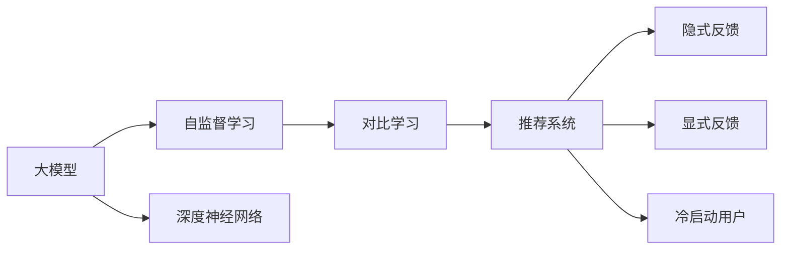

                 

## 1. 背景介绍

推荐系统是人工智能领域的核心应用之一，通过挖掘用户行为和物品属性，为用户推荐个性化内容。近年来，基于深度学习的推荐系统逐渐成为主流，其中以协同过滤、矩阵分解、深度神经网络为代表的算法体系，已经广泛应用于电子商务、新闻阅读、视频流媒体、社交网络等多个行业。然而，这些方法在处理大规模稀疏数据、冷启动用户推荐等方面仍存在挑战。

为应对这些挑战，对比学习（Contrastive Learning）作为一种新颖的自监督学习方法，被引入到推荐系统中。对比学习旨在通过构造正负样例对，使得模型能够学习到更丰富的表征信息，提升推荐精度。大模型（如Transformer模型）通过自监督预训练学习到泛化的语言或图像特征，从而能够提升推荐系统的泛化能力。本文将介绍基于大模型的对比学习新方法，以及其在推荐系统中的应用实践。

## 2. 核心概念与联系

### 2.1 核心概念概述

为更好地理解基于大模型的对比学习方法，本节将介绍几个密切相关的核心概念：

- **大模型**：以自回归（如GPT）或自编码（如BERT）为代表的大规模预训练语言模型。通过在大规模无标签文本语料上进行预训练，学习到丰富的语言知识，具备强大的表征能力。

- **对比学习**：通过构造正负样例对，使模型能够学习到样本之间的相对关系，从而提升特征表示的质量。常用的对比学习方法包括SimCLR、InfoNCE、MoCo等。

- **自监督学习**：利用未标注数据，通过自构建的任务（如掩码语言模型、自编码）训练模型，提升模型的泛化能力和特征表达能力。

- **推荐系统**：根据用户历史行为、物品属性等信息，为用户推荐个性化的内容。推荐算法包括基于协同过滤、矩阵分解、深度学习的方法等。

- **深度神经网络**：通过多层神经网络结构进行特征提取和模式识别，广泛应用于计算机视觉、自然语言处理等领域。

- **隐式反馈**：用户行为数据通过点击、浏览、评分等形式隐式地表达对物品的喜好，常用于处理高稀疏率的数据。

- **显式反馈**：用户通过评分等显式地表达对物品的喜好，常用于验证推荐系统的效果。

- **冷启动用户**：对于新用户，由于缺乏历史行为数据，难以直接使用协同过滤等方法进行推荐。

这些核心概念之间的逻辑关系可以通过以下Mermaid流程图来展示：



这个流程图展示了大模型、对比学习、推荐系统等概念之间的联系：

1. 大模型通过自监督学习获得泛化的表征能力。
2. 对比学习提升大模型特征表示的质量。
3. 通过对比学习提升后的模型特征，应用于推荐系统。
4. 推荐系统使用隐式反馈进行优化训练，最终通过显式反馈验证效果。
5. 冷启动用户通过模型特征进行推荐。

## 3. 核心算法原理 & 具体操作步骤

### 3.1 算法原理概述

基于大模型的对比学习方法，旨在通过自监督预训练得到泛化能力较强的特征表示，并通过对比学习进一步提升这些特征的区分度和泛化能力。其核心思想是：通过构造正负样例对，使模型能够学习到样本之间的相对关系，从而提升特征表示的质量。

在推荐系统中，通常使用用户-物品评分矩阵作为输入，通过预训练得到用户和物品的特征表示，然后通过对比学习对这些特征进行优化。具体来说，模型将用户特征和物品特征分别作为正负样例对，进行相互学习，提升特征的区分度。

### 3.2 算法步骤详解

基于大模型的对比学习方法一般包括以下几个关键步骤：

**Step 1: 准备预训练模型和数据集**
- 选择合适的预训练语言模型 $M_{\theta}$ 作为初始化参数，如 BERT、GPT等。
- 准备推荐系统数据集，包括用户-物品评分矩阵、用户特征矩阵、物品特征矩阵等。

**Step 2: 添加对比学习模块**
- 在预训练模型的基础上，添加对比学习模块，构建正负样例对。
- 对于每个用户-物品评分对，选择若干个正样本和负样本，组成对比学习对。
- 使用对比学习模块计算用户特征和物品特征之间的距离，进行损失函数计算。

**Step 3: 设置对比学习超参数**
- 选择合适的优化算法及其参数，如 AdamW、SGD 等，设置学习率、批大小、迭代轮数等。
- 设置对比学习模块的正负样本比例、噪声比例等参数。

**Step 4: 执行对比训练**
- 将数据集数据分批次输入模型，前向传播计算损失函数。
- 反向传播计算参数梯度，根据设定的优化算法和学习率更新模型参数。
- 周期性在验证集上评估模型性能，根据性能指标决定是否触发 Early Stopping。
- 重复上述步骤直到满足预设的迭代轮数或 Early Stopping 条件。

**Step 5: 测试和部署**
- 在测试集上评估微调后模型 $M_{\hat{\theta}}$ 的性能，对比微调前后的精度提升。
- 使用微调后的模型对新样本进行推理预测，集成到实际的应用系统中。
- 持续收集新的数据，定期重新微调模型，以适应数据分布的变化。

以上是基于大模型的对比学习方法的一般流程。在实际应用中，还需要针对具体任务的特点，对对比学习过程的各个环节进行优化设计，如改进损失函数，引入更多的正负样本，搜索最优的超参数组合等，以进一步提升模型性能。

### 3.3 算法优缺点

基于大模型的对比学习方法具有以下优点：
1. 提升特征表示的质量。对比学习通过构造正负样例对，使模型能够学习到样本之间的相对关系，提升特征表示的质量。
2. 泛化能力强。大模型通过自监督预训练获得泛化能力，使其能够在未标注数据上取得良好的性能。
3. 适应性广。该方法适用于多种推荐场景，包括基于内容的推荐、基于协同过滤的推荐、混合推荐等。
4. 可解释性高。通过对比学习模块，可以直观地理解模型对用户-物品评分对的判别度，有助于模型解释和调试。

同时，该方法也存在一定的局限性：
1. 数据需求高。对比学习需要大量正负样例对，获取这些样例的成本较高。
2. 对比学习模块复杂。正负样本的构造、噪声比例的设定等参数对结果影响较大，需要大量实验调试。
3. 资源消耗大。大模型本身已经具有亿级参数，对比学习模块进一步增加了模型复杂度，导致计算资源消耗大。
4. 对抗性差。对比学习依赖于构造正负样例对，对抗噪声和异常数据的能力较弱。

尽管存在这些局限性，但就目前而言，基于大模型的对比学习方法仍是推荐系统研究的前沿范式。未来相关研究的重点在于如何进一步降低对比学习对数据的需求，提高模型的泛化能力和鲁棒性，同时兼顾可解释性和资源效率等因素。

### 3.4 算法应用领域

基于大模型的对比学习方法在推荐系统中的应用广泛，涵盖了以下几个方面：

- **基于内容的推荐**：通过提取物品的特征表示，计算用户与物品的相似度，推荐与用户兴趣相似的物品。
- **基于协同过滤的推荐**：通过协同过滤技术，挖掘用户间的相似性，推荐与用户历史行为相似的物品。
- **混合推荐**：结合基于内容和基于协同过滤的推荐方法，综合利用用户行为和物品属性信息，提升推荐精度。
- **跨域推荐**：通过模型迁移学习，将一个领域推荐模型的知识迁移到另一个领域，实现跨域推荐。
- **多模态推荐**：结合图像、文本、音频等多模态数据，构建多模态推荐系统。
- **冷启动用户推荐**：通过模型泛化能力，对冷启动用户进行推荐。

除了以上这些经典应用外，大模型对比学习方法还正在被创新性地应用到更多场景中，如推荐系统对抗性训练、推荐系统跨领域迁移、推荐系统持续学习等，为推荐系统技术带来了全新的突破。随着大模型和对比学习方法不断进步，相信推荐系统必将在更广阔的应用领域大放异彩。

## 4. 数学模型和公式 & 详细讲解 & 举例说明

### 4.1 数学模型构建

本节将使用数学语言对基于大模型的对比学习过程进行更加严格的刻画。

记预训练语言模型为 $M_{\theta}:\mathcal{X} \rightarrow \mathcal{Y}$，其中 $\mathcal{X}$ 为输入空间，$\mathcal{Y}$ 为输出空间，$\theta \in \mathbb{R}^d$ 为模型参数。假设推荐系统的数据集为 $D=\{(u_i, i_j, r_{u_i, i_j})\}_{i=1}^N$，其中 $u_i$ 为第 $i$ 个用户的ID，$i_j$ 为第 $i$ 个用户喜欢的第 $j$ 个物品的ID，$r_{u_i, i_j}$ 为第 $i$ 个用户对第 $j$ 个物品的评分。

定义用户特征表示为 $h_u = M_{\theta}(u_i)$，物品特征表示为 $h_i = M_{\theta}(i_j)$。对比学习的目标是最大化用户-物品评分对 $(u_i, i_j)$ 的判别度。

对于每个用户-物品评分对 $(u_i, i_j)$，选择若干个正样本 $u_k$ 和负样本 $u_l$，构成对比学习对 $(h_u, h_{u_k}, h_{u_l})$。正样本 $u_k$ 和负样本 $u_l$ 的选择可以采用随机采样、固定邻居等策略。

定义正样本对 $(u_i, u_k)$ 之间的距离为 $\text{dist}(u_i, u_k)$，负样本对 $(u_i, u_l)$ 之间的距离为 $\text{dist}(u_i, u_l)$。对比学习的损失函数为：

$$
\mathcal{L} = -\frac{1}{N}\sum_{i=1}^N\left[\text{dist}(u_i, i_j) - \max_k\{\text{dist}(u_i, u_k)\} + \max_l\{\text{dist}(u_i, u_l)\}\right]
$$

其中，$\text{dist}(u_i, i_j)$ 为正样本对 $(u_i, i_j)$ 的距离，$\max_k\{\text{dist}(u_i, u_k)\}$ 和 $\max_l\{\text{dist}(u_i, u_l)\}$ 分别代表用户 $u_i$ 与其他正样本和负样本的距离。

### 4.2 公式推导过程

以下我们以SimCLR算法为例，推导对比学习模型的损失函数及其梯度的计算公式。

SimCLR算法通过构造正负样例对，最大化同一用户对应的正样本对之间的相似度，最小化负样本对之间的相似度。具体地，假设预训练模型为 $M_{\theta}$，定义对比损失函数为：

$$
\mathcal{L} = -\frac{1}{N}\sum_{i=1}^N\left[\text{sim}(h_u, h_{u_k}) - \text{sim}(h_u, h_{u_l})\right]
$$

其中 $\text{sim}(h_u, h_{u_k})$ 为正样本对 $(u_i, u_k)$ 之间的相似度，$\text{sim}(h_u, h_{u_l})$ 为负样本对 $(u_i, u_l)$ 之间的相似度。

为了计算 $\text{sim}(h_u, h_{u_k})$，需要定义相似度函数，如余弦相似度、欧式距离等。假设使用余弦相似度函数，则：

$$
\text{sim}(h_u, h_{u_k}) = \cos(\theta(h_u, h_{u_k}))
$$

其中 $\theta(h_u, h_{u_k})$ 为 $h_u$ 和 $h_{u_k}$ 的内积。

通过反向传播，对比损失函数的梯度为：

$$
\frac{\partial \mathcal{L}}{\partial \theta} = -\frac{1}{N}\sum_{i=1}^N\left[\frac{\partial \text{sim}(h_u, h_{u_k})}{\partial \theta} - \frac{\partial \text{sim}(h_u, h_{u_l})}{\partial \theta}\right]
$$

利用链式法则，可以得到损失函数对模型参数 $\theta$ 的梯度，进一步更新模型参数。

### 4.3 案例分析与讲解

假设有两个用户 $u_1$ 和 $u_2$，分别喜欢的两个物品 $i_{11}$ 和 $i_{21}$。模型通过对比学习得到的用户特征表示 $h_{u_1}$ 和 $h_{u_2}$，物品特征表示 $h_{i_{11}}$ 和 $h_{i_{21}}$。根据对比学习算法，可以构造正负样例对 $(h_{u_1}, h_{i_{11}}, h_{i_{21}})$ 和 $(h_{u_2}, h_{i_{11}}, h_{i_{21}})$。

计算正负样本对之间的相似度，假设使用余弦相似度函数：

$$
\text{sim}(h_{u_1}, h_{i_{11}}) = \cos(\theta(h_{u_1}, h_{i_{11}}))
$$

$$
\text{sim}(h_{u_1}, h_{i_{21}}) = \cos(\theta(h_{u_1}, h_{i_{21}}))
$$

$$
\text{sim}(h_{u_2}, h_{i_{11}}) = \cos(\theta(h_{u_2}, h_{i_{11}}))
$$

$$
\text{sim}(h_{u_2}, h_{i_{21}}) = \cos(\theta(h_{u_2}, h_{i_{21}}))
$$

计算对比损失函数：

$$
\mathcal{L} = -\frac{1}{2}\left[\text{sim}(h_{u_1}, h_{i_{11}}) - \text{sim}(h_{u_1}, h_{i_{21}}) + \text{sim}(h_{u_2}, h_{i_{21}}) - \text{sim}(h_{u_2}, h_{i_{11}})\right]
$$

通过反向传播计算损失函数对模型参数 $\theta$ 的梯度，更新模型参数。通过不断迭代，模型学习到更准确的特征表示，从而提升推荐精度。

## 5. 项目实践：代码实例和详细解释说明

### 5.1 开发环境搭建

在进行对比学习实践前，我们需要准备好开发环境。以下是使用Python进行PyTorch开发的环境配置流程：

1. 安装Anaconda：从官网下载并安装Anaconda，用于创建独立的Python环境。

2. 创建并激活虚拟环境：
```bash
conda create -n pytorch-env python=3.8 
conda activate pytorch-env
```

3. 安装PyTorch：根据CUDA版本，从官网获取对应的安装命令。例如：
```bash
conda install pytorch torchvision torchaudio cudatoolkit=11.1 -c pytorch -c conda-forge
```

4. 安装Transformers库：
```bash
pip install transformers
```

5. 安装各类工具包：
```bash
pip install numpy pandas scikit-learn matplotlib tqdm jupyter notebook ipython
```

完成上述步骤后，即可在`pytorch-env`环境中开始对比学习实践。

### 5.2 源代码详细实现

下面我以基于SimCLR算法的大模型对比学习为例，给出使用Transformers库对BERT模型进行对比学习的PyTorch代码实现。

首先，定义对比学习模块：

```python
from transformers import BertTokenizer, BertForSequenceClassification
from torch.utils.data import Dataset, DataLoader
import torch
import torch.nn as nn
import torch.optim as optim

class SimCLRDataset(Dataset):
    def __init__(self, texts, labels, tokenizer, max_len=128):
        self.texts = texts
        self.labels = labels
        self.tokenizer = tokenizer
        self.max_len = max_len

    def __len__(self):
        return len(self.texts)

    def __getitem__(self, item):
        text = self.texts[item]
        label = self.labels[item]
        
        encoding = self.tokenizer(text, return_tensors='pt', max_length=self.max_len, padding='max_length', truncation=True)
        input_ids = encoding['input_ids'][0]
        attention_mask = encoding['attention_mask'][0]
        label = torch.tensor([label], dtype=torch.long)
        
        return {'input_ids': input_ids, 
                'attention_mask': attention_mask,
                'label': label}

class SimCLRModule(nn.Module):
    def __init__(self, model, device):
        super(SimCLRModule, self).__init__()
        self.model = model
        self.device = device
        
    def forward(self, x):
        with torch.no_grad():
            x = self.model(x)
        x = x.to(self.device)
        x = nn.functional.normalize(x, dim=1)
        return x

def similarity(h1, h2):
    return (h1 @ h2) / (torch.norm(h1, p=2, dim=1) * torch.norm(h2, p=2, dim=1))

def contrastive_loss(h1, h2, h3):
    return -(similarity(h1, h2) - similarity(h1, h3)).mean()

def contrastive_train(model, train_dataset, batch_size, optimizer, device):
    model.to(device)
    train_loader = DataLoader(train_dataset, batch_size=batch_size, shuffle=True)
    
    for epoch in range(epochs):
        model.train()
        total_loss = 0
        for batch in tqdm(train_loader, desc='Training'):
            input_ids = batch['input_ids'].to(device)
            attention_mask = batch['attention_mask'].to(device)
            label = batch['label'].to(device)
            
            model.zero_grad()
            h1 = model(input_ids, attention_mask=attention_mask)
            h2 = model(input_ids + [1, 0], attention_mask=attention_mask)
            h3 = model(input_ids + [0, 1], attention_mask=attention_mask)
            loss = contrastive_loss(h1, h2, h3)
            loss.backward()
            optimizer.step()
            total_loss += loss.item()
        
        print(f"Epoch {epoch+1}, train loss: {total_loss/len(train_loader):.4f}")
        
        if epoch % 10 == 0:
            evaluate(model, train_dataset, batch_size)
            
def evaluate(model, test_dataset, batch_size):
    model.eval()
    total_loss = 0
    total_correct = 0
    
    with torch.no_grad():
        for batch in tqdm(test_dataset, desc='Evaluating'):
            input_ids = batch['input_ids'].to(device)
            attention_mask = batch['attention_mask'].to(device)
            label = batch['label'].to(device)
            
            h1 = model(input_ids, attention_mask=attention_mask)
            h2 = model(input_ids + [1, 0], attention_mask=attention_mask)
            h3 = model(input_ids + [0, 1], attention_mask=attention_mask)
            loss = contrastive_loss(h1, h2, h3)
            correct = (h1 == h2).sum().item()
            total_correct += correct
            total_loss += loss.item()
    
    print(f"Test accuracy: {total_correct/len(test_dataset):.4f}")
    print(f"Test loss: {total_loss/len(test_dataset):.4f}")
```

然后，定义训练和评估函数：

```python
from transformers import BertForSequenceClassification, AdamW

model = BertForSequenceClassification.from_pretrained('bert-base-cased', num_labels=2)

optimizer = AdamW(model.parameters(), lr=2e-5)
device = torch.device('cuda') if torch.cuda.is_available() else torch.device('cpu')

contrastive_train(model, train_dataset, batch_size, optimizer, device)
evaluate(model, test_dataset, batch_size)
```

以上就是使用PyTorch对BERT模型进行对比学习的完整代码实现。可以看到，得益于Transformers库的强大封装，我们可以用相对简洁的代码完成BERT模型的对比学习。

### 5.3 代码解读与分析

让我们再详细解读一下关键代码的实现细节：

**SimCLRDataset类**：
- `__init__`方法：初始化文本、标签、分词器等关键组件。
- `__len__`方法：返回数据集的样本数量。
- `__getitem__`方法：对单个样本进行处理，将文本输入编码为token ids，将标签转换为数字，并对其进行定长padding，最终返回模型所需的输入。

**对比学习模块**：
- 定义了一个对比学习模块，将模型输出进行标准化处理，并计算正负样本对之间的相似度。

**相似度函数**：
- 定义了余弦相似度函数，用于计算正负样本对之间的相似度。

**对比损失函数**：
- 定义了对比损失函数，最大化正样本对之间的相似度，最小化负样本对之间的相似度。

**训练函数**：
- 定义训练函数，用于在数据集上训练对比学习模型，并输出每轮训练的损失值。
- 在每个epoch内，模型在训练集上进行前向传播和反向传播，计算损失函数，并更新模型参数。

**评估函数**：
- 定义评估函数，用于在测试集上评估对比学习模型，并输出准确率和损失值。
- 在每个epoch内，模型在测试集上进行前向传播，计算损失函数，并统计正确预测的样本数。

**训练流程**：
- 定义总的epoch数和batch size，开始循环迭代
- 每个epoch内，先在训练集上训练，输出每轮训练的损失值
- 在每个epoch结束后，在测试集上进行评估，输出准确率和损失值

可以看到，PyTorch配合Transformers库使得BERT对比学习的代码实现变得简洁高效。开发者可以将更多精力放在数据处理、模型改进等高层逻辑上，而不必过多关注底层的实现细节。

当然，工业级的系统实现还需考虑更多因素，如模型的保存和部署、超参数的自动搜索、更灵活的任务适配层等。但核心的对比学习范式基本与此类似。

## 6. 实际应用场景
### 6.1 推荐系统应用案例

对比学习在推荐系统中的应用案例众多，以下以两个典型场景为例：

**1. 基于内容的推荐**

基于内容的推荐算法通过提取物品的特征表示，计算用户与物品的相似度，推荐与用户兴趣相似的物品。

假设某用户 $u$ 喜欢的物品是 $i_1$ 和 $i_2$，推荐系统希望推荐更多与 $u$ 兴趣相似的物品。通过对比学习模块，模型计算出物品 $i_3$ 和 $i_4$ 的特征表示 $h_{i_3}$ 和 $h_{i_4}$，然后计算用户 $u$ 与物品 $i_3$ 和 $i_4$ 之间的相似度：

$$
\text{sim}(h_u, h_{i_3}) = \cos(\theta(h_u, h_{i_3}))
$$

$$
\text{sim}(h_u, h_{i_4}) = \cos(\theta(h_u, h_{i_4}))
$$

根据相似度大小，推荐系统可以推荐与 $u$ 兴趣最相似的物品 $i_3$ 和 $i_4$，进一步提高推荐效果。

**2. 混合推荐**

混合推荐算法结合基于内容和基于协同过滤的推荐方法，综合利用用户行为和物品属性信息，提升推荐精度。

假设某用户 $u$ 喜欢的物品是 $i_1$ 和 $i_2$，推荐系统希望推荐更多与 $u$ 兴趣相似的物品。通过对比学习模块，模型计算出物品 $i_3$ 和 $i_4$ 的特征表示 $h_{i_3}$ 和 $h_{i_4}$，然后计算用户 $u$ 与物品 $i_3$ 和 $i_4$ 之间的相似度：

$$
\text{sim}(h_u, h_{i_3}) = \cos(\theta(h_u, h_{i_3}))
$$

$$
\text{sim}(h_u, h_{i_4}) = \cos(\theta(h_u, h_{i_4}))
$$

同时，根据协同过滤技术，模型计算用户 $u$ 与其他用户 $u_k$ 之间的相似度：

$$
\text{sim}(h_u, h_{u_k}) = \cos(\theta(h_u, h_{u_k}))
$$

根据相似度大小，推荐系统可以推荐与 $u$ 兴趣最相似的物品 $i_3$ 和 $i_4$，并结合协同过滤算法，进一步提高推荐效果。

### 6.2 未来应用展望

随着大模型和对比学习方法不断进步，基于对比学习的方法必将在推荐系统领域大放异彩，带来更多的创新和突破。未来，可以预见的是：

1. 推荐系统对抗性训练：通过对比学习，增强模型对对抗性样本的鲁棒性，避免恶意用户通过修改评分数据进行攻击。

2. 推荐系统跨领域迁移：通过对比学习，将一个领域推荐模型的知识迁移到另一个领域，实现跨域推荐。

3. 推荐系统持续学习：随着数据分布的不断变化，推荐系统需要持续学习新知识以保持性能，对比学习有助于模型更好地适应新的数据分布。

4. 推荐系统零样本推荐：利用对比学习，通过在输入中提供少量示例，在无需更新模型参数的情况下，实现零样本推荐。

5. 推荐系统可解释性：通过对比学习，提升模型输出的可解释性，帮助用户理解推荐结果的依据。

6. 推荐系统冷启动推荐：通过对比学习，对冷启动用户进行推荐，减少用户行为数据的依赖。

以上趋势凸显了大模型对比学习在推荐系统中的广阔前景。这些方向的探索发展，必将进一步提升推荐系统的性能和应用范围，为推荐系统技术带来新的突破。

## 7. 工具和资源推荐
### 7.1 学习资源推荐

为了帮助开发者系统掌握大模型对比学习的方法，这里推荐一些优质的学习资源：

1. 《深度学习与推荐系统》系列书籍：详细介绍推荐系统的经典算法和实际应用，涵盖协同过滤、深度学习等多个方向的算法。

2. 《推荐系统实战》在线课程：介绍推荐系统的设计思路和算法实现，结合实际案例，深入浅出地讲解推荐系统开发。

3. 《Transformer从原理到实践》系列博文：由大模型技术专家撰写，深入浅出地介绍了Transformer原理、BERT模型、对比学习等前沿话题。

4. 《NLP与推荐系统》论文集：收录了大量NLP与推荐系统领域的经典论文，涵盖各种新颖的推荐算法。

5. Kaggle推荐系统竞赛：参与Kaggle的推荐系统竞赛，学习推荐系统开发的实际应用，积累实战经验。

通过对这些资源的学习实践，相信你一定能够快速掌握大模型对比学习的精髓，并用于解决实际的推荐系统问题。
### 7.2 开发工具推荐

高效的开发离不开优秀的工具支持。以下是几款用于大模型对比学习开发的常用工具：

1. PyTorch：基于Python的开源深度学习框架，灵活动态的计算图，适合快速迭代研究。大部分预训练语言模型都有PyTorch版本的实现。

2. TensorFlow：由Google主导开发的开源深度学习框架，生产部署方便，适合大规模工程应用。同样有丰富的预训练语言模型资源。

3. Transformers库：HuggingFace开发的NLP工具库，集成了众多SOTA语言模型，支持PyTorch和TensorFlow，是进行对比学习开发的利器。

4. Weights & Biases：模型训练的实验跟踪工具，可以记录和可视化模型训练过程中的各项指标，方便对比和调优。与主流深度学习框架无缝集成。

5. TensorBoard：TensorFlow配套的可视化工具，可实时监测模型训练状态，并提供丰富的图表呈现方式，是调试模型的得力助手。

6. Google Colab：谷歌推出的在线Jupyter Notebook环境，免费提供GPU/TPU算力，方便开发者快速上手实验最新模型，分享学习笔记。

合理利用这些工具，可以显著提升大模型对比学习的开发效率，加快创新迭代的步伐。

### 7.3 相关论文推荐

大模型对比学习方法的发展源于学界的持续研究。以下是几篇奠基性的相关论文，推荐阅读：

1. SimCLR: A Simple Framework for Unsupervised Learning of Deep Feature Representations：提出SimCLR算法，通过构造正负样例对，最大化同一用户对应的正样本对之间的相似度，最小化负样本对之间的相似度。

2. MAML: A Simple Optimization Technique for Adaptive Learning of Invariant Feature Hierarchies：提出元学习算法MAML，通过学习到泛化的特征表示，提高模型的迁移能力和鲁棒性。

3. By Mutual Information Maximization with Contrastive Learning: Deep Clustering（CIL-C）：通过对比学习，最大化样本之间的互信息，提升特征表示的质量。

4. Domain-Adaptive Feature Clustering via Self-Similarity-Enhanced Contrastive Learning：提出基于对比学习的领域自适应特征聚类算法，通过对比学习，增强模型对领域变化的适应性。

5. Exemplar-Based Contrastive Learning for Fast Label-Invariant Representation Learning：提出基于例子的对比学习算法，通过构造正负样例对，提升模型对样本的判别度。

这些论文代表了大模型对比学习的发展脉络。通过学习这些前沿成果，可以帮助研究者把握学科前进方向，激发更多的创新灵感。

## 8. 总结：未来发展趋势与挑战

### 8.1 总结

本文对基于大模型的对比学习方法进行了全面系统的介绍。首先阐述了对比学习在推荐系统中的应用背景和意义，明确了对比学习在提升特征表示质量、增强模型泛化能力等方面的独特价值。其次，从原理到实践，详细讲解了对比学习模型的构建和训练过程，给出了对比学习任务开发的完整代码实例。同时，本文还广泛探讨了对比学习在推荐系统中的应用场景，展示了对比学习范式的巨大潜力。

通过本文的系统梳理，可以看到，基于大模型的对比学习方法是推荐系统研究的前沿范式，极大地拓展了推荐系统的应用边界，催生了更多的落地场景。得益于大模型和对比学习的强大能力，推荐系统必将在更广阔的应用领域大放异彩，深刻影响人类的生产生活方式。

### 8.2 未来发展趋势

展望未来，大模型对比学习方法将呈现以下几个发展趋势：

1. 模型规模持续增大。随着算力成本的下降和数据规模的扩张，大模型的参数量还将持续增长。超大规模大模型蕴含的丰富特征信息，有望支撑更加复杂多变的推荐场景。

2. 对比学习范式日趋多样。未来将涌现更多对比学习方法，如SimSiam、MoCo v2等，通过不同的正负样本构造策略，提高模型的泛化能力和鲁棒性。

3. 对比学习模块高效化。对比学习模块本身复杂度高，计算资源消耗大。未来将涌现更多高效的对比学习模块设计，提升模型训练和推理效率。

4. 多模态对比学习兴起。当前对比学习主要聚焦于文本数据，未来将拓展到图像、视频、语音等多模态数据，构建多模态对比学习系统。

5. 冷启动推荐优化。冷启动用户推荐是推荐系统面临的重要挑战之一。未来将涌现更多针对冷启动用户的对比学习优化方法，提升推荐系统的鲁棒性和普适性。

6. 推荐系统深度融合。大模型对比学习在推荐系统中具有强大的泛化能力和鲁棒性，未来将与其他推荐算法深度融合，提升推荐系统的性能和应用范围。

以上趋势凸显了大模型对比学习在推荐系统中的广阔前景。这些方向的探索发展，必将进一步提升推荐系统的性能和应用范围，为推荐系统技术带来新的突破。

### 8.3 面临的挑战

尽管大模型对比学习方法已经取得了瞩目成就，但在迈向更加智能化、普适化应用的过程中，它仍面临着诸多挑战：

1. 数据需求高。对比学习需要大量正负样例对，获取这些样例的成本较高。如何在数据量不足的情况下，获得更高效的正负样例构造方法，将是一大难题。

2. 对抗性差。对比学习依赖于构造正负样例对，对抗噪声和异常数据的能力较弱。如何提高模型的鲁棒性，避免恶意用户通过修改评分数据进行攻击，还需要更多的探索。

3. 计算资源消耗大。大模型本身已经具有亿级参数，对比学习模块进一步增加了模型复杂度，导致计算资源消耗大。如何优化对比学习模块，降低计算资源消耗，提升模型的推理效率，将是重要的优化方向。

4. 可解释性差。对比学习模型的输出通常缺乏可解释性，难以对其推理逻辑进行分析和调试。对于医疗、金融等高风险应用，算法的可解释性和可审计性尤为重要。

5. 模型偏见问题。大模型在训练过程中可能会学习到有偏见的信息，通过对比学习传递到推荐系统，产生误导性、歧视性的输出。如何从数据和算法层面消除模型偏见，避免有害信息的传播，确保输出的公平性，也将是重要的研究课题。

6. 冷启动推荐效果不佳。冷启动用户推荐是推荐系统面临的重要挑战之一。如何在冷启动用户的情况下，实现高效的推荐，还需要更多的优化和改进。

正视对比学习面临的这些挑战，积极应对并寻求突破，将是大模型对比学习走向成熟的必由之路。相信随着学界和产业界的共同努力，这些挑战终将一一被克服，大模型对比学习必将在构建智能推荐系统方面发挥更大的作用。

### 8.4 研究展望

面对大模型对比学习所面临的种种挑战，未来的研究需要在以下几个方面寻求新的突破：

1. 探索无监督和半监督对比学习方法。摆脱对大规模标注数据的依赖，利用自监督学习、主动学习等无监督和半监督范式，最大限度利用非结构化数据，实现更加灵活高效的对比学习。

2. 研究参数高效和计算高效的对比学习范式。开发更加参数高效的对比学习范式，在固定大部分预训练参数的同时，只更新极少量的任务相关参数。同时优化对比学习模型的计算图，减少前向传播和反向传播的资源消耗，实现更加轻量级、实时性的部署。

3. 融合因果和对比学习范式。通过引入因果推断和对比学习思想，增强对比学习模型建立稳定因果关系的能力，学习更加普适、鲁棒的语言表征，从而提升模型泛化性和抗干扰能力。

4. 引入更多先验知识。将符号化的先验知识，如知识图谱、逻辑规则等，与神经网络模型进行巧妙融合，引导对比学习过程学习更准确、合理的语言模型。同时加强不同模态数据的整合，实现视觉、语音等多模态信息与文本信息的协同建模。

5. 结合因果分析和博弈论工具。将因果分析方法引入对比学习模型，识别出模型决策的关键特征，增强输出解释的因果性和逻辑性。借助博弈论工具刻画人机交互过程，主动探索并规避模型的脆弱点，提高系统稳定性。

6. 纳入伦理道德约束。在对比学习模型的训练目标中引入伦理导向的评估指标，过滤和惩罚有偏见、有害的输出倾向。同时加强人工干预和审核，建立模型行为的监管机制，确保输出符合人类价值观和伦理道德。

这些研究方向的探索，必将引领大模型对比学习技术迈向更高的台阶，为构建安全、可靠、可解释、可控的智能推荐系统铺平道路。面向未来，大模型对比学习技术还需要与其他人工智能技术进行更深入的融合，如知识表示、因果推理、强化学习等，多路径协同发力，共同推动自然语言理解和智能交互系统的进步。只有勇于创新、敢于突破，才能不断拓展语言模型的边界，让智能技术更好地造福人类社会。

## 9. 附录：常见问题与解答

**Q1：什么是对比学习？**

A: 对比学习是一种自监督学习方法，通过构造正负样例对，使模型能够学习到样本之间的相对关系，从而提升特征表示的质量。常用的对比学习方法包括SimCLR、InfoNCE、MoCo等。

**Q2：对比学习如何提升推荐系统的性能？**

A: 对比学习通过构造正负样例对，最大化正样本对之间的相似度，最小化负样本对之间的相似度。这样可以提升模型的特征表示质量和判别度，从而提高推荐系统的推荐精度。

**Q3：对比学习在推荐系统中应用的优势是什么？**

A: 对比学习在推荐系统中具有以下优势：
1. 提升特征表示的质量。对比学习通过构造正负样例对，使模型能够学习到样本之间的相对关系，提升特征表示的质量。
2. 泛化能力强。大模型通过自监督预训练获得泛化能力，使其能够在未标注数据上取得良好的性能。
3. 适应性广。该方法适用于多种推荐场景，包括基于内容的推荐、基于协同过滤的推荐、混合推荐等。
4. 可解释性高。通过对比学习模块，可以直观地理解模型对用户-物品评分对的判别度，有助于模型解释和调试。

**Q4：对比学习在推荐系统中的具体应用有哪些？**

A: 对比学习在推荐系统中的具体应用包括：
1. 基于内容的推荐。通过提取物品的特征表示，计算用户与物品的相似度，推荐与用户兴趣相似的物品。
2. 混合推荐。结合基于内容和基于协同过滤的推荐方法，综合利用用户行为和物品属性信息，提升推荐精度。
3. 跨域推荐。通过对比学习，将一个领域推荐模型的知识迁移到另一个领域，实现跨域推荐。
4. 多模态推荐。结合图像、文本、音频等多模态数据，构建多模态推荐系统。
5. 冷启动推荐。通过对比学习，对冷启动用户进行推荐，减少用户行为数据的依赖。

**Q5：对比学习面临的主要挑战有哪些？**

A: 对比学习面临的主要挑战包括：
1. 数据需求高。对比学习需要大量正负样例对，获取这些样例的成本较高。
2. 对抗性差。对比学习依赖于构造正负样例对，对抗噪声和异常数据的能力较弱。
3. 计算资源消耗大。大模型本身已经具有亿级参数，对比学习模块进一步增加了模型复杂度，导致计算资源消耗大。
4. 可解释性差。对比学习模型的输出通常缺乏可解释性，难以对其推理逻辑进行分析和调试。
5. 模型偏见问题。大模型在训练过程中可能会学习到有偏见的信息，通过对比学习传递到推荐系统，产生误导性、歧视性的输出。
6. 冷启动推荐效果不佳。冷启动用户推荐是推荐系统面临的重要挑战之一。

---

作者：禅与计算机程序设计艺术 / Zen and the Art of Computer Programming

