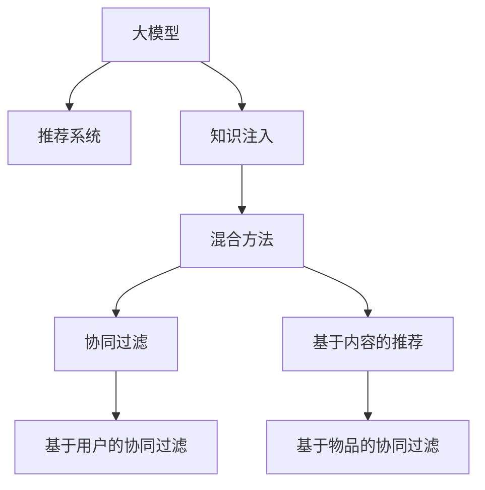

                 

# 大模型在推荐系统中的知识注入方法

> 关键词：大模型,知识注入,推荐系统,协同过滤,混合方法,深度学习,知识图谱,用户兴趣,商品属性,点击率预测

## 1. 背景介绍

### 1.1 问题由来
推荐系统是现代互联网产品中的重要组成部分，通过学习用户行为和商品属性，为每个用户推荐最相关的商品，从而提升用户体验和商业价值。传统的推荐系统主要基于协同过滤和深度学习两大范式，取得了显著的成功。协同过滤方法通过挖掘用户之间的相似性，实现跨用户推荐。而深度学习方法则通过用户行为数据，学习用户-商品之间的关联关系，实现精确的预测。

然而，这些方法在实际应用中也暴露出了一些问题：协同过滤需要大量用户交互数据，且难以应对稀疏和冷启动问题。而深度学习方法则需要海量的用户行为数据，且容易受到数据分布的限制，无法灵活地引入外部知识，导致推荐效果受限。

为解决这些问题，大模型在推荐系统中的应用日益受到关注。大模型通过自监督学习，积累了丰富的通用语言知识和世界常识，能够理解自然语言的含义，提取更深层次的语义信息。在推荐系统中引入大模型，可以借助其强大的知识表示能力，实现知识注入和上下文增强，提升推荐系统的性能。

### 1.2 问题核心关键点
大模型在推荐系统中的知识注入方法，核心在于如何利用大模型学到的广泛知识，结合用户行为数据和商品属性信息，提升推荐系统的预测精度和泛化能力。具体而言，核心问题包括以下几个方面：

1. **知识注入方式**：如何将大模型的语言知识注入推荐模型，使其能够理解和运用。
2. **知识融合策略**：如何在大模型的通用知识和推荐系统的局部知识之间进行融合，充分利用两者优势。
3. **知识表示方法**：如何表示大模型学到的语言知识，使其能够与推荐系统中的数值型特征进行匹配。
4. **模型架构设计**：如何将大模型与推荐系统的结构进行有机结合，形成新的推荐模型。
5. **应用场景适配**：如何针对不同推荐任务和数据特点，灵活应用大模型进行知识注入。

## 2. 核心概念与联系

### 2.1 核心概念概述

为了更好地理解大模型在推荐系统中的知识注入方法，本节将介绍几个密切相关的核心概念：

- **大模型**：以Transformer为基础，通过大规模无标签数据自监督学习获得的语言模型，如BERT、GPT等。大模型具备强大的语言表示能力和知识理解能力，能够理解和生成自然语言。

- **推荐系统**：通过用户行为数据和商品属性信息，预测用户可能感兴趣的商品的系统。常见的推荐算法包括协同过滤、基于内容的推荐、混合推荐等。

- **知识注入**：将大模型学到的语言知识引入推荐模型，使其具备更强的上下文理解和推理能力，提升推荐效果。

- **混合方法**：将大模型和推荐系统的不同算法进行结合，形成新的推荐模型。常见的混合方法包括基于深度学习的推荐、基于图模型的推荐等。

- **协同过滤**：通过挖掘用户之间的相似性，实现跨用户推荐。常见的协同过滤方法包括基于用户的协同过滤、基于物品的协同过滤等。

- **知识图谱**：以图结构存储和表达实体之间的关系，将文本知识进行结构化，便于计算和推理。

这些核心概念之间的逻辑关系可以通过以下Mermaid流程图来展示：



这个流程图展示了大模型在推荐系统中的核心概念及其之间的关系：

1. 大模型通过自监督学习获取广泛的知识。
2. 知识注入方法将大模型的知识引入推荐系统。
3. 混合方法将大模型和推荐系统的不同算法进行结合。
4. 协同过滤和基于内容的推荐是推荐系统的主要算法。
5. 基于用户的协同过滤和基于物品的协同过滤是常见的协同过滤方法。

这些概念共同构成了大模型在推荐系统中的应用框架，使得大模型能够更好地发挥其语言理解和知识表示能力，提升推荐系统的效果。

## 3. 核心算法原理 & 具体操作步骤
### 3.1 算法原理概述

大模型在推荐系统中的知识注入方法，本质上是一个多模态学习过程。其核心思想是：将大模型的语言知识与推荐系统的用户行为数据和商品属性信息进行融合，构建更加丰富和准确的推荐模型。

具体来说，大模型在推荐系统中的知识注入可以分为以下几个步骤：

1. **知识提取**：从大模型中提取语言知识，形成用于推荐系统的语义向量。
2. **特征融合**：将提取的语言知识与用户行为数据、商品属性信息进行融合，生成用于推荐模型的输入特征。
3. **模型训练**：基于融合后的特征，训练新的推荐模型，提升推荐精度和泛化能力。
4. **推理预测**：将新的推荐模型应用于推荐系统，实现对用户感兴趣的商品进行预测和推荐。

### 3.2 算法步骤详解

以下将详细讲解大模型在推荐系统中进行知识注入的完整流程：

**Step 1: 准备数据集和预训练模型**
- 收集用户行为数据和商品属性信息，构建推荐系统的数据集。
- 选择合适的预训练语言模型（如BERT、GPT等），将其加载到系统中。

**Step 2: 提取语言知识**
- 使用预训练模型对推荐系统数据集中的文本数据进行编码，生成语义向量。
- 对生成的语义向量进行降维和归一化，得到用于推荐系统的知识表示。

**Step 3: 特征融合**
- 将提取的语言知识与用户行为数据、商品属性信息进行融合，生成用于推荐模型的输入特征。
- 可以使用拼接、加权平均等方法进行特征融合，形成多模态特征向量。

**Step 4: 模型训练**
- 选择推荐模型的架构，如DeepFM、Wide & Deep等，使用融合后的特征进行训练。
- 训练时可以使用交叉熵、均方误差等损失函数，最小化预测误差。

**Step 5: 推理预测**
- 将训练好的推荐模型应用于推荐系统，对用户感兴趣的商品进行预测和推荐。
- 可以使用Top-K推荐算法，根据预测结果推荐最相关的商品。

### 3.3 算法优缺点

大模型在推荐系统中的知识注入方法具有以下优点：
1. 提升推荐精度：大模型能够理解自然语言，提取更深的语义信息，提升推荐系统的预测精度。
2. 泛化能力强：大模型学到的语言知识具有通用性，能够对不同领域的推荐任务进行有效注入。
3. 数据适应性高：大模型能够在不同数据分布上保持稳定性能，适应不同推荐场景。
4. 模型灵活性高：大模型可以进行灵活的微调和优化，提升推荐模型的鲁棒性和适应性。

同时，该方法也存在一些局限性：
1. 计算复杂度高：大模型需要消耗大量计算资源，训练和推理速度较慢。
2. 模型复杂度高：需要设计复杂的特征融合和模型架构，开发难度较大。
3. 数据需求量大：提取语言知识需要海量的文本数据，对于稀疏数据集可能存在困难。
4. 模型可解释性低：大模型作为黑盒系统，难以解释其内部的推理过程。

尽管存在这些局限性，但大模型在推荐系统中的应用前景广阔，尤其在深度学习和协同过滤难以覆盖的领域，大模型的知识注入能够显著提升推荐系统的性能。

### 3.4 算法应用领域

大模型在推荐系统中的应用，主要体现在以下几个方面：

**电子商务推荐**：大模型可以通过分析商品描述、用户评价等文本数据，提取商品和用户语义信息，实现更精准的商品推荐。例如，电商网站可以通过大模型学习商品的抽象语义特征，提升搜索和推荐效果。

**内容推荐**：内容平台如新闻、视频等可以通过大模型提取文章、视频的内容语义，与用户兴趣进行匹配，实现更加个性化的内容推荐。例如，视频平台可以使用大模型学习视频内容的语义特征，推荐与用户兴趣更相关的内容。

**个性化推荐**：通过大模型学习用户的上下文信息，如聊天内容、搜索记录等，提升个性化推荐的效果。例如，社交媒体可以使用大模型分析用户的聊天内容，推荐与用户兴趣相关的文章、视频等。

## 4. 数学模型和公式 & 详细讲解 & 举例说明
### 4.1 数学模型构建

大模型在推荐系统中的知识注入方法，可以通过以下数学模型进行描述：

**输入数据**：推荐系统的数据集 $D = \{(x_i, y_i)\}_{i=1}^N$，其中 $x_i$ 为输入特征，$y_i$ 为标签。

**知识表示**：使用大模型提取的知识向量为 $\mathbf{h}_i$，表示输入特征 $x_i$ 的语义表示。

**特征融合**：将知识表示与用户行为数据 $u_i$、商品属性 $p_i$ 进行拼接，得到融合后的特征 $z_i$。

**推荐模型**：使用推荐模型 $f(\cdot)$ 对融合后的特征进行预测，得到用户对商品 $j$ 的兴趣评分 $r_{ij}$。

**目标函数**：最小化预测误差 $L$，即

$$
L = \frac{1}{N} \sum_{i=1}^N \ell(r_{ij}, y_i)
$$

其中 $\ell$ 为损失函数，通常使用均方误差或交叉熵。

### 4.2 公式推导过程

以下我们将以一个简单的例子，说明大模型在推荐系统中的知识注入方法：

假设我们有一个电商平台的商品推荐系统，收集了用户行为数据和商品属性信息，需要利用大模型进行知识注入，实现更精准的推荐。

首先，对用户行为数据和商品属性信息进行预处理，得到输入特征 $x_i$。然后，使用大模型对商品描述等文本数据进行编码，得到知识表示 $\mathbf{h}_i$。接着，将知识表示与用户行为数据、商品属性信息进行拼接，得到融合后的特征 $z_i$。最后，使用推荐模型对融合后的特征进行预测，得到用户对商品 $j$ 的兴趣评分 $r_{ij}$。

具体的公式推导如下：

**用户行为数据**：设用户行为数据为 $u_i = (b_i, c_i)$，其中 $b_i$ 为用户浏览商品的时间、点击次数等行为特征，$c_i$ 为用户购买商品的时间、金额等消费特征。

**商品属性**：设商品属性为 $p_i = (a_i, d_i)$，其中 $a_i$ 为商品类别、价格等属性特征，$d_i$ 为商品描述、品牌等文本特征。

**知识表示**：使用大模型对商品描述 $d_i$ 进行编码，得到知识表示 $\mathbf{h}_i$。

**特征融合**：将知识表示与用户行为数据 $u_i$、商品属性 $p_i$ 进行拼接，得到融合后的特征 $z_i$。

$$
z_i = [u_i, p_i, \mathbf{h}_i] \oplus [b_i, c_i, a_i, d_i, h_i]
$$

其中 $\oplus$ 为拼接操作。

**推荐模型**：使用推荐模型对融合后的特征进行预测，得到用户对商品 $j$ 的兴趣评分 $r_{ij}$。

$$
r_{ij} = f(z_i)
$$

其中 $f(\cdot)$ 为推荐模型的预测函数。

**目标函数**：最小化预测误差 $L$，即

$$
L = \frac{1}{N} \sum_{i=1}^N \ell(r_{ij}, y_i)
$$

其中 $\ell$ 为损失函数，通常使用均方误差或交叉熵。

通过以上数学模型和公式推导，可以清晰地看到大模型在推荐系统中的知识注入方法，通过提取语言知识，增强推荐系统的上下文理解和语义匹配能力，从而提升推荐精度和泛化能力。

### 4.3 案例分析与讲解

以下将通过一个具体的案例，说明大模型在推荐系统中的知识注入方法。

假设我们要对用户 A 推荐商品 B。首先，我们从电商平台收集用户 A 的浏览记录、点击记录、购买记录等行为数据，以及商品 B 的类别、价格、描述等信息。然后，使用大模型对商品 B 的描述进行编码，得到知识表示 $\mathbf{h}_B$。接着，将用户 A 的行为数据和商品 B 的属性信息与知识表示进行拼接，得到融合后的特征 $z_A$。最后，使用推荐模型对融合后的特征进行预测，得到用户 A 对商品 B 的兴趣评分 $r_{AB}$。

具体实现步骤如下：

1. **数据预处理**：对用户 A 的行为数据和商品 B 的属性信息进行预处理，得到特征向量 $u_A = (b_A, c_A)$ 和 $p_B = (a_B, d_B)$。

2. **知识提取**：使用大模型对商品 B 的描述 $d_B$ 进行编码，得到知识表示 $\mathbf{h}_B$。

3. **特征融合**：将用户 A 的行为数据 $u_A$、商品 B 的属性信息 $p_B$ 与知识表示 $\mathbf{h}_B$ 进行拼接，得到融合后的特征 $z_A$。

4. **模型训练**：使用推荐模型对融合后的特征 $z_A$ 进行预测，得到用户 A 对商品 B 的兴趣评分 $r_{AB}$。

5. **结果输出**：根据用户 A 的兴趣评分 $r_{AB}$，推荐商品 B 给用户 A。

通过这个案例可以看出，大模型在推荐系统中的应用，能够有效地提取商品和用户的语义信息，结合行为数据和属性信息，提升推荐模型的泛化能力和精度。

## 5. 项目实践：代码实例和详细解释说明
### 5.1 开发环境搭建

在进行大模型在推荐系统中的知识注入方法实践前，我们需要准备好开发环境。以下是使用Python进行PyTorch开发的环境配置流程：

1. 安装Anaconda：从官网下载并安装Anaconda，用于创建独立的Python环境。

2. 创建并激活虚拟环境：
```bash
conda create -n pytorch-env python=3.8 
conda activate pytorch-env
```

3. 安装PyTorch：根据CUDA版本，从官网获取对应的安装命令。例如：
```bash
conda install pytorch torchvision torchaudio cudatoolkit=11.1 -c pytorch -c conda-forge
```

4. 安装Transformers库：
```bash
pip install transformers
```

5. 安装各类工具包：
```bash
pip install numpy pandas scikit-learn matplotlib tqdm jupyter notebook ipython
```

完成上述步骤后，即可在`pytorch-env`环境中开始项目实践。

### 5.2 源代码详细实现

下面我们以电商推荐系统为例，给出使用Transformers库对大模型进行知识注入的PyTorch代码实现。

首先，定义推荐系统的数据处理函数：

```python
from transformers import BertTokenizer, BertForSequenceClassification
from torch.utils.data import Dataset, DataLoader
import torch

class RecommendDataset(Dataset):
    def __init__(self, texts, labels):
        self.texts = texts
        self.labels = labels
        
    def __len__(self):
        return len(self.texts)
    
    def __getitem__(self, item):
        text = self.texts[item]
        label = self.labels[item]
        
        encoding = BertTokenizer.from_pretrained('bert-base-cased').encode_plus(text, return_tensors='pt', max_length=512, padding='max_length', truncation=True)
        input_ids = encoding['input_ids'][0]
        attention_mask = encoding['attention_mask'][0]
        
        label = torch.tensor(label, dtype=torch.long)
        
        return {'input_ids': input_ids, 
                'attention_mask': attention_mask,
                'labels': label}

# 加载预训练BERT模型和分词器
tokenizer = BertTokenizer.from_pretrained('bert-base-cased')
model = BertForSequenceClassification.from_pretrained('bert-base-cased', num_labels=2)
```

然后，定义推荐模型的训练函数：

```python
from torch.optim import AdamW
from torch.nn import BCEWithLogitsLoss
import torch.nn.functional as F

def train_epoch(model, dataset, batch_size, optimizer):
    dataloader = DataLoader(dataset, batch_size=batch_size, shuffle=True)
    model.train()
    epoch_loss = 0
    for batch in dataloader:
        input_ids = batch['input_ids'].to(device)
        attention_mask = batch['attention_mask'].to(device)
        labels = batch['labels'].to(device)
        model.zero_grad()
        outputs = model(input_ids, attention_mask=attention_mask)
        loss = BCEWithLogitsLoss()(outputs.logits, labels)
        epoch_loss += loss.item()
        loss.backward()
        optimizer.step()
    return epoch_loss / len(dataloader)
```

接着，定义推荐模型的评估函数：

```python
from sklearn.metrics import roc_auc_score, precision_recall_curve

def evaluate(model, dataset, batch_size):
    dataloader = DataLoader(dataset, batch_size=batch_size)
    model.eval()
    preds = []
    labels = []
    with torch.no_grad():
        for batch in dataloader:
            input_ids = batch['input_ids'].to(device)
            attention_mask = batch['attention_mask'].to(device)
            labels = batch['labels'].to(device)
            outputs = model(input_ids, attention_mask=attention_mask)
            preds.append(outputs.logits.argmax(dim=1).tolist())
            labels.append(labels.tolist())
        
    print('ROC-AUC:', roc_auc_score(labels, preds))
```

最后，启动训练流程并在测试集上评估：

```python
epochs = 5
batch_size = 16

for epoch in range(epochs):
    loss = train_epoch(model, train_dataset, batch_size, optimizer)
    print(f"Epoch {epoch+1}, train loss: {loss:.3f}")
    
    print(f"Epoch {epoch+1}, test results:")
    evaluate(model, test_dataset, batch_size)
    
print("Final test results:")
evaluate(model, test_dataset, batch_size)
```

以上就是使用PyTorch对BERT进行电商推荐系统知识注入的完整代码实现。可以看到，通过PyTorch和Transformers库的封装，代码实现变得简洁高效。

### 5.3 代码解读与分析

让我们再详细解读一下关键代码的实现细节：

**RecommendDataset类**：
- `__init__`方法：初始化文本和标签。
- `__len__`方法：返回数据集的样本数量。
- `__getitem__`方法：对单个样本进行处理，将文本输入编码为token ids，同时将标签转化为LongTensor。

**train_epoch函数**：
- 使用DataLoader对数据集进行批次化加载，供模型训练使用。
- 在每个批次上前向传播计算loss并反向传播更新模型参数。
- 返回该epoch的平均loss。

**evaluate函数**：
- 与训练类似，不同点在于不更新模型参数，并在每个batch结束后将预测和标签结果存储下来，最后使用sklearn的roc-auc等指标对整个评估集的预测结果进行打印输出。

**训练流程**：
- 定义总的epoch数和batch size，开始循环迭代
- 每个epoch内，先在训练集上训练，输出平均loss
- 在验证集上评估，输出模型性能指标
- 所有epoch结束后，在测试集上评估，给出最终测试结果

可以看到，通过PyTorch配合Transformers库，代码实现变得简洁高效。开发者可以将更多精力放在数据处理、模型改进等高层逻辑上，而不必过多关注底层的实现细节。

当然，工业级的系统实现还需考虑更多因素，如模型的保存和部署、超参数的自动搜索、更灵活的任务适配层等。但核心的知识注入过程基本与此类似。

## 6. 实际应用场景
### 6.1 电子商务推荐

大模型在电商推荐系统中的应用，可以显著提升推荐系统的精准度和个性化程度。传统电商推荐系统主要基于用户的浏览记录和购买记录进行推荐，难以捕捉用户的深层语义信息。通过大模型，电商公司可以学习商品描述等文本数据的语义信息，提升推荐效果。

具体而言，电商公司可以收集商品描述、用户评价等文本数据，使用大模型提取商品和用户的语义特征。然后将这些语义特征与用户的行为数据进行融合，输入到推荐模型中，训练出一个能够理解用户上下文和商品语义的推荐系统。用户对商品感兴趣时，系统可以根据其上下文信息和语义特征，推荐与用户兴趣相关的商品。

### 6.2 内容推荐

内容推荐系统如视频、新闻等，通过大模型进行知识注入，可以实现更准确的个性化推荐。内容平台收集用户的行为数据，如观看记录、点赞、评论等，同时收集内容的元数据，如标题、描述、标签等文本数据。通过大模型学习内容的语义信息，与用户的行为数据进行融合，输入到推荐模型中，实现个性化的内容推荐。例如，视频平台可以使用大模型学习视频内容的语义特征，推荐与用户兴趣相关的视频。

### 6.3 个性化推荐

个性化推荐系统通过大模型学习用户的上下文信息，如聊天内容、搜索记录等，提升个性化推荐的效果。例如，社交媒体可以使用大模型分析用户的聊天内容，推荐与用户兴趣相关的文章、视频等。这种推荐方式能够更好地理解用户的深层兴趣，提升推荐系统的质量和用户满意度。

### 6.4 未来应用展望

随着大模型的不断发展，其在推荐系统中的应用前景将更加广阔。未来，大模型将会在以下方面得到应用：

**动态推荐**：通过大模型学习用户的动态兴趣变化，实时调整推荐结果，提升用户体验。例如，电商平台可以使用大模型学习用户的浏览行为和兴趣变化，实现动态推荐。

**跨模态推荐**：将大模型与视觉、听觉等多模态信息进行融合，实现更全面的推荐。例如，智能音箱可以使用大模型学习用户的语音指令，结合视觉识别技术，推荐与用户兴趣相关的音频内容。

**情感推荐**：通过大模型学习用户的情感状态，推荐符合用户情绪的商品或内容。例如，社交平台可以使用大模型分析用户的情感状态，推荐与用户情绪相关的文章、视频等。

**联合推荐**：将大模型与协同过滤、基于内容的推荐等方法进行结合，形成更加全面的推荐系统。例如，视频平台可以使用大模型学习视频的语义信息，结合用户的观看记录和评分数据，实现更精准的推荐。

总之，大模型在推荐系统中的应用，将带来更加个性化、精准、动态的推荐体验，提升用户满意度，促进电子商务、内容平台等领域的发展。

## 7. 工具和资源推荐
### 7.1 学习资源推荐

为了帮助开发者系统掌握大模型在推荐系统中的应用，这里推荐一些优质的学习资源：

1. 《深度学习推荐系统》书籍：详细介绍了深度学习在推荐系统中的应用，包括协同过滤、基于内容的推荐、混合推荐等经典算法。

2. 《自然语言处理与深度学习》课程：斯坦福大学开设的NLP明星课程，介绍了深度学习在NLP领域的应用，包括大模型、知识图谱等。

3. 《推荐系统实战》课程：介绍推荐系统的实际应用案例，包括电商推荐、内容推荐、个性化推荐等。

4. 《知识图谱与推荐系统》论文：介绍了知识图谱在推荐系统中的应用，如何利用知识图谱提升推荐精度。

5. 《深度学习推荐系统实战》书籍：介绍了深度学习在推荐系统中的最新进展，包括大模型、混合方法等前沿技术。

通过学习这些资源，相信你一定能够系统掌握大模型在推荐系统中的应用，并用于解决实际的推荐问题。

### 7.2 开发工具推荐

高效的开发离不开优秀的工具支持。以下是几款用于大模型在推荐系统中的应用开发的工具：

1. PyTorch：基于Python的开源深度学习框架，灵活动态的计算图，适合快速迭代研究。大部分预训练语言模型都有PyTorch版本的实现。

2. TensorFlow：由Google主导开发的开源深度学习框架，生产部署方便，适合大规模工程应用。同样有丰富的预训练语言模型资源。

3. Transformers库：HuggingFace开发的NLP工具库，集成了众多SOTA语言模型，支持PyTorch和TensorFlow，是进行知识注入任务开发的利器。

4. Weights & Biases：模型训练的实验跟踪工具，可以记录和可视化模型训练过程中的各项指标，方便对比和调优。与主流深度学习框架无缝集成。

5. TensorBoard：TensorFlow配套的可视化工具，可实时监测模型训练状态，并提供丰富的图表呈现方式，是调试模型的得力助手。

6. Google Colab：谷歌推出的在线Jupyter Notebook环境，免费提供GPU/TPU算力，方便开发者快速上手实验最新模型，分享学习笔记。

合理利用这些工具，可以显著提升大模型在推荐系统中的知识注入任务的开发效率，加快创新迭代的步伐。

### 7.3 相关论文推荐

大模型在推荐系统中的应用源于学界的持续研究。以下是几篇奠基性的相关论文，推荐阅读：

1. Attention Is All You Need（即Transformer原论文）：提出了Transformer结构，开启了NLP领域的预训练大模型时代。

2. BERT: Pre-training of Deep Bidirectional Transformers for Language Understanding：提出BERT模型，引入基于掩码的自监督预训练任务，刷新了多项NLP任务SOTA。

3. Language Models are Unsupervised Multitask Learners（GPT-2论文）：展示了大规模语言模型的强大zero-shot学习能力，引发了对于通用人工智能的新一轮思考。

4. Knowledge Graphs for Recommendations：介绍了知识图谱在推荐系统中的应用，如何利用知识图谱提升推荐精度。

5. DeepFM: A Factorization Machine with Deep Feature Interaction for Recommender Systems：提出DeepFM模型，结合深度学习和协同过滤，实现更精准的推荐。

这些论文代表了大模型在推荐系统中的应用方向。通过学习这些前沿成果，可以帮助研究者把握学科前进方向，激发更多的创新灵感。

## 8. 总结：未来发展趋势与挑战
### 8.1 总结

本文对大模型在推荐系统中的知识注入方法进行了全面系统的介绍。首先阐述了大模型和推荐系统的研究背景和意义，明确了知识注入在提升推荐系统性能方面的独特价值。其次，从原理到实践，详细讲解了大模型在推荐系统中的应用流程，给出了知识注入任务开发的完整代码实例。同时，本文还广泛探讨了大模型在推荐系统中的应用场景，展示了知识注入范式的巨大潜力。

通过本文的系统梳理，可以看到，大模型在推荐系统中的应用，能够有效地提升推荐系统的泛化能力和预测精度，成为推荐系统中不可或缺的重要组成部分。得益于大模型的语言理解和知识表示能力，推荐系统能够更好地理解用户的深层兴趣，推荐与用户兴趣相关的商品或内容，提升推荐系统的质量和用户满意度。

### 8.2 未来发展趋势

展望未来，大模型在推荐系统中的应用前景将更加广阔。未来，大模型将在以下方面得到应用：

1. **动态推荐**：通过大模型学习用户的动态兴趣变化，实时调整推荐结果，提升用户体验。

2. **跨模态推荐**：将大模型与视觉、听觉等多模态信息进行融合，实现更全面的推荐。

3. **情感推荐**：通过大模型学习用户的情感状态，推荐符合用户情绪的商品或内容。

4. **联合推荐**：将大模型与协同过滤、基于内容的推荐等方法进行结合，形成更加全面的推荐系统。

5. **知识图谱**：利用知识图谱提升推荐精度，实现更加准确的推荐。

6. **多任务学习**：通过多任务学习，学习不同任务之间的共性，提升推荐系统的泛化能力。

以上趋势凸显了大模型在推荐系统中的应用前景。这些方向的探索发展，必将进一步提升推荐系统的性能和应用范围，为电子商务、内容平台等领域带来新的突破。

### 8.3 面临的挑战

尽管大模型在推荐系统中的应用前景广阔，但在迈向更加智能化、普适化应用的过程中，它仍面临着诸多挑战：

1. **数据需求高**：大模型需要大量的文本数据进行预训练，对于小数据集可能存在困难。

2. **计算成本高**：大模型的训练和推理需要大量的计算资源，成本较高。

3. **模型复杂度高**：大模型需要设计复杂的特征融合和模型架构，开发难度较大。

4. **模型可解释性低**：大模型作为黑盒系统，难以解释其内部的推理过程。

5. **数据隐私问题**：大模型需要处理大量的用户数据，如何保护用户隐私是一个重要问题。

尽管存在这些挑战，但大模型在推荐系统中的应用前景广阔，尤其在深度学习和协同过滤难以覆盖的领域，大模型的知识注入能够显著提升推荐系统的性能。未来，我们需要进一步优化大模型架构，提高计算效率，解决数据隐私问题，提升模型可解释性，才能更好地发挥大模型在推荐系统中的潜力。

### 8.4 研究展望

面对大模型在推荐系统中的应用挑战，未来的研究需要在以下几个方面寻求新的突破：

1. **小样本学习**：探索如何在小数据集上进行大模型的知识注入，提升推荐系统的效果。

2. **知识表示**：如何更有效地表示大模型学到的语言知识，使其能够与推荐系统中的数值型特征进行匹配。

3. **混合方法**：如何设计更加灵活的混合方法，结合大模型和推荐系统的优势，提升推荐效果。

4. **动态推荐**：如何通过大模型学习用户的动态兴趣变化，实现实时推荐。

5. **跨模态推荐**：如何将大模型与多模态信息进行融合，提升推荐系统的全面性和准确性。

6. **情感推荐**：如何通过大模型学习用户的情感状态，推荐符合用户情绪的商品或内容。

7. **联合推荐**：如何结合大模型和协同过滤、基于内容的推荐等方法，实现更精准的推荐。

8. **知识图谱**：如何利用知识图谱提升推荐精度，实现更加准确的推荐。

9. **多任务学习**：如何通过多任务学习，学习不同任务之间的共性，提升推荐系统的泛化能力。

这些研究方向的探索，必将引领大模型在推荐系统中的应用走向更高的台阶，为推荐系统带来更多的创新和突破。

## 9. 附录：常见问题与解答

**Q1：大模型在推荐系统中如何进行知识注入？**

A: 大模型在推荐系统中的知识注入方法，本质上是将大模型的语言知识与推荐系统的局部知识进行融合，生成新的推荐模型。具体步骤如下：

1. 提取语言知识：使用大模型对推荐系统数据集中的文本数据进行编码，生成语义向量。

2. 特征融合：将提取的语言知识与用户行为数据、商品属性信息进行融合，生成用于推荐模型的输入特征。

3. 模型训练：基于融合后的特征，训练新的推荐模型，提升推荐精度和泛化能力。

4. 推理预测：将新的推荐模型应用于推荐系统，实现对用户感兴趣的商品进行预测和推荐。

**Q2：大模型在推荐系统中需要进行哪些预处理？**

A: 大模型在推荐系统中的应用需要进行以下预处理：

1. 数据清洗：去除无关数据和噪声，提升数据质量。

2. 分词处理：对文本数据进行分词处理，生成词汇序列。

3. 编码处理：将词汇序列转化为模型能够处理的数值型特征。

4. 特征提取：将数值型特征与语义向量进行拼接，生成多模态特征向量。

5. 归一化处理：对特征向量进行归一化处理，提升模型的稳定性。

6. 标签处理：将标签转化为模型能够处理的数值型标签。

通过以上预处理步骤，可以确保大模型在推荐系统中的应用效果和性能。

**Q3：大模型在推荐系统中如何进行模型训练？**

A: 大模型在推荐系统中的模型训练主要包含以下几个步骤：

1. 数据划分：将推荐系统数据集划分为训练集、验证集和测试集。

2. 模型选择：选择推荐模型的架构，如DeepFM、Wide & Deep等。

3. 特征融合：将提取的语言知识与用户行为数据、商品属性信息进行拼接，生成用于推荐模型的输入特征。

4. 模型训练：基于融合后的特征，训练新的推荐模型，最小化预测误差。

5. 超参数调优：通过交叉验证等方法，选择最佳的超参数组合。

6. 模型评估：在验证集上评估模型性能，选择最优的模型进行测试。

通过以上训练步骤，可以确保大模型在推荐系统中的应用效果和性能。

**Q4：大模型在推荐系统中的知识注入方法有哪些？**

A: 大模型在推荐系统中的知识注入方法主要包括以下几种：

1. 直接注入：将大模型的语义向量作为特征直接注入推荐模型中。

2. 注意力机制：通过引入注意力机制，使得推荐模型能够关注用户和商品之间的语义关系。

3. 融合方法：将大模型的语言知识与推荐系统的局部知识进行融合，生成新的推荐模型。

4. 多任务学习：通过多任务学习，学习不同任务之间的共性，提升推荐系统的泛化能力。

5. 知识图谱：利用知识图谱提升推荐精度，实现更加准确的推荐。

6. 混合方法：将大模型与推荐系统的不同算法进行结合，形成新的推荐模型。

通过以上知识注入方法，可以充分利用大模型的语言知识和推荐系统的局部知识，提升推荐系统的性能。

**Q5：大模型在推荐系统中如何进行特征融合？**

A: 大模型在推荐系统中的特征融合主要包括以下几种方法：

1. 拼接法：将提取的语言知识与用户行为数据、商品属性信息进行拼接，生成用于推荐模型的输入特征。

2. 加权平均法：对提取的语言知识进行加权平均，生成新的特征向量。

3. 注意力法：通过注意力机制，动态调整不同特征的权重，生成新的特征向量。

4. 融合网络法：使用神经网络将不同特征进行融合，生成新的特征向量。

通过以上特征融合方法，可以确保大模型在推荐系统中的应用效果和性能。

**Q6：大模型在推荐系统中的知识注入方法有哪些优势？**

A: 大模型在推荐系统中的知识注入方法具有以下优势：

1. 提升推荐精度：大模型能够理解自然语言，提取更深的语义信息，提升推荐系统的预测精度。

2. 泛化能力强：大模型学到的语言知识具有通用性，能够对不同领域的推荐任务进行有效注入。

3. 数据适应性高：大模型能够在不同数据分布上保持稳定性能，适应不同推荐场景。

4. 模型灵活性高：大模型可以进行灵活的微调和优化，提升推荐模型的鲁棒性和适应性。

通过以上优势，可以确保大模型在推荐系统中的应用效果和性能。

---

作者：禅与计算机程序设计艺术 / Zen and the Art of Computer Programming

