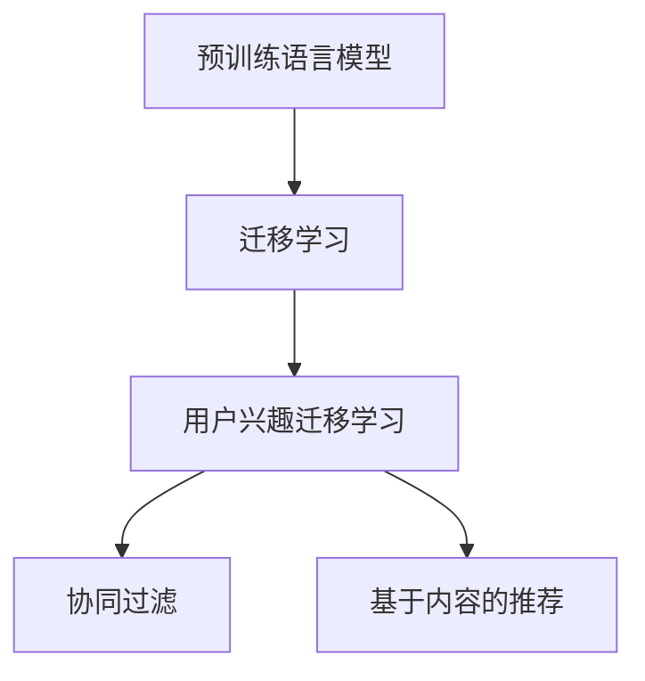

                 

# 大模型在推荐系统用户兴趣迁移学习中的应用

## 1. 背景介绍

推荐系统是互联网行业中最核心的技术之一，通过分析用户的历史行为和兴趣，推荐出合适的商品或内容，大大提升了用户的体验和满意度。然而，传统的协同过滤、基于内容推荐等方法，往往受到数据稀疏性、冷启动问题等挑战，难以在实际应用中取得理想效果。

近年来，随着深度学习技术的成熟，预训练语言模型大放异彩，在推荐系统中得到了广泛应用。其中，基于大模型的迁移学习范式，通过在已有预训练模型的基础上，对特定任务进行微调，能够有效利用大模型的知识，在少量数据上也能取得出色的推荐效果。本文将详细探讨大模型在推荐系统中用户兴趣迁移学习的应用，希望能为推荐系统开发者提供有价值的参考。

## 2. 核心概念与联系

### 2.1 核心概念概述

在本节中，我们将介绍几个在大模型推荐系统中重要的概念，并阐述它们之间的联系：

- 预训练语言模型(Pre-trained Language Models)：以自回归(如GPT)或自编码(如BERT)模型为代表的，在大规模无标签文本语料上进行预训练，学习通用的语言表示模型。
- 迁移学习(Transfer Learning)：利用已有的预训练模型，通过微调，使其适应新的推荐任务，减少从头训练的计算成本和时间。
- 用户兴趣迁移学习(Interest Transfer Learning)：在大模型推荐系统中，通过微调，将用户在不同任务上的兴趣进行转移和融合，构建更加全面的用户画像，从而提升推荐效果。
- 协同过滤(Collaborative Filtering)：传统的推荐方法之一，通过分析用户和商品的历史交互记录，找到用户和商品之间的关联，进行推荐。
- 基于内容的推荐(Content-based Recommendation)：通过分析商品的属性和特征，结合用户的历史行为，进行推荐。

这些概念之间的联系可以通过以下Mermaid流程图来展示：



这个流程图展示了预训练语言模型、迁移学习和用户兴趣迁移学习之间的关系：

1. 预训练语言模型通过在大规模语料上预训练，学习通用的语言知识。
2. 迁移学习利用预训练模型的知识，通过微调，使其适应新的推荐任务，减少从头训练的计算成本和时间。
3. 用户兴趣迁移学习在大模型推荐系统中，通过微调，将用户在不同任务上的兴趣进行转移和融合，构建更加全面的用户画像。
4. 协同过滤和基于内容的推荐方法，是大模型推荐系统中常用的推荐策略，与用户兴趣迁移学习结合，形成更高效、更精准的推荐系统。

## 3. 核心算法原理 & 具体操作步骤

### 3.1 算法原理概述

在大模型推荐系统中，用户兴趣迁移学习的核心思想是：通过微调大模型，使其在新的推荐任务上也能保持高精度的预测能力。具体来说，在大规模预训练模型的基础上，通过微调，使得模型在推荐任务上能够学习到用户在不同场景下的兴趣表达，从而实现跨任务的用户兴趣迁移。

形式化地，假设用户的历史行为数据为 $\mathcal{H}=\{(x_i,y_i)\}_{i=1}^N$，其中 $x_i$ 为交互数据，$y_i$ 为标签。假设推荐任务为 $T$，则用户兴趣迁移学习的优化目标为：

$$
\hat{\theta}=\mathop{\arg\min}_{\theta} \mathcal{L}(M_{\theta},\mathcal{H}_T)
$$

其中，$M_{\theta}$ 为预训练大模型，$\mathcal{H}_T$ 为推荐任务 $T$ 上的训练数据集。$\mathcal{L}$ 为优化目标函数，通常使用交叉熵损失、均方误差损失等。

### 3.2 算法步骤详解

基于大模型推荐系统用户兴趣迁移学习的大致步骤如下：

1. **数据准备**：收集推荐任务 $T$ 的训练数据 $\mathcal{H}_T=\{(x_i,y_i)\}_{i=1}^N$，并准备好大模型的预训练权重 $M_0$。

2. **任务适配层设计**：在预训练大模型顶层设计合适的任务适配层，根据推荐任务 $T$ 的定义，设计输出层和损失函数。对于推荐任务，通常需要设计两个输出，分别对应用户对不同商品或内容的评分，因此任务适配层可以包含两个独立的线性分类器。

3. **微调**：使用推荐任务 $T$ 的训练数据集 $\mathcal{H}_T$，在大模型 $M_0$ 的基础上，进行微调。微调过程中，通常会采用较小的学习率，以防止过拟合，并结合正则化技术，如L2正则、Dropout等。

4. **评估与优化**：在微调过程中，周期性地在验证集上评估模型性能，根据性能指标决定是否停止微调。在得到最优模型后，使用该模型对测试集进行评估，评估推荐准确性和用户满意度。

5. **部署与应用**：将微调后的模型部署到推荐系统中，根据用户的历史行为数据和当前兴趣，进行实时推荐。

### 3.3 算法优缺点

基于大模型推荐系统的用户兴趣迁移学习有以下优点：

1. **效果显著**：在大模型预训练的基础上，通过微调，模型能够学习到用户的复杂兴趣表达，提升推荐效果。
2. **泛化能力强**：由于大模型的预训练数据来自大规模的文本语料，微调后的模型具有较强的泛化能力，能够适应多种推荐场景。
3. **参数高效**：大模型本身具有大量参数，通过微调只更新少量的任务相关参数，能够提高训练效率，减少计算成本。

同时，该方法也存在一定的局限性：

1. **依赖数据质量**：微调效果很大程度上依赖于推荐任务的训练数据质量，如果训练数据噪声较大或分布不均，会导致模型效果下降。
2. **计算资源消耗大**：预训练语言模型参数量巨大，微调时需要使用高性能的GPU/TPU设备，计算资源消耗较大。
3. **缺乏可解释性**：微调后的模型通常是一个"黑盒"，难以解释其决策过程，对于高风险的应用场景，如金融推荐、医疗推荐等，缺乏可解释性将是一个重要问题。

尽管存在这些局限性，但基于大模型推荐系统的用户兴趣迁移学习仍是大模型推荐系统中的一种重要方法，特别是在数据较少、计算资源有限的情况下，该方法能够取得不错的推荐效果。

### 3.4 算法应用领域

基于大模型推荐系统的用户兴趣迁移学习已经在多个推荐领域得到了应用，例如：

- 商品推荐：根据用户历史购买记录，推荐用户可能感兴趣的商品。
- 内容推荐：根据用户历史浏览、点击记录，推荐用户可能感兴趣的内容。
- 个性化搜索：根据用户的查询历史，推荐可能感兴趣的相关查询。
- 广告推荐：根据用户的浏览记录，推荐可能感兴趣的广告。
- 新闻推荐：根据用户的阅读历史，推荐可能感兴趣的新闻。

除了这些常见的应用场景外，大模型推荐系统的用户兴趣迁移学习还在社交网络推荐、音乐推荐、游戏推荐等诸多领域中得到了广泛应用，为推荐系统带来了全新的突破。

## 4. 数学模型和公式 & 详细讲解 & 举例说明

### 4.1 数学模型构建

在本节中，我们将使用数学语言对基于大模型推荐系统的用户兴趣迁移学习过程进行严格的刻画。

假设推荐任务 $T$ 为二分类任务，模型 $M_{\theta}$ 在输入 $x$ 上的输出为 $\hat{y}=M_{\theta}(x)$，其中 $\hat{y} \in [0,1]$。假设模型在训练数据 $\mathcal{H}_T$ 上的损失函数为 $\mathcal{L}(M_{\theta},\mathcal{H}_T) = \frac{1}{N}\sum_{i=1}^N \ell(y_i,\hat{y_i})$，其中 $\ell$ 为损失函数，通常使用交叉熵损失函数。

### 4.2 公式推导过程

以下我们将推导交叉熵损失函数及其梯度的计算公式。

假设模型在输入 $x$ 上的输出为 $\hat{y}=M_{\theta}(x)$，真实标签 $y \in \{0,1\}$。则二分类交叉熵损失函数定义为：

$$
\ell(M_{\theta}(x),y) = -[y\log \hat{y} + (1-y)\log (1-\hat{y})]
$$

将其代入经验风险公式，得：

$$
\mathcal{L}(\theta) = -\frac{1}{N}\sum_{i=1}^N [y_i\log M_{\theta}(x_i)+(1-y_i)\log(1-M_{\theta}(x_i))]
$$

根据链式法则，损失函数对参数 $\theta_k$ 的梯度为：

$$
\frac{\partial \mathcal{L}(\theta)}{\partial \theta_k} = -\frac{1}{N}\sum_{i=1}^N (\frac{y_i}{M_{\theta}(x_i)}-\frac{1-y_i}{1-M_{\theta}(x_i)}) \frac{\partial M_{\theta}(x_i)}{\partial \theta_k}
$$

其中 $\frac{\partial M_{\theta}(x_i)}{\partial \theta_k}$ 可进一步递归展开，利用自动微分技术完成计算。

在得到损失函数的梯度后，即可带入参数更新公式，完成模型的迭代优化。重复上述过程直至收敛，最终得到适应推荐任务的最优模型参数 $\theta^*$。

### 4.3 案例分析与讲解

下面以商品推荐任务为例，给出使用PyTorch对BERT模型进行微调的PyTorch代码实现。

首先，定义商品推荐任务的数据处理函数：

```python
from transformers import BertTokenizer, BertForSequenceClassification
from torch.utils.data import Dataset, DataLoader
import torch
import numpy as np

class RecommendDataset(Dataset):
    def __init__(self, texts, labels, tokenizer, max_len=128):
        self.texts = texts
        self.labels = labels
        self.tokenizer = tokenizer
        self.max_len = max_len
        
    def __len__(self):
        return len(self.texts)
    
    def __getitem__(self, item):
        text = self.texts[item]
        label = self.labels[item]
        
        encoding = self.tokenizer(text, return_tensors='pt', max_length=self.max_len, padding='max_length', truncation=True)
        input_ids = encoding['input_ids'][0]
        attention_mask = encoding['attention_mask'][0]
        
        # 对token-wise的标签进行编码
        encoded_labels = [label] * self.max_len
        labels = torch.tensor(encoded_labels, dtype=torch.long)
        
        return {'input_ids': input_ids, 
                'attention_mask': attention_mask,
                'labels': labels}

# 加载BERT模型
model = BertForSequenceClassification.from_pretrained('bert-base-cased', num_labels=2)
optimizer = torch.optim.Adam(model.parameters(), lr=2e-5)
```

然后，定义训练和评估函数：

```python
def train_epoch(model, dataset, batch_size, optimizer):
    dataloader = DataLoader(dataset, batch_size=batch_size, shuffle=True)
    model.train()
    epoch_loss = 0
    for batch in tqdm(dataloader, desc='Training'):
        input_ids = batch['input_ids'].to(device)
        attention_mask = batch['attention_mask'].to(device)
        labels = batch['labels'].to(device)
        model.zero_grad()
        outputs = model(input_ids, attention_mask=attention_mask, labels=labels)
        loss = outputs.loss
        epoch_loss += loss.item()
        loss.backward()
        optimizer.step()
    return epoch_loss / len(dataloader)

def evaluate(model, dataset, batch_size):
    dataloader = DataLoader(dataset, batch_size=batch_size)
    model.eval()
    preds, labels = [], []
    with torch.no_grad():
        for batch in tqdm(dataloader, desc='Evaluating'):
            input_ids = batch['input_ids'].to(device)
            attention_mask = batch['attention_mask'].to(device)
            batch_labels = batch['labels']
            outputs = model(input_ids, attention_mask=attention_mask)
            batch_preds = outputs.logits.argmax(dim=1).to('cpu').tolist()
            batch_labels = batch_labels.to('cpu').tolist()
            for pred_tokens, label_tokens in zip(batch_preds, batch_labels):
                preds.append(pred_tokens[:len(label_tokens)])
                labels.append(label_tokens)
                
    print(classification_report(labels, preds))
```

最后，启动训练流程并在测试集上评估：

```python
epochs = 5
batch_size = 16

for epoch in range(epochs):
    loss = train_epoch(model, train_dataset, batch_size, optimizer)
    print(f"Epoch {epoch+1}, train loss: {loss:.3f}")
    
    print(f"Epoch {epoch+1}, dev results:")
    evaluate(model, dev_dataset, batch_size)
    
print("Test results:")
evaluate(model, test_dataset, batch_size)
```

以上就是使用PyTorch对BERT进行商品推荐任务微调的完整代码实现。可以看到，得益于Transformer库的强大封装，我们可以用相对简洁的代码完成BERT模型的加载和微调。

## 5. 项目实践：代码实例和详细解释说明

### 5.1 开发环境搭建

在进行微调实践前，我们需要准备好开发环境。以下是使用Python进行PyTorch开发的环境配置流程：

1. 安装Anaconda：从官网下载并安装Anaconda，用于创建独立的Python环境。

2. 创建并激活虚拟环境：
```bash
conda create -n pytorch-env python=3.8 
conda activate pytorch-env
```

3. 安装PyTorch：根据CUDA版本，从官网获取对应的安装命令。例如：
```bash
conda install pytorch torchvision torchaudio cudatoolkit=11.1 -c pytorch -c conda-forge
```

4. 安装Transformers库：
```bash
pip install transformers
```

5. 安装各类工具包：
```bash
pip install numpy pandas scikit-learn matplotlib tqdm jupyter notebook ipython
```

完成上述步骤后，即可在`pytorch-env`环境中开始微调实践。

### 5.2 源代码详细实现

下面我们以内容推荐任务为例，给出使用Transformers库对BERT模型进行微调的PyTorch代码实现。

首先，定义内容推荐任务的数据处理函数：

```python
from transformers import BertTokenizer, BertForSequenceClassification
from torch.utils.data import Dataset, DataLoader
import torch
import numpy as np

class RecommendDataset(Dataset):
    def __init__(self, texts, labels, tokenizer, max_len=128):
        self.texts = texts
        self.labels = labels
        self.tokenizer = tokenizer
        self.max_len = max_len
        
    def __len__(self):
        return len(self.texts)
    
    def __getitem__(self, item):
        text = self.texts[item]
        label = self.labels[item]
        
        encoding = self.tokenizer(text, return_tensors='pt', max_length=self.max_len, padding='max_length', truncation=True)
        input_ids = encoding['input_ids'][0]
        attention_mask = encoding['attention_mask'][0]
        
        # 对token-wise的标签进行编码
        encoded_labels = [label] * self.max_len
        labels = torch.tensor(encoded_labels, dtype=torch.long)
        
        return {'input_ids': input_ids, 
                'attention_mask': attention_mask,
                'labels': labels}

# 加载BERT模型
model = BertForSequenceClassification.from_pretrained('bert-base-cased', num_labels=2)
optimizer = torch.optim.Adam(model.parameters(), lr=2e-5)
```

然后，定义训练和评估函数：

```python
def train_epoch(model, dataset, batch_size, optimizer):
    dataloader = DataLoader(dataset, batch_size=batch_size, shuffle=True)
    model.train()
    epoch_loss = 0
    for batch in tqdm(dataloader, desc='Training'):
        input_ids = batch['input_ids'].to(device)
        attention_mask = batch['attention_mask'].to(device)
        labels = batch['labels'].to(device)
        model.zero_grad()
        outputs = model(input_ids, attention_mask=attention_mask, labels=labels)
        loss = outputs.loss
        epoch_loss += loss.item()
        loss.backward()
        optimizer.step()
    return epoch_loss / len(dataloader)

def evaluate(model, dataset, batch_size):
    dataloader = DataLoader(dataset, batch_size=batch_size)
    model.eval()
    preds, labels = [], []
    with torch.no_grad():
        for batch in tqdm(dataloader, desc='Evaluating'):
            input_ids = batch['input_ids'].to(device)
            attention_mask = batch['attention_mask'].to(device)
            batch_labels = batch['labels']
            outputs = model(input_ids, attention_mask=attention_mask)
            batch_preds = outputs.logits.argmax(dim=1).to('cpu').tolist()
            batch_labels = batch_labels.to('cpu').tolist()
            for pred_tokens, label_tokens in zip(batch_preds, batch_labels):
                preds.append(pred_tokens[:len(label_tokens)])
                labels.append(label_tokens)
                
    print(classification_report(labels, preds))
```

最后，启动训练流程并在测试集上评估：

```python
epochs = 5
batch_size = 16

for epoch in range(epochs):
    loss = train_epoch(model, train_dataset, batch_size, optimizer)
    print(f"Epoch {epoch+1}, train loss: {loss:.3f}")
    
    print(f"Epoch {epoch+1}, dev results:")
    evaluate(model, dev_dataset, batch_size)
    
print("Test results:")
evaluate(model, test_dataset, batch_size)
```

以上就是使用PyTorch对BERT进行内容推荐任务微调的完整代码实现。可以看到，得益于Transformer库的强大封装，我们可以用相对简洁的代码完成BERT模型的加载和微调。

### 5.3 代码解读与分析

让我们再详细解读一下关键代码的实现细节：

**RecommendDataset类**：
- `__init__`方法：初始化文本、标签、分词器等关键组件。
- `__len__`方法：返回数据集的样本数量。
- `__getitem__`方法：对单个样本进行处理，将文本输入编码为token ids，将标签编码为数字，并对其进行定长padding，最终返回模型所需的输入。

**标签与id的映射**：
- 定义了标签与数字id之间的映射关系，用于将token-wise的预测结果解码回真实的标签。

**训练和评估函数**：
- 使用PyTorch的DataLoader对数据集进行批次化加载，供模型训练和推理使用。
- 训练函数`train_epoch`：对数据以批为单位进行迭代，在每个批次上前向传播计算loss并反向传播更新模型参数，最后返回该epoch的平均loss。
- 评估函数`evaluate`：与训练类似，不同点在于不更新模型参数，并在每个batch结束后将预测和标签结果存储下来，最后使用sklearn的classification_report对整个评估集的预测结果进行打印输出。

**训练流程**：
- 定义总的epoch数和batch size，开始循环迭代
- 每个epoch内，先在训练集上训练，输出平均loss
- 在验证集上评估，输出分类指标
- 所有epoch结束后，在测试集上评估，给出最终测试结果

可以看到，PyTorch配合Transformer库使得BERT微调的代码实现变得简洁高效。开发者可以将更多精力放在数据处理、模型改进等高层逻辑上，而不必过多关注底层的实现细节。

当然，工业级的系统实现还需考虑更多因素，如模型的保存和部署、超参数的自动搜索、更灵活的任务适配层等。但核心的微调范式基本与此类似。

## 6. 实际应用场景

### 6.1 商品推荐

在大模型推荐系统中，商品推荐是一个常见的应用场景。传统的协同过滤方法在处理数据稀疏性、冷启动等问题上存在较大挑战。基于大模型的迁移学习范式，可以充分利用大模型的知识，提升商品推荐的准确性。

在技术实现上，可以收集商品描述、用户历史购买记录等文本数据，对预训练语言模型进行微调。微调后的模型能够学习到商品的复杂语义特征，结合用户的兴趣表达，生成个性化的商品推荐。例如，根据用户浏览过的商品描述，预测用户可能感兴趣的其他商品，提升用户的购物体验。

### 6.2 内容推荐

内容推荐是大模型推荐系统中另一个重要的应用场景。传统的基于内容的推荐方法，往往依赖于物品的属性和特征，难以充分挖掘用户的多样化兴趣。基于大模型的迁移学习范式，可以更好地理解用户对内容的兴趣表达，进行个性化推荐。

在技术实现上，可以收集用户的历史浏览、点击记录等文本数据，对预训练语言模型进行微调。微调后的模型能够学习到用户对不同内容的兴趣分布，生成个性化的内容推荐。例如，根据用户的历史阅读记录，推荐可能感兴趣的新闻、文章、视频等内容，提升用户的阅读体验。

### 6.3 个性化搜索

在大模型推荐系统中，个性化搜索是一个新兴的应用场景。传统的搜索方法，往往只关注查询的关键词，难以理解用户的多样化需求。基于大模型的迁移学习范式，可以更好地理解用户的搜索意图，生成个性化的搜索结果。

在技术实现上，可以收集用户的历史搜索记录等文本数据，对预训练语言模型进行微调。微调后的模型能够学习到用户对不同查询的兴趣分布，生成个性化的搜索结果。例如，根据用户的搜索历史，推荐可能感兴趣的相关查询，提升用户的搜索体验。

### 6.4 未来应用展望

随着大模型推荐系统的不断演进，基于大模型的用户兴趣迁移学习技术将在更多领域得到应用，为推荐系统带来变革性影响。

在智慧医疗领域，基于微调的推荐系统可以推荐个性化的健康建议、医疗信息，帮助医生制定更精准的治疗方案，提升医疗服务质量。

在智能教育领域，微调技术可以推荐个性化的学习材料、学习路径，因材施教，提升教育效果。

在智慧城市治理中，推荐系统可以推荐个性化的城市服务、公共设施，提升城市管理的智能化水平。

此外，在企业生产、社会治理、文娱传媒等众多领域，基于大模型的推荐系统也将不断涌现，为各行各业带来新的发展机遇。相信随着技术的日益成熟，大模型推荐系统必将在推荐领域带来新的突破，推动推荐技术的产业化进程。

## 7. 工具和资源推荐

### 7.1 学习资源推荐

为了帮助开发者系统掌握大模型推荐系统的用户兴趣迁移学习理论基础和实践技巧，这里推荐一些优质的学习资源：

1. 《Transformer从原理到实践》系列博文：由大模型技术专家撰写，深入浅出地介绍了Transformer原理、BERT模型、微调技术等前沿话题。

2. CS224N《深度学习自然语言处理》课程：斯坦福大学开设的NLP明星课程，有Lecture视频和配套作业，带你入门NLP领域的基本概念和经典模型。

3. 《Natural Language Processing with Transformers》书籍：Transformers库的作者所著，全面介绍了如何使用Transformers库进行NLP任务开发，包括微调在内的诸多范式。

4. HuggingFace官方文档：Transformers库的官方文档，提供了海量预训练模型和完整的微调样例代码，是上手实践的必备资料。

5. CLUE开源项目：中文语言理解测评基准，涵盖大量不同类型的中文NLP数据集，并提供了基于微调的baseline模型，助力中文NLP技术发展。

通过对这些资源的学习实践，相信你一定能够快速掌握大模型推荐系统的用户兴趣迁移学习的精髓，并用于解决实际的NLP问题。

### 7.2 开发工具推荐

高效的开发离不开优秀的工具支持。以下是几款用于大模型推荐系统用户兴趣迁移学习开发的常用工具：

1. PyTorch：基于Python的开源深度学习框架，灵活动态的计算图，适合快速迭代研究。大部分预训练语言模型都有PyTorch版本的实现。

2. TensorFlow：由Google主导开发的开源深度学习框架，生产部署方便，适合大规模工程应用。同样有丰富的预训练语言模型资源。

3. Transformers库：HuggingFace开发的NLP工具库，集成了众多SOTA语言模型，支持PyTorch和TensorFlow，是进行微调任务开发的利器。

4. Weights & Biases：模型训练的实验跟踪工具，可以记录和可视化模型训练过程中的各项指标，方便对比和调优。与主流深度学习框架无缝集成。

5. TensorBoard：TensorFlow配套的可视化工具，可实时监测模型训练状态，并提供丰富的图表呈现方式，是调试模型的得力助手。

6. Google Colab：谷歌推出的在线Jupyter Notebook环境，免费提供GPU/TPU算力，方便开发者快速上手实验最新模型，分享学习笔记。

合理利用这些工具，可以显著提升大模型推荐系统的用户兴趣迁移学习的开发效率，加快创新迭代的步伐。

### 7.3 相关论文推荐

大模型推荐系统的用户兴趣迁移学习研究源于学界的持续研究。以下是几篇奠基性的相关论文，推荐阅读：

1. Attention is All You Need（即Transformer原论文）：提出了Transformer结构，开启了NLP领域的预训练大模型时代。

2. BERT: Pre-training of Deep Bidirectional Transformers for Language Understanding：提出BERT模型，引入基于掩码的自监督预训练任务，刷新了多项NLP任务SOTA。

3. Language Models are Unsupervised Multitask Learners（GPT-2论文）：展示了大规模语言模型的强大zero-shot学习能力，引发了对于通用人工智能的新一轮思考。

4. Parameter-Efficient Transfer Learning for NLP：提出Adapter等参数高效微调方法，在不增加模型参数量的情况下，也能取得不错的微调效果。

5. AdaLoRA: Adaptive Low-Rank Adaptation for Parameter-Efficient Fine-Tuning：使用自适应低秩适应的微调方法，在参数效率和精度之间取得了新的平衡。

这些论文代表了大模型推荐系统用户兴趣迁移学习的演进脉络。通过学习这些前沿成果，可以帮助研究者把握学科前进方向，激发更多的创新灵感。

## 8. 总结：未来发展趋势与挑战

### 8.1 总结

本文对基于大模型推荐系统的用户兴趣迁移学习方法进行了全面系统的介绍。首先阐述了大模型推荐系统的用户兴趣迁移学习的背景和意义，明确了用户兴趣迁移学习在提升推荐效果、拓展推荐场景方面的独特价值。其次，从原理到实践，详细讲解了用户兴趣迁移学习的数学原理和关键步骤，给出了微调任务开发的完整代码实例。同时，本文还广泛探讨了用户兴趣迁移学习在大模型推荐系统中的实际应用场景，展示了其在商品推荐、内容推荐、个性化搜索等多个领域的应用前景。此外，本文精选了用户兴趣迁移学习的各类学习资源，力求为读者提供全方位的技术指引。

通过本文的系统梳理，可以看到，基于大模型的用户兴趣迁移学习技术在大模型推荐系统中具有重要地位，能够显著提升推荐效果，拓展推荐场景。大模型推荐系统通过微调大模型，能够在少量数据上取得出色的推荐效果，极大降低了推荐系统的开发和维护成本。未来，随着大模型推荐系统的不断演进，用户兴趣迁移学习技术将进一步提升推荐系统的智能水平，为推荐系统带来新的突破。

### 8.2 未来发展趋势

展望未来，大模型推荐系统的用户兴趣迁移学习技术将呈现以下几个发展趋势：

1. **用户兴趣表示学习**：当前用户兴趣迁移学习大多基于单一任务的微调，未来的研究将更多关注用户兴趣的多任务表示学习，构建更全面、多样化的用户兴趣模型。

2. **多模态兴趣融合**：未来的推荐系统将更多地利用多模态数据，如文本、图片、视频等，通过多模态兴趣融合，提升推荐效果。

3. **分布式训练**：随着模型规模的不断增大，单机训练的效率和成本将逐渐成为瓶颈。未来的推荐系统将更多地利用分布式训练技术，提升训练效率。

4. **联邦学习**：在数据隐私保护的要求下，未来的推荐系统将更多地采用联邦学习技术，在保护用户隐私的同时，提升推荐系统的智能化水平。

5. **知识图谱融合**：未来的推荐系统将更多地利用知识图谱等结构化知识，通过与用户兴趣迁移学习相结合，提升推荐系统的智能化水平。

以上趋势凸显了大模型推荐系统用户兴趣迁移学习的广阔前景。这些方向的探索发展，必将进一步提升推荐系统的性能和智能化水平，为推荐系统带来新的突破。

### 8.3 面临的挑战

尽管大模型推荐系统的用户兴趣迁移学习技术已经取得了瞩目成就，但在迈向更加智能化、普适化应用的过程中，它仍面临着诸多挑战：

1. **数据稀疏性**：推荐系统的数据往往存在稀疏性，如何利用少量数据，提升模型对新用户的推荐效果，仍然是一个重要问题。

2. **计算资源消耗大**：预训练语言模型参数量巨大，微调时需要使用高性能的GPU/TPU设备，计算资源消耗较大。

3. **模型复杂度**：大模型的复杂度较高，微调过程中容易出现过拟合现象，如何优化模型结构，提高模型的泛化能力，是一个重要问题。

4. **模型解释性不足**：微调后的模型通常是一个"黑盒"，难以解释其决策过程，对于高风险的应用场景，如金融推荐、医疗推荐等，缺乏可解释性将是一个重要问题。

5. **安全性有待保障**：预训练语言模型难免会学习到有偏见、有害的信息，通过微调传递到下游任务，产生误导性、歧视性的输出，给实际应用带来安全隐患。

尽管存在这些挑战，但基于大模型的推荐系统用户兴趣迁移学习仍是大模型推荐系统中一种重要的方法，特别是在数据较少、计算资源有限的情况下，该方法能够取得不错的推荐效果。

### 8.4 研究展望

面对大模型推荐系统用户兴趣迁移学习所面临的挑战，未来的研究需要在以下几个方面寻求新的突破：

1. **多任务表示学习**：开发更加高效的表示学习方法，通过多任务学习，提升用户兴趣迁移学习的泛化能力。

2. **知识增强**：引入外部知识库、规则库等结构化知识，与用户兴趣迁移学习相结合，提升推荐系统的智能化水平。

3. **隐私保护**：在联邦学习等技术支持下，开发更加高效的隐私保护算法，确保用户隐私安全的同时，提升推荐系统的智能化水平。

4. **模型压缩与优化**：开发更加高效的模型压缩与优化算法，在保持性能的同时，降低计算资源消耗，提高推荐系统的可扩展性。

5. **因果推理**：引入因果推理方法，提升推荐系统对用户行为的理解和预测能力，增强推荐系统的智能化水平。

6. **多模态融合**：利用多模态数据，提升推荐系统的综合表现，增强推荐系统的智能化水平。

这些研究方向的探索，必将引领大模型推荐系统用户兴趣迁移学习技术迈向更高的台阶，为推荐系统带来新的突破，推动推荐技术在各行各业的应用进程。总之，用户兴趣迁移学习需要开发者根据具体任务，不断迭代和优化模型、数据和算法，方能得到理想的效果。

---

作者：禅与计算机程序设计艺术 / Zen and the Art of Computer Programming

