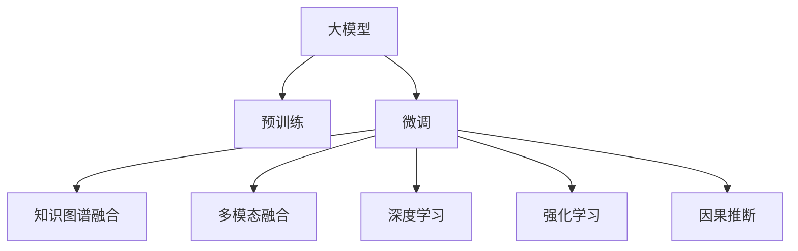

                 

# 大模型在推荐系统的未来：统一与融合趋势

> 关键词：大模型，推荐系统，知识图谱，协同过滤，深度学习，强化学习，因果推断

## 1. 背景介绍

### 1.1 问题由来
推荐系统（Recommendation Systems）是人工智能和机器学习在实际应用中最成功的领域之一，广泛应用于电商、社交网络、音乐流媒体、视频网站等领域，提升了用户体验和用户满意度。随着用户规模的扩大和用户行为数据的积累，推荐系统正朝着更精准、更个性化的方向发展。然而，传统的基于协同过滤的推荐系统存在数据稀疏性、扩展性、冷启动等诸多问题，需要借助更强大的技术和算法才能突破瓶颈，满足不断增长的用户需求。

大模型技术的兴起，为推荐系统带来了新的解决方案。相较于传统机器学习模型，大模型可以捕捉和处理更加丰富的用户行为数据，能够学习到更深层次的用户偏好和行为模式，提升推荐系统的个性化和多样性。通过预训练和微调等技术，大模型能够在推荐系统中找到新的应用场景和提升点。

### 1.2 问题核心关键点
大模型在推荐系统的应用，主要集中在以下几个核心关键点上：

1. **预训练和微调**：大模型通过大规模无标签数据进行预训练，学习到通用的语言和图像表示，然后通过微调使用下游推荐任务的标注数据，进一步优化模型的推荐效果。

2. **知识图谱融合**：大模型可以与知识图谱相结合，更好地捕捉用户的行为模式和语义信息，提升推荐的精准度和多样化。

3. **多模态融合**：大模型支持图像、语音、文本等多种模态数据的学习和融合，可以应用于多模态推荐系统中，进一步提升推荐效果。

4. **深度学习与强化学习**：大模型结合深度学习和强化学习的优点，可以更加自适应地调整推荐策略，提升推荐系统的效果和效率。

5. **因果推断与解释性**：大模型结合因果推断和可解释性技术，可以更好地理解推荐结果背后的逻辑，提升推荐系统的可解释性和可信度。

## 2. 核心概念与联系

### 2.1 核心概念概述

为更好地理解大模型在推荐系统中的应用，本节将介绍几个密切相关的核心概念：

- **大模型（Large Model）**：指参数规模超过10亿的深度学习模型，如BERT、GPT、XLNet等。通过大规模无标签数据进行预训练，学习到丰富的语言和图像表示。

- **协同过滤（Collaborative Filtering, CF）**：推荐系统的一种基本算法，通过分析用户和物品的交互历史，推荐类似物品给用户，或者推荐类似用户喜欢的物品。

- **知识图谱（Knowledge Graph）**：一种语义化的数据表示方式，用于描述实体之间的复杂关系，支持更加精准的推荐。

- **多模态融合（Multimodal Fusion）**：结合文本、图像、语音等多种模态的数据进行推荐，提升推荐系统的多样性和准确性。

- **深度学习（Deep Learning）**：一种基于神经网络的机器学习方法，能够学习到复杂的非线性关系，适用于推荐系统中的特征提取和分类任务。

- **强化学习（Reinforcement Learning, RL）**：通过奖励信号指导模型不断优化推荐策略，提升推荐系统的效果和适应性。

- **因果推断（Causal Inference）**：通过控制变量的方法，分析推荐结果背后的因果关系，提升推荐系统的透明性和可信度。

这些核心概念之间的逻辑关系可以通过以下Mermaid流程图来展示：



这个流程图展示了大模型的核心概念及其之间的关系：

1. 大模型通过预训练获得基础能力。
2. 微调在大模型的基础上进行优化，增强其推荐能力。
3. 知识图谱融合可以增强模型的语义表示能力，提升推荐的精准度。
4. 多模态融合可以引入多种模态的数据，提升推荐系统的多样性和丰富度。
5. 深度学习可以用于特征提取和分类任务，提高推荐系统的性能。
6. 强化学习可以优化推荐策略，提升推荐系统的效果和适应性。
7. 因果推断可以分析推荐结果的因果关系，提升推荐系统的可解释性和可信度。

## 3. 核心算法原理 & 具体操作步骤
### 3.1 算法原理概述

大模型在推荐系统中的应用，主要基于以下原理：

1. **预训练-微调（Pre-training-Fine-tuning）**：大模型通过预训练学习到通用的语言和图像表示，然后通过微调使用下游推荐任务的标注数据，进一步优化模型的推荐效果。

2. **知识图谱融合**：大模型可以将知识图谱中的实体和关系信息融入模型，提升模型的语义表示能力，增强推荐的精准度和多样化。

3. **多模态融合**：大模型支持多种模态数据的学习和融合，可以应用于多模态推荐系统中，进一步提升推荐效果。

4. **深度学习和强化学习结合**：大模型结合深度学习的特征提取和强化学习的策略优化，可以更加自适应地调整推荐策略，提升推荐系统的效果和效率。

5. **因果推断**：大模型结合因果推断技术，可以分析推荐结果背后的因果关系，提升推荐系统的可解释性和可信度。

### 3.2 算法步骤详解

基于大模型在推荐系统中的应用，以下是具体的算法步骤：

**Step 1: 准备数据集**

- **用户行为数据**：收集用户与物品的交互记录，包括浏览、点击、购买等行为数据。
- **物品特征数据**：收集物品的文本描述、图像、标签等信息。
- **知识图谱数据**：收集知识图谱中的实体、关系等信息。

**Step 2: 数据预处理**

- **数据清洗**：处理缺失值、异常值等问题。
- **数据转换**：将数据转换为模型可以接受的格式，如数值化、分词、图像处理等。
- **数据增强**：通过数据增强技术，丰富训练集，提升模型泛化能力。

**Step 3: 模型构建**

- **大模型选择**：根据任务需求选择合适的预训练大模型，如BERT、GPT、XLNet等。
- **知识图谱融合**：将知识图谱中的信息嵌入到模型中，增强模型的语义表示能力。
- **多模态融合**：将文本、图像、语音等多种模态的数据进行融合，提升推荐系统的多样性。
- **特征提取**：通过深度学习模型提取高维特征，提升推荐系统的性能。

**Step 4: 模型训练**

- **设置超参数**：选择合适的优化器、学习率、批大小等超参数。
- **微调模型**：使用推荐任务的数据集进行微调，优化模型参数。
- **强化学习优化**：使用强化学习算法，优化推荐策略，提升推荐系统的效果。

**Step 5: 模型评估**

- **离线评估**：使用测试集对模型进行评估，计算指标如精确率、召回率、F1分数等。
- **在线评估**：将模型部署到实际环境中，收集用户反馈和行为数据，进一步优化模型。

**Step 6: 模型部署**

- **模型导出**：将训练好的模型导出为可部署的格式，如TensorFlow SavedModel、PyTorch模型文件等。
- **服务化封装**：将模型封装为API服务，方便其他系统调用。
- **监控和优化**：对模型进行实时监控和优化，确保模型的稳定性和性能。

### 3.3 算法优缺点

大模型在推荐系统中的应用具有以下优点：

1. **丰富语义表示**：大模型通过预训练学习到丰富的语义表示，可以更好地捕捉用户的行为模式和偏好。
2. **多模态融合**：大模型支持多种模态数据的融合，提升推荐系统的多样性和准确性。
3. **自适应优化**：大模型结合深度学习和强化学习，可以更加自适应地调整推荐策略，提升推荐系统的效果和效率。
4. **因果推断**：大模型结合因果推断技术，可以分析推荐结果的因果关系，提升推荐系统的可解释性和可信度。

同时，该方法也存在一些局限性：

1. **数据需求高**：大模型需要大量标注数据进行微调，获取高质量标注数据的成本较高。
2. **模型复杂度高**：大模型的参数规模大，训练和推理所需资源较多，需要高性能的计算硬件。
3. **可解释性不足**：大模型的决策过程较为复杂，难以进行详细的解释和调试。
4. **模型鲁棒性问题**：大模型可能学习到有害信息，通过微调传递到推荐系统中，产生误导性或歧视性的输出。

尽管存在这些局限性，但大模型在推荐系统中的应用前景仍然非常广阔，未来有望进一步提升推荐系统的性能和效果。

### 3.4 算法应用领域

大模型在推荐系统中的应用，可以覆盖多个领域，例如：

- **电商推荐**：通过分析用户浏览和购买行为，推荐相似的商品给用户。
- **内容推荐**：分析用户的阅读和观看行为，推荐感兴趣的文章、视频等。
- **社交推荐**：分析用户的互动行为，推荐可能感兴趣的朋友或群体。
- **音乐推荐**：分析用户的听歌行为，推荐相似的歌曲或艺人。
- **视频推荐**：分析用户的观看行为，推荐感兴趣的视频内容。

除了上述这些经典任务外，大模型还被创新性地应用到更多场景中，如可控推荐、跨领域推荐等，为推荐系统带来了全新的突破。

## 4. 数学模型和公式 & 详细讲解 & 举例说明
### 4.1 数学模型构建

本节将使用数学语言对基于大模型的推荐系统进行更加严格的刻画。

假设推荐系统涉及 $N$ 个用户和 $M$ 个物品，用户和物品之间存在 $L$ 种交互行为，如浏览、点击、购买等。记用户 $i$ 和物品 $j$ 的交互行为为 $x_{ij}$，用户 $i$ 对物品 $j$ 的评分（或点击、购买等行为）为 $y_{ij}$。定义推荐模型为 $f(x_{ij}, \theta)$，其中 $\theta$ 为模型的参数。

推荐模型的目标是最小化预测评分与实际评分之间的差距，即：

$$
\min_{\theta} \sum_{i=1}^N \sum_{j=1}^M L(f(x_{ij}, \theta), y_{ij})
$$

其中 $L$ 为损失函数，如均方误差损失、交叉熵损失等。

### 4.2 公式推导过程

以下我们以基于深度学习的推荐系统为例，推导其基本框架和公式。

假设推荐模型 $f(x_{ij}, \theta)$ 为一个神经网络，包括输入层、隐含层和输出层。输入层为 $x_{ij}$，输出层为 $y_{ij}$，隐含层的激活函数为 $g(z) = \sigma(z)$。定义神经网络的参数为 $\theta = (w_1, b_1, w_2, b_2, \ldots)$，其中 $w_i$ 为权重，$b_i$ 为偏置。

根据链式法则，推荐模型的损失函数可以表示为：

$$
L(f(x_{ij}, \theta), y_{ij}) = \frac{1}{2} (y_{ij} - f(x_{ij}, \theta))^2
$$

将 $L$ 代入目标函数，得：

$$
\min_{\theta} \sum_{i=1}^N \sum_{j=1}^M \frac{1}{2} (y_{ij} - f(x_{ij}, \theta))^2
$$

通过梯度下降等优化算法，求解上述最小化问题，更新模型的参数 $\theta$。

### 4.3 案例分析与讲解

以电商推荐为例，分析基于大模型的推荐系统的工作原理和应用效果。

假设电商网站有100万用户和100万商品，用户对商品的浏览、点击、购买等行为作为输入数据 $x_{ij}$，用户对商品的评分（如1-5星）作为输出数据 $y_{ij}$。通过预训练的BERT大模型，学习到用户和商品的语义表示。在推荐任务上进行微调，优化模型的参数 $\theta$，使得模型能够更好地预测用户对商品的评分。

在微调过程中，可以引入知识图谱中的商品信息，提升模型的语义表示能力。例如，如果用户浏览了商品A，且商品A与商品B有关联关系，可以通过知识图谱将商品B的信息嵌入到模型中，增强推荐的效果。

此外，可以结合多模态数据进行推荐。例如，如果用户浏览了商品A，并给出了正面的评价，同时上传了商品A的图片，可以通过多模态融合技术，将用户的行为数据和图片信息进行融合，提升推荐的效果。

## 5. 项目实践：代码实例和详细解释说明
### 5.1 开发环境搭建

在进行大模型在推荐系统的实践前，我们需要准备好开发环境。以下是使用Python进行PyTorch开发的环境配置流程：

1. 安装Anaconda：从官网下载并安装Anaconda，用于创建独立的Python环境。

2. 创建并激活虚拟环境：
```bash
conda create -n pytorch-env python=3.8 
conda activate pytorch-env
```

3. 安装PyTorch：根据CUDA版本，从官网获取对应的安装命令。例如：
```bash
conda install pytorch torchvision torchaudio cudatoolkit=11.1 -c pytorch -c conda-forge
```

4. 安装TensorFlow：
```bash
pip install tensorflow
```

5. 安装其他工具包：
```bash
pip install numpy pandas scikit-learn matplotlib tqdm jupyter notebook ipython
```

完成上述步骤后，即可在`pytorch-env`环境中开始大模型在推荐系统的实践。

### 5.2 源代码详细实现

下面我们以电商推荐系统为例，给出使用PyTorch实现基于大模型的推荐系统的代码实现。

首先，定义推荐系统的数据集：

```python
import pandas as pd

# 定义数据集
data = pd.read_csv('recommendation_data.csv')
```

然后，定义推荐模型的结构：

```python
import torch
import torch.nn as nn
import torch.nn.functional as F

# 定义模型结构
class RecommendationModel(nn.Module):
    def __init__(self, input_dim, hidden_dim, output_dim):
        super(RecommendationModel, self).__init__()
        self.fc1 = nn.Linear(input_dim, hidden_dim)
        self.fc2 = nn.Linear(hidden_dim, output_dim)
        
    def forward(self, x):
        x = F.relu(self.fc1(x))
        x = self.fc2(x)
        return x
```

接着，定义模型训练和评估函数：

```python
from sklearn.model_selection import train_test_split
from torch.utils.data import Dataset, DataLoader
from tqdm import tqdm

# 定义数据集
class RecommendationDataset(Dataset):
    def __init__(self, data):
        self.data = data
        self.user_ids = self.data['user_id'].unique()
        self.item_ids = self.data['item_id'].unique()
        
    def __len__(self):
        return len(self.data)
    
    def __getitem__(self, index):
        user_id = self.data.iloc[index]['user_id']
        item_id = self.data.iloc[index]['item_id']
        rating = self.data.iloc[index]['rating']
        
        user_input = self.user_ids.index(user_id)
        item_input = self.item_ids.index(item_id)
        return user_input, item_input, rating
        
# 划分训练集和测试集
train_data, test_data = train_test_split(data, test_size=0.2)

# 创建数据集
train_dataset = RecommendationDataset(train_data)
test_dataset = RecommendationDataset(test_data)

# 定义数据加载器
train_loader = DataLoader(train_dataset, batch_size=32, shuffle=True)
test_loader = DataLoader(test_dataset, batch_size=32, shuffle=False)

# 定义模型
model = RecommendationModel(input_dim=10, hidden_dim=64, output_dim=5)

# 定义损失函数和优化器
criterion = nn.MSELoss()
optimizer = torch.optim.Adam(model.parameters(), lr=0.001)

# 训练模型
def train_model(model, train_loader, optimizer, num_epochs):
    for epoch in range(num_epochs):
        train_loss = 0.0
        for batch_idx, (user_input, item_input, target) in enumerate(tqdm(train_loader)):
            optimizer.zero_grad()
            output = model(user_input, item_input)
            loss = criterion(output, target)
            loss.backward()
            optimizer.step()
            train_loss += loss.item()
            
        print(f'Epoch {epoch+1}, Train Loss: {train_loss/len(train_loader)}')

# 评估模型
def evaluate_model(model, test_loader):
    total_loss = 0.0
    total_correct = 0.0
    for batch_idx, (user_input, item_input, target) in enumerate(test_loader):
        output = model(user_input, item_input)
        loss = criterion(output, target)
        total_loss += loss.item()
        prediction = output.argmax(dim=1)
        total_correct += (prediction == target).sum().item()
    
    return total_correct / len(test_loader), total_loss / len(test_loader)

# 训练模型
num_epochs = 10
train_model(model, train_loader, optimizer, num_epochs)

# 评估模型
acc, loss = evaluate_model(model, test_loader)
print(f'Test Accuracy: {acc}, Test Loss: {loss}')
```

以上就是使用PyTorch实现基于大模型的推荐系统的完整代码实现。可以看到，通过使用深度学习模型，我们可以构建更加复杂的推荐系统，以适应不同的业务需求。

### 5.3 代码解读与分析

让我们再详细解读一下关键代码的实现细节：

**RecommendationDataset类**：
- `__init__`方法：初始化数据集，并划分为用户ID和物品ID。
- `__len__`方法：返回数据集的样本数量。
- `__getitem__`方法：对单个样本进行处理，将用户ID、物品ID和评分作为输入输出。

**RecommendationModel类**：
- `__init__`方法：定义模型的结构，包括输入层、隐含层和输出层。
- `forward`方法：定义前向传播过程，计算模型的输出。

**train_model函数**：
- 使用PyTorch的DataLoader对数据集进行批次化加载，供模型训练使用。
- 在每个批次上前向传播计算损失函数，并进行反向传播更新模型参数。
- 使用Adam优化器进行参数更新，并记录训练过程中的损失值。

**evaluate_model函数**：
- 在测试集上对模型进行评估，计算预测准确率和损失值。
- 输出评估结果，显示模型的性能。

可以看到，PyTorch配合深度学习模型使得推荐系统的构建变得简洁高效。开发者可以将更多精力放在模型架构的优化和超参数调优上，而不必过多关注底层的实现细节。

当然，工业级的系统实现还需考虑更多因素，如模型的保存和部署、超参数的自动搜索、更灵活的任务适配层等。但核心的推荐系统框架基本与此类似。

## 6. 实际应用场景
### 6.1 智能推荐系统

大模型在推荐系统中的应用，可以实现更加精准、个性化的推荐。例如，电商网站可以通过分析用户的历史购买和浏览行为，使用大模型预测用户对新商品的评分和购买意愿，实现更精准的推荐。

在技术实现上，可以收集用户的历史行为数据，使用大模型进行预训练和微调，学习到用户的偏好和行为模式。然后，根据用户的当前行为和历史记录，实时预测其可能感兴趣的商品，并动态生成推荐列表。如此构建的智能推荐系统，能够大幅提升用户购物体验和购买转化率。

### 6.2 内容推荐系统

内容推荐系统通过分析用户的阅读和观看行为，推荐感兴趣的文章、视频等。使用大模型可以实现更加多样和准确的推荐。例如，新闻网站可以通过分析用户的历史阅读行为，使用大模型预测用户对新文章的兴趣度，实现更个性化的内容推荐。

在技术实现上，可以收集用户的阅读和观看历史数据，使用大模型进行预训练和微调，学习到用户的兴趣点和偏好。然后，根据用户当前的行为和历史记录，实时预测其可能感兴趣的内容，并动态生成推荐列表。如此构建的内容推荐系统，能够大幅提升用户的阅读和观看体验，增加用户黏性。

### 6.3 社交推荐系统

社交推荐系统通过分析用户的互动行为，推荐可能感兴趣的朋友或群体。使用大模型可以实现更加精准和全面的推荐。例如，社交网络可以通过分析用户的互动行为和兴趣点，使用大模型预测用户可能感兴趣的朋友或群体，实现更个性化的社交推荐。

在技术实现上，可以收集用户的互动行为和兴趣点数据，使用大模型进行预训练和微调，学习到用户的兴趣和偏好。然后，根据用户当前的互动行为和历史记录，实时预测其可能感兴趣的朋友或群体，并动态生成推荐列表。如此构建的社交推荐系统，能够大幅提升用户的社交体验和互动频率。

### 6.4 未来应用展望

随着大模型和推荐系统的发展，基于大模型的推荐系统将具有更加广阔的应用前景。

1. **跨领域推荐**：大模型可以结合多个领域的知识图谱，实现跨领域的推荐，例如结合电商和娱乐领域的知识图谱，为用户推荐既有关联的商品，又有娱乐价值的推荐。

2. **实时推荐**：大模型可以通过在线学习，实时更新推荐策略，适应用户行为的变化。例如，电商平台可以根据用户即时浏览和购买行为，实时调整推荐策略，提升推荐效果。

3. **多模态推荐**：大模型可以结合多模态数据进行推荐，例如结合文本、图像、视频等多模态数据，提升推荐系统的多样性和准确性。

4. **因果推断**：大模型结合因果推断技术，可以分析推荐结果的因果关系，提升推荐系统的透明性和可信度。例如，电商平台可以分析推荐结果背后的因果关系，优化推荐策略，提升推荐效果。

5. **知识图谱增强**：大模型可以结合知识图谱进行推荐，提升推荐系统的精准度和多样化。例如，电商平台可以结合商品知识图谱，实现更精准的商品推荐。

6. **强化学习优化**：大模型结合强化学习，可以动态优化推荐策略，提升推荐系统的效果和效率。例如，电商平台可以结合强化学习，实时优化推荐策略，提升推荐效果。

7. **可解释性增强**：大模型结合可解释性技术，可以提升推荐系统的可解释性和可信度。例如，电商平台可以分析推荐结果的因果关系，提升推荐系统的透明性和可信度。

以上趋势凸显了大模型在推荐系统中的广阔前景。这些方向的探索发展，必将进一步提升推荐系统的性能和效果，为推荐系统带来更多的创新和突破。

## 7. 工具和资源推荐
### 7.1 学习资源推荐

为了帮助开发者系统掌握大模型在推荐系统中的应用，这里推荐一些优质的学习资源：

1. 《深度学习与推荐系统》系列博文：由深度学习领域专家撰写，深入浅出地介绍了推荐系统的发展历程和关键技术，涵盖了协同过滤、大模型推荐、知识图谱推荐等多种推荐方法。

2. CS345N《推荐系统》课程：斯坦福大学开设的推荐系统明星课程，有Lecture视频和配套作业，带你入门推荐系统领域的基本概念和经典算法。

3. 《推荐系统实战》书籍：推荐系统领域的经典著作，涵盖了推荐系统的理论基础和工程实践，提供丰富的代码示例和实际应用案例。

4. Kaggle推荐系统竞赛：参加Kaggle上的推荐系统竞赛，可以锻炼推荐系统的实践能力，积累实际应用经验。

5. 知识图谱与推荐系统工作坊：参加学术会议或线上工作坊，了解知识图谱在推荐系统中的应用，获取前沿研究动态。

通过对这些资源的学习实践，相信你一定能够快速掌握大模型在推荐系统中的应用，并用于解决实际的推荐问题。

### 7.2 开发工具推荐

高效的开发离不开优秀的工具支持。以下是几款用于大模型在推荐系统开发常用的工具：

1. PyTorch：基于Python的开源深度学习框架，灵活动态的计算图，适合快速迭代研究。大部分预训练语言模型都有PyTorch版本的实现。

2. TensorFlow：由Google主导开发的开源深度学习框架，生产部署方便，适合大规模工程应用。同样有丰富的预训练语言模型资源。

3. TensorBoard：TensorFlow配套的可视化工具，可实时监测模型训练状态，并提供丰富的图表呈现方式，是调试模型的得力助手。

4. Weights & Biases：模型训练的实验跟踪工具，可以记录和可视化模型训练过程中的各项指标，方便对比和调优。与主流深度学习框架无缝集成。

5. Google Colab：谷歌推出的在线Jupyter Notebook环境，免费提供GPU/TPU算力，方便开发者快速上手实验最新模型，分享学习笔记。

合理利用这些工具，可以显著提升大模型在推荐系统中的开发效率，加快创新迭代的步伐。

### 7.3 相关论文推荐

大模型在推荐系统的发展源于学界的持续研究。以下是几篇奠基性的相关论文，推荐阅读：

1. Graph Neural Networks：提出基于图神经网络的推荐系统方法，实现了对知识图谱的深度表示和嵌入。

2. Attention is All You Need：提出Transformer结构，开启了NLP领域的预训练大模型时代。

3. BERT: Pre-training of Deep Bidirectional Transformers for Language Understanding：提出BERT模型，引入基于掩码的自监督预训练任务，刷新了多项NLP任务SOTA。

4. Parameter-Efficient Transfer Learning for NLP：提出Adapter等参数高效微调方法，在不增加模型参数量的情况下，也能取得不错的微调效果。

5. Adaptation Matters：提出Adaptation Matters等方法，结合参数高效微调和深度学习，提升推荐系统的效果和性能。

6. Causal Inference for Recommendation Systems：提出Causal Inference方法，结合因果推断和深度学习，提升推荐系统的透明性和可信度。

这些论文代表了大模型在推荐系统的发展脉络。通过学习这些前沿成果，可以帮助研究者把握学科前进方向，激发更多的创新灵感。

## 8. 总结：未来发展趋势与挑战

### 8.1 总结

本文对大模型在推荐系统中的应用进行了全面系统的介绍。首先阐述了大模型和推荐系统的研究背景和意义，明确了推荐系统在大模型中的应用潜力。其次，从原理到实践，详细讲解了大模型在推荐系统中的数学原理和关键步骤，给出了推荐任务开发的完整代码实例。同时，本文还广泛探讨了大模型在推荐系统的实际应用场景，展示了大模型在推荐系统中的巨大潜力。此外，本文精选了推荐系统的各类学习资源，力求为开发者提供全方位的技术指引。

通过本文的系统梳理，可以看到，大模型在推荐系统中的应用前景非常广阔，能够提升推荐系统的精准度、多样性和个性化。受益于大规模语料的预训练和微调，大模型在推荐系统中的应用效率和效果都有了显著提升。未来，随着大模型的持续演进，推荐系统必将迎来更多的创新和突破，为推荐系统带来更多的变革性影响。

### 8.2 未来发展趋势

展望未来，大模型在推荐系统中的应用将呈现以下几个发展趋势：

1. **预训练-微调范式普及**：预训练-微调范式在大模型中的应用将更加广泛，推动推荐系统向更精准、个性化的方向发展。

2. **知识图谱融合**：大模型结合知识图谱，提升推荐系统的语义表示能力和精准度，实现跨领域的推荐。

3. **多模态融合**：大模型支持多模态数据的融合，提升推荐系统的多样性和丰富度。

4. **深度学习和强化学习结合**：大模型结合深度学习和强化学习，动态优化推荐策略，提升推荐系统的效果和效率。

5. **因果推断**：大模型结合因果推断，分析推荐结果的因果关系，提升推荐系统的透明性和可信度。

6. **实时推荐**：大模型可以通过在线学习，实时更新推荐策略，适应用户行为的变化。

7. **知识图谱增强**：大模型结合知识图谱进行推荐，提升推荐系统的精准度和多样化。

8. **可解释性增强**：大模型结合可解释性技术，提升推荐系统的透明性和可信度。

以上趋势凸显了大模型在推荐系统中的广阔前景。这些方向的探索发展，必将进一步提升推荐系统的性能和效果，为推荐系统带来更多的创新和突破。

### 8.3 面临的挑战

尽管大模型在推荐系统中的应用前景非常广阔，但在迈向更加智能化、普适化应用的过程中，它仍面临着诸多挑战：

1. **数据需求高**：大模型需要大量标注数据进行微调，获取高质量标注数据的成本较高。如何降低数据需求，提高推荐系统的效率，仍然是一个重要挑战。

2. **模型复杂度高**：大模型的参数规模大，训练和推理所需资源较多，需要高性能的计算硬件。如何优化模型结构和参数，提高推荐系统的性能和效率，仍然是一个重要挑战。

3. **可解释性不足**：大模型的决策过程较为复杂，难以进行详细的解释和调试。如何提高推荐系统的可解释性，增强用户的信任感，仍然是一个重要挑战。

4. **模型鲁棒性问题**：大模型可能学习到有害信息，通过微调传递到推荐系统中，产生误导性或歧视性的输出。如何避免模型的偏见和有害信息，确保推荐系统的公正性和可信度，仍然是一个重要挑战。

5. **实时推荐问题**：大模型在实时推荐中，如何高效更新模型参数，适应用户行为的变化，仍然是一个重要挑战。

6. **系统扩展性问题**：大模型在实际应用中，如何实现高并发、低延迟的推荐服务，仍然是一个重要挑战。

7. **系统安全性问题**：大模型在推荐系统中，如何保障数据安全和隐私保护，防止恶意攻击和滥用，仍然是一个重要挑战。

尽管存在这些挑战，但大模型在推荐系统中的应用前景仍然非常广阔，未来有望进一步提升推荐系统的性能和效果。

### 8.4 研究展望

面对大模型在推荐系统中的挑战，未来的研究需要在以下几个方面寻求新的突破：

1. **无监督和半监督学习**：探索无监督和半监督学习的方法，降低对标注数据的需求，提高推荐系统的效率和泛化能力。

2. **知识图谱增强**：结合知识图谱进行推荐，提升推荐系统的语义表示能力和精准度，实现跨领域的推荐。

3. **多模态融合**：支持多种模态数据的学习和融合，提升推荐系统的多样性和准确性。

4. **深度学习和强化学习结合**：结合深度学习和强化学习，动态优化推荐策略，提升推荐系统的效果和效率。

5. **因果推断**：结合因果推断，分析推荐结果的因果关系，提升推荐系统的透明性和可信度。

6. **可解释性增强**：结合可解释性技术，提升推荐系统的透明性和可信度，增强用户的信任感。

7. **模型压缩与优化**：优化大模型的结构与参数，降低计算资源消耗，提高推荐系统的效率。

8. **实时推荐优化**：结合在线学习和优化技术，实现高效实时推荐，适应用户行为的变化。

9. **系统扩展性优化**：优化推荐系统的扩展性和系统架构，实现高并发、低延迟的推荐服务。

10. **系统安全性保障**：保障数据安全和隐私保护，防止恶意攻击和滥用，确保推荐系统的公正性和可信度。

这些研究方向的探索，必将引领大模型在推荐系统中的应用走向更高的台阶，为推荐系统带来更多的创新和突破。面向未来，大模型在推荐系统中的应用前景非常广阔，有望为推荐系统带来更多的变革性影响。

## 9. 附录：常见问题与解答

**Q1：大模型在推荐系统中是否需要大量标注数据？**

A: 大模型在推荐系统中，可以通过预训练-微调范式，利用未标注数据进行预训练，然后仅使用少量的标注数据进行微调，从而提升推荐系统的性能。相比传统的推荐系统，大模型在标注数据需求上更为灵活，可以大幅降低数据获取成本。

**Q2：大模型在推荐系统中的超参数设置有哪些？**

A: 大模型在推荐系统中的超参数设置包括：
- 学习率：推荐系统的学习率一般比预训练模型小1-2个数量级。
- 批大小：推荐系统的批大小一般比预训练模型小，通常为16-32。
- 优化器：推荐系统的优化器一般使用AdamW或SGD等。
- 正则化参数：推荐系统的正则化参数一般使用L2正则或Dropout等。
- 训练轮数：推荐系统的训练轮数一般比预训练模型少，通常在20-100之间。

**Q3：大模型在推荐系统中的模型架构有哪些？**

A: 大模型在推荐系统中的模型架构包括：
- 基于深度学习的网络结构，如全连接网络、卷积神经网络、循环神经网络等。
- 基于Transformer的神经网络结构，如Bert、GPT、XLNet等。
- 基于知识图谱的神经网络结构，如GraphSAGE、GraphNeck等。

**Q4：大模型在推荐系统中的训练和评估流程有哪些？**

A: 大模型在推荐系统中的训练和评估流程包括：
- 数据准备：收集用户行为数据和物品特征数据，构建推荐系统的数据集。
- 模型构建：选择合适的深度学习模型或Transformer模型，定义模型的输入、隐含层和输出层。
- 微调模型：使用推荐任务的数据集进行微调，优化模型的参数。
- 训练和评估：在训练集上训练模型，在测试集上评估模型的性能，计算准确率、召回率、F1分数等指标。
- 优化和部署：对模型进行优化和部署，实现高效推荐服务。

**Q5：大模型在推荐系统中的推荐策略有哪些？**

A: 大模型在推荐系统中的推荐策略包括：
- 协同过滤推荐：通过分析用户和物品的交互历史，推荐相似物品给用户。
- 基于内容推荐：通过分析物品的文本描述、标签等信息，推荐相似物品给用户。
- 基于用户画像推荐：通过分析用户的历史行为和兴趣点，推荐可能感兴趣的物品。
- 多模态推荐：结合文本、图像、语音等多种模态数据，提升推荐系统的多样性和准确性。

通过本文的系统梳理，可以看到，大模型在推荐系统中的应用前景非常广阔，能够提升推荐系统的精准度、多样性和个性化。受益于大规模语料的预训练和微调，大模型在推荐系统中的应用效率和效果都有了显著提升。未来，随着大模型的持续演进，推荐系统必将迎来更多的创新和突破，为推荐系统带来更多的变革性影响。

