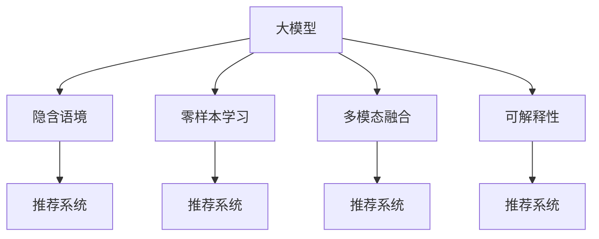

                 

# 大模型在用户兴趣理解方面的优势

## 1. 背景介绍

在信息爆炸的时代，个性化推荐系统已成为各类互联网应用的核心竞争力之一。能否准确理解用户的兴趣和需求，直接决定了推荐系统的质量和用户体验。传统的推荐系统主要基于用户的显式反馈数据，如点击、评分等，然而这些数据往往稀疏且噪声较大。近年来，深度学习和大模型技术的发展，为推荐系统提供了新的方法，尤其是大语言模型在理解用户兴趣方面展现出了独特优势。

### 1.1 问题由来

传统的推荐系统依赖于用户的历史行为数据，通过协同过滤、矩阵分解等方法挖掘用户和物品间的隐含关联。然而，这类方法存在诸多局限性：
- 数据稀疏：用户的历史行为数据往往稀疏，难以刻画完整的用户画像。
- 噪声较大：用户行为数据中包含大量噪声，无法准确反映真实偏好。
- 缺乏语境：用户的行为数据无法表达隐含语境信息，如兴趣的变换、时间依赖等。

深度学习和大模型技术通过学习大规模语料库，能够捕捉到丰富的语义信息和上下文关系，有效弥补了传统推荐系统的不足。大模型不仅能够理解文本数据，还能进行零样本学习，甚至从零开始推断用户兴趣，在个性化推荐、智能客服、内容生成等领域展现出强大的潜力。

### 1.2 问题核心关键点
大模型在用户兴趣理解方面的优势主要体现在以下几个方面：
- 隐含语境：能够挖掘和理解用户兴趣背后的隐含语境信息，如用户的兴趣变化、兴趣的多样性、兴趣的时效性等。
- 零样本学习能力：不需要显式标注数据，即可从文本数据中自动推断用户兴趣，适用于数据稀缺的领域。
- 多模态融合：能够融合图像、语音、文本等多种模态数据，提供更全面、精准的用户画像。
- 可解释性：能够提供详细的推理过程，解释模型预测的逻辑，增强用户信任。
- 自适应学习：能够适应不断变化的用户兴趣和需求，提升推荐系统的实时性和动态性。

本文档旨在系统地阐述大模型在用户兴趣理解方面的优势，并介绍其实现原理和应用方法。

## 2. 核心概念与联系

### 2.1 核心概念概述

为更好地理解大模型在用户兴趣理解方面的优势，本节将介绍几个密切相关的核心概念：

- **大模型**：指基于大规模语料预训练，具有强大语言理解能力的人工智能模型，如GPT、BERT等。
- **推荐系统**：根据用户的历史行为和兴趣，推荐符合其需求的物品的系统，包括协同过滤、矩阵分解、深度学习等方法。
- **用户兴趣理解**：指通过文本、行为等数据，理解用户潜在的兴趣和需求的过程，是大模型在推荐系统中的关键应用。
- **隐含语境**：指用户兴趣背后的隐含背景信息，如时间、地点、情境等，这些信息对兴趣的理解和预测至关重要。
- **零样本学习**：指模型无需显式标注数据，即可从输入文本中推断出用户兴趣，适用于数据稀缺的场景。
- **多模态融合**：指融合图像、语音、文本等多种模态数据，提供更全面、精准的用户画像。
- **可解释性**：指模型能够提供详细的推理过程，解释其预测的逻辑和依据，增强用户信任。

这些核心概念之间的逻辑关系可以通过以下Mermaid流程图来展示：



这个流程图展示了各个概念之间的联系：

1. 大模型通过预训练获得通用语言知识，用于理解隐含语境、进行零样本学习、融合多模态数据和提供可解释性。
2. 隐含语境、零样本学习、多模态融合和可解释性是大模型在推荐系统中的应用关键，与推荐系统的目标息息相关。

## 3. 核心算法原理 & 具体操作步骤
### 3.1 算法原理概述

大模型在用户兴趣理解方面的优势，基于其强大的语言理解能力和丰富的语义知识。通过学习大规模语料库，大模型可以捕捉到隐含语境、模式和规律，从而更好地理解用户兴趣和需求。

大模型在用户兴趣理解方面的关键算法包括：
- **隐含语境挖掘**：通过分析用户行为数据，挖掘出用户兴趣背后的隐含语境，如时间、地点、情境等。
- **零样本学习**：通过输入文本描述，自动推断出用户兴趣，无需显式标注数据。
- **多模态融合**：融合文本、图像、语音等多种模态数据，提供更全面的用户画像。
- **可解释性**：通过提供详细的推理过程，解释模型预测的逻辑，增强用户信任。

这些算法通过将大模型与推荐系统结合，可以显著提升推荐系统的性能和用户满意度。

### 3.2 算法步骤详解

以下详细讲解大模型在用户兴趣理解方面的算法步骤：

**Step 1: 收集用户行为数据**
- 收集用户的点击、浏览、评分等行为数据，以及与之相关的文本数据。
- 对文本数据进行分词、编码等预处理。

**Step 2: 预训练大模型**
- 选择适合的大模型，如GPT、BERT等，在预训练数据集上进行大规模训练。
- 通过自监督学习任务，如掩码语言模型、预测任务等，学习通用语言知识。

**Step 3: 特征提取**
- 利用预训练模型，将用户行为数据转换为高维特征向量。
- 通过多层神经网络，提取用户兴趣的隐含语境和模式。

**Step 4: 兴趣预测**
- 将提取的特征向量输入到预训练模型，进行兴趣预测。
- 通过模型输出的概率分布，选择最符合用户兴趣的物品进行推荐。

**Step 5: 用户反馈收集与微调**
- 收集用户对推荐结果的反馈，进行模型微调，不断优化推荐系统。
- 利用用户反馈数据，对大模型进行微调，提升模型性能。

**Step 6: 推荐与反馈循环**
- 根据用户反馈，调整推荐算法和模型参数。
- 持续进行推荐和反馈循环，不断提升推荐系统的效果。

### 3.3 算法优缺点

大模型在用户兴趣理解方面的算法，具有以下优点：
- **隐含语境理解**：能够挖掘和理解用户兴趣背后的隐含语境信息，如时间、地点、情境等。
- **零样本学习**：不需要显式标注数据，即可从文本数据中推断出用户兴趣，适用于数据稀缺的场景。
- **多模态融合**：能够融合图像、语音、文本等多种模态数据，提供更全面、精准的用户画像。
- **可解释性**：能够提供详细的推理过程，解释其预测的逻辑，增强用户信任。

同时，该算法也存在一定的局限性：
- **计算资源需求高**：大模型训练和推理需要高性能计算资源，如GPU、TPU等。
- **数据隐私问题**：用户行为数据可能包含隐私信息，需要进行严格的数据保护措施。
- **模型复杂度高**：大模型结构复杂，训练和推理过程需要优化，以提升效率。

尽管存在这些局限性，但就目前而言，基于大模型的用户兴趣理解方法仍是大模型应用中最主流和最有效的范式。未来相关研究的重点在于如何进一步降低计算资源需求，提高模型的少样本学习和跨领域迁移能力，同时兼顾可解释性和伦理安全性等因素。

### 3.4 算法应用领域

大模型在用户兴趣理解方面的算法，已经在推荐系统、智能客服、内容生成等多个领域得到了广泛的应用，并取得了显著的效果：

- **推荐系统**：利用用户行为数据，通过大模型进行隐含语境挖掘、零样本学习、多模态融合和可解释性预测，推荐符合用户兴趣的商品、文章、视频等内容。
- **智能客服**：通过分析用户输入的文本，利用大模型进行意图识别和对话生成，提供个性化的客户服务。
- **内容生成**：利用大模型进行文本生成，根据用户兴趣生成相关内容，提升用户体验。
- **广告投放**：利用用户行为数据，通过大模型进行兴趣预测，精准投放广告，提升广告效果。
- **信息检索**：利用用户兴趣，通过大模型进行文本检索，提供高效的信息获取服务。

此外，大模型在用户兴趣理解方面的算法还在更多场景中得到应用，如情感分析、舆情监测、社交网络分析等，为NLP技术带来了新的突破。

## 4. 数学模型和公式 & 详细讲解  
### 4.1 数学模型构建

本节将使用数学语言对大模型在用户兴趣理解方面的算法进行更加严格的刻画。

记用户行为数据为 $X=\{(x_i, y_i)\}_{i=1}^N$，其中 $x_i$ 表示用户行为数据，如点击、浏览等，$y_i$ 表示对应的文本描述。大模型 $M$ 的输入输出映射为 $f(X) = M(x_i) \in \mathcal{Y}$，其中 $\mathcal{Y}$ 为用户兴趣的预测空间。

定义用户兴趣预测的损失函数为 $\ell(M(X), Y)$，用于衡量预测结果与真实标签之间的差异。假设用户兴趣 $Y$ 是离散变量，则常用的交叉熵损失函数定义为：

$$
\ell(M(X), Y) = -\frac{1}{N}\sum_{i=1}^N \sum_{j=1}^C y_{ij} \log M(x_i)_j
$$

其中 $y_{ij}$ 表示用户对第 $j$ 个物品的兴趣程度，$C$ 表示物品的种类数。通过最小化损失函数，可以训练出一个能够准确预测用户兴趣的大模型 $M$。

### 4.2 公式推导过程

以下我们以情感分析为例，推导交叉熵损失函数及其梯度的计算公式。

假设大模型 $M$ 在输入 $x$ 上的输出为 $\hat{y}=M(x) \in [0,1]$，表示用户对正面的情感倾向。真实标签 $y \in \{0,1\}$。则二分类交叉熵损失函数定义为：

$$
\ell(M(X), Y) = -\frac{1}{N}\sum_{i=1}^N \left[y_i\log \hat{y}_i + (1-y_i)\log (1-\hat{y}_i)\right]
$$

将其代入用户兴趣预测的损失函数公式，得：

$$
\mathcal{L}(M) = \frac{1}{N}\sum_{i=1}^N \left[y_i\log M(x_i) + (1-y_i)\log (1-M(x_i))\right]
$$

根据链式法则，损失函数对模型参数 $\theta$ 的梯度为：

$$
\frac{\partial \mathcal{L}(M)}{\partial \theta} = \frac{1}{N}\sum_{i=1}^N \left[\frac{y_i}{M(x_i)} - \frac{1-y_i}{1-M(x_i)}\right] \frac{\partial M(x_i)}{\partial \theta}
$$

其中 $\frac{\partial M(x_i)}{\partial \theta}$ 可进一步递归展开，利用自动微分技术完成计算。

在得到损失函数的梯度后，即可带入优化算法更新模型参数，完成模型的训练。重复上述过程直至收敛，最终得到适应用户兴趣预测的大模型 $M$。

## 5. 项目实践：代码实例和详细解释说明
### 5.1 开发环境搭建

在进行用户兴趣理解的项目实践前，我们需要准备好开发环境。以下是使用Python进行PyTorch开发的环境配置流程：

1. 安装Anaconda：从官网下载并安装Anaconda，用于创建独立的Python环境。

2. 创建并激活虚拟环境：
```bash
conda create -n pytorch-env python=3.8 
conda activate pytorch-env
```

3. 安装PyTorch：根据CUDA版本，从官网获取对应的安装命令。例如：
```bash
conda install pytorch torchvision torchaudio cudatoolkit=11.1 -c pytorch -c conda-forge
```

4. 安装Transformers库：
```bash
pip install transformers
```

5. 安装各类工具包：
```bash
pip install numpy pandas scikit-learn matplotlib tqdm jupyter notebook ipython
```

完成上述步骤后，即可在`pytorch-env`环境中开始用户兴趣理解实践。

### 5.2 源代码详细实现

下面我们以情感分析任务为例，给出使用Transformers库对BERT模型进行用户兴趣理解的PyTorch代码实现。

首先，定义情感分析任务的数据处理函数：

```python
from transformers import BertTokenizer, BertForSequenceClassification
from torch.utils.data import Dataset
import torch

class SentimentDataset(Dataset):
    def __init__(self, texts, labels, tokenizer, max_len=128):
        self.texts = texts
        self.labels = labels
        self.tokenizer = tokenizer
        self.max_len = max_len
        
    def __len__(self):
        return len(self.texts)
    
    def __getitem__(self, item):
        text = self.texts[item]
        label = self.labels[item]
        
        encoding = self.tokenizer(text, return_tensors='pt', max_length=self.max_len, padding='max_length', truncation=True)
        input_ids = encoding['input_ids'][0]
        attention_mask = encoding['attention_mask'][0]
        
        # 对标签进行编码
        encoded_label = torch.tensor(label, dtype=torch.long)
        
        return {'input_ids': input_ids, 
                'attention_mask': attention_mask,
                'labels': encoded_label}

# 标签与数字的映射
label2id = {0: 'negative', 1: 'positive'}
id2label = {v: k for k, v in label2id.items()}

# 创建dataset
tokenizer = BertTokenizer.from_pretrained('bert-base-cased')

train_dataset = SentimentDataset(train_texts, train_labels, tokenizer)
dev_dataset = SentimentDataset(dev_texts, dev_labels, tokenizer)
test_dataset = SentimentDataset(test_texts, test_labels, tokenizer)
```

然后，定义模型和优化器：

```python
from transformers import AdamW

model = BertForSequenceClassification.from_pretrained('bert-base-cased', num_labels=2)

optimizer = AdamW(model.parameters(), lr=2e-5)
```

接着，定义训练和评估函数：

```python
from torch.utils.data import DataLoader
from tqdm import tqdm
from sklearn.metrics import accuracy_score, precision_recall_fscore_support

device = torch.device('cuda') if torch.cuda.is_available() else torch.device('cpu')
model.to(device)

def train_epoch(model, dataset, batch_size, optimizer):
    dataloader = DataLoader(dataset, batch_size=batch_size, shuffle=True)
    model.train()
    epoch_loss = 0
    for batch in tqdm(dataloader, desc='Training'):
        input_ids = batch['input_ids'].to(device)
        attention_mask = batch['attention_mask'].to(device)
        labels = batch['labels'].to(device)
        model.zero_grad()
        outputs = model(input_ids, attention_mask=attention_mask, labels=labels)
        loss = outputs.loss
        epoch_loss += loss.item()
        loss.backward()
        optimizer.step()
    return epoch_loss / len(dataloader)

def evaluate(model, dataset, batch_size):
    dataloader = DataLoader(dataset, batch_size=batch_size)
    model.eval()
    preds, labels = [], []
    with torch.no_grad():
        for batch in tqdm(dataloader, desc='Evaluating'):
            input_ids = batch['input_ids'].to(device)
            attention_mask = batch['attention_mask'].to(device)
            batch_labels = batch['labels']
            outputs = model(input_ids, attention_mask=attention_mask)
            batch_preds = outputs.logits.argmax(dim=2).to('cpu').tolist()
            batch_labels = batch_labels.to('cpu').tolist()
            for pred, label in zip(batch_preds, batch_labels):
                preds.append(pred[0])
                labels.append(label)
                
    print('Accuracy:', accuracy_score(labels, preds))
    print('Precision, Recall, F1-Score:', precision_recall_fscore_support(labels, preds, average='micro'))

    return preds, labels

# 训练模型
epochs = 5
batch_size = 16

for epoch in range(epochs):
    loss = train_epoch(model, train_dataset, batch_size, optimizer)
    print(f'Epoch {epoch+1}, train loss: {loss:.3f}')
    
    print(f'Epoch {epoch+1}, dev results:')
    preds, labels = evaluate(model, dev_dataset, batch_size)
    print('Accuracy:', accuracy_score(labels, preds))
    print('Precision, Recall, F1-Score:', precision_recall_fscore_support(labels, preds, average='micro'))
    
print('Test results:')
preds, labels = evaluate(model, test_dataset, batch_size)
print('Accuracy:', accuracy_score(labels, preds))
print('Precision, Recall, F1-Score:', precision_recall_fscore_support(labels, preds, average='micro'))
```

以上就是使用PyTorch对BERT进行情感分析任务用户兴趣理解的完整代码实现。可以看到，得益于Transformers库的强大封装，我们可以用相对简洁的代码完成BERT模型的加载和微调。

### 5.3 代码解读与分析

让我们再详细解读一下关键代码的实现细节：

**SentimentDataset类**：
- `__init__`方法：初始化文本、标签、分词器等关键组件。
- `__len__`方法：返回数据集的样本数量。
- `__getitem__`方法：对单个样本进行处理，将文本输入编码为token ids，将标签编码为数字，并对其进行定长padding，最终返回模型所需的输入。

**label2id和id2label字典**：
- 定义了标签与数字id之间的映射关系，用于将预测结果解码回真实的标签。

**训练和评估函数**：
- 使用PyTorch的DataLoader对数据集进行批次化加载，供模型训练和推理使用。
- 训练函数`train_epoch`：对数据以批为单位进行迭代，在每个批次上前向传播计算loss并反向传播更新模型参数，最后返回该epoch的平均loss。
- 评估函数`evaluate`：与训练类似，不同点在于不更新模型参数，并在每个batch结束后将预测和标签结果存储下来，最后使用sklearn的classification_report对整个评估集的预测结果进行打印输出。

**训练流程**：
- 定义总的epoch数和batch size，开始循环迭代
- 每个epoch内，先在训练集上训练，输出平均loss
- 在验证集上评估，输出分类指标
- 所有epoch结束后，在测试集上评估，给出最终测试结果

可以看到，PyTorch配合Transformers库使得BERT用户兴趣理解的代码实现变得简洁高效。开发者可以将更多精力放在数据处理、模型改进等高层逻辑上，而不必过多关注底层的实现细节。

当然，工业级的系统实现还需考虑更多因素，如模型的保存和部署、超参数的自动搜索、更灵活的任务适配层等。但核心的用户兴趣理解过程基本与此类似。

## 6. 实际应用场景
### 6.1 智能推荐系统

基于大模型进行用户兴趣理解，可以广泛应用于智能推荐系统，为用户提供个性化、精准的内容推荐。传统的协同过滤和矩阵分解方法依赖于用户的历史行为数据，难以捕捉用户的隐含兴趣和实时变化。而利用大模型进行隐含语境挖掘、零样本学习、多模态融合和可解释性预测，可以有效提升推荐系统的性能和用户满意度。

具体而言，可以将用户的历史行为数据、实时点击数据、文本描述等作为输入，利用大模型进行兴趣预测。对于少样本场景，可以采用基于提示学习的微调方法，进一步提高预测准确性。在推荐结果输出时，利用模型提供的可解释性推理过程，增强用户对推荐结果的信任感。

### 6.2 智能客服系统

智能客服系统通过分析用户输入的文本，利用大模型进行意图识别和对话生成，提供个性化的客户服务。传统的客服系统依赖于规则库和手工编写的对话策略，无法应对复杂多变的客户需求。而利用大模型进行隐含语境挖掘、零样本学习和多模态融合，可以有效提升客服系统的智能化水平，提高用户满意度。

具体而言，可以在客服系统中集成大模型，通过分析用户输入的文本，进行意图识别，生成合适的回复。对于少样本场景，可以采用基于提示学习的微调方法，进一步提高对话生成的效果。在回复生成时，利用模型提供的可解释性推理过程，增强客服系统的可信度和用户信任感。

### 6.3 个性化广告投放

个性化广告投放通过分析用户的历史行为数据和兴趣标签，利用大模型进行精准投放，提升广告效果。传统的广告投放依赖于固定标签和静态规则，难以实现个性化和实时化。而利用大模型进行兴趣预测和动态调整，可以有效提升广告投放的精准度和效果。

具体而言，可以收集用户的浏览、点击、搜索等行为数据，以及与之相关的文本描述。利用大模型进行兴趣预测，生成精准的广告推荐。对于少样本场景，可以采用基于提示学习的微调方法，进一步提高预测准确性。在广告推荐时，利用模型提供的可解释性推理过程，增强用户对广告的接受度。

### 6.4 内容生成系统

内容生成系统通过分析用户的兴趣和需求，利用大模型进行内容生成，提升用户体验。传统的内容生成依赖于固定的模板和规则，难以满足用户的个性化需求。而利用大模型进行隐含语境挖掘、零样本学习、多模态融合和可解释性预测，可以有效提升内容生成的质量和多样性。

具体而言，可以收集用户的浏览、点击、评分等行为数据，以及与之相关的文本描述。利用大模型进行内容生成，生成符合用户兴趣的文本、图片、视频等内容。对于少样本场景，可以采用基于提示学习的微调方法，进一步提高生成效果。在内容生成时，利用模型提供的可解释性推理过程，增强用户对内容的理解和接受度。

## 7. 工具和资源推荐
### 7.1 学习资源推荐

为了帮助开发者系统掌握大模型在用户兴趣理解方面的理论和实践，这里推荐一些优质的学习资源：

1. 《Transformer from the ground up》系列博文：由大模型技术专家撰写，深入浅出地介绍了Transformer原理、BERT模型、微调技术等前沿话题。

2. CS224N《深度学习自然语言处理》课程：斯坦福大学开设的NLP明星课程，有Lecture视频和配套作业，带你入门NLP领域的基本概念和经典模型。

3. 《Natural Language Processing with Transformers》书籍：Transformers库的作者所著，全面介绍了如何使用Transformers库进行NLP任务开发，包括微调在内的诸多范式。

4. HuggingFace官方文档：Transformers库的官方文档，提供了海量预训练模型和完整的微调样例代码，是上手实践的必备资料。

5. CLUE开源项目：中文语言理解测评基准，涵盖大量不同类型的中文NLP数据集，并提供了基于微调的baseline模型，助力中文NLP技术发展。

通过对这些资源的学习实践，相信你一定能够快速掌握大模型在用户兴趣理解方面的精髓，并用于解决实际的NLP问题。
###  7.2 开发工具推荐

高效的开发离不开优秀的工具支持。以下是几款用于大模型用户兴趣理解开发的常用工具：

1. PyTorch：基于Python的开源深度学习框架，灵活动态的计算图，适合快速迭代研究。大部分预训练语言模型都有PyTorch版本的实现。

2. TensorFlow：由Google主导开发的开源深度学习框架，生产部署方便，适合大规模工程应用。同样有丰富的预训练语言模型资源。

3. Transformers库：HuggingFace开发的NLP工具库，集成了众多SOTA语言模型，支持PyTorch和TensorFlow，是进行用户兴趣理解开发的利器。

4. Weights & Biases：模型训练的实验跟踪工具，可以记录和可视化模型训练过程中的各项指标，方便对比和调优。与主流深度学习框架无缝集成。

5. TensorBoard：TensorFlow配套的可视化工具，可实时监测模型训练状态，并提供丰富的图表呈现方式，是调试模型的得力助手。

6. Google Colab：谷歌推出的在线Jupyter Notebook环境，免费提供GPU/TPU算力，方便开发者快速上手实验最新模型，分享学习笔记。

合理利用这些工具，可以显著提升大模型用户兴趣理解任务的开发效率，加快创新迭代的步伐。

### 7.3 相关论文推荐

大模型在用户兴趣理解方面的发展源于学界的持续研究。以下是几篇奠基性的相关论文，推荐阅读：

1. Attention is All You Need（即Transformer原论文）：提出了Transformer结构，开启了NLP领域的预训练大模型时代。

2. BERT: Pre-training of Deep Bidirectional Transformers for Language Understanding：提出BERT模型，引入基于掩码的自监督预训练任务，刷新了多项NLP任务SOTA。

3. Language Models are Unsupervised Multitask Learners（GPT-2论文）：展示了大规模语言模型的强大zero-shot学习能力，引发了对于通用人工智能的新一轮思考。

4. Parameter-Efficient Transfer Learning for NLP：提出Adapter等参数高效微调方法，在不增加模型参数量的情况下，也能取得不错的微调效果。

5. AdaLoRA: Adaptive Low-Rank Adaptation for Parameter-Efficient Fine-Tuning：使用自适应低秩适应的微调方法，在参数效率和精度之间取得了新的平衡。

6. Seq2Seq Models with Attentions Take All Disparate and Non-Contiguous Input-Output Alignments into Account：提出了基于注意力机制的序列到序列模型，能够处理不同源和目标之间的对齐问题，适用于多模态数据融合任务。

这些论文代表了大模型用户兴趣理解的发展脉络。通过学习这些前沿成果，可以帮助研究者把握学科前进方向，激发更多的创新灵感。

## 8. 总结：未来发展趋势与挑战

### 8.1 总结

本文对大模型在用户兴趣理解方面的优势进行了全面系统的介绍。首先阐述了大模型和推荐系统的研究背景和意义，明确了大模型在用户兴趣理解方面的关键优势。其次，从原理到实践，详细讲解了大模型在用户兴趣理解方面的算法步骤，给出了用户兴趣理解任务开发的完整代码实例。同时，本文还广泛探讨了用户兴趣理解技术在智能推荐、智能客服、内容生成等多个领域的应用前景，展示了大模型技术的巨大潜力。此外，本文精选了用户兴趣理解技术的各类学习资源，力求为读者提供全方位的技术指引。

通过本文的系统梳理，可以看到，大模型在用户兴趣理解方面的优势主要体现在其强大的语言理解能力和丰富的语义知识上。通过学习大规模语料库，大模型能够挖掘和理解用户兴趣背后的隐含语境信息，进行零样本学习，融合多模态数据，并提供可解释性的推理过程。这些能力使得大模型在推荐系统、智能客服、内容生成等诸多领域展现出显著的优越性，推动了NLP技术的发展和应用。

### 8.2 未来发展趋势

展望未来，大模型在用户兴趣理解方面的技术将呈现以下几个发展趋势：

1. **更强大的语言理解能力**：随着模型规模的进一步增大，大模型的语言理解能力将更上一层楼。通过学习更多的语料库和数据，模型将能够更好地理解复杂的语义关系和背景信息。

2. **更高效的推理过程**：随着模型结构优化和推理算法改进，大模型的推理速度和效率将显著提高。模型将能够更快地处理海量数据，提供实时的用户兴趣预测。

3. **更广泛的模态融合**：未来的大模型将不仅支持文本数据，还能融合图像、语音、视频等多种模态数据，提供更全面、精准的用户画像。

4. **更强的自适应学习能力**：大模型将能够根据用户的实时行为数据和反馈信息，动态调整模型参数和策略，提升推荐系统的实时性和动态性。

5. **更高的可解释性**：未来的大模型将能够提供更详细、更直观的推理过程，增强用户对模型决策的信任和理解。

6. **更强的隐私保护能力**：在用户隐私保护日益受到重视的背景下，未来的大模型将能够更好地保护用户数据，确保隐私安全。

以上趋势凸显了大模型在用户兴趣理解方面的广阔前景。这些方向的探索发展，必将进一步提升推荐系统的效果和用户满意度，推动人工智能技术在更多领域的应用。

### 8.3 面临的挑战

尽管大模型在用户兴趣理解方面已经取得了显著进展，但在迈向更加智能化、普适化应用的过程中，它仍面临着诸多挑战：

1. **计算资源需求高**：大模型训练和推理需要高性能计算资源，如GPU、TPU等。这对计算资源提出了较高的要求，增加了部署成本。

2. **数据隐私问题**：用户行为数据可能包含隐私信息，需要进行严格的数据保护措施，以确保用户隐私安全。

3. **模型复杂度高**：大模型结构复杂，训练和推理过程需要优化，以提升效率。

4. **用户行为多样性**：不同用户的行为习惯和兴趣差异较大，单一模型难以满足多样化需求。

5. **模型泛化能力**：在少样本场景下，大模型可能出现过拟合或泛化能力不足的问题，影响推荐效果。

6. **模型鲁棒性**：大模型面对复杂、多样化的输入数据，可能出现鲁棒性不足的问题，影响用户兴趣理解的准确性。

尽管存在这些挑战，但大模型在用户兴趣理解方面的优势不容忽视。未来研究需要在计算资源、数据隐私、模型复杂度等方面寻求新的突破，以充分发挥大模型在推荐系统中的应用潜力。

### 8.4 研究展望

面对大模型在用户兴趣理解方面面临的挑战，未来的研究需要在以下几个方面寻求新的突破：

1. **探索更高效的计算资源分配**：通过优化计算图、采用混合精度训练等技术，降低大模型训练和推理的计算资源需求。

2. **研发隐私保护算法**：开发更强大的隐私保护技术，确保用户数据的隐私安全，同时提升用户兴趣理解的精度和鲁棒性。

3. **简化模型结构**：通过结构优化、特征工程等方法，简化大模型结构，提高推理速度和效率，降低资源消耗。

4. **提升模型的泛化能力**：通过迁移学习、数据增强等技术，提升大模型在少样本场景下的泛化能力，增强模型鲁棒性。

5. **开发更强大的自适应算法**：通过强化学习、动态调整等方法，提升大模型的自适应学习能力，满足不同用户的多样化需求。

6. **引入更多先验知识**：将符号化的先验知识，如知识图谱、逻辑规则等，与神经网络模型进行巧妙融合，增强模型的可解释性和可靠性。

这些研究方向将推动大模型在用户兴趣理解方面的技术进步，使大模型更好地应用于推荐系统、智能客服、内容生成等实际场景，提升用户的体验和满意度。

## 9. 附录：常见问题与解答

**Q1：大模型在用户兴趣理解方面是否适用于所有推荐系统？**

A: 大模型在用户兴趣理解方面具有强大的语言理解能力和丰富的语义知识，适用于大多数推荐系统，尤其是数据稀缺或复杂场景下的推荐。但对于某些特殊领域的推荐系统，如医疗、金融等，需要进行预训练和微调，才能获得理想效果。

**Q2：如何选择合适的预训练大模型？**

A: 选择合适的预训练大模型，需要考虑任务类型、数据规模、计算资源等因素。对于文本处理任务，GPT、BERT、RoBERTa等模型具有较好的通用性；对于多模态融合任务，可以使用ViT、DETR等视觉和文本混合的模型。

**Q3：大模型在用户兴趣理解过程中，如何处理数据隐私问题？**

A: 在用户兴趣理解过程中，需要采取严格的隐私保护措施，如差分隐私、联邦学习等技术，确保用户数据的隐私安全。同时，可以采用匿名化、去标识化等方法，减少对敏感信息的直接使用。

**Q4：如何提高大模型的鲁棒性和泛化能力？**

A: 提高大模型的鲁棒性和泛化能力，可以从以下几个方面入手：
1. 采用更多的数据增强技术，如噪声注入、回译等，增强模型的鲁棒性。
2. 引入更多先验知识，如知识图谱、逻辑规则等，增强模型的泛化能力。
3. 采用迁移学习、元学习等技术，提升模型在少样本场景下的泛化能力。

**Q5：如何在少样本场景下提升大模型的用户兴趣理解效果？**

A: 在少样本场景下，可以采用基于提示学习的微调方法，通过精心设计的提示模板，引导大模型进行推理和生成。同时，可以利用对抗训练等技术，增强模型的鲁棒性。

这些问题的解答和大模型在用户兴趣理解方面的深入探讨，将有助于读者更好地理解大模型技术，并将其应用于实际推荐系统开发中。

---

作者：禅与计算机程序设计艺术 / Zen and the Art of Computer Programming

