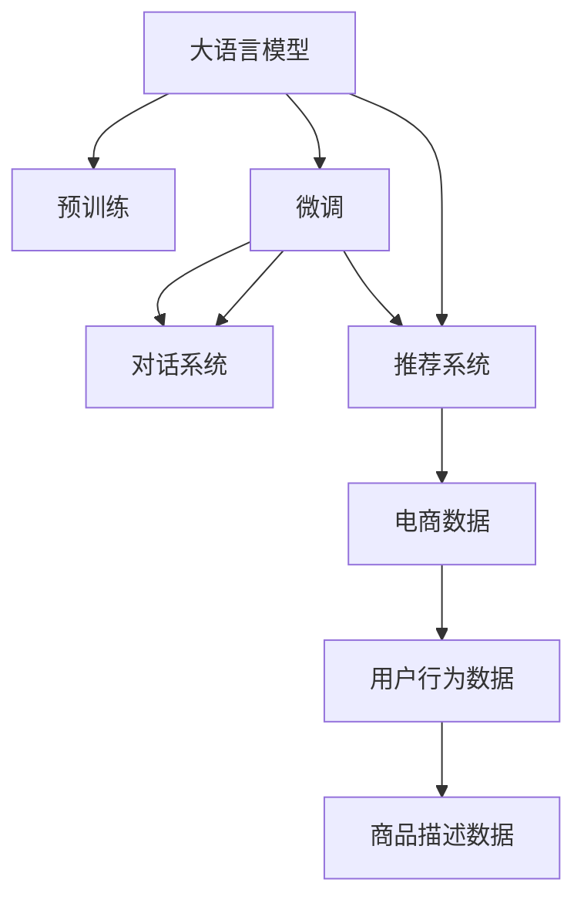

                 

# 大模型在电商平台客户服务中的应用

## 1. 背景介绍

### 1.1 问题由来
随着电子商务的迅猛发展，电商平台上的客户服务需求日益增加，这对客户服务系统提出了更高的要求。传统的客户服务通常依赖人工客服，需要大量的客服人员，成本高且效率低。而随着人工智能技术的兴起，基于大模型的自动化客服系统，成为了电商平台提高客户满意度和运营效率的重要手段。

### 1.2 问题核心关键点
基于大模型的自动化客服系统，通过在电商平台上集成大语言模型，能够实现客户提问的自动响应，提升客户服务的效率和质量。这种系统不仅能24小时不间断地提供服务，还能通过持续的微调和更新，不断提升服务水平，甚至在某些场景下可以超越人工客服。

## 2. 核心概念与联系

### 2.1 核心概念概述

为了更好地理解大模型在电商平台客户服务中的应用，本节将介绍几个密切相关的核心概念：

- **大语言模型(Large Language Model, LLM)**：通过在大规模无标签文本数据上进行预训练，学习丰富的语言知识和常识。能够理解并生成自然语言，广泛应用于NLP领域。

- **预训练(Pre-training)**：指在大规模无标签文本数据上，通过自监督学习任务训练大语言模型的过程。预训练模型具有较强的泛化能力，能够在多种下游任务上取得良好表现。

- **微调(Fine-tuning)**：指在预训练模型的基础上，使用下游任务的少量标注数据，通过有监督学习优化模型在该任务上的性能。在电商平台客户服务中，微调可以用来提升模型的对话生成能力。

- **对话系统(D对话系统)**：基于大模型的自动化客服系统，通过对话生成技术，实现与用户的自然交互，提供即时的客户服务。

- **推荐系统(Recommendation System)**：通过分析用户行为数据，为用户推荐相关商品或服务。与客户服务系统协同工作，提升用户体验。

- **电商数据(E-commerce Data)**：电商平台上的各种数据，包括用户行为数据、商品描述数据等。是构建大模型客户服务系统的重要基础。

这些核心概念之间的逻辑关系可以通过以下Mermaid流程图来展示：



这个流程图展示了大模型在电商平台客户服务系统中的应用：

1. 大模型通过预训练获得语言理解能力。
2. 微调模型针对电商平台的特定任务进行优化，提升对话生成能力。
3. 对话系统利用微调后的模型，实现与用户的自然交互。
4. 推荐系统结合对话数据，为用户推荐相关商品或服务。
5. 电商数据是构建系统的基础，包括用户行为数据和商品描述数据。

这些概念共同构成了电商平台客户服务系统的大模型架构，使其能够在实际应用中发挥强大的语言理解和生成能力。

## 3. 核心算法原理 & 具体操作步骤
### 3.1 算法原理概述

大模型在电商平台客户服务中的应用，基于微调方法，将预训练的语言模型应用于对话生成任务。其核心思想是：将预训练的大语言模型视作一个强大的"特征提取器"，通过在电商平台的标注对话数据上进行有监督的微调，使得模型输出能够匹配任务标签，从而获得针对特定任务优化的模型。

形式化地，假设预训练模型为 $M_{\theta}$，其中 $\theta$ 为预训练得到的模型参数。给定电商平台上的对话数据集 $D=\{(x_i, y_i)\}_{i=1}^N$，微调的目标是找到新的模型参数 $\hat{\theta}$，使得：

$$
\hat{\theta}=\mathop{\arg\min}_{\theta} \mathcal{L}(M_{\theta},D)
$$

其中 $\mathcal{L}$ 为针对对话生成任务的损失函数，用于衡量模型预测输出与真实标签之间的差异。常见的损失函数包括交叉熵损失、均方误差损失等。

通过梯度下降等优化算法，微调过程不断更新模型参数 $\theta$，最小化损失函数 $\mathcal{L}$，使得模型输出逼近真实标签。由于 $\theta$ 已经通过预训练获得了较好的初始化，因此即便在电商平台上只有少量标注对话数据，也能较快收敛到理想的模型参数 $\hat{\theta}$。

### 3.2 算法步骤详解

大模型在电商平台客户服务中的应用，通常包括以下几个关键步骤：

**Step 1: 准备预训练模型和数据集**
- 选择合适的预训练语言模型 $M_{\theta}$ 作为初始化参数，如 GPT、BERT 等。
- 准备电商平台上的对话数据集 $D$，划分为训练集、验证集和测试集。对话数据集包括用户提出的问题和系统生成的回答。

**Step 2: 添加任务适配层**
- 根据电商平台上的对话任务类型，在预训练模型顶层设计合适的输出层和损失函数。
- 对于对话生成任务，通常在顶层添加解码器，输出概率分布，并以负对数似然为损失函数。

**Step 3: 设置微调超参数**
- 选择合适的优化算法及其参数，如 AdamW、SGD 等，设置学习率、批大小、迭代轮数等。
- 设置正则化技术及强度，包括权重衰减、Dropout、Early Stopping 等。
- 确定冻结预训练参数的策略，如仅微调顶层，或全部参数都参与微调。

**Step 4: 执行梯度训练**
- 将训练集数据分批次输入模型，前向传播计算损失函数。
- 反向传播计算参数梯度，根据设定的优化算法和学习率更新模型参数。
- 周期性在验证集上评估模型性能，根据性能指标决定是否触发 Early Stopping。
- 重复上述步骤直到满足预设的迭代轮数或 Early Stopping 条件。

**Step 5: 测试和部署**
- 在测试集上评估微调后模型 $M_{\hat{\theta}}$ 的性能，对比微调前后的效果提升。
- 使用微调后的模型对电商平台的客户提问进行回答，集成到实际的客户服务系统中。
- 持续收集新的对话数据，定期重新微调模型，以适应数据分布的变化。

以上是使用预训练大模型在电商平台客户服务中进行微调的一般流程。在实际应用中，还需要针对具体平台和任务的特点，对微调过程的各个环节进行优化设计，如改进训练目标函数，引入更多的正则化技术，搜索最优的超参数组合等，以进一步提升模型性能。

### 3.3 算法优缺点

基于预训练大模型的微调方法，在电商平台客户服务中具有以下优点：

1. **简单高效**：只需准备少量标注对话数据，即可对预训练模型进行快速适配，获得较大的性能提升。
2. **通用适用**：适用于各种电商平台的客户对话场景，设计简单的任务适配层即可实现微调。
3. **参数高效**：利用参数高效微调技术，在固定大部分预训练参数的情况下，仍可取得不错的提升。
4. **效果显著**：在学术界和工业界的诸多客户对话任务上，基于微调的方法已经刷新了最先进的性能指标。

同时，该方法也存在一定的局限性：

1. **依赖标注数据**：微调的效果很大程度上取决于标注数据的质量和数量，获取高质量标注数据的成本较高。
2. **迁移能力有限**：当电商平台的对话数据与预训练数据的分布差异较大时，微调的性能提升有限。
3. **可解释性不足**：微调模型的决策过程通常缺乏可解释性，难以对其推理逻辑进行分析和调试。

尽管存在这些局限性，但就目前而言，基于预训练大模型的微调方法仍是在电商平台客户服务中的主流范式。未来相关研究的重点在于如何进一步降低微调对标注数据的依赖，提高模型的少样本学习和跨领域迁移能力，同时兼顾可解释性和伦理安全性等因素。

### 3.4 算法应用领域

基于大模型的微调方法，在电商平台客户服务中已经得到了广泛的应用，覆盖了几乎所有常见对话场景，例如：

- **常见问题查询**：如商品信息查询、退换货指南等。通过微调模型学习常见问题和答案的映射关系。
- **订单跟踪**：客户查询订单状态，系统自动生成相关回答。微调模型学习订单处理流程和常见问题。
- **售后服务**：客户反馈产品质量问题，系统提供解决方案或联系方式。微调模型学习问题类型和处理策略。
- **推荐系统集成**：结合对话数据和推荐系统，为满足客户需求的对话生成推荐结果。
- **智能客服自动响应**：客户提出复杂问题，系统通过多轮对话引导用户逐步提供信息，生成最终答案。

除了上述这些经典场景外，大模型微调技术还创新性地应用于更多场景中，如可控文本生成、客服情绪识别、知识库整合等，为电商平台客户服务带来了全新的突破。随着预训练模型和微调方法的不断进步，相信电商平台客户服务系统将在更多应用场景中大放异彩。

## 4. 数学模型和公式 & 详细讲解  
### 4.1 数学模型构建

本节将使用数学语言对基于预训练大模型的客户服务微调过程进行更加严格的刻画。

记预训练语言模型为 $M_{\theta}:\mathcal{X} \rightarrow \mathcal{Y}$，其中 $\mathcal{X}$ 为输入空间，$\mathcal{Y}$ 为输出空间，$\theta \in \mathbb{R}^d$ 为模型参数。假设电商平台上的对话数据集为 $D=\{(x_i,y_i)\}_{i=1}^N$，其中 $x_i$ 为对话输入，$y_i$ 为对话回答。

定义模型 $M_{\theta}$ 在对话数据 $(x,y)$ 上的损失函数为 $\ell(M_{\theta}(x),y)$，则在对话数据集 $D$ 上的经验风险为：

$$
\mathcal{L}(\theta) = \frac{1}{N} \sum_{i=1}^N \ell(M_{\theta}(x_i),y_i)
$$

微调的优化目标是最小化经验风险，即找到最优参数：

$$
\theta^* = \mathop{\arg\min}_{\theta} \mathcal{L}(\theta)
$$

在实践中，我们通常使用基于梯度的优化算法（如SGD、Adam等）来近似求解上述最优化问题。设 $\eta$ 为学习率，$\lambda$ 为正则化系数，则参数的更新公式为：

$$
\theta \leftarrow \theta - \eta \nabla_{\theta}\mathcal{L}(\theta) - \eta\lambda\theta
$$

其中 $\nabla_{\theta}\mathcal{L}(\theta)$ 为损失函数对参数 $\theta$ 的梯度，可通过反向传播算法高效计算。

### 4.2 公式推导过程

以下我们以对话生成任务为例，推导交叉熵损失函数及其梯度的计算公式。

假设模型 $M_{\theta}$ 在输入 $x$ 上的输出为 $\hat{y}=M_{\theta}(x) \in [0,1]$，表示样本属于正类的概率。真实标签 $y \in \{0,1\}$。则二分类交叉熵损失函数定义为：

$$
\ell(M_{\theta}(x),y) = -[y\log \hat{y} + (1-y)\log (1-\hat{y})]
$$

将其代入经验风险公式，得：

$$
\mathcal{L}(\theta) = -\frac{1}{N}\sum_{i=1}^N [y_i\log M_{\theta}(x_i)+(1-y_i)\log(1-M_{\theta}(x_i))]
$$

根据链式法则，损失函数对参数 $\theta_k$ 的梯度为：

$$
\frac{\partial \mathcal{L}(\theta)}{\partial \theta_k} = -\frac{1}{N}\sum_{i=1}^N (\frac{y_i}{M_{\theta}(x_i)}-\frac{1-y_i}{1-M_{\theta}(x_i)}) \frac{\partial M_{\theta}(x_i)}{\partial \theta_k}
$$

其中 $\frac{\partial M_{\theta}(x_i)}{\partial \theta_k}$ 可进一步递归展开，利用自动微分技术完成计算。

在得到损失函数的梯度后，即可带入参数更新公式，完成模型的迭代优化。重复上述过程直至收敛，最终得到适应电商平台客户服务的微调模型。

## 5. 项目实践：代码实例和详细解释说明
### 5.1 开发环境搭建

在进行微调实践前，我们需要准备好开发环境。以下是使用Python进行PyTorch开发的环境配置流程：

1. 安装Anaconda：从官网下载并安装Anaconda，用于创建独立的Python环境。

2. 创建并激活虚拟环境：
```bash
conda create -n pytorch-env python=3.8 
conda activate pytorch-env
```

3. 安装PyTorch：根据CUDA版本，从官网获取对应的安装命令。例如：
```bash
conda install pytorch torchvision torchaudio cudatoolkit=11.1 -c pytorch -c conda-forge
```

4. 安装Transformers库：
```bash
pip install transformers
```

5. 安装各类工具包：
```bash
pip install numpy pandas scikit-learn matplotlib tqdm jupyter notebook ipython
```

完成上述步骤后，即可在`pytorch-env`环境中开始微调实践。

### 5.2 源代码详细实现

下面我们以电商平台上的客户服务对话任务为例，给出使用Transformers库对BERT模型进行微调的PyTorch代码实现。

首先，定义对话数据集和标签处理函数：

```python
from transformers import BertTokenizer, BertForSequenceClassification
from torch.utils.data import Dataset, DataLoader
import torch

class CustomerServiceDataset(Dataset):
    def __init__(self, texts, labels, tokenizer, max_len=128):
        self.texts = texts
        self.labels = labels
        self.tokenizer = tokenizer
        self.max_len = max_len
        
    def __len__(self):
        return len(self.texts)
    
    def __getitem__(self, item):
        text = self.texts[item]
        label = self.labels[item]
        
        encoding = self.tokenizer(text, return_tensors='pt', max_length=self.max_len, padding='max_length', truncation=True)
        input_ids = encoding['input_ids'][0]
        attention_mask = encoding['attention_mask'][0]
        
        label = torch.tensor([label], dtype=torch.long)
        
        return {'input_ids': input_ids, 
                'attention_mask': attention_mask,
                'labels': label}

# 标签与id的映射
label2id = {'查询商品信息': 0, '订单状态查询': 1, '售后服务反馈': 2, '退货退款流程': 3, '推荐系统': 4}
id2label = {v: k for k, v in label2id.items()}

# 创建dataset
tokenizer = BertTokenizer.from_pretrained('bert-base-cased')

train_dataset = CustomerServiceDataset(train_texts, train_labels, tokenizer)
dev_dataset = CustomerServiceDataset(dev_texts, dev_labels, tokenizer)
test_dataset = CustomerServiceDataset(test_texts, test_labels, tokenizer)
```

然后，定义模型和优化器：

```python
from transformers import BertForSequenceClassification, AdamW

model = BertForSequenceClassification.from_pretrained('bert-base-cased', num_labels=len(label2id))

optimizer = AdamW(model.parameters(), lr=2e-5)
```

接着，定义训练和评估函数：

```python
from tqdm import tqdm
from sklearn.metrics import accuracy_score, precision_score, recall_score, f1_score

device = torch.device('cuda') if torch.cuda.is_available() else torch.device('cpu')
model.to(device)

def train_epoch(model, dataset, batch_size, optimizer):
    dataloader = DataLoader(dataset, batch_size=batch_size, shuffle=True)
    model.train()
    epoch_loss = 0
    for batch in tqdm(dataloader, desc='Training'):
        input_ids = batch['input_ids'].to(device)
        attention_mask = batch['attention_mask'].to(device)
        labels = batch['labels'].to(device)
        model.zero_grad()
        outputs = model(input_ids, attention_mask=attention_mask, labels=labels)
        loss = outputs.loss
        epoch_loss += loss.item()
        loss.backward()
        optimizer.step()
    return epoch_loss / len(dataloader)

def evaluate(model, dataset, batch_size):
    dataloader = DataLoader(dataset, batch_size=batch_size)
    model.eval()
    preds, labels = [], []
    with torch.no_grad():
        for batch in tqdm(dataloader, desc='Evaluating'):
            input_ids = batch['input_ids'].to(device)
            attention_mask = batch['attention_mask'].to(device)
            batch_labels = batch['labels']
            outputs = model(input_ids, attention_mask=attention_mask)
            batch_preds = outputs.logits.argmax(dim=2).to('cpu').tolist()
            batch_labels = batch_labels.to('cpu').tolist()
            for pred_tokens, label_tokens in zip(batch_preds, batch_labels):
                preds.append(pred_tokens[:len(label_tokens)])
                labels.append(label_tokens)
                
    print('Accuracy: {:.2f}%'.format(accuracy_score(labels, preds)))
    print('Precision: {:.2f}%'.format(precision_score(labels, preds, average='macro')))
    print('Recall: {:.2f}%'.format(recall_score(labels, preds, average='macro')))
    print('F1-score: {:.2f}%'.format(f1_score(labels, preds, average='macro')))
```

最后，启动训练流程并在测试集上评估：

```python
epochs = 5
batch_size = 16

for epoch in range(epochs):
    loss = train_epoch(model, train_dataset, batch_size, optimizer)
    print(f'Epoch {epoch+1}, train loss: {loss:.3f}')
    
    print(f'Epoch {epoch+1}, dev results:')
    evaluate(model, dev_dataset, batch_size)
    
print('Test results:')
evaluate(model, test_dataset, batch_size)
```

以上就是使用PyTorch对BERT进行电商平台客户服务对话任务微调的完整代码实现。可以看到，得益于Transformers库的强大封装，我们可以用相对简洁的代码完成BERT模型的加载和微调。

### 5.3 代码解读与分析

让我们再详细解读一下关键代码的实现细节：

**CustomerServiceDataset类**：
- `__init__`方法：初始化文本、标签、分词器等关键组件。
- `__len__`方法：返回数据集的样本数量。
- `__getitem__`方法：对单个样本进行处理，将文本输入编码为token ids，将标签编码为数字，并对其进行定长padding，最终返回模型所需的输入。

**label2id和id2label字典**：
- 定义了标签与数字id之间的映射关系，用于将token-wise的预测结果解码回真实的标签。

**训练和评估函数**：
- 使用PyTorch的DataLoader对数据集进行批次化加载，供模型训练和推理使用。
- 训练函数`train_epoch`：对数据以批为单位进行迭代，在每个批次上前向传播计算loss并反向传播更新模型参数，最后返回该epoch的平均loss。
- 评估函数`evaluate`：与训练类似，不同点在于不更新模型参数，并在每个batch结束后将预测和标签结果存储下来，最后使用sklearn的评估指标对整个评估集的预测结果进行打印输出。

**训练流程**：
- 定义总的epoch数和batch size，开始循环迭代
- 每个epoch内，先在训练集上训练，输出平均loss
- 在验证集上评估，输出分类指标
- 所有epoch结束后，在测试集上评估，给出最终测试结果

可以看到，PyTorch配合Transformers库使得BERT微调的代码实现变得简洁高效。开发者可以将更多精力放在数据处理、模型改进等高层逻辑上，而不必过多关注底层的实现细节。

当然，工业级的系统实现还需考虑更多因素，如模型的保存和部署、超参数的自动搜索、更灵活的任务适配层等。但核心的微调范式基本与此类似。

## 6. 实际应用场景
### 6.1 智能客服系统

基于大模型的自动化客服系统，在电商平台客户服务中得到了广泛应用。通过微调BERT等大语言模型，能够实现24小时不间断的客户服务，快速响应客户咨询，并提供更个性化、更精准的解决方案。

在技术实现上，可以收集电商平台上的历史客户对话记录，将问题和最佳答复构建成监督数据，在此基础上对BERT模型进行微调。微调后的模型能够自动理解用户意图，匹配最合适的回答模板进行回复。对于客户提出的新问题，还可以接入检索系统实时搜索相关内容，动态组织生成回答。如此构建的智能客服系统，能大幅提升客户咨询体验和问题解决效率。

### 6.2 订单跟踪系统

电商平台上的客户通常需要查询订单状态，了解货物运输情况。通过微调BERT模型，系统可以自动生成与订单状态相关的回答，如订单处理进度、物流信息等。这不仅能减轻客服人员的负担，还能提升客户满意度。

具体实现上，可以将订单状态作为标签，客户提问作为输入，在对话数据集上进行微调。微调后的模型能够在客户提问时，自动分析订单状态并生成回答。通过多轮对话引导客户逐步提供订单信息，模型可以更准确地理解订单详情，提供详细、有用的回答。

### 6.3 个性化推荐系统

传统的推荐系统往往只依赖用户的历史行为数据进行物品推荐，无法深入理解用户的真实兴趣偏好。通过微调BERT模型，可以结合客户服务对话数据，构建更全面、更准确的推荐系统。

具体而言，可以收集客户在对话中提及的商品、品牌等信息，将其作为标签，客户提问作为输入，在对话数据集上进行微调。微调后的模型能够从对话数据中学习用户的兴趣点，结合推荐系统算法，生成个性化推荐结果。与传统的推荐系统相比，这种方式不仅能提升推荐效果，还能增强系统的交互性和用户体验。

### 6.4 未来应用展望

随着大模型和微调方法的不断发展，基于预训练大模型的客户服务系统将在更多领域得到应用，为电商平台的客户服务带来变革性影响。

在智慧物流领域，基于大模型的客户服务系统可以提升物流服务的智能化水平，实时提供订单跟踪、物流信息等服务，帮助客户掌握货物状态。

在智能营销领域，通过分析客户对话数据，可以更好地理解客户需求和偏好，提升营销策略的精准度，实现更有效的客户转化。

在智慧社区领域，基于大模型的客户服务系统可以提升社区服务的自动化水平，自动回答社区居民的咨询，提高社区管理效率。

此外，在金融、教育、旅游等众多领域，基于大模型的客户服务系统也将不断涌现，为各行各业带来智能化、自动化的客户服务体验。相信随着技术的日益成熟，预训练大模型微调技术将成为电商平台客户服务的重要范式，推动人工智能技术在各行各业的应用和发展。

## 7. 工具和资源推荐
### 7.1 学习资源推荐

为了帮助开发者系统掌握大模型在电商平台客户服务中的应用，这里推荐一些优质的学习资源：

1. 《Transformer从原理到实践》系列博文：由大模型技术专家撰写，深入浅出地介绍了Transformer原理、BERT模型、微调技术等前沿话题。

2. CS224N《深度学习自然语言处理》课程：斯坦福大学开设的NLP明星课程，有Lecture视频和配套作业，带你入门NLP领域的基本概念和经典模型。

3. 《Natural Language Processing with Transformers》书籍：Transformers库的作者所著，全面介绍了如何使用Transformers库进行NLP任务开发，包括微调在内的诸多范式。

4. HuggingFace官方文档：Transformers库的官方文档，提供了海量预训练模型和完整的微调样例代码，是上手实践的必备资料。

5. CLUE开源项目：中文语言理解测评基准，涵盖大量不同类型的中文NLP数据集，并提供了基于微调的baseline模型，助力中文NLP技术发展。

通过对这些资源的学习实践，相信你一定能够快速掌握预训练大模型微调技术在电商平台客户服务中的应用，并用于解决实际的客户服务问题。
### 7.2 开发工具推荐

高效的开发离不开优秀的工具支持。以下是几款用于大模型微调开发的常用工具：

1. PyTorch：基于Python的开源深度学习框架，灵活动态的计算图，适合快速迭代研究。大部分预训练语言模型都有PyTorch版本的实现。

2. TensorFlow：由Google主导开发的开源深度学习框架，生产部署方便，适合大规模工程应用。同样有丰富的预训练语言模型资源。

3. Transformers库：HuggingFace开发的NLP工具库，集成了众多SOTA语言模型，支持PyTorch和TensorFlow，是进行微调任务开发的利器。

4. Weights & Biases：模型训练的实验跟踪工具，可以记录和可视化模型训练过程中的各项指标，方便对比和调优。与主流深度学习框架无缝集成。

5. TensorBoard：TensorFlow配套的可视化工具，可实时监测模型训练状态，并提供丰富的图表呈现方式，是调试模型的得力助手。

6. Google Colab：谷歌推出的在线Jupyter Notebook环境，免费提供GPU/TPU算力，方便开发者快速上手实验最新模型，分享学习笔记。

合理利用这些工具，可以显著提升大模型微调任务的开发效率，加快创新迭代的步伐。

### 7.3 相关论文推荐

预训练大模型和微调技术的发展源于学界的持续研究。以下是几篇奠基性的相关论文，推荐阅读：

1. Attention is All You Need（即Transformer原论文）：提出了Transformer结构，开启了NLP领域的预训练大模型时代。

2. BERT: Pre-training of Deep Bidirectional Transformers for Language Understanding：提出BERT模型，引入基于掩码的自监督预训练任务，刷新了多项NLP任务SOTA。

3. Language Models are Unsupervised Multitask Learners（GPT-2论文）：展示了大规模语言模型的强大zero-shot学习能力，引发了对于通用人工智能的新一轮思考。

4. Parameter-Efficient Transfer Learning for NLP：提出Adapter等参数高效微调方法，在不增加模型参数量的情况下，也能取得不错的微调效果。

5. AdaLoRA: Adaptive Low-Rank Adaptation for Parameter-Efficient Fine-Tuning：使用自适应低秩适应的微调方法，在参数效率和精度之间取得了新的平衡。

这些论文代表了大模型微调技术的发展脉络。通过学习这些前沿成果，可以帮助研究者把握学科前进方向，激发更多的创新灵感。

## 8. 总结：未来发展趋势与挑战
### 8.1 总结

本文对基于预训练大模型的客户服务系统进行了全面系统的介绍。首先阐述了客户服务系统的研究背景和意义，明确了大模型微调在提升客户服务效率和质量方面的独特价值。其次，从原理到实践，详细讲解了微调模型的数学原理和关键步骤，给出了微调任务开发的完整代码实例。同时，本文还广泛探讨了微调技术在电商平台客户服务中的多种应用场景，展示了微调范式的巨大潜力。此外，本文精选了微调技术的各类学习资源，力求为读者提供全方位的技术指引。

通过本文的系统梳理，可以看到，基于预训练大模型的微调方法正在成为电商平台客户服务中的重要范式，极大地拓展了预训练语言模型的应用边界，催生了更多的落地场景。受益于大规模语料的预训练，微调模型以更低的时间和标注成本，在小样本条件下也能取得不俗的效果，有力推动了客户服务系统的产业化进程。未来，伴随预训练语言模型和微调方法的持续演进，相信客户服务系统将在更多应用场景中大放异彩，深刻影响电商平台的客户服务体验。

### 8.2 未来发展趋势

展望未来，预训练大模型微调技术在电商平台客户服务中呈现以下几个发展趋势：

1. **模型规模持续增大**：随着算力成本的下降和数据规模的扩张，预训练语言模型的参数量还将持续增长。超大规模语言模型蕴含的丰富语言知识，有望支撑更加复杂多变的客户服务对话生成。

2. **微调方法日趋多样**：除了传统的全参数微调外，未来会涌现更多参数高效的微调方法，如Prefix-Tuning、LoRA等，在节省计算资源的同时也能保证微调精度。

3. **持续学习成为常态**：随着客户服务对话数据分布的不断变化，微调模型也需要持续学习新知识以保持性能。如何在不遗忘原有知识的同时，高效吸收新样本信息，将成为重要的研究课题。

4. **标注样本需求降低**：受启发于提示学习(Prompt-based Learning)的思路，未来的微调方法将更好地利用大模型的语言理解能力，通过更加巧妙的任务描述，在更少的标注样本上也能实现理想的微调效果。

5. **跨领域迁移能力增强**：未来的微调模型将具备更强的跨领域迁移能力，能够在不同类型的客户服务场景中表现出色，适应不同的客户服务需求。

6. **多模态微调崛起**：当前的微调主要聚焦于纯文本数据，未来会进一步拓展到图像、视频、语音等多模态数据微调。多模态信息的融合，将显著提升语言模型对现实世界的理解和建模能力。

以上趋势凸显了预训练大模型微调技术在电商平台客户服务中的广阔前景。这些方向的探索发展，必将进一步提升客户服务系统的性能和应用范围，为电商平台带来更多的创新和发展机遇。

### 8.3 面临的挑战

尽管预训练大模型微调技术已经取得了瞩目成就，但在迈向更加智能化、普适化应用的过程中，它仍面临着诸多挑战：

1. **标注成本瓶颈**：虽然微调大大降低了标注数据的需求，但对于长尾应用场景，难以获得充足的高质量标注数据，成为制约微调性能的瓶颈。如何进一步降低微调对标注样本的依赖，将是一大难题。

2. **模型鲁棒性不足**：当前微调模型面对域外数据时，泛化性能往往大打折扣。对于测试样本的微小扰动，微调模型的预测也容易发生波动。如何提高微调模型的鲁棒性，避免灾难性遗忘，还需要更多理论和实践的积累。

3. **推理效率有待提高**：大规模语言模型虽然精度高，但在实际部署时往往面临推理速度慢、内存占用大等效率问题。如何在保证性能的同时，简化模型结构，提升推理速度，优化资源占用，将是重要的优化方向。

4. **可解释性亟需加强**：当前微调模型更像是"黑盒"系统，难以解释其内部工作机制和决策逻辑。对于医疗、金融等高风险应用，算法的可解释性和可审计性尤为重要。如何赋予微调模型更强的可解释性，将是亟待攻克的难题。

5. **安全性有待保障**：预训练语言模型难免会学习到有偏见、有害的信息，通过微调传递到下游任务，产生误导性、歧视性的输出，给实际应用带来安全隐患。如何从数据和算法层面消除模型偏见，避免恶意用途，确保输出的安全性，也将是重要的研究课题。

6. **知识整合能力不足**：现有的微调模型往往局限于任务内数据，难以灵活吸收和运用更广泛的先验知识。如何让微调过程更好地与外部知识库、规则库等专家知识结合，形成更加全面、准确的信息整合能力，还有很大的想象空间。

正视微调面临的这些挑战，积极应对并寻求突破，将是大模型微调技术走向成熟的必由之路。相信随着学界和产业界的共同努力，这些挑战终将一一被克服，预训练大模型微调技术必将在电商平台客户服务中发挥更大的作用，为电商平台客户服务带来更加智能、高效、可靠的解决方案。

### 8.4 未来突破

面对预训练大模型微调所面临的种种挑战，未来的研究需要在以下几个方面寻求新的突破：

1. **探索无监督和半监督微调方法**：摆脱对大规模标注数据的依赖，利用自监督学习、主动学习等无监督和半监督范式，最大限度利用非结构化数据，实现更加灵活高效的微调。

2. **研究参数高效和计算高效的微调范式**：开发更加参数高效的微调方法，在固定大部分预训练参数的同时，只更新极少量的任务相关参数。同时优化微调模型的计算图，减少前向传播和反向传播的资源消耗，实现更加轻量级、实时性的部署。

3. **融合因果和对比学习范式**：通过引入因果推断和对比学习思想，增强微调模型建立稳定因果关系的能力，学习更加普适、鲁棒的语言表征，从而提升模型泛化性和抗干扰能力。

4. **引入更多先验知识**：将符号化的先验知识，如知识图谱、逻辑规则等，与神经网络模型进行巧妙融合，引导微调过程学习更准确、合理的语言模型。同时加强不同模态数据的整合，实现视觉、语音等多模态信息与文本信息的协同建模。

5. **结合因果分析和博弈论工具**：将因果分析方法引入微调模型，识别出模型决策的关键特征，增强输出解释的因果性和逻辑性。借助博弈论工具刻画人机交互过程，主动探索并规避模型的脆弱点，提高系统稳定性。

6. **纳入伦理道德约束**：在模型训练目标中引入伦理导向的评估指标，过滤和惩罚有偏见、有害的输出倾向。同时加强人工干预和审核，建立模型行为的监管机制，确保输出符合人类价值观和伦理道德。

这些研究方向的探索，必将引领预训练大模型微调技术迈向更高的台阶，为构建安全、可靠、可解释、可控的智能系统铺平道路。面向未来，预训练大模型微调技术还需要与其他人工智能技术进行更深入的融合，如知识表示、因果推理、强化学习等，多路径协同发力，共同推动自然语言理解和智能交互系统的进步。只有勇于创新、敢于突破，才能不断拓展语言模型的边界，让智能技术更好地造福人类社会。

## 9. 附录：常见问题与解答
**Q1：电商平台上的客户服务对话数据集如何准备？**

A: 电商平台上的客户服务对话数据集可以从以下几个方面进行准备：

1. **数据收集**：从电商平台的历史聊天记录、客服人员的录音、客服系统的日志等渠道，收集客户与客服的对话记录。
2. **数据清洗**：清洗掉无用的噪声数据，如重复对话、无效输入等，确保数据质量。
3. **数据标注**：对收集到的对话数据进行标注，将其分为不同类型的问题和对应的最佳回答。标注数据可以由人工标注或使用自动标注工具完成。
4. **数据分割**：将标注后的数据集划分为训练集、验证集和测试集，用于模型的训练、评估和测试。

**Q2：如何选择适合电商平台的预训练语言模型？**

A: 选择适合电商平台的预训练语言模型，需要考虑以下几个方面：

1. **模型规模**：电商平台的客户服务对话数据量较大，需要选择参数量较大的预训练模型，如BERT、GPT等。
2. **语言能力**：模型需要具备较强的语言理解能力和生成能力，能够准确理解客户的意图，生成流畅的回答。
3. **任务适配性**：模型需要在电商平台的特定任务上表现出色，如客户咨询、订单跟踪、售后服务等。
4. **计算资源**：模型的计算需求较高，需要有足够的计算资源进行训练和推理。

常见的预训练模型包括BERT、GPT、T5等，可以根据具体需求选择适合的模型。

**Q3：电商平台客户服务对话数据集如何进行标注？**

A: 电商平台客户服务对话数据集的标注可以从以下几个步骤进行：

1. **标注规则制定**：制定统一的标注规则，明确对话类型、问题和回答的格式要求。
2. **标注工具选择**：选择适当的标注工具，如VADER、Labelbox等，进行数据标注。
3. **人工标注**：由专业人员对收集到的对话数据进行标注，确保标注质量。
4. **标注审核**：对标注结果进行审核，修正错误标注，提高标注准确性。
5. **标注数据集划分**：将标注后的数据集划分为训练集、验证集和测试集，用于模型的训练、评估和测试。

标注过程中需要注意标注规则的一致性和标注结果的准确性，确保标注数据集的质量。

**Q4：如何优化电商平台的客户服务对话生成模型？**

A: 电商平台的客户服务对话生成模型可以从以下几个方面进行优化：

1. **数据增强**：通过回译、近义替换等方式扩充训练集，增强模型的泛化能力。
2. **正则化技术**：使用L2正则、Dropout、Early Stopping等技术，防止模型过拟合。
3. **模型压缩**：对模型进行剪枝和量化，减少模型参数量，提升推理效率。
4. **多任务学习**：将多个相关任务联合训练，提高模型的多任务学习能力，提升整体性能。
5. **对抗训练**：引入对抗样本，提高模型的鲁棒性。

优化过程中需要综合考虑模型性能、计算资源和实际应用场景，进行多方面的调整和改进。

**Q5：电商平台的客户服务对话生成模型如何部署？**

A: 电商平台的客户服务对话生成模型可以从以下几个方面进行部署：

1. **模型保存**：将训练好的模型保存到本地或云端，便于后续调用和更新。
2. **接口设计**：设计API接口，方便系统调用对话生成模型，处理客户咨询请求。
3. **系统集成**：将对话生成模型集成到电商平台客户服务系统中，实现自动响应客户咨询。
4. **监控和调优**：实时监控模型的运行状态和性能，根据反馈进行调优。

部署过程中需要注意模型的推理效率和准确性，确保系统响应快速、稳定。

---

作者：禅与计算机程序设计艺术 / Zen and the Art of Computer Programming

