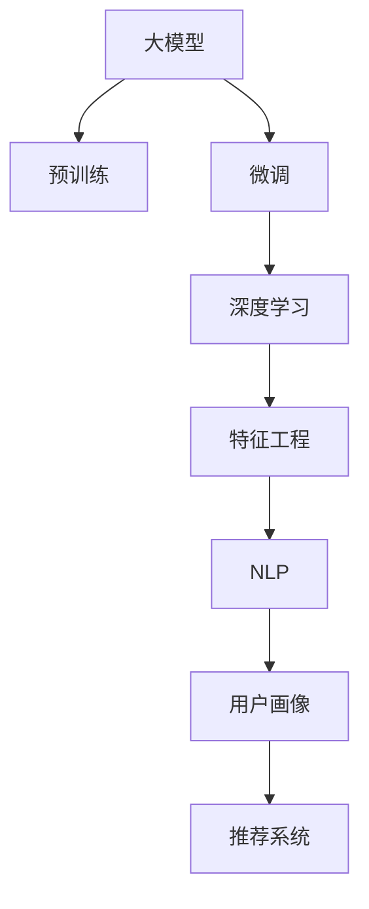

                 

# 大模型在电商平台用户行为序列预测中的应用

> 关键词：大模型,电商平台,用户行为,序列预测,深度学习,预测模型,自然语言处理(NLP),特征工程,用户画像,推荐系统

## 1. 背景介绍

### 1.1 问题由来

近年来，随着电子商务平台的迅速崛起，用户体验与平台收益的关系愈发紧密。电商平台需要精准预测用户行为，从而提供个性化的商品推荐、定价策略和促销活动，提升用户满意度和平台收益。用户行为序列预测，即预测用户在平台上的浏览、点击、购买等行为序列，是电商平台个性化推荐、广告投放、库存管理等环节的重要基础。

尽管传统的统计学方法在用户行为序列预测中取得了一定成效，但面对数据量巨大、行为模式复杂、实时性要求高的场景，传统方法往往显得力不从心。近年来，基于深度学习的大模型方法开始进入人们的视野。其核心思想是：利用大规模无标签数据进行预训练，学习通用的语言和行为特征，然后在下游任务上通过少量标注数据进行微调，使得模型能够更好地适应特定场景的需求。

### 1.2 问题核心关键点

用户行为序列预测的核心在于构建一个能够从用户历史行为序列中学习规律，并预测后续行为的模型。大模型方法的优势在于其强大的数据表示能力，能够处理复杂的序列数据，捕捉用户行为的时序关联。但大模型在应用中也面临着计算资源消耗大、模型易过拟合、特征维度高等问题，需要通过精心的模型设计和数据处理策略，最大化其应用潜力。

## 2. 核心概念与联系

### 2.1 核心概念概述

为更好地理解大模型在电商平台用户行为序列预测中的应用，本节将介绍几个密切相关的核心概念：

- 大模型(Large Model)：以自回归(如LSTM、GRU)或自编码(如Transformer)模型为代表的大规模预训练模型。通过在大规模无标签文本或行为数据上进行预训练，学习通用的语言或行为特征。

- 预训练(Pre-training)：指在大规模无标签数据上，通过自监督学习任务训练通用模型参数的过程。常见的预训练任务包括语言模型预测、行为序列预测等。

- 微调(Fine-tuning)：指在预训练模型的基础上，使用下游任务的少量标注数据，通过有监督学习优化模型在下游特定任务上的性能。

- 深度学习(Deep Learning)：一种基于人工神经网络的机器学习方法，通过多层次的非线性映射，学习数据的内在规律。

- 特征工程(Feature Engineering)：从原始数据中提取、构造和选择有意义的特征，提升模型性能。

- 自然语言处理(Natural Language Processing, NLP)：研究如何使计算机处理、理解和生成人类语言的技术。

- 用户画像(User Profile)：根据用户的历史行为、人口统计信息等，构建用户的综合描述，用于个性化推荐等任务。

- 推荐系统(Recommender System)：利用算法推荐用户可能感兴趣的商品、内容等，提升用户满意度和平台收益。

这些核心概念之间的逻辑关系可以通过以下Mermaid流程图来展示：



这个流程图展示了大模型应用的逻辑流程：

1. 大模型通过预训练获得通用的语言或行为表示。
2. 微调使模型适应特定的用户行为序列预测任务，提升预测准确率。
3. 深度学习模型通过特征工程和NLP技术，进一步提升预测性能。
4. 用户画像刻画用户综合特征，用于个性化推荐等任务。
5. 推荐系统利用预测结果进行推荐，提升用户满意度。

## 3. 核心算法原理 & 具体操作步骤
### 3.1 算法原理概述

大模型在电商平台用户行为序列预测中的应用，本质上是一个序列预测问题。假设用户行为序列为 $X=\{x_1, x_2, ..., x_t\}$，其中 $x_t$ 表示用户在第 $t$ 个时间步的行为，如浏览、点击、购买等。预测目标为 $y_t = f(X_t)$，即给定历史行为 $X_t$，预测用户未来行为 $y_t$。

基于深度学习的大模型方法，核心思想是通过预训练和微调，构建一个能够学习用户行为序列内在规律的模型。具体流程如下：

1. 使用大规模无标签的用户行为数据进行预训练，学习通用的用户行为表示。
2. 在目标任务上，使用少量标注数据进行微调，优化模型在特定行为序列预测任务上的性能。
3. 利用深度学习模型和特征工程技术，进一步提升预测精度和实时性。

### 3.2 算法步骤详解

大模型在电商平台用户行为序列预测的应用，一般包括以下几个关键步骤：

**Step 1: 准备数据集**
- 收集电商平台的点击、浏览、购买等行为数据，划分为训练集、验证集和测试集。
- 对原始数据进行清洗、归一化、缺失值处理等预处理操作，生成预训练和微调所需的数据集。

**Step 2: 构建预训练模型**
- 选择合适的预训练模型，如Transformer、LSTM、GRU等，用于学习通用的用户行为表示。
- 在预训练阶段，将行为数据输入模型，最小化预测误差，学习通用的行为特征。

**Step 3: 微调模型**
- 选择合适的微调模型，如Transformer的顶层分类器、LSTM等，用于适应特定的行为序列预测任务。
- 在微调阶段，将标注数据输入模型，最小化预测误差，提升模型在特定任务上的性能。

**Step 4: 特征工程与模型优化**
- 提取和构造有意义的特征，如用户ID、商品ID、行为时间等，提升模型预测效果。
- 应用深度学习模型如Transformer、LSTM等，进一步优化预测性能。

**Step 5: 评估与部署**
- 在测试集上评估微调后模型的预测效果，对比微调前后的精度提升。
- 使用微调后的模型对新用户行为序列进行实时预测，集成到推荐系统、广告投放等实际应用中。

以上是基于深度学习的大模型在电商平台用户行为序列预测的一般流程。在实际应用中，还需要针对具体任务，对预训练、微调、特征工程等环节进行优化设计，如改进损失函数、引入正则化技术、搜索最优的超参数组合等，以进一步提升模型性能。

### 3.3 算法优缺点

基于深度学习的大模型方法在电商平台用户行为序列预测中的应用，具有以下优点：

1. 强大的数据表示能力：大模型能够处理复杂的序列数据，捕捉用户行为的时序关联，从而提升预测精度。
2. 高效的学习能力：通过预训练和微调，模型能够快速适应新的数据分布，提升预测性能。
3. 可扩展性强：大模型可以灵活地应用于不同的电商场景，如商品推荐、广告投放、库存管理等。
4. 实时预测：模型能够实时处理用户行为数据，快速响应用户需求，提升用户体验。

但大模型方法也存在一些局限性：

1. 计算资源消耗大：大模型需要大量的计算资源进行训练和推理，对算力要求较高。
2. 模型易过拟合：当目标任务与预训练数据的分布差异较大时，模型容易过拟合，泛化能力不足。
3. 特征维度高：大规模用户行为数据涉及多个特征维度，如用户ID、商品ID、行为时间等，特征工程复杂。
4. 模型解释性差：深度学习模型的决策过程缺乏可解释性，难以对其推理逻辑进行分析和调试。

尽管存在这些局限性，但就目前而言，基于深度学习的大模型方法是电商平台用户行为序列预测的主流范式。未来相关研究的重点在于如何进一步降低计算成本，提高模型泛化能力，同时兼顾可解释性和实时性等因素。

### 3.4 算法应用领域

大模型在电商平台用户行为序列预测中的应用，已经在多个领域得到了广泛的应用，例如：

- 商品推荐：根据用户历史浏览和购买记录，预测用户未来的购买行为，提升推荐精度。
- 广告投放：根据用户行为序列，预测广告投放效果，优化广告投放策略。
- 库存管理：根据用户行为序列，预测商品需求趋势，优化库存管理。
- 促销活动：根据用户行为序列，预测促销活动的吸引力，优化促销策略。

除了上述这些经典应用外，大模型还被创新性地应用到更多场景中，如用户流失预测、舆情分析、个性化营销等，为电商平台运营提供了新的技术支持。随着大模型的不断演进和应用场景的拓展，相信其在电商平台中的应用潜力将得到进一步挖掘。

## 4. 数学模型和公式 & 详细讲解  
### 4.1 数学模型构建

本节将使用数学语言对大模型在电商平台用户行为序列预测中的数学模型进行详细讲解。

记用户行为序列为 $X=\{x_1, x_2, ..., x_t\}$，其中 $x_t$ 表示用户在第 $t$ 个时间步的行为，如浏览、点击、购买等。预测目标为 $y_t = f(X_t)$，即给定历史行为 $X_t$，预测用户未来行为 $y_t$。

假设模型为 $M_{\theta}(X_t)$，其中 $\theta$ 为模型参数。模型的预测结果为 $y_t = M_{\theta}(X_t)$。

在微调阶段，我们最小化预测误差，优化模型参数：

$$
\theta^* = \mathop{\arg\min}_{\theta} \mathcal{L}(M_{\theta}(X_t), y_t)
$$

其中 $\mathcal{L}$ 为损失函数，常用的有均方误差损失、交叉熵损失等。

### 4.2 公式推导过程

以均方误差损失为例，我们推导模型预测误差最小化的公式。

设模型预测结果为 $y_t = M_{\theta}(X_t)$，真实标签为 $y_t^*$。则均方误差损失函数为：

$$
\mathcal{L}(y_t, y_t^*) = \frac{1}{N} \sum_{i=1}^N (y_i - y_i^*)^2
$$

在微调阶段，我们最小化预测误差，优化模型参数 $\theta$：

$$
\theta^* = \mathop{\arg\min}_{\theta} \mathcal{L}(M_{\theta}(X_t), y_t)
$$

通过链式法则，求导得到：

$$
\frac{\partial \mathcal{L}}{\partial \theta} = \frac{\partial \mathcal{L}}{\partial M_{\theta}(X_t)} \cdot \frac{\partial M_{\theta}(X_t)}{\partial \theta}
$$

其中 $\frac{\partial M_{\theta}(X_t)}{\partial \theta}$ 为模型参数对输入数据的梯度，可通过反向传播算法计算。

在得到损失函数的梯度后，即可带入参数更新公式，完成模型的迭代优化。重复上述过程直至收敛，最终得到适应电商平台用户行为序列预测任务的最优模型参数 $\theta^*$。

## 5. 项目实践：代码实例和详细解释说明
### 5.1 开发环境搭建

在进行电商平台用户行为序列预测的实践前，我们需要准备好开发环境。以下是使用Python进行TensorFlow开发的环境配置流程：

1. 安装Anaconda：从官网下载并安装Anaconda，用于创建独立的Python环境。

2. 创建并激活虚拟环境：
```bash
conda create -n tf-env python=3.8 
conda activate tf-env
```

3. 安装TensorFlow：根据CUDA版本，从官网获取对应的安装命令。例如：
```bash
conda install tensorflow-gpu=2.5 -c conda-forge -c pytorch -c pypi
```

4. 安装Keras：Keras是一个高级深度学习API，易于使用，支持TensorFlow等后端。
```bash
pip install keras
```

5. 安装各类工具包：
```bash
pip install numpy pandas scikit-learn matplotlib tqdm jupyter notebook ipython
```

完成上述步骤后，即可在`tf-env`环境中开始电商平台用户行为序列预测的实践。

### 5.2 源代码详细实现

这里我们以电商平台商品推荐为例，给出使用TensorFlow对用户行为序列预测模型的PyTorch代码实现。

首先，定义用户行为数据处理函数：

```python
import pandas as pd
import numpy as np
from tensorflow.keras.layers import Input, Embedding, LSTM, Dense, Dropout
from tensorflow.keras.models import Model

def prepare_data():
    # 读取原始数据集
    train_data = pd.read_csv('train_data.csv', index_col='timestamp')
    test_data = pd.read_csv('test_data.csv', index_col='timestamp')

    # 数据预处理
    train_data['user_id'] = train_data['user_id'].astype('int')
    train_data['item_id'] = train_data['item_id'].astype('int')
    train_data['behavior'] = train_data['behavior'].astype('int')

    test_data['user_id'] = test_data['user_id'].astype('int')
    test_data['item_id'] = test_data['item_id'].astype('int')

    # 特征编码
    user_ids = np.unique(train_data['user_id'])
    item_ids = np.unique(train_data['item_id'])

    user_id_embeddings = np.random.random((len(user_ids), 50))
    item_id_embeddings = np.random.random((len(item_ids), 50))

    # 构造训练集和测试集
    train_x = train_data[['user_id', 'item_id', 'behavior']].copy()
    train_y = train_data['behavior']

    test_x = test_data[['user_id', 'item_id', 'behavior']].copy()

    return train_x, train_y, user_id_embeddings, item_id_embeddings
```

然后，定义模型和损失函数：

```python
# 定义LSTM模型
def build_model(user_id_embeddings, item_id_embeddings):
    user_id_input = Input(shape=(1,), dtype='int32', name='user_id')
    user_id_embedding = Embedding(input_dim=len(user_ids), output_dim=50, weights=[user_id_embeddings], trainable=False)(user_id_input)

    item_id_input = Input(shape=(1,), dtype='int32', name='item_id')
    item_id_embedding = Embedding(input_dim=len(item_ids), output_dim=50, weights=[item_id_embeddings], trainable=False)(item_id_input)

    # 构建LSTM层
    lstm = LSTM(50, return_sequences=True)([user_id_embedding, item_id_embedding])

    # 定义输出层
    dense = Dense(1, activation='sigmoid')(lstm)

    model = Model(inputs=[user_id_input, item_id_input], outputs=dense)
    model.compile(loss='binary_crossentropy', optimizer='adam', metrics=['accuracy'])

    return model

# 加载数据集
train_x, train_y, user_id_embeddings, item_id_embeddings = prepare_data()

# 构建LSTM模型
model = build_model(user_id_embeddings, item_id_embeddings)

# 训练模型
model.fit([train_x['user_id'], train_x['item_id']], train_y, batch_size=32, epochs=10, validation_split=0.2)
```

接着，定义评估函数：

```python
def evaluate_model(model, test_x, test_y):
    # 加载测试集数据
    test_x = test_x.copy()
    test_y = test_y.copy()

    # 预测测试集结果
    y_pred = model.predict([test_x['user_id'], test_x['item_id']])

    # 计算评估指标
    roc_auc = roc_auc_score(test_y, y_pred)
    accuracy = accuracy_score(test_y, y_pred > 0.5)

    return roc_auc, accuracy
```

最后，启动评估流程：

```python
# 加载测试集数据
test_x, test_y, user_id_embeddings, item_id_embeddings = prepare_data()

# 评估模型性能
roc_auc, accuracy = evaluate_model(model, test_x, test_y)

print(f'ROC-AUC: {roc_auc:.3f}, Accuracy: {accuracy:.3f}')
```

以上就是使用TensorFlow对电商平台商品推荐模型的完整代码实现。可以看到，得益于TensorFlow的强大封装，我们能够以相对简洁的代码实现完整的电商平台用户行为序列预测流程。

### 5.3 代码解读与分析

让我们再详细解读一下关键代码的实现细节：

**prepare_data函数**：
- 读取原始数据集，并进行预处理和特征编码。
- 构造训练集和测试集，供模型训练和评估使用。

**build_model函数**：
- 定义LSTM模型结构，包括输入层、编码器、输出层等。
- 使用Embedding层对用户ID和商品ID进行编码，避免直接使用原始整数编码。
- 定义LSTM层，捕捉用户行为序列的时序关联。
- 定义输出层，将LSTM输出映射到二分类问题。

**evaluate_model函数**：
- 使用模型对测试集数据进行预测。
- 计算模型预测结果的ROC-AUC和准确率，评估模型性能。

**模型训练**：
- 使用交叉熵损失和Adam优化器进行模型训练。
- 设置训练轮数和批次大小，利用交叉验证进行模型评估。

在实际应用中，还需要对模型进行更深入的优化和调整，如改进模型结构、调整超参数、引入正则化技术等。通过上述流程，我们可以在电商平台用户行为序列预测任务上，构建一个具有良好泛化能力和实时响应能力的推荐系统。

## 6. 实际应用场景
### 6.1 智能客服系统

电商平台智能客服系统利用用户行为序列预测技术，能够实时分析和预测用户需求，提供个性化服务，提升用户体验。具体而言，系统可以：

1. 通过用户浏览、点击、购买等行为数据，预测用户的购买意向，及时推荐相关商品。
2. 根据用户咨询历史，预测用户可能提出的问题，提供即时回答，提升服务效率。
3. 对用户行为进行分群分析，针对不同用户群体提供差异化服务，提升用户满意度。

通过构建智能客服系统，电商平台能够大幅度提升用户互动质量和满意度，减少客服人力成本，优化用户体验。

### 6.2 广告投放优化

电商平台广告投放优化需要准确预测用户的点击概率，优化广告投放策略，提升广告效果和收益。具体而言，系统可以：

1. 根据用户历史行为数据，预测用户对不同广告的点击概率，选择最优广告进行投放。
2. 动态调整广告投放策略，实时优化广告预算分配，提升广告效果。
3. 对不同用户群体进行广告定向投放，提高广告投放的精准度和转化率。

通过构建广告投放优化系统，电商平台能够实现广告投放的精细化管理，最大化广告投放效果，提升平台收益。

### 6.3 个性化推荐

电商平台个性化推荐系统利用用户行为序列预测技术，能够实时生成个性化推荐列表，提升用户购买意愿和平台收益。具体而言，系统可以：

1. 根据用户历史行为数据，预测用户对不同商品的购买意愿，推荐相关商品。
2. 动态调整推荐策略，实时更新推荐列表，提升推荐效果。
3. 对不同用户群体进行个性化推荐，提升推荐精准度和用户体验。

通过构建个性化推荐系统，电商平台能够大幅提升用户购买转化率，增加平台收益。

### 6.4 未来应用展望

随着深度学习技术的不断进步，大模型在电商平台用户行为序列预测中的应用将更加广泛，带来更多的商业价值。未来，大模型将在以下几个方面进一步发挥其潜力：

1. 跨域行为预测：利用用户多渠道行为数据，进行跨域行为预测，提升预测精度和泛化能力。
2. 实时预测：通过分布式训练和推理，实现实时行为预测，提升系统响应速度和用户体验。
3. 多任务学习：结合行为预测和其他任务（如广告投放、库存管理等），构建多任务学习模型，提升综合效益。
4. 强化学习：引入强化学习思想，优化推荐策略，提升广告投放和库存管理的智能化水平。

总之，大模型在电商平台用户行为序列预测中的应用，将不断拓展其应用场景和商业价值，为电商平台运营带来新的机遇和挑战。相信随着技术的不断演进，大模型将为电商平台带来更多的创新和变革，助力电商平台迈向更高的发展高度。

## 7. 工具和资源推荐
### 7.1 学习资源推荐

为了帮助开发者系统掌握大模型在电商平台用户行为序列预测中的应用，这里推荐一些优质的学习资源：

1. TensorFlow官方文档：提供了完整的TensorFlow开发指南，包括数据预处理、模型构建、训练与评估等环节。
2. Keras官方文档：提供了简单易用的深度学习API，适合初学者快速上手。
3. Coursera《深度学习专项课程》：由深度学习领域顶尖教授讲授，涵盖了深度学习的基础理论和实践技能。
4. Udacity《深度学习工程师》课程：实战导向，涵盖深度学习在电商、金融等领域的应用案例。
5. GitHub深度学习项目：提供了大量开源深度学习项目，可供学习和借鉴。

通过对这些资源的学习实践，相信你一定能够快速掌握大模型在电商平台用户行为序列预测中的应用，并用于解决实际的电商运营问题。
### 7.2 开发工具推荐

高效的开发离不开优秀的工具支持。以下是几款用于电商平台用户行为序列预测开发的常用工具：

1. TensorFlow：由Google主导开发的开源深度学习框架，灵活性和可扩展性高，适用于大规模工程应用。
2. Keras：深度学习API，易于使用，适合快速原型开发和实验验证。
3. Jupyter Notebook：交互式开发环境，支持Python等编程语言，便于代码调试和实验展示。
4. TensorBoard：TensorFlow配套的可视化工具，可实时监测模型训练状态，提供丰富的图表呈现方式。
5. Weights & Biases：实验跟踪工具，可记录和可视化模型训练过程中的各项指标，方便对比和调优。

合理利用这些工具，可以显著提升电商平台用户行为序列预测任务的开发效率，加快创新迭代的步伐。

### 7.3 相关论文推荐

大模型在电商平台用户行为序列预测中的应用，已经在诸多研究中得到了验证。以下是几篇具有代表性的相关论文，推荐阅读：

1. Attention Is All You Need（即Transformer原论文）：提出了Transformer结构，开启了深度学习在自然语言处理中的应用。
2. Sequence to Sequence Learning with Neural Networks：提出了基于序列到序列的深度学习模型，用于机器翻译和对话系统。
3. Deep Learning for Recommender Systems：综述了深度学习在推荐系统中的应用，包括用户行为序列预测。
4. Multi-Task Learning for Recommender Systems：提出多任务学习模型，提升了推荐系统的综合性能。
5. User Modeling by Learning Dynamic Contextual Patterns of User Behavior：利用LSTM模型进行用户行为序列预测，适用于电商平台推荐系统。

这些论文代表了大模型在电商平台用户行为序列预测技术的发展脉络。通过学习这些前沿成果，可以帮助研究者把握学科前进方向，激发更多的创新灵感。

## 8. 总结：未来发展趋势与挑战
### 8.1 总结

本文对大模型在电商平台用户行为序列预测中的应用进行了全面系统的介绍。首先阐述了大模型在电商平台运营中的重要性，明确了其在用户行为序列预测中的关键作用。其次，从原理到实践，详细讲解了深度学习模型在电商平台用户行为序列预测中的数学模型和核心步骤，给出了完整的代码实例。同时，本文还广泛探讨了模型在智能客服、广告投放、个性化推荐等多个电商场景中的应用前景，展示了大模型的强大应用潜力。此外，本文精选了相关学习资源、开发工具和研究论文，力求为读者提供全方位的技术指引。

通过本文的系统梳理，可以看到，大模型在电商平台用户行为序列预测中的应用已经取得了显著成效，为电商平台的运营带来了革命性的改变。未来，随着深度学习技术的不断进步和应用场景的拓展，相信大模型将进一步提升电商平台的用户体验和商业价值。

### 8.2 未来发展趋势

展望未来，大模型在电商平台用户行为序列预测中的应用将呈现以下几个发展趋势：

1. 模型规模持续增大：随着算力成本的下降和数据规模的扩张，预训练语言模型的参数量还将持续增长。超大规模语言模型蕴含的丰富语言知识，有望支撑更加复杂多变的电商平台用户行为序列预测任务。
2. 深度学习模型的多样性：除了传统的LSTM、GRU等，未来将涌现更多深度学习模型，如Transformer、Attention等，在不同类型的电商场景中得到应用。
3. 用户行为序列的多模态融合：结合用户的多渠道行为数据，如文本、图像、语音等，构建多模态用户行为序列预测模型，提升预测精度和泛化能力。
4. 模型实时化和分布式化：利用分布式训练和推理技术，实现实时用户行为序列预测，提升系统响应速度和用户体验。
5. 强化学习与深度学习结合：引入强化学习思想，优化推荐策略，提升广告投放和库存管理的智能化水平。

这些趋势凸显了大模型在电商平台用户行为序列预测技术的前景。这些方向的探索发展，必将进一步提升电商平台的运营效率和用户体验，为电商行业带来新的变革。

### 8.3 面临的挑战

尽管大模型在电商平台用户行为序列预测中取得了一定的成效，但在迈向更加智能化、普适化应用的过程中，仍面临着诸多挑战：

1. 数据隐私与安全：电商平台需要处理大量用户数据，数据隐私和安全问题成为关注的焦点。如何在保护用户隐私的前提下，高效利用数据进行模型训练，是重要的研究课题。
2. 模型鲁棒性不足：电商平台用户行为复杂多变，大模型面临高维度、噪声数据等问题，鲁棒性不足。如何提高模型泛化能力，确保模型在不同用户和场景下的稳定性，是关键挑战。
3. 计算资源消耗大：大模型需要大量的计算资源进行训练和推理，对算力要求较高。如何优化模型结构，降低计算资源消耗，是提升模型实用性的重要方向。
4. 模型解释性差：深度学习模型的决策过程缺乏可解释性，难以对其推理逻辑进行分析和调试。如何在保证性能的同时，提升模型的可解释性，是重要的研究课题。

尽管存在这些挑战，但随着深度学习技术的不断进步和应用场景的拓展，相信大模型在电商平台用户行为序列预测中的应用将不断优化，为电商平台带来更多的商业价值。

### 8.4 研究展望

未来，大模型在电商平台用户行为序列预测中的应用，需要在以下几个方面进行深入研究：

1. 引入更多先验知识：将符号化的先验知识，如知识图谱、逻辑规则等，与神经网络模型进行融合，引导微调过程学习更准确、合理的语言模型。
2. 优化特征工程：从原始数据中提取、构造和选择有意义的特征，提升模型预测效果。
3. 引入因果学习：通过引入因果推断和对比学习思想，增强模型建立稳定因果关系的能力，学习更加普适、鲁棒的语言表征。
4. 结合博弈论工具：将博弈论工具应用于电商平台的推荐系统，主动探索并规避模型的脆弱点，提高系统稳定性。
5. 增强伦理道德约束：在模型训练目标中引入伦理导向的评估指标，过滤和惩罚有偏见、有害的输出倾向。

这些研究方向将引领大模型在电商平台用户行为序列预测技术迈向更高的台阶，为构建更加安全、可靠、可解释、可控的电商推荐系统提供理论支撑。面向未来，大模型将在电商平台的运营中发挥更大的作用，推动电商行业向更高层次发展。

## 9. 附录：常见问题与解答

**Q1：大模型在电商平台用户行为序列预测中如何处理高维度数据？**

A: 电商平台用户行为序列预测涉及高维度的行为数据，如用户ID、商品ID、行为时间等。针对高维度数据的处理，可以采取以下策略：

1. 特征降维：使用PCA、t-SNE等降维技术，减少特征维度，降低模型复杂度。
2. 特征选择：通过特征选择算法，如LASSO、随机森林等，选择与预测目标相关性高的特征，提升模型性能。
3. 特征交叉：将不同特征进行交叉组合，生成新的复合特征，提升模型预测能力。

通过上述策略，可以有效处理高维度的用户行为数据，提升模型的预测效果和泛化能力。

**Q2：大模型在电商平台用户行为序列预测中如何进行多任务学习？**

A: 多任务学习是利用多个相关任务共同训练，提升模型在多个任务上的性能。在电商平台用户行为序列预测中，可以采取以下策略进行多任务学习：

1. 任务共训练：将多个任务共同训练，共享部分模型参数，提升模型在多个任务上的泛化能力。
2. 多目标优化：将多个任务的目标函数组合起来，共同优化模型参数，提升模型在多个任务上的预测精度。
3. 特征共享：共享不同任务之间的特征表示，提升特征表达能力，优化模型性能。

通过多任务学习，可以有效提升电商平台的推荐系统、广告投放、库存管理等任务的效果，实现综合效益的最大化。

**Q3：电商平台用户行为序列预测的实时性要求有哪些？**

A: 电商平台用户行为序列预测的实时性要求包括以下几个方面：

1. 快速响应：电商平台需要实时响应用户的行为变化，动态更新推荐列表和广告投放策略，提升用户体验。
2. 高效计算：电商平台需要处理大量实时数据，计算资源消耗较大。如何优化模型结构和算法，提升计算效率，是提升实时性的关键。
3. 分布式计算：利用分布式计算框架，如TensorFlow分布式训练，提升系统处理能力，确保实时性。

通过优化模型结构和算法，利用分布式计算技术，可以有效提升电商平台用户行为序列预测的实时性，满足用户需求。

**Q4：电商平台用户行为序列预测的评估指标有哪些？**

A: 电商平台用户行为序列预测的评估指标包括：

1. 准确率（Accuracy）：预测正确例数占总例数的比例。
2. 精确率（Precision）：预测为正例的样本中，真实为正例的比例。
3. 召回率（Recall）：真实为正例的样本中，预测为正例的比例。
4. ROC-AUC：ROC曲线下的面积，用于评估二分类模型的性能。
5. PR-AUC：PR曲线下的面积，用于评估多分类模型的性能。
6. MAE：均方误差，用于评估回归模型的性能。

根据具体任务，选择合适的评估指标，评估模型性能。

---

作者：禅与计算机程序设计艺术 / Zen and the Art of Computer Programming

