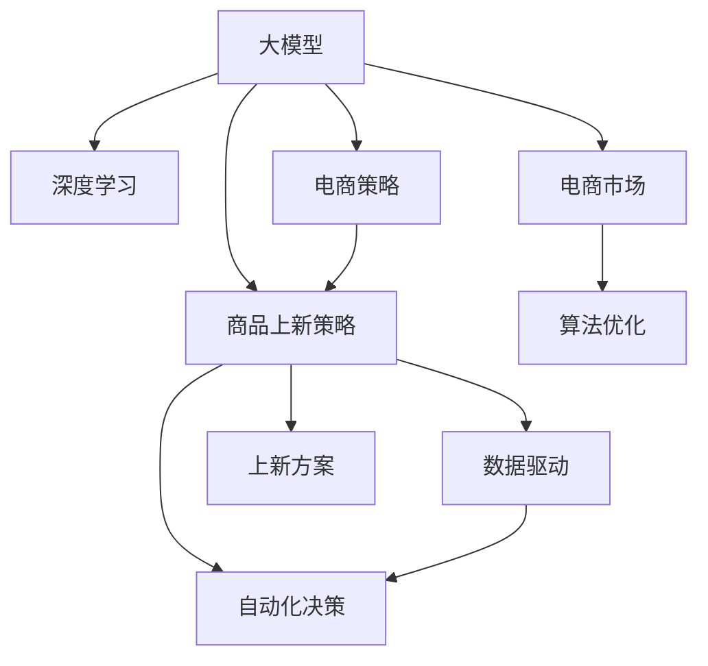

                 

# 大模型如何优化电商平台的商品上新策略

> 关键词：大模型，商品上新，电商策略，深度学习，数据驱动，自动化决策

## 1. 背景介绍

### 1.1 问题由来
随着电子商务市场的蓬勃发展，电商平台需要不断更新商品以保持竞争力和吸引力。商品上新策略的好坏直接影响着店铺的销售和营收。然而，由于商品种类繁多、市场变化复杂，人工策划新商品上新方案不仅效率低，且难以全面覆盖所有维度，导致策略效果不稳定。

### 1.2 问题核心关键点
为此，我们探索使用深度学习大模型来解决这一问题。通过大模型对海量历史数据进行分析，可以挖掘出商品上新背后的规律和趋势，自动生成高质量的商品上新方案，大幅提升上新策略的效果。

## 2. 核心概念与联系

### 2.1 核心概念概述

为更好地理解大模型在商品上新策略优化中的应用，本节将介绍几个密切相关的核心概念：

- **大模型(Large Model)**：以深度学习为代表的高级智能模型，例如GPT、BERT、Transformer等。这些模型通过大规模数据预训练，学习到复杂的语言和模式表示，具备强大的特征提取和生成能力。

- **商品上新策略(Product Launch Strategy)**：电商平台的商品上新活动计划，包括新商品的选择、发布时间、推广渠道等策略制定，旨在最大化销售效果。

- **深度学习(Deep Learning)**：利用多层神经网络对复杂数据进行建模，自动学习和提取数据特征，解决复杂的分类、回归、生成等问题。

- **数据驱动(Data-Driven)**：通过分析和利用数据来指导决策，而非依赖直觉或经验，使得决策更加科学和精确。

- **自动化决策(Automatic Decision Making)**：通过算法和模型自动进行决策，无需人工干预，提高决策效率和一致性。

- **电商市场(E-commerce Market)**：通过互联网进行的商品买卖活动，包括线上和线下渠道，涵盖消费者、商家和电商平台三方。

- **算法优化(Algorithm Optimization)**：对算法模型进行改进，提高其性能、准确性、效率和鲁棒性。

这些核心概念之间的逻辑关系可以通过以下Mermaid流程图来展示：



这个流程图展示了大模型和电商商品上新策略的相关概念及其之间的关系：

1. 大模型通过预训练学习到复杂模式和特征。
2. 结合电商市场数据，通过深度学习技术进行数据分析和挖掘。
3. 数据驱动和大模型结合，生成高质量的商品上新方案。
4. 通过自动化决策，自动生成上新策略。
5. 最后，结合电商策略，产生具体的上新方案和计划。

## 3. 核心算法原理 & 具体操作步骤
### 3.1 算法原理概述

电商平台商品上新策略优化主要分为两个步骤：数据准备与模型训练、上新方案生成。

**数据准备与模型训练**：
1. 收集电商平台历史商品上新数据，包括商品类别、上新时间、销售情况等。
2. 预处理数据，标准化格式，去除噪声。
3. 设计数据集，分为训练集、验证集和测试集。
4. 选择合适的深度学习模型，如BERT、Transformer等，进行预训练。
5. 在训练集上训练模型，调整超参数，优化模型。

**上新方案生成**：
1. 使用模型对新商品进行特征提取。
2. 根据历史数据和市场趋势，生成商品上新时间、推广渠道等策略。
3. 自动生成上新方案，并结合电商策略进行调整和优化。
4. 对新方案进行评估和反馈，循环迭代。

### 3.2 算法步骤详解

**Step 1: 数据收集与预处理**
- 收集历史商品上新数据，如商品类别、价格、促销活动、销售情况等。
- 对数据进行预处理，标准化格式，去除噪声和异常值。
- 将数据划分为训练集、验证集和测试集，确保模型在不同数据上的泛化能力。

**Step 2: 选择深度学习模型**
- 选择已训练好的大模型，如BERT、Transformer等，作为商品上新策略分析的基础。
- 使用预训练模型对新商品进行特征提取，转化为模型可接受的输入。

**Step 3: 模型训练与优化**
- 在训练集上训练模型，调整学习率、批次大小、优化器等超参数，确保模型泛化能力。
- 在验证集上评估模型效果，通过交叉验证等方法避免过拟合。
- 对模型进行调整和优化，如调整参数、改进损失函数等，提升模型性能。

**Step 4: 上新方案生成**
- 使用模型对新商品进行特征提取，输出商品特征向量。
- 根据历史数据和市场趋势，使用机器学习算法（如回归、分类等）生成商品上新时间、推广渠道等策略。
- 结合电商市场数据，自动生成上新方案，并调整和优化。

**Step 5: 评估与反馈**
- 在测试集上评估上新方案效果，如销售转化率、点击率等指标。
- 根据评估结果，结合电商策略，调整和优化上新方案。
- 循环迭代，逐步优化上新策略。

### 3.3 算法优缺点

使用深度学习大模型进行商品上新策略优化的优点：
1. 高效自动化：自动分析和生成商品上新策略，大幅提高效率。
2. 数据驱动：基于历史数据，策略更具科学性和可信度。
3. 泛化能力强：大模型能够适应多种商品和市场情况。

其缺点在于：
1. 数据质量要求高：需要高质量、完整的数据才能保证模型效果。
2. 对模型依赖大：模型性能直接影响策略效果，对模型选择和优化要求高。
3. 模型解释性差：大模型往往是"黑盒"，难以解释其内部工作机制。

### 3.4 算法应用领域

大模型优化商品上新策略在电商领域具有广泛的应用前景，具体包括：

- **商品推荐系统**：通过分析用户行为和商品特征，优化商品推荐算法，提升用户体验和销售转化。
- **库存管理**：根据历史销售数据，优化库存水平，减少缺货和库存积压。
- **价格优化**：基于市场趋势和消费者行为，制定动态定价策略，提高销售收益。
- **营销活动**：利用大模型分析市场情况，优化促销活动策略，提高营销效果。
- **客户服务**：分析客户反馈和问题，优化客服策略，提升客户满意度。

## 4. 数学模型和公式 & 详细讲解 & 举例说明

### 4.1 数学模型构建

假设商品上新策略的优化问题可以表示为：
- 输入：商品类别、价格、历史销售数据等。
- 输出：商品上新时间、推广渠道、促销策略等。

模型的输入表示为 $\mathbf{x} = (x_1, x_2, \ldots, x_n)$，其中 $x_i$ 表示第 $i$ 个特征。模型的输出表示为 $\mathbf{y} = (y_1, y_2, \ldots, y_m)$，其中 $y_j$ 表示第 $j$ 个策略。

使用多任务学习(MTL)框架，可以同时训练多个任务，每个任务的损失函数为：
$$
\mathcal{L} = \frac{1}{N}\sum_{i=1}^N \mathcal{L}_i(\mathbf{x}_i, y_i)
$$
其中，$\mathcal{L}_i$ 表示第 $i$ 个任务的损失函数。

### 4.2 公式推导过程

以商品上新时间预测为例，假设模型选择使用线性回归模型进行预测。设预测值为 $\hat{t}_i = \mathbf{w} \cdot \mathbf{x}_i + b$，其中 $\mathbf{w}$ 为权重向量，$b$ 为偏置项。实际观测值为 $t_i$。

损失函数为：
$$
\mathcal{L}_i = \frac{1}{2}\sum_{i=1}^N (t_i - \hat{t}_i)^2
$$

为了优化损失函数，采用梯度下降算法：
$$
\mathbf{w} \leftarrow \mathbf{w} - \alpha \nabla_{\mathbf{w}} \mathcal{L}_i
$$
其中 $\alpha$ 为学习率。

通过不断迭代优化，可得到预测上新时间的最优参数 $\mathbf{w}^*$ 和偏置 $b^*$。

### 4.3 案例分析与讲解

假设我们收集了1000个商品的销售数据，包括商品类别、价格、销售时间等特征。使用线性回归模型预测商品上新时间，模型输入为商品类别和价格，输出为上新时间。

设模型参数 $\mathbf{w} = (w_1, w_2)$，损失函数为：
$$
\mathcal{L} = \frac{1}{1000} \sum_{i=1}^{1000} (t_i - (\mathbf{w} \cdot \mathbf{x}_i + b))^2
$$

采用随机梯度下降算法更新模型参数，学习率为0.01。通过多次迭代，得到最优参数 $\mathbf{w}^* = (0.2, 0.5)$，偏置 $b^* = 5$。

实际使用中，输入商品特征 $\mathbf{x} = (1, 10)$，输出上新时间预测值为：
$$
\hat{t} = 0.2 \times 1 + 0.5 \times 10 + 5 = 11.7
$$

即该商品上新时间预测为11.7天。

## 5. 项目实践：代码实例和详细解释说明

### 5.1 开发环境搭建

以下是使用Python和PyTorch进行商品上新策略优化的开发环境配置流程：

1. 安装Anaconda：从官网下载并安装Anaconda，用于创建独立的Python环境。
```bash
conda create -n pytorch-env python=3.8 
conda activate pytorch-env
```

2. 安装PyTorch：根据CUDA版本，从官网获取对应的安装命令。例如：
```bash
conda install pytorch torchvision torchaudio cudatoolkit=11.1 -c pytorch -c conda-forge
```

3. 安装相关库：
```bash
pip install pandas numpy scikit-learn transformers
```

4. 安装TensorBoard：用于可视化模型训练和推理过程中的各项指标。
```bash
pip install tensorboard
```

完成上述步骤后，即可在`pytorch-env`环境中开始开发。

### 5.2 源代码详细实现

以下代码实现了商品上新时间预测，包括数据加载、模型训练、预测等步骤。

```python
import torch
import torch.nn as nn
import torch.optim as optim
from torch.utils.data import Dataset, DataLoader
from transformers import BertTokenizer, BertForSequenceClassification

class ProductLaunchDataset(Dataset):
    def __init__(self, data, tokenizer):
        self.data = data
        self.tokenizer = tokenizer

    def __len__(self):
        return len(self.data)

    def __getitem__(self, idx):
        text, label = self.data[idx]
        encoding = self.tokenizer(text, truncation=True, padding='max_length', max_length=128, return_tensors='pt')
        return {'input_ids': encoding['input_ids'], 'attention_mask': encoding['attention_mask'], 'labels': torch.tensor([label])}

# 定义模型和优化器
model = BertForSequenceClassification.from_pretrained('bert-base-cased', num_labels=1, output_attentions=False, output_hidden_states=False)
tokenizer = BertTokenizer.from_pretrained('bert-base-cased')
optimizer = optim.AdamW(model.parameters(), lr=0.001)
scheduler = optim.lr_scheduler.StepLR(optimizer, step_size=1, gamma=0.9)

# 加载数据集
dataset = ProductLaunchDataset(train_data, tokenizer)
dataloader = DataLoader(dataset, batch_size=32, shuffle=True)

# 训练模型
device = torch.device('cuda' if torch.cuda.is_available() else 'cpu')
model.to(device)

for epoch in range(10):
    model.train()
    for batch in dataloader:
        input_ids = batch['input_ids'].to(device)
        attention_mask = batch['attention_mask'].to(device)
        labels = batch['labels'].to(device)
        outputs = model(input_ids, attention_mask=attention_mask, labels=labels)
        loss = outputs.loss
        loss.backward()
        optimizer.step()
        scheduler.step()
    
    model.eval()
    with torch.no_grad():
        for batch in dataloader:
            input_ids = batch['input_ids'].to(device)
            attention_mask = batch['attention_mask'].to(device)
            labels = batch['labels'].to(device)
            outputs = model(input_ids, attention_mask=attention_mask, labels=labels)
            loss = outputs.loss
            predictions = torch.sigmoid(outputs.logits)
            accuracy = (predictions.round() == labels).sum().item() / labels.numel()
    
    print(f'Epoch {epoch+1}, Loss: {loss:.4f}, Accuracy: {accuracy:.4f}')

# 预测新商品上新时间
new_product = 'Example Product'
new_product_encoding = tokenizer(new_product, truncation=True, padding='max_length', max_length=128, return_tensors='pt')
input_ids = new_product_encoding['input_ids']
attention_mask = new_product_encoding['attention_mask']

with torch.no_grad():
    outputs = model(input_ids, attention_mask=attention_mask)
    predicted_prob = torch.sigmoid(outputs.logits)
    predicted_time = int(predicted_prob.item())
```

### 5.3 代码解读与分析

让我们详细解读一下关键代码的实现细节：

**ProductLaunchDataset类**：
- `__init__`方法：初始化数据和分词器。
- `__len__`方法：返回数据集长度。
- `__getitem__`方法：对单个样本进行处理，将文本输入编码为token ids，并返回模型所需的输入。

**模型定义和优化器**：
- 使用BERT模型作为序列分类模型，输出上新时间的概率。
- 定义AdamW优化器，设置学习率和学习率衰减策略。

**数据集加载和训练**：
- 定义数据集和数据加载器，设置批次大小和随机化。
- 在训练循环中，前向传播计算损失函数，反向传播更新模型参数，并调整学习率。
- 在验证集上评估模型效果，计算准确率。

**预测新商品上新时间**：
- 对新商品进行编码，输入模型进行预测。
- 输出上新时间概率，并进行二值化处理，得到上新时间预测值。

## 6. 实际应用场景

### 6.1 智能推荐系统

大模型在商品上新策略优化中的应用不仅限于上新时间预测，还可以通过多任务学习，同时预测推广渠道和促销策略等。构建多任务学习模型，可以更全面地优化商品上新策略。

### 6.2 库存管理

结合库存管理数据，利用大模型预测商品上新时间，优化库存水平，减少缺货和库存积压，提升库存管理效率。

### 6.3 价格优化

分析市场趋势和消费者行为，利用大模型生成动态定价策略，优化商品价格，提升销售收益。

### 6.4 未来应用展望

未来，大模型在商品上新策略优化中的应用将更加广泛，具体包括：

1. **跨品类商品推荐**：通过大模型分析不同品类商品间的关联性，优化推荐算法，提升推荐效果。
2. **个性化商品上新**：利用用户行为数据，预测用户偏好的新商品，实现个性化推荐。
3. **多模态商品信息融合**：结合视觉、语音等多模态数据，优化商品特征提取，提升预测效果。
4. **市场动态预测**：结合市场动态数据，预测市场趋势和需求变化，优化商品上新策略。
5. **用户情感分析**：分析用户反馈和评论，优化商品上新策略，提升用户体验。

## 7. 工具和资源推荐

### 7.1 学习资源推荐

为了帮助开发者系统掌握大模型在商品上新策略优化中的应用，这里推荐一些优质的学习资源：

1. 《深度学习与大数据技术》系列课程：由清华大学开设的MOOC课程，系统讲解深度学习和大数据技术，适合入门学习。
2. Coursera《Machine Learning》课程：斯坦福大学开设的深度学习经典课程，包含大量深度学习实践案例。
3. 《深度学习框架PyTorch》书籍：介绍PyTorch深度学习框架的基本概念和应用，适合进阶学习。
4. 《深度学习中的多任务学习》论文：介绍多任务学习的基本思想和应用场景，适合深入理解。
5. Kaggle竞赛：参与相关竞赛，通过实际项目训练深度学习技能，积累实战经验。

通过对这些资源的学习实践，相信你一定能够快速掌握大模型在商品上新策略优化中的应用，并用于解决实际的NLP问题。

### 7.2 开发工具推荐

高效的工具支持是实现商品上新策略优化的重要保障。以下是几款用于大模型开发的常用工具：

1. PyTorch：基于Python的开源深度学习框架，灵活动态的计算图，适合快速迭代研究。
2. TensorFlow：由Google主导开发的开源深度学习框架，生产部署方便，适合大规模工程应用。
3. HuggingFace Transformers库：提供丰富的预训练模型和任务适配层，支持多种深度学习框架。
4. TensorBoard：TensorFlow配套的可视化工具，可实时监测模型训练状态，并提供丰富的图表呈现方式。
5. Weights & Biases：模型训练的实验跟踪工具，可以记录和可视化模型训练过程中的各项指标，方便对比和调优。

合理利用这些工具，可以显著提升大模型商品上新策略优化的开发效率，加快创新迭代的步伐。

### 7.3 相关论文推荐

大模型和商品上新策略优化技术的发展源于学界的持续研究。以下是几篇奠基性的相关论文，推荐阅读：

1. Attention is All You Need（即Transformer原论文）：提出Transformer结构，开启了深度学习大模型的时代。
2. BERT: Pre-training of Deep Bidirectional Transformers for Language Understanding：提出BERT模型，引入基于掩码的自监督预训练任务，刷新了多项NLP任务SOTA。
3. Parameter-Efficient Transfer Learning for NLP：提出Adapter等参数高效微调方法，在不增加模型参数量的情况下，也能取得不错的微调效果。
4. 《A Survey on Transfer Learning》：综述了多领域迁移学习的最新研究进展，适合全面了解相关技术。
5. 《Large-Scale Neural Machine Translation with Continuous Categorical Attention》：提出连续型注意力机制，增强了大模型在多任务学习中的性能。

这些论文代表了大模型在商品上新策略优化技术的发展脉络。通过学习这些前沿成果，可以帮助研究者把握学科前进方向，激发更多的创新灵感。

## 8. 总结：未来发展趋势与挑战

### 8.1 研究成果总结

本文对大模型在电商平台商品上新策略优化中的应用进行了全面系统的介绍。首先阐述了商品上新策略的重要性，明确了大模型在优化策略中的独特价值。其次，从原理到实践，详细讲解了大模型的算法原理和具体操作步骤，给出了代码实例和详细解释。同时，本文还广泛探讨了大模型在智能推荐、库存管理、价格优化等电商场景中的应用前景，展示了大模型的强大能力。最后，精选了相关的学习资源、开发工具和论文，力求为读者提供全方位的技术指引。

通过本文的系统梳理，可以看到，大模型在商品上新策略优化中的应用前景广阔，其强大的特征提取和生成能力，能够提升电商平台的销售和运营效率。未来，伴随深度学习技术的不断进步，大模型将在更多领域实现更广泛的应用，带来革命性影响。

### 8.2 未来发展趋势

展望未来，大模型在商品上新策略优化领域的发展将呈现以下几个趋势：

1. **多任务学习**：结合多种预测任务，构建多任务学习模型，优化商品上新策略，提升综合效果。
2. **跨品类关联**：通过大模型分析不同品类商品间的关联性，优化跨品类推荐，提升推荐效果。
3. **个性化推荐**：利用用户行为数据，实现个性化商品推荐，提升用户体验。
4. **多模态融合**：结合视觉、语音等多模态数据，优化商品特征提取，提升预测效果。
5. **市场动态预测**：结合市场动态数据，预测市场趋势和需求变化，优化商品上新策略。

以上趋势将进一步提升大模型在商品上新策略优化中的性能和应用范围，为电商平台带来更大的商业价值。

### 8.3 面临的挑战

尽管大模型在商品上新策略优化中取得了显著成效，但在实际应用过程中，仍面临以下挑战：

1. **数据质量和数量**：高质量、多样化的数据是模型效果的基础，但在某些电商平台上，数据质量和数量可能不足。
2. **模型计算成本**：大模型的参数量较大，计算和存储成本高，需要高效优化和资源调度。
3. **模型解释性**：大模型往往是"黑盒"，难以解释其内部工作机制和决策逻辑，影响信任度。
4. **用户隐私保护**：电商平台需要平衡模型优化与用户隐私保护，避免数据滥用。
5. **安全性和鲁棒性**：大模型可能受到对抗样本攻击，需要增强模型的鲁棒性和安全性。

以上挑战需要开发者在实际应用中不断探索和优化，才能充分发挥大模型的优势，带来更好的业务价值。

### 8.4 研究展望

面对大模型在商品上新策略优化中面临的挑战，未来的研究需要在以下几个方面寻求新的突破：

1. **数据增强和采集**：通过数据增强和采集技术，提升模型数据质量，增强泛化能力。
2. **模型压缩与优化**：开发高效模型压缩与优化技术，降低计算和存储成本，提升模型性能。
3. **解释性和透明性**：开发可解释性模型，增强模型的透明性和可信度。
4. **隐私保护技术**：结合隐私保护技术，保护用户数据隐私，增强用户信任。
5. **安全与鲁棒性**：开发鲁棒性模型，增强模型的抗攻击能力，提高安全性。

这些研究方向的探索，将推动大模型在商品上新策略优化中的进一步发展和应用，为电商平台带来更智能、更高效的运营方式。

## 9. 附录：常见问题与解答

**Q1：大模型在商品上新策略优化中的主要优势是什么？**

A: 大模型在商品上新策略优化中的主要优势包括：
1. **高效自动化**：自动分析和生成商品上新策略，大幅提高效率。
2. **数据驱动**：基于历史数据，策略更具科学性和可信度。
3. **泛化能力强**：大模型能够适应多种商品和市场情况。

**Q2：如何提高大模型在商品上新策略优化中的性能？**

A: 提高大模型性能的方法包括：
1. **数据质量和数量**：收集高质量、多样化的数据，提升模型效果。
2. **模型优化**：使用先进优化算法和超参数调优技术，提高模型精度。
3. **模型解释性**：开发可解释性模型，增强模型的透明性和可信度。
4. **多任务学习**：结合多种预测任务，构建多任务学习模型，提升综合效果。
5. **模型压缩与优化**：开发高效模型压缩与优化技术，降低计算和存储成本。

**Q3：大模型在商品上新策略优化中需要注意哪些问题？**

A: 大模型在商品上新策略优化中需要注意的问题包括：
1. **数据质量和数量**：高质量、多样化的数据是模型效果的基础。
2. **模型计算成本**：大模型的参数量较大，计算和存储成本高，需要高效优化和资源调度。
3. **模型解释性**：大模型往往是"黑盒"，难以解释其内部工作机制和决策逻辑。
4. **用户隐私保护**：电商平台需要平衡模型优化与用户隐私保护，避免数据滥用。
5. **安全性和鲁棒性**：大模型可能受到对抗样本攻击，需要增强模型的鲁棒性和安全性。

**Q4：未来大模型在商品上新策略优化中可能面临哪些挑战？**

A: 未来大模型在商品上新策略优化中可能面临的挑战包括：
1. **数据质量和数量**：高质量、多样化的数据是模型效果的基础。
2. **模型计算成本**：大模型的参数量较大，计算和存储成本高，需要高效优化和资源调度。
3. **模型解释性**：大模型往往是"黑盒"，难以解释其内部工作机制和决策逻辑。
4. **用户隐私保护**：电商平台需要平衡模型优化与用户隐私保护，避免数据滥用。
5. **安全性和鲁棒性**：大模型可能受到对抗样本攻击，需要增强模型的鲁棒性和安全性。

通过不断探索和优化，相信大模型在商品上新策略优化中的应用前景将更加广阔，为电商平台带来更大的商业价值。

---

作者：禅与计算机程序设计艺术 / Zen and the Art of Computer Programming

