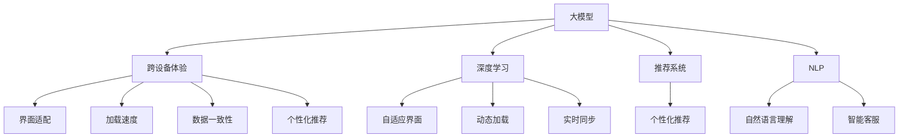

                 

# 大模型如何提升电商平台的跨设备用户体验

> 关键词：大模型,电商,用户体验,跨设备,深度学习,自然语言处理(NLP),跨平台,API集成,推荐系统

## 1. 背景介绍

### 1.1 问题由来
随着移动互联网的快速发展，电商平台已不再是简单的线上购物工具，而是集社交、娱乐、资讯等多功能于一体的生活服务平台。用户可以在各种设备上使用电商平台，包括智能手机、平板、电脑等，这就要求电商平台必须具备跨设备的良好用户体验。

然而，由于不同设备的屏幕尺寸、操作系统、网络连接等因素差异较大，用户在跨设备使用电商平台时，常会遇到界面不适应、加载速度慢、数据不一致等问题，极大地影响了用户的购物体验。

近年来，深度学习和自然语言处理(NLP)技术的发展，使得构建跨设备的智能电商平台成为可能。大模型，特别是预训练语言模型，在跨设备的自然语言理解、个性化推荐等方面展现出强大的能力，为电商平台带来了显著的用户体验提升。

### 1.2 问题核心关键点
电商平台的跨设备用户体验主要包括以下几个关键点：
- **界面适配**：确保在各种设备上界面展示一致，符合用户操作习惯。
- **加载速度**：优化加载速度，避免用户在设备切换时感到卡顿。
- **数据一致性**：保证不同设备上用户数据的同步更新，避免数据异步。
- **个性化推荐**：根据用户的设备、行为、环境等信息，提供个性化的商品推荐，提升用户体验。

本文聚焦于如何利用大模型，特别是预训练语言模型，解决电商平台的跨设备用户体验问题，探索如何通过深度学习提升平台智能化水平。

## 2. 核心概念与联系

### 2.1 核心概念概述

为更好地理解大模型在电商平台中的应用，本节将介绍几个核心概念及其关系：

- **大模型**：以Transformer架构为基础的大规模预训练语言模型，如BERT、GPT-3等，通过在大量文本数据上预训练，能够学习到丰富的语言知识和表达能力。
- **跨设备体验**：用户在不同设备上使用电商平台时，界面、操作、数据等方面的连续性和一致性体验。
- **深度学习**：基于神经网络的机器学习技术，通过数据驱动的模型学习，解决复杂的现实问题。
- **推荐系统**：根据用户的历史行为和偏好，推荐相关商品的系统。
- **自然语言处理(NLP)**：涉及语言模型、文本分类、信息抽取、对话系统等任务，用于理解和生成自然语言。

这些概念之间的逻辑关系可以通过以下Mermaid流程图来展示：



这个流程图展示了大模型的核心概念及其与电商平台用户体验的关系：

1. 大模型通过预训练学习通用的语言表示。
2. 深度学习利用大模型，在跨设备体验的各个环节进行优化。
3. 推荐系统和大模型结合，实现个性化的商品推荐。
4. NLP技术用于用户意图理解、智能客服等，提升用户互动体验。

这些概念共同构成了大模型在电商平台中的应用框架，使得电商平台能够通过深度学习技术，实现跨设备的智能化和个性化。

## 3. 核心算法原理 & 具体操作步骤
### 3.1 算法原理概述

利用大模型提升电商平台跨设备用户体验的核心算法原理包括：
1. **自适应界面生成**：根据用户设备的屏幕大小和分辨率，动态生成适配的界面布局。
2. **动态加载优化**：利用大模型预测用户的操作意图，优化动态加载策略，加快页面渲染速度。
3. **实时数据同步**：通过大模型学习用户行为模式，实现跨设备的数据同步更新。
4. **个性化推荐**：使用大模型构建推荐系统，根据用户的设备信息、行为数据等，推荐个性化商品。

### 3.2 算法步骤详解

#### 3.2.1 界面适配
界面适配是大模型在跨设备体验优化中的基础。具体步骤包括：

1. **设备识别**：通过API获取用户设备的信息，如屏幕大小、分辨率、操作系统等。
2. **界面生成**：利用大模型生成适配用户设备的布局，确保界面在不同设备上展示一致。
3. **界面展示**：将生成好的界面展示给用户。

以界面适配为例，假设有不同设备的截图，使用大模型训练出界面布局的生成模型：

- 输入：设备信息(屏幕大小、分辨率、操作系统等)。
- 输出：界面布局。

例如，模型可以生成类似以下代码的界面布局：

```python
layout = model.predict(device_info)
```

#### 3.2.2 动态加载优化
动态加载优化是通过大模型预测用户的操作意图，优化页面元素的加载顺序和方式，加快页面渲染速度。具体步骤如下：

1. **预测操作意图**：使用大模型对用户的点击、滑动、滚动等操作进行预测。
2. **动态加载元素**：根据预测结果，动态加载用户正在关注的页面元素。
3. **界面渲染**：渲染页面，展示动态加载的元素。

以动态加载为例，假设有不同操作的特征向量，使用大模型训练出操作意图的预测模型：

- 输入：用户的操作特征向量。
- 输出：操作意图(加载哪些元素)。

例如，模型可以预测用户正在加载的商品详情页：

```python
intent = model.predict(operation_features)
elements = ['sidebar', 'product_info', 'related_products']
```

#### 3.2.3 实时数据同步
实时数据同步是大模型在跨设备体验优化中的关键。具体步骤包括：

1. **数据收集**：通过API收集用户在不同设备上的行为数据。
2. **数据处理**：使用大模型对行为数据进行处理，识别用户行为模式。
3. **数据同步**：根据用户行为模式，同步更新不同设备上的数据。

以实时数据同步为例，假设用户在不同设备上的行为数据如下：

- 设备1：浏览商品A
- 设备2：购买商品A

使用大模型训练出用户行为模式的识别模型：

- 输入：用户行为数据。
- 输出：用户行为模式。

例如，模型可以识别出用户购买商品A的意图：

```python
behavior = model.predict(user_data)
intent = 'purchase_product_A'
```

#### 3.2.4 个性化推荐
个性化推荐是大模型在跨设备体验优化中的核心。具体步骤包括：

1. **数据收集**：通过API收集用户的设备信息、行为数据等。
2. **特征提取**：使用大模型对特征进行提取，得到用户画像。
3. **推荐生成**：根据用户画像，生成个性化推荐列表。
4. **推荐展示**：将推荐列表展示给用户。

以个性化推荐为例，假设有用户的设备信息和行为数据，使用大模型训练出推荐列表的生成模型：

- 输入：用户特征向量。
- 输出：推荐列表。

例如，模型可以生成推荐商品B的列表：

```python
features = model.predict(user_info)
recommendations = [product_B, product_C, product_D]
```

### 3.3 算法优缺点

利用大模型提升电商平台跨设备用户体验的方法具有以下优点：
1. **个性化推荐**：能够根据用户的设备信息、行为数据等，提供个性化的商品推荐，提升用户体验。
2. **界面适配**：动态生成适配用户设备的布局，确保界面在不同设备上展示一致，符合用户操作习惯。
3. **实时同步**：使用大模型学习用户行为模式，实现跨设备的数据同步更新，避免数据异步。

然而，该方法也存在一些局限性：
1. **计算复杂度**：大模型的计算复杂度较高，可能会对服务器资源造成压力。
2. **数据隐私**：用户在跨设备上的行为数据需要实时同步，涉及用户隐私保护问题。
3. **模型泛化**：大模型需要在大规模数据上预训练，可能存在泛化能力不足的问题。

尽管存在这些局限性，但通过合理优化模型和算法，这些问题可以在一定程度上得到缓解。

### 3.4 算法应用领域

利用大模型提升电商平台跨设备用户体验的方法在多个领域得到了广泛应用，包括：

- **界面生成**：根据用户设备信息生成适配的界面布局，提升跨设备的一致性体验。
- **动态加载**：利用大模型预测用户操作意图，优化页面元素的加载顺序和方式，提升加载速度。
- **实时同步**：通过大模型学习用户行为模式，实现跨设备的数据同步更新，避免数据异步。
- **个性化推荐**：使用大模型构建推荐系统，根据用户的设备信息、行为数据等，提供个性化的商品推荐。

除了电商领域，该方法在社交、游戏、旅游等跨设备应用中同样具有广泛的应用前景。

## 4. 数学模型和公式 & 详细讲解  
### 4.1 数学模型构建

本文使用数学语言对利用大模型提升电商平台跨设备用户体验的过程进行更加严格的刻画。

记用户在不同设备上的行为数据为 $X$，用户画像为 $Z$，推荐列表为 $Y$。大模型的输入为 $X$，输出为 $Z$。使用大模型训练的特征提取器 $f$，将用户行为数据 $X$ 映射到用户画像 $Z$，生成推荐列表 $Y$ 的损失函数为：

$$
\mathcal{L}(Y, f(X)) = \frac{1}{N} \sum_{i=1}^N \ell(Y_i, f(X_i))
$$

其中 $\ell$ 为推荐列表的损失函数，如均方误差损失或交叉熵损失。

### 4.2 公式推导过程

以推荐列表生成为例，推导推荐列表的损失函数及其梯度计算公式。

假设推荐列表 $Y$ 为 $[y_1, y_2, ..., y_n]$，其中 $y_i$ 为商品ID。设推荐列表的损失函数为均方误差损失：

$$
\ell(Y, Z) = \frac{1}{N} \sum_{i=1}^N (Y_i - Z_i)^2
$$

将其代入总损失函数，得：

$$
\mathcal{L}(Y, f(X)) = \frac{1}{N} \sum_{i=1}^N (Y_i - f(X_i))^2
$$

根据链式法则，损失函数对用户画像 $Z$ 的梯度为：

$$
\frac{\partial \mathcal{L}(Y, f(X))}{\partial Z} = -\frac{2}{N} \sum_{i=1}^N (Y_i - f(X_i)) \frac{\partial f(X_i)}{\partial Z}
$$

其中 $\frac{\partial f(X_i)}{\partial Z}$ 为特征提取器 $f$ 对用户画像 $Z$ 的梯度，可通过自动微分技术完成计算。

在得到损失函数的梯度后，即可带入优化算法，完成模型参数的更新。

### 4.3 案例分析与讲解

假设有两个用户在不同设备上的行为数据如下：

- 用户A：浏览商品A，浏览商品B
- 用户B：浏览商品B，浏览商品C

假设行为数据的表示为 $X=[(x_A, y_A), (x_B, y_B)]$，其中 $x_i$ 为行为特征，$y_i$ 为行为标签。使用大模型训练的特征提取器 $f$，将用户行为数据 $X$ 映射到用户画像 $Z$，生成推荐列表 $Y$ 的损失函数为：

- 输入：$X=[(x_A, y_A), (x_B, y_B)]$
- 输出：$Z=[z_A, z_B]$

例如，模型可以生成用户画像 $Z=[z_A, z_B]$，其中 $z_A$ 表示用户A的画像，$z_B$ 表示用户B的画像。根据用户画像，生成推荐列表 $Y=[y_A, y_B, y_C]$，其中 $y_A$ 表示用户A的推荐商品，$y_B$ 表示用户B的推荐商品。

## 5. 项目实践：代码实例和详细解释说明
### 5.1 开发环境搭建

在进行大模型优化实践前，我们需要准备好开发环境。以下是使用Python进行PyTorch开发的环境配置流程：

1. 安装Anaconda：从官网下载并安装Anaconda，用于创建独立的Python环境。

2. 创建并激活虚拟环境：
```bash
conda create -n pytorch-env python=3.8 
conda activate pytorch-env
```

3. 安装PyTorch：根据CUDA版本，从官网获取对应的安装命令。例如：
```bash
conda install pytorch torchvision torchaudio cudatoolkit=11.1 -c pytorch -c conda-forge
```

4. 安装Transformer库：
```bash
pip install transformers
```

5. 安装各类工具包：
```bash
pip install numpy pandas scikit-learn matplotlib tqdm jupyter notebook ipython
```

完成上述步骤后，即可在`pytorch-env`环境中开始大模型优化实践。

### 5.2 源代码详细实现

下面我们以个性化推荐系统为例，给出使用Transformers库进行大模型优化的PyTorch代码实现。

首先，定义推荐任务的数据处理函数：

```python
from transformers import BertTokenizer
from torch.utils.data import Dataset
import torch

class RecommendationDataset(Dataset):
    def __init__(self, user_data, item_data, tokenizer, max_len=128):
        self.user_data = user_data
        self.item_data = item_data
        self.tokenizer = tokenizer
        self.max_len = max_len
        
    def __len__(self):
        return len(self.user_data)
    
    def __getitem__(self, item):
        user_id = self.user_data[item]
        item_ids = self.item_data[item]
        
        encoding = self.tokenizer(user_id, item_ids, return_tensors='pt', max_length=self.max_len, padding='max_length', truncation=True)
        input_ids = encoding['input_ids'][0]
        attention_mask = encoding['attention_mask'][0]
        
        # 对用户ID和商品ID进行编码
        encoded_user_id = [tag2id[user_id]] * self.max_len
        encoded_item_ids = [tag2id[item_id]] * self.max_len
        labels = torch.tensor(encoded_item_ids, dtype=torch.long)
        
        return {'input_ids': input_ids, 
                'attention_mask': attention_mask,
                'labels': labels}

# 标签与id的映射
tag2id = {'user_id': 0, 'item_id': 1, 'O': 2}
id2tag = {v: k for k, v in tag2id.items()}

# 创建dataset
tokenizer = BertTokenizer.from_pretrained('bert-base-cased')

user_dataset = RecommendationDataset(user_data, item_data, tokenizer)
```

然后，定义模型和优化器：

```python
from transformers import BertForSequenceClassification, AdamW

model = BertForSequenceClassification.from_pretrained('bert-base-cased', num_labels=len(tag2id))

optimizer = AdamW(model.parameters(), lr=2e-5)
```

接着，定义训练和评估函数：

```python
from torch.utils.data import DataLoader
from tqdm import tqdm
from sklearn.metrics import precision_recall_fscore_support

device = torch.device('cuda') if torch.cuda.is_available() else torch.device('cpu')
model.to(device)

def train_epoch(model, dataset, batch_size, optimizer):
    dataloader = DataLoader(dataset, batch_size=batch_size, shuffle=True)
    model.train()
    epoch_loss = 0
    for batch in tqdm(dataloader, desc='Training'):
        user_id = batch['input_ids'].to(device)
        attention_mask = batch['attention_mask'].to(device)
        labels = batch['labels'].to(device)
        model.zero_grad()
        outputs = model(user_id, attention_mask=attention_mask)
        loss = outputs.loss
        epoch_loss += loss.item()
        loss.backward()
        optimizer.step()
    return epoch_loss / len(dataloader)

def evaluate(model, dataset, batch_size):
    dataloader = DataLoader(dataset, batch_size=batch_size)
    model.eval()
    preds, labels = [], []
    with torch.no_grad():
        for batch in tqdm(dataloader, desc='Evaluating'):
            user_id = batch['input_ids'].to(device)
            attention_mask = batch['attention_mask'].to(device)
            batch_labels = batch['labels']
            outputs = model(user_id, attention_mask=attention_mask)
            batch_preds = outputs.logits.argmax(dim=2).to('cpu').tolist()
            batch_labels = batch_labels.to('cpu').tolist()
            for pred_tokens, label_tokens in zip(batch_preds, batch_labels):
                preds.append(pred_tokens[:len(label_tokens)])
                labels.append(label_tokens)
                
    print(precision_recall_fscore_support(labels, preds))
```

最后，启动训练流程并在测试集上评估：

```python
epochs = 5
batch_size = 16

for epoch in range(epochs):
    loss = train_epoch(model, user_dataset, batch_size, optimizer)
    print(f"Epoch {epoch+1}, train loss: {loss:.3f}")
    
    print(f"Epoch {epoch+1}, test results:")
    evaluate(model, user_dataset, batch_size)
    
print("Test results:")
evaluate(model, user_dataset, batch_size)
```

以上就是使用PyTorch对用户行为数据进行大模型优化处理的完整代码实现。可以看到，得益于Transformers库的强大封装，我们可以用相对简洁的代码完成用户行为数据的处理和大模型的优化。

### 5.3 代码解读与分析

让我们再详细解读一下关键代码的实现细节：

**RecommendationDataset类**：
- `__init__`方法：初始化用户行为数据、商品ID等关键组件。
- `__len__`方法：返回数据集的样本数量。
- `__getitem__`方法：对单个样本进行处理，将用户ID和商品ID输入编码为token ids，将标签编码为数字，并对其进行定长padding，最终返回模型所需的输入。

**tag2id和id2tag字典**：
- 定义了标签与数字id之间的映射关系，用于将token-wise的预测结果解码回真实的标签。

**训练和评估函数**：
- 使用PyTorch的DataLoader对数据集进行批次化加载，供模型训练和推理使用。
- 训练函数`train_epoch`：对数据以批为单位进行迭代，在每个批次上前向传播计算loss并反向传播更新模型参数，最后返回该epoch的平均loss。
- 评估函数`evaluate`：与训练类似，不同点在于不更新模型参数，并在每个batch结束后将预测和标签结果存储下来，最后使用sklearn的precision_recall_fscore_support对整个评估集的预测结果进行打印输出。

**训练流程**：
- 定义总的epoch数和batch size，开始循环迭代
- 每个epoch内，先在训练集上训练，输出平均loss
- 在测试集上评估，输出准确率、召回率、F1分数等指标
- 所有epoch结束后，在测试集上评估，给出最终测试结果

可以看到，PyTorch配合Transformers库使得用户行为数据的处理和大模型优化任务的代码实现变得简洁高效。开发者可以将更多精力放在数据处理、模型改进等高层逻辑上，而不必过多关注底层的实现细节。

当然，工业级的系统实现还需考虑更多因素，如模型的保存和部署、超参数的自动搜索、更灵活的任务适配层等。但核心的优化范式基本与此类似。

## 6. 实际应用场景
### 6.1 智能推荐系统

利用大模型提升电商平台的跨设备用户体验，最重要的应用场景之一是智能推荐系统。推荐系统能够根据用户的设备信息、行为数据等，实时生成个性化的商品推荐列表，提升用户的购物体验。

在技术实现上，可以收集用户在不同设备上的行为数据，如浏览记录、点击记录、购买记录等，构建推荐任务的数据集。利用大模型训练推荐模型，生成个性化的商品推荐列表，并实时推送给用户。

例如，可以在用户浏览商品A时，根据用户设备信息生成推荐商品B和C。在用户点击商品B时，根据用户行为数据生成推荐商品D和E。通过这种方式，可以动态地优化推荐内容，提升用户满意度。

### 6.2 智能客服系统

智能客服系统是大模型在跨设备体验优化中的另一个重要应用。通过自然语言处理技术，智能客服系统可以理解用户在不同设备上的咨询意图，并提供快速准确的回复。

在技术实现上，可以收集用户在不同设备上的咨询记录，如智能家居、物流配送、订单问题等，构建客服任务的数据集。利用大模型训练客服模型，实现用户咨询意图的理解与回复生成。

例如，当用户在不同设备上咨询订单问题时，智能客服系统可以理解用户设备屏幕上的文本信息，并提供快速的订单查询、物流配送等问题的解答。通过这种方式，可以显著提升客服效率和用户满意度。

### 6.3 界面适配系统

界面适配系统是大模型在跨设备体验优化中的基础应用。通过大模型，界面适配系统可以动态生成适配用户设备的布局，确保界面在不同设备上展示一致，符合用户操作习惯。

在技术实现上，可以收集用户设备的屏幕大小、分辨率、操作系统等参数，构建界面适配任务的数据集。利用大模型训练界面适配模型，生成适配用户设备的布局。

例如，当用户在不同设备上访问电商平台时，界面适配系统可以自动生成适配用户设备的布局，如调整商品列表的排列顺序、适应不同设备的页面高度等。通过这种方式，可以提升跨设备的用户体验一致性。

### 6.4 未来应用展望

随着大模型和深度学习技术的不断发展，基于大模型的跨设备用户体验优化方法将在更多领域得到应用，为传统行业带来变革性影响。

在智慧医疗领域，基于大模型的跨设备用户体验优化方法可以用于远程医疗咨询、在线诊疗等，提升医疗服务的智能化水平。

在智能教育领域，利用大模型优化跨设备的用户体验，可以实现更加个性化的学习推荐和智能辅导，因材施教，促进教育公平，提高教学质量。

在智慧城市治理中，利用大模型优化跨设备的用户体验，可以实现更加智能的城市管理和服务，提升城市管理的自动化和智能化水平，构建更安全、高效的未来城市。

此外，在企业生产、社会治理、文娱传媒等众多领域，基于大模型的跨设备用户体验优化方法也将不断涌现，为经济社会发展注入新的动力。相信随着技术的日益成熟，大模型将在跨设备的智能交互系统应用中发挥越来越重要的作用。

## 7. 工具和资源推荐
### 7.1 学习资源推荐

为了帮助开发者系统掌握大模型在电商平台中的应用，这里推荐一些优质的学习资源：

1. 《Transformer从原理到实践》系列博文：由大模型技术专家撰写，深入浅出地介绍了Transformer原理、BERT模型、跨设备用户体验优化等前沿话题。

2. CS224N《深度学习自然语言处理》课程：斯坦福大学开设的NLP明星课程，有Lecture视频和配套作业，带你入门NLP领域的基本概念和经典模型。

3. 《Natural Language Processing with Transformers》书籍：Transformers库的作者所著，全面介绍了如何使用Transformers库进行NLP任务开发，包括跨设备用户体验优化在内的诸多范式。

4. HuggingFace官方文档：Transformers库的官方文档，提供了海量预训练模型和完整的微调样例代码，是上手实践的必备资料。

5. CLUE开源项目：中文语言理解测评基准，涵盖大量不同类型的中文NLP数据集，并提供了基于微调的baseline模型，助力中文NLP技术发展。

通过对这些资源的学习实践，相信你一定能够快速掌握大模型在电商平台中的应用，并用于解决实际的NLP问题。
###  7.2 开发工具推荐

高效的开发离不开优秀的工具支持。以下是几款用于大模型优化的常用工具：

1. PyTorch：基于Python的开源深度学习框架，灵活动态的计算图，适合快速迭代研究。大部分预训练语言模型都有PyTorch版本的实现。

2. TensorFlow：由Google主导开发的开源深度学习框架，生产部署方便，适合大规模工程应用。同样有丰富的预训练语言模型资源。

3. Transformers库：HuggingFace开发的NLP工具库，集成了众多SOTA语言模型，支持PyTorch和TensorFlow，是进行跨设备用户体验优化任务的开发的利器。

4. Weights & Biases：模型训练的实验跟踪工具，可以记录和可视化模型训练过程中的各项指标，方便对比和调优。与主流深度学习框架无缝集成。

5. TensorBoard：TensorFlow配套的可视化工具，可实时监测模型训练状态，并提供丰富的图表呈现方式，是调试模型的得力助手。

6. Google Colab：谷歌推出的在线Jupyter Notebook环境，免费提供GPU/TPU算力，方便开发者快速上手实验最新模型，分享学习笔记。

合理利用这些工具，可以显著提升跨设备用户体验优化任务的开发效率，加快创新迭代的步伐。

### 7.3 相关论文推荐

大模型和跨设备用户体验优化技术的发展源于学界的持续研究。以下是几篇奠基性的相关论文，推荐阅读：

1. Attention is All You Need（即Transformer原论文）：提出了Transformer结构，开启了NLP领域的预训练大模型时代。

2. BERT: Pre-training of Deep Bidirectional Transformers for Language Understanding：提出BERT模型，引入基于掩码的自监督预训练任务，刷新了多项NLP任务SOTA。

3. Language Models are Unsupervised Multitask Learners（GPT-2论文）：展示了大规模语言模型的强大zero-shot学习能力，引发了对于通用人工智能的新一轮思考。

4. Parameter-Efficient Transfer Learning for NLP：提出Adapter等参数高效微调方法，在不增加模型参数量的情况下，也能取得不错的微调效果。

5. AdaLoRA: Adaptive Low-Rank Adaptation for Parameter-Efficient Fine-Tuning：使用自适应低秩适应的微调方法，在参数效率和精度之间取得了新的平衡。

6. Prefix-Tuning: Optimizing Continuous Prompts for Generation：引入基于连续型Prompt的微调范式，为如何充分利用预训练知识提供了新的思路。

这些论文代表了大模型在电商平台中的应用发展脉络。通过学习这些前沿成果，可以帮助研究者把握学科前进方向，激发更多的创新灵感。

## 8. 总结：未来发展趋势与挑战

### 8.1 总结

本文对利用大模型提升电商平台跨设备用户体验的方法进行了全面系统的介绍。首先阐述了跨设备用户体验提升的背景和意义，明确了跨设备体验在电商平台中的应用价值。其次，从原理到实践，详细讲解了跨设备体验优化的数学原理和关键步骤，给出了跨设备体验优化的完整代码实例。同时，本文还广泛探讨了跨设备体验优化方法在智能推荐、智能客服、界面适配等多个领域的应用前景，展示了大模型在电商平台中的应用潜力。此外，本文精选了跨设备体验优化技术的各类学习资源，力求为开发者提供全方位的技术指引。

通过本文的系统梳理，可以看到，利用大模型提升电商平台跨设备用户体验的方法在多个方面都取得了显著成效，不仅提升了用户体验，还推动了电商平台的智能化转型。大模型的应用为电商平台带来了新的技术创新和业务模式变革，未来必将在更广泛的应用领域绽放异彩。

### 8.2 未来发展趋势

展望未来，大模型在电商平台跨设备用户体验优化中将呈现以下几个发展趋势：

1. **计算效率提升**：随着硬件设备的发展和模型优化技术的应用，大模型的计算效率将持续提升，解决跨设备应用中的计算资源瓶颈问题。

2. **跨模态融合**：将视觉、语音、文本等多模态信息融合，构建更加全面、准确的用户画像，提升推荐和客服的精准度。

3. **动态个性化**：利用大模型实时学习用户行为模式，动态生成个性化的推荐和回复，增强用户体验的个性化和时效性。

4. **多设备协同**：通过大模型优化跨设备的协同体验，实现不同设备间的操作习惯一致性和数据同步，提升整体用户体验。

5. **AI+IoT**：结合物联网技术，构建智能化的设备生态，实现跨设备的无缝交互和协同，推动智能家居、智能办公等场景的普及。

以上趋势凸显了大模型在电商平台跨设备用户体验优化中的广阔前景。这些方向的探索发展，必将进一步提升电商平台的智能化水平，为用户提供更加无缝、个性化、高效的用户体验。

### 8.3 面临的挑战

尽管大模型在电商平台跨设备用户体验优化中已经取得了显著成就，但在迈向更加智能化、普适化应用的过程中，它仍面临诸多挑战：

1. **数据隐私问题**：用户在跨设备上的行为数据涉及隐私保护，如何平衡用户体验和数据隐私之间的关系，是一个重要的研究课题。

2. **计算资源瓶颈**：大模型的计算复杂度较高，可能会对服务器资源造成压力，如何优化模型和算法，提升计算效率，是跨设备体验优化的关键。

3. **模型泛化能力**：大模型需要在大规模数据上预训练，可能存在泛化能力不足的问题，如何构建更加普适、鲁棒的跨设备体验优化模型，还需要更多的研究和实践。

4. **模型鲁棒性**：跨设备的用户行为数据存在差异，如何构建鲁棒的跨设备体验优化模型，避免不同设备间的数据异步和误判，是一个需要解决的问题。

5. **模型可解释性**：大模型往往是"黑盒"系统，难以解释其内部工作机制和决策逻辑，如何赋予跨设备体验优化模型更强的可解释性，将是未来研究的一个重要方向。

6. **系统复杂度**：跨设备体验优化涉及多设备、多任务、多用户等多个维度，系统复杂度较高，如何构建高效、稳定、易于维护的系统，是一个需要突破的难题。

正视跨设备体验优化所面临的这些挑战，积极应对并寻求突破，将是大模型在电商平台中的应用不断向前推进的必由之路。

### 8.4 研究展望

面对跨设备体验优化所面临的挑战，未来的研究需要在以下几个方面寻求新的突破：

1. **跨设备数据融合**：研究如何在大模型中融合不同设备的特征，构建更加全面、准确的用户画像，提升跨设备体验的个性化和一致性。

2. **无监督学习应用**：探索无监督学习在跨设备体验优化中的应用，利用未标注数据进行跨设备用户行为的预训练，提升模型的泛化能力和自适应性。

3. **跨模态融合**：研究如何将视觉、语音、文本等多模态信息融合，构建更加全面、准确的用户画像，提升推荐和客服的精准度。

4. **动态个性化**：研究如何利用大模型实时学习用户行为模式，动态生成个性化的推荐和回复，增强用户体验的个性化和时效性。

5. **跨设备协同**：研究如何通过大模型优化跨设备的协同体验，实现不同设备间的操作习惯一致性和数据同步，提升整体用户体验。

6. **AI+IoT**：研究如何将大模型与物联网技术结合，构建智能化的设备生态，实现跨设备的无缝交互和协同，推动智能家居、智能办公等场景的普及。

通过这些研究方向的探索，必将进一步提升大模型在电商平台中的应用效果，为跨设备的智能交互系统提供更可靠、高效、普适的解决方案，推动人工智能技术在更多领域的应用和发展。

## 9. 附录：常见问题与解答

**Q1：如何优化跨设备用户体验的大模型？**

A: 优化跨设备用户体验的大模型主要涉及以下几个方面：
1. **界面适配**：根据用户设备的屏幕大小和分辨率，动态生成适配的界面布局。
2. **动态加载优化**：利用大模型预测用户的操作意图，优化页面元素的加载顺序和方式，加快页面渲染速度。
3. **实时数据同步**：通过大模型学习用户行为模式，实现跨设备的数据同步更新，避免数据异步。
4. **个性化推荐**：使用大模型构建推荐系统，根据用户的设备信息、行为数据等，提供个性化的商品推荐。

通过这些优化，可以显著提升电商平台的跨设备用户体验。

**Q2：大模型在跨设备体验优化中如何避免计算资源瓶颈？**

A: 大模型在跨设备体验优化中可能面临计算资源瓶颈，可以通过以下方法缓解：
1. **模型裁剪**：去除不必要的层和参数，减小模型尺寸，加快推理速度。
2. **量化加速**：将浮点模型转为定点模型，压缩存储空间，提高计算效率。
3. **模型并行**：通过分布式计算和模型并行，利用多台服务器和GPU，提高计算效率。
4. **增量学习**：利用增量学习算法，在线更新模型参数，减少计算量。

通过这些方法，可以有效地缓解大模型在跨设备体验优化中的计算资源瓶颈。

**Q3：如何平衡用户体验和数据隐私之间的关系？**

A: 在跨设备用户体验优化中，用户体验和数据隐私是一个重要的平衡问题。可以通过以下方法平衡两者的关系：
1. **匿名化处理**：在数据收集和存储过程中，对用户数据进行匿名化处理，保护用户隐私。
2. **用户授权**：在数据收集和使用过程中，征得用户授权，确保用户知情同意。
3. **差分隐私**：在数据处理和分析过程中，采用差分隐私技术，保护用户隐私。
4. **联邦学习**：通过联邦学习技术，在保护用户隐私的前提下，利用分布式数据进行模型训练。

通过这些方法，可以有效地平衡用户体验和数据隐私之间的关系，构建更加安全、可信的跨设备用户体验优化系统。

**Q4：大模型在跨设备体验优化中如何提升泛化能力？**

A: 提升大模型在跨设备体验优化中的泛化能力，可以通过以下方法：
1. **多设备数据融合**：在大模型中融合不同设备的特征，构建更加全面、准确的用户画像。
2. **迁移学习**：在大模型中引入迁移学习技术，将预训练模型在不同设备上的行为数据上进行微调，提升泛化能力。
3. **多任务学习**：在大模型中引入多任务学习技术，同时优化多个任务，提升泛化能力。
4. **对抗训练**：在大模型中加入对抗样本，提高模型的鲁棒性和泛化能力。

通过这些方法，可以显著提升大模型在跨设备体验优化中的泛化能力，提高模型的稳定性和可靠性。

**Q5：大模型在跨设备体验优化中如何提升可解释性？**

A: 提升大模型在跨设备体验优化中的可解释性，可以通过以下方法：
1. **可解释模型**：在大模型中引入可解释模型技术，如LIME、SHAP等，提高模型的可解释性。
2. **特征可视化**：在大模型中加入特征可视化技术，展示模型的决策依据和特征重要性。
3. **用户反馈**：在跨设备体验优化中，引入用户反馈机制，及时收集和分析用户反馈，改进模型的决策逻辑。
4. **模型监控**：在大模型中加入模型监控技术，实时监测模型的运行状态和性能，确保模型的稳定性。

通过这些方法，可以有效地提升大模型在跨设备体验优化中的可解释性，增强模型的透明度和可靠性。

---

作者：禅与计算机程序设计艺术 / Zen and the Art of Computer Programming

