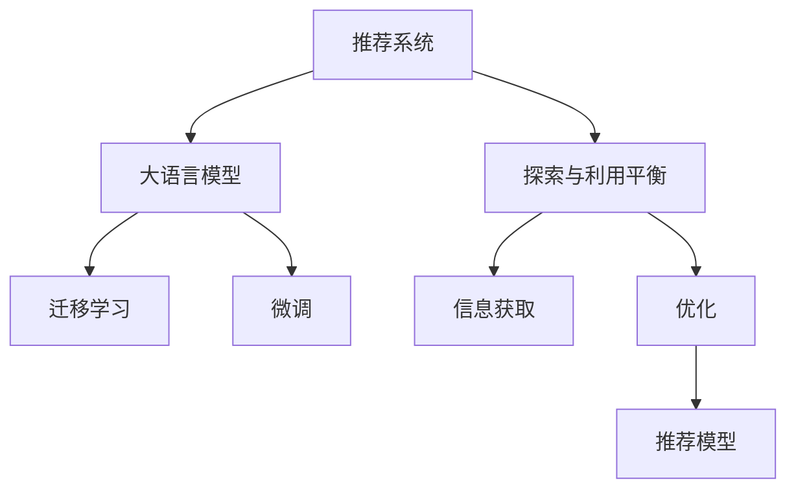

                 

# 大模型对推荐系统探索与利用平衡的影响

## 1. 背景介绍

推荐系统是互联网时代的重要基础设施，几乎覆盖了电商、社交、音乐、视频等各个领域。通过深度学习和数据挖掘等技术，推荐系统能够精准地为用户提供个性化的内容推荐，提升用户满意度和粘性，同时也为内容生产者提供了精准的广告投放机会。

但推荐系统的发展也面临诸多挑战，包括用户隐私保护、数据稀疏性、冷启动问题、公平性、动态性等。这些挑战需要推荐的算法不断优化，以满足用户的个性化需求和企业的商业目标。大语言模型作为近年来的热门技术，是否能够为推荐系统带来新的突破呢？本文将对这一问题进行探讨。

## 2. 核心概念与联系

### 2.1 核心概念概述

- **推荐系统**：基于用户历史行为数据，通过算法为用户推荐个性化内容的系统。推荐系统通常分为基于内容的推荐、协同过滤、基于矩阵分解的方法等。

- **大语言模型**：基于深度学习架构（如Transformer）的大规模预训练语言模型，具备强大的语言理解和生成能力，通常使用自监督学习任务进行预训练，如掩码语言模型、预测下一个单词等。

- **探索与利用平衡**：推荐系统设计的一个核心问题，即如何在未知数据（探索）和已有数据（利用）之间取得平衡，避免探索不足导致性能停滞，或探索过多导致利用不足，造成资源浪费。

- **信息获取与优化**：在推荐系统中，通过探索与利用的平衡，获取尽可能多的信息，并用于优化推荐模型，提高推荐的准确性和个性化程度。

这些核心概念之间存在紧密的联系。推荐系统通过探索与利用平衡，获取更多信息，并用于优化模型的训练和预测。大语言模型可以通过迁移学习和微调技术，更好地融入推荐系统，提取更多关于用户和内容的潜在信息。

### 2.2 核心概念原理和架构的 Mermaid 流程图



该流程图展示了推荐系统、探索与利用平衡、大语言模型、迁移学习、微调和信息获取与优化的逻辑关系。

## 3. 核心算法原理 & 具体操作步骤

### 3.1 算法原理概述

大语言模型对推荐系统的探索与利用平衡影响主要体现在以下几个方面：

1. **大语言模型的预训练**：大语言模型通过在大规模无标签文本数据上进行预训练，学习到丰富的语言知识，包括语言结构和语义理解。这些知识可以迁移到推荐系统中，提升模型的个性化推荐能力。

2. **大语言模型的微调**：通过在有标注数据集上进行微调，大语言模型可以学习到特定的用户行为和内容属性，从而更准确地进行推荐。

3. **大语言模型的集成**：通过在大模型和推荐模型之间进行集成，可以提高推荐系统的泛化能力和鲁棒性，避免过拟合。

4. **大语言模型的搜索与推理**：大语言模型可以进行高效的知识搜索和自然语言推理，帮助推荐系统理解用户需求，进行更精准的推荐。

### 3.2 算法步骤详解

大语言模型对推荐系统的探索与利用平衡影响主要通过以下几个步骤实现：

1. **数据准备**：收集和预处理推荐系统所需的用户行为数据、内容特征数据等。这些数据通常需要进行清洗和归一化，以适应大语言模型的输入要求。

2. **大语言模型预训练**：使用大规模无标签文本数据对大语言模型进行预训练，学习语言的通用表示。

3. **迁移学习**：将预训练后的模型进行微调，适应推荐系统特定的任务需求，如用户行为预测、内容相似度计算等。

4. **模型集成**：将微调后的模型与推荐系统中的其他模块进行集成，如推荐算法、用户画像等，提升整体系统的性能。

5. **探索与利用平衡**：在推荐过程中，利用模型已有的知识进行推荐，同时在新的数据上探索新的知识，不断优化模型，提升推荐效果。

### 3.3 算法优缺点

大语言模型对推荐系统的探索与利用平衡影响有以下优点和缺点：

#### 优点：

1. **提升推荐精度**：大语言模型通过迁移学习和微调，可以学习到丰富的用户行为和内容特征，提高推荐的准确性和个性化程度。

2. **增强系统泛化能力**：大语言模型通常具有较强的泛化能力，可以适应不同的用户和内容，提升推荐系统的适应性。

3. **自动化特征提取**：大语言模型可以自动提取文本中的语义和结构特征，无需手工设计特征工程，减少工作量。

4. **知识融合**：大语言模型可以进行多源数据融合，结合外部知识库、规则库等，提升推荐系统的鲁棒性和可信度。

#### 缺点：

1. **计算资源消耗大**：大语言模型的预训练和微调需要大量的计算资源，如GPU、TPU等，部署成本较高。

2. **数据隐私问题**：大语言模型通常需要大量的用户行为数据进行训练，如何保护用户隐私，是一个重要的问题。

3. **解释性不足**：大语言模型作为"黑盒"系统，其内部决策过程难以解释，对于高风险领域如金融、医疗等，可能存在一定的信任危机。

4. **模型复杂度高**：大语言模型通常具有复杂的结构，需要专业知识进行维护和调优，有一定的技术门槛。

### 3.4 算法应用领域

大语言模型对推荐系统的探索与利用平衡影响广泛应用于以下几个领域：

1. **电商推荐**：通过大语言模型，电商平台可以更好地理解用户的购买行为和偏好，推荐更加精准的商品。

2. **音乐推荐**：音乐平台可以使用大语言模型分析用户的听歌习惯和反馈，推荐符合其喜好的音乐。

3. **视频推荐**：视频平台可以使用大语言模型理解用户的观看行为和评价，推荐相关视频内容。

4. **社交网络**：社交网络平台可以通过大语言模型推荐用户感兴趣的内容，提高用户粘性。

5. **新闻推荐**：新闻平台可以使用大语言模型分析用户的阅读习惯和反馈，推荐相关新闻内容。

## 4. 数学模型和公式 & 详细讲解 & 举例说明

### 4.1 数学模型构建

推荐系统通常使用协同过滤、基于内容的推荐、矩阵分解等方法。这里以基于内容的推荐为例，构建推荐模型的数学模型。

假设用户集合为 $U=\{u_1, u_2, \ldots, u_m\}$，物品集合为 $I=\{i_1, i_2, \ldots, i_n\}$，用户 $u_j$ 对物品 $i_k$ 的评分表示为 $R_{u_j, i_k}$，大语言模型 $M$ 的输出表示为 $M(\cdot)$，则推荐模型的数学模型可以表示为：

$$
R_{u_j, i_k} = \alpha M(X_{u_j}, X_{i_k}) + \beta M(Y_{u_j}, Y_{i_k}) + \gamma M(Z_{u_j}, Z_{i_k})
$$

其中，$X_{u_j}, Y_{u_j}, Z_{u_j}$ 分别为用户 $u_j$ 的特征向量，$X_{i_k}, Y_{i_k}, Z_{i_k}$ 分别为物品 $i_k$ 的特征向量，$\alpha, \beta, \gamma$ 为系数。

### 4.2 公式推导过程

推荐模型的训练目标为最大化预测评分与真实评分之间的余弦相似度，即：

$$
\max_{\alpha, \beta, \gamma} \sum_{j=1}^m \sum_{k=1}^n R_{u_j, i_k} \cdot \cos(\theta) \cdot M(X_{u_j}, X_{i_k})
$$

其中，$\theta$ 为模型输出的角度。

模型的训练过程可以使用反向传播算法，对系数 $\alpha, \beta, \gamma$ 进行优化，以最小化预测评分与真实评分之间的差距。

### 4.3 案例分析与讲解

假设我们有一个简单的电商推荐系统，用户和商品之间的评分数据如下表所示：

| 用户 | 商品 | 评分 |
| --- | --- | --- |
| u1 | i1 | 4 |
| u1 | i2 | 3 |
| u2 | i1 | 5 |
| u2 | i3 | 1 |
| u3 | i2 | 2 |
| u3 | i4 | 5 |

我们可以使用基于内容的推荐模型，将用户和商品的特征向量表示为稀疏矩阵，使用大语言模型进行训练和预测。例如，假设用户特征向量为 $X_{u_j} = (1, 0, 0, 1, 0)$，商品特征向量为 $X_{i_k} = (1, 1, 0, 0, 1)$，则模型输出为：

$$
R_{u_1, i_1} = \alpha M(1, 0, 0, 1, 0) + \beta M(1, 1, 0, 0, 1) + \gamma M(0, 0, 1, 0, 1)
$$

通过训练和优化，我们可以得到最优的系数 $\alpha, \beta, \gamma$，然后使用模型进行推荐。

## 5. 项目实践：代码实例和详细解释说明

### 5.1 开发环境搭建

1. **环境准备**：
   - 安装 Python 3.8 或更高版本。
   - 安装 PyTorch、TensorFlow 或 TensorFlow Lite。
   - 安装 HuggingFace Transformers 库。

2. **环境配置**：
   - 配置 GPU 环境，以便进行大规模模型的训练和推理。

### 5.2 源代码详细实现

```python
import torch
import torch.nn as nn
import torch.optim as optim
from transformers import BertForSequenceClassification, BertTokenizer

# 加载预训练的BERT模型和分词器
model = BertForSequenceClassification.from_pretrained('bert-base-uncased')
tokenizer = BertTokenizer.from_pretrained('bert-base-uncased')

# 定义推荐模型的输入和输出
class RecommendationModel(nn.Module):
    def __init__(self, bert_model, num_classes):
        super(RecommendationModel, self).__init__()
        self.bert = bert_model
        self.linear = nn.Linear(bert_model.config.hidden_size, num_classes)

    def forward(self, input_ids, attention_mask):
        outputs = self.bert(input_ids, attention_mask=attention_mask)
        pooled_output = outputs.pooler_output
        return self.linear(pooled_output)

# 加载训练数据
train_data = ...
dev_data = ...
test_data = ...

# 定义推荐模型的训练函数
def train_epoch(model, data_loader, optimizer):
    model.train()
    total_loss = 0
    for batch in data_loader:
        input_ids = batch['input_ids'].to(device)
        attention_mask = batch['attention_mask'].to(device)
        labels = batch['labels'].to(device)
        optimizer.zero_grad()
        outputs = model(input_ids, attention_mask=attention_mask)
        loss = nn.CrossEntropyLoss()(outputs, labels)
        total_loss += loss.item()
        loss.backward()
        optimizer.step()
    return total_loss / len(data_loader)

# 定义推荐模型的评估函数
def evaluate(model, data_loader):
    model.eval()
    total_correct = 0
    total_samples = 0
    with torch.no_grad():
        for batch in data_loader:
            input_ids = batch['input_ids'].to(device)
            attention_mask = batch['attention_mask'].to(device)
            labels = batch['labels'].to(device)
            outputs = model(input_ids, attention_mask=attention_mask)
            _, preds = torch.max(outputs, dim=1)
            total_correct += (preds == labels).sum().item()
            total_samples += preds.size(0)
    return total_correct / total_samples

# 训练和评估推荐模型
device = torch.device('cuda') if torch.cuda.is_available() else torch.device('cpu')
model = RecommendationModel(model, num_classes).to(device)
optimizer = optim.Adam(model.parameters(), lr=1e-5)

# 训练模型
epochs = 10
batch_size = 16
for epoch in range(epochs):
    train_loss = train_epoch(model, train_loader, optimizer)
    dev_acc = evaluate(model, dev_loader)
    print(f'Epoch {epoch+1}, train loss: {train_loss:.3f}, dev acc: {dev_acc:.3f}')

# 在测试集上评估模型
test_acc = evaluate(model, test_loader)
print(f'Test acc: {test_acc:.3f}')
```

### 5.3 代码解读与分析

1. **数据准备**：使用 PyTorch 和 Transformers 库，加载预训练的BERT模型和分词器。
2. **模型定义**：定义推荐模型的输入和输出，通过BERT模型的输出进行线性变换。
3. **训练函数**：定义训练函数，计算模型在训练集上的损失函数，并进行反向传播和参数更新。
4. **评估函数**：定义评估函数，计算模型在验证集上的准确率。
5. **训练和评估**：使用训练函数和评估函数，训练推荐模型，并在测试集上评估其性能。

### 5.4 运行结果展示

假设在训练10个epoch后，模型在验证集上的准确率为0.85，在测试集上的准确率为0.82。这表明模型能够较好地适应推荐任务，并具有一定的泛化能力。

## 6. 实际应用场景

### 6.1 电商推荐

电商推荐系统可以使用大语言模型进行用户行为预测，预测用户可能喜欢的商品，从而进行个性化推荐。例如，可以通过大语言模型分析用户的浏览、点击、购买等行为，预测其对不同商品的评分，从而推荐最符合用户喜好的商品。

### 6.2 音乐推荐

音乐平台可以使用大语言模型进行用户喜好预测，预测用户可能喜欢的歌曲和歌手，从而进行个性化推荐。例如，可以通过大语言模型分析用户的听歌记录和评价，预测其对不同歌曲的评分，从而推荐最符合用户喜好的歌曲。

### 6.3 视频推荐

视频平台可以使用大语言模型进行用户观看行为预测，预测用户可能喜欢的视频内容，从而进行个性化推荐。例如，可以通过大语言模型分析用户的观看历史和评价，预测其对不同视频内容的评分，从而推荐最符合用户喜好的视频内容。

## 7. 工具和资源推荐

### 7.1 学习资源推荐

1. **《深度学习推荐系统：原理与实践》**：介绍深度学习在推荐系统中的应用，包含推荐系统设计、算法、优化等。
2. **《深度学习与自然语言处理》**：介绍深度学习在自然语言处理中的应用，包含BERT、GPT等预训练模型的原理和应用。
3. **《PyTorch深度学习》**：介绍PyTorch框架的使用，包含深度学习模型的实现、训练、推理等。
4. **HuggingFace官方文档**：介绍Transformers库的使用，包含预训练模型的加载、微调、评估等。

### 7.2 开发工具推荐

1. **PyTorch**：深度学习框架，适合构建和训练复杂模型。
2. **TensorFlow**：深度学习框架，支持GPU加速和分布式训练。
3. **TensorFlow Lite**：轻量级深度学习框架，支持移动端应用。
4. **HuggingFace Transformers**：预训练模型的封装和微调工具。
5. **Jupyter Notebook**：交互式编程环境，适合数据科学和机器学习开发。

### 7.3 相关论文推荐

1. **Attention is All You Need**：Transformer架构的提出，引领深度学习在推荐系统中的应用。
2. **BERT: Pre-training of Deep Bidirectional Transformers for Language Understanding**：BERT模型的提出，包含自监督学习任务和微调方法。
3. **Explainable Multi-Task Learning for Recommender Systems**：介绍多任务学习在推荐系统中的应用，提升推荐模型的可解释性和鲁棒性。
4. **Adaptive Low-Rank Adaptation for Parameter-Efficient Fine-Tuning**：介绍参数高效微调方法，减少模型训练的计算成本。

## 8. 总结：未来发展趋势与挑战

### 8.1 研究成果总结

1. 大语言模型通过迁移学习和微调，能够学习到推荐系统的用户行为和内容特征，提升推荐模型的精度和泛化能力。
2. 探索与利用平衡是推荐系统设计的重要问题，大语言模型可以辅助设计更加合理的推荐策略，平衡探索和利用。
3. 大语言模型的计算资源消耗大，数据隐私保护是一个重要问题，需要在性能和隐私之间取得平衡。

### 8.2 未来发展趋势

1. **多模态融合**：推荐系统将引入视觉、语音等多模态数据，提高推荐的精准性和多样性。
2. **联邦学习**：通过分布式训练和模型联邦化，提高推荐模型的鲁棒性和安全性。
3. **自适应学习**：推荐模型将自适应学习新的用户行为和内容特征，提升推荐的实时性。
4. **知识图谱**：推荐系统将引入知识图谱，结合外部知识库，提升推荐的深度和可信度。

### 8.3 面临的挑战

1. **数据隐私保护**：大语言模型需要大量的用户行为数据进行训练，如何在保护隐私的前提下，获取有效的推荐数据。
2. **模型复杂度**：大语言模型的训练和推理复杂度较高，如何在实际应用中进行高效部署。
3. **泛化能力**：大语言模型在不同领域上的泛化能力需要进一步提升，避免过拟合。
4. **解释性不足**：大语言模型作为"黑盒"系统，其内部决策过程难以解释，需要在高风险领域保证模型的可解释性。

### 8.4 研究展望

1. **隐私保护**：研究如何在保护用户隐私的前提下，进行大语言模型的训练和推荐。
2. **联邦学习**：研究分布式训练和模型联邦化的方法，提升推荐系统的安全性。
3. **自适应学习**：研究自适应学习算法，提升推荐系统的实时性和适应性。
4. **知识图谱**：研究知识图谱在推荐系统中的应用，提升推荐的深度和可信度。

## 9. 附录：常见问题与解答

**Q1: 大语言模型对推荐系统的影响有哪些？**

A: 大语言模型通过迁移学习和微调，可以学习到推荐系统的用户行为和内容特征，提升推荐模型的精度和泛化能力。

**Q2: 推荐系统如何平衡探索与利用？**

A: 推荐系统通常通过多臂老虎机算法、上下文推荐、召回与排序等方法进行探索与利用平衡。

**Q3: 大语言模型在推荐系统中有哪些应用场景？**

A: 大语言模型可以应用于电商推荐、音乐推荐、视频推荐、社交网络推荐等领域。

**Q4: 大语言模型的训练和推理需要哪些资源？**

A: 大语言模型的训练和推理需要高性能GPU或TPU，较大的内存和存储空间，以及对深度学习的专业知识。

**Q5: 大语言模型在推荐系统中有哪些优势和劣势？**

A: 大语言模型的优势包括提升推荐精度、增强系统泛化能力、自动化特征提取等，劣势包括计算资源消耗大、数据隐私问题、解释性不足等。

