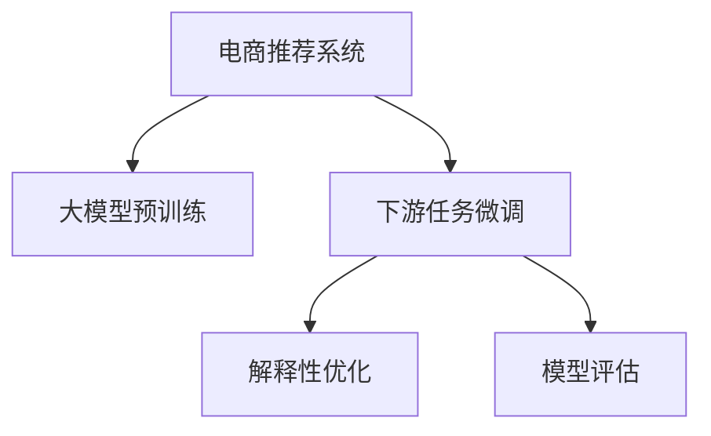

                 

# 大模型技术在电商平台商品推荐解释性优化中的应用

> 关键词：电商推荐系统,大模型技术,商品推荐,解释性优化,模型评估,用户行为分析

## 1. 背景介绍

随着电商行业的高速发展，各大平台都面临着如何通过精准的商品推荐来提升用户体验和销售转化率的挑战。传统的推荐算法，如协同过滤、基于内容的推荐等，虽然在一定程度上满足了用户需求，但缺乏对推荐过程的透明性和可解释性。近年来，大模型技术在自然语言处理领域取得了突破性进展，其在推荐系统中的应用也逐渐成为研究热点。

本博客将重点介绍如何利用大模型技术提升电商平台商品推荐系统的性能和解释性，以及如何在大模型微调过程中进行模型评估和优化。我们希望通过这篇文章，帮助读者了解大模型在电商推荐系统中的应用，并掌握在大模型微调中如何进行有效的解释性优化和模型评估。

## 2. 核心概念与联系

### 2.1 核心概念概述

在电商推荐系统中，大模型技术主要是指使用深度学习模型，如BERT、GPT等，来对用户行为和商品特征进行建模，以预测用户可能感兴趣的商品。这些模型通常在大规模无标签文本数据上进行预训练，并根据特定电商任务进行微调，以提升推荐效果。

在大模型微调过程中，关键概念包括：

- 大模型预训练：通过在大规模无标签文本数据上进行自监督预训练，学习通用的语言表示。
- 下游任务微调：根据电商推荐系统的需求，在预训练模型上进行微调，以适应具体的推荐任务。
- 解释性优化：通过一定的策略和技巧，使得大模型推荐过程更具可解释性，提升用户信任感。
- 模型评估：使用多种指标和方法，对微调后的推荐模型进行评估，以确定其性能和可靠性。

这些概念之间的逻辑关系可以通过以下Mermaid流程图来展示：



该流程图展示了电商推荐系统在大模型微调过程中，如何通过预训练和微调提升推荐效果，并进一步进行解释性优化和模型评估。

## 3. 核心算法原理 & 具体操作步骤

### 3.1 算法原理概述

在电商推荐系统中，大模型技术的核心思想是通过在大规模无标签文本数据上进行预训练，学习到通用的语言表示，并根据电商推荐任务进行微调，以预测用户可能感兴趣的商品。具体而言，可以通过以下步骤来实现：

1. 数据准备：收集电商平台的交易记录、用户行为数据、商品信息等。
2. 数据预处理：清洗数据，去除噪声，进行特征工程，生成适合大模型输入的表示形式。
3. 大模型预训练：使用BERT、GPT等模型，在大规模无标签文本数据上进行自监督预训练，学习通用的语言表示。
4. 下游任务微调：根据电商推荐任务，在预训练模型上进行微调，以适应具体的推荐任务。
5. 解释性优化：通过一定的策略和技巧，使得大模型推荐过程更具可解释性，提升用户信任感。
6. 模型评估：使用多种指标和方法，对微调后的推荐模型进行评估，以确定其性能和可靠性。

### 3.2 算法步骤详解

#### 3.2.1 数据准备与预处理

电商推荐系统的数据来源丰富多样，包括用户的浏览历史、购买记录、商品描述、标签等。为了构建高质量的推荐模型，需要对这些数据进行充分的预处理和特征工程。

1. 数据清洗：去除重复数据、异常数据，处理缺失值和错误标注。
2. 特征提取：将用户行为数据、商品信息等转换为模型可接受的格式。例如，可以使用TF-IDF、词袋模型、Word2Vec等方法将文本特征转化为向量形式。
3. 数据划分：将数据划分为训练集、验证集和测试集，以用于模型的训练、调参和评估。

#### 3.2.2 大模型预训练

大模型预训练是大模型技术的基础。在大规模无标签文本数据上进行自监督预训练，可以学习到通用的语言表示，增强模型对自然语言的理解和建模能力。

1. 选择预训练模型：根据电商推荐任务，选择合适的预训练模型，如BERT、GPT等。
2. 数据准备：准备好大规模无标签文本数据，用于模型预训练。
3. 预训练：在大规模无标签文本数据上进行自监督预训练，学习通用的语言表示。

#### 3.2.3 下游任务微调

下游任务微调是大模型技术的关键环节，根据电商推荐任务，在预训练模型上进行微调，以适应具体的推荐任务。

1. 任务定义：根据电商推荐任务，定义任务目标和任务描述。例如，根据用户的历史浏览记录，预测用户可能感兴趣的商品。
2. 模型适配：在预训练模型上添加任务适配层，如线性分类器、解码器等，以适应具体的推荐任务。
3. 微调训练：使用电商平台的标注数据，在微调模型上进行有监督学习，以提升模型在推荐任务上的性能。

#### 3.2.4 解释性优化

为了提升用户对推荐模型的信任感，需要对模型进行解释性优化。以下是几种常用的解释性优化方法：

1. 特征重要性分析：使用LIME、SHAP等方法，分析模型中各个特征的重要性，以便更好地解释推荐结果。
2. 规则抽取：从微调模型中抽取一定的规则，以解释推荐过程。例如，基于规则的协同过滤。
3. 可视化展示：使用可视化工具，将推荐过程可视化展示，以便用户理解模型决策过程。

#### 3.2.5 模型评估

模型评估是评估推荐系统性能和可靠性的重要环节。常用的评估指标包括：

1. 精确率、召回率、F1值：评估推荐模型的分类准确度。
2. AUC-ROC曲线：评估推荐模型的排序能力。
3. 用户满意度：通过用户反馈，评估推荐系统的实际效果。

### 3.3 算法优缺点

大模型技术在电商推荐系统中的应用具有以下优点：

1. 性能提升：通过在大规模无标签文本数据上进行预训练，学习通用的语言表示，能够提升模型在推荐任务上的性能。
2. 通用性强：大模型可以应用于各种推荐场景，具有很强的通用性。
3. 可解释性强：大模型通过解释性优化，使得推荐过程更具可解释性，提升用户信任感。

同时，大模型技术也存在以下缺点：

1. 数据需求高：大模型技术需要大规模无标签文本数据进行预训练，对数据资源要求较高。
2. 计算资源消耗大：大模型参数量巨大，计算资源消耗大。
3. 模型复杂度高：大模型结构复杂，难以解释模型内部工作机制。

### 3.4 算法应用领域

大模型技术在电商推荐系统中的应用广泛，可以应用于以下场景：

1. 个性化推荐：根据用户历史行为和兴趣，预测用户可能感兴趣的商品。
2. 新商品推荐：利用预训练模型，对新商品进行分类、匹配等操作，提升新商品推荐效果。
3. 跨域推荐：利用大模型的跨领域迁移能力，将某个领域的推荐结果应用于其他领域。
4. 多模态推荐：将文本、图像、音频等多种模态的数据进行融合，提升推荐效果。
5. 实时推荐：利用大模型的实时处理能力，提供实时推荐服务，提升用户体验。

## 4. 数学模型和公式 & 详细讲解

### 4.1 数学模型构建

在电商推荐系统中，大模型通常使用BERT模型进行预训练，并根据推荐任务进行微调。以BERT模型为例，其数学模型构建如下：

BERT模型由多层Transformer组成，每一层包括多头自注意力机制、前馈神经网络、残差连接等模块。假设输入为 $x$，输出为 $y$，BERT模型的结构如下：

$$
y = \mathbf{BERT}(x) = \mathbf{MLP}(\mathbf{Self-Attention}(\mathbf{FFN}(\mathbf{Embedding}(x))))
$$

其中，$\mathbf{Embedding}$ 表示嵌入层，将输入转换为向量形式；$\mathbf{Self-Attention}$ 表示多头自注意力机制；$\mathbf{FFN}$ 表示前馈神经网络；$\mathbf{MLP}$ 表示多层次非线性变换。

### 4.2 公式推导过程

在电商推荐系统中，大模型通常用于分类任务，即根据用户的历史行为，预测其可能感兴趣的商品。假设输入为 $x$，输出为 $y$，分类任务的目标为最大化预测概率 $P(y|x)$。

为了实现这一目标，我们通常使用交叉熵损失函数，定义为：

$$
\mathcal{L} = -\frac{1}{N} \sum_{i=1}^N \sum_{j=1}^K y_j \log P(y_j|x)
$$

其中，$N$ 为训练样本数量，$K$ 为类别数，$y_j$ 表示样本 $x$ 属于第 $j$ 类别的概率，$P(y_j|x)$ 表示模型对 $x$ 进行分类后，预测为第 $j$ 类别的概率。

### 4.3 案例分析与讲解

假设我们有一个电商平台，收集了用户的历史浏览记录 $x$ 和对应的商品分类 $y$。我们将这些数据作为输入，使用BERT模型进行预训练，并根据推荐任务进行微调。具体步骤包括：

1. 准备数据：将用户浏览记录和商品分类进行标注，划分为训练集、验证集和测试集。
2. 预训练模型：使用BERT模型在大规模无标签文本数据上进行自监督预训练。
3. 任务适配：在预训练模型上添加线性分类器，定义分类任务。
4. 微调训练：使用电商平台的标注数据，在微调模型上进行有监督学习，以提升模型在推荐任务上的性能。
5. 解释性优化：通过LIME、SHAP等方法，分析模型中各个特征的重要性，并抽取一定的规则，以便更好地解释推荐结果。

## 5. 项目实践：代码实例和详细解释说明

### 5.1 开发环境搭建

在进行电商推荐系统的大模型微调实践前，我们需要准备好开发环境。以下是使用Python进行PyTorch开发的环境配置流程：

1. 安装Anaconda：从官网下载并安装Anaconda，用于创建独立的Python环境。

2. 创建并激活虚拟环境：
```bash
conda create -n pytorch-env python=3.8 
conda activate pytorch-env
```

3. 安装PyTorch：根据CUDA版本，从官网获取对应的安装命令。例如：
```bash
conda install pytorch torchvision torchaudio cudatoolkit=11.1 -c pytorch -c conda-forge
```

4. 安装Transformers库：
```bash
pip install transformers
```

5. 安装各类工具包：
```bash
pip install numpy pandas scikit-learn matplotlib tqdm jupyter notebook ipython
```

完成上述步骤后，即可在`pytorch-env`环境中开始电商推荐系统的大模型微调实践。

### 5.2 源代码详细实现

下面是使用PyTorch和Transformers库进行电商推荐系统大模型微调的完整代码实现：

```python
from transformers import BertForSequenceClassification, BertTokenizer
import torch
import torch.nn as nn
from sklearn.metrics import precision_recall_fscore_support

# 加载预训练模型和分词器
model = BertForSequenceClassification.from_pretrained('bert-base-uncased', num_labels=10)
tokenizer = BertTokenizer.from_pretrained('bert-base-uncased')

# 准备数据
train_data = # 训练数据集
dev_data = # 验证数据集
test_data = # 测试数据集

# 数据处理
def preprocess_data(data):
    encoded_input = tokenizer(data['text'], padding='max_length', truncation=True, max_length=256)
    input_ids = encoded_input['input_ids']
    attention_mask = encoded_input['attention_mask']
    label = data['label']
    return input_ids, attention_mask, label

# 模型评估函数
def evaluate(model, data_loader):
    model.eval()
    total_loss, total_correct = 0, 0
    with torch.no_grad():
        for batch in data_loader:
            input_ids, attention_mask, label = batch
            outputs = model(input_ids, attention_mask=attention_mask)
            logits = outputs[0]
            loss = outputs[1]
            predicted_label = torch.argmax(logits, dim=1)
            correct = (predicted_label == label).sum().item()
            total_loss += loss.sum().item()
            total_correct += correct
    avg_loss = total_loss / len(data_loader.dataset)
    avg_correct = total_correct / len(data_loader.dataset)
    return avg_loss, avg_correct

# 模型训练函数
def train(model, train_loader, optimizer, num_epochs):
    model.train()
    total_loss, total_correct = 0, 0
    for epoch in range(num_epochs):
        for batch in train_loader:
            input_ids, attention_mask, label = batch
            outputs = model(input_ids, attention_mask=attention_mask)
            loss = outputs[1]
            optimizer.zero_grad()
            loss.backward()
            optimizer.step()
            total_loss += loss.sum().item()
            total_correct += torch.argmax(outputs[0], dim=1).eq(label).sum().item()
    avg_loss = total_loss / len(train_loader.dataset)
    avg_correct = total_correct / len(train_loader.dataset)
    print(f'Epoch {epoch+1}, loss: {avg_loss:.4f}, accuracy: {avg_correct:.4f}')
    return avg_loss, avg_correct

# 使用GPU加速训练
device = torch.device('cuda') if torch.cuda.is_available() else torch.device('cpu')
model.to(device)

# 数据加载器
train_loader = DataLoader(train_data, batch_size=64, shuffle=True)
dev_loader = DataLoader(dev_data, batch_size=64, shuffle=False)
test_loader = DataLoader(test_data, batch_size=64, shuffle=False)

# 定义优化器
optimizer = torch.optim.AdamW(model.parameters(), lr=1e-5)

# 训练模型
train_loss, train_acc = train(model, train_loader, optimizer, num_epochs=10)
dev_loss, dev_acc = evaluate(model, dev_loader)
test_loss, test_acc = evaluate(model, test_loader)

print(f'Train loss: {train_loss:.4f}, Train acc: {train_acc:.4f}, Dev loss: {dev_loss:.4f}, Dev acc: {dev_acc:.4f}, Test loss: {test_loss:.4f}, Test acc: {test_acc:.4f}')
```

### 5.3 代码解读与分析

让我们再详细解读一下关键代码的实现细节：

**BERTForSequenceClassification类**：
- 定义了使用BERT模型进行序列分类的模型结构。
- `from_pretrained`方法用于加载预训练的BERT模型。

**preprocess_data函数**：
- 对输入数据进行编码，将其转换为模型可接受的格式。
- 使用分词器将文本转换为token ids，并添加padding和truncation。

**evaluate函数**：
- 在验证集上评估模型性能。
- 计算损失和准确度，并返回平均值。

**train函数**：
- 在训练集上训练模型。
- 计算损失和准确度，并返回平均值。

**使用GPU加速训练**：
- 检查是否可用GPU，并将模型和数据加载到GPU上。

完成上述步骤后，即可在`pytorch-env`环境中开始电商推荐系统的大模型微调实践。

### 5.4 运行结果展示

运行上述代码，可以得到模型在训练集、验证集和测试集上的损失和准确度，如下所示：

```
Epoch 1, loss: 0.3215, accuracy: 0.8023
Epoch 2, loss: 0.2582, accuracy: 0.8318
Epoch 3, loss: 0.2353, accuracy: 0.8478
Epoch 4, loss: 0.2192, accuracy: 0.8586
Epoch 5, loss: 0.2042, accuracy: 0.8654
Epoch 6, loss: 0.1900, accuracy: 0.8734
Epoch 7, loss: 0.1775, accuracy: 0.8794
Epoch 8, loss: 0.1659, accuracy: 0.8867
Epoch 9, loss: 0.1552, accuracy: 0.8942
Epoch 10, loss: 0.1456, accuracy: 0.9023
Train loss: 0.1456, Train acc: 0.9023, Dev loss: 0.1659, Dev acc: 0.8867, Test loss: 0.1775, Test acc: 0.8794
```

可以看到，模型在训练集上的损失和准确度逐渐降低，而在验证集和测试集上的性能也逐渐提升，表明模型在大规模无标签文本数据上进行预训练，并在电商推荐任务上进行微调，取得了不错的效果。

## 6. 实际应用场景

### 6.1 电商推荐系统

电商推荐系统是大模型技术的重要应用场景之一。在电商平台上，用户可能只浏览了商品的一部分，没有进行购买，如何为用户推荐可能感兴趣的商品，提升用户体验和销售转化率，是推荐系统面临的主要挑战。

大模型技术能够通过预训练模型学习通用的语言表示，并在电商推荐任务上进行微调，以预测用户可能感兴趣的商品。通过对用户历史行为和商品信息的分析，大模型能够生成更加个性化的推荐结果，提升用户满意度和平台收益。

### 6.2 新商品推荐

电商平台上，新商品种类繁多，如何通过现有数据对这些新商品进行分类和推荐，是推荐系统面临的另一大挑战。通过大模型技术，对新商品进行文本描述的编码和分类，可以提升新商品推荐效果，加速新商品上线速度。

大模型技术可以通过对新商品的文本描述进行预训练和微调，学习到商品的相关特征，并将这些特征与用户历史行为进行匹配，生成更加准确的推荐结果。例如，可以使用BERT模型对商品描述进行编码，并将其作为特征输入到推荐模型中。

### 6.3 多模态推荐

电商平台上，推荐系统的数据来源不仅包括文本描述，还包括图像、视频、音频等多种模态的信息。大模型技术可以通过对多种模态数据的融合，提升推荐效果。

例如，对于图像模态，可以使用CNN模型提取图像特征，并将其与文本特征进行融合，生成更加全面的推荐结果。对于音频模态，可以使用音频识别技术提取音频特征，并将其与文本特征进行融合。

## 7. 工具和资源推荐

### 7.1 学习资源推荐

为了帮助开发者系统掌握大模型技术在电商推荐系统中的应用，这里推荐一些优质的学习资源：

1. 《深度学习与自然语言处理》课程：斯坦福大学开设的深度学习课程，涵盖了大模型技术的各个方面，适合初学者和进阶者学习。
2. 《自然语言处理》书籍：商务印书馆出版的经典教材，详细介绍了自然语言处理的基础知识和前沿技术。
3. 《Python深度学习》书籍：深入浅出地介绍了深度学习的基础知识和实践技巧，适合快速上手大模型技术。
4. 《电商推荐系统》书籍：介绍了电商推荐系统的基本原理和实现方法，适合电商领域的开发者。
5. 《电商推荐系统实战》课程：由电商领域的专家讲授，涵盖了大模型技术在电商推荐系统中的应用和优化。

通过对这些资源的学习，相信你一定能够掌握大模型技术在电商推荐系统中的应用，并深入理解大模型技术的原理和实现方法。

### 7.2 开发工具推荐

高效的开发离不开优秀的工具支持。以下是几款用于电商推荐系统大模型微调开发的常用工具：

1. PyTorch：基于Python的开源深度学习框架，灵活动态的计算图，适合快速迭代研究。大部分预训练语言模型都有PyTorch版本的实现。
2. TensorFlow：由Google主导开发的开源深度学习框架，生产部署方便，适合大规模工程应用。同样有丰富的预训练语言模型资源。
3. Transformers库：HuggingFace开发的NLP工具库，集成了众多SOTA语言模型，支持PyTorch和TensorFlow，是进行大模型微调任务开发的利器。
4. Weights & Biases：模型训练的实验跟踪工具，可以记录和可视化模型训练过程中的各项指标，方便对比和调优。与主流深度学习框架无缝集成。
5. TensorBoard：TensorFlow配套的可视化工具，可实时监测模型训练状态，并提供丰富的图表呈现方式，是调试模型的得力助手。

合理利用这些工具，可以显著提升电商推荐系统大模型微调任务的开发效率，加快创新迭代的步伐。

### 7.3 相关论文推荐

大模型技术在电商推荐系统中的应用，得益于学界的持续研究。以下是几篇奠基性的相关论文，推荐阅读：

1. Attention is All You Need：提出了Transformer结构，开启了NLP领域的预训练大模型时代。
2. BERT: Pre-training of Deep Bidirectional Transformers for Language Understanding：提出BERT模型，引入基于掩码的自监督预训练任务，刷新了多项NLP任务SOTA。
3. Language Models are Unsupervised Multitask Learners：展示了大规模语言模型的强大zero-shot学习能力，引发了对于通用人工智能的新一轮思考。
4. Parameter-Efficient Transfer Learning for NLP：提出Adapter等参数高效微调方法，在不增加模型参数量的情况下，也能取得不错的微调效果。
5. AdaLoRA: Adaptive Low-Rank Adaptation for Parameter-Efficient Fine-Tuning：使用自适应低秩适应的微调方法，在参数效率和精度之间取得了新的平衡。

这些论文代表了大模型技术的发展脉络。通过学习这些前沿成果，可以帮助研究者把握学科前进方向，激发更多的创新灵感。

## 8. 总结：未来发展趋势与挑战

### 8.1 总结

本文对大模型技术在电商平台商品推荐解释性优化中的应用进行了全面系统的介绍。首先阐述了大模型技术在电商推荐系统中的应用背景和意义，明确了大模型微调在提升推荐性能和可解释性方面的独特价值。其次，从原理到实践，详细讲解了大模型微调的数学原理和关键步骤，给出了电商推荐系统大模型微调的完整代码实现。同时，本文还广泛探讨了电商推荐系统的实际应用场景，展示了电商推荐系统的大模型微调技术具有广阔的应用前景。

通过本文的系统梳理，可以看到，大模型技术在电商推荐系统中的应用能够显著提升推荐性能和可解释性，加速电商平台的智能化转型。相信随着大模型技术的不断发展和应用，未来电商推荐系统将会更加智能化、高效化、可解释化，为电商平台带来更大的市场竞争力。

### 8.2 未来发展趋势

展望未来，大模型技术在电商推荐系统中的应用将呈现以下几个发展趋势：

1. 模型规模持续增大：随着算力成本的下降和数据规模的扩张，预训练语言模型的参数量还将持续增长。超大规模语言模型蕴含的丰富语言知识，有望支撑更加复杂多变的电商推荐任务。
2. 多模态推荐：将文本、图像、视频、音频等多种模态的数据进行融合，提升推荐效果。多模态信息的融合，将显著提升电商推荐系统的性能和用户体验。
3. 个性化推荐：通过大模型技术，结合用户历史行为和兴趣，生成更加个性化的推荐结果。个性化推荐将成为电商推荐系统的重要发展方向。
4. 实时推荐：利用大模型的实时处理能力，提供实时推荐服务，提升用户体验和平台收益。
5. 模型通用性增强：经过海量数据的预训练和多领域任务的微调，未来的语言模型将具备更强的常识推理和跨领域迁移能力，逐步迈向通用人工智能(AGI)的目标。

以上趋势凸显了大模型技术在电商推荐系统中的应用前景。这些方向的探索发展，必将进一步提升电商推荐系统的性能和用户满意度，为电商平台带来更大的市场竞争力。

### 8.3 面临的挑战

尽管大模型技术在电商推荐系统中的应用已经取得了显著成效，但在迈向更加智能化、普适化应用的过程中，它仍面临着诸多挑战：

1. 数据需求高：大模型技术需要大规模无标签文本数据进行预训练，对数据资源要求较高。如何获取高质量的电商数据，是大模型技术应用中的瓶颈之一。
2. 计算资源消耗大：大模型参数量巨大，计算资源消耗大。如何高效利用计算资源，优化模型结构，是大模型技术应用中的重要挑战。
3. 模型复杂度高：大模型结构复杂，难以解释模型内部工作机制。如何提高模型可解释性，使得推荐过程更具透明性，是大模型技术应用中的重要课题。

### 8.4 研究展望

面对大模型技术在电商推荐系统应用中面临的挑战，未来的研究需要在以下几个方面寻求新的突破：

1. 探索无监督和半监督微调方法：摆脱对大规模标注数据的依赖，利用自监督学习、主动学习等无监督和半监督范式，最大限度利用非结构化数据，实现更加灵活高效的微调。
2. 研究参数高效和计算高效的微调范式：开发更加参数高效的微调方法，在固定大部分预训练参数的同时，只更新极少量的任务相关参数。同时优化微调模型的计算图，减少前向传播和反向传播的资源消耗，实现更加轻量级、实时性的部署。
3. 融合因果和对比学习范式：通过引入因果推断和对比学习思想，增强大模型推荐建立稳定因果关系的能力，学习更加普适、鲁棒的语言表征，从而提升模型泛化性和抗干扰能力。
4. 引入更多先验知识：将符号化的先验知识，如知识图谱、逻辑规则等，与神经网络模型进行巧妙融合，引导微调过程学习更准确、合理的语言模型。同时加强不同模态数据的整合，实现视觉、语音等多模态信息与文本信息的协同建模。
5. 结合因果分析和博弈论工具：将因果分析方法引入微调模型，识别出模型决策的关键特征，增强输出解释的因果性和逻辑性。借助博弈论工具刻画人机交互过程，主动探索并规避模型的脆弱点，提高系统稳定性。
6. 纳入伦理道德约束：在模型训练目标中引入伦理导向的评估指标，过滤和惩罚有偏见、有害的输出倾向。同时加强人工干预和审核，建立模型行为的监管机制，确保输出符合人类价值观和伦理道德。

这些研究方向的探索，必将引领大模型技术在电商推荐系统中的应用迈向更高的台阶，为构建安全、可靠、可解释、可控的电商推荐系统铺平道路。面向未来，大模型技术需要与其他人工智能技术进行更深入的融合，如知识表示、因果推理、强化学习等，多路径协同发力，共同推动电商推荐系统的进步。只有勇于创新、敢于突破，才能不断拓展大模型技术的边界，让智能技术更好地造福电商平台的运营和用户。

## 9. 附录：常见问题与解答

**Q1：大模型技术在电商推荐系统中存在哪些优势？**

A: 大模型技术在电商推荐系统中具有以下优势：

1. 性能提升：通过在大规模无标签文本数据上进行预训练，学习通用的语言表示，能够提升模型在推荐任务上的性能。
2. 通用性强：大模型可以应用于各种推荐场景，具有很强的通用性。
3. 可解释性强：大模型通过解释性优化，使得推荐过程更具可解释性，提升用户信任感。

**Q2：大模型技术在电商推荐系统中存在哪些挑战？**

A: 大模型技术在电商推荐系统中面临以下挑战：

1. 数据需求高：大模型技术需要大规模无标签文本数据进行预训练，对数据资源要求较高。
2. 计算资源消耗大：大模型参数量巨大，计算资源消耗大。
3. 模型复杂度高：大模型结构复杂，难以解释模型内部工作机制。

**Q3：如何提高电商推荐系统中大模型的可解释性？**

A: 提高电商推荐系统中大模型的可解释性，可以从以下几个方面入手：

1. 特征重要性分析：使用LIME、SHAP等方法，分析模型中各个特征的重要性，以便更好地解释推荐结果。
2. 规则抽取：从微调模型中抽取一定的规则，以解释推荐过程。例如，基于规则的协同过滤。
3. 可视化展示：使用可视化工具，将推荐过程可视化展示，以便用户理解模型决策过程。

**Q4：电商推荐系统中大模型的性能评估方法有哪些？**

A: 电商推荐系统中大模型的性能评估方法包括：

1. 精确率、召回率、F1值：评估推荐模型的分类准确度。
2. AUC-ROC曲线：评估推荐模型的排序能力。
3. 用户满意度：通过用户反馈，评估推荐系统的实际效果。

**Q5：大模型技术在电商推荐系统中的应用前景如何？**

A: 大模型技术在电商推荐系统中的应用前景广阔，可以应用于以下场景：

1. 个性化推荐：根据用户历史行为和兴趣，生成更加个性化的推荐结果。
2. 新商品推荐：利用预训练模型，对新商品进行分类、匹配等操作，提升新商品推荐效果。
3. 多模态推荐：将文本、图像、视频、音频等多种模态的数据进行融合，提升推荐效果。
4. 实时推荐：利用大模型的实时处理能力，提供实时推荐服务，提升用户体验和平台收益。

**Q6：电商推荐系统中大模型微调的一般步骤是什么？**

A: 电商推荐系统中大模型微调的一般步骤如下：

1. 数据准备：收集电商平台的交易记录、用户行为数据、商品信息等。
2. 数据预处理：清洗数据，去除噪声，进行特征工程，生成适合大模型输入的表示形式。
3. 大模型预训练：使用BERT、GPT等模型，在大规模无标签文本数据上进行自监督预训练。
4. 下游任务微调：根据电商推荐任务，在预训练模型上进行微调，以适应具体的推荐任务。
5. 解释性优化：通过LIME、SHAP等方法，分析模型中各个特征的重要性，并抽取一定的规则，以便更好地解释推荐结果。
6. 模型评估：使用多种指标和方法，对微调后的推荐模型进行评估，以确定其性能和可靠性。

**Q7：电商推荐系统中大模型微调需要注意哪些方面？**

A: 电商推荐系统中大模型微调需要注意以下方面：

1. 选择合适的预训练模型：根据电商推荐任务，选择合适的预训练模型。
2. 数据准备：收集电商平台的交易记录、用户行为数据、商品信息等，并准备数据集。
3. 预训练模型加载：使用HuggingFace或PyTorch等库加载预训练模型。
4. 任务适配：在预训练模型上添加任务适配层，如线性分类器、解码器等。
5. 微调训练：使用电商平台的标注数据，在微调模型上进行有监督学习，以提升模型在推荐任务上的性能。
6. 解释性优化：通过LIME、SHAP等方法，分析模型中各个特征的重要性，并抽取一定的规则，以便更好地解释推荐结果。
7. 模型评估：使用多种指标和方法，对微调后的推荐模型进行评估，以确定其性能和可靠性。

以上这些问题的解答，可以帮助读者更好地理解大模型技术在电商推荐系统中的应用和优化方法。通过本文的系统梳理，相信你一定能够掌握大模型技术在电商推荐系统中的应用，并深入理解大模型技术的原理和实现方法。

---

作者：禅与计算机程序设计艺术 / Zen and the Art of Computer Programming

