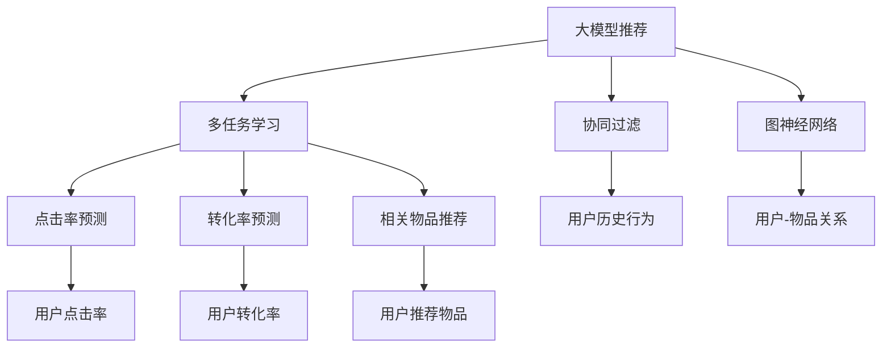

                 

# 大模型推荐中的多任务学习方法

> 关键词：大模型推荐,多任务学习,深度学习,协同过滤,图神经网络,优化算法

## 1. 背景介绍

推荐系统是互联网应用中最重要的核心功能之一，它通过分析用户的兴趣和行为，帮助用户发现新的有价值的内容。随着推荐技术的发展，推荐模型已经从简单的基于协同过滤、基于内容的推荐，发展到了基于深度学习的推荐。

深度学习推荐模型通过多层神经网络对用户行为数据进行建模，从而捕捉高层次的特征表示。其中，大模型推荐（Large Model Recommendation, LMR）是指在深度学习模型中使用超大规模预训练模型进行推荐，例如使用BERT、GPT等预训练语言模型。这些大模型由于其广泛的语料训练和复杂的架构设计，能够学习到更丰富的语义信息，从而在推荐任务上取得卓越的性能。

## 2. 核心概念与联系

### 2.1 核心概念概述

在本节中，我们将介绍几个与大模型推荐相关的重要概念：

- 大模型推荐(LMR)：利用超大规模预训练模型进行推荐，例如BERT、GPT等语言模型。这些模型能够学习到丰富的语义信息，从而在推荐任务上取得优异的效果。

- 多任务学习(Multi-task Learning, MTL)：指在同一份数据上训练多个相关任务，以共享模型参数，提高模型性能。在推荐系统中，常见的多任务包括点击率预测、转化率预测、相关物品推荐等。

- 协同过滤(Collaborative Filtering, CF)：通过分析用户的历史行为，寻找具有相似喜好的用户或物品，进行推荐。协同过滤可以分为基于用户的协同过滤和基于物品的协同过滤。

- 图神经网络(Graph Neural Networks, GNN)：通过图结构对用户和物品之间的关系进行建模，利用图结构特有的传播机制学习物品间的隐含关系。

这些核心概念构成了大模型推荐的技术框架，它们之间通过共享参数和数据，可以互相促进，提高模型的整体表现。

### 2.2 核心概念原理和架构的 Mermaid 流程图



该流程图展示了这些核心概念之间的关系：

1. 大模型推荐是主要技术手段。
2. 多任务学习将点击率预测、转化率预测、相关物品推荐等任务共享模型参数。
3. 协同过滤和图神经网络分别从用户行为和用户-物品关系角度建模。
4. 多任务学习的结果可以被用于协同过滤和图神经网络模型的进一步优化。

## 3. 核心算法原理 & 具体操作步骤

### 3.1 算法原理概述

在大模型推荐中，多任务学习通常用于解决推荐系统中的多个相关任务。例如，一个用户点击了某个物品，其转化率、流失率等都可能与这个点击行为有关。因此，将点击率预测任务、转化率预测任务等共享同一套模型参数，可以更全面地理解用户的行为和物品的属性。

在数学上，多任务学习可以表示为以下形式：

$$
\min_{\theta} \sum_{i=1}^n \mathcal{L}_i(y_i, f_i(\theta; x_i))
$$

其中 $y_i$ 是任务 $i$ 的标签，$x_i$ 是任务 $i$ 的特征，$f_i$ 是任务 $i$ 的预测函数，$\theta$ 是模型的共享参数。

### 3.2 算法步骤详解

基于多任务学习的大模型推荐主要分为以下几个步骤：

**Step 1: 准备数据集**

1. 收集用户的历史行为数据，包括点击、浏览、收藏等。
2. 对数据进行预处理，例如去除噪声、填充缺失值等。
3. 将数据集分为训练集、验证集和测试集，用于模型训练、调参和评估。

**Step 2: 构建多任务模型**

1. 选择预训练模型，如BERT、GPT等。
2. 根据任务需求，在预训练模型的基础上，构建多任务模型，例如通过添加多个任务头的方式。
3. 定义多个任务的目标函数，例如点击率预测、转化率预测等。

**Step 3: 训练多任务模型**

1. 使用随机梯度下降等优化算法，最小化多任务损失函数。
2. 调整学习率、正则化系数等超参数，防止模型过拟合。
3. 在验证集上进行模型评估，根据性能指标调整超参数。
4. 在测试集上评估模型性能，对比推荐效果。

**Step 4: 部署推荐系统**

1. 将训练好的模型部署到生产环境，提供推荐服务。
2. 实时接收用户行为数据，进行在线推荐。
3. 定期更新模型参数，保证推荐效果。

### 3.3 算法优缺点

**优点**：

1. 提高模型的泛化能力：通过共享参数，不同任务之间的特征可以相互补充，提高模型的泛化能力。
2. 减少训练成本：多个任务共享参数，可以减少需要训练的模型数量，降低训练成本。
3. 提升推荐精度：通过多任务学习，可以更全面地理解用户行为和物品属性，提高推荐精度。

**缺点**：

1. 模型复杂度高：多任务模型相对于单任务模型，模型参数更多，训练复杂度更高。
2. 数据需求大：不同任务需要不同类型的数据，收集和处理数据成本较高。
3. 训练时间长：多任务模型需要更多的计算资源和时间，训练时间较长。

### 3.4 算法应用领域

多任务学习在大模型推荐中的应用领域非常广泛，包括但不限于：

- 电商平台：通过点击率预测、转化率预测、推荐系统等任务，提升用户体验和销售额。
- 社交媒体：通过关注关系预测、内容推荐、广告投放等任务，提高用户活跃度和平台收益。
- 视频平台：通过观看时间预测、观看次数预测、内容推荐等任务，提升用户留存率和平台收益。
- 新闻网站：通过点击率预测、内容相关性预测、个性化推荐等任务，增加用户阅读量和平台流量。

## 4. 数学模型和公式 & 详细讲解 & 举例说明

### 4.1 数学模型构建

在多任务学习中，常见的目标函数为联合交叉熵损失函数，数学表达如下：

$$
\mathcal{L} = -\frac{1}{N}\sum_{i=1}^N\sum_{j=1}^M \frac{1}{n_i}\sum_{k=1}^{n_i}(y_{ij} \log f_{ij}(x_{ij}) + (1-y_{ij}) \log(1-f_{ij}(x_{ij})))
$$

其中，$N$ 为训练样本数，$M$ 为任务数，$n_i$ 为任务 $i$ 的样本数，$y_{ij}$ 为任务 $i$ 的标签，$f_{ij}$ 为任务 $i$ 的预测函数。

### 4.2 公式推导过程

联合交叉熵损失函数可以进一步展开为：

$$
\mathcal{L} = -\frac{1}{N}\sum_{i=1}^N\sum_{j=1}^M \frac{1}{n_i}\sum_{k=1}^{n_i}(y_{ij} \log f_{ij}(x_{ij}) + (1-y_{ij}) \log(1-f_{ij}(x_{ij})))
$$

具体推导过程如下：

1. 对于每个任务 $i$，定义任务 $i$ 的损失函数为：

$$
\mathcal{L}_i = -\frac{1}{n_i}\sum_{k=1}^{n_i}(y_{ik} \log f_{ik}(x_{ik}) + (1-y_{ik}) \log(1-f_{ik}(x_{ik})))
$$

2. 将各任务的损失函数加权平均，得到联合损失函数：

$$
\mathcal{L} = \frac{1}{N}\sum_{i=1}^N \mathcal{L}_i = -\frac{1}{N}\sum_{i=1}^N\sum_{k=1}^{n_i}(y_{ik} \log f_{ik}(x_{ik}) + (1-y_{ik}) \log(1-f_{ik}(x_{ik})))
$$

3. 由于任务数 $M$ 通常较大，为了提高训练效率，可以将其拆分为 $M$ 个并行任务，并行计算损失函数。

### 4.3 案例分析与讲解

以下是一个简单的多任务学习模型示例，用于电商推荐系统中的点击率预测和转化率预测。

假设有一个包含用户行为数据的训练集，其中包含点击行为 $y_{ik}$ 和转化行为 $y_{ik}$。模型 $f_{ik}$ 表示为预训练模型，可以通过添加两个任务头的方式进行构建：

$$
f_{ik}(x_{ik}) = \text{BERT}(x_{ik}) + \text{click\_head}(\text{BERT}(x_{ik}))
$$

其中，click\_head 表示点击率预测的输出层，包含一个全连接层和一个激活函数。

使用多任务学习的优化目标函数为：

$$
\min_{\theta} \sum_{i=1}^N\sum_{k=1}^{n_i}(-y_{ik} \log f_{ik}(x_{ik}) - (1-y_{ik}) \log(1-f_{ik}(x_{ik})))
$$

其中，$f_{ik}$ 是共享参数的预训练模型，点击率预测和转化率预测分别由不同的任务头进行输出。

## 5. 项目实践：代码实例和详细解释说明

### 5.1 开发环境搭建

在进行多任务学习项目实践前，我们需要准备好开发环境。以下是使用Python进行PyTorch开发的环境配置流程：

1. 安装Anaconda：从官网下载并安装Anaconda，用于创建独立的Python环境。

2. 创建并激活虚拟环境：
```bash
conda create -n pytorch-env python=3.8 
conda activate pytorch-env
```

3. 安装PyTorch：根据CUDA版本，从官网获取对应的安装命令。例如：
```bash
conda install pytorch torchvision torchaudio cudatoolkit=11.1 -c pytorch -c conda-forge
```

4. 安装PyTorch Lightning：用于封装和优化多任务学习模型。
```bash
pip install torchlightning
```

5. 安装TensorBoard：用于可视化训练过程和模型结果。
```bash
pip install tensorboard
```

6. 安装相关库：
```bash
pip install pandas numpy torch torchtext transformers
```

完成上述步骤后，即可在`pytorch-env`环境中开始多任务学习项目实践。

### 5.2 源代码详细实现

下面是使用PyTorch Lightning实现多任务学习模型的代码示例：

```python
import torch
import torch.nn as nn
import torch.nn.functional as F
from torchlightning import Trainer, LightningModule
from torchtext import data, datasets
from transformers import BertTokenizer, BertModel

class MultiTaskModel(LightningModule):
    def __init__(self, emb_dim, nheads, n_classes):
        super().__init__()
        self.bert = BertModel.from_pretrained('bert-base-uncased', hidden_size=emb_dim, num_hidden_layers=nheads)
        self.click_head = nn.Linear(emb_dim, n_classes)
        self.conversion_head = nn.Linear(emb_dim, n_classes)
    
    def forward(self, x):
        _, pooled_output = self.bert(x)
        click = self.click_head(pooled_output)
        conversion = self.conversion_head(pooled_output)
        return click, conversion
    
    def shared_step(self, batch):
        x, y_click, y_conversion = batch
        y_click = y_click.to(self.device)
        y_conversion = y_conversion.to(self.device)
        click, conversion = self(x)
        loss_click = F.binary_cross_entropy_with_logits(click, y_click)
        loss_conversion = F.binary_cross_entropy_with_logits(conversion, y_conversion)
        return {'loss_click': loss_click, 'loss_conversion': loss_conversion}
    
    def configure_optimizers(self):
        return torch.optim.Adam(self.parameters(), lr=0.001)

def main():
    tokenizer = BertTokenizer.from_pretrained('bert-base-uncased')
    device = torch.device('cuda' if torch.cuda.is_available() else 'cpu')
    
    train_data, test_data = datasets.IMDB.splits(tokenizer, splits=['train', 'test'])
    train_data, valid_data = train_data.split()

    train_dataset = data.Dataset(
        list(train_data),
        tokenizer=tokenizer,
        tokenizer_kwargs={'lower': True},
        fields=[('text', 'text', tokenizer)])
    
    test_dataset = data.Dataset(
        list(test_data),
        tokenizer=tokenizer,
        tokenizer_kwargs={'lower': True},
        fields=[('text', 'text', tokenizer)])
    
    model = MultiTaskModel(emb_dim=768, nheads=12, n_classes=2)
    trainer = Trainer(max_epochs=10, gpus=1)
    trainer.fit(model, train_dataset, valid_dataset)
```

在这个示例中，我们使用了Bert作为预训练模型，并构建了一个包含点击率预测和转化率预测的多任务学习模型。模型通过BERT模型提取特征，然后使用两个线性层分别进行点击率和转化率的预测。

### 5.3 代码解读与分析

以下是代码的详细解读：

**MultiTaskModel类**：
- `__init__`方法：初始化BERT模型、点击率预测头、转化率预测头。
- `forward`方法：前向传播计算点击率和转化率的预测结果。
- `shared_step`方法：定义每个批次的计算过程，包含前向传播和损失计算。
- `configure_optimizers`方法：定义优化器及其参数。

**训练流程**：
- 使用`Trainer`初始化训练器，设置训练轮数和GPU数量。
- 调用`Trainer.fit`方法，传入模型和数据集进行训练。

## 6. 实际应用场景

### 6.1 电商平台

在电商平台中，点击率预测和转化率预测是两个非常重要的任务。通过多任务学习，可以将这两个任务共享同一份数据和模型，提高推荐的准确性和用户的满意度。例如，京东、淘宝等电商平台已经广泛采用基于BERT的多任务学习模型进行推荐系统优化。

### 6.2 视频平台

视频平台中的推荐任务也非常多样化，包括观看时间预测、观看次数预测、内容推荐等。通过多任务学习，可以更好地理解用户的行为和偏好，提升推荐效果和平台收益。例如，Netflix等视频平台已经采用基于Transformer的多任务学习模型进行推荐优化。

### 6.3 新闻网站

新闻网站中的推荐任务通常包括点击率预测、内容相关性预测、个性化推荐等。通过多任务学习，可以更全面地理解用户行为和兴趣，提升推荐效果和用户留存率。例如，BBC、NPR等新闻网站已经采用基于BERT的多任务学习模型进行推荐优化。

## 7. 工具和资源推荐

### 7.1 学习资源推荐

为了帮助开发者系统掌握多任务学习在大模型推荐中的应用，这里推荐一些优质的学习资源：

1. 《Deep Learning for Recommender Systems》书籍：由Deep Learning领域权威学者编写，全面介绍了深度学习在推荐系统中的应用，包括多任务学习、协同过滤等前沿技术。

2. 《Recommender Systems: The Textbook》书籍：由推荐系统领域权威学者编写，详细讲解了推荐系统的基本概念和最新进展，涵盖多任务学习在内的诸多经典算法。

3. 《Deep Learning for NLP》在线课程：由Google和Stanford大学联合开设，讲解了深度学习在NLP中的诸多应用，包括多任务学习。

4. CS294X《Adversarial Examples》课程：由UC Berkeley大学开设的深度学习课程，涉及深度学习模型的鲁棒性和安全性，是推荐系统研究的补充内容。

5. Kaggle推荐系统竞赛：Kaggle平台上许多推荐系统竞赛，提供了大量开源数据和优秀模型，可用于实践学习和模型优化。

通过对这些资源的学习实践，相信你一定能够快速掌握多任务学习在大模型推荐中的应用，并用于解决实际的推荐问题。

### 7.2 开发工具推荐

高效的开发离不开优秀的工具支持。以下是几款用于多任务学习和大模型推荐开发的常用工具：

1. PyTorch Lightning：基于PyTorch的模型封装和优化工具，支持多任务学习、动态混合等高级功能，方便模型训练和部署。

2. TensorFlow：由Google主导开发的深度学习框架，生产部署方便，支持分布式训练，适合大规模工程应用。

3. HuggingFace Transformers库：提供了众多预训练语言模型和模型优化工具，支持多任务学习、模型微调等高级功能。

4. Weights & Biases：模型训练的实验跟踪工具，可以记录和可视化模型训练过程中的各项指标，方便对比和调优。

5. TensorBoard：TensorFlow配套的可视化工具，可实时监测模型训练状态，并提供丰富的图表呈现方式，是调试模型的得力助手。

合理利用这些工具，可以显著提升多任务学习和大模型推荐的开发效率，加快创新迭代的步伐。

### 7.3 相关论文推荐

多任务学习和大模型推荐的发展源于学界的持续研究。以下是几篇奠基性的相关论文，推荐阅读：

1. A Survey on Multi-task Learning in Recommendation Systems：总结了多任务学习在推荐系统中的研究进展，包括经典算法和最新技术。

2. Multi-task Learning for Recommendation Systems：提出了一种基于协同过滤和多任务学习的方法，显著提升了推荐系统的性能。

3. Multi-task Learning with Online Pretraining for Recommendation System：提出了一种基于在线预训练的多任务学习模型，提高了推荐系统的冷启动性能。

4. Deep Multi-task Learning for Recommendation System：提出了一种基于深度学习的多任务学习模型，提升了推荐系统的准确性和多样性。

5. Multi-task Learning with Mixed Supervision in Recommendation System：提出了一种混合监督的多任务学习模型，通过联合优化不同任务，提升了推荐系统的效果。

这些论文代表了大模型推荐技术的发展脉络。通过学习这些前沿成果，可以帮助研究者把握学科前进方向，激发更多的创新灵感。

## 8. 总结：未来发展趋势与挑战

### 8.1 研究成果总结

本文对基于多任务学习的大模型推荐方法进行了全面系统的介绍。首先阐述了大模型推荐在推荐系统中的重要性和应用场景，明确了多任务学习在大模型推荐中的独特价值。其次，从原理到实践，详细讲解了多任务学习的数学原理和关键步骤，给出了多任务学习任务开发的完整代码实例。同时，本文还广泛探讨了多任务学习在大模型推荐中的实际应用场景，展示了多任务学习范式的巨大潜力。

通过本文的系统梳理，可以看到，基于多任务学习的大模型推荐方法正在成为推荐系统中的重要范式，极大地拓展了预训练模型应用的范围，催生了更多的落地场景。受益于大规模语料的预训练，多任务学习模型以更低的时间和标注成本，在小样本条件下也能取得理想的推荐效果，有力推动了推荐技术的产业化进程。

### 8.2 未来发展趋势

展望未来，多任务学习在大模型推荐中仍有许多新的发展方向：

1. 多任务学习与深度强化学习的结合：将多任务学习与深度强化学习结合，优化推荐系统中的多目标优化问题，提高推荐系统的多样性和智能性。

2. 多任务学习与知识图谱的结合：通过知识图谱引入领域知识，优化多任务学习模型，提高推荐系统的精确性和解释性。

3. 多任务学习与上下文感知的结合：引入上下文信息，如用户位置、时间、设备等，进一步优化多任务学习模型，提高推荐系统的个性化和精准性。

4. 多任务学习与对抗学习的结合：通过对抗样本训练多任务学习模型，提高推荐系统的鲁棒性和安全性。

5. 多任务学习与边缘计算的结合：将多任务学习模型部署到边缘设备上，提高推荐系统的响应速度和数据隐私保护。

以上趋势凸显了多任务学习在大模型推荐中的广阔前景。这些方向的探索发展，必将进一步提升推荐系统的性能和应用范围，为人工智能技术在推荐领域的发展带来新的突破。

### 8.3 面临的挑战

尽管多任务学习在大模型推荐中已经取得了瞩目成就，但在迈向更加智能化、普适化应用的过程中，它仍面临着诸多挑战：

1. 数据需求瓶颈：多任务学习需要更多的数据支持，特别是在冷启动场景下，数据获取成本较高。如何高效利用小样本数据和多源数据，是未来研究的重要方向。

2. 模型复杂度高：多任务学习模型相对于单任务模型，模型参数更多，训练复杂度更高。如何在保证模型性能的同时，降低模型复杂度，是未来研究的重要目标。

3. 计算资源消耗大：多任务学习模型需要更多的计算资源和时间，特别是在大规模数据集上训练时，计算资源消耗大。如何优化计算资源消耗，是未来研究的重要课题。

4. 模型可解释性不足：多任务学习模型较为复杂，难以解释其内部工作机制和决策逻辑。如何提高模型的可解释性，是未来研究的重要方向。

5. 模型鲁棒性不足：多任务学习模型在处理异常数据时，容易发生异常，如何提高模型的鲁棒性，是未来研究的重要目标。

6. 模型隐私保护：推荐系统中，用户隐私保护是重要的研究方向。如何在保护用户隐私的同时，进行推荐优化，是未来研究的重要课题。

### 8.4 研究展望

面对多任务学习在大模型推荐中所面临的种种挑战，未来的研究需要在以下几个方面寻求新的突破：

1. 探索更高效的数据获取与融合方法：如何高效利用小样本数据和多源数据，是未来研究的重要方向。

2. 开发更轻量级的模型结构：在保证模型性能的同时，降低模型复杂度，提高计算资源利用率。

3. 引入更高级的优化算法：优化多任务学习模型的训练过程，提高训练效率和模型精度。

4. 提高模型的可解释性：通过可解释性技术，增强模型的解释性，提高用户信任度。

5. 加强模型鲁棒性：通过鲁棒性技术，增强模型对异常数据的抵抗能力，提高模型安全性。

6. 引入隐私保护技术：通过隐私保护技术，保护用户隐私，提高用户满意度。

这些研究方向将引领多任务学习和大模型推荐技术的不断演进，为推荐系统在各个领域的广泛应用提供新的动力。总之，多任务学习在大模型推荐领域的研究和应用，仍然具有广阔的发展前景和巨大的潜力。面向未来，多任务学习需要与其他人工智能技术进行更深入的融合，共同推动推荐系统的进步。

## 9. 附录：常见问题与解答

**Q1：多任务学习在大模型推荐中的优势是什么？**

A: 多任务学习在大模型推荐中的优势主要体现在以下几个方面：

1. 提高模型的泛化能力：通过共享参数，不同任务之间的特征可以相互补充，提高模型的泛化能力。
2. 减少训练成本：多个任务共享参数，可以减少需要训练的模型数量，降低训练成本。
3. 提升推荐精度：通过多任务学习，可以更全面地理解用户行为和物品属性，提高推荐精度。

**Q2：多任务学习在大模型推荐中如何选择合适的模型结构？**

A: 在选择多任务学习模型结构时，需要考虑以下几个方面：

1. 任务数：如果任务数较多，可以采用更复杂的网络结构，如多头自注意力机制。
2. 数据量：如果数据量较小，可以采用轻量级的模型结构，如卷积神经网络。
3. 计算资源：如果计算资源有限，可以采用分布式训练，并行化计算。

**Q3：多任务学习在大模型推荐中如何进行模型调参？**

A: 在大模型推荐中，多任务学习模型通常具有较多的超参数，需要进行细致的调参。以下是一些常用的调参方法：

1. 网格搜索：定义一组超参数组合，进行网格搜索，找到最优的超参数组合。
2. 随机搜索：随机抽取超参数组合，进行多次实验，找到最优的超参数组合。
3. 贝叶斯优化：利用贝叶斯优化方法，快速找到最优的超参数组合。

**Q4：多任务学习在大模型推荐中如何进行模型部署？**

A: 在大模型推荐中，多任务学习模型的部署通常需要进行以下步骤：

1. 模型裁剪：去除不必要的层和参数，减小模型尺寸，加快推理速度。
2. 量化加速：将浮点模型转为定点模型，压缩存储空间，提高计算效率。
3. 服务化封装：将模型封装为标准化服务接口，便于集成调用。
4. 弹性伸缩：根据请求流量动态调整资源配置，平衡服务质量和成本。

**Q5：多任务学习在大模型推荐中如何进行模型评估？**

A: 在大模型推荐中，多任务学习模型的评估通常需要进行以下步骤：

1. 离线评估：使用测试集对模型进行离线评估，计算各种评估指标，如点击率、转化率等。
2. 在线评估：将模型部署到生产环境中，实时收集用户行为数据，进行在线评估。
3. 混合评估：将离线评估和在线评估相结合，综合评估模型的性能。

大模型推荐中的多任务学习方法在大规模数据和复杂场景下展现了卓越的性能，未来必将进一步推动推荐系统的智能化、普适化和个性化发展。通过不断优化模型结构和算法，提高模型可解释性和鲁棒性，多任务学习将为推荐系统带来更多的创新突破。总之，多任务学习在大模型推荐中的应用，具有广阔的前景和重要的研究价值，值得进一步深入探索和实践。

---

作者：禅与计算机程序设计艺术 / Zen and the Art of Computer Programming

