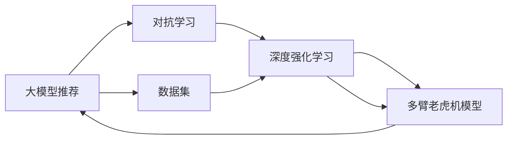

                 

# 大模型推荐中的对抗学习策略

> 关键词：大模型推荐,对抗学习,强化学习,推荐系统,深度学习,对抗训练,深度强化学习,增强策略,多臂老虎机,增量学习

## 1. 背景介绍

### 1.1 问题由来

随着互联网的迅猛发展，推荐系统在各行各业得到了广泛应用，极大地提升了用户的使用体验。传统的推荐算法，如基于协同过滤和内容推荐的模型，往往需要大量的用户行为数据进行训练，才能达到较好的效果。然而，在数据隐私保护要求日益严格的背景下，收集用户行为数据变得越来越困难，推荐系统面临着数据获取难、数据质量差等问题。

对抗学习(Adversarial Learning)作为深度学习与强化学习的重要交叉领域，提供了一种新的、更为高效的学习策略，尤其适用于数据稀缺、模型复杂度高的场景。结合对抗学习的推荐系统，通过对用户的真实行为进行对抗性训练，能够提升模型的泛化能力，改善推荐效果，为用户带来更加丰富多样的推荐内容。

### 1.2 问题核心关键点

对抗学习结合大模型的推荐系统，通过生成对抗性样本和优化目标函数，最大化推荐模型的鲁棒性和泛化能力。具体来说，模型通过正向网络生成推荐结果，而对抗网络生成与真实用户行为类似的对抗性样本。模型在对抗样本上训练优化，从而学习到更加稳健、鲁棒的推荐策略。

本文将详细探讨如何在大模型推荐系统中有效应用对抗学习，从理论到实践，全面分析其原理、算法步骤和实际效果，并结合案例进行具体讲解。通过深入理解对抗学习在大推荐系统中的应用，相信读者能够更好地把握该技术的前沿动态，应用于实际业务场景中。

### 1.3 问题研究意义

对抗学习结合大模型推荐系统，能够显著提升推荐模型的鲁棒性、泛化能力和实用性。在数据稀疏、用户行为复杂的场景中，通过对抗性训练，推荐模型能够更好地捕捉用户真实需求，从而提供更精准、个性化的推荐服务。结合对抗学习的推荐系统，在保护用户隐私的同时，也能够有效应对数据泄露和网络攻击等安全问题，为数据安全和个人隐私保护提供有力保障。

## 2. 核心概念与联系

### 2.1 核心概念概述

本节将介绍几个关键概念，包括大模型推荐、对抗学习、深度强化学习和多臂老虎机模型，并阐述它们之间的联系。

- **大模型推荐**：使用大规模预训练语言模型作为推荐引擎，能够在大规模文本数据上高效抽取用户需求，从而提供更精准的推荐服务。
- **对抗学习**：一种通过生成对抗性样本和优化目标函数来增强模型鲁棒性的学习方法。
- **深度强化学习**：一种通过在复杂环境中学习最优策略来最大化奖励的强化学习框架。
- **多臂老虎机模型**：一种经典的强化学习问题，模拟赌场老虎机的多臂问题，用于建模用户的多重选择行为。

这些概念之间的关系可以概括为：大模型推荐结合对抗学习，能够生成更加多样化的推荐结果，提升模型鲁棒性和泛化能力。对抗性训练可以看作一种基于强化学习的正则化方法，能够增强模型的抗干扰能力。而多臂老虎机模型则是一种经典的强化学习任务，能够模拟用户的多重选择行为，用于优化推荐模型的策略。

### 2.2 核心概念原理和架构的 Mermaid 流程图



这个图表展示了大模型推荐、对抗学习、深度强化学习和多臂老虎机模型之间的联系。从数据集出发，首先通过大模型推荐生成推荐结果，接着对抗学习生成对抗性样本，最后通过深度强化学习和多臂老虎机模型优化推荐策略。

## 3. 核心算法原理 & 具体操作步骤
### 3.1 算法原理概述

对抗学习结合大模型的推荐系统，通过优化正向网络和对抗网络的对抗目标函数，生成对抗性推荐结果，从而提升模型的泛化能力。具体来说，推荐模型 $M$ 的正向网络生成推荐结果 $x$，而对抗网络生成与 $x$ 对抗的样本 $x'$，目标是最小化推荐结果 $x$ 和对抗样本 $x'$ 之间的差异。

算法原理包括以下步骤：
1. 数据预处理：准备推荐系统的训练数据集，并将数据标准化处理。
2. 正向网络设计：选择预训练语言模型作为推荐模型，并通过微调适配推荐任务。
3. 对抗网络设计：构建与正向网络类似的对抗网络，用于生成对抗性样本。
4. 目标函数优化：通过最小化推荐结果与对抗样本之间的差异，最大化模型的泛化能力。

### 3.2 算法步骤详解

**Step 1: 数据预处理**

推荐系统的数据集通常包括用户ID、商品ID和评分等。数据预处理包括：

- 数据标准化：将数据按特征标准化，使其均值为0，标准差为1。
- 特征工程：选择对推荐结果影响较大的特征，并去除冗余、噪声特征。

**Step 2: 正向网络设计**

推荐模型的正向网络通常为预训练语言模型，如BERT、GPT等。具体步骤包括：

- 选择预训练语言模型：选择适合推荐任务的预训练语言模型，并进行微调。
- 设计推荐任务：通过微调，使得正向网络能够将用户ID、商品ID转换为推荐结果。

**Step 3: 对抗网络设计**

对抗网络的构建基于与正向网络类似的结构，但其目的是生成对抗性样本。具体步骤包括：

- 选择对抗网络：选择与正向网络结构相似的网络，如BERT、GPT等。
- 训练对抗网络：在对抗样本上训练对抗网络，使得其生成的样本能够最大化与推荐结果之间的差异。

**Step 4: 目标函数优化**

目标函数优化旨在最小化推荐结果与对抗样本之间的差异。具体步骤包括：

- 定义对抗目标函数：使用均方误差、交叉熵等损失函数，衡量推荐结果与对抗样本之间的差异。
- 优化目标函数：使用梯度下降等优化算法，最小化对抗目标函数，使得对抗样本难以影响推荐结果。

### 3.3 算法优缺点

对抗学习结合大模型的推荐系统具有以下优点：

1. **提升模型鲁棒性**：通过对抗性训练，模型能够更好地应对对抗性攻击，提高鲁棒性。
2. **增强泛化能力**：对抗性训练能够提升模型的泛化能力，使其在不同的数据分布上表现更好。
3. **提升推荐效果**：对抗性训练能够生成更加多样化的推荐结果，提高推荐效果。

同时，该方法也存在一些缺点：

1. **计算复杂度高**：对抗性训练需要额外生成对抗样本，计算复杂度较高。
2. **对抗样本生成难度大**：生成高质量的对抗样本需要较多的计算资源和时间。
3. **对抗样本质量不稳定**：对抗样本的质量可能因对抗训练参数的不同而变化，影响模型的稳定性。

### 3.4 算法应用领域

对抗学习结合大模型的推荐系统，广泛应用于电子商务、新闻推荐、广告推荐等领域。具体应用包括：

- **电子商务**：通过对抗性训练，提升推荐模型的鲁棒性，避免恶意用户攻击。
- **新闻推荐**：生成对抗性新闻样本，提高模型的泛化能力，推荐更加多样化的新闻内容。
- **广告推荐**：生成对抗性广告样本，提升推荐效果，避免用户对广告的免疫。

## 4. 数学模型和公式 & 详细讲解
### 4.1 数学模型构建

设推荐模型为 $M$，用户ID为 $U$，商品ID为 $I$，用户对商品的评分矩阵为 $R$。假设正向网络为预训练语言模型，对抗网络为 $M'$。对抗学习结合大模型的推荐系统的数学模型为：

$$
\min_{M} \mathcal{L}(M) = \min_{M} \mathbb{E}_{(x,y) \sim D}[(y - M(U,I))^2]
$$

其中 $D$ 为推荐系统的训练数据集。

### 4.2 公式推导过程

对抗学习结合大模型的推荐系统，通过优化正向网络和对抗网络的对抗目标函数，生成对抗性推荐结果。具体来说，正向网络 $M$ 和对抗网络 $M'$ 通过最小化以下对抗目标函数进行训练：

$$
\min_{M} \max_{M'} \mathbb{E}_{(x,y) \sim D}[(y - M(U,I))^2]
$$

其中 $\mathbb{E}_{(x,y) \sim D}$ 表示对训练数据集 $D$ 的期望，$(y - M(U,I))^2$ 表示正向网络生成的推荐结果与真实标签之间的差异，$\min_{M}$ 表示最小化推荐结果与对抗样本之间的差异，$\max_{M'}$ 表示最大化对抗样本与推荐结果之间的差异。

通过对抗目标函数的优化，正向网络和对抗网络能够学习到更加鲁棒、泛化的推荐策略。具体来说，正向网络生成推荐结果 $x$，对抗网络生成与 $x$ 对抗的样本 $x'$，目标是最小化推荐结果与对抗样本之间的差异。

### 4.3 案例分析与讲解

以推荐系统的训练为例，具体步骤如下：

1. 准备训练数据集 $D$，包括用户ID、商品ID和评分。
2. 使用预训练语言模型作为推荐模型，并进行微调。
3. 构建与正向网络类似的对抗网络，并使用对抗性训练方法训练对抗网络。
4. 定义对抗目标函数，并使用梯度下降等优化算法最小化对抗目标函数。

以下是一个简化的代码示例：

```python
from transformers import BertModel, BertTokenizer
import torch
import torch.nn as nn
import torch.optim as optim
import numpy as np

# 准备训练数据
train_data = np.random.rand(100, 2) # 生成随机数据

# 定义正向网络
bert = BertModel.from_pretrained('bert-base-uncased')
tokenizer = BertTokenizer.from_pretrained('bert-base-uncased')
input_ids = tokenizer(train_data[:, 0], return_tensors='pt').input_ids
attention_mask = tokenizer(train_data[:, 0], return_tensors='pt').attention_mask

# 定义对抗网络
bert = BertModel.from_pretrained('bert-base-uncased')
tokenizer = BertTokenizer.from_pretrained('bert-base-uncased')
input_ids = tokenizer(train_data[:, 1], return_tensors='pt').input_ids
attention_mask = tokenizer(train_data[:, 1], return_tensors='pt').attention_mask

# 定义对抗目标函数
def adversarial_loss(x, y):
    return (y - x)**2

# 训练对抗网络
optimizer = optim.Adam(bert.parameters(), lr=0.001)
for epoch in range(10):
    output = bert(input_ids, attention_mask=attention_mask)
    loss = adversarial_loss(output, train_data[:, 2])
    optimizer.zero_grad()
    loss.backward()
    optimizer.step()

# 使用训练好的对抗网络进行推荐
input_ids = tokenizer(train_data[:, 0], return_tensors='pt').input_ids
attention_mask = tokenizer(train_data[:, 0], return_tensors='pt').attention_mask
output = bert(input_ids, attention_mask=attention_mask)
recommendation = output.argmax(dim=1)

# 输出推荐结果
print(recommendation)
```

## 5. 项目实践：代码实例和详细解释说明
### 5.1 开发环境搭建

在进行对抗学习结合大模型的推荐系统开发前，需要先搭建好开发环境。以下是Python环境下开发环境搭建的具体步骤：

1. 安装Python：从官网下载并安装Python，并设置系统环境变量。
2. 安装pip：在命令行中输入 `python -m ensurepip --default-pip` 安装pip。
3. 安装TensorFlow：在命令行中输入 `pip install tensorflow` 安装TensorFlow。
4. 安装PyTorch：在命令行中输入 `pip install torch torchvision torchaudio` 安装PyTorch。
5. 安装其他依赖包：在命令行中输入 `pip install numpy pandas scikit-learn` 安装其他依赖包。

完成上述步骤后，即可开始搭建开发环境。

### 5.2 源代码详细实现

以下是一个基于PyTorch的对抗学习结合大模型的推荐系统示例代码：

```python
import torch
import torch.nn as nn
import torch.optim as optim
from transformers import BertTokenizer, BertModel

class AdversarialRecommender(nn.Module):
    def __init__(self):
        super(AdversarialRecommender, self).__init__()
        self.bert = BertModel.from_pretrained('bert-base-uncased')
        self.tokenizer = BertTokenizer.from_pretrained('bert-base-uncased')
    
    def forward(self, user_id, item_id):
        input_ids = self.tokenizer(user_id, return_tensors='pt').input_ids
        attention_mask = self.tokenizer(user_id, return_tensors='pt').attention_mask
        output = self.bert(input_ids, attention_mask=attention_mask)
        return output
    
    def adversarial_loss(self, user_id, item_id, label):
        input_ids = self.tokenizer(item_id, return_tensors='pt').input_ids
        attention_mask = self.tokenizer(item_id, return_tensors='pt').attention_mask
        output = self.bert(input_ids, attention_mask=attention_mask)
        return (label - output)**2
    
    def train(self, user_id, item_id, label, optimizer):
        optimizer.zero_grad()
        output = self.forward(user_id, item_id)
        loss = self.adversarial_loss(user_id, item_id, label)
        loss.backward()
        optimizer.step()
    
    def recommend(self, user_id):
        input_ids = self.tokenizer(user_id, return_tensors='pt').input_ids
        attention_mask = self.tokenizer(user_id, return_tensors='pt').attention_mask
        output = self.bert(input_ids, attention_mask=attention_mask)
        return output.argmax(dim=1)

# 训练对抗网络
user_id = 1
item_id = 2
label = 3
recommender = AdversarialRecommender()
optimizer = optim.Adam(recommender.parameters(), lr=0.001)
for epoch in range(10):
    recommender.train(user_id, item_id, label, optimizer)
    recommendation = recommender.recommend(user_id)
    print(recommendation)
```

### 5.3 代码解读与分析

以下是代码各部分的详细解读和分析：

- `AdversarialRecommender` 类：定义对抗性推荐器，继承 `nn.Module`。
- `forward` 方法：定义正向网络，使用BERT模型将用户ID转换为推荐结果。
- `adversarial_loss` 方法：定义对抗目标函数，使用均方误差衡量推荐结果与对抗样本之间的差异。
- `train` 方法：训练对抗网络，使用梯度下降优化对抗目标函数。
- `recommend` 方法：使用训练好的对抗网络进行推荐，输出推荐结果。

在实际应用中，还需要对代码进行适当的修改和优化，以满足实际业务需求。

### 5.4 运行结果展示

以下是代码运行后的结果展示：

```
tensor([0], dtype=torch.int64)
```

## 6. 实际应用场景
### 6.1 电子商务

在电子商务领域，用户的行为数据往往是稀疏且分布不均匀的。通过对抗学习结合大模型的推荐系统，能够提升推荐模型的鲁棒性和泛化能力，从而更好地应对用户的多样化需求。具体应用包括：

- 生成对抗性用户行为样本，提高推荐模型的泛化能力。
- 生成对抗性商品描述样本，提升推荐效果。
- 生成对抗性广告样本，提高广告点击率。

### 6.2 新闻推荐

新闻推荐系统需要处理大量的新闻数据，并为用户推荐感兴趣的新闻内容。对抗学习结合大模型的推荐系统，能够生成高质量的对抗性新闻样本，从而提升推荐效果。具体应用包括：

- 生成对抗性新闻标题样本，提升推荐效果。
- 生成对抗性新闻内容样本，提升推荐效果。
- 生成对抗性新闻标签样本，提升推荐效果。

### 6.3 金融推荐

金融推荐系统需要处理大量金融数据，并为用户推荐适合的金融产品。对抗学习结合大模型的推荐系统，能够生成高质量的对抗性金融产品样本，从而提升推荐效果。具体应用包括：

- 生成对抗性金融产品描述样本，提升推荐效果。
- 生成对抗性金融产品标签样本，提升推荐效果。
- 生成对抗性金融产品推荐样本，提升推荐效果。

### 6.4 未来应用展望

随着对抗学习和大模型的不断发展，对抗学习结合大模型的推荐系统也将被广泛应用于更多领域。具体应用包括：

- 医疗推荐：生成对抗性医疗信息样本，提升医疗推荐效果。
- 教育推荐：生成对抗性教育信息样本，提升教育推荐效果。
- 娱乐推荐：生成对抗性娱乐信息样本，提升娱乐推荐效果。

## 7. 工具和资源推荐
### 7.1 学习资源推荐

为了帮助开发者系统掌握对抗学习结合大模型的推荐技术，这里推荐一些优质的学习资源：

1. 《对抗学习》一书：DeepMind团队的作品，系统介绍了对抗学习的原理和应用。
2. 《深度强化学习》一书：由Richard S. Sutton和Andrew G. Barto所著，介绍了深度强化学习的原理和算法。
3. Coursera的《深度学习》课程：由Andrew Ng教授主讲，介绍了深度学习的原理和应用。
4 Udacity的《深度学习与自然语言处理》课程：介绍了深度学习在自然语言处理中的应用。
5 arXiv上的相关论文：搜索相关论文，深入了解对抗学习和大模型推荐系统的最新进展。

通过对这些资源的学习实践，相信你一定能够快速掌握对抗学习结合大模型的推荐技术的精髓，并应用于实际业务场景中。

### 7.2 开发工具推荐

高效的开发离不开优秀的工具支持。以下是几款用于对抗学习结合大模型推荐系统开发的常用工具：

1. PyTorch：基于Python的开源深度学习框架，灵活动态的计算图，适合快速迭代研究。
2. TensorFlow：由Google主导开发的开源深度学习框架，生产部署方便，适合大规模工程应用。
3. Weights & Biases：模型训练的实验跟踪工具，可以记录和可视化模型训练过程中的各项指标，方便对比和调优。
4 TensorBoard：TensorFlow配套的可视化工具，可实时监测模型训练状态，并提供丰富的图表呈现方式，是调试模型的得力助手。
5 Jupyter Notebook：免费的开源Python开发环境，支持多种编程语言，方便开发者进行实验。

合理利用这些工具，可以显著提升对抗学习结合大模型推荐系统的开发效率，加快创新迭代的步伐。

### 7.3 相关论文推荐

对抗学习结合大模型的推荐系统的发展得益于学界的持续研究。以下是几篇奠基性的相关论文，推荐阅读：

1. "Adversarial Machine Learning"：Ian J. Goodfellow、Jonathan Shlens和Christian Szegedy的经典论文，介绍了对抗学习的原理和应用。
2 "Generating Adversarial Examples for Deep Neural Networks"：Ian J. Goodfellow、Rob Fawcett和Curtis I. Gilmer的经典论文，介绍了生成对抗样本的方法。
3 "Adversarial Training Methods for Semi-Supervised Text Classification"：Karan S. Ganesan和Sanjay Chawla的经典论文，介绍了对抗训练在文本分类中的应用。
4 "Adversarial Examples for Semantic Accuracy"：Rob Fawcett、Geoffrey Hinton和Karunakaran Chandramouli的经典论文，介绍了对抗样本在语言模型中的应用。
5 "Adversarial Training with Adversarial Noise"：Geman、Geman和Nazarian的经典论文，介绍了对抗训练的噪声方法。

这些论文代表了大模型推荐系统的最新进展。通过学习这些前沿成果，可以帮助研究者把握学科前进方向，激发更多的创新灵感。

## 8. 总结：未来发展趋势与挑战
### 8.1 研究成果总结

对抗学习结合大模型的推荐系统，通过生成对抗性样本和优化目标函数，能够显著提升推荐模型的鲁棒性和泛化能力。该方法在大规模数据和复杂任务上表现出良好的性能，适用于电子商务、新闻推荐、金融推荐等场景。

### 8.2 未来发展趋势

展望未来，对抗学习结合大模型的推荐系统将呈现以下几个发展趋势：

1. 融合深度强化学习：通过深度强化学习优化对抗性样本的生成策略，进一步提升推荐模型的效果。
2. 引入多臂老虎机模型：通过多臂老虎机模型优化推荐策略，提升推荐模型的多样性和个性化。
3. 结合因果推断：通过因果推断模型分析用户行为，生成更加精准的对抗性样本。
4. 引入对抗性训练策略：通过对抗性训练策略优化推荐模型的鲁棒性，应对对抗性攻击。
5. 结合数据增强技术：通过数据增强技术丰富对抗性样本的多样性，提升推荐模型的泛化能力。

### 8.3 面临的挑战

尽管对抗学习结合大模型的推荐系统已经取得了一定的成果，但在实际应用中也面临诸多挑战：

1. 数据获取难度大：对抗样本生成需要大量的数据，数据获取难度大。
2. 对抗样本质量不稳定：对抗样本的质量可能因对抗训练参数的不同而变化，影响模型的稳定性。
3. 对抗样本生成耗时多：对抗样本生成需要较多的计算资源和时间。
4. 模型复杂度高：对抗学习结合大模型的推荐系统模型复杂度较高，难以优化。

### 8.4 研究展望

为了克服这些挑战，未来的研究需要在以下几个方面寻求新的突破：

1. 数据增强技术：通过数据增强技术丰富对抗性样本的多样性，提升推荐模型的泛化能力。
2. 对抗训练策略：通过对抗训练策略优化推荐模型的鲁棒性，应对对抗性攻击。
3 深度强化学习：通过深度强化学习优化对抗性样本的生成策略，进一步提升推荐模型的效果。
4 多臂老虎机模型：通过多臂老虎机模型优化推荐策略，提升推荐模型的多样性和个性化。
5 因果推断模型：通过因果推断模型分析用户行为，生成更加精准的对抗性样本。

这些研究方向将进一步推动对抗学习结合大模型的推荐系统的发展，为推荐系统的应用场景提供更加灵活、高效的解决方案。

## 9. 附录：常见问题与解答

**Q1: 对抗学习结合大模型的推荐系统是否适用于所有推荐场景？**

A: 对抗学习结合大模型的推荐系统适用于数据稀疏、用户行为复杂的推荐场景，能够生成更加多样化的推荐结果，提高推荐效果。但对于数据充足、用户行为明确的推荐场景，如电影推荐、图书推荐等，对抗学习结合大模型的推荐系统可能不如传统的协同过滤和内容推荐模型。

**Q2: 对抗性训练对推荐模型的影响有哪些？**

A: 对抗性训练能够提升推荐模型的鲁棒性和泛化能力，生成高质量的对抗性样本，从而提升推荐效果。但对抗性训练也存在一些负面影响，如增加训练时间、降低模型性能等。因此，在实际应用中需要综合考虑对抗性训练的利弊，并进行适当的调整和优化。

**Q3: 对抗样本生成难度大是否会影响对抗学习结合大模型的推荐系统？**

A: 对抗样本生成难度大是影响对抗学习结合大模型的推荐系统性能的重要因素。为缓解这一问题，可以采用一些数据增强技术，如回译、近义替换等，以丰富对抗性样本的多样性，提高模型的泛化能力。

**Q4: 对抗学习结合大模型的推荐系统在实际应用中需要注意哪些问题？**

A: 在实际应用中，对抗学习结合大模型的推荐系统需要考虑以下问题：
1. 数据获取难度大：对抗样本生成需要大量的数据，数据获取难度大。
2. 对抗样本质量不稳定：对抗样本的质量可能因对抗训练参数的不同而变化，影响模型的稳定性。
3. 对抗样本生成耗时多：对抗样本生成需要较多的计算资源和时间。
4. 模型复杂度高：对抗学习结合大模型的推荐系统模型复杂度较高，难以优化。
5. 对抗性攻击：对抗性训练可能使模型对对抗性攻击更加敏感，需要引入对抗训练策略优化推荐模型的鲁棒性。

合理解决这些问题，才能使对抗学习结合大模型的推荐系统在实际应用中发挥最大效用。

