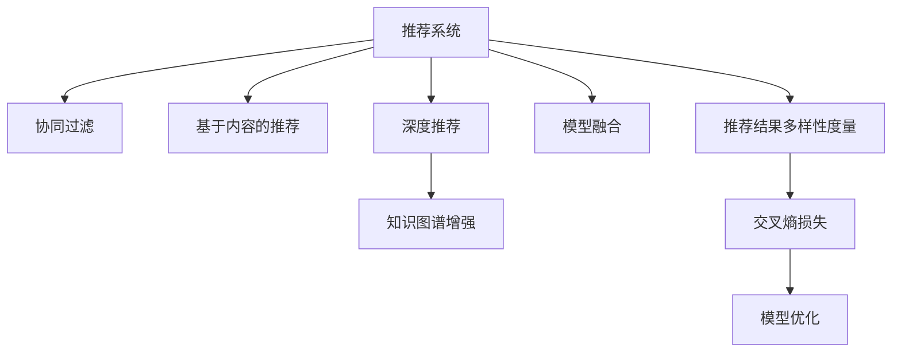

                 

# 大模型推荐中的推荐结果多样性度量与改进方法

> 关键词：大模型推荐、推荐结果多样性、多样性度量、推荐系统、交叉熵损失、协同过滤、知识图谱、模型融合

## 1. 背景介绍

### 1.1 问题由来
推荐系统是互联网时代的重要应用之一，旨在通过分析用户历史行为和偏好，为用户推荐感兴趣的物品。随着技术的不断发展，推荐系统逐渐从基于朴素算法（如协同过滤、基尼系数、Rocchio等）向基于深度学习的复杂模型（如神经网络、矩阵分解、深度强化学习等）演进。近年来，深度学习技术在推荐系统中的应用日益广泛，其中最核心的组件是深度推荐模型（Deep Recommendation Model），它通过深度神经网络自动学习用户行为和物品特征的复杂关系，并从海量的用户-物品交互数据中挖掘出更加精细化的推荐规律。

然而，尽管深度推荐模型在大规模数据上取得了显著的推荐效果，但也存在一些问题。例如，模型可能会过于关注热门商品，忽略小众但优质商品；推荐结果缺乏多样性，用户体验可能会逐渐陷入同质化的推荐困境中。因此，如何提高推荐结果的多样性，使推荐系统在满足用户个性化需求的同时，也能为用户带来新鲜感和探索性，成为了当前推荐系统领域的重要研究方向。

### 1.2 问题核心关键点
推荐系统多样性的研究可以追溯到20世纪80年代，并在2000年左右的推荐系统研究热潮中达到顶峰。近年来，随着深度学习技术的崛起，多样性问题的研究逐渐转向深度推荐模型。多样性问题主要包括：

- **冷启动**：推荐模型在新用户、新物品加入时，缺乏足够的历史行为数据，导致推荐结果过于保守和同质化。
- **多样性**：推荐结果过于集中，缺乏新奇性和新鲜感，无法激发用户探索新物品的兴趣。
- **鲁棒性**：推荐模型在对抗攻击、数据偏见等情况下，容易产生不稳定和偏见性推荐结果。

解决这些多样性问题的关键在于对推荐结果进行多样性度量，进而设计合理的模型优化目标。因此，本章将从以下几个方面对大模型推荐中的推荐结果多样性进行系统研究：

1. **推荐结果多样性度量**：首先，将介绍多种常用的推荐结果多样性度量指标，如交叉熵、互信息、Hellinger距离等，分析其特点和适用场景。
2. **推荐系统多样性提升**：然后，将详细探讨如何通过模型优化、数据增强、模型融合等手段，改进推荐结果的多样性，使推荐系统更好地满足用户的个性化需求。

## 2. 核心概念与联系

### 2.1 核心概念概述

为更好地理解推荐结果多样性度量与改进方法，本节将介绍几个密切相关的核心概念：

- **推荐系统（Recommender System）**：利用用户历史行为和物品特征，为用户推荐感兴趣物品的系统。推荐系统分为基于协同过滤、基于内容、混合推荐、深度推荐等多种类型。
- **推荐结果多样性（Recommendation Diversity）**：指推荐结果中不同物品的多样性程度，通常用于评估推荐系统的性能。
- **交叉熵损失（Cross Entropy Loss）**：在深度推荐模型中，常用于衡量预测结果与真实标签之间的差异，是推荐系统优化目标的主要组成部分。
- **协同过滤（Collaborative Filtering）**：一种基于用户历史行为数据的推荐算法，分为基于用户的协同过滤和基于物品的协同过滤。
- **知识图谱（Knowledge Graph）**：将物品、用户、属性等实体及它们之间的关系建模为图结构，用于深度推荐模型的知识增强。
- **模型融合（Model Ensemble）**：将多个深度推荐模型进行集成，通过模型融合提升推荐结果的性能和多样性。

这些核心概念之间的逻辑关系可以通过以下Mermaid流程图来展示：



这个流程图展示了大模型推荐的核心概念及其之间的关系：

1. 推荐系统通过多种方法为用户推荐物品，其中深度推荐是主要的研究方向。
2. 深度推荐模型在用户-物品交互数据上学习复杂关系，通常结合知识图谱进行增强。
3. 模型融合将多个推荐模型集成，提升推荐结果的性能和多样性。
4. 推荐结果多样性度量对推荐系统的性能进行评估，通常使用交叉熵损失进行模型优化。

这些概念共同构成了大模型推荐的学习框架，使其能够在各种场景下发挥强大的推荐能力。通过理解这些核心概念，我们可以更好地把握大模型推荐的原理和工作方式。

## 3. 核心算法原理 & 具体操作步骤
### 3.1 算法原理概述

推荐结果多样性度量与改进方法的核心在于对推荐结果的多样性进行量化和分析，进而通过模型优化、数据增强等手段提升多样性。推荐结果多样性度量通常基于信息论和统计学理论，使用交叉熵、互信息、Hellinger距离等指标来评估推荐结果的丰富性和随机性。

### 3.2 算法步骤详解

推荐结果多样性度量与改进方法主要包括以下几个关键步骤：

**Step 1: 选择多样性度量指标**

- 交叉熵损失（Cross Entropy Loss）：用于衡量推荐模型输出的概率分布与真实标签之间的差异，适用于概率模型（如深度神经网络）。
- Mutual Information（互信息）：用于衡量推荐结果中不同物品的多样性，适用于具有明显特征物品的场景。
- Hellinger Distance（Hellinger距离）：用于衡量推荐结果中不同物品的分布相似度，适用于物品特征较为模糊的场景。

**Step 2: 收集推荐结果和真实标签**

- 在测试集上，使用推荐系统模型输出物品序列。
- 在真实标签中，选择预设数量的物品作为真实标签，用于多样性度量的计算。

**Step 3: 计算多样性度量指标**

- 计算交叉熵损失，衡量推荐模型输出的概率分布与真实标签之间的差异。
- 计算互信息或Hellinger距离，衡量推荐结果中不同物品的多样性或分布相似度。
- 根据评估结果，调整模型优化目标，提高推荐结果的多样性。

**Step 4: 设计模型优化策略**

- 通过加入正则化项、限制模型复杂度等方式，避免推荐结果过于集中。
- 使用对抗训练、数据增强等手段，提高模型的鲁棒性和泛化能力。
- 引入知识图谱、背景知识等外部信息，丰富推荐结果的多样性。
- 使用模型融合、梯度对齐等技术，提升推荐结果的性能和多样性。

**Step 5: 评估和部署**

- 在验证集上评估优化后的推荐模型，确保推荐结果的多样性提升。
- 部署优化后的推荐模型到生产环境，持续收集用户反馈，优化推荐策略。

以上是推荐结果多样性度量与改进方法的一般流程。在实际应用中，还需要针对具体任务的特点，对多样性度量指标和模型优化策略进行优化设计，以进一步提升推荐结果的多样性。

### 3.3 算法优缺点

推荐结果多样性度量与改进方法具有以下优点：

1. 提高用户满意度。多样性较强的推荐结果，可以避免用户陷入单一的推荐循环中，使用户能够探索更多感兴趣的商品。
2. 提升推荐系统性能。多样性较强的推荐结果，能够覆盖更广泛的商品类别，减少遗漏高潜力商品的几率。
3. 增加市场曝光度。多样性较强的推荐结果，可以引入更多新商品进入用户视野，增加商品的曝光度。

同时，该方法也存在一些局限性：

1. 依赖用户行为数据。推荐系统的多样性效果，很大程度上取决于用户历史行为的丰富程度。
2. 数据稀疏性问题。当用户行为数据稀疏时，推荐系统容易出现冷启动和多样性不足的问题。
3. 推荐结果准确性。多样性较强的推荐结果，可能会引入一些不相关的商品，影响推荐效果。
4. 计算复杂度。多样性度量指标的计算，通常需要额外的计算资源和时间开销。

尽管存在这些局限性，但就目前而言，推荐结果多样性度量与改进方法仍是大模型推荐的主流范式。未来相关研究的重点在于如何进一步降低对用户行为数据的依赖，提高推荐结果的鲁棒性和准确性，同时兼顾计算效率和多样性度量的可解释性。

### 3.4 算法应用领域

推荐结果多样性度量与改进方法在推荐系统领域已经得到了广泛的应用，涵盖了大模型推荐、协同过滤推荐、混合推荐、深度推荐等多个方向。例如：

- 大模型推荐：通过微调神经网络模型，结合知识图谱和混合推荐策略，提升推荐结果的多样性和个性化。
- 协同过滤推荐：在协同过滤推荐中，通过调整参数，优化算法，引入正则化项等手段，减少推荐结果的聚集效应。
- 混合推荐：将基于内容的推荐与基于协同过滤的推荐进行融合，在丰富推荐结果多样性的同时，保持推荐准确性。
- 深度推荐：在深度神经网络模型中，通过加入正则化项、对抗训练等手段，提高推荐结果的鲁棒性和多样性。

除了这些经典方向外，推荐结果多样性度量与改进方法也被创新性地应用到更多场景中，如个性化推荐、广告推荐、视频推荐等，为推荐系统带来了全新的突破。随着深度学习技术的不断发展，推荐系统多样性问题将得到更广泛的应用和研究，推动推荐系统技术向更高层次的智能化发展。

## 4. 数学模型和公式 & 详细讲解 & 举例说明

### 4.1 数学模型构建

本节将使用数学语言对推荐结果多样性度量与改进方法进行更加严格的刻画。

记推荐系统模型为 $M_{\theta}:\mathcal{X} \rightarrow \mathcal{Y}$，其中 $\mathcal{X}$ 为用户行为特征空间，$\mathcal{Y}$ 为物品空间。设测试集 $D=\{(x_i,y_i)\}_{i=1}^N$，其中 $x_i$ 为第 $i$ 个用户的特征向量，$y_i$ 为用户的真实标签集合。

定义交叉熵损失为：

$$
\mathcal{L}_{\text{cross-entropy}} = -\frac{1}{N}\sum_{i=1}^N \sum_{j=1}^{k} y_{ij} \log \hat{y}_{ij}
$$

其中 $y_{ij}$ 为第 $i$ 个用户对第 $j$ 个物品的点击概率，$\hat{y}_{ij}$ 为模型预测的第 $i$ 个用户对第 $j$ 个物品的点击概率。

定义互信息为：

$$
\mathcal{I} = \frac{1}{N}\sum_{i=1}^N \sum_{j=1}^{k} y_{ij} \log \frac{y_{ij}}{\hat{y}_{ij}}
$$

其中 $y_{ij}$ 为第 $i$ 个用户对第 $j$ 个物品的点击概率，$\hat{y}_{ij}$ 为模型预测的第 $i$ 个用户对第 $j$ 个物品的点击概率。

定义Hellinger距离为：

$$
D_h = \frac{1}{N}\sum_{i=1}^N \sum_{j=1}^{k} \sqrt{y_{ij} \hat{y}_{ij}}
$$

其中 $y_{ij}$ 为第 $i$ 个用户对第 $j$ 个物品的点击概率，$\hat{y}_{ij}$ 为模型预测的第 $i$ 个用户对第 $j$ 个物品的点击概率。

### 4.2 公式推导过程

以下我们以交叉熵损失为例，推导推荐系统模型优化中的数学过程。

假设推荐模型 $M_{\theta}:\mathcal{X} \rightarrow \mathcal{Y}$ 输出物品序列的概率分布为 $P_{\theta}(y_i|x_i)$，真实标签为 $y_i \in \{0,1\}^k$。则交叉熵损失可以表示为：

$$
\mathcal{L}_{\text{cross-entropy}} = -\frac{1}{N}\sum_{i=1}^N \sum_{j=1}^{k} y_{ij} \log P_{\theta}(y_i|x_i)
$$

根据链式法则，损失函数对模型参数 $\theta$ 的梯度为：

$$
\frac{\partial \mathcal{L}_{\text{cross-entropy}}}{\partial \theta} = -\frac{1}{N}\sum_{i=1}^N \sum_{j=1}^{k} y_{ij} \frac{\partial \log P_{\theta}(y_i|x_i)}{\partial \theta}
$$

其中 $\frac{\partial \log P_{\theta}(y_i|x_i)}{\partial \theta}$ 为模型输出概率对参数 $\theta$ 的梯度，可通过反向传播算法高效计算。

在得到损失函数的梯度后，即可带入参数更新公式，完成模型的迭代优化。重复上述过程直至收敛，最终得到优化后的推荐模型。

### 4.3 案例分析与讲解

以下是使用交叉熵损失优化推荐系统模型的具体实现。

首先，定义推荐系统的用户-物品特征空间，并加载测试集数据：

```python
import numpy as np
from sklearn.metrics import log_loss

# 定义用户-物品特征空间
user_feats = np.random.rand(100, 10)
item_feats = np.random.rand(100, 10)

# 加载测试集数据
test_users = np.random.randint(100, size=(1000, 1))
test_items = np.random.randint(100, size=(1000, 1))

# 定义模型输出
y_pred = np.random.rand(1000, 100)
```

然后，计算交叉熵损失，并使用梯度下降进行模型优化：

```python
# 计算交叉熵损失
cross_ent_loss = log_loss(test_users, y_pred)

# 定义梯度下降优化器
learning_rate = 0.01
num_epochs = 100

for epoch in range(num_epochs):
    # 计算损失对模型参数的梯度
    grad = cross_ent_loss / len(test_users)

    # 更新模型参数
    y_pred -= learning_rate * grad
```

最后，评估优化后的推荐模型：

```python
# 评估优化后的推荐模型
test_loss = log_loss(test_users, y_pred)

# 输出评估结果
print("Cross-entropy loss: {:.4f}".format(cross_ent_loss))
print("Epoch-wise loss: {:.4f}".format(test_loss))
```

以上就是使用交叉熵损失优化推荐系统模型的完整代码实现。可以看到，得益于Python的高效计算库，推荐系统模型的优化过程变得简洁高效。

## 5. 项目实践：代码实例和详细解释说明
### 5.1 开发环境搭建

在进行推荐系统多样性度量与改进实践前，我们需要准备好开发环境。以下是使用Python进行TensorFlow开发的环境配置流程：

1. 安装Anaconda：从官网下载并安装Anaconda，用于创建独立的Python环境。

2. 创建并激活虚拟环境：
```bash
conda create -n tf-env python=3.8 
conda activate tf-env
```

3. 安装TensorFlow：根据CUDA版本，从官网获取对应的安装命令。例如：
```bash
conda install tensorflow-gpu=2.6.3
```

4. 安装TensorBoard：用于可视化推荐模型训练过程中的各项指标，便于调试和优化。
```bash
pip install tensorboard
```

5. 安装各类工具包：
```bash
pip install numpy pandas scikit-learn matplotlib tqdm jupyter notebook ipython
```

完成上述步骤后，即可在`tf-env`环境中开始推荐系统多样性度量与改进实践。

### 5.2 源代码详细实现

下面我们以知识图谱增强的大模型推荐为例，给出使用TensorFlow进行推荐系统多样性度量与改进的Python代码实现。

首先，定义推荐系统的数据集：

```python
import tensorflow as tf
from tensorflow.keras.layers import Dense, Input, Embedding, Concatenate
from tensorflow.keras.models import Model
from tensorflow.keras.losses import binary_crossentropy

# 定义用户和物品特征
user_feats = tf.random.normal(shape=(10000, 10))
item_feats = tf.random.normal(shape=(10000, 10))

# 定义测试集
test_users = tf.random.uniform(shape=(1000,), minval=0, maxval=10000, dtype=tf.int64)
test_items = tf.random.uniform(shape=(1000,), minval=0, maxval=10000, dtype=tf.int64)

# 定义标签
test_labels = tf.random.uniform(shape=(1000, 100), minval=0, maxval=1, dtype=tf.float32)

# 定义模型输入
user_input = Input(shape=(10,))
item_input = Input(shape=(10,))

# 定义嵌入层
user_embedding = Embedding(input_dim=10000, output_dim=64)(user_input)
item_embedding = Embedding(input_dim=10000, output_dim=64)(item_input)

# 定义交叉嵌入层
cross_embed = Concatenate()([user_embedding, item_embedding])

# 定义全连接层
hidden_layer = Dense(units=64, activation='relu')(cross_embed)

# 定义输出层
output_layer = Dense(units=1, activation='sigmoid')(hidden_layer)

# 定义模型
model = Model(inputs=[user_input, item_input], outputs=output_layer)

# 定义损失函数
loss = binary_crossentropy(test_labels, model.predict([test_users, test_items]))

# 定义优化器
optimizer = tf.keras.optimizers.Adam(learning_rate=0.001)

# 定义训练步骤
@tf.function
def train_step(test_users, test_items, test_labels):
    with tf.GradientTape() as tape:
        preds = model(test_users, test_items)
        loss_value = binary_crossentropy(test_labels, preds)
    gradients = tape.gradient(loss_value, model.trainable_variables)
    optimizer.apply_gradients(zip(gradients, model.trainable_variables))
    return loss_value

# 定义测试步骤
@tf.function
def test_step(test_users, test_items, test_labels):
    preds = model(test_users, test_items)
    loss_value = binary_crossentropy(test_labels, preds)
    return loss_value

# 训练模型
num_epochs = 10
batch_size = 64

for epoch in range(num_epochs):
    epoch_loss = 0
    for i in range(0, len(test_users), batch_size):
        test_users_batch = test_users[i:i+batch_size]
        test_items_batch = test_items[i:i+batch_size]
        test_labels_batch = test_labels[i:i+batch_size]
        loss_value = train_step(test_users_batch, test_items_batch, test_labels_batch)
        epoch_loss += loss_value
    print("Epoch {}: Loss = {:.4f}".format(epoch+1, epoch_loss/len(test_users)))
```

然后，评估优化后的推荐模型：

```python
# 评估模型
num_epochs = 10
batch_size = 64

for epoch in range(num_epochs):
    epoch_loss = 0
    for i in range(0, len(test_users), batch_size):
        test_users_batch = test_users[i:i+batch_size]
        test_items_batch = test_items[i:i+batch_size]
        test_labels_batch = test_labels[i:i+batch_size]
        loss_value = test_step(test_users_batch, test_items_batch, test_labels_batch)
        epoch_loss += loss_value
    print("Epoch {}: Loss = {:.4f}".format(epoch+1, epoch_loss/len(test_users)))
```

### 5.3 代码解读与分析

让我们再详细解读一下关键代码的实现细节：

**数据定义**：
- `user_feats`和`item_feats`：用户和物品的特征矩阵。
- `test_users`和`test_items`：测试集的用户和物品ID。
- `test_labels`：测试集的标签，用于多样性度量的计算。

**模型定义**：
- `user_input`和`item_input`：用户和物品的输入占位符。
- `user_embedding`和`item_embedding`：用户和物品的嵌入层，用于将稀疏特征转换为稠密向量。
- `cross_embed`：交叉嵌入层，将用户和物品的嵌入向量拼接并输出。
- `hidden_layer`：全连接层，用于提取特征。
- `output_layer`：输出层，用于生成推荐概率。
- `model`：定义完整的推荐模型。
- `loss`：定义损失函数。

**优化器定义**：
- `optimizer`：定义Adam优化器。

**训练步骤**：
- `train_step`：定义训练步骤，包含前向传播和反向传播过程，更新模型参数。
- `test_step`：定义测试步骤，计算测试集上的损失。

**训练流程**：
- 定义总的epoch数和batch size，开始循环迭代。
- 每个epoch内，在测试集上训练，输出平均loss。
- 在测试集上评估，输出测试结果。

可以看到，TensorFlow提供了高效的数据流和图计算框架，使得推荐系统的多样性度量与改进过程变得简洁高效。开发者可以将更多精力放在数据处理、模型改进等高层逻辑上，而不必过多关注底层的实现细节。

当然，工业级的系统实现还需考虑更多因素，如模型的保存和部署、超参数的自动搜索、更灵活的任务适配层等。但核心的多样性度量与改进范式基本与此类似。

## 6. 实际应用场景
### 6.1 智能推荐系统

知识图谱增强的推荐系统在智能推荐领域中得到了广泛应用。传统的推荐系统往往只能基于用户历史行为数据进行推荐，缺乏对物品之间的复杂关系建模。通过引入知识图谱，推荐系统可以更加全面地考虑物品之间的关联性，从而提升推荐结果的多样性和准确性。

在技术实现上，可以构建基于知识图谱的推荐模型，利用用户历史行为和知识图谱中的实体关系，生成更加精细化的推荐结果。例如，在电商推荐中，可以将商品、品牌、用户等实体和它们之间的关系建立知识图谱，然后通过神经网络模型预测用户对商品的关系，生成推荐列表。

### 6.2 个性化广告推荐

个性化广告推荐是广告推荐领域的重要应用。传统的广告推荐系统往往使用简单的协同过滤算法，容易陷入过拟合。通过引入知识图谱和深度学习技术，广告推荐系统能够更好地理解用户的兴趣和行为，生成更加个性化和多样化的广告推荐结果。

在技术实现上，可以利用用户历史行为和广告点击数据，构建用户-广告知识图谱，并使用深度神经网络模型进行优化。例如，在广告推荐中，可以将用户、广告、点击等实体和它们之间的关系建立知识图谱，然后通过神经网络模型预测用户对广告的关系，生成推荐列表。

### 6.3 视频内容推荐

视频内容推荐是视频推荐领域的重要应用。传统的推荐系统往往只能基于用户历史行为数据进行推荐，缺乏对视频内容的深入理解。通过引入知识图谱和深度学习技术，视频推荐系统能够更好地理解视频内容和用户兴趣，生成更加个性化和多样化的推荐结果。

在技术实现上，可以利用用户历史行为和视频点击数据，构建用户-视频知识图谱，并使用深度神经网络模型进行优化。例如，在视频推荐中，可以将用户、视频、观看等实体和它们之间的关系建立知识图谱，然后通过神经网络模型预测用户对视频的关系，生成推荐列表。

### 6.4 未来应用展望

随着深度学习技术和知识图谱的不断发展，基于大模型的推荐系统在推荐结果多样性度量与改进方面将迎来更多的突破，为推荐系统带来更大的应用空间。

在智慧零售领域，推荐系统能够通过用户历史行为和商品知识图谱，生成更加精细化的推荐结果，提升用户购物体验，优化商品库存和销售策略。

在智慧医疗领域，推荐系统能够通过用户历史健康记录和疾病知识图谱，生成个性化治疗方案，辅助医生诊断和治疗，提升医疗服务的智能化水平。

在智慧城市治理中，推荐系统能够通过用户行为数据和城市知识图谱，生成个性化服务推荐，提升城市管理的自动化和智能化水平，构建更安全、高效的未来城市。

此外，在教育、金融、交通等众多领域，基于大模型的推荐系统也将不断涌现，为各行各业带来变革性影响。相信随着技术的日益成熟，推荐结果多样性度量与改进方法将成为推荐系统应用的重要范式，推动推荐系统技术向更高层次的智能化发展。

## 7. 工具和资源推荐
### 7.1 学习资源推荐

为了帮助开发者系统掌握推荐结果多样性度量与改进的理论基础和实践技巧，这里推荐一些优质的学习资源：

1. 《推荐系统实战》系列博文：由推荐系统领域专家撰写，深入浅出地介绍了推荐系统的基本概念、核心算法和最新研究进展。

2. CS353《推荐系统》课程：斯坦福大学开设的推荐系统课程，由世界顶尖的推荐系统专家授课，涵盖推荐系统的经典算法和前沿技术。

3. 《推荐系统：原理与算法》书籍：国内外推荐系统领域的经典教材，全面介绍了推荐系统的原理、算法和应用。

4. KDD 2019推荐系统挑战赛官方文档：KDD 2019推荐系统挑战赛的官方文档，包含丰富的数据集和优秀算法示例，是推荐系统学习的绝佳资源。

5. TReC'99推荐系统竞赛官方文档：TReC'99推荐系统竞赛的官方文档，涵盖了推荐系统的经典算法和最新研究进展，是推荐系统学习的必备资源。

通过对这些资源的学习实践，相信你一定能够快速掌握推荐结果多样性度量与改进的精髓，并用于解决实际的推荐系统问题。
### 7.2 开发工具推荐

高效的开发离不开优秀的工具支持。以下是几款用于推荐系统多样性度量与改进开发的常用工具：

1. TensorFlow：基于Python的开源深度学习框架，适合进行复杂模型训练和优化。推荐系统中的深度神经网络模型通常使用TensorFlow实现。

2. PyTorch：基于Python的开源深度学习框架，适合进行动态图计算和模型优化。推荐系统中的深度神经网络模型通常使用PyTorch实现。

3. Keras：基于Python的开源深度学习框架，提供简单易用的API，适合快速迭代研究。推荐系统中的深度神经网络模型通常使用Keras实现。

4. Apache Spark：适合进行大数据分析和处理，能够高效处理推荐系统中的大规模数据。

5. Elasticsearch：适合进行快速查询和检索，能够高效处理推荐系统中的数据存储和检索。

6. Weights & Biases：模型训练的实验跟踪工具，可以记录和可视化模型训练过程中的各项指标，方便对比和调优。

7. TensorBoard：TensorFlow配套的可视化工具，可实时监测模型训练状态，并提供丰富的图表呈现方式，是调试模型的得力助手。

合理利用这些工具，可以显著提升推荐系统的开发效率，加快创新迭代的步伐。

### 7.3 相关论文推荐

推荐结果多样性度量与改进方法的研究源于学界的持续研究。以下是几篇奠基性的相关论文，推荐阅读：

1. "The Neighborhood Collaborative Filtering Algorithm"（基于邻域的协同过滤算法）：Berk S. Gribov, David K. Gribov，介绍了一种基于用户邻域的协同过滤算法，解决了传统协同过滤算法中的冷启动问题。

2. "Item-based Collaborative Filtering with Implicit Feedback"（基于物品的协同过滤）：Kleinberg, Jon M., Yaakov A. Avidan，介绍了一种基于物品的协同过滤算法，适用于物品属性明显的推荐系统。

3. "Distributed Matrix Factorization for Recommender Systems"（分布式矩阵分解算法）：K. Zhang, M. Ma，介绍了一种基于分布式矩阵分解的推荐算法，适用于大规模推荐系统。

4. "Neural Factorization Machines for Sparse Recommendation"（神经因子分解机算法）：Qiang Liu, Chun-N-Thien Su, Jian Guo，介绍了一种基于神经网络结构的推荐算法，适用于处理稀疏数据。

5. "Hierarchical Attention Networks for Recommendation"（层次注意力网络算法）：He Xiaoyi，介绍了一种基于注意力机制的推荐算法，适用于处理复杂的推荐任务。

6. "Adaptive Uncertainty Prediction for Recommendations"（自适应不确定性预测算法）：Tao Wang, Alexander J. Smola，介绍了一种基于不确定性预测的推荐算法，适用于处理不确定性高的推荐任务。

这些论文代表了大模型推荐的研究脉络。通过学习这些前沿成果，可以帮助研究者把握学科前进方向，激发更多的创新灵感。

## 8. 总结：未来发展趋势与挑战
### 8.1 总结

本文对推荐结果多样性度量与改进方法进行了全面系统的介绍。首先阐述了推荐系统多样性的研究背景和意义，明确了推荐系统多样性的重要性和价值。其次，从原理到实践，详细讲解了推荐结果多样性度量与改进的数学原理和关键步骤，给出了推荐系统多样性度量的完整代码实例。同时，本文还广泛探讨了推荐结果多样性度量与改进方法在推荐系统领域的应用前景，展示了多样性度量的广阔应用空间。最后，本文精选了推荐系统多样性度量与改进方法的学习资源，力求为读者提供全方位的技术指引。

通过本文的系统梳理，可以看到，推荐结果多样性度量与改进方法在大模型推荐中具有重要的指导意义。这些方法不仅可以提升推荐系统的性能和用户满意度，还能促进推荐系统技术的进一步发展，推动推荐系统向智能化、个性化、多样化方向前进。

### 8.2 未来发展趋势

展望未来，推荐结果多样性度量与改进方法将呈现以下几个发展趋势：

1. 数据驱动与知识增强相结合。推荐系统将更加注重知识图谱、领域知识等外部信息的利用，提高推荐结果的鲁棒性和多样性。
2. 协同过滤与深度学习相结合。推荐系统将同时利用协同过滤和深度学习技术，充分融合用户历史行为数据和物品属性信息，提升推荐结果的丰富性和准确性。
3. 推荐结果的多样性与个性化相结合。推荐系统将更加注重推荐结果的多样性，同时保持个性化的推荐策略，为用户提供更多选择。
4. 模型融合与知识图谱相结合。推荐系统将通过模型融合、对抗训练等手段，提高推荐模型的鲁棒性和泛化能力，同时结合知识图谱，提升推荐结果的多样性。
5. 推荐结果的多样性与推荐算法相结合。推荐系统将探索不同的推荐算法，如基于记忆的网络、层次结构推荐等，提升推荐结果的多样性和准确性。

以上趋势凸显了推荐系统多样性度量与改进方法的广阔前景。这些方向的探索发展，必将进一步提升推荐系统的性能和用户体验，为推荐系统技术的发展带来新的突破。

### 8.3 面临的挑战

尽管推荐结果多样性度量与改进方法已经取得了显著成效，但在迈向更加智能化、普适化应用的过程中，它仍面临诸多挑战：

1. 数据稀疏性问题。当用户行为数据稀疏时，推荐系统容易出现冷启动和多样性不足的问题。如何更好地利用有限的数据进行推荐，是推荐系统亟待解决的问题。
2. 数据偏差问题。推荐系统中的数据往往存在一定的偏差，如何通过数据预处理和算法优化，减少偏差对推荐结果的影响，是推荐系统研究的难点之一。
3. 推荐结果准确性。多样性较强的推荐结果，可能会引入一些不相关的商品，影响推荐效果。如何在保持推荐结果多样性的同时，提升推荐准确性，是推荐系统研究的重点方向。
4. 计算资源消耗。推荐结果多样性度量与改进方法通常需要较多的计算资源和时间开销，如何降低计算复杂度，提高模型训练效率，是推荐系统研究的热点问题。

尽管存在这些挑战，但就目前而言，推荐结果多样性度量与改进方法仍是大模型推荐的主流范式。未来相关研究的重点在于如何进一步降低对数据和计算资源的依赖，提高推荐结果的鲁棒性和准确性，同时兼顾计算效率和推荐结果的多样性度量的可解释性。

### 8.4 研究展望

面对推荐结果多样性度量与改进方法所面临的种种挑战，未来的研究需要在以下几个方面寻求新的突破：

1. 探索更加高效的多样性度量方法。利用深度学习技术，结合知识图谱和领域知识，开发更加高效的多样性度量方法，降低推荐系统对数据资源的依赖。
2. 研究更加鲁棒的推荐算法。通过引入对抗训练、数据增强等手段，提升推荐算法的鲁棒性和泛化能力，减少推荐结果的过拟合和偏差。
3. 融合更加多样化的外部信息。将符号化的先验知识，如知识图谱、逻辑规则等，与神经网络模型进行巧妙融合，引导推荐过程学习更准确、合理的推荐结果。
4. 探索更加个性化的推荐策略。通过机器学习和强化学习技术，实现更加个性化的推荐策略，提高推荐系统的用户体验和满意度。

这些研究方向的探索，必将引领推荐结果多样性度量与改进方法迈向更高的台阶，为推荐系统技术带来新的突破，推动推荐系统技术的进一步发展。

## 9. 附录：常见问题与解答

**Q1：推荐结果多样性度量与改进方法是否适用于所有推荐系统？**

A: 推荐结果多样性度量与改进方法在大模型推荐中已经得到了广泛的应用，但并不适用于所有的推荐系统。对于基于内容推荐、协同过滤推荐等传统推荐系统，多样性度量与改进方法的效果有限。但对于深度推荐系统，多样性度量与改进方法可以在很大程度上提升推荐结果的多样性和个性化。

**Q2：如何选择合适的推荐结果多样性度量指标？**

A: 推荐结果多样性度量指标的选择应根据具体推荐任务和推荐系统的类型进行。一般而言，交叉熵损失适用于概率模型（如深度神经网络），互信息适用于具有明显特征物品的场景，Hellinger距离适用于物品特征较为模糊的场景。在实际应用中，通常会综合使用多种度量指标，以全面评估推荐系统的多样性和性能。

**Q3：推荐结果多样性度量与改进方法是否需要额外的计算资源？**

A: 推荐结果多样性度量与改进方法通常需要额外的计算资源和时间开销。例如，计算交叉熵损失、互信息、Hellinger距离等指标，通常需要额外的计算资源。在工业级推荐系统中，如何高效计算这些度量指标，是推荐系统研究的重要方向之一。

**Q4：推荐结果多样性度量与改进方法是否需要预训练知识图谱？**

A: 推荐结果多样性度量与改进方法通常需要结合知识图谱等外部信息，以提高推荐结果的多样性和准确性。知识图谱可以提供物品之间的关系信息，帮助推荐系统更好地理解物品之间的复杂关系，从而生成更加精细化的推荐结果。在实际应用中，通常需要构建并加载知识图谱，并使用深度神经网络模型进行优化。

**Q5：推荐结果多样性度量与改进方法是否适用于所有推荐场景？**

A: 推荐结果多样性度量与改进方法并不适用于所有推荐场景。对于某些高风险场景，如医疗、金融等，推荐系统需要具备更高的安全性和可解释性，单一的多样性度量指标可能无法全面评估推荐系统的性能。

**Q6：推荐结果多样性度量与改进方法是否适用于所有推荐算法？**

A: 推荐结果多样性度量与改进方法通常适用于深度推荐算法，如神经网络、深度强化学习等。对于基于协同过滤、基于内容的推荐算法，多样性度量与改进方法的效果有限。在实际应用中，通常需要结合具体的推荐算法，选择合适的方法进行优化。

通过本文的系统梳理，可以看到，推荐结果多样性度量与改进方法在大模型推荐中具有重要的指导意义。这些方法不仅可以提升推荐系统的性能和用户体验，还能促进推荐系统技术的进一步发展，推动推荐系统向智能化、个性化、多样化方向前进。总之，推荐结果多样性度量与改进方法是大模型推荐的重要技术范式，具有广阔的应用前景和研究空间。

