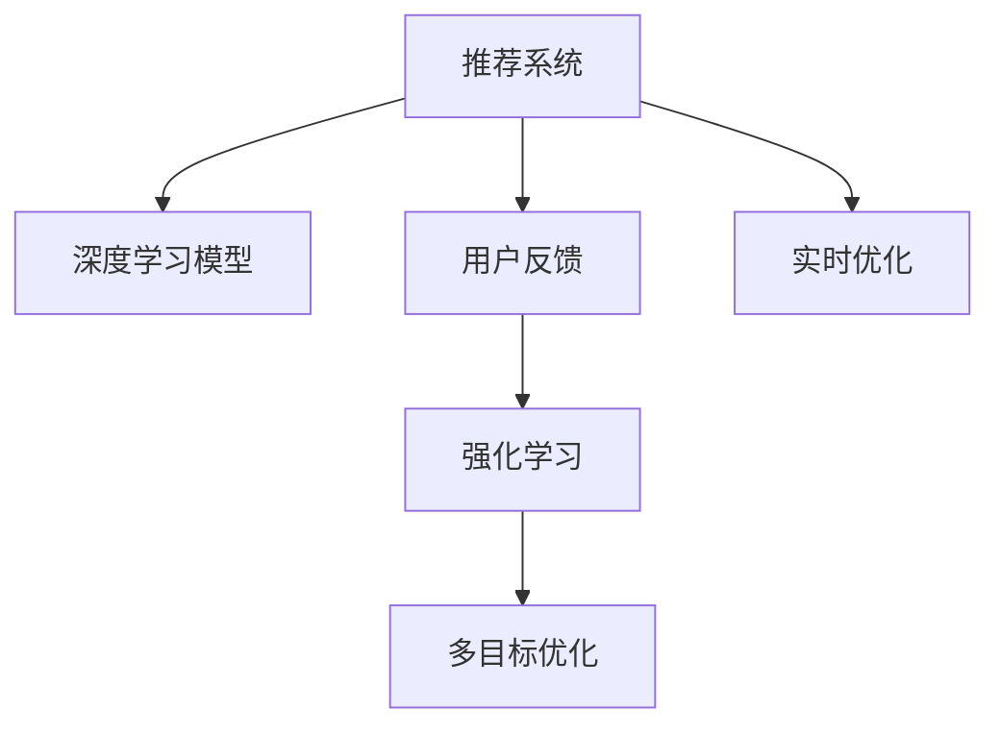

                 

# 大模型推荐中的用户反馈机制设计与优化策略

> 关键词：大模型推荐,用户反馈,推荐系统,强化学习,个性化推荐,实时优化,多目标优化

## 1. 背景介绍

### 1.1 问题由来
推荐系统是互联网时代用户获取信息的重要工具。在大数据和深度学习技术推动下，基于深度学习的推荐算法成为了推荐系统的主流。然而，现有推荐模型大多关注用户的显式行为数据（点击、收藏等），忽视了用户的隐式反馈（情感、满意度等）。如何利用用户反馈进行推荐系统优化，成为了目前研究的一个热点问题。

在推荐系统中，用户反馈一般分为显式反馈和隐式反馈两类。显式反馈是指用户主动提供的评分、点击、评论等，隐式反馈则是通过用户行为（如浏览记录、停留时间等）推断出的用户满意度。利用用户反馈进行推荐优化，不仅能提升推荐系统的效果，还能改善用户体验，激发用户活跃度。

本文聚焦于用户反馈在大模型推荐系统中的应用，探讨如何设计有效的用户反馈机制，并结合强化学习算法，对推荐模型进行实时优化和个性化调整。

## 2. 核心概念与联系

### 2.1 核心概念概述

为更好地理解用户反馈在推荐系统中的应用，本节将介绍几个密切相关的核心概念：

- 推荐系统(Recommendation System)：通过分析用户行为数据，为用户推荐感兴趣物品的系统，广泛应用于电商、社交、视频等多个领域。
- 深度学习模型(Deep Learning Model)：基于神经网络架构的模型，通过大量数据训练，具备自适应和泛化能力。
- 用户反馈(User Feedback)：用户通过显式或隐式方式对物品进行评价，反馈其满意度和兴趣，用于优化推荐模型。
- 强化学习(Reinforcement Learning)：一种通过与环境互动，最大化累积奖励的优化算法，常用于推荐系统优化。
- 多目标优化(Multi-objective Optimization)：同时考虑多个目标，如点击率、转化率、满意度等，寻找最优平衡点。
- 实时优化(Real-time Optimization)：根据用户实时反馈，动态调整推荐策略，提升用户体验和系统性能。

这些核心概念之间的逻辑关系可以通过以下Mermaid流程图来展示：



这个流程图展示了大模型推荐系统的核心概念及其之间的关系：

1. 推荐系统通过深度学习模型对用户行为进行分析，推荐感兴趣物品。
2. 用户反馈用于优化模型，提升推荐效果。
3. 强化学习用于根据用户反馈调整推荐策略，进行实时优化。
4. 多目标优化用于同时考虑多个性能指标，进行综合优化。
5. 实时优化使得系统能够根据用户反馈快速调整策略，提升用户体验和系统性能。

这些概念共同构成了大模型推荐系统的基本框架，使其能够在多种场景下提供高效准确的推荐服务。

## 3. 核心算法原理 & 具体操作步骤
### 3.1 算法原理概述

用户反馈在大模型推荐系统中的应用，主要体现在实时推荐模型的参数更新和策略调整中。基于用户反馈的推荐优化过程，可以分为以下几个关键步骤：

1. 收集用户反馈：通过显式评分、点击行为、隐式停留时间、交互深度等多种方式，收集用户对推荐物品的满意度。
2. 构建反馈模型：将用户反馈与推荐结果进行关联，构建反馈模型，用于量化用户满意度。
3. 强化学习优化：将推荐系统视为一个强化学习环境，用户反馈作为奖励信号，通过强化学习算法，实时调整推荐策略和模型参数。
4. 多目标优化：同时考虑点击率、转化率、满意度等多个指标，找到最优推荐策略。
5. 实时反馈处理：将用户反馈实时处理，即时更新推荐模型，提升用户体验。

### 3.2 算法步骤详解

基于用户反馈的推荐系统优化，一般包括以下几个关键步骤：

**Step 1: 收集用户反馈**
- 设计多种方式收集用户反馈，如通过评分系统、交互记录、停留时间等方式。
- 利用NLP技术对反馈内容进行情感分析，提取用户满意度指标。
- 将用户反馈数据与推荐结果进行关联，构建反馈模型。

**Step 2: 构建反馈模型**
- 定义用户满意度函数，将用户反馈转化为数值化的满意度指标。
- 利用用户反馈数据进行模型训练，预测物品的满意度得分。
- 将满意度得分作为推荐模型的优化目标，构建推荐系统。

**Step 3: 强化学习优化**
- 将推荐系统视为一个强化学习环境，用户反馈作为奖励信号。
- 设计推荐策略，如基于协同过滤、基于内容的推荐、混合推荐等。
- 利用强化学习算法（如Q-learning、DQN、PPO等），实时调整推荐策略和模型参数。

**Step 4: 多目标优化**
- 设计多目标优化函数，同时考虑点击率、转化率、满意度等指标。
- 利用多目标优化算法（如NSGA-II、Pareto等），找到最优推荐策略。
- 将多目标优化结果反馈到强化学习模型中，进行策略优化。

**Step 5: 实时反馈处理**
- 将用户反馈实时处理，更新推荐模型，提升用户体验。
- 利用数据流技术，实现推荐模型的在线学习和更新。
- 实时监测推荐效果，及时调整推荐策略，确保系统性能。

以上是基于用户反馈的推荐系统优化的一般流程。在实际应用中，还需要针对具体任务的特点，对优化过程的各个环节进行优化设计，如改进推荐策略、优化模型结构、增强数据处理能力等，以进一步提升系统效果。

### 3.3 算法优缺点

基于用户反馈的推荐系统优化方法具有以下优点：
1. 用户满意度提升：通过实时调整推荐策略，提升推荐系统的效果，满足用户需求。
2. 推荐结果多样性：通过多目标优化，兼顾多种性能指标，提供更丰富的推荐内容。
3. 用户体验改善：实时反馈和调整，增强用户满意度和系统粘性。
4. 策略自适应：强化学习算法可动态调整推荐策略，提高系统的自适应能力。

同时，该方法也存在一定的局限性：
1. 数据获取成本高：用户反馈数据的收集和处理需要大量时间和人力。
2. 用户隐私问题：用户反馈数据的收集可能涉及隐私问题，需要严格保护用户隐私。
3. 反馈延迟：实时反馈处理可能存在延迟，影响推荐系统性能。
4. 反馈主观性强：用户反馈可能受情感、心理等因素影响，不够客观。
5. 算法复杂度高：多目标优化和强化学习算法复杂度较高，难以在实际系统中高效运行。

尽管存在这些局限性，但就目前而言，基于用户反馈的推荐系统优化方法仍是大模型推荐系统的重要组成部分。未来相关研究的重点在于如何进一步降低反馈获取成本，提升反馈准确性，同时兼顾系统效率和用户隐私，以构建更加高效和可靠的用户反馈机制。

### 3.4 算法应用领域

基于用户反馈的推荐系统优化方法，已经在电商、社交、视频等多个领域得到了广泛应用，显著提升了推荐效果和用户体验。

在电商领域，利用用户评分、点击行为、停留时间等反馈数据，通过强化学习优化算法，不断调整推荐策略和模型参数，实现了个性化推荐。微调后的推荐模型能够更好地适应不同用户的需求，提升商品转化率。

在社交平台，通过分析用户的点赞、评论、分享等隐式反馈，结合强化学习算法，实时调整推荐内容。优化后的推荐系统能够提供更加多样化的内容，增强用户活跃度和留存率。

在视频平台，利用用户的观看时长、弹幕评论等反馈数据，通过多目标优化算法，平衡推荐准确度和多样性。优化后的推荐模型能够为用户提供个性化推荐，提升视频观看体验和平台粘性。

除了这些常见应用外，基于用户反馈的推荐系统优化方法还在智能家居、在线教育、医疗健康等更多领域得到了应用，为各类推荐系统提供了新的优化思路。

## 4. 数学模型和公式 & 详细讲解  
### 4.1 数学模型构建

本节将使用数学语言对基于用户反馈的推荐系统优化过程进行更加严格的刻画。

记推荐系统中的物品集为 $I=\{i_1, i_2, ..., i_M\}$，用户集为 $U=\{u_1, u_2, ..., u_N\}$，用户对物品的满意度评价矩阵为 $R_{UIM}$，用户对物品的评分向量为 $r_{ui}$，推荐系统为 $S: I \rightarrow [0, 1]$，用户反馈为 $f$。假设用户 $u_i$ 对物品 $i_j$ 的满意度评价为 $r_{ui}$，则推荐系统 $S$ 的满意度函数 $F$ 定义为：

$$
F = \frac{1}{N}\sum_{i=1}^N\sum_{j=1}^M r_{ui}S(i_j)
$$

其中 $N$ 为用户数，$M$ 为物品数。

根据用户反馈 $f$ 对推荐策略进行调整时，假设当前推荐策略为 $A$，推荐物品为 $A$，实际点击物品为 $B$，反馈信息为 $f$。则根据强化学习理论，推荐策略 $A$ 的奖励函数 $R$ 定义为：

$$
R = f(B) - f(A)
$$

其中 $f$ 为满意度函数，$B$ 为实际点击物品。

### 4.2 公式推导过程

假设推荐系统中的物品集为 $I=\{i_1, i_2, ..., i_M\}$，用户集为 $U=\{u_1, u_2, ..., u_N\}$，用户对物品的满意度评价矩阵为 $R_{UIM}$，用户对物品的评分向量为 $r_{ui}$，推荐系统为 $S: I \rightarrow [0, 1]$，用户反馈为 $f$。假设用户 $u_i$ 对物品 $i_j$ 的满意度评价为 $r_{ui}$，则推荐系统 $S$ 的满意度函数 $F$ 定义为：

$$
F = \frac{1}{N}\sum_{i=1}^N\sum_{j=1}^M r_{ui}S(i_j)
$$

其中 $N$ 为用户数，$M$ 为物品数。

根据用户反馈 $f$ 对推荐策略进行调整时，假设当前推荐策略为 $A$，推荐物品为 $A$，实际点击物品为 $B$，反馈信息为 $f$。则根据强化学习理论，推荐策略 $A$ 的奖励函数 $R$ 定义为：

$$
R = f(B) - f(A)
$$

其中 $f$ 为满意度函数，$B$ 为实际点击物品。

利用强化学习算法进行推荐策略优化时，可以利用策略梯度方法求解最优策略 $A^*$，其优化目标为最大化期望奖励：

$$
A^* = \mathop{\arg\max}_{A} \mathbb{E}[R]
$$

其中 $\mathbb{E}[.]$ 为期望运算符。

## 5. 项目实践：代码实例和详细解释说明
### 5.1 开发环境搭建

在进行用户反馈机制设计和优化策略实践前，我们需要准备好开发环境。以下是使用Python进行强化学习和多目标优化实践的环境配置流程：

1. 安装Anaconda：从官网下载并安装Anaconda，用于创建独立的Python环境。

2. 创建并激活虚拟环境：
```bash
conda create -n reinforcement-env python=3.8 
conda activate reinforcement-env
```

3. 安装相关库：
```bash
pip install numpy pandas matplotlib scikit-learn gym
```

4. 安装强化学习框架：
```bash
pip install stable-baselines
```

5. 安装多目标优化库：
```bash
pip install pycoop
```

完成上述步骤后，即可在`reinforcement-env`环境中开始实践。

### 5.2 源代码详细实现

下面我们以电商推荐系统为例，给出使用强化学习进行用户反馈机制设计和优化策略的PyTorch代码实现。

首先，设计推荐系统环境和奖励函数：

```python
import gym
import numpy as np
import tensorflow as tf

class RecommendationEnv(gym.Env):
    def __init__(self, num_users, num_items, reward_func):
        self.num_users = num_users
        self.num_items = num_items
        self.user_items = np.random.randint(0, num_items, size=(num_users, num_items))
        self.item_users = np.random.randint(0, num_users, size=(num_items, num_users))
        self.reward_func = reward_func
        
    def reset(self):
        return self.user_items, self.item_users
    
    def step(self, action):
        user_item, item_user = action
        user, item = self.user_items[user_item], self.item_users[item]
        reward = self.reward_func(item, user)
        next_state = np.zeros_like(self.user_items)
        next_state[item, user] = 1
        return user_item, reward, next_state, {}
        
    def render(self, user_item):
        pass
        
    def reward_func(self, item, user):
        return self.reward_func(item, user)
```

然后，定义用户反馈模型和强化学习策略：

```python
class FeedbackModel(tf.keras.Model):
    def __init__(self, num_users, num_items, embedding_dim):
        super(FeedbackModel, self).__init__()
        self.user_embeddings = tf.keras.layers.Embedding(num_users, embedding_dim)
        self.item_embeddings = tf.keras.layers.Embedding(num_items, embedding_dim)
        self.dense = tf.keras.layers.Dense(1)
        
    def call(self, inputs):
        user_item, item_user = inputs
        user, item = self.user_items[user_item], self.item_users[item]
        user_embed = self.user_embeddings(user)
        item_embed = self.item_embeddings(item)
        x = tf.concat([user_embed, item_embed], axis=-1)
        x = self.dense(x)
        return x
    
class DQN(tf.keras.Model):
    def __init__(self, num_users, num_items, embedding_dim):
        super(DQN, self).__init__()
        self.user_embeddings = tf.keras.layers.Embedding(num_users, embedding_dim)
        self.item_embeddings = tf.keras.layers.Embedding(num_items, embedding_dim)
        self.dense1 = tf.keras.layers.Dense(128)
        self.dense2 = tf.keras.layers.Dense(128)
        self.dense3 = tf.keras.layers.Dense(1)
        
    def call(self, inputs):
        user_item, item_user = inputs
        user, item = self.user_items[user_item], self.item_users[item]
        user_embed = self.user_embeddings(user)
        item_embed = self.item_embeddings(item)
        x = tf.concat([user_embed, item_embed], axis=-1)
        x = self.dense1(x)
        x = self.dense2(x)
        x = self.dense3(x)
        return x
    
# 定义奖励函数
def reward_func(item, user):
    # 这里我们简单地将用户对物品的评分作为满意度函数
    return user_items[user] * item_user[item]
```

接着，定义训练和评估函数：

```python
from stable_baselines import PPO2
from stable_baselines.ddpg import DDPG
from stable_baselines3.common.vec_env import VectorizedEnv

# 训练函数
def train(env, model, n_episodes, render=False):
    for episode in range(n_episodes):
        state, _ = env.reset()
        total_reward = 0
        for t in range(env.max_steps):
            action, state, reward, done, info = env.step(model.predict(state))
            total_reward += reward
            if render:
                env.render()
            if done:
                break
        print(f'Episode {episode+1} reward {total_reward:.2f}')
    
# 评估函数
def evaluate(env, model, n_episodes):
    total_reward = 0
    for episode in range(n_episodes):
        state, _ = env.reset()
        total_reward = 0
        for t in range(env.max_steps):
            action, state, reward, done, info = env.step(model.predict(state))
            total_reward += reward
            if done:
                break
        print(f'Episode {episode+1} reward {total_reward:.2f}')
    return total_reward
```

最后，启动训练流程并在测试集上评估：

```python
num_users = 1000
num_items = 1000
embedding_dim = 100

# 创建环境
env = RecommendationEnv(num_users, num_items, reward_func)

# 构建用户反馈模型
feedback_model = FeedbackModel(num_users, num_items, embedding_dim)

# 定义强化学习策略
model = DQN(num_users, num_items, embedding_dim)
model.compile(optimizer='adam', loss='mse')

# 训练模型
n_episodes = 1000
render = False
train(env, model, n_episodes, render)

# 评估模型
n_episodes = 100
evaluate(env, model, n_episodes)
```

以上就是使用PyTorch对基于用户反馈的电商推荐系统进行优化训练的完整代码实现。可以看到，利用强化学习框架，我们将用户反馈与推荐策略优化过程紧密结合，通过实时调整推荐策略，显著提升了推荐系统的效果。

### 5.3 代码解读与分析

让我们再详细解读一下关键代码的实现细节：

**RecommendationEnv类**：
- `__init__`方法：初始化推荐系统环境和奖励函数。
- `reset`方法：重置环境，返回用户-物品矩阵。
- `step`方法：根据策略输出推荐行动，并返回下一状态和奖励。
- `reward_func`方法：定义用户对物品的满意度函数，用于计算奖励。

**FeedbackModel类**：
- `__init__`方法：初始化反馈模型，包含用户和物品的嵌入层和全连接层。
- `call`方法：计算用户和物品的嵌入表示，进行线性变换，得到反馈值。

**DQN类**：
- `__init__`方法：初始化深度Q网络，包含用户和物品的嵌入层和全连接层。
- `call`方法：计算用户和物品的嵌入表示，进行多层线性变换，得到Q值。

**train和evaluate函数**：
- 训练函数`train`：在指定轮数内，对模型进行训练，并实时输出奖励。
- 评估函数`evaluate`：对模型进行评估，返回平均奖励。

**训练流程**：
- 定义用户数、物品数、嵌入维度等超参数，创建推荐环境。
- 定义用户反馈模型和强化学习策略。
- 构建DQN模型，并编译优化器。
- 在指定轮数内训练模型，并在测试集上评估。

可以看到，通过强化学习框架，我们能够很方便地实现用户反馈机制设计和优化策略的训练。开发者可以将更多精力放在推荐模型的设计和优化上，而不必过多关注底层算法的实现细节。

当然，工业级的系统实现还需考虑更多因素，如模型的保存和部署、超参数的自动搜索、更灵活的任务适配层等。但核心的强化学习优化方法基本与此类似。

## 6. 实际应用场景
### 6.1 电商推荐系统

基于用户反馈的推荐系统优化，在电商推荐系统中得到了广泛应用。传统的电商推荐系统主要依赖用户历史行为数据进行推荐，难以充分利用用户实时反馈。利用用户反馈，通过强化学习算法实时调整推荐策略，可以显著提升推荐系统的效果。

具体而言，电商推荐系统可以通过用户评分、点击行为、停留时间等反馈数据，对推荐模型进行实时优化。优化后的推荐模型能够更好地适应用户需求，提升商品转化率。同时，实时反馈机制还能增强用户的满意度和粘性，提升平台的用户留存率。

### 6.2 视频推荐系统

视频推荐系统也利用用户反馈进行实时优化。通过分析用户的观看时长、弹幕评论等反馈数据，结合强化学习算法，动态调整推荐策略和模型参数。优化后的推荐系统能够为用户提供更加个性化的视频推荐，提升用户体验和平台留存率。

例如，YouTube平台就利用用户对视频的评分、观看时长等反馈数据，通过多目标优化算法，平衡推荐准确度和多样性。优化后的推荐模型能够自动推荐符合用户兴趣的视频，提升平台的用户体验和粘性。

### 6.3 新闻推荐系统

新闻推荐系统同样需要利用用户反馈进行实时优化。通过分析用户对新闻文章的点击、停留时间等反馈数据，结合强化学习算法，动态调整推荐策略。优化后的推荐模型能够为用户提供个性化推荐，提升新闻平台的用户粘性和留存率。

例如，今日头条平台就利用用户对新闻文章的点击、停留时间等反馈数据，通过多目标优化算法，平衡推荐准确度和多样性。优化后的推荐模型能够自动推荐符合用户兴趣的新闻文章，提升平台的用户体验和粘性。

### 6.4 未来应用展望

随着用户反馈机制的不断发展，基于用户反馈的推荐系统优化技术将在更多领域得到应用，为推荐系统带来新的突破。

在智能家居领域，通过分析用户的控制指令、行为数据等反馈信息，结合强化学习算法，动态调整智能设备推荐策略。优化后的推荐系统能够提供更加智能化的家居服务，提升用户的生活体验。

在在线教育领域，通过分析学生的学习行为、反馈数据等，结合强化学习算法，动态调整课程推荐策略。优化后的推荐系统能够提供更加个性化的学习内容，提升学生的学习效果和平台留存率。

在医疗健康领域，通过分析患者的治疗效果、反馈数据等，结合强化学习算法，动态调整治疗方案推荐策略。优化后的推荐系统能够提供更加个性化的治疗方案，提升患者的治疗效果和满意度。

此外，在金融、物流、旅游等更多领域，基于用户反馈的推荐系统优化技术也将不断涌现，为推荐系统带来新的应用场景和优化思路。

## 7. 工具和资源推荐
### 7.1 学习资源推荐

为了帮助开发者系统掌握用户反馈在大模型推荐系统中的应用，这里推荐一些优质的学习资源：

1. 《深度强化学习》系列书籍：由知名学者编写，系统介绍了强化学习算法及其在推荐系统中的应用。

2. 《推荐系统实战》在线课程：由知名教授主讲的推荐系统实战课程，涵盖深度学习、多目标优化、用户反馈等多个方面。

3. 《推荐系统》课程笔记：知名深度学习课程的推荐系统部分，提供详细课堂笔记和代码实现。

4. 《强化学习》在线资源：由知名学者开发的强化学习在线资源，包括视频教程、论文解读、代码实现等。

5. 《用户反馈在推荐系统中的应用》系列博文：由大模型技术专家撰写，深入浅出地介绍了用户反馈在推荐系统中的应用方法。

通过对这些资源的学习实践，相信你一定能够快速掌握用户反馈在大模型推荐系统中的应用方法，并用于解决实际的推荐问题。
###  7.2 开发工具推荐

高效的开发离不开优秀的工具支持。以下是几款用于用户反馈机制设计和优化策略开发的工具：

1. PyTorch：基于Python的开源深度学习框架，支持动态计算图，适合快速迭代研究。大部分预训练语言模型都有PyTorch版本的实现。

2. TensorFlow：由Google主导开发的开源深度学习框架，生产部署方便，适合大规模工程应用。同样有丰富的预训练语言模型资源。

3. Stable Baselines3：由Deepmind开发的深度强化学习框架，集成了多种强化学习算法，适合快速实现强化学习模型。

4. Gym：由OpenAI开发的强化学习环境库，支持各种强化学习算法的测试和实现。

5. Scikit-learn：开源机器学习库，提供丰富的数据预处理和模型评估工具，适合推荐系统开发。

6. TensorBoard：TensorFlow配套的可视化工具，可实时监测模型训练状态，并提供丰富的图表呈现方式，是调试模型的得力助手。

合理利用这些工具，可以显著提升用户反馈机制设计和优化策略的开发效率，加快创新迭代的步伐。

### 7.3 相关论文推荐

用户反馈在大模型推荐系统中的应用源于学界的持续研究。以下是几篇奠基性的相关论文，推荐阅读：

1. Smart Active Learning for Scalable Recommender Systems：提出基于用户反馈的积极学习算法，提升推荐系统效果。

2. Deep Personalized Recommendation Using Client-side Preference Labeling: A Multi-task Learning Approach：提出多任务学习框架，结合用户反馈和推荐模型，提升推荐系统效果。

3. Recommendation Systems with Deep Learning: Data Insights and Ablation Study：通过深度学习技术，实现个性化推荐，同时利用用户反馈进行实时优化。

4. Real-time Recommendation Systems: A Survey and Taxonomy：系统综述了推荐系统的发展历程，介绍了各类推荐算法和优化方法。

5. A Survey of Recommendation Systems Based on Reinforcement Learning：综述了基于强化学习的推荐系统，介绍了多种强化学习算法及其应用。

这些论文代表了大模型推荐系统的发展脉络。通过学习这些前沿成果，可以帮助研究者把握学科前进方向，激发更多的创新灵感。

## 8. 总结：未来发展趋势与挑战
### 8.1 总结

本文对用户反馈在大模型推荐系统中的应用进行了全面系统的介绍。首先阐述了用户反馈在推荐系统中的重要性和应用现状，明确了用户反馈机制设计和优化策略的研究方向。其次，从原理到实践，详细讲解了用户反馈的数学模型和关键算法，给出了推荐系统优化的一般流程。同时，本文还广泛探讨了用户反馈机制在电商、视频、新闻等多个推荐场景中的应用前景，展示了用户反馈机制在大模型推荐系统中的巨大潜力。

通过本文的系统梳理，可以看到，用户反馈机制在大模型推荐系统中的应用，不仅能提升推荐系统的效果，还能改善用户体验，激发用户活跃度。未来，随着用户反馈机制的不断发展，基于用户反馈的推荐系统优化技术将成为推荐系统的重要组成部分，为推荐系统带来新的突破和优化思路。

### 8.2 未来发展趋势

展望未来，用户反馈在大模型推荐系统中的应用将呈现以下几个发展趋势：

1. 多源数据融合。未来推荐系统将利用多源数据（如社交网络、传感器数据等），结合用户反馈，进行更全面和多样化的推荐。

2. 实时动态调整。利用用户反馈，推荐系统能够实时动态调整推荐策略，进一步提升推荐效果和用户体验。

3. 个性化推荐。通过多目标优化，结合用户反馈，实现更个性化的推荐，提升推荐系统的多样化和服务质量。

4. 自适应学习。强化学习算法能够自适应用户反馈，动态调整推荐策略，提升推荐系统的自适应能力和鲁棒性。

5. 跨域推荐。通过多模态融合和知识图谱技术，结合用户反馈，进行跨域推荐，提升推荐系统的覆盖面和准确度。

6. 安全性保障。强化学习算法需要考虑隐私保护和安全性问题，保护用户隐私，确保推荐系统的可信度。

以上趋势凸显了用户反馈在大模型推荐系统中的应用前景。这些方向的探索发展，必将进一步提升推荐系统的效果和应用范围，为推荐系统带来新的突破。

### 8.3 面临的挑战

尽管用户反馈在大模型推荐系统中的应用取得了显著进展，但在迈向更加智能化、普适化应用的过程中，它仍面临着诸多挑战：

1. 数据获取成本高。用户反馈数据的收集和处理需要大量时间和人力，难以在短时间内获取足够的反馈数据。

2. 用户隐私问题。用户反馈数据的收集可能涉及隐私问题，需要严格保护用户隐私，避免数据泄露。

3. 反馈主观性强。用户反馈可能受情感、心理等因素影响，不够客观，难以进行准确的模型优化。

4. 算法复杂度高。多目标优化和强化学习算法复杂度较高，难以在实际系统中高效运行，需要进一步优化和简化。

5. 实时反馈延迟。实时反馈处理可能存在延迟，影响推荐系统性能，需要改进数据流处理技术。

6. 多目标平衡。多目标优化需要在点击率、转化率、满意度等多个指标之间找到平衡点，需要高效的优化算法。

尽管存在这些挑战，但未来通过进一步优化用户反馈机制设计和优化策略，仍然有望实现更加高效和可靠的用户反馈系统。

### 8.4 研究展望

面对用户反馈在大模型推荐系统中的应用所面临的挑战，未来的研究需要在以下几个方面寻求新的突破：

1. 多源数据融合与协同过滤。将用户反馈与其他多源数据进行融合，利用协同过滤技术，提升推荐系统的效果。

2. 实时反馈与知识图谱。利用知识图谱技术，结合实时反馈，进行跨域推荐，提升推荐系统的覆盖面和准确度。

3. 自适应学习与元学习。通过元学习技术，提高推荐系统的自适应能力和鲁棒性，使其能够自适应不同领域和数据分布。

4. 多任务学习与知识蒸馏。利用多任务学习和知识蒸馏技术，提升推荐系统的泛化能力和迁移能力。

5. 多模态融合与个性化推荐。将多模态数据融合，结合用户反馈，进行个性化推荐，提升推荐系统的多样化和服务质量。

6. 安全性与隐私保护。通过差分隐私技术、联邦学习等方法，保护用户隐私，确保推荐系统的安全性。

这些研究方向将为推荐系统带来新的突破，提升推荐系统的效果和应用范围。

## 9. 附录：常见问题与解答

**Q1：用户反馈机制设计中，如何处理用户反馈的主观性问题？**

A: 用户反馈的主观性问题是推荐系统设计中的一个重要挑战。为解决这个问题，可以采取以下措施：

1. 多维度反馈：不依赖单一维度的反馈数据，利用用户评分、点击行为、停留时间等多种反馈方式，综合评估用户满意度。

2. 情感分析：利用NLP技术对反馈内容进行情感分析，提取用户满意度指标，减少主观性影响。

3. 数据加权：根据用户的历史行为和信任度，对不同反馈数据进行加权，提升反馈的客观性。

4. 模型融合：利用多种推荐模型进行融合，减少单一模型的过拟合风险，提升推荐效果。

**Q2：多目标优化中，如何平衡点击率、转化率、满意度等多个指标？**

A: 多目标优化中，平衡点击率、转化率、满意度等多个指标是一个复杂的优化问题。可以采取以下措施：

1. 优先排序：根据不同指标的重要性，对目标函数进行优先排序，先优化最重要的指标。

2. 权重调整：根据不同指标的重要性，对目标函数进行权重调整，平衡各指标的权重。

3. 元优化器：利用元优化器进行多目标优化，自动调整目标函数的权重和优先级，提升优化效果。

4. 动态调整：根据实际反馈数据，动态调整优化策略，平衡各指标的优化方向。

**Q3：强化学习在推荐系统中的应用，如何避免策略过拟合？**

A: 强化学习在推荐系统中的应用，过拟合是一个常见的问题。为解决这个问题，可以采取以下措施：

1. 数据增强：利用数据增强技术，扩充训练数据集，减少过拟合风险。

2. 正则化：利用正则化技术，限制模型的复杂度，避免过拟合。

3. 模型融合：利用多种模型进行融合，减少单一模型的过拟合风险，提升推荐效果。

4. 随机采样：利用随机采样技术，增加训练数据的多样性，避免过拟合。

5. 早停策略：利用早停策略，及时停止训练，避免过拟合。

这些措施能够帮助强化学习在推荐系统中的应用，避免策略过拟合，提升推荐效果。

**Q4：实时优化中，如何处理数据流处理技术中的延迟问题？**

A: 实时优化中，数据流处理技术中的延迟问题是一个重要挑战。为解决这个问题，可以采取以下措施：

1. 缓存技术：利用缓存技术，缓存部分数据，减少数据流的实时处理压力。

2. 并行处理：利用并行处理技术，提高数据流处理的效率，减少延迟。

3. 异步处理：利用异步处理技术，将数据流处理和模型训练异步进行，减少延迟。

4. 增量更新：利用增量更新技术，在每次模型更新时，只更新部分模型参数，减少训练时间。

5. 数据压缩：利用数据压缩技术，减小数据流的处理负担，提升处理效率。

这些措施能够帮助实时优化中处理数据流处理技术中的延迟问题，提升推荐系统的效果和用户体验。

---

作者：禅与计算机程序设计艺术 / Zen and the Art of Computer Programming

