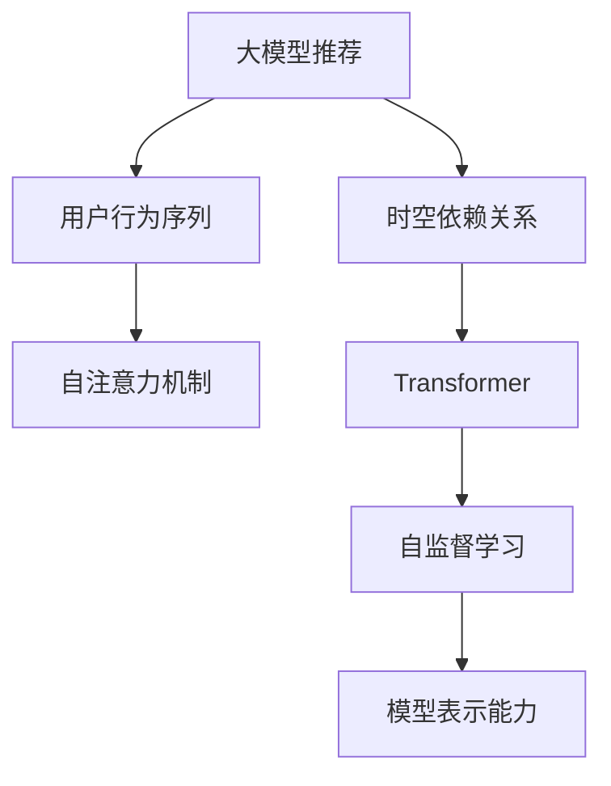

                 

# 大模型推荐中的用户行为序列时空依赖关系建模

> 关键词：大模型推荐、用户行为序列、时空依赖关系、自注意力机制、Transformer、自监督学习

## 1. 背景介绍

随着互联网和移动设备的普及，用户行为数据的海量生成已经成为可能。在大数据时代，如何从用户行为序列中挖掘出有价值的信息，成为推荐系统设计的重要课题。传统的推荐系统通常采用协同过滤、矩阵分解等方法，但这些方法在处理大规模异构数据时，面临着诸如数据稀疏性、冷启动、实时性等挑战。随着深度学习技术的发展，基于大模型的推荐方法应运而生。

大模型推荐方法利用Transformer等架构，通过大规模预训练模型和自监督学习，直接对用户行为序列进行建模，捕捉其中的时空依赖关系，生成推荐内容。该方法已经在电商、音乐、视频等多个领域取得了显著的效果。本文将详细介绍大模型推荐中的用户行为序列时空依赖关系建模方法，包括算法原理、数学模型、项目实践、应用场景等，为相关研究者和从业者提供全面的技术指导。

## 2. 核心概念与联系

### 2.1 核心概念概述

为更好地理解大模型推荐中的用户行为序列时空依赖关系建模方法，本节将介绍几个关键概念：

- **大模型推荐**：以Transformer等架构为代表的深度学习推荐模型，通过在大规模数据上进行自监督预训练，直接对用户行为序列进行建模，生成推荐内容。
- **用户行为序列**：用户在不同时间点的行为记录，如点击、浏览、购买、搜索等，可以表示为时间序列数据。
- **时空依赖关系**：用户行为序列中存在的时间特征和空间特征之间的依赖关系，如前后行为之间的关联性、不同属性之间的相关性。
- **自注意力机制**：Transformer中的关键机制，用于捕捉序列中各部分之间的依赖关系，实现对复杂序列的建模。
- **Transformer**：一种基于自注意力机制的神经网络结构，适合处理序列数据，具有出色的建模能力。
- **自监督学习**：利用未标注数据进行预训练，学习模型的表示能力，提升其在监督学习中的效果。

这些核心概念之间的逻辑关系可以通过以下Mermaid流程图来展示：



这个流程图展示了大模型推荐的核心概念及其之间的关系：

1. 大模型推荐利用自注意力机制对用户行为序列进行建模。
2. 用户行为序列中存在时空依赖关系，需要模型进行捕捉。
3. 自注意力机制在Transformer中实现，能够学习序列中各部分之间的依赖关系。
4. 通过自监督学习提升模型表示能力，使其在监督学习任务中表现更好。

## 3. 核心算法原理 & 具体操作步骤

### 3.1 算法原理概述

大模型推荐中的用户行为序列时空依赖关系建模方法，通过自监督学习预训练一个通用的自注意力模型，然后在此基础上进行微调，以适应特定的推荐任务。其核心思想是：利用用户行为序列的时间特征和空间特征，学习到序列中各部分之间的依赖关系，从而生成推荐的概率分布。

具体而言，假设用户行为序列为 $x_1, x_2, ..., x_T$，其中 $x_t$ 表示第 $t$ 个时刻的行为记录，可以表示为向量形式 $x_t \in \mathbb{R}^d$。目标是根据用户行为序列生成推荐内容 $y$，即 $y \sim P(Y|x_1, x_2, ..., x_T)$。其中 $P(Y|x_1, x_2, ..., x_T)$ 表示在给定用户行为序列 $x_1, x_2, ..., x_T$ 的情况下，推荐内容 $y$ 的概率分布。

为了学习用户行为序列中的时空依赖关系，可以使用自注意力机制，设计一个多层Transformer模型。该模型由多个编码器层和解码器层组成，其中编码器层用于处理输入序列，解码器层用于生成推荐内容。每个层都包含多个多头自注意力机制，用于学习序列中不同部分的依赖关系。

### 3.2 算法步骤详解

大模型推荐中的用户行为序列时空依赖关系建模方法，通常包括以下几个关键步骤：

**Step 1: 准备预训练数据**

- 收集用户行为序列数据，包括点击、浏览、购买等行为记录。
- 对数据进行清洗、归一化、编码等预处理操作。
- 将数据分为训练集、验证集和测试集，以便进行模型评估和调参。

**Step 2: 构建预训练模型**

- 选择Transformer等架构作为基础模型，添加自注意力机制进行序列建模。
- 设计多层的编码器和解码器，增加模型的深度和表示能力。
- 在无标签数据上进行自监督学习，学习模型的表示能力。

**Step 3: 微调模型**

- 在预训练模型基础上，使用监督学习任务对模型进行微调，如分类、回归等。
- 在验证集上评估微调效果，调整模型超参数，如学习率、批大小等。
- 在测试集上评估最终模型性能，对比微调前后的效果提升。

**Step 4: 推理预测**

- 将新的用户行为序列输入模型，生成推荐内容的概率分布。
- 从生成的概率分布中，选择最有可能的推荐内容作为最终推荐结果。

### 3.3 算法优缺点

大模型推荐中的用户行为序列时空依赖关系建模方法，具有以下优点：

1. **高效的建模能力**：自注意力机制能够学习序列中各部分之间的依赖关系，适用于处理复杂的时空序列数据。
2. **灵活的模型架构**：Transformer架构具有可扩展性和通用性，可以应用于多种推荐场景。
3. **自监督预训练**：通过自监督学习提升模型表示能力，减少了监督学习任务的标注成本。

同时，该方法也存在一些缺点：

1. **高计算需求**：由于模型参数量较大，需要较高的计算资源和存储空间。
2. **数据依赖性强**：模型的性能很大程度上依赖于数据质量和数据量，数据的稀疏性和不平衡性可能导致性能下降。
3. **模型复杂度**：多层编码器和解码器的设计使得模型复杂度较高，增加了模型训练和推理的难度。

尽管存在这些局限性，但大模型推荐方法在推荐系统中的应用前景依然广阔，特别是在用户行为序列复杂、数据量巨大的场景下，具有显著的优势。

### 3.4 算法应用领域

大模型推荐方法已经在电商、音乐、视频等多个领域取得了显著的效果，以下是几个典型应用：

- **电商推荐**：通过分析用户点击、浏览、购买行为，推荐商品和优惠活动。
- **音乐推荐**：利用用户的听歌行为序列，推荐相似的音乐和歌手。
- **视频推荐**：根据用户的观看历史和喜好，推荐视频内容和相关频道。
- **新闻推荐**：分析用户的阅读行为，推荐相关的新闻和文章。

## 4. 数学模型和公式 & 详细讲解 & 举例说明

### 4.1 数学模型构建

在大模型推荐中，用户行为序列时空依赖关系建模的数学模型通常采用以下形式：

$$
P(Y|x_1, x_2, ..., x_T) = \sigma (\sum_{t=1}^T a_t x_t)
$$

其中 $\sigma$ 为激活函数，$a_t$ 表示第 $t$ 个时刻的行为记录 $x_t$ 对推荐结果的贡献。模型通过学习 $a_t$ 来捕捉用户行为序列中的时空依赖关系，生成推荐内容。

### 4.2 公式推导过程

为了推导上述模型，我们先定义自注意力机制的注意力权重：

$$
\alpha_{i,j} = \frac{e^{\text{sim}(x_i,x_j)}}{\sum_{k=1}^K e^{\text{sim}(x_i,x_k)}}
$$

其中 $\text{sim}(x_i,x_j)$ 为两个向量 $x_i$ 和 $x_j$ 的相似度函数，通常采用点积形式。$K$ 为序列长度。

在Transformer中，通过多个多头自注意力机制进行序列建模，得到每个时刻的行为记录 $x_t$ 的表示：

$$
x_t = \sum_{k=1}^K \alpha_{t,k} x_k + b_t
$$

其中 $b_t$ 为可训练的偏置向量。

将多个时刻的行为记录表示 $x_1, x_2, ..., x_T$ 输入模型，得到推荐内容 $y$ 的表示 $y_1, y_2, ..., y_T$：

$$
y_t = \sum_{i=1}^T a_i x_i + c_t
$$

其中 $a_i$ 为可训练的系数，$c_t$ 为可训练的偏置向量。

最后，通过输出层的线性变换和激活函数，生成推荐内容的概率分布：

$$
P(Y|x_1, x_2, ..., x_T) = \sigma (\sum_{t=1}^T a_t y_t)
$$

### 4.3 案例分析与讲解

以电商推荐为例，假设用户点击了多个商品，形成了如下行为序列：

- $x_1 = \text{点击商品 A}$
- $x_2 = \text{点击商品 B}$
- $x_3 = \text{购买商品 C}$
- $x_4 = \text{点击商品 D}$
- $x_5 = \text{购买商品 E}$

在电商推荐中，用户购买商品 $C$ 和 $E$ 的行为对后续购买决策具有重要影响，因此模型需要学习到这些行为的贡献。通过自注意力机制，模型可以学习到用户行为序列中的时空依赖关系，生成推荐内容的概率分布。例如，如果模型认为用户对商品 $C$ 和 $E$ 的兴趣更强，则推荐内容 $y$ 的表示中 $a_3$ 和 $a_5$ 的值会更大。

## 5. 项目实践：代码实例和详细解释说明

### 5.1 开发环境搭建

在进行大模型推荐项目实践前，我们需要准备好开发环境。以下是使用Python进行PyTorch开发的环境配置流程：

1. 安装Anaconda：从官网下载并安装Anaconda，用于创建独立的Python环境。

2. 创建并激活虚拟环境：
```bash
conda create -n pytorch-env python=3.8 
conda activate pytorch-env
```

3. 安装PyTorch：根据CUDA版本，从官网获取对应的安装命令。例如：
```bash
conda install pytorch torchvision torchaudio cudatoolkit=11.1 -c pytorch -c conda-forge
```

4. 安装相关库：
```bash
pip install pandas numpy sklearn transformers
```

5. 安装GPU驱动和CUDA工具包：
```bash
conda install nvidia-cuda
```

完成上述步骤后，即可在`pytorch-env`环境中开始项目实践。

### 5.2 源代码详细实现

下面是使用PyTorch实现大模型推荐中的用户行为序列时空依赖关系建模的代码：

```python
import torch
import torch.nn as nn
import torch.nn.functional as F
from torch.utils.data import DataLoader
from sklearn.metrics import accuracy_score
from transformers import TransformerEncoder, TransformerDecoder

# 定义模型
class Recommender(nn.Module):
    def __init__(self, embed_dim=256, num_heads=8, num_layers=6, dropout=0.1):
        super(Recommender, self).__init__()
        self.encoder = TransformerEncoder(embed_dim, num_heads, num_layers, dropout)
        self.decoder = TransformerDecoder(embed_dim, num_heads, num_layers, dropout)
        self.output = nn.Linear(embed_dim, 1)
        
    def forward(self, x):
        x = self.encoder(x)
        x = self.decoder(x)
        x = self.output(x)
        return torch.sigmoid(x)

# 定义训练函数
def train(model, train_loader, optimizer, criterion, device, num_epochs):
    model.train()
    for epoch in range(num_epochs):
        for data, labels in train_loader:
            data, labels = data.to(device), labels.to(device)
            optimizer.zero_grad()
            output = model(data)
            loss = criterion(output, labels)
            loss.backward()
            optimizer.step()
        print(f"Epoch {epoch+1}, loss: {loss.item():.4f}")
    return model

# 定义测试函数
def test(model, test_loader, criterion, device):
    model.eval()
    correct, total = 0, 0
    with torch.no_grad():
        for data, labels in test_loader:
            data, labels = data.to(device), labels.to(device)
            output = model(data)
            correct += (output > 0.5).float().sum().item()
            total += labels.size(0)
    return accuracy_score(labels, (output > 0.5).float())

# 加载数据集
train_dataset = ...
test_dataset = ...

# 划分数据集
train_loader = DataLoader(train_dataset, batch_size=32, shuffle=True)
test_loader = DataLoader(test_dataset, batch_size=32, shuffle=False)

# 选择设备
device = torch.device('cuda' if torch.cuda.is_available() else 'cpu')

# 初始化模型和优化器
model = Recommender()
optimizer = torch.optim.Adam(model.parameters(), lr=1e-3)
criterion = nn.BCEWithLogitsLoss()

# 训练模型
model = train(model, train_loader, optimizer, criterion, device, num_epochs=10)

# 测试模型
test_acc = test(model, test_loader, criterion, device)
print(f"Test accuracy: {test_acc:.4f}")
```

### 5.3 代码解读与分析

让我们再详细解读一下关键代码的实现细节：

**Recommender类**：
- 定义了Transformer编码器和解码器，以及输出层。
- 在`forward`方法中，先通过编码器学习用户行为序列的表示，再通过解码器生成推荐内容的概率分布。

**训练函数train**：
- 在每个epoch内，对训练集进行批处理，计算模型输出与标签之间的交叉熵损失。
- 反向传播更新模型参数，并打印损失值。

**测试函数test**：
- 对测试集进行批处理，计算模型输出与标签之间的交叉熵损失。
- 统计准确率并返回结果。

**数据集划分**：
- 将数据集分为训练集和测试集，分别用于训练和测试模型。

**设备选择**：
- 使用CUDA加速模型训练，如果无CUDA则使用CPU进行训练。

**模型初始化**：
- 初始化模型、优化器和损失函数。

**训练流程**：
- 在训练集上训练模型，并在每个epoch打印损失值。

**测试流程**：
- 在测试集上评估模型性能，输出准确率。

## 6. 实际应用场景

### 6.1 智能电商推荐

智能电商推荐系统可以通过分析用户的点击、浏览、购买行为，实时推荐商品和优惠活动，提升用户体验和购买转化率。在大模型推荐中，用户行为序列通常包含用户的浏览记录、点击记录、购买记录等信息。通过建模用户行为序列的时空依赖关系，电商推荐系统可以捕捉到用户对不同商品之间的兴趣关联，从而生成更加个性化的推荐内容。

### 6.2 视频内容推荐

视频内容推荐系统通过分析用户的观看历史和偏好，推荐相关的视频内容和频道。在大模型推荐中，用户行为序列通常包含用户的观看记录、点赞记录、评论记录等信息。通过建模用户行为序列的时空依赖关系，视频推荐系统可以捕捉到用户对不同视频之间的兴趣关联，从而生成更加多样化的推荐内容。

### 6.3 新闻内容推荐

新闻内容推荐系统通过分析用户的阅读行为，推荐相关的新闻和文章。在大模型推荐中，用户行为序列通常包含用户的阅读记录、评论记录、分享记录等信息。通过建模用户行为序列的时空依赖关系，新闻推荐系统可以捕捉到用户对不同新闻之间的兴趣关联，从而生成更加时效性和个性化的新闻推荐。

### 6.4 未来应用展望

随着深度学习技术的发展，大模型推荐方法将在更多领域得到应用，为传统行业带来变革性影响。

在智慧医疗领域，基于大模型推荐的方法可以用于推荐个性化的治疗方案和药物，提升医疗服务的智能化水平。

在智慧教育领域，推荐系统可以根据学生的学习行为，推荐个性化的学习资源和课程，因材施教，促进教育公平。

在智慧城市治理中，推荐系统可以根据市民的出行行为，推荐最佳的出行路线和交通方式，提高城市管理的智能化水平。

此外，在企业生产、社会治理、文娱传媒等众多领域，基于大模型推荐的人工智能应用也将不断涌现，为经济社会发展注入新的动力。相信随着技术的日益成熟，大模型推荐方法必将在构建人机协同的智能时代中扮演越来越重要的角色。

## 7. 工具和资源推荐

### 7.1 学习资源推荐

为了帮助开发者系统掌握大模型推荐中的用户行为序列时空依赖关系建模方法，这里推荐一些优质的学习资源：

1. 《深度学习与推荐系统》系列博文：由大模型技术专家撰写，深入浅出地介绍了深度学习在推荐系统中的应用。

2. 《推荐系统实战》书籍：介绍了推荐系统的经典算法和实际应用，结合代码实例，易于理解。

3. CS234《深度学习中的推荐系统》课程：斯坦福大学开设的推荐系统课程，包含大量推荐系统的经典算法和实际案例。

4. 《推荐系统基础》书籍：详细介绍了推荐系统的基本概念和算法，适合初学者学习。

5. TensorFlow官网上推荐系统相关资源：提供大量推荐系统算法的实现代码和案例。

通过对这些资源的学习实践，相信你一定能够快速掌握大模型推荐中的用户行为序列时空依赖关系建模方法，并用于解决实际的推荐问题。

### 7.2 开发工具推荐

高效的开发离不开优秀的工具支持。以下是几款用于大模型推荐开发的常用工具：

1. PyTorch：基于Python的开源深度学习框架，灵活动态的计算图，适合快速迭代研究。

2. TensorFlow：由Google主导开发的开源深度学习框架，生产部署方便，适合大规模工程应用。

3. Transformers库：HuggingFace开发的NLP工具库，集成了众多预训练语言模型，支持PyTorch和TensorFlow，是进行推荐任务开发的利器。

4. Weights & Biases：模型训练的实验跟踪工具，可以记录和可视化模型训练过程中的各项指标，方便对比和调优。

5. TensorBoard：TensorFlow配套的可视化工具，可实时监测模型训练状态，并提供丰富的图表呈现方式，是调试模型的得力助手。

合理利用这些工具，可以显著提升大模型推荐任务的开发效率，加快创新迭代的步伐。

### 7.3 相关论文推荐

大模型推荐中的用户行为序列时空依赖关系建模方法源于学界的持续研究。以下是几篇奠基性的相关论文，推荐阅读：

1. Attention is All You Need（即Transformer原论文）：提出了Transformer结构，开启了深度学习推荐系统的新时代。

2. TextRank: Bring Order into Texts：介绍了TextRank算法，用于文本排序和摘要生成，具有一定的推荐价值。

3. Collaborative Filtering for Implicit Feedback Datasets：提出了协同过滤算法，通过用户行为数据进行推荐。

4. Factorization Machines: Feature Interactions for Personalized Ranking：提出了矩阵分解算法，通过用户行为数据进行推荐。

5. Deep Neural Network Recommendation with Implicit Feedback：提出了深度学习推荐模型，通过用户行为数据进行推荐。

这些论文代表了大模型推荐技术的发展脉络。通过学习这些前沿成果，可以帮助研究者把握学科前进方向，激发更多的创新灵感。

## 8. 总结：未来发展趋势与挑战

### 8.1 总结

本文对大模型推荐中的用户行为序列时空依赖关系建模方法进行了全面系统的介绍。首先阐述了大模型推荐和用户行为序列时空依赖关系建模的研究背景和意义，明确了大模型推荐在推荐系统中的独特价值。其次，从原理到实践，详细讲解了大模型推荐方法的数学模型和算法步骤，给出了大模型推荐任务开发的完整代码实例。同时，本文还广泛探讨了大模型推荐方法在智能电商、视频推荐、新闻推荐等多个领域的应用前景，展示了其广泛的应用价值。最后，本文精选了大模型推荐技术的学习资源、开发工具和相关论文，力求为读者提供全方位的技术指导。

通过本文的系统梳理，可以看到，大模型推荐方法正在成为推荐系统中的重要范式，极大地拓展了推荐模型的应用边界，催生了更多的落地场景。受益于大规模语料的预训练，大模型推荐方法在推荐系统中的应用前景依然广阔，特别是在用户行为序列复杂、数据量巨大的场景下，具有显著的优势。未来，伴随深度学习技术的发展和推荐系统研究的不断深入，大模型推荐必将在更多领域得到应用，为经济社会发展注入新的动力。

### 8.2 未来发展趋势

展望未来，大模型推荐中的用户行为序列时空依赖关系建模方法将呈现以下几个发展趋势：

1. **模型规模持续增大**：随着算力成本的下降和数据规模的扩张，大模型推荐方法的模型规模将持续增长，能够学习更加复杂的时空依赖关系。

2. **算法多样性增加**：除了传统的Transformer结构外，未来将涌现更多基于Transformer的结构和算法，如Transformer-XL、Linformer等，进一步提升推荐系统的性能。

3. **多模态融合**：将用户行为序列与图像、视频、语音等多模态数据融合，提升推荐系统的综合感知能力。

4. **跨领域应用拓展**：大模型推荐方法不仅应用于电商、音乐、视频等传统领域，还将拓展到医疗、教育、金融等更多垂直行业，提升这些行业的智能化水平。

5. **个性化推荐优化**：通过引入更多的个性化特征和推荐策略，提升推荐系统的针对性和有效性。

6. **隐私保护与安全性增强**：在推荐系统中加入隐私保护和安全性设计，确保用户数据和模型的安全。

以上趋势凸显了大模型推荐技术的发展前景，这些方向的探索发展，必将进一步提升推荐系统的性能和应用范围，为经济社会发展注入新的动力。

### 8.3 面临的挑战

尽管大模型推荐中的用户行为序列时空依赖关系建模方法已经取得了显著效果，但在迈向更加智能化、普适化应用的过程中，它仍面临着诸多挑战：

1. **数据质量与多样性**：推荐系统的性能很大程度上依赖于数据的质量和多样性，数据的稀疏性和不平衡性可能导致性能下降。如何从用户行为序列中挖掘更多的有用信息，是一个重要的研究方向。

2. **计算资源需求**：大模型推荐方法需要较大的计算资源和存储空间，如何优化模型的计算图和压缩模型参数，是未来需要解决的问题。

3. **模型复杂度与可解释性**：多层编码器和解码器的设计使得模型复杂度较高，模型的决策过程缺乏可解释性，难以理解模型的内部工作机制。如何降低模型复杂度，增强模型的可解释性，是一个重要的研究方向。

4. **用户隐私保护**：推荐系统中涉及用户行为数据的隐私保护问题，如何平衡推荐效果和隐私保护，是未来需要解决的问题。

5. **跨领域适应性**：大模型推荐方法在跨领域推荐任务中的适应性不足，如何提升模型在跨领域推荐中的表现，是未来需要解决的问题。

6. **动态实时性**：推荐系统需要实时处理用户行为数据，并及时更新推荐结果，如何提升推荐系统的动态实时性，是未来需要解决的问题。

这些挑战将在大模型推荐技术的发展中不断显现，需要学界和产业界的共同努力，才能攻克这些难题，实现大模型推荐技术的全面落地。

### 8.4 研究展望

面对大模型推荐技术所面临的挑战，未来的研究需要在以下几个方面寻求新的突破：

1. **自监督预训练**：通过自监督学习提升模型的表示能力，减少监督学习任务的标注成本。

2. **多模态融合**：将用户行为序列与图像、视频、语音等多模态数据融合，提升推荐系统的综合感知能力。

3. **跨领域适应性**：通过迁移学习、领域自适应等技术，提升模型在跨领域推荐中的表现。

4. **模型压缩与优化**：通过量化、剪枝等技术，优化模型的计算图和压缩模型参数，提升模型的实时性和可部署性。

5. **隐私保护与安全性**：在推荐系统中加入隐私保护和安全性设计，确保用户数据和模型的安全。

6. **动态实时性**：通过流计算、增量学习等技术，提升推荐系统的动态实时性，满足实时推荐的需求。

这些研究方向的探索，必将引领大模型推荐技术迈向更高的台阶，为推荐系统带来新的突破。只有勇于创新、敢于突破，才能不断拓展推荐系统的边界，实现更加智能化、普适化的推荐服务。

## 9. 附录：常见问题与解答

**Q1：大模型推荐中的用户行为序列时空依赖关系建模是否适用于所有推荐场景？**

A: 大模型推荐中的用户行为序列时空依赖关系建模方法适用于多种推荐场景，尤其是用户行为序列复杂、数据量巨大的场景。但对于一些特别简单或特定的推荐任务，传统推荐算法（如协同过滤、矩阵分解等）可能更有效。

**Q2：大模型推荐中的用户行为序列时空依赖关系建模的计算复杂度如何？**

A: 大模型推荐方法计算复杂度较高，需要较大的计算资源和存储空间。主要计算开销来自于Transformer编码器和解码器中的自注意力机制，计算复杂度为 $O(n^2)$，其中 $n$ 为序列长度。但可以通过优化模型结构、减少序列长度等方法，降低计算复杂度。

**Q3：大模型推荐中的用户行为序列时空依赖关系建模的优化方法有哪些？**

A: 大模型推荐中的用户行为序列时空依赖关系建模的优化方法包括：
1. 数据增强：通过回译、近义替换等方式扩充训练集。
2. 正则化：使用L2正则、Dropout、Early Stopping等避免过拟合。
3. 对抗训练：引入对抗样本，提高模型鲁棒性。
4. 参数高效微调：只调整少量参数(如Adapter、Prefix等)，减小过拟合风险。
5. 多模型集成：训练多个推荐模型，取平均输出，抑制过拟合。

这些优化方法需要根据具体任务和数据特点进行灵活组合。只有在数据、模型、训练、推理等各环节进行全面优化，才能最大限度地发挥大模型推荐的优势。

**Q4：大模型推荐中的用户行为序列时空依赖关系建模在实际应用中需要注意哪些问题？**

A: 大模型推荐中的用户行为序列时空依赖关系建模在实际应用中需要注意以下问题：
1. 数据质量与多样性：推荐系统的性能很大程度上依赖于数据的质量和多样性，数据的稀疏性和不平衡性可能导致性能下降。如何从用户行为序列中挖掘更多的有用信息，是一个重要的研究方向。
2. 计算资源需求：大模型推荐方法需要较大的计算资源和存储空间，如何优化模型的计算图和压缩模型参数，是未来需要解决的问题。
3. 模型复杂度与可解释性：多层编码器和解码器的设计使得模型复杂度较高，模型的决策过程缺乏可解释性，难以理解模型的内部工作机制。如何降低模型复杂度，增强模型的可解释性，是一个重要的研究方向。
4. 用户隐私保护：推荐系统中涉及用户行为数据的隐私保护问题，如何平衡推荐效果和隐私保护，是未来需要解决的问题。
5. 跨领域适应性：大模型推荐方法在跨领域推荐任务中的适应性不足，如何提升模型在跨领域推荐中的表现，是未来需要解决的问题。
6. 动态实时性：推荐系统需要实时处理用户行为数据，并及时更新推荐结果，如何提升推荐系统的动态实时性，是未来需要解决的问题。

这些挑战将在大模型推荐技术的发展中不断显现，需要学界和产业界的共同努力，才能攻克这些难题，实现大模型推荐技术的全面落地。

---

作者：禅与计算机程序设计艺术 / Zen and the Art of Computer Programming

