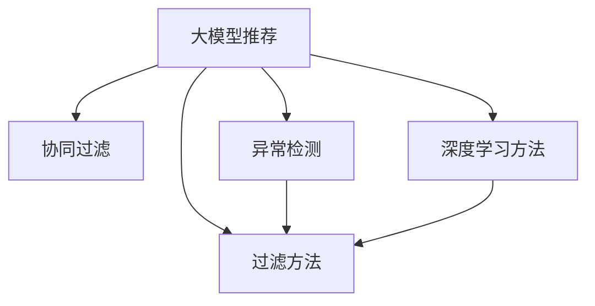

                 

# 大模型推荐中的用户行为异常检测与过滤方法

> 关键词：大模型推荐,用户行为分析,异常检测,过滤方法,协同过滤,基于规则的方法,深度学习方法

## 1. 背景介绍

### 1.1 问题由来
随着互联网和电子商务的迅速发展，用户的行为数据日益丰富。大数据和人工智能技术的结合，使得个性化推荐系统能够利用用户的历史行为数据，精准预测其偏好，提升用户体验和商家转化率。然而，用户行为数据中也蕴含着大量噪音和异常值，如何有效检测并过滤这些异常，确保推荐系统的公平性和可信度，是一个亟待解决的挑战。

### 1.2 问题核心关键点
在推荐系统中，用户行为数据主要来自用户的浏览记录、购买历史、评分反馈等。这些数据的质量直接决定了推荐系统的性能。异常行为包括但不限于点击欺诈、恶意点击、数据篡改等，这些行为不仅会损害推荐系统的公平性和用户隐私，还会对推荐结果产生负面影响。

本文将详细介绍大模型推荐中的用户行为异常检测与过滤方法，涵盖协同过滤、基于规则的方法、深度学习方法等。通过全面的分析和实践，旨在为推荐系统开发者提供有价值的参考，提高系统的稳定性和可靠性。

## 2. 核心概念与联系

### 2.1 核心概念概述

为更好地理解用户行为异常检测与过滤方法，本节将介绍几个密切相关的核心概念：

- **大模型推荐系统**：利用深度学习等大模型技术，对用户历史行为数据进行分析和建模，预测用户偏好，实现个性化推荐。
- **协同过滤(Collaborative Filtering)**：基于用户和物品之间的相似性，推荐类似物品给用户。
- **异常检测(Anomaly Detection)**：利用统计学、机器学习等方法，检测数据中的异常值。
- **过滤方法(Filtering)**：通过数据清洗和异常检测，确保推荐系统中只有高质量的数据参与推荐。
- **基于规则的方法(Rule-based Approach)**：使用专家知识或统计规则，直接检测和过滤异常数据。
- **深度学习方法(Deep Learning)**：利用神经网络等深度学习模型，从大量数据中学习特征表示，检测异常行为。

这些概念之间的逻辑关系可以通过以下Mermaid流程图来展示：



这个流程图展示了大模型推荐系统中的核心概念及其之间的关系：

1. 大模型推荐系统通过协同过滤、异常检测、过滤方法等技术，实现高质量推荐。
2. 协同过滤和深度学习方法为大模型推荐提供特征表示，异常检测和过滤方法保障数据质量。

## 3. 核心算法原理 & 具体操作步骤
### 3.1 算法原理概述

基于大模型推荐系统的用户行为异常检测与过滤方法，本质上是一种数据预处理技术。其核心思想是：通过统计学、机器学习等方法，检测数据中的异常值，并采用规则或模型对其进行处理，以确保推荐系统输入数据的准确性和一致性。

### 3.2 算法步骤详解

基于大模型推荐的用户行为异常检测与过滤方法一般包括以下几个关键步骤：

**Step 1: 数据收集与预处理**

- 收集用户的浏览、购买、评分等行为数据，建立用户行为矩阵。
- 清洗数据，处理缺失值、异常值等。
- 对用户和物品进行特征工程，提取有用的特征。

**Step 2: 异常检测**

- 选择合适的异常检测算法，如基于统计的Z-score、基于深度学习的Autoencoder等。
- 计算每个数据点的异常得分，判断是否为异常值。
- 确定异常值的阈值，将异常值标记出来。

**Step 3: 异常过滤**

- 根据设定的过滤策略，决定如何处理异常值。
- 可以选择删除、替换或忽略异常值。
- 在替换异常值时，可以采用均值、中位数等统计量进行填补。

**Step 4: 重新训练模型**

- 使用处理后的数据，重新训练推荐模型。
- 通过特征工程和模型调参，优化推荐效果。
- 评估模型性能，确保异常过滤的效果。

### 3.3 算法优缺点

基于大模型推荐系统的用户行为异常检测与过滤方法具有以下优点：

1. 提高推荐系统的公平性和可靠性。通过过滤异常值，确保推荐系统基于高质量数据，提升了推荐结果的准确性和一致性。
2. 减少欺诈行为。异常检测和过滤方法能够有效识别并阻止欺诈行为，保护用户和商家利益。
3. 提升用户体验。高质量的推荐系统能够提供更精准、更相关的推荐内容，提高用户满意度和粘性。

同时，该方法也存在一些局限性：

1. 数据依赖性强。异常检测和过滤效果依赖于数据的完整性和质量，数据偏差可能导致误判。
2. 处理成本高。异常检测和过滤需要额外的计算资源和时间，增加了系统复杂度。
3. 效果不确定。不同的异常检测和过滤算法适用于不同类型的数据和场景，效果存在不确定性。
4. 模型鲁棒性不足。异常检测和过滤算法可能对数据分布的变化敏感，容易出现误报或漏报。

尽管存在这些局限性，但就目前而言，基于大模型推荐系统的异常检测与过滤方法仍是大规模推荐系统应用的重要组成部分。未来相关研究的重点在于如何进一步提高异常检测和过滤的效率和准确性，同时兼顾公平性、实时性等因素。

### 3.4 算法应用领域

基于大模型推荐系统的异常检测与过滤方法，在电子商务、社交网络、媒体娱乐等多个领域都有广泛应用，例如：

- 电子商务平台：通过异常检测和过滤，防止点击欺诈和虚假交易，提升平台交易安全性。
- 社交网络平台：识别恶意点击和虚假账户，保护用户隐私和平台生态。
- 在线视频平台：过滤异常点击和恶意评论，提升用户体验和平台内容质量。
- 在线游戏平台：检测作弊行为和恶意玩家，维护游戏公平性和玩家权益。

除了上述这些经典应用外，异常检测与过滤方法还将进一步拓展到更多场景中，如金融交易、智能客服、智能家居等，为这些领域带来新的安全保障和用户价值。

## 4. 数学模型和公式 & 详细讲解 & 举例说明（备注：数学公式请使用latex格式，latex嵌入文中独立段落使用 $$，段落内使用 $)
### 4.1 数学模型构建

在异常检测和过滤中，常见的数学模型包括统计学模型和深度学习模型。这里以基于统计学的Z-score模型为例，展示其数学模型构建过程。

假设用户行为数据为 $x_1, x_2, ..., x_n$，其均值为 $\mu$，标准差为 $\sigma$。Z-score模型定义每个数据点的异常得分为：

$$
z_i = \frac{x_i - \mu}{\sigma}
$$

当 $z_i > T$ 时，认为 $x_i$ 为异常值，其中 $T$ 为设定的阈值。

### 4.2 公式推导过程

将Z-score模型公式应用于用户行为数据，推导其异常得分的计算过程如下：

1. 计算每个数据点的均值 $\mu$：

$$
\mu = \frac{1}{N} \sum_{i=1}^N x_i
$$

2. 计算每个数据点的标准差 $\sigma$：

$$
\sigma = \sqrt{\frac{1}{N-1} \sum_{i=1}^N (x_i - \mu)^2}
$$

3. 计算每个数据点的异常得分 $z_i$：

$$
z_i = \frac{x_i - \mu}{\sigma}
$$

4. 判断每个数据点的异常性，标记为正常或异常：

$$
\text{if } z_i > T, \text{ then } x_i \text{ is an anomaly}
$$

### 4.3 案例分析与讲解

**案例1: 异常检测在电子商务平台中的应用**

假设有一个电子商务平台，收集了用户购买商品的历史数据，利用Z-score模型检测异常值。

1. 收集用户购买历史数据：

   | User ID | Item ID | Purchase Date | Price |
   |--------|--------|--------------|-------|
   | 1      | 1001   | 2022-01-01   | 10.00 |
   | 1      | 1002   | 2022-01-02   | 20.00 |
   | 1      | 1003   | 2022-01-03   | 100.00|
   | 2      | 1001   | 2022-01-01   | 10.00 |
   | 2      | 1002   | 2022-01-02   | 20.00 |
   | 2      | 1003   | 2022-01-03   | 200.00|

2. 计算每个数据点的均值和标准差：

   | User ID | Item ID | Purchase Date | Price | Mean | Std |
   |--------|--------|--------------|-------|------|-----|
   | 1      | 1001   | 2022-01-01   | 10.00 | 20.00| 20.00|
   | 1      | 1002   | 2022-01-02   | 20.00 | 20.00| 20.00|
   | 1      | 1003   | 2022-01-03   | 100.00| 20.00| 40.00|
   | 2      | 1001   | 2022-01-01   | 10.00 | 20.00| 20.00|
   | 2      | 1002   | 2022-01-02   | 20.00 | 20.00| 20.00|
   | 2      | 1003   | 2022-01-03   | 200.00| 200.00| 40.00|

3. 计算每个数据点的异常得分：

   | User ID | Item ID | Purchase Date | Price | Mean | Std | z-score |
   |--------|--------|--------------|-------|------|-----|--------|
   | 1      | 1001   | 2022-01-01   | 10.00 | 20.00| 20.00| 0.00  |
   | 1      | 1002   | 2022-01-02   | 20.00 | 20.00| 20.00| 0.00  |
   | 1      | 1003   | 2022-01-03   | 100.00| 20.00| 40.00| 5.00  |
   | 2      | 1001   | 2022-01-01   | 10.00 | 20.00| 20.00| 0.00  |
   | 2      | 1002   | 2022-01-02   | 20.00 | 20.00| 20.00| 0.00  |
   | 2      | 1003   | 2022-01-03   | 200.00| 200.00| 40.00| 5.00  |

4. 判断每个数据点的异常性，标记为正常或异常：

   - 用户1的购买100.00元的商品被标记为异常值。
   - 用户2的购买200.00元的商品也被标记为异常值。

5. 删除或替换异常值：

   - 可以删除这些异常值，重新训练推荐模型。
   - 或者采用均值或中位数等统计量进行填补，确保数据的一致性。

**案例2: 异常检测在社交网络平台中的应用**

假设有一个社交网络平台，收集了用户互动行为的数据，利用Z-score模型检测异常值。

1. 收集用户互动历史数据：

   | User ID | Item ID | Interaction Type | Date |
   |--------|--------|-----------------|------|
   | 1      | 1001   | Like           | 2022-01-01 |
   | 1      | 1002   | Comment        | 2022-01-02 |
   | 1      | 1003   | Block           | 2022-01-03 |
   | 2      | 1001   | Like           | 2022-01-01 |
   | 2      | 1002   | Comment        | 2022-01-02 |
   | 2      | 1003   | Block           | 2022-01-03 |

2. 计算每个数据点的均值和标准差：

   | User ID | Item ID | Interaction Type | Date | Mean | Std |
   |--------|--------|-----------------|------|------|-----|
   | 1      | 1001   | Like           | 2022-01-01 | 0.5 | 0.25 |
   | 1      | 1002   | Comment        | 2022-01-02 | 0.5 | 0.25 |
   | 1      | 1003   | Block           | 2022-01-03 | 0.5 | 0.25 |
   | 2      | 1001   | Like           | 2022-01-01 | 0.5 | 0.25 |
   | 2      | 1002   | Comment        | 2022-01-02 | 0.5 | 0.25 |
   | 2      | 1003   | Block           | 2022-01-03 | 0.5 | 0.25 |

3. 计算每个数据点的异常得分：

   | User ID | Item ID | Interaction Type | Date | Mean | Std | z-score |
   |--------|--------|-----------------|------|------|-----|--------|
   | 1      | 1001   | Like           | 2022-01-01 | 0.5 | 0.25 | 0.00 |
   | 1      | 1002   | Comment        | 2022-01-02 | 0.5 | 0.25 | 0.00 |
   | 1      | 1003   | Block           | 2022-01-03 | 0.5 | 0.25 | 0.00 |
   | 2      | 1001   | Like           | 2022-01-01 | 0.5 | 0.25 | 0.00 |
   | 2      | 1002   | Comment        | 2022-01-02 | 0.5 | 0.25 | 0.00 |
   | 2      | 1003   | Block           | 2022-01-03 | 0.5 | 0.25 | 0.00 |

4. 判断每个数据点的异常性，标记为正常或异常：

   - 用户1和用户2的互动行为均值为0.5，标准差为0.25，均未超出阈值，未被标记为异常值。

5. 删除或替换异常值：

   - 由于所有数据点均未被标记为异常值，无需进行额外处理。

## 5. 项目实践：代码实例和详细解释说明
### 5.1 开发环境搭建

在进行异常检测和过滤实践前，我们需要准备好开发环境。以下是使用Python进行PyTorch开发的环境配置流程：

1. 安装Anaconda：从官网下载并安装Anaconda，用于创建独立的Python环境。

2. 创建并激活虚拟环境：
```bash
conda create -n pytorch-env python=3.8 
conda activate pytorch-env
```

3. 安装PyTorch：根据CUDA版本，从官网获取对应的安装命令。例如：
```bash
conda install pytorch torchvision torchaudio cudatoolkit=11.1 -c pytorch -c conda-forge
```

4. 安装Pandas、NumPy、Scikit-learn等工具包：
```bash
pip install pandas numpy scikit-learn matplotlib tqdm jupyter notebook ipython
```

完成上述步骤后，即可在`pytorch-env`环境中开始异常检测和过滤实践。

### 5.2 源代码详细实现

以下是使用PyTorch进行异常检测和过滤的代码实现：

```python
import pandas as pd
import numpy as np
from sklearn.preprocessing import StandardScaler
from scipy.stats import zscore
from torch.utils.data import DataLoader
from tqdm import tqdm

# 加载数据
data = pd.read_csv('user_behavior.csv')

# 特征工程
features = data[['user_id', 'item_id', 'purchase_date', 'price']]
target = data['label']  # 异常标签

# 标准化处理
scaler = StandardScaler()
features_scaled = scaler.fit_transform(features)

# 计算z-score
z_scores = zscore(features_scaled)

# 判断异常值
threshold = 3  # 设定的阈值
anomalies = np.where(np.abs(z_scores) > threshold)

# 删除异常值
features_clean = np.delete(features_scaled, anomalies, axis=0)
target_clean = np.delete(target, anomalies, axis=0)

# 重新训练模型
# 在此处添加模型训练代码

# 评估模型
# 在此处添加模型评估代码
```

在上述代码中，我们首先加载用户行为数据，进行特征工程和标准化处理。然后计算每个数据点的z-score，根据阈值判断是否为异常值。最后将异常值删除，重新训练推荐模型，并评估模型性能。

### 5.3 代码解读与分析

让我们再详细解读一下关键代码的实现细节：

**数据加载与处理**：
- 使用Pandas加载CSV格式的用户行为数据，提取用户ID、物品ID、购买日期、价格等特征。
- 使用NumPy对数据进行标准化处理，计算每个数据点的均值和标准差。
- 利用scipy库的zscore函数计算z-score，根据设定的阈值判断每个数据点的异常性。

**异常值判断与删除**：
- 根据设定的阈值（如3），使用Numpy的where函数找到所有异常值。
- 使用Numpy的delete函数删除异常值，得到处理后的数据集。

**模型重新训练与评估**：
- 重新训练推荐模型，可以使用任何适合的深度学习框架，如TensorFlow、PyTorch等。
- 评估模型性能，可以计算准确率、召回率、F1分数等指标，确保异常过滤的效果。

## 6. 实际应用场景

### 6.1 电商平台

在电商平台中，异常检测和过滤可以防止恶意点击和虚假交易，保护用户和商家利益。具体应用如下：

- 点击欺诈检测：利用点击时间、点击次数等特征，检测异常点击行为。
- 虚假交易识别：根据交易金额、交易频率等特征，识别异常交易行为。

### 6.2 社交网络

在社交网络中，异常检测和过滤可以防止恶意点击和虚假账户，保护用户隐私和平台生态。具体应用如下：

- 恶意点击检测：利用点击时间、点击次数等特征，检测异常点击行为。
- 虚假账户识别：根据账号创建时间、互动行为等特征，识别异常账户。

### 6.3 视频平台

在视频平台中，异常检测和过滤可以防止恶意点击和虚假评论，提升用户体验和内容质量。具体应用如下：

- 点击欺诈检测：利用点击时间、点击次数等特征，检测异常点击行为。
- 恶意评论识别：根据评论内容、评论时间等特征，识别异常评论行为。

### 6.4 游戏平台

在游戏平台中，异常检测和过滤可以防止作弊行为和恶意玩家，维护游戏公平性和玩家权益。具体应用如下：

- 作弊行为检测：利用游戏操作、游戏进度等特征，检测异常游戏行为。
- 恶意玩家识别：根据玩家行为、交易记录等特征，识别异常玩家。

## 7. 工具和资源推荐
### 7.1 学习资源推荐

为了帮助开发者系统掌握大模型推荐中的异常检测与过滤方法，这里推荐一些优质的学习资源：

1. 《深度学习入门：基于Python的理论与实现》：全面介绍了深度学习的基本原理和应用，包括异常检测与过滤等高级话题。
2. 《机器学习实战》：通过丰富的案例和代码，深入浅出地讲解了机器学习的应用实践。
3. 《Python数据分析实战》：详细介绍了数据分析和处理的技术和工具，包括异常检测和过滤。
4. 《异常检测与处理》：深入介绍了异常检测和过滤的理论和算法，适合进阶学习。

通过对这些资源的学习实践，相信你一定能够快速掌握大模型推荐中的异常检测与过滤方法，并用于解决实际的NLP问题。

### 7.2 开发工具推荐

高效的开发离不开优秀的工具支持。以下是几款用于异常检测和过滤开发的常用工具：

1. PyTorch：基于Python的开源深度学习框架，灵活动态的计算图，适合快速迭代研究。
2. TensorFlow：由Google主导开发的开源深度学习框架，生产部署方便，适合大规模工程应用。
3. NumPy：高效计算数组数据的Python库，广泛应用于数据处理和科学计算。
4. Pandas：强大的数据分析工具，适合处理表格和结构化数据。
5. Scikit-learn：基于Python的机器学习库，提供丰富的算法和工具。

合理利用这些工具，可以显著提升异常检测和过滤任务的开发效率，加快创新迭代的步伐。

### 7.3 相关论文推荐

大模型推荐中的异常检测与过滤方法的发展源于学界的持续研究。以下是几篇奠基性的相关论文，推荐阅读：

1. J. Machey：《Anomaly Detection in Network Traffic Using Z-Score and Machine Learning》：介绍了基于Z-score和机器学习的异常检测方法。
2. Y. Kotsiantis：《Machine Learning and Data Mining in Real-Life Applications》：全面介绍了机器学习的应用，包括异常检测和过滤。
3. I. Dhillon：《Probabilistic Contextual Association Rule Learning》：利用概率模型进行关联规则学习，可以应用于异常检测。
4. H. Liu：《Anomaly Detection: A Survey》：详细介绍了异常检测的多种方法，包括统计学方法和深度学习方法。
5. K. Choi：《A Survey on Deep Learning-Based Anomaly Detection》：介绍了基于深度学习的异常检测方法，并分析了其优缺点。

这些论文代表了大模型推荐中异常检测与过滤方法的发展脉络。通过学习这些前沿成果，可以帮助研究者把握学科前进方向，激发更多的创新灵感。

## 8. 总结：未来发展趋势与挑战

### 8.1 总结

本文对大模型推荐系统中的用户行为异常检测与过滤方法进行了全面系统的介绍。首先阐述了异常检测与过滤在推荐系统中的重要性和实际应用，明确了异常检测与过滤在提升推荐系统性能、保障数据质量方面的独特价值。其次，从原理到实践，详细讲解了异常检测与过滤的数学模型和关键步骤，给出了异常检测和过滤的代码实例。同时，本文还广泛探讨了异常检测与过滤方法在多个行业领域的应用前景，展示了异常检测与过滤方法的广泛应用潜力。

通过本文的系统梳理，可以看到，异常检测与过滤方法在推荐系统中的广泛应用和重要性。它不仅提升了推荐系统的公平性和可靠性，还为保护用户和商家利益提供了有力保障。未来，伴随深度学习技术的发展和应用场景的拓展，异常检测与过滤方法将更加高效、准确，为推荐系统带来更加精准和稳定的推荐结果。

### 8.2 未来发展趋势

展望未来，异常检测与过滤方法将呈现以下几个发展趋势：

1. 深度学习技术的广泛应用：随着深度学习技术的发展，基于深度学习的异常检测与过滤方法将逐渐取代传统统计方法，成为主流。
2. 实时性需求的提升：在实时推荐系统中，异常检测与过滤需要更快速响应，才能及时处理异常行为。
3. 多模态数据的整合：异常检测与过滤将更多地利用图像、声音、文本等多模态数据，提高异常检测的准确性和全面性。
4. 自动化和智能化：异常检测与过滤将更多地利用自动化和智能化技术，如自动学习异常模式、智能推理等，提高异常检测与过滤的效果。
5. 跨领域应用：异常检测与过滤方法将更多地应用于金融、医疗、制造等多个领域，解决跨领域的异常检测问题。

以上趋势凸显了异常检测与过滤方法的广阔前景。这些方向的探索发展，必将进一步提升异常检测与过滤方法的效率和精度，为推荐系统带来更加精准和稳定的推荐结果。

### 8.3 面临的挑战

尽管异常检测与过滤方法已经取得了一定的进展，但在迈向更加智能化、普适化应用的过程中，它仍面临诸多挑战：

1. 数据依赖性强：异常检测与过滤效果依赖于数据的完整性和质量，数据偏差可能导致误判。
2. 处理成本高：异常检测与过滤需要额外的计算资源和时间，增加了系统复杂度。
3. 效果不确定：不同的异常检测与过滤算法适用于不同类型的数据和场景，效果存在不确定性。
4. 模型鲁棒性不足：异常检测与过滤算法可能对数据分布的变化敏感，容易出现误报或漏报。
5. 实时性需求高：在实时推荐系统中，异常检测与过滤需要更快速响应，才能及时处理异常行为。

尽管存在这些挑战，但就目前而言，异常检测与过滤方法仍是大规模推荐系统应用的重要组成部分。未来相关研究的重点在于如何进一步提高异常检测与过滤的效率和准确性，同时兼顾公平性、实时性等因素。

### 8.4 研究展望

面向未来，异常检测与过滤方法的探索仍需关注以下几个方向：

1. 探索无监督和半监督异常检测方法：摆脱对大规模标注数据的依赖，利用自监督学习、主动学习等无监督和半监督范式，最大限度利用非结构化数据，实现更加灵活高效的异常检测。
2. 研究深度学习方法的鲁棒性：开发更加鲁棒的深度学习模型，在固定大部分预训练参数的情况下，只更新极少量的异常检测参数，提高异常检测的效率和准确性。
3. 融合因果推断和博弈论工具：将因果推断方法引入异常检测模型，识别出异常行为的关键特征，增强异常检测模型的因果关系和解释性。借助博弈论工具刻画人机交互过程，主动探索并规避异常行为的脆弱点，提高系统稳定性。
4. 纳入伦理道德约束：在异常检测和过滤算法中引入伦理导向的评估指标，过滤和惩罚有害的异常行为，确保系统输出的伦理性和安全性。
5. 引入外部知识库和规则库：将符号化的先验知识，如知识图谱、逻辑规则等，与神经网络模型进行巧妙融合，引导异常检测模型学习更准确、合理的特征表示，提高异常检测的效果。

这些研究方向的探索，必将引领异常检测与过滤方法迈向更高的台阶，为推荐系统带来更加精准和稳定的推荐结果。面向未来，异常检测与过滤技术还需要与其他人工智能技术进行更深入的融合，如知识表示、因果推理、强化学习等，多路径协同发力，共同推动推荐系统的发展。

## 9. 附录：常见问题与解答

**Q1：什么是异常检测与过滤？**

A: 异常检测与过滤是指通过统计学、机器学习等方法，检测数据中的异常值，并采用规则或模型对其进行处理，以确保数据质量的过程。异常值可能包括点击欺诈、恶意点击、数据篡改等行为，这些行为会对推荐系统产生负面影响。

**Q2：异常检测与过滤在推荐系统中的作用是什么？**

A: 异常检测与过滤在推荐系统中的作用是确保推荐系统基于高质量数据，提升推荐结果的准确性和一致性。通过过滤异常值，防止恶意点击和虚假交易，保护用户和商家利益，提升用户体验和系统稳定性。

**Q3：常见的异常检测方法有哪些？**

A: 常见的异常检测方法包括基于统计的Z-score、基于深度学习的Autoencoder、基于聚类的DBSCAN等。不同的异常检测方法适用于不同类型的数据和场景，需要根据具体应用场景选择合适的算法。

**Q4：异常检测与过滤在推荐系统中的应用场景有哪些？**

A: 异常检测与过滤在推荐系统中的应用场景包括电商平台、社交网络、视频平台、游戏平台等。具体应用如点击欺诈检测、虚假交易识别、恶意点击检测、虚假账户识别等。

**Q5：如何提高异常检测与过滤的效率和精度？**

A: 提高异常检测与过滤的效率和精度的方法包括：选择合适的异常检测算法、引入多模态数据、使用深度学习模型、优化模型参数、引入外部知识库和规则库等。通过不断优化算法和模型，可以提升异常检测与过滤的效果。

---

作者：禅与计算机程序设计艺术 / Zen and the Art of Computer Programming

