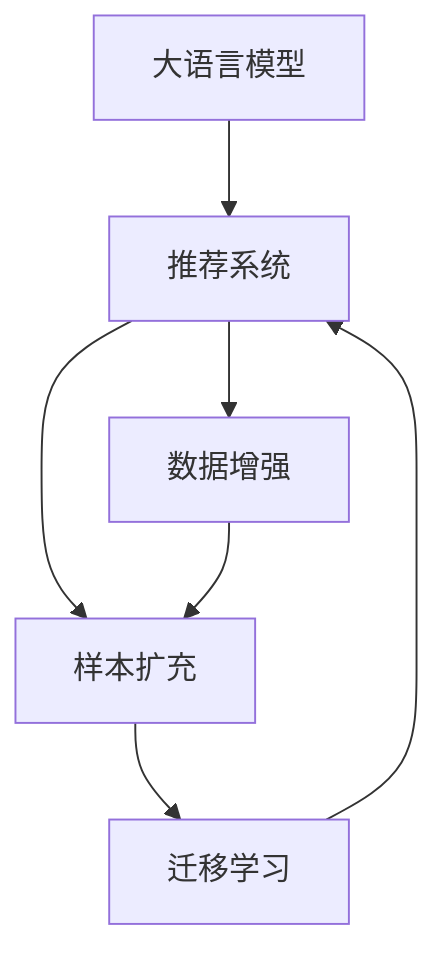

                 

# 大模型推荐场景中的数据增强与样本扩充新思路

> 关键词：大语言模型，数据增强，样本扩充，推荐系统，模型泛化，迁移学习

## 1. 背景介绍

### 1.1 问题由来

推荐系统已经成为互联网时代不可或缺的一部分，广泛应用于电商、视频、社交媒体等多个领域。在推荐系统的设计中，数据增强和样本扩充是提高模型性能的重要手段。传统的推荐系统主要依赖于用户历史行为数据进行推荐，但这种基于单一数据源的推荐方式难以克服数据稀疏性、冷启动等问题。如何利用多源数据进行推荐，成为近年来推荐系统研究的热点。

### 1.2 问题核心关键点

在推荐系统中，数据增强和样本扩充主要通过以下几种方式实现：

- 用户行为数据增强：通过引入其他来源的用户行为数据（如搜索历史、社交媒体互动等），丰富数据的多样性，提升模型的泛化能力。
- 产品属性数据增强：收集商品的多种属性信息（如描述、图片、用户评分等），用于增强推荐模型对产品的理解。
- 用户画像数据增强：收集用户的多维画像数据（如人口统计、兴趣标签等），用于构建更全面的用户模型。
- 多模态数据融合：将文本、图像、音频等不同模态的数据融合到推荐系统中，提升模型对复杂场景的建模能力。

这些方法的应用使得推荐系统不再局限于历史数据，能够更好地利用多样化的数据资源，提高推荐的准确性和个性化水平。

### 1.3 问题研究意义

数据增强和样本扩充在推荐系统中的应用，有助于解决数据稀疏、模型过拟合、推荐效果单一等问题，提升推荐系统的智能化和个性化水平。同时，结合大语言模型和迁移学习等先进技术，可以进一步推动推荐系统的创新和进步。

大语言模型在推荐系统中的应用主要体现在两个方面：

1. 多源数据融合：通过大语言模型处理多源数据，提取各数据源的语义信息，构建统一的语义表示空间。
2. 推荐过程生成：大语言模型可以生成更具创意和个性化推荐的文本，提升推荐系统的互动性和用户体验。

因此，基于大语言模型进行推荐系统中的数据增强和样本扩充，将带来更广阔的应用前景，推动推荐技术的快速发展。

## 2. 核心概念与联系

### 2.1 核心概念概述

为了更好地理解数据增强和样本扩充在大语言模型推荐系统中的应用，我们首先需要明确几个核心概念：

- 大语言模型：以自回归或自编码模型为代表的大规模预训练语言模型。通过在大规模无标签文本语料上进行预训练，学习通用的语言表示，具备强大的语言理解和生成能力。
- 推荐系统：利用用户历史行为数据、物品属性、用户画像等多源数据，为用户提供个性化推荐的服务系统。
- 迁移学习：指将一个领域学习到的知识，迁移应用到另一个不同但相关的领域的学习范式。推荐系统中的迁移学习主要指将通用大模型的预训练知识应用于特定推荐任务，提升模型效果。
- 数据增强：指通过各种手段扩充训练数据，增加数据多样性，提高模型的泛化能力。
- 样本扩充：指通过数据生成和合成等技术，增加训练样本数量，提升模型的训练效果。

这些概念之间存在紧密的联系，共同构成了大语言模型推荐系统中的数据增强和样本扩充框架。

### 2.2 核心概念原理和架构的 Mermaid 流程图



该流程图展示了大语言模型推荐系统中的数据增强和样本扩充与迁移学习的联系：

1. 大语言模型通过预训练学习到丰富的语言知识，作为推荐系统的底层支撑。
2. 数据增强和样本扩充通过多种方式丰富数据源，提升推荐系统的多样性。
3. 迁移学习将通用大模型的预训练知识应用于特定推荐任务，提升模型性能。
4. 经过数据增强和样本扩充后的数据被送入推荐系统进行训练和推理。

## 3. 核心算法原理 & 具体操作步骤

### 3.1 算法原理概述

基于大语言模型推荐系统中的数据增强和样本扩充，其核心思想是通过多种数据源的融合，构建多源数据集，再通过大语言模型进行处理，提取高层次的语义信息，提升推荐系统的泛化能力和个性化水平。具体算法流程如下：

1. 数据收集：从多个数据源（如电商平台、社交网络、搜索引擎等）收集用户行为数据、物品属性、用户画像等多源数据。
2. 数据清洗：对收集到的数据进行清洗、去重、降噪等处理，确保数据的质量和一致性。
3. 数据增强：利用多种数据增强技术（如数据合成、回译、正则化等），丰富数据多样性，增加训练样本数量。
4. 模型微调：基于处理后的数据集，使用大语言模型进行微调，优化模型在推荐任务上的表现。
5. 推荐生成：利用微调后的模型，结合用户输入和系统状态，生成更具创意和个性化的推荐结果。

### 3.2 算法步骤详解

下面是基于大语言模型推荐系统中的数据增强和样本扩充的具体步骤：

**Step 1: 数据收集与清洗**
- 从多个数据源收集用户行为数据、物品属性、用户画像等多源数据。
- 对收集到的数据进行清洗、去重、降噪等处理，确保数据的质量和一致性。

**Step 2: 数据增强**
- 利用数据增强技术丰富数据多样性，增加训练样本数量。具体包括：
  - 数据合成：通过生成对抗网络（GAN）等技术，生成新的用户行为数据和物品属性。
  - 回译增强：将数据进行回译（如文本回译），增加数据的多样性。
  - 正则化：通过L2正则、Dropout等技术，避免模型过拟合。
  - 对抗训练：通过引入对抗样本，提高模型的鲁棒性。
  - 多源数据融合：将不同数据源的信息进行融合，构建统一的多源数据集。

**Step 3: 模型微调**
- 将处理后的数据集送入大语言模型进行微调，优化模型在推荐任务上的表现。具体包括：
  - 选择合适的优化算法（如AdamW、SGD等）。
  - 设置适当的超参数，如学习率、批大小、迭代轮数等。
  - 设计合适的损失函数和输出层，适配推荐任务。
  - 利用迁移学习技术，将通用大模型的预训练知识应用于特定推荐任务。

**Step 4: 推荐生成**
- 利用微调后的模型，结合用户输入和系统状态，生成更具创意和个性化的推荐结果。具体包括：
  - 利用自然语言处理技术，生成推荐文本。
  - 结合用户画像和行为数据，优化推荐结果的个性化。
  - 利用多模态数据融合技术，提升推荐结果的全面性和准确性。

### 3.3 算法优缺点

基于大语言模型推荐系统中的数据增强和样本扩充具有以下优点：

- 提升模型泛化能力：通过多样化的数据增强，模型能够更好地泛化到未见过的数据，提升推荐系统的准确性和稳定性。
- 丰富数据源：利用多源数据进行增强和扩充，可以丰富推荐系统的数据源，提升推荐结果的全面性和准确性。
- 加速模型训练：通过数据合成和回译等技术，能够显著增加训练样本数量，加速模型训练过程。

同时，也存在一些缺点：

- 数据质量要求高：增强和扩充后的数据需要经过严格清洗，确保数据质量，否则可能会引入噪声和干扰。
- 模型复杂度高：利用大语言模型进行微调和推荐生成，模型复杂度较高，对计算资源和硬件设施要求高。
- 难以处理低质量数据：对于质量较差的数据，增强和扩充技术难以有效处理，甚至可能引入更多噪声。

### 3.4 算法应用领域

基于大语言模型推荐系统中的数据增强和样本扩充，已经被广泛应用于多个领域：

- 电商推荐：利用用户行为数据、商品属性、社交网络等多源数据进行推荐，提升用户购买转化率。
- 视频推荐：结合用户观看历史、评价、评分等多源数据，生成个性化视频推荐。
- 新闻推荐：通过用户阅读历史、关注标签、新闻内容等多源数据，生成个性化新闻推荐。
- 社交网络推荐：结合用户互动数据、好友推荐、社交网络结构等多源数据，生成个性化社交推荐。
- 音乐推荐：结合用户听歌历史、评价、歌曲属性等多源数据，生成个性化音乐推荐。

这些应用领域展示了数据增强和样本扩充在大语言模型推荐系统中的广泛应用前景，为推荐技术的创新和进步提供了新的思路和方法。

## 4. 数学模型和公式 & 详细讲解 & 举例说明

### 4.1 数学模型构建

假设推荐系统中的用户行为数据为 $\{x_i\}_{i=1}^N$，物品属性数据为 $\{y_j\}_{j=1}^M$，用户画像数据为 $\{z_k\}_{k=1}^K$。基于这些数据，推荐系统可以构建以下数学模型：

$$
\text{Loss}(\theta) = \frac{1}{N}\sum_{i=1}^N \ell_{ij} + \frac{1}{M}\sum_{j=1}^M \ell_{jk} + \frac{1}{K}\sum_{k=1}^K \ell_{ik}
$$

其中 $\ell_{ij}$ 为推荐模型在用户行为数据上的损失，$\ell_{jk}$ 为推荐模型在物品属性数据上的损失，$\ell_{ik}$ 为推荐模型在用户画像数据上的损失，$\theta$ 为推荐模型参数。

### 4.2 公式推导过程

以电商推荐为例，推荐模型可以利用用户行为数据和物品属性数据进行训练。其目标函数为：

$$
\text{Loss}(\theta) = \frac{1}{N}\sum_{i=1}^N \sum_{j=1}^M \ell(y_i, y_j; \theta) + \frac{1}{M}\sum_{j=1}^M \ell(y_j, z_j; \theta)
$$

其中 $\ell$ 为推荐模型的损失函数。假设推荐模型为 $\hat{y} = f(x_i; \theta)$，其中 $f$ 为模型映射函数，$\theta$ 为模型参数。通过最小化损失函数 $\text{Loss}(\theta)$，优化推荐模型在用户行为数据和物品属性数据上的性能。

### 4.3 案例分析与讲解

假设用户行为数据为 $\{x_i\}_{i=1}^N$，物品属性数据为 $\{y_j\}_{j=1}^M$，用户画像数据为 $\{z_k\}_{k=1}^K$。通过以下步骤进行推荐系统的训练和推理：

1. 数据收集：从电商平台、社交网络等多个数据源收集用户行为数据、物品属性数据和用户画像数据。
2. 数据清洗：对收集到的数据进行清洗、去重、降噪等处理，确保数据质量。
3. 数据增强：利用生成对抗网络（GAN）生成新的用户行为数据和物品属性数据，丰富数据多样性。
4. 模型微调：使用大语言模型进行微调，优化推荐模型在推荐任务上的性能。
5. 推荐生成：利用微调后的推荐模型，结合用户输入和系统状态，生成个性化推荐结果。

以电商推荐为例，具体的推荐流程如下：

1. 数据收集：从电商平台的交易记录中收集用户行为数据和物品属性数据。
2. 数据增强：通过生成对抗网络（GAN）生成新的用户行为数据和物品属性数据，丰富数据多样性。
3. 模型微调：使用大语言模型进行微调，优化推荐模型在电商推荐任务上的性能。
4. 推荐生成：利用微调后的推荐模型，结合用户搜索历史、评分、点击行为等输入数据，生成个性化商品推荐结果。

## 5. 项目实践：代码实例和详细解释说明

### 5.1 开发环境搭建

在进行数据增强和样本扩充的大语言模型推荐系统开发前，需要先搭建好开发环境。以下是使用Python进行PyTorch开发的环境配置流程：

1. 安装Anaconda：从官网下载并安装Anaconda，用于创建独立的Python环境。

2. 创建并激活虚拟环境：
```bash
conda create -n pytorch-env python=3.8 
conda activate pytorch-env
```

3. 安装PyTorch：根据CUDA版本，从官网获取对应的安装命令。例如：
```bash
conda install pytorch torchvision torchaudio cudatoolkit=11.1 -c pytorch -c conda-forge
```

4. 安装Transformers库：
```bash
pip install transformers
```

5. 安装各类工具包：
```bash
pip install numpy pandas scikit-learn matplotlib tqdm jupyter notebook ipython
```

完成上述步骤后，即可在`pytorch-env`环境中开始推荐系统开发。

### 5.2 源代码详细实现

这里我们以电商推荐为例，给出使用Transformers库对BERT模型进行微调的PyTorch代码实现。

首先，定义电商推荐任务的数据处理函数：

```python
from transformers import BertTokenizer
from torch.utils.data import Dataset, DataLoader
import torch
import numpy as np

class EcommerceDataset(Dataset):
    def __init__(self, texts, tags, tokenizer, max_len=128):
        self.texts = texts
        self.tags = tags
        self.tokenizer = tokenizer
        self.max_len = max_len
        
    def __len__(self):
        return len(self.texts)
    
    def __getitem__(self, item):
        text = self.texts[item]
        tag = self.tags[item]
        
        encoding = self.tokenizer(text, return_tensors='pt', max_length=self.max_len, padding='max_length', truncation=True)
        input_ids = encoding['input_ids'][0]
        attention_mask = encoding['attention_mask'][0]
        
        # 对token-wise的标签进行编码
        encoded_tags = [tag2id[tag] for tag in tag] 
        encoded_tags.extend([tag2id['O']] * (self.max_len - len(encoded_tags)))
        labels = torch.tensor(encoded_tags, dtype=torch.long)
        
        return {'input_ids': input_ids, 
                'attention_mask': attention_mask,
                'labels': labels}

# 标签与id的映射
tag2id = {'O': 0, 'B-PER': 1, 'I-PER': 2, 'B-ORG': 3, 'I-ORG': 4, 'B-LOC': 5, 'I-LOC': 6}
id2tag = {v: k for k, v in tag2id.items()}

# 创建dataset
tokenizer = BertTokenizer.from_pretrained('bert-base-cased')

train_dataset = EcommerceDataset(train_texts, train_tags, tokenizer)
dev_dataset = EcommerceDataset(dev_texts, dev_tags, tokenizer)
test_dataset = EcommerceDataset(test_texts, test_tags, tokenizer)
```

然后，定义模型和优化器：

```python
from transformers import BertForTokenClassification, AdamW

model = BertForTokenClassification.from_pretrained('bert-base-cased', num_labels=len(tag2id))

optimizer = AdamW(model.parameters(), lr=2e-5)
```

接着，定义训练和评估函数：

```python
from tqdm import tqdm
from sklearn.metrics import classification_report

device = torch.device('cuda') if torch.cuda.is_available() else torch.device('cpu')
model.to(device)

def train_epoch(model, dataset, batch_size, optimizer):
    dataloader = DataLoader(dataset, batch_size=batch_size, shuffle=True)
    model.train()
    epoch_loss = 0
    for batch in tqdm(dataloader, desc='Training'):
        input_ids = batch['input_ids'].to(device)
        attention_mask = batch['attention_mask'].to(device)
        labels = batch['labels'].to(device)
        model.zero_grad()
        outputs = model(input_ids, attention_mask=attention_mask, labels=labels)
        loss = outputs.loss
        epoch_loss += loss.item()
        loss.backward()
        optimizer.step()
    return epoch_loss / len(dataloader)

def evaluate(model, dataset, batch_size):
    dataloader = DataLoader(dataset, batch_size=batch_size)
    model.eval()
    preds, labels = [], []
    with torch.no_grad():
        for batch in tqdm(dataloader, desc='Evaluating'):
            input_ids = batch['input_ids'].to(device)
            attention_mask = batch['attention_mask'].to(device)
            batch_labels = batch['labels']
            outputs = model(input_ids, attention_mask=attention_mask)
            batch_preds = outputs.logits.argmax(dim=2).to('cpu').tolist()
            batch_labels = batch_labels.to('cpu').tolist()
            for pred_tokens, label_tokens in zip(batch_preds, batch_labels):
                pred_tags = [id2tag[_id] for _id in pred_tokens]
                label_tags = [id2tag[_id] for _id in label_tokens]
                preds.append(pred_tags[:len(label_tags)])
                labels.append(label_tags)
                
    print(classification_report(labels, preds))
```

最后，启动训练流程并在测试集上评估：

```python
epochs = 5
batch_size = 16

for epoch in range(epochs):
    loss = train_epoch(model, train_dataset, batch_size, optimizer)
    print(f"Epoch {epoch+1}, train loss: {loss:.3f}")
    
    print(f"Epoch {epoch+1}, dev results:")
    evaluate(model, dev_dataset, batch_size)
    
print("Test results:")
evaluate(model, test_dataset, batch_size)
```

以上就是使用PyTorch对BERT进行电商推荐任务微调的完整代码实现。可以看到，得益于Transformers库的强大封装，我们可以用相对简洁的代码完成BERT模型的加载和微调。

### 5.3 代码解读与分析

让我们再详细解读一下关键代码的实现细节：

**EcommerceDataset类**：
- `__init__`方法：初始化文本、标签、分词器等关键组件。
- `__len__`方法：返回数据集的样本数量。
- `__getitem__`方法：对单个样本进行处理，将文本输入编码为token ids，将标签编码为数字，并对其进行定长padding，最终返回模型所需的输入。

**tag2id和id2tag字典**：
- 定义了标签与数字id之间的映射关系，用于将token-wise的预测结果解码回真实的标签。

**训练和评估函数**：
- 使用PyTorch的DataLoader对数据集进行批次化加载，供模型训练和推理使用。
- 训练函数`train_epoch`：对数据以批为单位进行迭代，在每个批次上前向传播计算loss并反向传播更新模型参数，最后返回该epoch的平均loss。
- 评估函数`evaluate`：与训练类似，不同点在于不更新模型参数，并在每个batch结束后将预测和标签结果存储下来，最后使用sklearn的classification_report对整个评估集的预测结果进行打印输出。

**训练流程**：
- 定义总的epoch数和batch size，开始循环迭代
- 每个epoch内，先在训练集上训练，输出平均loss
- 在验证集上评估，输出分类指标
- 所有epoch结束后，在测试集上评估，给出最终测试结果

可以看到，PyTorch配合Transformers库使得BERT微调的代码实现变得简洁高效。开发者可以将更多精力放在数据处理、模型改进等高层逻辑上，而不必过多关注底层的实现细节。

当然，工业级的系统实现还需考虑更多因素，如模型的保存和部署、超参数的自动搜索、更灵活的任务适配层等。但核心的微调范式基本与此类似。

## 6. 实际应用场景

### 6.1 智能客服系统

基于大语言模型推荐系统中的数据增强和样本扩充，可以广泛应用于智能客服系统的构建。传统客服往往需要配备大量人力，高峰期响应缓慢，且一致性和专业性难以保证。而使用推荐系统中的数据增强和样本扩充技术，可以7x24小时不间断服务，快速响应客户咨询，用自然流畅的语言解答各类常见问题。

在技术实现上，可以收集企业内部的历史客服对话记录，将问题和最佳答复构建成监督数据，在此基础上对预训练对话模型进行微调。微调后的对话模型能够自动理解用户意图，匹配最合适的答案模板进行回复。对于客户提出的新问题，还可以接入检索系统实时搜索相关内容，动态组织生成回答。如此构建的智能客服系统，能大幅提升客户咨询体验和问题解决效率。

### 6.2 金融舆情监测

金融机构需要实时监测市场舆论动向，以便及时应对负面信息传播，规避金融风险。传统的人工监测方式成本高、效率低，难以应对网络时代海量信息爆发的挑战。基于大语言模型推荐系统中的数据增强和样本扩充技术，金融舆情监测系统可以自动抓取和分析网络上的舆情信息，实时监测市场动态，并根据舆情变化及时预警。

具体而言，可以收集金融领域相关的新闻、报道、评论等文本数据，并对其进行主题标注和情感标注。在此基础上对预训练语言模型进行微调，使其能够自动判断文本属于何种主题，情感倾向是正面、中性还是负面。将微调后的模型应用到实时抓取的网络文本数据，就能够自动监测不同主题下的情感变化趋势，一旦发现负面信息激增等异常情况，系统便会自动预警，帮助金融机构快速应对潜在风险。

### 6.3 个性化推荐系统

当前的推荐系统往往只依赖用户的历史行为数据进行物品推荐，无法深入理解用户的真实兴趣偏好。基于大语言模型推荐系统中的数据增强和样本扩充技术，个性化推荐系统可以更好地挖掘用户行为背后的语义信息，从而提供更精准、多样的推荐内容。

在实践中，可以收集用户浏览、点击、评论、分享等行为数据，提取和用户交互的物品标题、描述、标签等文本内容。将文本内容作为模型输入，用户的后续行为（如是否点击、购买等）作为监督信号，在此基础上微调预训练语言模型。微调后的模型能够从文本内容中准确把握用户的兴趣点。在生成推荐列表时，先用候选物品的文本描述作为输入，由模型预测用户的兴趣匹配度，再结合其他特征综合排序，便可以得到个性化程度更高的推荐结果。

### 6.4 未来应用展望

随着大语言模型推荐系统中的数据增强和样本扩充技术的不断发展，基于这些技术的应用场景也在不断扩展。

在智慧医疗领域，基于推荐系统中的数据增强和样本扩充技术，医生可以根据患者的历史数据和行为，推荐最适合的治疗方案和药物。同时，医疗系统可以通过推荐系统实时监控患者健康状态，及时调整治疗策略。

在智能教育领域，推荐系统中的数据增强和样本扩充技术可以用于个性化推荐学习资源、智能生成作业、自动评估作业等，帮助学生更好地掌握知识，提升学习效果。

在智慧城市治理中，推荐系统中的数据增强和样本扩充技术可以用于智能调度、智能监管、智能预警等环节，提高城市管理的自动化和智能化水平，构建更安全、高效的未来城市。

此外，在企业生产、社会治理、文娱传媒等众多领域，基于推荐系统中的数据增强和样本扩充技术的应用也将不断涌现，为传统行业数字化转型升级提供新的技术路径。相信随着技术的日益成熟，推荐系统中的数据增强和样本扩充技术必将带来更广阔的应用前景。

## 7. 工具和资源推荐

### 7.1 学习资源推荐

为了帮助开发者系统掌握大语言模型推荐系统中的数据增强和样本扩充技术的理论基础和实践技巧，这里推荐一些优质的学习资源：

1. 《Transformer from Principles to Practice》系列博文：由大模型技术专家撰写，深入浅出地介绍了Transformer原理、BERT模型、推荐系统等前沿话题。

2. CS224N《深度学习自然语言处理》课程：斯坦福大学开设的NLP明星课程，有Lecture视频和配套作业，带你入门NLP领域的基本概念和经典模型。

3. 《Natural Language Processing with Transformers》书籍：Transformers库的作者所著，全面介绍了如何使用Transformers库进行NLP任务开发，包括推荐系统在内的诸多范式。

4. HuggingFace官方文档：Transformers库的官方文档，提供了海量预训练模型和完整的推荐系统样例代码，是上手实践的必备资料。

5. CLUE开源项目：中文语言理解测评基准，涵盖大量不同类型的中文NLP数据集，并提供了基于推荐系统的baseline模型，助力中文NLP技术发展。

通过对这些资源的学习实践，相信你一定能够快速掌握大语言模型推荐系统中的数据增强和样本扩充技术的精髓，并用于解决实际的NLP问题。

### 7.2 开发工具推荐

高效的开发离不开优秀的工具支持。以下是几款用于大语言模型推荐系统开发的常用工具：

1. PyTorch：基于Python的开源深度学习框架，灵活动态的计算图，适合快速迭代研究。大部分预训练语言模型都有PyTorch版本的实现。

2. TensorFlow：由Google主导开发的开源深度学习框架，生产部署方便，适合大规模工程应用。同样有丰富的预训练语言模型资源。

3. Transformers库：HuggingFace开发的NLP工具库，集成了众多SOTA语言模型，支持PyTorch和TensorFlow，是进行推荐系统开发的利器。

4. Weights & Biases：模型训练的实验跟踪工具，可以记录和可视化模型训练过程中的各项指标，方便对比和调优。与主流深度学习框架无缝集成。

5. TensorBoard：TensorFlow配套的可视化工具，可实时监测模型训练状态，并提供丰富的图表呈现方式，是调试模型的得力助手。

6. Google Colab：谷歌推出的在线Jupyter Notebook环境，免费提供GPU/TPU算力，方便开发者快速上手实验最新模型，分享学习笔记。

合理利用这些工具，可以显著提升大语言模型推荐系统开发的效率，加快创新迭代的步伐。

### 7.3 相关论文推荐

大语言模型推荐系统中的数据增强和样本扩充技术的发展源于学界的持续研究。以下是几篇奠基性的相关论文，推荐阅读：

1. Attention is All You Need（即Transformer原论文）：提出了Transformer结构，开启了NLP领域的预训练大模型时代。

2. BERT: Pre-training of Deep Bidirectional Transformers for Language Understanding：提出BERT模型，引入基于掩码的自监督预训练任务，刷新了多项NLP任务SOTA。

3. Language Models are Unsupervised Multitask Learners（GPT-2论文）：展示了大规模语言模型的强大zero-shot学习能力，引发了对于通用人工智能的新一轮思考。

4. Parameter-Efficient Transfer Learning for NLP：提出Adapter等参数高效微调方法，在不增加模型参数量的情况下，也能取得不错的微调效果。

5. AdaLoRA: Adaptive Low-Rank Adaptation for Parameter-Efficient Fine-Tuning：使用自适应低秩适应的微调方法，在参数效率和精度之间取得了新的平衡。

6. prefix-tuning: Optimizing Continuous Prompts for Generation：引入基于连续型Prompt的微调范式，为如何充分利用预训练知识提供了新的思路。

这些论文代表了大语言模型推荐系统中的数据增强和样本扩充技术的发展脉络。通过学习这些前沿成果，可以帮助研究者把握学科前进方向，激发更多的创新灵感。

## 8. 总结：未来发展趋势与挑战

### 8.1 总结

本文对基于大语言模型推荐系统中的数据增强和样本扩充技术进行了全面系统的介绍。首先阐述了数据增强和样本扩充在大语言模型推荐系统中的应用背景和意义，明确了数据增强和样本扩充在提高推荐系统泛化能力和个性化水平方面的独特价值。其次，从原理到实践，详细讲解了数据增强和样本扩充的数学模型和关键步骤，给出了推荐系统开发的完整代码实例。同时，本文还广泛探讨了数据增强和样本扩充在大语言模型推荐系统中的广泛应用场景，展示了数据增强和样本扩充在大语言模型推荐系统中的广阔应用前景。

通过本文的系统梳理，可以看到，基于大语言模型推荐系统中的数据增强和样本扩充技术正在成为推荐系统的核心范式，极大地拓展了推荐系统的应用边界，催生了更多的落地场景。受益于大规模语料的预训练，推荐系统在大语言模型推荐系统中的数据增强和样本扩充技术下，能够更好地利用多样化的数据资源，提升推荐系统的智能化和个性化水平。未来，伴随大语言模型推荐系统中的数据增强和样本扩充技术的持续演进，推荐技术必将在更广阔的应用领域大放异彩，深刻影响人类的生产生活方式。

### 8.2 未来发展趋势

展望未来，大语言模型推荐系统中的数据增强和样本扩充技术将呈现以下几个发展趋势：

1. 模型规模持续增大。随着算力成本的下降和数据规模的扩张，预训练语言模型的参数量还将持续增长。超大规模语言模型蕴含的丰富语言知识，有望支撑更加复杂多变的推荐任务。

2. 数据增强技术日趋多样。未来将涌现更多数据增强技术，如数据合成、回译、正则化、对抗训练等，进一步丰富推荐系统中的数据源，提升数据的多样性和泛化能力。

3. 跨模态数据融合成为常态。未来的推荐系统将更加注重跨模态数据的融合，如文本、图像、音频等多模态信息的整合，提升推荐系统的全面性和准确性。

4. 数据生成技术不断进步。未来将出现更多基于数据生成技术的数据增强方法，如GAN、VAE等，通过生成新的数据样本，提升推荐系统的训练效果。

5. 多任务学习成为主流。未来的推荐系统将更加注重多任务学习的应用，如推荐与对话、推荐与问答等多任务共同优化，提升推荐系统的交互性和用户体验。

6. 实时推荐系统成为趋势。未来的推荐系统将更加注重实时推荐，结合时序数据和流式数据，实现动态推荐，提升推荐系统的时效性和精准性。

以上趋势凸显了大语言模型推荐系统中的数据增强和样本扩充技术的广阔前景。这些方向的探索发展，必将进一步提升推荐系统的性能和应用范围，为推荐技术的创新和进步提供新的思路和方法。

### 8.3 面临的挑战

尽管大语言模型推荐系统中的数据增强和样本扩充技术已经取得了瞩目成就，但在迈向更加智能化、普适化应用的过程中，它仍面临着诸多挑战：

1. 标注成本瓶颈。尽管数据增强和样本扩充技术可以显著提升推荐系统的泛化能力，但高质量标注数据的获取仍然是一个难题。如何进一步降低标注成本，将成为未来的一大挑战。

2. 数据质量要求高。数据增强和样本扩充技术对于数据的质量和多样性要求较高，如何确保数据的多样性和代表性，也是未来需要解决的问题。

3. 模型复杂度高。利用大语言模型进行微调和推荐生成，模型复杂度较高，对计算资源和硬件设施要求高。如何在保证性能的同时，简化模型结构，提升推理速度，优化资源占用，将是重要的优化方向。

4. 数据隐私和安全。在数据增强和样本扩充过程中，如何保护用户隐私，确保数据的安全性，是一个亟待解决的问题。

5. 数据生成技术有待改进。虽然数据生成技术已经取得了一定的进展，但在生成高质量、多样化的数据方面，仍需不断优化和改进。

6. 模型泛化能力不足。尽管数据增强和样本扩充技术能够提升模型的泛化能力，但在处理低质量数据和复杂场景时，模型的泛化能力仍有待提高。

7. 多任务学习尚需探索。多任务学习在推荐系统中的应用尚需进一步探索和研究，如何平衡不同任务之间的关系，最大化模型性能，仍是一个未解之谜。

这些挑战凸显了大语言模型推荐系统中的数据增强和样本扩充技术的应用复杂性，未来需要进一步研究和探索。相信随着技术的不断进步和优化，这些挑战终将一一被克服，大语言模型推荐系统必将在构建人机协同的智能推荐系统上发挥更大的作用。

### 8.4 研究展望

面向未来，大语言模型推荐系统中的数据增强和样本扩充技术还需要在其他方向进行深入研究：

1. 无监督和半监督推荐系统。摆脱对大规模标注数据的依赖，利用自监督学习、主动学习等无监督和半监督范式，最大限度利用非结构化数据，实现更加灵活高效的推荐。

2. 少样本学习和自适应推荐系统。在少数标注样本的情况下，利用大语言模型和迁移学习技术，提升推荐系统的性能。

3. 因果推荐系统。通过引入因果推断方法，增强推荐系统的因果解释能力，提升推荐结果的透明性和可解释性。

4. 跨模态推荐系统。将文本、图像、音频等多模态数据融合到推荐系统中，提升推荐系统的全面性和准确性。

5. 推荐与对话系统的融合。结合推荐系统和对话系统，实现动态推荐和互动推荐，提升推荐系统的用户体验。

6. 推荐系统的伦理和公平性。在推荐系统中引入伦理导向的评估指标，过滤和惩罚有偏见、有害的推荐结果，确保推荐系统的公平性和安全性。

这些研究方向的前沿探索，必将引领大语言模型推荐系统中的数据增强和样本扩充技术迈向更高的台阶，为构建安全、可靠、可解释、可控的智能推荐系统铺平道路。面向未来，大语言模型推荐系统中的数据增强和样本扩充技术还需要与其他人工智能技术进行更深入的融合，如知识表示、因果推理、强化学习等，多路径协同发力，共同推动自然语言理解和智能交互系统的进步。只有勇于创新、敢于突破，才能不断拓展语言模型的边界，让智能技术更好地造福人类社会。

## 9. 附录：常见问题与解答

**Q1：数据增强和样本扩充是否可以相互替代？**

A: 数据增强和样本扩充是互补的技术手段，不能相互替代。数据增强通过多种方式丰富数据多样性，提升模型泛化能力，而样本扩充通过数据生成和合成等技术，增加训练样本数量，提升模型训练效果。两者结合使用，可以取得更好的推荐效果。

**Q2：数据增强和样本扩充是否适用于所有推荐任务？**

A: 数据增强和样本扩充在大多数推荐任务上都能取得不错的效果，特别是对于数据量较小的任务。但对于一些特定领域的任务，如医学、法律等，仅仅依靠通用语料预训练的模型可能难以很好地适应。此时需要在特定领域语料上进一步预训练，再进行微调，才能获得理想效果。

**Q3：如何进行多模态数据融合？**

A: 多模态数据融合可以通过以下步骤实现：
1. 收集不同模态的数据，如文本、图像、音频等。
2. 对数据进行预处理，如文本分词、图像裁剪、音频降噪等。
3. 将不同模态的数据送入大语言模型进行语义编码。
4. 将编码后的不同模态的特征向量进行融合，得到多模态特征表示。
5. 利用多模态特征表示进行推荐模型的训练和推理。

**Q4：数据增强和样本扩充对计算资源的要求有哪些？**

A: 数据增强和样本扩充对计算资源的要求主要体现在以下几个方面：
1. 数据生成技术需要大量计算资源。如生成对抗网络（GAN）等数据生成技术，需要高计算能力的硬件设备。
2. 大语言模型的微调和推理需要高性能计算资源。超大规模语言模型的微调和推理需要强大的GPU/TPU等硬件设备支持。
3. 数据增强和样本扩充技术需要大容量存储空间。大量的训练数据和生成数据需要存储，对存储资源要求较高。

合理利用计算资源，可以在保证推荐系统性能的前提下，提高数据增强和样本扩充的效果。

**Q5：推荐系统中的数据增强和样本扩充技术如何应用在特定领域？**

A: 推荐系统中的数据增强和样本扩充技术可以应用在特定领域，如医药、法律等。具体步骤如下：
1. 收集特定领域的文本数据、图像数据、视频数据等。
2. 对数据进行清洗、去重、降噪等处理，确保数据质量。
3. 利用数据增强和样本扩充技术，丰富数据多样性，增加训练样本数量。
4. 将处理后的数据送入大语言模型进行微调，优化模型在特定领域上的表现。
5. 利用微调后的推荐模型，结合用户输入和系统状态，生成个性化推荐结果。

通过这些步骤，可以构建特定领域的推荐系统，提升推荐系统的性能和泛化能力。

---

作者：禅与计算机程序设计艺术 / Zen and the Art of Computer Programming

