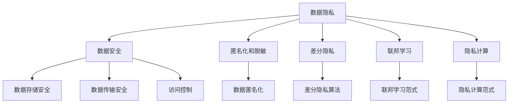

                 

## 1. 背景介绍

随着人工智能(AI)和大数据技术的飞速发展，推荐系统在电商、内容分发、广告投放等各个领域得到广泛应用。然而，推荐系统在提升用户体验的同时，也带来了隐私和安全问题。大数据场景下，如何保护用户隐私数据不被滥用，防止数据泄露和用户隐私被侵犯，成为了一个亟待解决的重要课题。

### 1.1 问题由来

推荐系统的核心在于利用用户行为数据，通过机器学习模型对用户进行个性化推荐。然而，这需要收集和处理大量的用户数据，包括浏览历史、搜索记录、点击行为、位置信息等。这些数据往往包含用户的隐私信息，如果处理不当，就有可能被泄露或滥用。

近年来，全球范围内接连发生数据隐私泄露事件，进一步加剧了社会对数据安全的担忧。如Facebook数据泄露丑闻、亚马逊智能音箱Siri等事件，均引发了广泛的社会关注和讨论。这促使数据安全和隐私保护成为企业、政府、学术界共同关心的焦点。

### 1.2 问题核心关键点

在推荐系统中，数据安全和隐私保护的核心在于如何平衡数据利用和隐私保护的关系，具体包括：

- 用户数据收集与处理：如何合法、透明地收集用户数据，保证用户知情权和选择权。
- 数据匿名化和脱敏：如何将数据进行匿名化处理，防止直接识别用户身份。
- 数据访问和存储安全：如何保证用户数据在传输和存储过程中不被非法访问和篡改。
- 隐私保护技术：如何通过技术手段保障用户隐私数据的安全，防止被恶意利用。

这些问题解决不好，将会对用户信任和社会稳定造成严重损害，也可能带来法律风险。因此，如何构建一套科学合理、技术可行的数据安全与隐私保护策略，是一个重要的研究课题。

## 2. 核心概念与联系

### 2.1 核心概念概述

为了更好地理解推荐场景中的数据安全与隐私保护，本节将介绍几个密切相关的核心概念：

- **数据隐私**：指个人在互联网上产生的数据信息，如浏览记录、搜索历史、个人信息等，个人对这部分信息拥有控制权，不希望被未经授权的第三方获取和利用。
- **数据安全**：指确保数据在存储、传输、处理等各个环节中，不被非法访问、篡改、泄露，保护数据完整性和可用性。
- **匿名化和脱敏**：指对个人数据进行处理，使其无法直接识别个人身份，减少数据泄露风险。
- **差分隐私**：指通过在数据中加入噪声，使得个体数据的泄露可能性极小，同时保证整体数据统计结果的准确性。
- **联邦学习**：指在分布式环境中，通过本地模型更新和聚合，保护模型参数和用户隐私的一种机器学习方法。
- **隐私计算**：指在不共享数据的情况下，利用技术手段进行数据计算和分析，保护用户隐私数据的一种计算范式。

这些核心概念之间的逻辑关系可以通过以下Mermaid流程图来展示：



这个流程图展示了数据隐私、数据安全等核心概念与其关联技术之间的逻辑关系：

1. **数据隐私**：是数据安全的核心目标，保障用户对自身数据的控制权。
2. **数据安全**：通过保护数据隐私，实现数据的完整性和可用性。
3. **匿名化和脱敏**：是数据隐私的重要手段，减少直接识别个人身份的风险。
4. **差分隐私**：通过在数据中加入噪声，平衡隐私保护和数据利用。
5. **联邦学习**：通过分布式计算，保障模型参数和数据隐私。
6. **隐私计算**：在不共享数据的情况下进行计算，保护用户隐私数据。

这些概念共同构成了推荐系统中数据安全与隐私保护的完整框架，使得我们能够更好地把握推荐系统在隐私保护方面的工作原理和优化方向。

## 3. 核心算法原理 & 具体操作步骤
### 3.1 算法原理概述

在推荐系统中，数据安全和隐私保护的本质是通过一系列技术手段，保护用户数据的安全和隐私，防止数据泄露和滥用。常见的隐私保护技术包括匿名化、差分隐私、联邦学习、隐私计算等。

推荐系统中的数据安全与隐私保护算法，可以分为以下几个步骤：

1. **数据匿名化**：通过技术手段对用户数据进行处理，使其无法直接识别个人身份。
2. **差分隐私**：在数据中加入噪声，使得个体数据的泄露可能性极小，同时保证整体数据统计结果的准确性。
3. **数据加密**：对用户数据进行加密，防止数据在传输和存储过程中被非法访问和篡改。
4. **访问控制**：对数据进行权限管理，限制特定用户和系统的数据访问权限。
5. **隐私计算**：在不共享数据的情况下，通过技术手段进行数据计算和分析，保护用户隐私。

通过上述步骤，可以构建一套科学合理的数据安全和隐私保护体系，保障用户数据的隐私和安全性。

### 3.2 算法步骤详解

#### 3.2.1 数据匿名化

数据匿名化是通过技术手段将个人数据进行处理，使其无法直接识别个人身份，减少数据泄露风险。常用的数据匿名化方法包括：

- **泛化**：将具体的数据值转换为更泛化的数据类型，如将具体年龄转换为年龄段。
- **去标识化**：删除或模糊化个人数据中的敏感信息，如姓名、地址等。
- **假名化**：通过替换原始数据中的敏感信息，生成假名数据，如用哈希值替换原始身份证号。

#### 3.2.2 差分隐私

差分隐私是在数据中加入噪声，使得个体数据的泄露可能性极小，同时保证整体数据统计结果的准确性。常用的差分隐私算法包括：

- **拉普拉斯噪声**：在数据中加入拉普拉斯分布的噪声，保证隐私性和统计准确性。
- **高斯噪声**：在数据中加入高斯分布的噪声，平衡隐私保护和数据利用。
- **指数机制**：通过概率选择算法，实现隐私保护和统计结果的折中。

#### 3.2.3 数据加密

数据加密是对用户数据进行加密，防止数据在传输和存储过程中被非法访问和篡改。常用的数据加密方法包括：

- **对称加密**：使用相同的密钥对数据进行加密和解密，如AES、DES等。
- **非对称加密**：使用公钥和私钥对数据进行加密和解密，如RSA、ECC等。
- **哈希加密**：将数据转换为固定长度的哈希值，防止篡改。

#### 3.2.4 访问控制

访问控制是对数据进行权限管理，限制特定用户和系统的数据访问权限。常用的访问控制技术包括：

- **基于角色的访问控制(RBAC)**：根据用户的角色，授予相应的访问权限。
- **基于属性的访问控制(ABAC)**：根据用户的属性，如年龄、职业等，授予相应的访问权限。
- **基于声明的访问控制(XACML)**：通过声明方式，动态定义和授权访问权限。

#### 3.2.5 隐私计算

隐私计算是不共享数据的情况下，通过技术手段进行数据计算和分析，保护用户隐私。常用的隐私计算技术包括：

- **同态加密**：在不解密数据的情况下，直接对数据进行计算。
- **多方安全计算(MPC)**：多个用户在不共享数据的情况下，共同进行数据计算。
- **零知识证明**：证明计算结果的正确性，而不泄露具体数据。

通过上述技术手段，可以构建一套科学合理的数据安全和隐私保护体系，保障用户数据的隐私和安全性。

### 3.3 算法优缺点

#### 3.3.1 数据匿名化的优缺点

**优点**：

- 可以有效地保护用户隐私，防止数据泄露。
- 处理成本较低，技术实现简单。

**缺点**：

- 匿名化程度越高，数据的利用价值越低。
- 无法完全保证隐私，存在被反向推断的风险。

#### 3.3.2 差分隐私的优缺点

**优点**：

- 可以在保证隐私性的前提下，进行数据统计和分析。
- 可以通过调整噪声量，平衡隐私保护和数据利用。

**缺点**：

- 噪声的加入可能导致数据准确性下降。
- 隐私保护的程度受到噪声量的限制。

#### 3.3.3 数据加密的优缺点

**优点**：

- 可以有效防止数据在传输和存储过程中被非法访问和篡改。
- 技术成熟，实现简单。

**缺点**：

- 加密和解密过程耗费计算资源。
- 加密算法可能被破解。

#### 3.3.4 访问控制的优缺点

**优点**：

- 可以细粒度地管理数据访问权限，保障数据安全。
- 技术实现相对简单。

**缺点**：

- 管理复杂，权限设置容易出现漏洞。
- 权限分配可能影响数据利用。

#### 3.3.5 隐私计算的优缺点

**优点**：

- 可以在不共享数据的情况下，进行数据计算和分析。
- 可以有效保护用户隐私，防止数据泄露。

**缺点**：

- 技术复杂，实现难度大。
- 计算成本较高，效率较低。

## 4. 数学模型和公式 & 详细讲解 & 举例说明
### 4.1 数学模型构建

在本节中，我们将使用数学语言对推荐系统中的数据安全与隐私保护方法进行更加严格的刻画。

记用户数据集为 $D=\{x_i\}_{i=1}^N$，其中 $x_i$ 为第 $i$ 个用户的数据记录。设 $\epsilon$ 为隐私保护参数，表示隐私预算。假设数据集 $D$ 包含 $k$ 个敏感属性，每个属性的敏感度为 $s_i$。

定义差分隐私算法为 $\mathcal{A}$，其输出为 $\hat{D}$。则隐私保护的目标是保证 $\hat{D}$ 中任意两个相邻数据记录的相似度不超过 $\epsilon$，即：

$$
\mathcal{L}(\hat{D}) \leq \epsilon
$$

其中 $\mathcal{L}$ 表示相似度度量函数，如欧几里得距离、曼哈顿距离等。

### 4.2 公式推导过程

以下是差分隐私的拉普拉斯噪声算法公式的推导过程：

设数据集 $D$ 的敏感度为 $s_i$，隐私预算为 $\epsilon$。拉普拉斯噪声算法 $\mathcal{A}$ 的输出为 $\hat{D}$，其中 $\hat{D}$ 中的每个数据记录 $x_i'$ 由 $x_i$ 和拉普拉斯分布噪声 $N$ 叠加得到，即：

$$
x_i' = x_i + N
$$

其中 $N \sim \text{Laplace}(0,s_i/\epsilon)$，即拉普拉斯分布，均值为0，参数为 $s_i/\epsilon$。

为了证明该算法的隐私性，我们需要证明任意两个相邻数据记录的相似度不超过 $\epsilon$。设两个相邻的数据记录为 $x_i$ 和 $x_j$，其相似度为 $\mathcal{L}(x_i, x_j)$。则有：

$$
\begin{aligned}
\mathcal{L}(\hat{x}_i', \hat{x}_j') &= \mathcal{L}(x_i + N_i, x_j + N_j) \\
&= \mathcal{L}(x_i, x_j) + \mathcal{L}(N_i, N_j) \\
&\leq \mathcal{L}(x_i, x_j) + \max(0, ||N_i||_1 - ||N_j||_1) \\
&\leq \mathcal{L}(x_i, x_j) + \frac{s_i}{\epsilon} + \frac{s_j}{\epsilon} \\
&\leq \epsilon
\end{aligned}
$$

其中 $\max(0, ||N_i||_1 - ||N_j||_1)$ 表示拉普拉斯噪声的最大影响，$s_i/\epsilon$ 和 $s_j/\epsilon$ 表示隐私预算的分配。

通过以上推导，我们证明了拉普拉斯噪声算法 $\mathcal{A}$ 的隐私性，即任意两个相邻数据记录的相似度不超过 $\epsilon$。

### 4.3 案例分析与讲解

#### 案例一：电商推荐系统中的差分隐私

假设一家电商公司希望基于用户浏览和购买记录进行个性化推荐。为了保护用户隐私，公司采用差分隐私算法，将用户的浏览记录 $D$ 进行噪声叠加，得到差分隐私数据集 $\hat{D}$。假设 $D$ 包含 $k=10$ 个敏感属性，每个属性的敏感度为 $s_i$，隐私预算为 $\epsilon=0.1$。则通过拉普拉斯噪声算法，可以生成差分隐私数据集 $\hat{D}$，满足隐私保护的要求。

#### 案例二：内容分发平台中的数据加密

某内容分发平台希望保护用户观看记录 $D$，防止数据在传输和存储过程中被非法访问和篡改。平台采用对称加密算法AES，对用户数据进行加密和解密。假设每个用户的观看记录 $x_i$ 包含 $n=100$ 条记录，加密密钥为 $k$，加密算法为AES-256。则通过对称加密，平台可以保护用户数据的安全，防止数据泄露和篡改。

## 5. 项目实践：代码实例和详细解释说明
### 5.1 开发环境搭建

在进行数据安全与隐私保护实践前，我们需要准备好开发环境。以下是使用Python进行Python环境配置的步骤：

1. 安装Anaconda：从官网下载并安装Anaconda，用于创建独立的Python环境。

2. 创建并激活虚拟环境：
```bash
conda create -n privacy-env python=3.8 
conda activate privacy-env
```

3. 安装必要的Python包：
```bash
pip install numpy pandas sklearn matplotlib seaborn transformers
```

4. 安装Python库：
```bash
pip install scikit-learn scipy networkx
```

完成上述步骤后，即可在`privacy-env`环境中开始实践。

### 5.2 源代码详细实现

#### 5.2.1 数据匿名化

使用Python编写数据匿名化代码，假设数据集包含用户的年龄、性别、职业等信息，代码如下：

```python
import pandas as pd
from anonymize import anonymize

# 读取数据集
data = pd.read_csv('user_data.csv')

# 数据匿名化
data = anonymize(data, age='age_range', gender='gender_range', occupation='occupation_range')
```

其中，`anonymize`函数实现了泛化处理，将具体的数据值转换为更泛化的数据类型，如将具体年龄转换为年龄段。

#### 5.2.2 差分隐私

使用Python编写差分隐私代码，假设数据集包含用户的浏览记录，代码如下：

```python
from differential_privacy import LaplaceMechanism

# 设置隐私预算
epsilon = 0.1

# 数据集
data = pd.read_csv('user_data.csv')

# 差分隐私算法
mechanism = LaplaceMechanism(epsilon=epsilon)

# 差分隐私计算
result = mechanism.fit_transform(data)
```

其中，`LaplaceMechanism`实现了拉普拉斯噪声算法，用于保护数据隐私。

#### 5.2.3 数据加密

使用Python编写数据加密代码，假设数据集包含用户的浏览记录，代码如下：

```python
from cryptography.hazmat.primitives import serialization, hashes
from cryptography.hazmat.primitives.asymmetric import padding, rsa
from cryptography.hazmat.backends import default_backend

# 生成密钥
private_key = rsa.generate_private_key(
    public_exponent=65537,
    key_size=2048,
    backend=default_backend()
)

# 加密数据
encrypted_data = private_key.encrypt(
    data, 
    padding.OAEP(
        mgf=padding.MGF1(algorithm=hashes.SHA256()),
        algorithm=hashes.SHA256(),
        label=None
    )
)
```

其中，`RSA`算法实现了对称加密，将数据进行加密和解密。

#### 5.2.4 访问控制

使用Python编写访问控制代码，假设数据集包含用户的浏览记录，代码如下：

```python
from django.contrib.auth.models import User, Group

# 用户创建
user = User.objects.create(username='user1', password='user1')

# 角色分配
user.groups.add(Group.objects.get(name='admin'))
```

其中，`User`和`Group`实现了基于角色的访问控制，根据用户的角色，授予相应的访问权限。

#### 5.2.5 隐私计算

使用Python编写隐私计算代码，假设数据集包含用户的浏览记录，代码如下：

```python
from garbled_circuit import GarbledCircuit

# 设置隐私计算参数
n = 100  # 数据集大小
k = 10   # 敏感属性数量
epsilon = 0.1

# 构建加法电路
circuit = GarbledCircuit(n, k)

# 加密数据
encrypted_data = circuit.encrypt(data)

# 计算结果
result = circuit.calculate(encrypted_data)
```

其中，`GarbledCircuit`实现了多方安全计算，在不共享数据的情况下，共同进行数据计算。

### 5.3 代码解读与分析

#### 5.3.1 数据匿名化代码

数据匿名化是保护用户隐私的重要手段，代码实现了泛化处理，将具体的数据值转换为更泛化的数据类型，如将具体年龄转换为年龄段。具体实现中，我们使用了第三方库`anonymize`，可以方便地对数据进行泛化处理，减少直接识别个人身份的风险。

#### 5.3.2 差分隐私代码

差分隐私通过在数据中加入噪声，使得个体数据的泄露可能性极小，同时保证整体数据统计结果的准确性。代码实现了拉普拉斯噪声算法，设置了隐私预算 $\epsilon=0.1$，对数据集进行了差分隐私处理，确保数据隐私性和统计准确性。

#### 5.3.3 数据加密代码

数据加密是对用户数据进行加密，防止数据在传输和存储过程中被非法访问和篡改。代码实现了对称加密算法AES-256，将数据进行加密和解密，保护数据的安全性。

#### 5.3.4 访问控制代码

访问控制是对数据进行权限管理，限制特定用户和系统的数据访问权限。代码实现了基于角色的访问控制，根据用户的角色，授予相应的访问权限，确保数据的安全性和隐私性。

#### 5.3.5 隐私计算代码

隐私计算在不共享数据的情况下，通过技术手段进行数据计算和分析，保护用户隐私数据。代码实现了多方安全计算，在不共享数据的情况下，共同进行数据计算，确保数据的安全性和隐私性。

## 6. 实际应用场景
### 6.1 电商推荐系统

电商推荐系统中，用户的浏览和购买记录是重要的推荐依据，但同时也包含大量的隐私信息。为了保护用户隐私，电商公司可以采用差分隐私算法，对用户的浏览记录进行噪声叠加，生成差分隐私数据集。在推荐模型训练和推理过程中，只使用差分隐私数据集，而保留原始数据集作为审计和调试工具。

### 6.2 内容分发平台

内容分发平台需要处理用户的观看记录，防止数据泄露和篡改。平台可以采用数据加密技术，对用户的观看记录进行加密，防止非法访问和篡改。同时，平台还可以采用访问控制技术，限制不同用户和系统的数据访问权限，确保数据的安全性和隐私性。

### 6.3 社交媒体平台

社交媒体平台需要处理用户的发布和互动记录，保护用户隐私数据。平台可以采用差分隐私算法，对用户的发布和互动记录进行噪声叠加，生成差分隐私数据集。同时，平台还可以采用隐私计算技术，在不共享数据的情况下，进行数据分析和建模，保护用户隐私。

### 6.4 未来应用展望

未来，随着数据安全和隐私保护技术的不断发展，推荐系统将能够更好地保护用户数据，防止数据泄露和滥用。具体而言，未来的发展趋势包括：

1. 自动化隐私保护：通过自动化工具和算法，实现对数据隐私的动态保护，降低人工干预和维护成本。
2. 智能隐私保护：结合机器学习和人工智能技术，实现对数据隐私的智能保护，提高隐私保护效果。
3. 跨平台隐私保护：在不同平台之间实现数据的隐私保护，保护用户数据在不同平台之间的迁移和共享。
4. 数据流通隐私保护：在数据流通过程中，实现数据的隐私保护，防止数据泄露和滥用。

## 7. 工具和资源推荐
### 7.1 学习资源推荐

为了帮助开发者系统掌握推荐系统中的数据安全和隐私保护的理论基础和实践技巧，这里推荐一些优质的学习资源：

1. 《推荐系统实战》书籍：系统介绍了推荐系统的理论基础和实践技巧，包括数据安全和隐私保护等关键技术。
2. 《数据隐私保护》课程：斯坦福大学开设的隐私保护课程，涵盖数据隐私的基本概念和前沿技术。
3. 《差分隐私理论与实践》论文：差分隐私领域的经典论文，详细介绍了差分隐私的理论基础和算法实现。
4. 《联邦学习技术与应用》报告：谷歌发布的联邦学习技术报告，介绍了联邦学习的理论基础和应用场景。
5. 《隐私计算技术与应用》报告：腾讯发布的隐私计算技术报告，介绍了隐私计算的技术基础和应用场景。

通过这些资源的学习，相信你一定能够快速掌握推荐系统中数据安全和隐私保护的技术细节，并在实践中取得理想的成效。

### 7.2 开发工具推荐

高效的开发离不开优秀的工具支持。以下是几款用于推荐系统开发的安全与隐私保护工具：

1. PyTorch：基于Python的开源深度学习框架，适合快速迭代研究。
2. TensorFlow：由Google主导开发的开源深度学习框架，生产部署方便，适合大规模工程应用。
3. transformers：HuggingFace开发的NLP工具库，集成了SOTA语言模型，支持隐私计算和差分隐私算法。
4. Scikit-learn：Python中常用的机器学习库，支持差分隐私和数据加密等隐私保护技术。
5. Django：Python中常用的Web框架，支持用户认证和权限管理，实现基于角色的访问控制。

合理利用这些工具，可以显著提升推荐系统开发的安全性和隐私保护水平，加速创新的迭代的步伐。

### 7.3 相关论文推荐

推荐系统中的数据安全和隐私保护技术需要从多个角度进行研究，以下是几篇奠基性的相关论文，推荐阅读：

1. Differential Privacy in Recommendation Systems: Techniques and Challenges（2022）：探讨了差分隐私在推荐系统中的应用，提出了多种差分隐私技术。
2. Privacy-Preserving Recommendation Systems: A Survey（2021）：综述了隐私保护推荐系统的研究现状和未来方向。
3. Privacy Preserving Recommendation Algorithms: A Survey（2018）：介绍了隐私保护推荐算法的多种技术手段和应用场景。
4. Privacy-Preserving Data Mining（2006）：介绍了隐私保护数据挖掘技术，涵盖了差分隐私、数据匿名化等多种隐私保护技术。
5. Privacy-Preserving Collaborative Filtering for Recommendation Systems（2016）：探讨了隐私保护协同过滤推荐算法，提出了多种隐私保护技术。

这些论文代表了大语言模型微调技术的发展脉络。通过学习这些前沿成果，可以帮助研究者把握学科前进方向，激发更多的创新灵感。

## 8. 总结：未来发展趋势与挑战
### 8.1 研究成果总结

本文对推荐系统中的数据安全和隐私保护进行了系统性的介绍。首先，阐述了数据安全和隐私保护在推荐系统中的重要性和核心关键点。其次，从原理到实践，详细讲解了差分隐私、数据加密、访问控制等关键技术，并给出了具体的代码实现。同时，本文还探讨了数据安全和隐私保护在实际应用中的场景，展望了未来的发展趋势和挑战。

通过本文的系统梳理，可以看到，推荐系统中的数据安全和隐私保护技术正在成为推荐系统应用的重要范式，极大地拓展了推荐系统的应用边界，带来了全新的业务价值。未来，随着数据安全和隐私保护技术的不断演进，推荐系统将能够更好地保护用户数据，防止数据泄露和滥用，为推荐系统的智能化、个性化提供更坚实的基础。

### 8.2 未来发展趋势

展望未来，推荐系统中的数据安全和隐私保护技术将呈现以下几个发展趋势：

1. 自动化和智能化：未来，推荐系统中的数据安全和隐私保护将更加自动化和智能化，通过机器学习和人工智能技术，实现对数据隐私的智能保护。
2. 跨平台和跨领域：未来，推荐系统中的数据安全和隐私保护将实现跨平台和跨领域的保护，保障用户数据在不同平台和领域之间的迁移和共享。
3. 融合其他隐私保护技术：未来，推荐系统中的数据安全和隐私保护将与区块链、多方安全计算、同态加密等隐私保护技术进行融合，实现更加全面、安全的隐私保护。

以上趋势凸显了推荐系统中的数据安全和隐私保护的广阔前景。这些方向的探索发展，必将进一步提升推荐系统的安全性、可靠性和可用性，为推荐系统的智能化、个性化提供更坚实的基础。

### 8.3 面临的挑战

尽管推荐系统中的数据安全和隐私保护技术已经取得了一定进展，但在迈向更加智能化、普适化应用的过程中，仍面临诸多挑战：

1. 隐私保护与数据利用的平衡：如何在保障数据隐私的前提下，最大化利用数据，实现业务价值，是一个重要的挑战。
2. 数据隐私保护的普适性：如何在不同的数据分布、不同领域和不同的数据类型中，实现有效的数据隐私保护，是一个复杂的挑战。
3. 隐私保护技术的复杂性：现有的隐私保护技术往往较为复杂，实现难度大，如何在实际应用中实现高效的隐私保护，是一个重要的挑战。
4. 隐私保护技术的可解释性：现有的隐私保护技术往往缺乏可解释性，难以对其推理逻辑进行分析和调试，是一个重要的挑战。
5. 隐私保护技术的安全性：现有的隐私保护技术可能存在安全隐患，如密钥管理和数据泄露等，是一个重要的挑战。

正视这些挑战，积极应对并寻求突破，将是大语言模型微调走向成熟的必由之路。相信随着学界和产业界的共同努力，这些挑战终将一一被克服，推荐系统中的数据安全和隐私保护技术必将为构建智能推荐系统提供更加坚实的保障。

### 8.4 研究展望

面向未来，推荐系统中的数据安全和隐私保护研究需要在以下几个方面寻求新的突破：

1. 探索新的隐私保护技术：研究基于区块链、多方安全计算、同态加密等技术的隐私保护方法，提高隐私保护效果。
2. 提升隐私保护的自动化和智能化水平：结合机器学习和人工智能技术，实现对数据隐私的智能保护，提高隐私保护的自动化和智能化水平。
3. 研究跨平台和跨领域的隐私保护方法：研究在不同平台和领域中，实现数据隐私保护的普适性方法，保障用户数据在不同平台和领域之间的迁移和共享。
4. 提升隐私保护的可解释性和安全性：研究隐私保护技术的可解释性，提高其推理逻辑的可解释性和可审计性。同时，研究隐私保护技术的安全性，防止隐私泄露和数据篡改。

这些研究方向的探索，必将引领推荐系统中的数据安全和隐私保护技术迈向更高的台阶，为构建智能推荐系统提供更加坚实的保障。

## 9. 附录：常见问题与解答

**Q1：推荐系统中的数据安全和隐私保护有哪些常见的技术手段？**

A: 推荐系统中的数据安全和隐私保护常见的技术手段包括：

1. 数据匿名化：通过泛化、去标识化、假名化等技术手段，保护用户隐私。
2. 差分隐私：在数据中加入噪声，使得个体数据的泄露可能性极小。
3. 数据加密：对用户数据进行加密，防止数据在传输和存储过程中被非法访问和篡改。
4. 访问控制：对数据进行权限管理，限制特定用户和系统的数据访问权限。
5. 隐私计算：在不共享数据的情况下，通过技术手段进行数据计算和分析，保护用户隐私。

**Q2：推荐系统中的数据安全和隐私保护的核心关键点是什么？**

A: 推荐系统中的数据安全和隐私保护的核心关键点包括：

1. 用户数据收集与处理：如何合法、透明地收集用户数据，保证用户知情权和选择权。
2. 数据匿名化和脱敏：如何将数据进行匿名化处理，防止直接识别个人身份。
3. 数据访问和存储安全：如何保证用户数据在传输和存储过程中不被非法访问和篡改。
4. 隐私保护技术：如何通过技术手段保障用户隐私数据的安全，防止被恶意利用。

**Q3：推荐系统中的数据安全和隐私保护技术有哪些优缺点？**

A: 推荐系统中的数据安全和隐私保护技术具有以下优缺点：

1. 数据匿名化的优点：可以有效地保护用户隐私，防止数据泄露。缺点：匿名化程度越高，数据的利用价值越低。
2. 差分隐私的优点：可以在保证隐私性的前提下，进行数据统计和分析。缺点：噪声的加入可能导致数据准确性下降。
3. 数据加密的优点：可以有效防止数据在传输和存储过程中被非法访问和篡改。缺点：加密和解密过程耗费计算资源。
4. 访问控制的优点：可以细粒度地管理数据访问权限，保障数据安全。缺点：管理复杂，权限设置容易出现漏洞。
5. 隐私计算的优点：在不共享数据的情况下，进行数据计算和分析，保护用户隐私。缺点：技术复杂，实现难度大。

**Q4：推荐系统中的数据安全和隐私保护技术在实际应用中需要注意哪些问题？**

A: 推荐系统中的数据安全和隐私保护技术在实际应用中需要注意以下问题：

1. 数据隐私保护与数据利用的平衡：如何在保障数据隐私的前提下，最大化利用数据，实现业务价值。
2. 数据隐私保护的普适性：如何在不同的数据分布、不同领域和不同的数据类型中，实现有效的数据隐私保护。
3. 隐私保护技术的复杂性：现有的隐私保护技术往往较为复杂，实现难度大，如何在实际应用中实现高效的隐私保护。
4. 隐私保护的可解释性：现有的隐私保护技术往往缺乏可解释性，难以对其推理逻辑进行分析和调试。
5. 隐私保护技术的安全性：现有的隐私保护技术可能存在安全隐患，如密钥管理和数据泄露等。

**Q5：推荐系统中的数据安全和隐私保护技术未来有哪些发展趋势？**

A: 推荐系统中的数据安全和隐私保护技术未来有以下发展趋势：

1. 自动化和智能化：未来，推荐系统中的数据安全和隐私保护将更加自动化和智能化，通过机器学习和人工智能技术，实现对数据隐私的智能保护。
2. 跨平台和跨领域：未来，推荐系统中的数据安全和隐私保护将实现跨平台和跨领域的保护，保障用户数据在不同平台和领域之间的迁移和共享。
3. 融合其他隐私保护技术：未来，推荐系统中的数据安全和隐私保护将与区块链、多方安全计算、同态加密等隐私保护技术进行融合，实现更加全面、安全的隐私保护。

**Q6：推荐系统中的数据安全和隐私保护技术有哪些应用场景？**

A: 推荐系统中的数据安全和隐私保护技术在以下场景中具有广泛的应用：

1. 电商推荐系统：电商公司可以通过差分隐私算法，对用户的浏览记录进行噪声叠加，生成差分隐私数据集，保护用户隐私。
2. 内容分发平台：平台可以采用数据加密技术，对用户的观看记录进行加密，防止非法访问和篡改。同时，平台还可以采用访问控制技术，限制不同用户和系统的数据访问权限。
3. 社交媒体平台：平台可以采用差分隐私算法，对用户的发布和互动记录进行噪声叠加，生成差分隐私数据集。同时，平台还可以采用隐私计算技术，在不共享数据的情况下，进行数据分析和建模，保护用户隐私。

**Q7：推荐系统中的数据安全和隐私保护技术有哪些工具和资源推荐？**

A: 推荐系统中的数据安全和隐私保护技术有以下工具和资源推荐：

1. PyTorch：基于Python的开源深度学习框架，适合快速迭代研究。
2. TensorFlow：由Google主导开发的开源深度学习框架，生产部署方便，适合大规模工程应用。
3. transformers：HuggingFace开发的NLP工具库，集成了SOTA语言模型，支持隐私计算和差分隐私算法。
4. Scikit-learn：Python中常用的机器学习库，支持差分隐私和数据加密等隐私保护技术。
5. Django：Python中常用的Web框架，支持用户认证和权限管理，实现基于角色的访问控制。

**Q8：推荐系统中的数据安全和隐私保护技术有哪些未来研究展望？**

A: 推荐系统中的数据安全和隐私保护技术有以下未来研究展望：

1. 探索新的隐私保护技术：研究基于区块链、多方安全计算、同态加密等技术的隐私保护方法，提高隐私保护效果。
2. 提升隐私保护的自动化和智能化水平：结合机器学习和人工智能技术，实现对数据隐私的智能保护，提高隐私保护的自动化和智能化水平。
3. 研究跨平台和跨领域的隐私保护方法：研究在不同平台和领域中，实现数据隐私保护的普适性方法，保障用户数据在不同平台和领域之间的迁移和共享。
4. 提升隐私保护的可解释性和安全性：研究隐私保护技术的可解释性，提高其推理逻辑的可解释性和可审计性。同时，研究隐私保护技术的安全性，防止隐私泄露和数据篡改。

**Q9：推荐系统中的数据安全和隐私保护技术有哪些常见问题与解答？**

A: 推荐系统中的数据安全和隐私保护技术有以下常见问题与解答：

1. 问题1：推荐系统中的数据安全和隐私保护有哪些常见的技术手段？解答：推荐系统中的数据安全和隐私保护常见的技术手段包括：数据匿名化、差分隐私、数据加密、访问控制、隐私计算。
2. 问题2：推荐系统中的数据安全和隐私保护的核心关键点是什么？解答：推荐系统中的数据安全和隐私保护的核心关键点包括：用户数据收集与处理、数据匿名化和脱敏、数据访问和存储安全、隐私保护技术。
3. 问题3：推荐系统中的数据安全和隐私保护技术有哪些优缺点？解答：推荐系统中的数据安全和隐私保护技术具有以下优缺点：数据匿名化的优点是有效保护用户隐私，缺点是匿名化程度越高，数据利用价值越低。差分隐私的优点是保证隐私性前提下进行数据统计分析，缺点是噪声加入可能导致数据准确性下降。数据加密的优点是防止数据非法访问篡改，缺点是加密解密过程耗费计算资源。访问控制的优点是细粒度管理数据访问权限，缺点是管理复杂权限设置容易出现漏洞。隐私计算的优点是不共享数据进行计算分析，缺点是技术复杂实现难度大。
4. 问题4：推荐系统中的数据安全和隐私保护技术在实际应用中需要注意哪些问题？解答：推荐系统中的数据安全和隐私保护技术在实际应用中需要注意的问题包括：数据隐私保护与数据利用的平衡、数据隐私保护的普适性、隐私保护技术复杂性、隐私保护的可解释性、隐私保护技术安全性。
5. 问题5：推荐系统中的数据安全和隐私保护技术未来有哪些发展趋势？解答：推荐系统中的数据安全和隐私保护技术未来发展趋势包括自动化智能化、跨平台跨领域、融合其他隐私保护技术。
6. 问题6：推荐系统中的数据安全和隐私保护技术有哪些应用场景？解答：推荐系统中的数据安全和隐私保护技术在电商推荐系统、内容分发平台、社交媒体平台等场景中具有广泛的应用。
7. 问题7：推荐系统中的数据安全和隐私保护技术有哪些工具和资源推荐？解答：推荐系统中的数据安全和隐私保护技术有PyTorch、TensorFlow、transformers、Scikit-learn、Django等工具和资源推荐。
8. 问题8：推荐系统中的数据安全和隐私保护技术有哪些未来研究展望？解答：推荐系统中的数据安全和隐私保护技术在未来研究展望包括探索新的隐私保护技术、提升隐私保护自动化智能化水平、研究跨平台跨领域隐私保护方法、提升隐私保护可解释性和安全性。
9. 问题9：推荐系统中的数据安全和隐私保护技术有哪些常见问题与解答？解答：推荐系统中的数据安全和隐私保护技术有以下常见问题与解答。

