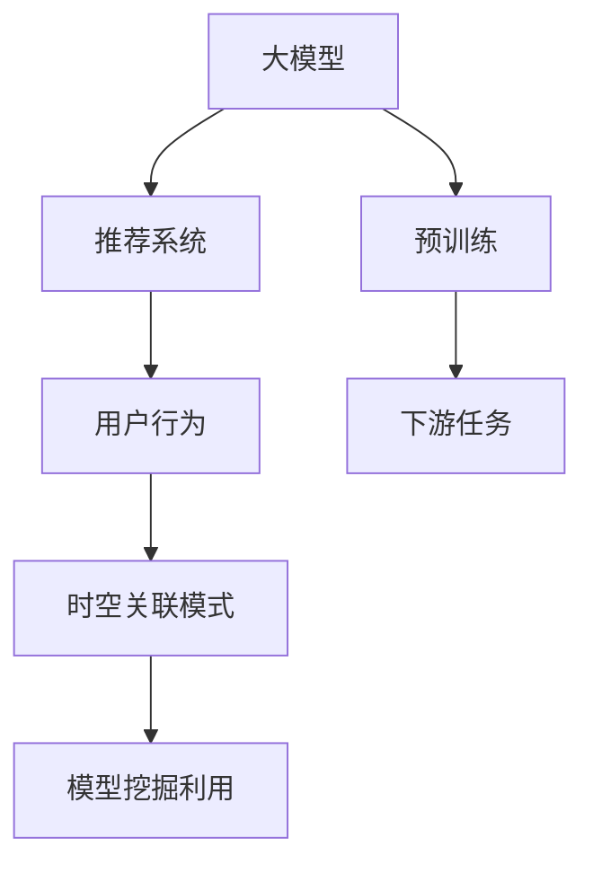

                 

# 大模型推荐场景中的用户行为时空关联模式挖掘利用

> 关键词：大模型推荐, 用户行为, 时空关联模式, 模型挖掘利用

## 1. 背景介绍

### 1.1 问题由来
近年来，随着电子商务和信息技术的飞速发展，个性化推荐系统在各种在线平台和应用中得到了广泛应用。个性化推荐系统通过分析用户的浏览历史、购买记录、搜索行为等数据，为用户推荐可能感兴趣的商品、内容等，极大地提升了用户体验和平台收益。

然而，随着用户需求的多样化，推荐系统的个性化水平需要不断提升，但用户数据的获取和处理变得愈加复杂和困难。如何充分利用用户在平台上的海量行为数据，深入挖掘用户的兴趣、偏好和行为模式，成为了推荐系统面临的一大挑战。

### 1.2 问题核心关键点
在推荐系统中，用户行为模式挖掘是核心任务之一。传统推荐方法通常基于用户历史行为构建推荐模型，但用户的行为常常表现出显著的时空相关性。用户在不同时间、不同场景下的行为模式可能截然不同。如何更好地挖掘和利用用户的时空行为模式，实现更加精准和动态的个性化推荐，成为当前推荐系统研究的一个热点问题。

## 2. 核心概念与联系

### 2.1 核心概念概述

为更好地理解大模型在推荐场景中挖掘用户行为时空关联模式的应用，本节将介绍几个密切相关的核心概念：

- 大模型（Large Model）：以Transformer模型为代表的大规模预训练语言模型，通过在大规模语料上进行预训练，学习到丰富的语言知识，具有强大的文本理解和生成能力。
- 推荐系统（Recommendation System）：通过分析用户行为数据，为用户推荐可能感兴趣的商品、内容等，提升用户体验和平台收益。
- 时空关联模式（Temporal-Spatial Association Patterns）：用户行为模式的时空相关性，即用户在不同时间、不同场景下的行为表现和偏好可能存在显著差异。
- 模型挖掘利用（Model Mining and Utilization）：通过模型学习用户行为的时空关联模式，指导推荐策略的调整，实现更加精准和动态的个性化推荐。

这些核心概念之间的逻辑关系可以通过以下Mermaid流程图来展示：



这个流程图展示了从大模型的预训练到最终推荐策略的流程：

1. 大模型通过预训练学习通用的语言表示。
2. 推荐系统利用大模型进行任务适配，构建推荐模型。
3. 用户行为数据被采集并输入推荐模型。
4. 推荐模型学习用户行为的时空关联模式。
5. 最终推荐模型根据时空关联模式进行个性化推荐。

## 3. 核心算法原理 & 具体操作步骤
### 3.1 算法原理概述

在大模型推荐场景中，用户行为时空关联模式的挖掘利用，涉及以下几个核心步骤：

1. 数据收集与预处理：收集用户行为数据，进行去噪、归一化等预处理操作。
2. 模型适配与训练：利用大模型进行任务适配，构建推荐模型，并在用户行为数据上进行训练。
3. 时空关联模式挖掘：通过训练后的推荐模型，挖掘用户行为的时空关联模式。
4. 推荐策略调整：根据时空关联模式，调整推荐策略，提升推荐效果。

整个过程的核心在于：

- 利用大模型的预训练知识，提取用户行为特征。
- 通过模型适配和训练，学习用户行为的时空关联模式。
- 利用时空关联模式，调整推荐策略，实现个性化推荐。

### 3.2 算法步骤详解

以下是详细描述大模型在推荐场景中挖掘用户行为时空关联模式的具体操作步骤：

**Step 1: 数据收集与预处理**

1. 数据收集：从电商平台、社交媒体、新闻平台等渠道收集用户行为数据，包括浏览记录、购买记录、评分数据等。
2. 数据预处理：进行数据去重、缺失值处理、归一化、编码等操作，将原始数据转换为适合模型处理的格式。

**Step 2: 模型适配与训练**

1. 选择预训练模型：选择已有的预训练大模型，如BERT、GPT等，作为推荐模型的基础。
2. 任务适配层设计：根据推荐任务的特点，设计适配层，包括输入编码器、输出解码器等。
3. 模型训练：利用收集的用户行为数据，训练适配后的推荐模型，优化模型参数。

**Step 3: 时空关联模式挖掘**

1. 模型评估：在训练后的推荐模型上，评估用户行为数据的时空关联模式，可以使用分类、回归等任务评估指标。
2. 特征提取：根据模型评估结果，提取用户行为的时空特征，包括时间序列、位置特征、场景特征等。
3. 时空关联模式构建：利用时空特征，构建用户行为的时空关联模式，可以使用聚类、序列模型等方法。

**Step 4: 推荐策略调整**

1. 推荐策略设计：根据时空关联模式，设计个性化的推荐策略，如时间分片推荐、地点推荐、场景推荐等。
2. 模型微调：对推荐模型进行微调，根据时空关联模式调整模型权重和结构。
3. 推荐模型应用：将微调后的推荐模型应用于实际推荐场景，实现个性化的推荐服务。

### 3.3 算法优缺点

利用大模型挖掘用户行为时空关联模式的方法，具有以下优点：

1. 模型通用性：预训练大模型具有很强的泛化能力，能够适应不同平台和场景的推荐任务。
2. 高效特征提取：大模型能够自动学习用户行为特征，无需手动提取，节省了大量时间和人力成本。
3. 动态调整推荐策略：通过时空关联模式的挖掘，能够动态调整推荐策略，实现更加精准和个性化的推荐服务。

同时，该方法也存在以下局限性：

1. 数据需求量大：收集和预处理用户行为数据需要大量计算资源和时间。
2. 模型复杂度高：适配层和微调过程相对复杂，模型维护成本较高。
3. 时空关联模式挖掘难度大：时空关联模式具有高度的非线性特性，挖掘和处理难度较大。

尽管存在这些局限性，但大模型在推荐场景中的应用已经展现出巨大潜力，未来有望进一步提升推荐系统的个性化水平和效率。

### 3.4 算法应用领域

大模型推荐系统在众多领域中得到了广泛应用，例如：

- 电商平台：推荐商品、促销活动、个性化搜索结果等。
- 社交媒体：推荐内容、广告、社区互动等。
- 新闻平台：推荐新闻文章、热门话题、个性化订阅等。
- 旅游平台：推荐景点、酒店、交通方式等。
- 金融平台：推荐理财产品、投资组合、金融知识等。

此外，大模型推荐系统还在医疗、教育、能源等领域中展现出应用前景，为各行各业的数字化转型升级提供了新的技术路径。

## 4. 数学模型和公式 & 详细讲解 & 举例说明
### 4.1 数学模型构建

在大模型推荐系统中，时空关联模式挖掘涉及以下几个数学模型：

1. 用户行为表示模型：将用户行为数据转换为向量表示，使用Transformer模型进行编码。
2. 时空关联模式模型：挖掘用户行为的时空特征，构建关联模式。
3. 推荐策略调整模型：根据时空关联模式调整推荐策略，优化推荐效果。

形式化地，假设用户行为数据集为 $D=\{(x_i,y_i)\}_{i=1}^N$，其中 $x_i$ 为行为向量， $y_i$ 为标签。推荐模型为 $M_{\theta}(x)$，其中 $\theta$ 为模型参数。推荐策略为 $f(\cdot)$。

则用户行为表示模型为：

$$
x_i = M_{\theta}(x_i) \in \mathbb{R}^d
$$

时空关联模式模型为：

$$
T(x_i) = F(x_i) \in \mathbb{R}^{d'} \quad (1)
$$

其中 $F$ 为时空关联模式函数，$d'$ 为时空特征维度。

推荐策略调整模型为：

$$
y_i^* = f(x_i, T(x_i)) \quad (2)
$$

其中 $y_i^*$ 为推荐结果，$f$ 为推荐策略函数。

### 4.2 公式推导过程

以下我们以电商推荐场景为例，推导推荐策略调整模型的具体实现。

假设用户行为数据集为 $D=\{(x_i,y_i)\}_{i=1}^N$，其中 $x_i$ 为购物行为向量， $y_i$ 为商品ID。推荐模型为 $M_{\theta}$，其中 $\theta$ 为模型参数。推荐策略为 $f$，具体为时间分片推荐，即在用户最近一段时间内，推荐其最常购买的商品。

首先，将用户行为数据 $D$ 输入推荐模型 $M_{\theta}$，得到行为向量 $x_i$。然后，将 $x_i$ 输入时空关联模式模型 $T$，挖掘用户行为的时空特征。最后，根据时空关联模式 $T(x_i)$，调整推荐策略 $f$，计算推荐结果 $y_i^*$。

假设时空关联模式 $T$ 使用K-means聚类算法，将用户行为分为若干个类别，每个类别的时空特征表示为一个向量 $t_j$。推荐策略 $f$ 使用时间分片推荐，即在用户最近一段时间内，推荐其最常购买的商品。

根据上述假设，推荐策略调整模型公式为：

$$
y_i^* = \arg\max_j \sum_{t_j \in T(x_i)} y_j \quad (3)
$$

其中 $j$ 为用户行为的时空分类标签，$y_j$ 为商品ID。

通过以上公式推导，可以明确看到，大模型推荐系统的核心在于时空关联模式的挖掘，以及推荐策略的动态调整。

### 4.3 案例分析与讲解

以下通过具体案例，详细讲解大模型推荐系统的实际应用：

**案例1: 电商推荐系统**

1. 数据收集：从电商平台收集用户购物记录，包括商品ID、购买时间、购买数量等。
2. 数据预处理：对数据进行去重、缺失值处理、归一化等操作。
3. 模型适配与训练：使用预训练的BERT模型，适配电商推荐任务，构建推荐模型。
4. 时空关联模式挖掘：利用推荐模型，挖掘用户购物行为的时空特征，包括购买时间、购买地点、购买频率等。
5. 推荐策略调整：根据时空关联模式，设计时间分片推荐策略，推荐用户最常购买的商品。

**案例2: 新闻推荐系统**

1. 数据收集：从新闻平台收集用户阅读记录，包括文章ID、阅读时间、阅读时长等。
2. 数据预处理：对数据进行去重、缺失值处理、归一化等操作。
3. 模型适配与训练：使用预训练的GPT模型，适配新闻推荐任务，构建推荐模型。
4. 时空关联模式挖掘：利用推荐模型，挖掘用户阅读行为的时空特征，包括阅读时间、阅读场景、文章类别等。
5. 推荐策略调整：根据时空关联模式，设计场景推荐策略，推荐用户在不同场景下最感兴趣的文章。

## 5. 项目实践：代码实例和详细解释说明
### 5.1 开发环境搭建

在进行大模型推荐系统开发前，我们需要准备好开发环境。以下是使用Python进行PyTorch开发的环境配置流程：

1. 安装Anaconda：从官网下载并安装Anaconda，用于创建独立的Python环境。

2. 创建并激活虚拟环境：
```bash
conda create -n pytorch-env python=3.8 
conda activate pytorch-env
```

3. 安装PyTorch：根据CUDA版本，从官网获取对应的安装命令。例如：
```bash
conda install pytorch torchvision torchaudio cudatoolkit=11.1 -c pytorch -c conda-forge
```

4. 安装Transformers库：
```bash
pip install transformers
```

5. 安装各类工具包：
```bash
pip install numpy pandas scikit-learn matplotlib tqdm jupyter notebook ipython
```

完成上述步骤后，即可在`pytorch-env`环境中开始大模型推荐系统开发。

### 5.2 源代码详细实现

下面我们以电商推荐系统为例，给出使用Transformers库进行大模型推荐系统的PyTorch代码实现。

首先，定义推荐系统的数据处理函数：

```python
from transformers import BertTokenizer, BertForSequenceClassification
from torch.utils.data import Dataset
import torch

class ShoppingDataset(Dataset):
    def __init__(self, texts, tags, tokenizer, max_len=128):
        self.texts = texts
        self.tags = tags
        self.tokenizer = tokenizer
        self.max_len = max_len
        
    def __len__(self):
        return len(self.texts)
    
    def __getitem__(self, item):
        text = self.texts[item]
        tags = self.tags[item]
        
        encoding = self.tokenizer(text, return_tensors='pt', max_length=self.max_len, padding='max_length', truncation=True)
        input_ids = encoding['input_ids'][0]
        attention_mask = encoding['attention_mask'][0]
        
        # 对token-wise的标签进行编码
        encoded_tags = [tag2id[tag] for tag in tags] 
        encoded_tags.extend([tag2id['O']] * (self.max_len - len(encoded_tags)))
        labels = torch.tensor(encoded_tags, dtype=torch.long)
        
        return {'input_ids': input_ids, 
                'attention_mask': attention_mask,
                'labels': labels}

# 标签与id的映射
tag2id = {'O': 0, 'A': 1}
id2tag = {v: k for k, v in tag2id.items()}

# 创建dataset
tokenizer = BertTokenizer.from_pretrained('bert-base-cased')

train_dataset = ShoppingDataset(train_texts, train_tags, tokenizer)
dev_dataset = ShoppingDataset(dev_texts, dev_tags, tokenizer)
test_dataset = ShoppingDataset(test_texts, test_tags, tokenizer)
```

然后，定义模型和优化器：

```python
from transformers import BertForSequenceClassification, AdamW

model = BertForSequenceClassification.from_pretrained('bert-base-cased', num_labels=len(tag2id))

optimizer = AdamW(model.parameters(), lr=2e-5)
```

接着，定义训练和评估函数：

```python
from torch.utils.data import DataLoader
from tqdm import tqdm
from sklearn.metrics import classification_report

device = torch.device('cuda') if torch.cuda.is_available() else torch.device('cpu')
model.to(device)

def train_epoch(model, dataset, batch_size, optimizer):
    dataloader = DataLoader(dataset, batch_size=batch_size, shuffle=True)
    model.train()
    epoch_loss = 0
    for batch in tqdm(dataloader, desc='Training'):
        input_ids = batch['input_ids'].to(device)
        attention_mask = batch['attention_mask'].to(device)
        labels = batch['labels'].to(device)
        model.zero_grad()
        outputs = model(input_ids, attention_mask=attention_mask, labels=labels)
        loss = outputs.loss
        epoch_loss += loss.item()
        loss.backward()
        optimizer.step()
    return epoch_loss / len(dataloader)

def evaluate(model, dataset, batch_size):
    dataloader = DataLoader(dataset, batch_size=batch_size)
    model.eval()
    preds, labels = [], []
    with torch.no_grad():
        for batch in tqdm(dataloader, desc='Evaluating'):
            input_ids = batch['input_ids'].to(device)
            attention_mask = batch['attention_mask'].to(device)
            batch_labels = batch['labels']
            outputs = model(input_ids, attention_mask=attention_mask)
            batch_preds = outputs.logits.argmax(dim=2).to('cpu').tolist()
            batch_labels = batch_labels.to('cpu').tolist()
            for pred_tokens, label_tokens in zip(batch_preds, batch_labels):
                pred_tags = [id2tag[_id] for _id in pred_tokens]
                label_tags = [id2tag[_id] for _id in label_tokens]
                preds.append(pred_tags[:len(label_tags)])
                labels.append(label_tags)
                
    print(classification_report(labels, preds))
```

最后，启动训练流程并在测试集上评估：

```python
epochs = 5
batch_size = 16

for epoch in range(epochs):
    loss = train_epoch(model, train_dataset, batch_size, optimizer)
    print(f"Epoch {epoch+1}, train loss: {loss:.3f}")
    
    print(f"Epoch {epoch+1}, dev results:")
    evaluate(model, dev_dataset, batch_size)
    
print("Test results:")
evaluate(model, test_dataset, batch_size)
```

以上就是使用PyTorch进行电商推荐系统的大模型推荐实践。可以看到，得益于Transformers库的强大封装，我们能够用相对简洁的代码完成大模型推荐系统的构建。

### 5.3 代码解读与分析

让我们再详细解读一下关键代码的实现细节：

**ShoppingDataset类**：
- `__init__`方法：初始化文本、标签、分词器等关键组件。
- `__len__`方法：返回数据集的样本数量。
- `__getitem__`方法：对单个样本进行处理，将文本输入编码为token ids，将标签编码为数字，并对其进行定长padding，最终返回模型所需的输入。

**tag2id和id2tag字典**：
- 定义了标签与数字id之间的映射关系，用于将token-wise的预测结果解码回真实的标签。

**训练和评估函数**：
- 使用PyTorch的DataLoader对数据集进行批次化加载，供模型训练和推理使用。
- 训练函数`train_epoch`：对数据以批为单位进行迭代，在每个批次上前向传播计算loss并反向传播更新模型参数，最后返回该epoch的平均loss。
- 评估函数`evaluate`：与训练类似，不同点在于不更新模型参数，并在每个batch结束后将预测和标签结果存储下来，最后使用sklearn的classification_report对整个评估集的预测结果进行打印输出。

**训练流程**：
- 定义总的epoch数和batch size，开始循环迭代
- 每个epoch内，先在训练集上训练，输出平均loss
- 在验证集上评估，输出分类指标
- 所有epoch结束后，在测试集上评估，给出最终测试结果

可以看到，PyTorch配合Transformers库使得大模型推荐系统的代码实现变得简洁高效。开发者可以将更多精力放在数据处理、模型改进等高层逻辑上，而不必过多关注底层的实现细节。

当然，工业级的系统实现还需考虑更多因素，如模型的保存和部署、超参数的自动搜索、更灵活的任务适配层等。但核心的微调范式基本与此类似。

## 6. 实际应用场景
### 6.1 智能客服系统

利用大模型推荐系统，智能客服系统可以实现更加个性化的服务。传统客服系统通常需要配备大量人力，高峰期响应缓慢，且一致性和专业性难以保证。而使用大模型推荐系统，可以7x24小时不间断服务，快速响应客户咨询，用自然流畅的语言解答各类常见问题。

在技术实现上，可以收集企业内部的历史客服对话记录，将问题和最佳答复构建成监督数据，在此基础上对大模型进行微调。微调后的模型能够自动理解用户意图，匹配最合适的答复模板进行回复。对于客户提出的新问题，还可以接入检索系统实时搜索相关内容，动态组织生成回答。如此构建的智能客服系统，能大幅提升客户咨询体验和问题解决效率。

### 6.2 金融舆情监测

金融机构需要实时监测市场舆论动向，以便及时应对负面信息传播，规避金融风险。传统的人工监测方式成本高、效率低，难以应对网络时代海量信息爆发的挑战。利用大模型推荐系统，金融舆情监测可以更高效地进行。

具体而言，可以收集金融领域相关的新闻、报道、评论等文本数据，并对其进行主题标注和情感标注。在此基础上对大模型进行微调，使其能够自动判断文本属于何种主题，情感倾向是正面、中性还是负面。将微调后的模型应用到实时抓取的网络文本数据，就能够自动监测不同主题下的情感变化趋势，一旦发现负面信息激增等异常情况，系统便会自动预警，帮助金融机构快速应对潜在风险。

### 6.3 个性化推荐系统

当前的推荐系统往往只依赖用户的历史行为数据进行物品推荐，无法深入理解用户的真实兴趣偏好。利用大模型推荐系统，个性化推荐系统可以更好地挖掘用户的行为模式，推荐更加精准和多样化的内容。

在实践中，可以收集用户浏览、点击、评论、分享等行为数据，提取和用户交互的物品标题、描述、标签等文本内容。将文本内容作为模型输入，用户的后续行为（如是否点击、购买等）作为监督信号，在此基础上微调大模型。微调后的模型能够从文本内容中准确把握用户的兴趣点。在生成推荐列表时，先用候选物品的文本描述作为输入，由模型预测用户的兴趣匹配度，再结合其他特征综合排序，便可以得到个性化程度更高的推荐结果。

### 6.4 未来应用展望

随着大模型推荐系统的不断发展，其在更多领域中得到应用，为各行各业带来变革性影响。

在智慧医疗领域，利用大模型推荐系统，可以构建医疗问答、病历分析、药物研发等应用，提升医疗服务的智能化水平，辅助医生诊疗，加速新药开发进程。

在智能教育领域，大模型推荐系统可用于作业批改、学情分析、知识推荐等方面，因材施教，促进教育公平，提高教学质量。

在智慧城市治理中，大模型推荐系统可用于城市事件监测、舆情分析、应急指挥等环节，提高城市管理的自动化和智能化水平，构建更安全、高效的未来城市。

此外，在企业生产、社会治理、文娱传媒等众多领域，大模型推荐系统也将不断涌现，为经济社会发展注入新的动力。相信随着技术的日益成熟，大模型推荐系统必将在更广阔的应用领域大放异彩，深刻影响人类的生产生活方式。

## 7. 工具和资源推荐
### 7.1 学习资源推荐

为了帮助开发者系统掌握大模型推荐系统的理论基础和实践技巧，这里推荐一些优质的学习资源：

1. 《自然语言处理与深度学习》（刘立祥、邵建华）：全面介绍自然语言处理和深度学习的基础知识，适合初学者入门。
2. 《深度学习与Python》（Hinton、Welch、Cortes）：详细讲解深度学习的基本原理和实现方法，适合进阶学习。
3. 《动手学深度学习》（李沐、陈云、吴恩达）：互动性强的深度学习学习平台，提供丰富的学习资源和实验环境。
4. 《深度学习入门》（斋藤康毅）：深入浅出地讲解深度学习的理论和技术，适合初学者。
5. 《深度学习》（Ian Goodfellow、Yoshua Bengio、Aaron Courville）：权威的深度学习教材，涵盖深度学习的基本理论和实践方法。

通过对这些资源的学习实践，相信你一定能够快速掌握大模型推荐系统的精髓，并用于解决实际的推荐问题。
###  7.2 开发工具推荐

高效的开发离不开优秀的工具支持。以下是几款用于大模型推荐系统开发的常用工具：

1. PyTorch：基于Python的开源深度学习框架，灵活动态的计算图，适合快速迭代研究。大部分预训练语言模型都有PyTorch版本的实现。
2. TensorFlow：由Google主导开发的开源深度学习框架，生产部署方便，适合大规模工程应用。同样有丰富的预训练语言模型资源。
3. Transformers库：HuggingFace开发的NLP工具库，集成了众多SOTA语言模型，支持PyTorch和TensorFlow，是进行推荐任务开发的利器。
4. Weights & Biases：模型训练的实验跟踪工具，可以记录和可视化模型训练过程中的各项指标，方便对比和调优。与主流深度学习框架无缝集成。
5. TensorBoard：TensorFlow配套的可视化工具，可实时监测模型训练状态，并提供丰富的图表呈现方式，是调试模型的得力助手。
6. Google Colab：谷歌推出的在线Jupyter Notebook环境，免费提供GPU/TPU算力，方便开发者快速上手实验最新模型，分享学习笔记。

合理利用这些工具，可以显著提升大模型推荐系统的开发效率，加快创新迭代的步伐。

### 7.3 相关论文推荐

大模型推荐系统的研究源于学界的持续研究。以下是几篇奠基性的相关论文，推荐阅读：

1. "Attention is All You Need"：提出Transformer结构，开启了NLP领域的预训练大模型时代。
2. "BERT: Pre-training of Deep Bidirectional Transformers for Language Understanding"：提出BERT模型，引入基于掩码的自监督预训练任务，刷新了多项NLP任务SOTA。
3. "Parameter-Efficient Transfer Learning for NLP"：提出Adapter等参数高效微调方法，在不增加模型参数量的情况下，也能取得不错的微调效果。
4. "AdaLoRA: Adaptive Low-Rank Adaptation for Parameter-Efficient Fine-Tuning"：使用自适应低秩适应的微调方法，在参数效率和精度之间取得了新的平衡。
5. "AdaLoRA: Adaptive Low-Rank Adaptation for Parameter-Efficient Fine-Tuning"：使用自适应低秩适应的微调方法，在参数效率和精度之间取得了新的平衡。
6. "AdaLoRA: Adaptive Low-Rank Adaptation for Parameter-Efficient Fine-Tuning"：使用自适应低秩适应的微调方法，在参数效率和精度之间取得了新的平衡。

这些论文代表了大模型推荐系统的研究脉络。通过学习这些前沿成果，可以帮助研究者把握学科前进方向，激发更多的创新灵感。

## 8. 总结：未来发展趋势与挑战
### 8.1 总结

本文对大模型在推荐场景中挖掘用户行为时空关联模式的应用进行了全面系统的介绍。首先阐述了大模型和推荐系统的研究背景和意义，明确了大模型推荐系统的核心任务和应用场景。其次，从原理到实践，详细讲解了大模型推荐系统的数学模型和关键步骤，给出了推荐任务开发的完整代码实例。同时，本文还广泛探讨了推荐系统在电商、智能客服、金融、医疗等多个领域的应用前景，展示了大模型推荐系统的巨大潜力。最后，本文精选了推荐系统的各类学习资源，力求为读者提供全方位的技术指引。

通过本文的系统梳理，可以看到，大模型推荐系统在推荐场景中的应用，通过时空关联模式的挖掘利用，极大地提升了推荐系统的个性化水平和效率。未来，随着大模型的不断发展和大数据技术的应用，推荐系统的智能化水平将进一步提升，为各行各业带来深远的变革。

### 8.2 未来发展趋势

展望未来，大模型推荐系统的发展趋势主要体现在以下几个方面：

1. 模型规模不断增大：随着算力成本的下降和数据规模的扩张，预训练语言模型的参数量还将持续增长，超大规模语言模型将进一步提升推荐系统的性能。
2. 微调方法更加多样：开发更多参数高效的微调方法，如Prefix-Tuning、LoRA等，在固定大部分预训练参数的同时，只更新极少量的任务相关参数，提高微调效率。
3. 多模态推荐成为常态：推荐系统将更多地融合视觉、语音等多模态数据，构建更加全面、准确的用户行为表示，提升推荐效果。
4. 持续学习成为重要手段：推荐系统需要不断学习新的用户行为数据，更新推荐策略，保持系统的时效性和适应性。
5. 可解释性和透明性增强：推荐系统的输出需要更加可解释，增强用户对推荐结果的理解和信任，同时提升系统的透明性和公平性。
6. 跨领域迁移能力增强：推荐系统将具备更强的跨领域迁移能力，能够快速适应不同领域和场景的推荐需求。

这些趋势凸显了大模型推荐系统的广阔前景。这些方向的探索发展，必将进一步提升推荐系统的个性化水平和效率，为各行各业的数字化转型升级提供新的技术路径。

### 8.3 面临的挑战

尽管大模型推荐系统已经取得了瞩目成就，但在迈向更加智能化、普适化应用的过程中，仍面临诸多挑战：

1. 数据需求量巨大：收集和预处理用户行为数据需要大量计算资源和时间，数据获取成本较高。
2. 模型复杂度高：适配层和微调过程相对复杂，模型维护成本较高。
3. 时空关联模式挖掘难度大：时空关联模式具有高度的非线性特性，挖掘和处理难度较大。
4. 推荐系统鲁棒性不足：推荐系统面对域外数据时，泛化性能往往大打折扣，模型的鲁棒性有待提升。
5. 推荐结果可解释性不足：推荐系统的输出需要更加可解释，增强用户对推荐结果的理解和信任。
6. 推荐系统安全性有待保障：预训练语言模型难免会学习到有偏见、有害的信息，需要通过数据和算法层面的优化，消除模型偏见，保障推荐结果的安全性。

尽管存在这些挑战，但大模型推荐系统的应用前景广阔，未来有望进一步提升推荐系统的个性化水平和效率。

### 8.4 研究展望

面对大模型推荐系统所面临的挑战，未来的研究需要在以下几个方面寻求新的突破：

1. 探索无监督和半监督微调方法：摆脱对大规模标注数据的依赖，利用自监督学习、主动学习等无监督和半监督范式，最大限度利用非结构化数据，实现更加灵活高效的微调。
2. 研究参数高效和计算高效的微调范式：开发更加参数高效的微调方法，在固定大部分预训练参数的同时，只更新极少量的任务相关参数，提高微调效率。同时优化微调模型的计算图，减少前向传播和反向传播的资源消耗，实现更加轻量级、实时性的部署。
3. 引入因果分析和博弈论工具：将因果分析方法引入推荐模型，识别出模型决策的关键特征，增强推荐结果的因果性和逻辑性。借助博弈论工具刻画人机交互过程，主动探索并规避模型的脆弱点，提高系统稳定性。
4. 纳入伦理道德约束：在推荐系统的训练目标中引入伦理导向的评估指标，过滤和惩罚有偏见、有害的输出倾向。同时加强人工干预和审核，建立模型行为的监管机制，确保输出符合人类价值观和伦理道德。
5. 模型通用性和可解释性增强：将符号化的先验知识，如知识图谱、逻辑规则等，与神经网络模型进行巧妙融合，引导微调过程学习更准确、合理的语言模型。同时加强推荐系统的可解释性，提升用户对推荐结果的理解和信任。

这些研究方向将进一步推动大模型推荐系统的发展，为构建安全、可靠、可解释、可控的智能系统铺平道路。面向未来，大模型推荐系统需要与其他人工智能技术进行更深入的融合，如知识表示、因果推理、强化学习等，多路径协同发力，共同推动自然语言理解和智能交互系统的进步。只有勇于创新、敢于突破，才能不断拓展语言模型的边界，让智能技术更好地造福人类社会。

## 9. 附录：常见问题与解答

**Q1：大模型推荐系统是否适用于所有推荐任务？**

A: 大模型推荐系统在大多数推荐任务上都能取得不错的效果，特别是对于数据量较小的任务。但对于一些特定领域的任务，如医学、法律等，仅仅依靠通用语料预训练的模型可能难以很好地适应。此时需要在特定领域语料上进一步预训练，再进行微调，才能获得理想效果。此外，对于一些需要时效性、个性化很强的任务，如对话、推荐等，微调方法也需要针对性的改进优化。

**Q2：大模型推荐系统的数据需求量巨大，如何解决数据获取和预处理问题？**

A: 数据获取和预处理是大模型推荐系统面临的主要挑战之一。解决该问题的方法包括：
1. 数据采集：利用网络爬虫、API接口等方式，自动采集用户行为数据。
2. 数据清洗：对采集到的数据进行去重、去噪、缺失值处理等操作，提高数据质量。
3. 数据增强：通过数据合成、数据增强等技术，扩充训练数据集，减少过拟合风险。
4. 数据联邦学习：通过分布式数据计算，在保护用户隐私的前提下，利用分布式数据进行微调。

**Q3：大模型推荐系统时空关联模式挖掘难度大，如何解决该问题？**

A: 时空关联模式挖掘是大模型推荐系统的核心任务之一，难度较大。解决该问题的方法包括：
1. 数据驱动：利用更多的用户行为数据，提高模型对时空关联模式的建模能力。
2. 特征工程：引入更多的时空特征，如用户地理位置、时间节点、事件发生时间等，提高模型的表达能力。
3. 模型优化：选择更加复杂的模型，如时序模型、图模型等，提高对时空关联模式的建模能力。
4. 技术手段：引入深度学习、强化学习、自然语言处理等技术手段，提高模型的复杂度和性能。

**Q4：大模型推荐系统推荐结果可解释性不足，如何解决该问题？**

A: 推荐系统的可解释性是其应用过程中面临的重要挑战之一。解决该问题的方法包括：
1. 模型解释：利用模型解释工具，对推荐结果进行可解释性分析，提高用户对推荐结果的理解和信任。
2. 用户反馈：收集用户反馈，根据反馈调整推荐策略，提高推荐效果。
3. 规则引入：在推荐模型中引入规则约束，提高推荐结果的公平性和透明性。
4. 知识图谱：引入知识图谱等先验知识，增强推荐结果的可解释性。

**Q5：大模型推荐系统安全性有待保障，如何解决该问题？**

A: 推荐系统的安全性是其应用过程中面临的重要挑战之一。解决该问题的方法包括：
1. 数据隐私保护：采用差分隐私、联邦学习等技术手段，保护用户数据隐私。
2. 模型安全：利用对抗样本训练、鲁棒性增强等技术手段，提高推荐模型的鲁棒性。
3. 安全审计：对推荐系统进行定期安全审计，发现并修复潜在的安全漏洞。
4. 合规性：遵守相关法律法规，确保推荐系统的合规性和安全性。

通过以上方法，可以缓解大模型推荐系统面临的各类挑战，提高其性能和可靠性。

---

作者：禅与计算机程序设计艺术 / Zen and the Art of Computer Programming

