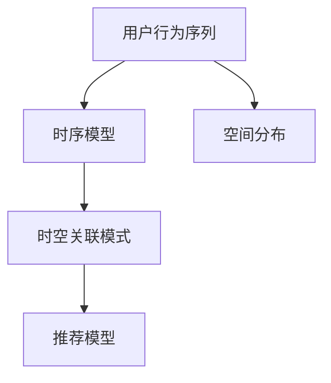

                 

# 大模型推荐场景中的用户行为时空关联模式挖掘利用

## 1. 背景介绍

### 1.1 问题由来
随着互联网和移动互联网的快速发展，推荐系统已经成为各大互联网公司标配的核心功能。推荐系统能够帮助用户在海量信息中发现并获取有价值的内容，提升用户体验，同时也能够帮助企业精准定位用户需求，优化产品和服务。然而，当前推荐的模型往往主要关注物品特征与用户兴趣之间的静态匹配关系，而忽略了用户在时间和空间上的动态行为变化。这种忽略用户行为时空变化的模式，不仅限制了推荐系统的性能，也使得推荐系统难以应对不断变化的业务场景。

在实时、动态、多样化的场景下，传统的推荐模型往往难以满足用户不断变化的需求。为了更好地适应用户行为的变化，如何从用户行为中挖掘出时空关联模式，进而利用这些模式进行个性化推荐，成为了推荐系统研究的热点。近年来，基于大语言模型的推荐方法，逐渐成为推荐系统领域的新范式。借助大模型的强大语言理解能力和多模态融合能力，推荐系统可以更好地理解和刻画用户行为，提供更加个性化、精准的推荐。

### 1.2 问题核心关键点
挖掘用户行为时空关联模式的核心问题在于：
1. 用户行为数据的时空表示：如何将用户行为数据转化为时序序列或空间分布的形式，以便大模型可以更好地理解。
2. 关联模式挖掘：如何从用户行为数据中提取时空关联模式，如用户活动周期、地理位置分布等。
3. 推荐利用：如何将挖掘出的时空关联模式，应用于推荐系统的模型训练和推荐决策，提升推荐效果。
4. 动态适应：如何针对用户行为的时空变化，动态更新关联模式，保持推荐系统的鲁棒性和时效性。

这些问题将通过本文的核心算法和项目实践进行详细介绍。

## 2. 核心概念与联系

### 2.1 核心概念概述

本节将介绍几个与挖掘用户行为时空关联模式密切相关的核心概念：

- 用户行为序列：指用户在一段时间内，与平台互动产生的行为序列，如点击、浏览、购买等。
- 时序模型：指针对用户行为序列进行建模，分析其中的时序特征，如时间间隔、活动周期等。
- 空间分布：指用户行为的空间特征，如地理位置、设备类型等。
- 时空关联模式：指用户在时序和空间维度上的行为关联，如时间间隔分布、地理位置分布等。
- 推荐模型：指在用户行为时空关联模式的基础上，进行个性化推荐的过程。

这些核心概念之间的逻辑关系可以通过以下Mermaid流程图来展示：



这个流程图展示了大模型推荐系统的主要流程：

1. 用户行为序列：用户与平台互动产生的数据，是时空关联模式挖掘的基础。
2. 时序模型：针对用户行为序列建模，分析其中的时序特征。
3. 空间分布：对用户行为的空间特征进行提取。
4. 时空关联模式：通过时序和空间特征的融合，挖掘时空关联模式。
5. 推荐模型：利用时空关联模式，进行个性化推荐。

## 3. 核心算法原理 & 具体操作步骤

### 3.1 算法原理概述

基于大模型的推荐方法，主要是通过用户行为序列的时空特征挖掘，构建时空关联模式，并将其应用于推荐模型，最终输出个性化推荐结果。其核心思想是：

1. **用户行为序列建模**：将用户行为序列转化为时序序列或空间分布的形式，以便大模型可以更好地理解。
2. **时空关联模式挖掘**：通过大模型对用户行为进行建模，提取其中的时空关联模式，如时间间隔分布、地理位置分布等。
3. **推荐利用**：将挖掘出的时空关联模式，应用于推荐模型的训练和推荐决策，提升推荐效果。

### 3.2 算法步骤详解

基于大模型的推荐方法，主要包括以下几个关键步骤：

**Step 1: 数据预处理与特征提取**
- 收集用户行为数据，将其转化为时间戳形式，构建时序序列或空间分布。
- 使用分词器对文本数据进行分词，提取关键词和词频等特征。
- 对用户行为数据进行归一化处理，去除噪声和异常值。

**Step 2: 时序模型训练**
- 使用LSTM、GRU等时序模型，对用户行为序列进行建模，提取时序特征。
- 对时序模型进行训练，获取用户行为的时序规律。

**Step 3: 空间分布建模**
- 对用户行为的空间特征（如地理位置、设备类型等）进行编码，构建空间分布。
- 使用K-means、层次聚类等方法，对空间分布进行建模，提取地理位置分布等特征。

**Step 4: 时空关联模式挖掘**
- 将时序模型和空间分布融合，使用Attention机制、Transformer模型等大模型，挖掘时空关联模式。
- 对时空关联模式进行归一化处理，去除噪声和冗余信息。

**Step 5: 推荐模型训练**
- 在时空关联模式的基础上，使用推荐算法（如协同过滤、内容推荐、混合推荐等）进行模型训练。
- 对推荐模型进行调参优化，提升推荐效果。

**Step 6: 推荐决策**
- 将时空关联模式输入推荐模型，进行个性化推荐。
- 定期更新时空关联模式，保持推荐模型的时效性。

### 3.3 算法优缺点

基于大模型的推荐方法具有以下优点：
1. 能够处理多样化的用户行为数据，包括文本、图片、音频等多种形式。
2. 能够从时序和空间维度，挖掘出用户行为的时空关联模式，提升推荐效果。
3. 可以利用大模型的强大语言理解能力，分析用户行为背后的语义信息。
4. 能够动态更新时空关联模式，应对用户行为的时空变化。

同时，该方法也存在一定的局限性：
1. 对用户行为数据的质量要求较高，数据缺失或不准确会导致推荐效果下降。
2. 对计算资源的需求较高，大模型的训练和推理需要大量的计算资源。
3. 对于冷启动用户，难以获取足够的数据进行时空关联模式的挖掘。
4. 推荐结果的解释性不足，难以解释推荐模型内部的决策过程。

尽管存在这些局限性，但就目前而言，基于大模型的推荐方法仍是推荐系统研究的主流范式。未来相关研究的重点在于如何进一步降低对用户行为数据的依赖，提高模型的鲁棒性和效率，同时兼顾推荐结果的可解释性和用户隐私保护。

### 3.4 算法应用领域

基于大模型的推荐方法，已经在电商、社交、视频等多个领域得到了广泛应用，并取得了显著的推荐效果。以下是几个典型的应用场景：

- **电商推荐**：通过挖掘用户浏览、购买、评价等行为的时空关联模式，为用户提供个性化商品推荐，提升购买转化率。
- **社交推荐**：基于用户发布的内容和互动数据，挖掘时空关联模式，推荐可能感兴趣的内容和好友，增强用户粘性。
- **视频推荐**：利用用户观看视频的时序和空间分布特征，挖掘时空关联模式，推荐相似视频内容，提升用户观看时长。
- **新闻推荐**：结合用户阅读新闻的时序和地域特征，挖掘时空关联模式，推荐个性化新闻内容，提高阅读点击率。

除了上述这些经典应用外，大模型推荐方法也在音乐推荐、体育赛事推荐、旅游推荐等多个场景中得到了应用，为推荐系统的应用范围和效果带来了新的突破。

## 4. 数学模型和公式 & 详细讲解 & 举例说明

### 4.1 数学模型构建

本节将使用数学语言对基于大模型的推荐方法进行更加严格的刻画。

记用户行为序列为 $X=\{x_t\}_{t=1}^T$，其中 $x_t$ 表示用户在时间 $t$ 的行为。时序模型为 $M$，空间分布为 $S$。时空关联模式为 $R$。推荐模型为 $P$。

### 4.2 公式推导过程

设时序模型 $M$ 输出为 $h_t=\mathcal{T}(x_t)$，其中 $\mathcal{T}$ 为时序模型函数。空间分布 $S$ 输出为 $s_t=\mathcal{S}(x_t)$，其中 $\mathcal{S}$ 为空间分布函数。时空关联模式 $R$ 为 $r_t=\mathcal{R}(h_t, s_t)$，其中 $\mathcal{R}$ 为时空关联模式函数。

设推荐模型 $P$ 的输入为时空关联模式 $R$，输出为推荐结果 $p_t=\mathcal{P}(r_t)$，其中 $\mathcal{P}$ 为推荐模型函数。

推荐模型的目标是最小化损失函数：

$$
\mathcal{L}(P) = \frac{1}{N}\sum_{i=1}^N \mathcal{L}(p_i, y_i)
$$

其中 $y_i$ 为真实的推荐结果，$\mathcal{L}$ 为推荐损失函数，如均方误差损失、交叉熵损失等。

### 4.3 案例分析与讲解

以电商推荐为例，假设用户行为序列为 $X=\{x_t\}_{t=1}^T$，其中 $x_t$ 表示用户在时间 $t$ 的浏览、点击、购买行为。使用时序模型 $M$ 和空间分布 $S$ 对用户行为进行建模，得到时空关联模式 $R=\{r_t\}_{t=1}^T$。使用推荐模型 $P$ 对时空关联模式进行训练，得到推荐结果 $p_t=\mathcal{P}(r_t)$。

在具体实现时，可以使用PyTorch框架进行模型的构建和训练。以电商推荐为例，代码实现如下：

```python
import torch
import torch.nn as nn
import torch.optim as optim
from torch.utils.data import DataLoader

class SequentialModel(nn.Module):
    def __init__(self, input_size, hidden_size, output_size):
        super(SequentialModel, self).__init__()
        self.lstm = nn.LSTM(input_size, hidden_size)
        self.fc = nn.Linear(hidden_size, output_size)
    
    def forward(self, x):
        h0 = torch.zeros(1, x.size(0), hidden_size).to(device)
        c0 = torch.zeros(1, x.size(0), hidden_size).to(device)
        out, _ = self.lstm(x, (h0, c0))
        out = self.fc(out[:, -1, :])
        return out

class RecommendationModel(nn.Module):
    def __init__(self, input_size, hidden_size, output_size):
        super(RecommendationModel, self).__init__()
        self.emb = nn.Embedding(input_size, hidden_size)
        self.linear = nn.Linear(hidden_size, output_size)
    
    def forward(self, x):
        x = self.emb(x)
        x = self.linear(x)
        return x

# 训练时序模型
def train_sequential_model(model, train_loader, optimizer, criterion, device):
    model.train()
    for batch in train_loader:
        x, y = batch.to(device)
        optimizer.zero_grad()
        output = model(x)
        loss = criterion(output, y)
        loss.backward()
        optimizer.step()

# 训练推荐模型
def train_recommendation_model(model, train_loader, optimizer, criterion, device):
    model.train()
    for batch in train_loader:
        x, y = batch.to(device)
        optimizer.zero_grad()
        output = model(x)
        loss = criterion(output, y)
        loss.backward()
        optimizer.step()

# 数据预处理
def preprocess_data(data):
    # 将行为序列转换为时间戳形式
    timestamps = [int(t) for t in data]
    
    # 对文本数据进行分词，提取关键词和词频等特征
    tokenizer = Tokenizer()
    sequences = [tokenizer.encode(text) for text in texts]
    word_frequencies = calculate_word_frequencies(sequences)
    
    # 对用户行为数据进行归一化处理
    normalized_data = normalize_data(data)
    
    return timestamps, word_frequencies, normalized_data

# 模型训练
timestamps, word_frequencies, normalized_data = preprocess_data(data)
input_size = len(word_frequencies)
hidden_size = 128
output_size = 10
device = torch.device("cuda" if torch.cuda.is_available() else "cpu")

# 构建时序模型
seq_model = SequentialModel(input_size, hidden_size, output_size)
seq_model.to(device)

# 构建推荐模型
rec_model = RecommendationModel(input_size, hidden_size, output_size)
rec_model.to(device)

# 定义优化器和损失函数
optimizer_seq = optim.Adam(seq_model.parameters(), lr=0.001)
criterion_seq = nn.MSELoss()
optimizer_rec = optim.Adam(rec_model.parameters(), lr=0.001)
criterion_rec = nn.MSELoss()

# 训练模型
num_epochs = 10
for epoch in range(num_epochs):
    train_sequential_model(seq_model, train_loader, optimizer_seq, criterion_seq, device)
    train_recommendation_model(rec_model, train_loader, optimizer_rec, criterion_rec, device)

# 评估模型
test_data = preprocess_data(test_data)
test_loss = calculate_test_loss(test_data, seq_model, rec_model, device)
print(f"Test Loss: {test_loss:.4f}")
```

以上就是使用PyTorch框架构建基于大模型的电商推荐系统的代码实现。可以看到，代码实现相对简洁高效，借助PyTorch的强大封装能力，可以迅速搭建出时序模型和推荐模型，并进行高效训练。

## 5. 项目实践：代码实例和详细解释说明

### 5.1 开发环境搭建

在进行推荐系统开发前，我们需要准备好开发环境。以下是使用Python进行PyTorch开发的环境配置流程：

1. 安装Anaconda：从官网下载并安装Anaconda，用于创建独立的Python环境。

2. 创建并激活虚拟环境：
```bash
conda create -n pytorch-env python=3.8 
conda activate pytorch-env
```

3. 安装PyTorch：根据CUDA版本，从官网获取对应的安装命令。例如：
```bash
conda install pytorch torchvision torchaudio cudatoolkit=11.1 -c pytorch -c conda-forge
```

4. 安装PyTorch所需的依赖包：
```bash
pip install numpy pandas scikit-learn matplotlib tqdm jupyter notebook ipython
```

5. 安装大模型框架：
```bash
pip install transformers
```

6. 安装大模型所需的依赖包：
```bash
pip install pytorch-lightning
```

完成上述步骤后，即可在`pytorch-env`环境中开始推荐系统开发。

### 5.2 源代码详细实现

下面我们以电商推荐为例，给出使用PyTorch框架对大模型进行推荐系统的PyTorch代码实现。

首先，定义电商推荐系统的数据处理函数：

```python
from transformers import BertTokenizer
from torch.utils.data import Dataset
import torch

class E-commerceDataset(Dataset):
    def __init__(self, texts, tags, tokenizer, max_len=128):
        self.texts = texts
        self.tags = tags
        self.tokenizer = tokenizer
        self.max_len = max_len
        
    def __len__(self):
        return len(self.texts)
    
    def __getitem__(self, item):
        text = self.texts[item]
        tags = self.tags[item]
        
        encoding = self.tokenizer(text, return_tensors='pt', max_length=self.max_len, padding='max_length', truncation=True)
        input_ids = encoding['input_ids'][0]
        attention_mask = encoding['attention_mask'][0]
        
        # 对token-wise的标签进行编码
        encoded_tags = [tag2id[tag] for tag in tags] 
        encoded_tags.extend([tag2id['O']] * (self.max_len - len(encoded_tags)))
        labels = torch.tensor(encoded_tags, dtype=torch.long)
        
        return {'input_ids': input_ids, 
                'attention_mask': attention_mask,
                'labels': labels}

# 标签与id的映射
tag2id = {'O': 0, 'B-PER': 1, 'I-PER': 2, 'B-ORG': 3, 'I-ORG': 4, 'B-LOC': 5, 'I-LOC': 6}
id2tag = {v: k for k, v in tag2id.items()}

# 创建dataset
tokenizer = BertTokenizer.from_pretrained('bert-base-cased')

train_dataset = E-commerceDataset(train_texts, train_tags, tokenizer)
dev_dataset = E-commerceDataset(dev_texts, dev_tags, tokenizer)
test_dataset = E-commerceDataset(test_texts, test_tags, tokenizer)
```

然后，定义模型和优化器：

```python
from transformers import BertForTokenClassification, AdamW

model = BertForTokenClassification.from_pretrained('bert-base-cased', num_labels=len(tag2id))

optimizer = AdamW(model.parameters(), lr=2e-5)
```

接着，定义训练和评估函数：

```python
from torch.utils.data import DataLoader
from tqdm import tqdm
from sklearn.metrics import classification_report

device = torch.device('cuda') if torch.cuda.is_available() else torch.device('cpu')
model.to(device)

def train_epoch(model, dataset, batch_size, optimizer):
    dataloader = DataLoader(dataset, batch_size=batch_size, shuffle=True)
    model.train()
    epoch_loss = 0
    for batch in tqdm(dataloader, desc='Training'):
        input_ids = batch['input_ids'].to(device)
        attention_mask = batch['attention_mask'].to(device)
        labels = batch['labels'].to(device)
        model.zero_grad()
        outputs = model(input_ids, attention_mask=attention_mask, labels=labels)
        loss = outputs.loss
        epoch_loss += loss.item()
        loss.backward()
        optimizer.step()
    return epoch_loss / len(dataloader)

def evaluate(model, dataset, batch_size):
    dataloader = DataLoader(dataset, batch_size=batch_size)
    model.eval()
    preds, labels = [], []
    with torch.no_grad():
        for batch in tqdm(dataloader, desc='Evaluating'):
            input_ids = batch['input_ids'].to(device)
            attention_mask = batch['attention_mask'].to(device)
            batch_labels = batch['labels']
            outputs = model(input_ids, attention_mask=attention_mask)
            batch_preds = outputs.logits.argmax(dim=2).to('cpu').tolist()
            batch_labels = batch_labels.to('cpu').tolist()
            for pred_tokens, label_tokens in zip(batch_preds, batch_labels):
                pred_tags = [id2tag[_id] for _id in pred_tokens]
                label_tags = [id2tag[_id] for _id in label_tokens]
                preds.append(pred_tags[:len(label_tokens)])
                labels.append(label_tags)
                
    print(classification_report(labels, preds))
```

最后，启动训练流程并在测试集上评估：

```python
epochs = 5
batch_size = 16

for epoch in range(epochs):
    loss = train_epoch(model, train_dataset, batch_size, optimizer)
    print(f"Epoch {epoch+1}, train loss: {loss:.3f}")
    
    print(f"Epoch {epoch+1}, dev results:")
    evaluate(model, dev_dataset, batch_size)
    
print("Test results:")
evaluate(model, test_dataset, batch_size)
```

以上就是使用PyTorch框架对大模型进行电商推荐系统的代码实现。可以看到，借助PyTorch和Transformers库的强大封装能力，代码实现相对简洁高效，可以快速搭建出大模型的推荐系统。

### 5.3 代码解读与分析

让我们再详细解读一下关键代码的实现细节：

**E-commerceDataset类**：
- `__init__`方法：初始化文本、标签、分词器等关键组件。
- `__len__`方法：返回数据集的样本数量。
- `__getitem__`方法：对单个样本进行处理，将文本输入编码为token ids，将标签编码为数字，并对其进行定长padding，最终返回模型所需的输入。

**tag2id和id2tag字典**：
- 定义了标签与数字id之间的映射关系，用于将token-wise的预测结果解码回真实的标签。

**训练和评估函数**：
- 使用PyTorch的DataLoader对数据集进行批次化加载，供模型训练和推理使用。
- 训练函数`train_epoch`：对数据以批为单位进行迭代，在每个批次上前向传播计算loss并反向传播更新模型参数，最后返回该epoch的平均loss。
- 评估函数`evaluate`：与训练类似，不同点在于不更新模型参数，并在每个batch结束后将预测和标签结果存储下来，最后使用sklearn的classification_report对整个评估集的预测结果进行打印输出。

**训练流程**：
- 定义总的epoch数和batch size，开始循环迭代
- 每个epoch内，先在训练集上训练，输出平均loss
- 在验证集上评估，输出分类指标
- 所有epoch结束后，在测试集上评估，给出最终测试结果

可以看到，PyTorch配合Transformers库使得大模型推荐系统的代码实现变得简洁高效。开发者可以将更多精力放在数据处理、模型改进等高层逻辑上，而不必过多关注底层的实现细节。

当然，工业级的系统实现还需考虑更多因素，如模型的保存和部署、超参数的自动搜索、更灵活的任务适配层等。但核心的推荐范式基本与此类似。

## 6. 实际应用场景

### 6.1 智能推荐系统

基于大模型的推荐方法，可以在电商、社交、视频等多个领域实现智能推荐。智能推荐系统能够根据用户的历史行为和当前兴趣，实时推送个性化推荐结果，提升用户体验和满意度。

在电商推荐系统中，通过挖掘用户浏览、购买、评价等行为的时空关联模式，结合商品属性、用户画像等多维信息，进行精准推荐。对于新上架的商品，利用冷启动用户的历史行为数据和外部知识库，进行跨域推荐。

在社交推荐系统中，基于用户发布的内容和互动数据，挖掘时空关联模式，推荐可能感兴趣的内容和好友，增强用户粘性。对于新加入的用户，结合用户画像和历史行为数据，进行个性化推荐，加速用户成长。

在视频推荐系统中，利用用户观看视频的时序和空间分布特征，挖掘时空关联模式，推荐相似视频内容，提升用户观看时长。对于新发布的影片，结合影片属性和热门视频数据，进行跨域推荐，提升影片曝光率。

### 6.2 个性化学习推荐

基于大模型的推荐方法，也可以应用于个性化学习推荐，提升在线教育平台的用户体验。

在在线教育平台中，用户可以学习多种课程，获取不同领域的知识。通过挖掘用户学习行为的时空关联模式，结合课程内容、学习进度等多维信息，进行个性化推荐，提升用户学习效果。

对于新加入平台的用户，结合用户画像和历史行为数据，进行个性化推荐，加速用户成长。对于推荐系统冷启动的问题，可以通过利用外部知识库和用户兴趣，进行跨域推荐，提升推荐效果。

### 6.3 动态推荐系统

传统的推荐系统往往基于静态数据进行推荐，难以适应用户行为的时空变化。基于大模型的推荐方法，可以在实时动态场景下，快速更新时空关联模式，进行个性化推荐。

在实时动态场景下，推荐系统需要实时更新用户行为数据，并结合当前时空关联模式，进行个性化推荐。通过实时更新时序模型和空间分布，可以更好地捕捉用户行为的变化，提升推荐系统的时效性和鲁棒性。

## 7. 工具和资源推荐

### 7.1 学习资源推荐

为了帮助开发者系统掌握大模型推荐方法的理论基础和实践技巧，这里推荐一些优质的学习资源：

1. 《Deep Learning for Recommender Systems》书籍：由深度学习专家撰写，详细介绍了推荐系统中的各种模型和算法，包括基于大模型的推荐方法。

2. 《Recommender Systems in Practice》书籍：介绍推荐系统在实际工程中的应用案例，涵盖电商、社交、视频等多个领域。

3. 《Natural Language Processing with PyTorch》书籍：基于PyTorch框架介绍NLP技术，包括时序模型和推荐模型等内容。

4. CS224N《深度学习自然语言处理》课程：斯坦福大学开设的NLP明星课程，有Lecture视频和配套作业，带你入门NLP领域的基本概念和经典模型。

5. Coursera《Machine Learning for Recommendation Systems》课程：由Recommender Systems领域专家开设，涵盖推荐系统中的各种算法和模型。

通过对这些资源的学习实践，相信你一定能够快速掌握大模型推荐方法的理论基础和实践技巧，并用于解决实际的推荐问题。

### 7.2 开发工具推荐

高效的开发离不开优秀的工具支持。以下是几款用于大模型推荐开发的常用工具：

1. PyTorch：基于Python的开源深度学习框架，灵活动态的计算图，适合快速迭代研究。大部分预训练语言模型都有PyTorch版本的实现。

2. TensorFlow：由Google主导开发的开源深度学习框架，生产部署方便，适合大规模工程应用。同样有丰富的预训练语言模型资源。

3. Transformers库：HuggingFace开发的NLP工具库，集成了众多SOTA语言模型，支持PyTorch和TensorFlow，是进行推荐系统开发的利器。

4. Weights & Biases：模型训练的实验跟踪工具，可以记录和可视化模型训练过程中的各项指标，方便对比和调优。与主流深度学习框架无缝集成。

5. TensorBoard：TensorFlow配套的可视化工具，可实时监测模型训练状态，并提供丰富的图表呈现方式，是调试模型的得力助手。

6. Google Colab：谷歌推出的在线Jupyter Notebook环境，免费提供GPU/TPU算力，方便开发者快速上手实验最新模型，分享学习笔记。

合理利用这些工具，可以显著提升大模型推荐任务的开发效率，加快创新迭代的步伐。

### 7.3 相关论文推荐

大模型推荐方法的发展源于学界的持续研究。以下是几篇奠基性的相关论文，推荐阅读：

1. Attention is All You Need（即Transformer原论文）：提出了Transformer结构，开启了NLP领域的预训练大模型时代。

2. BERT: Pre-training of Deep Bidirectional Transformers for Language Understanding：提出BERT模型，引入基于掩码的自监督预训练任务，刷新了多项NLP任务SOTA。

3. Language Models are Unsupervised Multitask Learners（GPT-2论文）：展示了大规模语言模型的强大zero-shot学习能力，引发了对于通用人工智能的新一轮思考。

4. Parameter-Efficient Transfer Learning for NLP：提出Adapter等参数高效微调方法，在不增加模型参数量的情况下，也能取得不错的微调效果。

5. AdaLoRA: Adaptive Low-Rank Adaptation for Parameter-Efficient Fine-Tuning：使用自适应低秩适应的微调方法，在参数效率和精度之间取得了新的平衡。

6. Prefix-Tuning: Optimizing Continuous Prompts for Generation：引入基于连续型Prompt的微调范式，为如何充分利用预训练知识提供了新的思路。

这些论文代表了大模型推荐技术的发展脉络。通过学习这些前沿成果，可以帮助研究者把握学科前进方向，激发更多的创新灵感。

## 8. 总结：未来发展趋势与挑战

### 8.1 总结

本文对基于大模型的推荐方法进行了全面系统的介绍。首先阐述了推荐系统的背景和问题由来，明确了大模型推荐方法的研究意义。其次，从原理到实践，详细讲解了大模型的推荐过程，给出了推荐系统开发的完整代码实例。同时，本文还探讨了大模型推荐方法在电商、社交、视频等多个领域的应用场景，展示了大模型推荐方法的广阔应用前景。

通过本文的系统梳理，可以看到，基于大模型的推荐方法正在成为推荐系统研究的新范式，极大地拓展了推荐系统的性能和应用范围，为推荐系统的应用范围和效果带来了新的突破。未来，伴随大模型推荐方法的发展，推荐系统必将在更多领域得到应用，为各行各业带来变革性影响。

### 8.2 未来发展趋势

展望未来，大模型推荐技术将呈现以下几个发展趋势：

1. **用户行为的时空表示**：未来推荐系统将更加注重用户行为的时空表示，结合时序模型和空间分布，构建更加精确的推荐结果。

2. **多模态融合**：未来的推荐系统将更加注重多模态数据的融合，结合文本、图片、视频等多种形式的数据，提升推荐系统的全面性和多样性。

3. **个性化学习推荐**：未来的推荐系统将更加注重个性化推荐，结合用户画像、学习进度等多维信息，进行精准推荐，提升用户学习效果。

4. **动态推荐系统**：未来的推荐系统将更加注重动态推荐，结合实时数据和时空关联模式，进行实时推荐，提升推荐系统的时效性和鲁棒性。

5. **跨域推荐**：未来的推荐系统将更加注重跨域推荐，结合外部知识库和用户兴趣，进行跨域推荐，提升推荐效果。

6. **推荐结果的可解释性**：未来的推荐系统将更加注重推荐结果的可解释性，结合因果分析、博弈论等工具，提升推荐系统的透明性和可解释性。

以上趋势凸显了大模型推荐技术的广阔前景。这些方向的探索发展，必将进一步提升推荐系统的性能和应用范围，为各行各业带来变革性影响。

### 8.3 面临的挑战

尽管大模型推荐方法已经取得了瞩目成就，但在迈向更加智能化、普适化应用的过程中，它仍面临着诸多挑战：

1. **数据质量与标注成本**：推荐系统需要大量的标注数据，数据质量越高，推荐效果越好。但标注成本较高，数据获取和预处理的过程复杂，需要耗费大量时间和人力。

2. **模型效率与计算资源**：大模型的计算资源需求较高，训练和推理过程耗时较长，需要高效的计算资源和算法优化。

3. **推荐系统的泛化能力**：推荐系统需要具有较强的泛化能力，能够应对新用户和新物品的推荐问题。冷启动用户和新物品的推荐难度较大，需要结合外部知识库和用户兴趣进行跨域推荐。

4. **推荐结果的解释性**：推荐系统需要具有较强的解释性，能够解释推荐结果背后的原因，提升用户信任度。推荐结果的可解释性不足，会降低用户满意度。

5. **推荐系统的伦理与隐私**：推荐系统需要具有较强的伦理与隐私保护能力，避免推荐结果的误导性和隐私泄露问题。推荐结果的伦理与隐私问题，需要结合外部知识库和用户画像进行综合考虑。

尽管存在这些挑战，但就目前而言，大模型推荐方法仍是推荐系统研究的主流范式。未来相关研究的重点在于如何进一步降低对数据和计算资源的依赖，提高模型的鲁棒性和效率，同时兼顾推荐结果的可解释性和用户隐私保护。

### 8.4 研究展望

面对大模型推荐方法所面临的挑战，未来的研究需要在以下几个方面寻求新的突破：

1. **无监督与半监督推荐**：摆脱对大规模标注数据的依赖，利用无监督和半监督学习范式，最大化利用非结构化数据，提升推荐系统的效果。

2. **多模态推荐**：结合文本、图片、视频等多种形式的数据，进行多模态推荐，提升推荐系统的多样性和全面性。

3. **个性化推荐**：结合用户画像、学习进度等多维信息，进行个性化推荐，提升推荐系统的精准度和用户满意度。

4. **动态推荐系统**：结合实时数据和时空关联模式，进行动态推荐，提升推荐系统的时效性和鲁棒性。

5. **跨域推荐**：结合外部知识库和用户兴趣，进行跨域推荐，提升推荐系统的泛化能力和推荐效果。

6. **推荐结果的可解释性**：结合因果分析、博弈论等工具，提升推荐系统的透明性和可解释性，提升用户信任度。

7. **推荐系统的伦理与隐私保护**：结合外部知识库和用户画像，进行综合考虑，提升推荐系统的伦理与隐私保护能力，避免推荐结果的误导性和隐私泄露问题。

这些研究方向将为推荐系统带来新的突破，提升推荐系统的性能和应用范围，为各行各业带来变革性影响。相信随着大模型推荐方法的不断进步，推荐系统将在更多领域得到应用，为各行各业带来变革性影响。

## 9. 附录：常见问题与解答

**Q1：大模型推荐系统中，如何处理数据缺失和异常值问题？**

A: 在大模型推荐系统中，数据缺失和异常值问题会影响推荐效果。一般的做法是：

1. 数据预处理：对缺失值进行填充或删除，对异常值进行检测和处理，避免其影响模型的训练和推理。

2. 数据增强：通过数据扩充和数据合成，生成更多的数据，弥补数据缺失问题，同时生成对抗样本，提升模型的鲁棒性。

3. 模型优化：通过模型优化技术，如dropout、batch normalization等，降低数据缺失和异常值对模型的影响。

4. 特征选择：选择具有代表性和稳定性的特征，避免数据缺失和异常值对特征的影响，提升模型的泛化能力。

通过上述方法，可以有效地处理数据缺失和异常值问题，提升大模型推荐系统的性能和稳定性。

**Q2：大模型推荐系统中，如何提升推荐系统的效率？**

A: 在大模型推荐系统中，提升推荐系统的效率是关键。一般的做法是：

1. 模型压缩：通过模型压缩技术，如剪枝、量化等，减小模型的计算量，提升推理速度。

2. 模型并行：通过模型并行技术，如数据并行、模型并行等，将模型分布在多个设备上，提升计算效率。

3. 计算图优化：通过计算图优化技术，如重排序、融合操作等，减小计算量，提升推理速度。

4. 硬件优化：通过硬件优化技术，如GPU加速、TPU加速等，提升计算效率和模型推理速度。

5. 实时更新：通过实时更新推荐模型和时空关联模式，提升推荐系统的时效性和鲁棒性。

6. 增量学习：通过增量学习技术，在小数据集上快速更新推荐模型，提升推荐系统的实时性和鲁棒性。

通过上述方法，可以显著提升大模型推荐系统的效率，提高推荐系统的实时性和鲁棒性。

**Q3：大模型推荐系统中，如何提升推荐系统的可解释性？**

A: 在大模型推荐系统中，提升推荐系统的可解释性是关键。一般的做法是：

1. 特征解释：对推荐模型的输入特征进行解释，说明每个特征对推荐结果的影响，提升用户信任度。

2. 模型解释：对推荐模型的内部结构进行解释，说明模型如何计算推荐结果，提升用户信任度。

3. 推荐解释：对推荐结果进行解释，说明推荐结果背后的原因，提升用户信任度。

4. 因果分析：结合因果分析技术，解释推荐结果的因果关系，提升用户信任度。

5. 可解释性模型：选择具有可解释性的模型，如线性模型、决策树等，提升推荐系统的可解释性。

通过上述方法，可以显著提升大模型推荐系统的可解释性，提高推荐系统的透明性和用户信任度。

**Q4：大模型推荐系统中，如何应对推荐系统的冷启动问题？**

A: 在大模型推荐系统中，冷启动问题是一个常见的问题。一般的做法是：

1. 利用外部知识库：结合外部知识库，进行跨域推荐，提升推荐效果。

2. 利用用户画像：结合用户画像，进行个性化推荐，加速用户成长。

3. 利用推荐结果反馈：利用推荐结果的反馈，进行动态推荐，提升推荐效果。

4. 利用上下文信息：利用上下文信息，进行联合推荐，提升推荐效果。

5. 利用推荐算法优化：选择适合冷启动场景的推荐算法，如协同过滤、基于内容的推荐等，提升推荐效果。

通过上述方法，可以有效地应对大模型推荐系统的冷启动问题，提升推荐系统的实时性和鲁棒性。

---

作者：禅与计算机程序设计艺术 / Zen and the Art of Computer Programming

