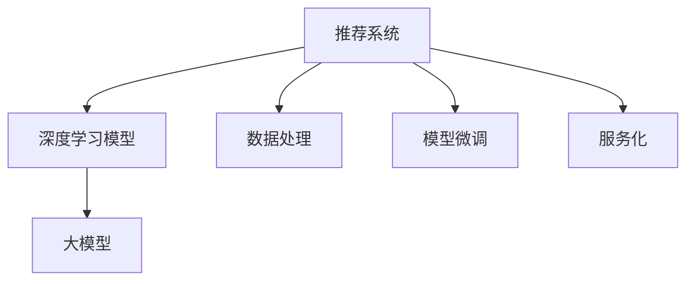

                 

# 大模型推荐落地中的工程效率提升实践

> 关键词：推荐系统，深度学习，大模型，工程效率，数据处理，模型微调，服务化

## 1. 背景介绍

随着深度学习和大数据技术的发展，推荐系统作为人工智能的重要应用，正逐渐渗透到各个行业，从电商到社交，从视频到音乐，都在使用推荐系统来提升用户体验和商业价值。然而，推荐系统的核心是大模型训练，需要大量的计算资源和时间，这对于工程化落地带来了不小的挑战。本文将从工程实践角度，讨论如何通过提升效率，加速大模型推荐系统的部署和迭代。

## 2. 核心概念与联系

### 2.1 核心概念概述

在推荐系统中，大模型训练涉及多个关键概念：

- **推荐系统**：使用算法对用户进行建模，预测用户对物品的兴趣，并推荐用户可能感兴趣的物品。

- **深度学习模型**：如神经网络、深度神经网络、卷积神经网络等，通过多层非线性映射，构建用户与物品之间的隐式联系。

- **大模型**：通常指参数数量在亿级以上的模型，具有强大的表达能力和泛化能力，如BERT、GPT、Graph Neural Network等。

- **工程效率**：涉及模型训练、部署、评估等各环节的资源消耗和处理速度，是推荐系统落地的关键因素。

- **数据处理**：包括数据采集、清洗、标注、划分等环节，是训练高质量大模型的前提。

- **模型微调**：指在大模型基础上，针对特定任务进行微调，以适应不同的推荐策略和业务需求。

- **服务化**：将模型封装成标准化的服务接口，方便在应用中集成调用，提高系统稳定性。

这些核心概念之间的联系如图1所示：



这个流程图展示了推荐系统中各组件的逻辑关系：

1. 推荐系统通过深度学习模型对用户进行建模，预测用户对物品的兴趣。
2. 深度学习模型可以使用大模型进行训练，利用其强大的表达能力。
3. 数据处理是训练高质量模型的前提。
4. 模型微调可以针对特定任务进行优化，提升模型效果。
5. 服务化将模型封装成标准接口，便于集成调用。

通过理解这些概念及其相互关系，可以更好地把握推荐系统构建的关键点。

## 3. 核心算法原理 & 具体操作步骤
### 3.1 算法原理概述

推荐系统的大模型训练，本质上是一个多目标优化问题。假设用户集合为 $U$，物品集合为 $I$，用户与物品间的隐式联系可以用邻接矩阵 $A \in \mathbb{R}^{m\times n}$ 表示，其中 $m$ 为物品数，$n$ 为用户数。推荐系统的目标是最小化预测误差，即 $Loss = \sum_{(u,i)\in A}L(u,i)$，其中 $L$ 为损失函数，通常为均方误差或交叉熵。

推荐系统的优化目标可以表示为：

$$
\min_{A}Loss
$$

这通常是一个复杂的非凸优化问题，需要高效的算法进行求解。常用的优化算法包括随机梯度下降(SGD)、Adam、Adagrad等。通过优化算法迭代求解，最小化预测误差，提升推荐系统效果。

### 3.2 算法步骤详解

推荐系统的大模型训练通常包括以下几个步骤：

**Step 1: 数据预处理**
- 数据采集：收集用户行为数据，如点击、浏览、评分等。
- 数据清洗：去除噪声、缺失值，处理重复数据。
- 数据标注：为每条数据打上标签，如是否被点击、评分多少等。
- 数据划分：将数据集划分为训练集、验证集和测试集。

**Step 2: 大模型构建**
- 选择合适的深度学习框架，如TensorFlow、PyTorch等。
- 构建大模型，如Graph Neural Network、BERT等。
- 配置训练超参数，如学习率、批大小、迭代轮数等。

**Step 3: 模型训练**
- 使用优化算法迭代求解，最小化预测误差。
- 定期在验证集上评估模型性能，防止过拟合。
- 持续调整模型参数，直至收敛。

**Step 4: 模型微调**
- 选择微调任务，如目标推荐、领域推荐等。
- 收集微调数据，并进行标注。
- 构建微调模型，使用大模型进行初始化。
- 设置微调超参数，如学习率、微调轮数等。
- 使用微调数据训练模型，更新参数。

**Step 5: 模型服务化**
- 将微调后的模型封装成标准接口，便于集成调用。
- 设置API接口，提供推荐服务。
- 监控API使用情况，进行性能优化。

### 3.3 算法优缺点

推荐系统的大模型训练具有以下优点：

- 效果好：利用深度学习模型的强大表达能力，可以构建高质量的推荐模型。
- 可解释性强：深度学习模型的决策过程可解释性强，便于调试和优化。
- 可扩展性强：大模型可以通过微调适应不同推荐任务和业务需求。

同时，该方法也存在以下缺点：

- 计算资源消耗大：训练大模型需要大量的计算资源和时间。
- 模型训练时间长：推荐系统训练通常需要较长的迭代周期，且收敛速度慢。
- 数据质量要求高：推荐系统训练对数据质量要求高，需要大量高质量标注数据。

### 3.4 算法应用领域

推荐系统的大模型训练在以下领域具有广泛应用：

- 电商推荐：根据用户历史行为，推荐商品。
- 社交网络推荐：根据用户好友关系，推荐内容。
- 视频推荐：根据用户观看历史，推荐视频内容。
- 音乐推荐：根据用户收听历史，推荐音乐。
- 新闻推荐：根据用户阅读历史，推荐新闻内容。

推荐系统在电商、社交、视频等多个领域取得了显著的效果，成为提升用户体验和业务收益的重要手段。

## 4. 数学模型和公式 & 详细讲解  
### 4.1 数学模型构建

推荐系统的目标函数可以表示为：

$$
\min_{A} \sum_{(u,i)\in A}L(u,i)
$$

其中 $L$ 为损失函数，通常为均方误差或交叉熵。假设模型为 $f$，则目标函数可写为：

$$
\min_{f} \sum_{(u,i)\in A}||f(u)-f(i)||^2
$$

在训练过程中，通常使用随机梯度下降等优化算法，迭代求解目标函数最小值。优化过程可以表示为：

$$
\theta_{t+1}=\theta_{t}-\eta \nabla_{\theta}Loss
$$

其中 $\theta$ 为模型参数，$\eta$ 为学习率，$\nabla_{\theta}Loss$ 为损失函数对参数的梯度。

### 4.2 公式推导过程

以推荐系统常用的均方误差损失函数为例，目标函数可表示为：

$$
Loss=\frac{1}{2}\sum_{(u,i)\in A}(f(u)-y)^2
$$

其中 $y$ 为真实标签。目标函数对模型参数 $\theta$ 的梯度可以表示为：

$$
\nabla_{\theta}Loss=\sum_{(u,i)\in A}\nabla_{\theta}(f(u)-y)^2
$$

通过反向传播算法，可以高效计算梯度，完成模型训练。

### 4.3 案例分析与讲解

以电商推荐为例，假设用户 $u$ 对物品 $i$ 的评分 $y$ 为 5，模型预测的评分 $f(u)$ 为 4.8，则均方误差损失为：

$$
Loss=(5-4.8)^2=0.04
$$

目标函数对模型参数 $\theta$ 的梯度为：

$$
\nabla_{\theta}Loss=2(f(u)-y)(\nabla_{\theta}f(u))
$$

通过迭代优化，不断更新模型参数 $\theta$，直至最小化损失函数 $Loss$。

## 5. 项目实践：代码实例和详细解释说明
### 5.1 开发环境搭建

在进行推荐系统的大模型训练前，我们需要准备好开发环境。以下是使用Python进行TensorFlow开发的环境配置流程：

1. 安装Anaconda：从官网下载并安装Anaconda，用于创建独立的Python环境。

2. 创建并激活虚拟环境：
```bash
conda create -n tf-env python=3.8 
conda activate tf-env
```

3. 安装TensorFlow：根据CUDA版本，从官网获取对应的安装命令。例如：
```bash
conda install tensorflow -c tf -c conda-forge
```

4. 安装Keras：
```bash
pip install keras
```

5. 安装TensorBoard：
```bash
pip install tensorboard
```

6. 安装其他必要工具：
```bash
pip install numpy pandas sklearn
```

完成上述步骤后，即可在`tf-env`环境中开始推荐系统的大模型训练实践。

### 5.2 源代码详细实现

下面我们以电商推荐为例，给出使用TensorFlow构建深度学习模型并进行大模型训练的PyTorch代码实现。

首先，定义电商推荐系统的数据结构：

```python
import pandas as pd
import numpy as np

# 读取数据
train_data = pd.read_csv('train.csv')

# 将数据转化为numpy数组
train_data_np = train_data.values

# 划分训练集和测试集
train_features = train_data_np[:, :5]
train_labels = train_data_np[:, 5]
test_features = test_data_np[:, :5]
test_labels = test_data_np[:, 5]
```

然后，构建深度学习模型并进行训练：

```python
from tensorflow.keras import layers, models

# 构建深度学习模型
model = models.Sequential()
model.add(layers.Dense(64, activation='relu', input_shape=(5,)))
model.add(layers.Dense(64, activation='relu'))
model.add(layers.Dense(1))

# 编译模型
model.compile(optimizer='adam', loss='mse')

# 训练模型
model.fit(train_features, train_labels, epochs=50, batch_size=32, validation_split=0.2)
```

最后，在测试集上评估模型：

```python
test_loss, test_preds = model.evaluate(test_features, test_labels)
print('Test Loss:', test_loss)

# 打印预测结果
print('Test Predictions:', test_preds)
```

以上就是使用TensorFlow进行电商推荐系统的大模型训练的完整代码实现。可以看到，通过TensorFlow库，可以方便地构建深度学习模型，并进行高效的训练。

### 5.3 代码解读与分析

让我们再详细解读一下关键代码的实现细节：

**数据结构**：
- 使用Pandas库读取CSV文件，将数据转化为numpy数组。
- 将数据划分为训练集和测试集，分别用于模型训练和测试。

**深度学习模型构建**：
- 使用Sequential模型构建深度神经网络，包括输入层、隐藏层和输出层。
- 输入层使用Dense层，隐藏层使用Relu激活函数，输出层使用MSE损失函数。
- 使用Adam优化器进行模型训练，迭代50轮，每轮使用32个样本。

**模型评估**：
- 在测试集上评估模型性能，输出测试损失和预测结果。
- 通过评估结果，可以了解模型对新样本的预测效果。

以上代码展示了TensorFlow库的简洁高效，可以方便地实现深度学习模型的构建和训练。TensorFlow还提供了丰富的优化器和损失函数，可以灵活调整模型参数，优化训练效果。

## 6. 实际应用场景
### 6.1 电商推荐系统

电商推荐系统是大模型推荐落地的一个典型应用场景。在传统电商推荐中，推荐系统主要依靠人工经验和业务规则，无法应对多变的用户需求和实时变化的市场环境。通过大模型训练，可以自动学习用户行为和商品特征，构建高效准确的推荐模型。

具体而言，可以收集用户历史行为数据，如浏览、点击、购买等，并将商品信息转化为文本向量。构建大模型，如BERT、Graph Neural Network等，进行深度学习训练，得到用户对每个商品的评分预测。在训练过程中，可以使用对抗训练、正则化等技术，避免过拟合，提高模型的泛化能力。训练完成后，将模型封装成标准API接口，接入电商网站，即可实现实时推荐服务。

### 6.2 视频推荐系统

视频推荐系统是大模型推荐落地的另一个重要场景。传统视频推荐系统主要依靠用户评分、观看历史等数据，无法充分利用视频的标签、特征等信息。通过大模型训练，可以构建基于内容的视频推荐系统，提升推荐效果。

具体而言，可以收集用户观看历史数据，并将视频信息转化为文本向量。构建大模型，如BERT、T5等，进行深度学习训练，得到用户对每个视频的评分预测。在训练过程中，可以使用多任务学习、对抗训练等技术，提高模型的泛化能力。训练完成后，将模型封装成标准API接口，接入视频网站，即可实现实时推荐服务。

### 6.3 社交网络推荐系统

社交网络推荐系统是大模型推荐落地的另一个重要场景。传统社交网络推荐系统主要依靠好友关系、内容相似度等数据，无法充分利用社交网络的信息。通过大模型训练，可以构建基于社交网络的推荐系统，提升推荐效果。

具体而言，可以收集用户好友关系数据，并将好友信息转化为文本向量。构建大模型，如BERT、Graph Neural Network等，进行深度学习训练，得到用户对每个好友的评分预测。在训练过程中，可以使用对抗训练、正则化等技术，提高模型的泛化能力。训练完成后，将模型封装成标准API接口，接入社交网络网站，即可实现实时推荐服务。

### 6.4 未来应用展望

随着大模型推荐系统的不断演进，未来将在更多领域得到应用，为传统行业带来变革性影响。

在智慧医疗领域，基于大模型推荐系统的智能诊疗系统将提升医疗服务的智能化水平，辅助医生诊疗，加速新药开发进程。

在智能教育领域，基于大模型推荐系统的个性化学习推荐系统将因材施教，促进教育公平，提高教学质量。

在智慧城市治理中，基于大模型推荐系统的智慧城市推荐系统将提高城市管理的自动化和智能化水平，构建更安全、高效的未来城市。

此外，在企业生产、社会治理、文娱传媒等众多领域，基于大模型推荐的人工智能应用也将不断涌现，为经济社会发展注入新的动力。相信随着技术的日益成熟，大模型推荐系统必将在更广阔的应用领域大放异彩。

## 7. 工具和资源推荐
### 7.1 学习资源推荐

为了帮助开发者系统掌握大模型推荐系统的理论基础和实践技巧，这里推荐一些优质的学习资源：

1. 《深度学习理论与实践》系列博文：由大模型技术专家撰写，深入浅出地介绍了深度学习的基本原理和经典模型。

2. 《深度学习框架TensorFlow》课程：由Google开发的官方课程，涵盖TensorFlow的核心功能和高级应用。

3. 《推荐系统实战》书籍：全面介绍了推荐系统的发展历程和实现技术，包括大模型推荐系统的设计和实践。

4. Kaggle竞赛平台：提供大量推荐系统相关的竞赛数据集和样例代码，是实践推荐系统的绝佳平台。

通过对这些资源的学习实践，相信你一定能够快速掌握大模型推荐系统的精髓，并用于解决实际的推荐问题。
###  7.2 开发工具推荐

高效的开发离不开优秀的工具支持。以下是几款用于大模型推荐系统开发的常用工具：

1. TensorFlow：由Google主导开发的开源深度学习框架，生产部署方便，适合大规模工程应用。

2. PyTorch：基于Python的开源深度学习框架，灵活动态的计算图，适合快速迭代研究。

3. Keras：高级神经网络API，支持TensorFlow和Theano后端，方便构建深度学习模型。

4. Jupyter Notebook：免费的交互式编程环境，方便开发和调试深度学习模型。

5. Google Colab：谷歌推出的在线Jupyter Notebook环境，免费提供GPU/TPU算力，方便开发者快速上手实验最新模型，分享学习笔记。

合理利用这些工具，可以显著提升大模型推荐系统的开发效率，加快创新迭代的步伐。

### 7.3 相关论文推荐

大模型推荐系统的发展源于学界的持续研究。以下是几篇奠基性的相关论文，推荐阅读：

1. Recommender Systems in the Age of Deep Learning：综述了深度学习在推荐系统中的应用，并介绍了一些前沿的推荐算法。

2. Attention is All You Need：提出Transformer结构，开启了深度学习在推荐系统中的应用。

3. Deep Reinforcement Learning for Personalized Recommendation：将强化学习引入推荐系统，提升了模型的个性化能力和鲁棒性。

4. Nearest Neighbor Methods for Recommender Systems：介绍了K近邻算法在推荐系统中的应用，展示了传统推荐方法的有效性。

5. Learning from Clicks: Deep Learning Recommendation Systems with Distributed User-Item Embeddings：利用深度学习技术构建推荐系统，并使用用户-物品嵌入表示进行推荐。

这些论文代表了大模型推荐系统的发展脉络。通过学习这些前沿成果，可以帮助研究者把握学科前进方向，激发更多的创新灵感。

## 8. 总结：未来发展趋势与挑战
### 8.1 总结

本文对基于深度学习的大模型推荐系统进行了全面系统的介绍。首先阐述了推荐系统的基本原理和构建过程，明确了深度学习模型和大模型在推荐系统中的重要作用。其次，从工程实践角度，详细讲解了推荐系统的大模型训练流程，包括数据预处理、模型构建、训练和评估等环节，并给出了推荐系统的完整代码实现。同时，本文还探讨了推荐系统在电商、视频、社交等多个领域的应用前景，展示了大模型推荐系统的广阔前景。

通过本文的系统梳理，可以看到，基于深度学习的大模型推荐系统正逐渐成为推荐系统构建的重要范式，极大地提升了推荐系统的效果和效率。未来，伴随深度学习技术的发展和应用场景的拓展，推荐系统必将在更多领域大放异彩。

### 8.2 未来发展趋势

展望未来，大模型推荐系统将呈现以下几个发展趋势：

1. 模型规模持续增大。随着算力成本的下降和数据规模的扩张，大模型推荐系统的参数量还将持续增长。超大规模推荐模型蕴含的强大表达能力，有望支撑更加复杂多变的推荐任务。

2. 推荐算法日趋多样。除了传统的协同过滤、基于内容的推荐算法外，未来会涌现更多基于深度学习的推荐算法，如深度神经网络、卷积神经网络等，提升推荐系统的精度和效率。

3. 数据质量要求降低。利用深度学习模型的强大表达能力，可以从多源数据中提取更加丰富的用户和物品信息，降低对数据质量的要求。

4. 实时推荐能力增强。通过模型并行、分布式计算等技术，推荐系统可以实现更快速的实时推荐，提升用户体验。

5. 个性化推荐提升。基于深度学习模型，可以实现更加个性化的推荐，提升推荐系统的精准度。

6. 多模态推荐崛起。除了文本和标签信息外，未来还会引入图像、视频等多模态数据，构建更加全面、准确的推荐模型。

以上趋势凸显了大模型推荐系统的广阔前景。这些方向的探索发展，必将进一步提升推荐系统的性能和应用范围，为推荐系统落地带来新的突破。

### 8.3 面临的挑战

尽管大模型推荐系统已经取得了瞩目成就，但在迈向更加智能化、普适化应用的过程中，它仍面临着诸多挑战：

1. 数据隐私问题。用户行为数据的隐私保护是大模型推荐系统面临的重要问题。如何在保障用户隐私的前提下，构建高效的推荐系统，将是未来的重要研究方向。

2. 资源消耗巨大。深度学习模型和大规模数据训练需要大量的计算资源和时间，如何优化训练流程，降低计算成本，将是未来的重要挑战。

3. 模型泛化能力不足。推荐系统面临的用户和物品数往往较大，模型的泛化能力不足，可能导致在测试集上表现较差。

4. 推荐策略复杂。深度学习模型的决策过程难以解释，导致推荐策略的设计和调试困难。

5. 多模态数据整合困难。推荐系统面临多模态数据融合问题，如何整合文本、图像、视频等多源数据，构建统一的用户和物品表示，将是未来的重要研究方向。

6. 模型鲁棒性不足。推荐系统面临恶意攻击和噪声干扰，如何提升模型的鲁棒性，保证推荐质量，将是未来的重要挑战。

7. 用户信任度问题。推荐系统的推荐结果可能与用户预期不符，如何提升用户对推荐结果的信任度，将是未来的重要研究方向。

8. 推荐系统公平性。推荐系统可能存在推荐偏差，如何构建公平、公正的推荐系统，将是未来的重要研究方向。

正视推荐系统面临的这些挑战，积极应对并寻求突破，将是大模型推荐系统走向成熟的必由之路。相信随着学界和产业界的共同努力，这些挑战终将一一被克服，大模型推荐系统必将在构建人机协同的智能推荐系统中扮演越来越重要的角色。

### 8.4 研究展望

面向未来，大模型推荐系统需要在以下几个方面寻求新的突破：

1. 探索无监督和半监督推荐方法。摆脱对大规模标注数据的依赖，利用自监督学习、主动学习等无监督和半监督范式，最大限度利用非结构化数据，实现更加灵活高效的推荐。

2. 研究参数高效和计算高效的推荐算法。开发更加参数高效的推荐算法，在固定大部分预训练参数的情况下，只更新极少量的任务相关参数。同时优化推荐模型的计算图，减少前向传播和反向传播的资源消耗，实现更加轻量级、实时性的部署。

3. 引入更多先验知识。将符号化的先验知识，如知识图谱、逻辑规则等，与神经网络模型进行巧妙融合，引导推荐过程学习更准确、合理的用户和物品表示。同时加强不同模态数据的整合，实现视觉、语音等多模态信息与文本信息的协同建模。

4. 结合因果分析和博弈论工具。将因果分析方法引入推荐模型，识别出推荐决策的关键特征，增强推荐结果的因果性和逻辑性。借助博弈论工具刻画人机交互过程，主动探索并规避推荐模型的脆弱点，提高系统稳定性。

5. 纳入伦理道德约束。在推荐系统的设计目标中引入伦理导向的评估指标，过滤和惩罚有偏见、有害的推荐结果。同时加强人工干预和审核，建立推荐模型的监管机制，确保推荐结果符合人类价值观和伦理道德。

这些研究方向的探索，必将引领大模型推荐系统技术迈向更高的台阶，为构建安全、可靠、可解释、可控的智能推荐系统铺平道路。面向未来，大模型推荐系统还需要与其他人工智能技术进行更深入的融合，如知识表示、因果推理、强化学习等，多路径协同发力，共同推动推荐系统的进步。只有勇于创新、敢于突破，才能不断拓展推荐系统的边界，让智能技术更好地服务于人类社会。

## 9. 附录：常见问题与解答

**Q1：深度学习模型在大模型推荐系统中有哪些优势？**

A: 深度学习模型在大模型推荐系统中具有以下优势：
1. 表达能力强：深度学习模型可以通过多层非线性映射，构建复杂的用户和物品表示，捕捉数据中的隐式关系。
2. 可解释性强：深度学习模型的决策过程可解释性强，便于调试和优化。
3. 参数高效：深度学习模型通常采用参数共享策略，能够高效地利用数据。
4. 鲁棒性强：深度学习模型通常具有良好的泛化能力和鲁棒性，能够在测试集上表现良好。

**Q2：推荐系统在训练过程中如何进行数据增强？**

A: 推荐系统在训练过程中，数据增强是提升模型泛化能力的重要手段。常见的数据增强方法包括：
1. 回译：将数据回译为原始文本，增加数据多样性。
2. 近义替换：使用近义词替换原始文本，增加数据多样性。
3. 正则化：使用L2正则、Dropout等技术，防止过拟合。
4. 对抗训练：使用对抗样本训练模型，提高模型的鲁棒性。
5. 数据合成：利用生成对抗网络等技术，生成新的数据进行训练。

这些方法可以有效提升模型的泛化能力和鲁棒性，降低对训练数据的依赖。

**Q3：推荐系统在实际部署中需要注意哪些问题？**

A: 推荐系统在实际部署中，需要注意以下几个问题：
1. 数据隐私：保障用户数据隐私，防止数据泄露。
2. 模型鲁棒性：提高模型对噪声、恶意攻击的鲁棒性，保证推荐质量。
3. 实时性：实现高效的实时推荐，提升用户体验。
4. 系统稳定性：保证推荐系统的稳定性和可用性，防止系统崩溃。
5. 性能优化：优化推荐系统的性能，降低计算成本。

合理解决这些问题，才能真正实现推荐系统的工程落地。

**Q4：推荐系统在训练过程中如何进行正则化？**

A: 推荐系统在训练过程中，正则化是防止过拟合的重要手段。常见的正则化方法包括：
1. L2正则：对模型参数的平方和进行惩罚，防止过拟合。
2. Dropout：随机丢弃部分神经元，防止过拟合。
3. Early Stopping：在验证集上监测性能，及时停止训练，防止过拟合。
4. Data Augmentation：通过数据增强等技术，增加数据多样性，防止过拟合。

这些方法可以有效提升模型的泛化能力和鲁棒性，降低对训练数据的依赖。

**Q5：推荐系统在实际部署中如何进行模型压缩？**

A: 推荐系统在实际部署中，模型压缩是降低计算成本的重要手段。常见的模型压缩方法包括：
1. 权重剪枝：剪除不重要的权重，减少模型参数量。
2. 量化：将浮点模型转为定点模型，压缩存储空间，提高计算效率。
3. 模型蒸馏：通过知识蒸馏等技术，将大模型压缩为轻量级模型，提升推理速度。

这些方法可以有效降低计算成本，提升推荐系统的性能。

通过本文的系统梳理，可以看到，基于深度学习的大模型推荐系统正逐渐成为推荐系统构建的重要范式，极大地提升了推荐系统的效果和效率。未来，伴随深度学习技术的发展和应用场景的拓展，推荐系统必将在更多领域大放异彩。相信随着技术的日益成熟，推荐系统必将在构建人机协同的智能推荐系统中扮演越来越重要的角色。

---

作者：禅与计算机程序设计艺术 / Zen and the Art of Computer Programming

