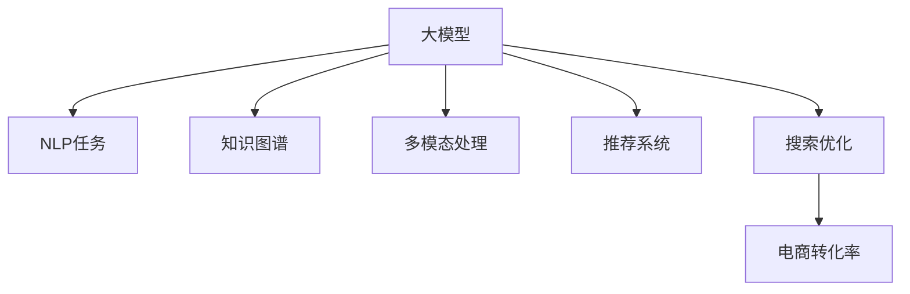

                 

# 大模型赋能电商平台：从搜索到购买的全流程优化

## 1. 背景介绍

### 1.1 问题由来
随着电商平台的迅速发展，用户体验成为商家关注的重点。尤其是在搜索和推荐环节，如何将大量商品信息有效呈现给用户，并且能快速精准找到用户需要的商品，是电商平台面临的重要挑战。传统的基于规则、基于关键词匹配的搜索算法，已无法满足复杂多变的用户需求。

### 1.2 问题核心关键点
为了提升搜索和推荐效果，电商平台开始引入大语言模型进行优化。具体方法包括：
- 使用大模型对用户查询进行理解和拓展，生成更准确的查询结果。
- 基于大模型的知识图谱，进行商品语义相似度计算，提升推荐质量。
- 利用大模型生成购物清单、商品搭配等提示信息，优化购买流程。

### 1.3 问题研究意义
大模型在电商平台中的应用，可以显著提升用户搜索和推荐的效果，改善购物体验，提升商家转化率。同时，大模型还具有多模态处理能力，能够同时处理文本、图像、视频等多模态数据，为电商平台的更多应用场景提供可能。未来，随着大模型的技术进步和规模扩展，将进一步提升电商平台的智能化水平。

## 2. 核心概念与联系

### 2.1 核心概念概述

为更好地理解大模型在电商平台中的应用，本节将介绍几个关键概念：

- 大模型（Large Model）：指具有亿级参数规模的深度学习模型，能够学习到丰富的知识，适用于处理复杂任务。
- 自然语言处理（NLP）：使用大模型处理文本数据，实现文本分类、情感分析、语义匹配等任务。
- 知识图谱（Knowledge Graph）：利用大模型构建的实体关系图，用于支持语义相似度计算、实体识别等任务。
- 多模态处理（Multimodal Processing）：大模型同时处理文本、图像、视频等多模态数据，提升信息理解全面性。
- 推荐系统（Recommendation System）：使用大模型进行用户兴趣预测和商品推荐，优化电商平台的个性化服务。
- 搜索优化（Search Optimization）：利用大模型提升用户查询理解能力，生成精准的搜索结果。
- 电商转化率（Conversion Rate）：衡量电商平台用户体验和经济效益的重要指标，通过优化搜索和推荐提升转化率。

这些概念之间存在紧密的联系，共同构成了大模型在电商平台中的应用框架：



通过大模型的多任务融合，可以提供全方位的电商服务，提升用户满意度和商家收益。

## 3. 核心算法原理 & 具体操作步骤
### 3.1 算法原理概述

大模型在电商平台中的应用主要涉及自然语言处理、知识图谱、推荐系统、搜索优化等多个领域。其核心算法原理主要包括以下几个方面：

1. 自然语言处理：使用大模型进行文本分类、情感分析、语义匹配等任务，帮助用户精准理解查询意图。
2. 知识图谱：利用大模型构建知识图谱，进行实体识别、关系推理、语义相似度计算等，提升推荐质量。
3. 推荐系统：基于大模型进行用户兴趣预测和商品推荐，实现个性化服务。
4. 搜索优化：利用大模型进行查询拓展、意图理解、结果排序等，提升搜索效果。

### 3.2 算法步骤详解

大模型在电商平台中的应用主要分为以下几个步骤：

**Step 1: 数据预处理**
- 收集电商平台的各类数据，包括用户行为数据、商品信息数据、用户评价数据等。
- 对数据进行清洗、标注，构建训练集、验证集和测试集。
- 对数据进行标准化、归一化等预处理操作，确保数据质量。

**Step 2: 大模型选择与适配**
- 根据电商平台的业务需求，选择合适的预训练大模型，如BERT、GPT等。
- 在大模型基础上添加任务适配层，如分类器、推荐器等，适配电商平台的特定任务。
- 对适配层进行微调，使其在大模型的基础上进行参数更新，优化模型性能。

**Step 3: 模型训练与评估**
- 使用训练集对微调后的模型进行训练，优化模型参数。
- 在验证集上评估模型性能，调整超参数，防止过拟合。
- 在测试集上进一步评估模型性能，确保模型稳定性和泛化能力。

**Step 4: 应用部署与优化**
- 将微调后的模型部署到电商平台的搜索、推荐等应用模块中。
- 根据应用反馈进行模型优化，如调整模型参数、优化计算图、增加正则化等。
- 对模型进行监控和评估，确保其稳定性和性能。

### 3.3 算法优缺点

大模型在电商平台中的应用具有以下优点：
1. 提升搜索和推荐效果：利用大模型的语言理解和知识图谱能力，显著提升查询精准度和推荐准确性。
2. 多模态处理能力：大模型同时处理文本、图像、视频等多模态数据，提供更全面的商品信息。
3. 个性化服务：通过大模型进行用户兴趣预测和商品推荐，实现个性化推荐，提升用户满意度。
4. 数据驱动决策：基于用户行为和商品信息数据，生成数据驱动的决策支持，优化电商平台的运营策略。

同时，大模型在电商平台中也有以下局限性：
1. 数据依赖：大模型需要大量标注数据进行微调，对标注数据的依赖较高。
2. 计算资源消耗大：大模型的参数量庞大，计算资源消耗较大，对硬件要求较高。
3. 可解释性不足：大模型往往难以解释其内部决策过程，导致模型的可解释性不足。
4. 数据偏见：大模型可能学习到数据中的偏见，对某些群体或商品产生不公平的推荐。
5. 成本高：数据标注、模型训练、模型部署等成本较高，对电商平台的资源投入要求大。

尽管存在这些局限性，但大模型在电商平台中的应用依然前景广阔，其提升搜索和推荐效果、多模态处理能力、个性化服务等方面的优势，将继续推动电商平台向智能化方向发展。

### 3.4 算法应用领域

大模型在电商平台中的应用领域广泛，以下是几个典型的应用场景：

1. **智能搜索**
   - 使用大模型进行用户查询理解，生成更准确的查询结果。
   - 通过语义相似度计算，推荐相关商品，提升用户搜索体验。

2. **个性化推荐**
   - 基于大模型进行用户兴趣预测，生成个性化推荐列表。
   - 结合知识图谱和商品信息，提升推荐质量。

3. **商品详情页**
   - 利用大模型生成商品描述和推荐信息，提升商品详情页的用户体验。
   - 进行商品搭配和关联推荐，提高用户购买转化率。

4. **客服机器人**
   - 使用大模型进行自然语言处理，实现智能客服功能。
   - 通过意图理解，自动回复用户问题，提升客服效率和用户满意度。

## 4. 数学模型和公式 & 详细讲解 & 举例说明

### 4.1 数学模型构建

大模型在电商平台中的应用主要基于自然语言处理、知识图谱、推荐系统等多个领域的数学模型构建。

**自然语言处理模型**
- 假设大模型为 $M_{\theta}$，输入为 $x$，输出为 $y$。则模型在输入 $x$ 上的概率分布为 $p(y|x)$。自然语言处理任务的目标是最大化似然函数 $p(y|x)$，即：
$$
\mathcal{L}(M_{\theta}) = -\log p(y|x)
$$

**知识图谱模型**
- 假设知识图谱为 $G$，包含实体 $E$ 和关系 $R$。使用大模型进行实体识别和关系推理，定义损失函数 $\mathcal{L}(G)$：
$$
\mathcal{L}(G) = \sum_{(i,j,k) \in E \times R \times E} \log p(j|i,k)
$$

**推荐系统模型**
- 假设推荐系统为 $R_{\theta}$，输入为用户 $u$ 和商品 $i$，输出为推荐分数 $r_{ui}$。推荐系统的目标是最小化损失函数 $\mathcal{L}(R_{\theta})$：
$$
\mathcal{L}(R_{\theta}) = \sum_{(u,i) \in U \times I} \mathcal{L}(r_{ui})
$$

**搜索优化模型**
- 假设搜索优化模型为 $S_{\theta}$，输入为用户查询 $q$，输出为搜索结果 $s_q$。搜索优化的目标是最小化损失函数 $\mathcal{L}(S_{\theta})$：
$$
\mathcal{L}(S_{\theta}) = \sum_{q \in Q} \mathcal{L}(s_q)
$$

### 4.2 公式推导过程

**自然语言处理模型推导**
- 假设 $M_{\theta}$ 为 Transformer 模型，输入为 $x$，输出为 $y$。则模型在输入 $x$ 上的概率分布为 $p(y|x)$，目标是最小化损失函数 $\mathcal{L}(M_{\theta})$：
$$
\mathcal{L}(M_{\theta}) = -\frac{1}{N} \sum_{i=1}^N \log p(y_i|x_i)
$$

**知识图谱模型推导**
- 假设 $G$ 为知识图谱，包含实体 $E$ 和关系 $R$。使用大模型进行实体识别和关系推理，定义损失函数 $\mathcal{L}(G)$：
$$
\mathcal{L}(G) = \sum_{(i,j,k) \in E \times R \times E} \log p(j|i,k)
$$

**推荐系统模型推导**
- 假设 $R_{\theta}$ 为推荐系统，输入为用户 $u$ 和商品 $i$，输出为推荐分数 $r_{ui}$。推荐系统的目标是最小化损失函数 $\mathcal{L}(R_{\theta})$：
$$
\mathcal{L}(R_{\theta}) = \sum_{(u,i) \in U \times I} \mathcal{L}(r_{ui})
$$

**搜索优化模型推导**
- 假设 $S_{\theta}$ 为搜索优化模型，输入为用户查询 $q$，输出为搜索结果 $s_q$。搜索优化的目标是最小化损失函数 $\mathcal{L}(S_{\theta})$：
$$
\mathcal{L}(S_{\theta}) = \sum_{q \in Q} \mathcal{L}(s_q)
$$

### 4.3 案例分析与讲解

**案例分析1: 智能搜索**
- 使用大模型进行查询理解，生成相关商品推荐。假设 $q$ 为查询，$D$ 为商品信息。定义大模型为 $M_{\theta}$，则目标是最小化损失函数 $\mathcal{L}(M_{\theta})$：
$$
\mathcal{L}(M_{\theta}) = -\frac{1}{N} \sum_{i=1}^N \log p(D_i|q)
$$

**案例分析2: 个性化推荐**
- 使用大模型进行用户兴趣预测，生成个性化推荐列表。假设 $u$ 为用户，$I$ 为商品集合。定义大模型为 $R_{\theta}$，则目标是最小化损失函数 $\mathcal{L}(R_{\theta})$：
$$
\mathcal{L}(R_{\theta}) = \sum_{i \in I} \mathcal{L}(r_{ui})
$$

## 5. 项目实践：代码实例和详细解释说明

### 5.1 开发环境搭建

在进行大模型应用实践前，我们需要准备好开发环境。以下是使用Python进行PyTorch开发的环境配置流程：

1. 安装Anaconda：从官网下载并安装Anaconda，用于创建独立的Python环境。

2. 创建并激活虚拟环境：
```bash
conda create -n ecommerce-env python=3.8 
conda activate ecommerce-env
```

3. 安装PyTorch：根据CUDA版本，从官网获取对应的安装命令。例如：
```bash
conda install pytorch torchvision torchaudio cudatoolkit=11.1 -c pytorch -c conda-forge
```

4. 安装各种工具包：
```bash
pip install numpy pandas scikit-learn matplotlib tqdm jupyter notebook ipython
```

完成上述步骤后，即可在`ecommerce-env`环境中开始应用实践。

### 5.2 源代码详细实现

这里我们以推荐系统为例，给出使用Transformers库对BERT模型进行推荐系统微调的PyTorch代码实现。

首先，定义推荐系统的数据处理函数：

```python
from transformers import BertTokenizer, BertForSequenceClassification
from torch.utils.data import Dataset, DataLoader
import torch

class RecommendationDataset(Dataset):
    def __init__(self, user_data, item_data, labels, tokenizer):
        self.user_data = user_data
        self.item_data = item_data
        self.labels = labels
        self.tokenizer = tokenizer
        
    def __len__(self):
        return len(self.user_data)
    
    def __getitem__(self, item):
        user_id = self.user_data[item]
        item_ids = self.item_data[item]
        label = self.labels[item]
        
        user_input = tokenizer(user_id, return_tensors='pt', padding=True, truncation=True)
        item_input = tokenizer(item_ids, return_tensors='pt', padding=True, truncation=True)
        item_input = item_input.to('cuda')
        label = torch.tensor(label, dtype=torch.long).to('cuda')
        
        return {'user_input': user_input['input_ids'], 
                'item_input': item_input['input_ids'],
                'label': label}
        
# 加载数据集
user_data = [...] # 用户ID列表
item_data = [...] # 商品ID列表
labels = [...] # 用户-商品推荐标签

tokenizer = BertTokenizer.from_pretrained('bert-base-cased')

dataset = RecommendationDataset(user_data, item_data, labels, tokenizer)
```

然后，定义模型和优化器：

```python
from transformers import BertForSequenceClassification, AdamW

model = BertForSequenceClassification.from_pretrained('bert-base-cased', num_labels=2)

optimizer = AdamW(model.parameters(), lr=2e-5)
```

接着，定义训练和评估函数：

```python
from sklearn.metrics import accuracy_score

device = torch.device('cuda') if torch.cuda.is_available() else torch.device('cpu')
model.to(device)

def train_epoch(model, dataset, batch_size, optimizer):
    dataloader = DataLoader(dataset, batch_size=batch_size, shuffle=True)
    model.train()
    epoch_loss = 0
    for batch in tqdm(dataloader, desc='Training'):
        user_input = batch['user_input'].to(device)
        item_input = batch['item_input'].to(device)
        label = batch['label']
        model.zero_grad()
        outputs = model(user_input, item_input, labels=label)
        loss = outputs.loss
        epoch_loss += loss.item()
        loss.backward()
        optimizer.step()
    return epoch_loss / len(dataloader)

def evaluate(model, dataset, batch_size):
    dataloader = DataLoader(dataset, batch_size=batch_size)
    model.eval()
    preds, labels = [], []
    with torch.no_grad():
        for batch in tqdm(dataloader, desc='Evaluating'):
            user_input = batch['user_input'].to(device)
            item_input = batch['item_input'].to(device)
            label = batch['label']
            outputs = model(user_input, item_input, labels=label)
            preds.append(outputs.logits.argmax(dim=1).to('cpu').tolist())
            labels.append(label.to('cpu').tolist())
                
    return accuracy_score(labels, preds)
```

最后，启动训练流程并在测试集上评估：

```python
epochs = 5
batch_size = 16

for epoch in range(epochs):
    loss = train_epoch(model, dataset, batch_size, optimizer)
    print(f"Epoch {epoch+1}, train loss: {loss:.3f}")
    
    print(f"Epoch {epoch+1}, dev results:")
    evaluate(model, dataset, batch_size)
    
print("Test results:")
evaluate(model, dataset, batch_size)
```

以上就是使用PyTorch对BERT进行推荐系统微调的完整代码实现。可以看到，得益于Transformers库的强大封装，我们可以用相对简洁的代码完成BERT模型的加载和微调。

### 5.3 代码解读与分析

让我们再详细解读一下关键代码的实现细节：

**RecommendationDataset类**：
- `__init__`方法：初始化用户ID、商品ID、标签和分词器等关键组件。
- `__len__`方法：返回数据集的样本数量。
- `__getitem__`方法：对单个样本进行处理，将用户ID和商品ID输入编码为token ids，同时将标签编码为数字，并对其进行定长padding，最终返回模型所需的输入。

**训练和评估函数**：
- 使用PyTorch的DataLoader对数据集进行批次化加载，供模型训练和推理使用。
- 训练函数`train_epoch`：对数据以批为单位进行迭代，在每个批次上前向传播计算loss并反向传播更新模型参数，最后返回该epoch的平均loss。
- 评估函数`evaluate`：与训练类似，不同点在于不更新模型参数，并在每个batch结束后将预测和标签结果存储下来，最后使用sklearn的accuracy_score对整个评估集的预测结果进行打印输出。

**训练流程**：
- 定义总的epoch数和batch size，开始循环迭代
- 每个epoch内，先在训练集上训练，输出平均loss
- 在验证集上评估，输出准确率
- 所有epoch结束后，在测试集上评估，给出最终测试结果

可以看到，PyTorch配合Transformers库使得BERT微调的代码实现变得简洁高效。开发者可以将更多精力放在数据处理、模型改进等高层逻辑上，而不必过多关注底层的实现细节。

当然，工业级的系统实现还需考虑更多因素，如模型的保存和部署、超参数的自动搜索、更灵活的任务适配层等。但核心的微调范式基本与此类似。

## 6. 实际应用场景

### 6.1 智能搜索

在智能搜索环节，大模型的应用可以显著提升用户搜索体验。用户输入查询后，大模型能够理解查询意图，生成相关商品推荐，并根据用户行为进行动态调整。

具体而言，可以采用以下步骤：
1. 收集用户历史搜索记录和点击行为数据，构建训练集。
2. 使用大模型进行查询理解，生成查询向量。
3. 基于查询向量，计算商品向量，并计算相似度。
4. 根据相似度排序推荐商品列表。

### 6.2 个性化推荐

个性化推荐是电商平台的重要功能，大模型可以在这方面发挥巨大作用。通过大模型进行用户兴趣预测和商品推荐，实现个性化服务，提升用户满意度。

具体而言，可以采用以下步骤：
1. 收集用户行为数据和商品信息数据，构建训练集。
2. 使用大模型进行用户兴趣预测，生成个性化推荐列表。
3. 结合知识图谱和商品信息，提升推荐质量。
4. 根据用户行为反馈，动态调整推荐策略。

### 6.3 商品详情页

商品详情页是用户购买决策的关键环节，大模型可以提升这一环节的用户体验。通过大模型生成商品描述和推荐信息，提升商品详情页的用户体验，同时进行商品搭配和关联推荐，提高用户购买转化率。

具体而言，可以采用以下步骤：
1. 收集商品信息数据和用户行为数据，构建训练集。
2. 使用大模型生成商品描述和推荐信息。
3. 结合商品搭配和关联推荐，提升用户体验。
4. 根据用户反馈，动态调整商品推荐策略。

### 6.4 未来应用展望

随着大模型和微调技术的不断发展，其在电商平台中的应用将不断扩展，带来更多创新应用。

未来，大模型将进一步提升搜索和推荐效果，实现更加个性化、智能化的电商服务。同时，大模型将拓展到更多应用场景，如用户行为分析、商品信息抽取、智能客服等，提供全方位的电商解决方案。

此外，大模型还将在物流、库存管理、供应链优化等环节发挥重要作用，推动电商平台的全面智能化。未来，随着技术的不断进步，大模型在电商平台中的应用前景将更加广阔，为电商行业的持续发展提供强大动力。

## 7. 工具和资源推荐
### 7.1 学习资源推荐

为了帮助开发者系统掌握大模型在电商平台中的应用，这里推荐一些优质的学习资源：

1. 《Transformer from A to Z》系列博文：由大模型技术专家撰写，深入浅出地介绍了Transformer原理、BERT模型、推荐系统等前沿话题。

2. CS229《机器学习》课程：斯坦福大学开设的经典机器学习课程，涵盖深度学习、自然语言处理等知识点，适合系统学习大模型应用基础。

3. 《Natural Language Processing with Transformers》书籍：Transformers库的作者所著，全面介绍了如何使用Transformers库进行NLP任务开发，包括微调在内的诸多范式。

4. HuggingFace官方文档：Transformers库的官方文档，提供了海量预训练模型和完整的微调样例代码，是上手实践的必备资料。

5. DeepLearning.ai《深度学习专项课程》：由Andrew Ng教授主持的深度学习课程，涵盖TensorFlow、PyTorch等主流框架，适合初学者系统学习大模型技术。

通过对这些资源的学习实践，相信你一定能够快速掌握大模型在电商平台中的应用，并用于解决实际的电商问题。
###  7.2 开发工具推荐

高效的开发离不开优秀的工具支持。以下是几款用于大模型应用开发的常用工具：

1. PyTorch：基于Python的开源深度学习框架，灵活动态的计算图，适合快速迭代研究。大部分预训练语言模型都有PyTorch版本的实现。

2. TensorFlow：由Google主导开发的开源深度学习框架，生产部署方便，适合大规模工程应用。同样有丰富的预训练语言模型资源。

3. Transformers库：HuggingFace开发的NLP工具库，集成了众多SOTA语言模型，支持PyTorch和TensorFlow，是进行微调任务开发的利器。

4. Weights & Biases：模型训练的实验跟踪工具，可以记录和可视化模型训练过程中的各项指标，方便对比和调优。与主流深度学习框架无缝集成。

5. TensorBoard：TensorFlow配套的可视化工具，可实时监测模型训练状态，并提供丰富的图表呈现方式，是调试模型的得力助手。

6. Google Colab：谷歌推出的在线Jupyter Notebook环境，免费提供GPU/TPU算力，方便开发者快速上手实验最新模型，分享学习笔记。

合理利用这些工具，可以显著提升大模型应用开发的效率，加快创新迭代的步伐。

### 7.3 相关论文推荐

大模型在电商平台中的应用源于学界的持续研究。以下是几篇奠基性的相关论文，推荐阅读：

1. Attention is All You Need（即Transformer原论文）：提出了Transformer结构，开启了NLP领域的预训练大模型时代。

2. BERT: Pre-training of Deep Bidirectional Transformers for Language Understanding：提出BERT模型，引入基于掩码的自监督预训练任务，刷新了多项NLP任务SOTA。

3. Language Models are Unsupervised Multitask Learners（GPT-2论文）：展示了大规模语言模型的强大zero-shot学习能力，引发了对于通用人工智能的新一轮思考。

4. Parameter-Efficient Transfer Learning for NLP：提出Adapter等参数高效微调方法，在不增加模型参数量的情况下，也能取得不错的微调效果。

5. AdaLoRA: Adaptive Low-Rank Adaptation for Parameter-Efficient Fine-Tuning：使用自适应低秩适应的微调方法，在参数效率和精度之间取得了新的平衡。

这些论文代表了大模型在电商平台中的应用发展脉络。通过学习这些前沿成果，可以帮助研究者把握学科前进方向，激发更多的创新灵感。

## 8. 总结：未来发展趋势与挑战

### 8.1 总结

本文对大模型在电商平台中的应用进行了全面系统的介绍。首先阐述了大模型和微调技术在电商平台中的研究背景和意义，明确了其在提升搜索和推荐效果、个性化服务等方面的独特价值。其次，从原理到实践，详细讲解了自然语言处理、知识图谱、推荐系统、搜索优化等多个领域的算法原理和操作步骤，给出了微调任务开发的完整代码实例。同时，本文还探讨了大模型在电商平台的多个应用场景，展示了其广阔的应用前景。最后，本文精选了学习资源、开发工具和相关论文，力求为读者提供全方位的技术指引。

通过本文的系统梳理，可以看到，大模型在电商平台中的应用将显著提升用户搜索和推荐的效果，实现更加个性化、智能化的电商服务。同时，大模型将拓展到更多应用场景，如用户行为分析、商品信息抽取、智能客服等，提供全方位的电商解决方案。未来，随着技术的不断进步，大模型在电商平台中的应用前景将更加广阔，为电商行业的持续发展提供强大动力。

### 8.2 未来发展趋势

展望未来，大模型在电商平台中的应用将呈现以下几个发展趋势：

1. 模型规模持续增大。随着算力成本的下降和数据规模的扩张，预训练语言模型的参数量还将持续增长。超大规模语言模型蕴含的丰富语言知识，有望支撑更加复杂多变的电商应用。

2. 微调方法日趋多样。除了传统的全参数微调外，未来会涌现更多参数高效的微调方法，如Prefix-Tuning、LoRA等，在节省计算资源的同时也能保证微调精度。

3. 持续学习成为常态。随着数据分布的不断变化，微调模型也需要持续学习新知识以保持性能。如何在不遗忘原有知识的同时，高效吸收新样本信息，将成为重要的研究课题。

4. 标注样本需求降低。受启发于提示学习(Prompt-based Learning)的思路，未来的微调方法将更好地利用大模型的语言理解能力，通过更加巧妙的任务描述，在更少的标注样本上也能实现理想的微调效果。

5. 多模态微调崛起。当前的微调主要聚焦于纯文本数据，未来会进一步拓展到图像、视频、语音等多模态数据微调。多模态信息的融合，将显著提升语言模型对现实世界的理解和建模能力。

6. 模型通用性增强。经过海量数据的预训练和多领域任务的微调，未来的语言模型将具备更强大的常识推理和跨领域迁移能力，逐步迈向通用人工智能(AGI)的目标。

以上趋势凸显了大模型在电商平台中的应用前景。这些方向的探索发展，必将进一步提升电商平台的智能化水平，为电商平台提供更多创新应用，带来更好的用户体验和商家收益。

### 8.3 面临的挑战

尽管大模型在电商平台中的应用前景广阔，但在迈向更加智能化、普适化应用的过程中，它仍面临诸多挑战：

1. 标注成本瓶颈。虽然微调大大降低了标注数据的需求，但对于长尾应用场景，难以获得充足的高质量标注数据，成为制约微调性能的瓶颈。如何进一步降低微调对标注样本的依赖，将是一大难题。

2. 模型鲁棒性不足。当前微调模型面对域外数据时，泛化性能往往大打折扣。对于测试样本的微小扰动，微调模型的预测也容易发生波动。如何提高微调模型的鲁棒性，避免灾难性遗忘，还需要更多理论和实践的积累。

3. 推理效率有待提高。大规模语言模型虽然精度高，但在实际部署时往往面临推理速度慢、内存占用大等效率问题。如何在保证性能的同时，简化模型结构，提升推理速度，优化资源占用，将是重要的优化方向。

4. 可解释性亟需加强。当前微调模型往往难以解释其内部决策过程，导致模型的可解释性不足。对于医疗、金融等高风险应用，算法的可解释性和可审计性尤为重要。如何赋予微调模型更强的可解释性，将是亟待攻克的难题。

5. 安全性有待保障。预训练语言模型难免会学习到数据中的偏见，通过微调传递到下游任务，产生误导性、歧视性的输出，给实际应用带来安全隐患。如何从数据和算法层面消除模型偏见，避免恶意用途，确保输出的安全性，也将是重要的研究课题。

6. 知识整合能力不足。现有的微调模型往往局限于任务内数据，难以灵活吸收和运用更广泛的先验知识。如何让微调过程更好地与外部知识库、规则库等专家知识结合，形成更加全面、准确的信息整合能力，还有很大的想象空间。

正视微调面临的这些挑战，积极应对并寻求突破，将是大模型在电商平台中走向成熟的必由之路。相信随着学界和产业界的共同努力，这些挑战终将一一被克服，大模型在电商平台中的应用必将取得更大的成功。

### 8.4 研究展望

面对大模型在电商平台中的挑战，未来的研究需要在以下几个方面寻求新的突破：

1. 探索无监督和半监督微调方法。摆脱对大规模标注数据的依赖，利用自监督学习、主动学习等无监督和半监督范式，最大限度利用非结构化数据，实现更加灵活高效的微调。

2. 研究参数高效和计算高效的微调范式。开发更加参数高效的微调方法，在固定大部分预训练参数的同时，只更新极少量的任务相关参数。同时优化微调模型的计算图，减少前向传播和反向传播的资源消耗，实现更加轻量级、实时性的部署。

3. 融合因果和对比学习范式。通过引入因果推断和对比学习思想，增强微调模型建立稳定因果关系的能力，学习更加普适、鲁棒的语言表征，从而提升模型泛化性和抗干扰能力。

4. 引入更多先验知识。将符号化的先验知识，如知识图谱、逻辑规则等，与神经网络模型进行巧妙融合，引导微调过程学习更准确、合理的语言模型。同时加强不同模态数据的整合，实现视觉、语音等多模态信息与文本信息的协同建模。

5. 结合因果分析和博弈论工具。将因果分析方法引入微调模型，识别出模型决策的关键特征，增强输出解释的因果性和逻辑性。借助博弈论工具刻画人机交互过程，主动探索并规避模型的脆弱点，提高系统稳定性。

6. 纳入伦理道德约束。在模型训练目标中引入伦理导向的评估指标，过滤和惩罚有偏见、有害的输出倾向。同时加强人工干预和审核，建立模型行为的监管机制，确保输出符合人类价值观和伦理道德。

这些研究方向的探索，必将引领大模型在电商平台中的应用技术迈向更高的台阶，为构建安全、可靠、可解释、可控的智能系统铺平道路。面向未来，大模型在电商平台中的应用还需要与其他人工智能技术进行更深入的融合，如知识表示、因果推理、强化学习等，多路径协同发力，共同推动自然语言理解和智能交互系统的进步。只有勇于创新、敢于突破，才能不断拓展语言模型的边界，让智能技术更好地造福人类社会。

## 9. 附录：常见问题与解答

**Q1：大模型在电商平台中的应用是否适用于所有应用场景？**

A: 大模型在电商平台中的应用具有广泛的适用性，但需要根据具体业务需求进行适配。对于一些需要实时响应、高效处理的应用场景，如客服机器人、智能搜索等，大模型表现尤为出色。而对于一些需要大量计算资源的应用场景，如商品推荐、库存管理等，大模型的部署需要仔细考虑。

**Q2：大模型在电商平台中的应用是否需要大量的标注数据？**

A: 虽然微调需要一定的标注数据，但大模型的预训练数据已经包含了大量的通用语言知识，可以在一定程度上替代标注数据。对于一些数据量较小的应用场景，可以通过提示学习等方式，减少对标注数据的依赖。

**Q3：大模型在电商平台中的应用是否会影响用户体验？**

A: 大模型在电商平台中的应用可以显著提升用户体验。通过自然语言处理、推荐系统等技术，大模型可以理解用户意图，生成个性化的推荐，提升搜索效果和商品详情页的用户体验。但需要注意的是，模型的使用需要结合具体业务场景进行优化，避免过度干预用户行为。

**Q4：大模型在电商平台中的应用是否会带来额外的成本？**

A: 大模型在电商平台中的应用需要一定的计算资源和标注数据，可能会带来一定的成本。但相比于传统的人力服务，大模型的应用可以大幅降低运营成本，提高工作效率和用户满意度。同时，随着大模型技术的不断进步，相关成本也在逐渐降低。

**Q5：大模型在电商平台中的应用是否会对数据隐私和安全造成影响？**

A: 大模型在电商平台中的应用需要对用户数据进行一定的处理和分析，可能会带来数据隐私和安全方面的挑战。为了确保数据安全，需要对模型进行加密、匿名化等处理，并加强数据管理和访问控制，确保用户数据不被滥用。

通过这些常见问题的解答，可以看到，大模型在电商平台中的应用具有广泛的前景和潜力，但也需要在数据、技术、安全等方面进行全面的考虑和管理。相信随着技术的不断进步和应用的不断深入，大模型在电商平台中的应用将更加广泛和深入，为电商行业的数字化转型提供强大的技术支持。

