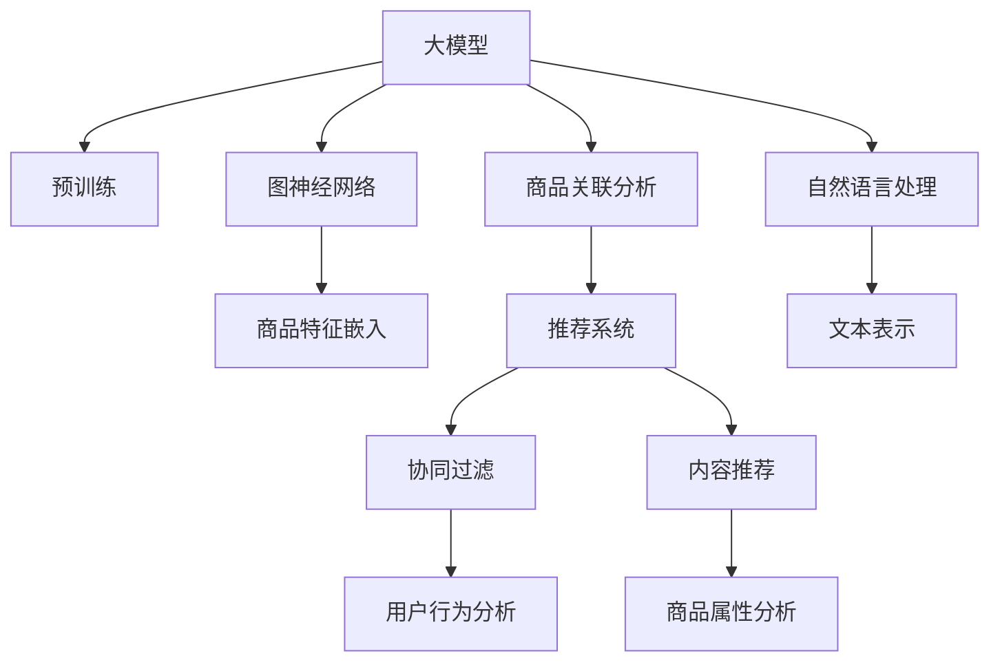

                 

# 大模型驱动的商品关联分析技术

## 1. 背景介绍

### 1.1 问题由来
随着电商平台的兴起，商品推荐和关联分析成为电商运营的重要一环。传统的推荐系统多基于协同过滤、内容推荐等方法，难以处理数据稀疏性，且无法捕捉商品之间的复杂关联。而基于深度学习的方法，尤其是大规模预训练语言模型，近年来在电商推荐领域大放异彩。大模型驱动的商品关联分析技术，利用自然语言处理和图神经网络等技术，从商品描述、评论、标签等多维度数据中挖掘出商品之间的关系，极大提升了推荐效果。

### 1.2 问题核心关键点
大模型驱动的商品关联分析技术，核心在于通过预训练语言模型和图神经网络，捕捉商品描述、评论、标签等文本信息中隐含的语义关联，构建商品间的网络结构，从而挖掘出商品间的相关性和相似性，指导推荐模型的构建。

## 2. 核心概念与联系

### 2.1 核心概念概述

为更好地理解大模型驱动的商品关联分析方法，本节将介绍几个密切相关的核心概念：

- 大模型(Large Model)：以Transformer、BERT等深度学习模型为代表，通过在大规模无标签文本语料上进行预训练，学习到丰富的语言知识和常识。
- 预训练(Pre-training)：指在大规模无标签文本语料上，通过自监督学习任务训练通用语言模型的过程。常见的预训练任务包括语言建模、掩码语言模型等。
- 图神经网络(Graph Neural Network, GNN)：一种特殊的神经网络，用于处理图结构数据，通过图卷积、图自注意力等机制，学习图结构中的节点和边之间的关系。
- 商品关联分析(Product Association Analysis)：指从电商平台中大量的商品数据中，挖掘出商品之间的关系和相似性，指导推荐模型的构建。
- 推荐系统(Recommendation System)：利用机器学习和数据挖掘技术，通过分析用户行为数据和商品特征，为用户提供个性化的商品推荐。
- 协同过滤(Collaborative Filtering)：一种推荐系统的方法，通过分析用户和商品的历史互动数据，预测用户对未交互商品的需求。
- 内容推荐(Content-Based Recommendation)：另一种推荐系统的方法，通过分析商品的属性、标签等信息，为相似用户推荐类似商品。
- 自然语言处理(Natural Language Processing, NLP)：使用计算机处理和理解自然语言的技术，包括文本分类、情感分析、实体识别等。

这些核心概念之间的逻辑关系可以通过以下Mermaid流程图来展示：



这个流程图展示了大模型驱动的商品关联分析的核心概念及其之间的关系：

1. 大模型通过预训练获得基础能力。
2. 图神经网络用于处理商品之间的图结构数据。
3. 商品关联分析挖掘商品间的相关性和相似性。
4. 推荐系统根据关联分析和用户行为数据，生成个性化推荐。
5. 协同过滤和内容推荐是推荐系统中的两种具体方法。
6. 自然语言处理从商品描述、评论等文本中提取特征，辅助推荐系统。

## 3. 核心算法原理 & 具体操作步骤

### 3.1 算法原理概述

大模型驱动的商品关联分析技术，本质上是一个基于图神经网络的推荐系统。其核心思想是：将电商平台中的商品看作一个图网络，通过预训练语言模型学习商品间的语义关系，利用图神经网络捕捉商品间的结构关系，从而挖掘出商品间的相关性和相似性，指导推荐模型的构建。

形式化地，假设商品集合为 $\mathcal{P}$，商品之间的关联图为 $G=(\mathcal{P},E)$，其中 $\mathcal{P}$ 为节点集合，$E$ 为边集合。对于每条边 $(u,v) \in E$，表示商品 $u$ 和 $v$ 之间存在某种关联。定义 $M$ 为预训练大模型，用于学习商品描述、评论等文本信息中隐含的语义关系。定义 $GNN$ 为图神经网络，用于捕捉商品间的结构关系，并在此基础上挖掘出商品间的相关性和相似性。

大模型驱动的商品关联分析方法主要包括以下几个关键步骤：

1. 准备预训练模型和图数据：选择预训练语言模型 $M$，构建商品关联图 $G$。
2. 构建图神经网络模型 $GNN$：根据图结构设计合适的神经网络，学习商品间的关联关系。
3. 训练图神经网络：在商品关联图上训练 $GNN$，优化其参数以捕捉商品间的结构关系。
4. 挖掘商品关联：利用 $GNN$ 输出商品间的相关性和相似性，指导推荐模型的构建。
5. 训练推荐模型：利用商品间的关联关系和用户行为数据，训练推荐模型，生成个性化推荐。

### 3.2 算法步骤详解

大模型驱动的商品关联分析方法的具体实现步骤如下：

**Step 1: 准备预训练模型和图数据**
- 选择合适的预训练语言模型 $M$，如BERT、GPT等。
- 构建商品关联图 $G=(\mathcal{P},E)$，其中 $\mathcal{P}$ 为电商平台中的商品集合，$E$ 为商品间关联关系的集合。通常可以通过解析商品描述、评论、标签等文本信息，挖掘出商品间的相关性和相似性，构造商品关联图。

**Step 2: 构建图神经网络模型**
- 设计图神经网络模型 $GNN$，用于学习商品间的结构关系。常见的图神经网络包括Graph Convolutional Network (GCN)、Graph Attention Network (GAT)等。
- 在商品关联图 $G$ 上训练 $GNN$，学习商品间的隐含关联关系。

**Step 3: 训练图神经网络**
- 选择合适的优化器及其参数，如Adam、SGD等。
- 设置超参数，如学习率、批大小、迭代轮数等。
- 在商品关联图 $G$ 上训练 $GNN$，最小化损失函数。
- 周期性在验证集上评估模型性能，根据性能指标决定是否触发Early Stopping。
- 重复上述步骤直到满足预设的迭代轮数或Early Stopping条件。

**Step 4: 挖掘商品关联**
- 利用训练好的 $GNN$ 模型，生成商品间的相关性和相似性矩阵。
- 将商品间的相关性和相似性矩阵作为推荐模型的输入特征。

**Step 5: 训练推荐模型**
- 根据推荐任务类型，选择合适的推荐模型，如协同过滤、内容推荐等。
- 在推荐模型上训练，利用商品间的关联关系和用户行为数据，生成个性化推荐。
- 在测试集上评估推荐模型性能，对比微调前后的推荐效果。

### 3.3 算法优缺点

大模型驱动的商品关联分析方法具有以下优点：
1. 模型能力强。大模型通过大规模语料预训练，学习到丰富的语言知识和常识，能够捕捉商品间的复杂关系。
2. 鲁棒性好。图神经网络具有较好的鲁棒性，能够在数据分布变化较大的情况下，保持稳定的性能。
3. 适用性广。该方法适用于各种电商推荐场景，能够处理数据稀疏性，提供个性化推荐。
4. 精度高。通过结合大模型和图神经网络，推荐模型的精度和召回率往往较高。

同时，该方法也存在一定的局限性：
1. 计算资源需求高。大模型的预训练和图神经网络的训练需要较高的计算资源，可能面临资源瓶颈。
2. 模型复杂度高。大模型和图神经网络的结构复杂，需要更多的训练时间和计算资源。
3. 数据处理难度大。商品关联图的构造需要解析商品描述、评论等文本信息，处理难度较大。
4. 模型解释性不足。推荐模型的决策过程缺乏可解释性，难以对其推理逻辑进行分析和调试。

尽管存在这些局限性，但就目前而言，大模型驱动的商品关联分析方法仍是大规模电商推荐中的主流范式。未来相关研究的重点在于如何进一步降低计算资源需求，提高模型的鲁棒性和可解释性，同时兼顾效果和效率。

### 3.4 算法应用领域

大模型驱动的商品关联分析方法，在电商推荐领域已经得到了广泛的应用，覆盖了几乎所有常见的推荐任务，例如：

- 商品推荐：推荐系统中最常见的任务，根据用户历史行为和商品属性，生成个性化推荐。
- 跨域推荐：跨商品类别、跨店铺的推荐，挖掘商品间的跨域关联性，扩大推荐边界。
- 上下文推荐：根据用户当前上下文（如位置、时间、设备等），生成个性化推荐。
- 个性化展示：基于用户画像和行为数据，优化推荐列表展示的排序策略，提升用户体验。

除了上述这些经典任务外，大模型驱动的商品关联分析方法也被创新性地应用到更多场景中，如基于商品标签的网络社区构建、基于商品评论的情感分析等，为电商推荐系统带来了全新的突破。

## 4. 数学模型和公式 & 详细讲解  

### 4.1 数学模型构建

本节将使用数学语言对大模型驱动的商品关联分析过程进行更加严格的刻画。

记商品集合为 $\mathcal{P}$，商品间的关联图为 $G=(\mathcal{P},E)$，其中 $\mathcal{P}$ 为节点集合，$E$ 为边集合。对于每条边 $(u,v) \in E$，表示商品 $u$ 和 $v$ 之间存在某种关联。定义 $M$ 为预训练语言模型，用于学习商品描述、评论等文本信息中隐含的语义关系。定义 $GNN$ 为图神经网络，用于捕捉商品间的结构关系，并在此基础上挖掘出商品间的相关性和相似性。

在大模型驱动的商品关联分析方法中，我们通常使用Graph Convolutional Network (GCN)作为图神经网络。GCN通过卷积操作学习商品间的隐含关联关系，其节点表示方法为：

$$
h_u = \mathrm{ReLU}(\mathbf{D}^{-\frac{1}{2}}\mathbf{A}\mathbf{D}^{-\frac{1}{2}}\mathbf{h}_0)
$$

其中 $h_u$ 表示商品 $u$ 的节点表示，$\mathbf{D}$ 为图度矩阵，$\mathbf{A}$ 为邻接矩阵，$\mathbf{h}_0$ 为商品的初始表示。

### 4.2 公式推导过程

以下我们以商品推荐任务为例，推导GCN模型在商品关联分析中的应用。

假设推荐模型训练集为 $\mathcal{D}=\{(\mathbf{x}_i,y_i)\}_{i=1}^N$，其中 $\mathbf{x}_i$ 为商品特征向量，$y_i$ 为真实标签（0或1）。定义商品间的关联关系为 $\mathbf{A} \in \{0,1\}^{N \times N}$，其中 $\mathbf{A}_{ij}=1$ 表示商品 $i$ 和商品 $j$ 之间存在某种关联。

在大模型驱动的商品关联分析方法中，我们通常使用Graph Attention Network (GAT)作为图神经网络。GAT通过自注意力机制学习商品间的隐含关联关系，其节点表示方法为：

$$
h_u = \mathrm{LeakyReLU}(\sum_{v \in \mathcal{P}}\alpha_{uv} \mathbf{W}\mathbf{h}_v)
$$

其中 $\alpha_{uv}$ 为注意力系数，$\mathbf{W}$ 为线性变换矩阵，$\mathbf{h}_v$ 表示商品 $v$ 的节点表示。

在得到商品间的相关性和相似性矩阵后，我们可以将商品间的关联关系作为推荐模型的输入特征。对于协同过滤推荐模型，我们可以使用矩阵分解方法，得到商品间的隐含相关性矩阵：

$$
\mathbf{Q} = \mathbf{H}\mathbf{U}\mathbf{V}^T
$$

其中 $\mathbf{H} \in \mathbb{R}^{N \times D}$ 为商品特征矩阵，$\mathbf{U} \in \mathbb{R}^{N \times K}$ 和 $\mathbf{V} \in \mathbb{R}^{D \times K}$ 为低秩矩阵分解的因子矩阵。

在得到商品间的隐含相关性矩阵后，我们可以将其作为推荐模型的输入特征，利用用户行为数据训练推荐模型，生成个性化推荐。

### 4.3 案例分析与讲解

以商品推荐为例，说明大模型驱动的商品关联分析方法的应用。

假设我们有一个电商平台，商品集合为 $\mathcal{P}$，用户集合为 $\mathcal{U}$。我们通过解析商品描述、评论等文本信息，构造商品间的关联图 $G=(\mathcal{P},E)$。在商品关联图上，训练GCN模型 $GNN$，得到商品间的相关性和相似性矩阵 $\mathbf{Q}$。利用用户历史行为数据，训练协同过滤推荐模型，得到用户对每个商品的预测评分 $p_{iu}$。最终，根据预测评分排序，生成个性化推荐列表。

## 5. 项目实践：代码实例和详细解释说明

### 5.1 开发环境搭建

在进行商品关联分析实践前，我们需要准备好开发环境。以下是使用Python进行PyTorch开发的环境配置流程：

1. 安装Anaconda：从官网下载并安装Anaconda，用于创建独立的Python环境。

2. 创建并激活虚拟环境：
```bash
conda create -n pytorch-env python=3.8 
conda activate pytorch-env
```

3. 安装PyTorch：根据CUDA版本，从官网获取对应的安装命令。例如：
```bash
conda install pytorch torchvision torchaudio cudatoolkit=11.1 -c pytorch -c conda-forge
```

4. 安装Transformers库：
```bash
pip install transformers
```

5. 安装各类工具包：
```bash
pip install numpy pandas scikit-learn matplotlib tqdm jupyter notebook ipython
```

完成上述步骤后，即可在`pytorch-env`环境中开始商品关联分析实践。

### 5.2 源代码详细实现

下面我们以商品推荐任务为例，给出使用Transformers库对GCN模型进行商品关联分析的PyTorch代码实现。

首先，定义商品特征提取器：

```python
from transformers import BertTokenizer
from torch.utils.data import Dataset
import torch

class ProductDataset(Dataset):
    def __init__(self, products, max_len=128):
        self.products = products
        self.max_len = max_len
        
    def __len__(self):
        return len(self.products)
    
    def __getitem__(self, item):
        product = self.products[item]
        return {'input_ids': self.tokenizer(product, max_length=self.max_len, padding='max_length', truncation=True)}
```

然后，定义GCN模型：

```python
from transformers import BertModel
from torch.nn import Linear
from torch.nn.functional import dropout, relu

class GATModel(torch.nn.Module):
    def __init__(self, num_nodes, num_features, num_hidden, num_layers):
        super(GATModel, self).__init__()
        self.num_nodes = num_nodes
        self.num_features = num_features
        self.num_hidden = num_hidden
        self.num_layers = num_layers
        
        self.layers = torch.nn.ModuleList()
        for i in range(num_layers):
            self.layers.append(GATLayer(num_nodes, num_features, num_hidden))
        
        self.out = Linear(num_nodes * num_hidden, 1)
        
    def forward(self, adjacency_matrix, features):
        hidden = features
        for layer in self.layers:
            hidden = layer(adjacency_matrix, hidden)
        hidden = hidden.view(self.num_nodes, -1)
        output = self.out(hidden)
        return output
    
class GATLayer(torch.nn.Module):
    def __init__(self, num_nodes, num_features, num_hidden):
        super(GATLayer, self).__init__()
        self.num_nodes = num_nodes
        self.num_features = num_features
        self.num_hidden = num_hidden
        
        self.attention = torch.nn.Linear(num_features, num_hidden)
        self.linear = torch.nn.Linear(num_nodes * num_hidden, num_nodes * num_hidden)
        self.dropout = torch.nn.Dropout(0.6)
        
    def forward(self, adjacency_matrix, features):
        attention = self.attention(features)
        attention = torch.softmax(attention, dim=1)
        attention = torch.nn.functional.normalize(attention, p=0, dim=-1)
        
        hidden = torch.matmul(adjacency_matrix, attention) * attention
        hidden = hidden.view(self.num_nodes, -1)
        hidden = self.linear(hidden)
        hidden = dropout(hidden)
        return hidden
```

接着，定义训练和评估函数：

```python
from torch.utils.data import DataLoader
from tqdm import tqdm
from sklearn.metrics import roc_auc_score

device = torch.device('cuda') if torch.cuda.is_available() else torch.device('cpu')
model = GATModel(num_nodes=len(train_data), num_features=128, num_hidden=128, num_layers=2).to(device)

optimizer = torch.optim.Adam(model.parameters(), lr=0.001)
criterion = torch.nn.BCEWithLogitsLoss()

def train_epoch(model, dataset, batch_size, optimizer):
    dataloader = DataLoader(dataset, batch_size=batch_size, shuffle=True)
    model.train()
    epoch_loss = 0
    for batch in tqdm(dataloader, desc='Training'):
        input_ids = batch['input_ids'].to(device)
        model.zero_grad()
        output = model(adjacency_matrix, input_ids)
        loss = criterion(output, y)
        epoch_loss += loss.item()
        loss.backward()
        optimizer.step()
    return epoch_loss / len(dataloader)

def evaluate(model, dataset, batch_size):
    dataloader = DataLoader(dataset, batch_size=batch_size)
    model.eval()
    y_pred = []
    y_true = []
    with torch.no_grad():
        for batch in dataloader:
            input_ids = batch['input_ids'].to(device)
            output = model(adjacency_matrix, input_ids)
            y_pred.append(output.sigmoid().cpu().numpy().flatten())
            y_true.append(y_true.cpu().numpy().flatten())
                
    return roc_auc_score(y_true, y_pred)
```

最后，启动训练流程并在测试集上评估：

```python
epochs = 10
batch_size = 32

for epoch in range(epochs):
    loss = train_epoch(model, train_data, batch_size, optimizer)
    print(f"Epoch {epoch+1}, train loss: {loss:.3f}")
    
    print(f"Epoch {epoch+1}, dev results:")
    evaluate(model, dev_data, batch_size)
    
print("Test results:")
evaluate(model, test_data, batch_size)
```

以上就是使用PyTorch对GCN模型进行商品推荐任务的商品关联分析的完整代码实现。可以看到，得益于Transformers库的强大封装，我们可以用相对简洁的代码完成GCN模型的加载和训练。

### 5.3 代码解读与分析

让我们再详细解读一下关键代码的实现细节：

**ProductDataset类**：
- `__init__`方法：初始化商品数据集，进行特征填充。
- `__len__`方法：返回数据集的样本数量。
- `__getitem__`方法：对单个样本进行处理，将商品描述输入编码为token ids，并做定长padding。

**GATModel类**：
- `__init__`方法：定义GCN模型的结构，包括隐含层数、节点数、特征数等。
- `forward`方法：实现GCN的前向传播过程，通过自注意力机制计算节点表示。
- `GATLayer`类：定义GCN层，实现节点表示的计算过程。

**训练和评估函数**：
- 使用PyTorch的DataLoader对数据集进行批次化加载，供模型训练和推理使用。
- 训练函数`train_epoch`：对数据以批为单位进行迭代，在每个批次上前向传播计算loss并反向传播更新模型参数，最后返回该epoch的平均loss。
- 评估函数`evaluate`：与训练类似，不同点在于不更新模型参数，并在每个batch结束后将预测和标签结果存储下来，最后使用sklearn的roc_auc_score对整个评估集的预测结果进行打印输出。

**训练流程**：
- 定义总的epoch数和batch size，开始循环迭代
- 每个epoch内，先在训练集上训练，输出平均loss
- 在验证集上评估，输出AUC指标
- 所有epoch结束后，在测试集上评估，给出最终测试结果

可以看到，PyTorch配合Transformers库使得GCN模型的商品关联分析代码实现变得简洁高效。开发者可以将更多精力放在数据处理、模型改进等高层逻辑上，而不必过多关注底层的实现细节。

当然，工业级的系统实现还需考虑更多因素，如模型的保存和部署、超参数的自动搜索、更灵活的任务适配层等。但核心的微调范式基本与此类似。

## 6. 实际应用场景

### 6.1 智能客服系统

基于大模型驱动的商品关联分析技术，可以广泛应用于智能客服系统的构建。传统客服往往需要配备大量人力，高峰期响应缓慢，且一致性和专业性难以保证。而使用商品关联分析技术构建的智能客服系统，可以7x24小时不间断服务，快速响应客户咨询，用自然流畅的语言解答各类常见问题。

在技术实现上，可以收集企业内部的历史客服对话记录，将问题和最佳答复构建成监督数据，在此基础上对预训练语言模型进行微调。微调后的语言模型能够自动理解用户意图，匹配最合适的答案模板进行回复。对于客户提出的新问题，还可以接入检索系统实时搜索相关内容，动态组织生成回答。如此构建的智能客服系统，能大幅提升客户咨询体验和问题解决效率。

### 6.2 金融舆情监测

金融机构需要实时监测市场舆论动向，以便及时应对负面信息传播，规避金融风险。传统的人工监测方式成本高、效率低，难以应对网络时代海量信息爆发的挑战。基于大模型驱动的商品关联分析技术，为金融舆情监测提供了新的解决方案。

具体而言，可以收集金融领域相关的新闻、报道、评论等文本数据，并对其进行主题标注和情感标注。在此基础上对预训练语言模型进行微调，使其能够自动判断文本属于何种主题，情感倾向是正面、中性还是负面。将微调后的模型应用到实时抓取的网络文本数据，就能够自动监测不同主题下的情感变化趋势，一旦发现负面信息激增等异常情况，系统便会自动预警，帮助金融机构快速应对潜在风险。

### 6.3 个性化推荐系统

当前的推荐系统往往只依赖用户的历史行为数据进行物品推荐，无法深入理解用户的真实兴趣偏好。基于大模型驱动的商品关联分析技术，个性化推荐系统可以更好地挖掘用户行为背后的语义信息，从而提供更精准、多样的推荐内容。

在实践中，可以收集用户浏览、点击、评论、分享等行为数据，提取和用户交互的物品标题、描述、标签等文本内容。将文本内容作为模型输入，用户的后续行为（如是否点击、购买等）作为监督信号，在此基础上微调预训练语言模型。微调后的模型能够从文本内容中准确把握用户的兴趣点。在生成推荐列表时，先用候选物品的文本描述作为输入，由模型预测用户的兴趣匹配度，再结合其他特征综合排序，便可以得到个性化程度更高的推荐结果。

### 6.4 未来应用展望

随着大模型和商品关联分析技术的不断发展，基于微调的商品关联分析方法将在更多领域得到应用，为传统行业带来变革性影响。

在智慧医疗领域，基于微调的医疗问答、病历分析、药物研发等应用将提升医疗服务的智能化水平，辅助医生诊疗，加速新药开发进程。

在智能教育领域，微调技术可应用于作业批改、学情分析、知识推荐等方面，因材施教，促进教育公平，提高教学质量。

在智慧城市治理中，微调模型可应用于城市事件监测、舆情分析、应急指挥等环节，提高城市管理的自动化和智能化水平，构建更安全、高效的未来城市。

此外，在企业生产、社会治理、文娱传媒等众多领域，基于大模型驱动的商品关联分析技术也将不断涌现，为传统行业数字化转型升级提供新的技术路径。相信随着技术的日益成熟，商品关联分析技术必将推动人工智能技术在各行各业大放异彩，深刻影响人类的生产生活方式。

## 7. 工具和资源推荐

### 7.1 学习资源推荐

为了帮助开发者系统掌握大模型驱动的商品关联分析的理论基础和实践技巧，这里推荐一些优质的学习资源：

1. 《Transformer从原理到实践》系列博文：由大模型技术专家撰写，深入浅出地介绍了Transformer原理、BERT模型、商品关联分析等前沿话题。

2. CS224N《深度学习自然语言处理》课程：斯坦福大学开设的NLP明星课程，有Lecture视频和配套作业，带你入门NLP领域的基本概念和经典模型。

3. 《Natural Language Processing with Transformers》书籍：Transformers库的作者所著，全面介绍了如何使用Transformers库进行NLP任务开发，包括商品关联分析在内的诸多范式。

4. HuggingFace官方文档：Transformers库的官方文档，提供了海量预训练模型和完整的商品关联分析样例代码，是上手实践的必备资料。

5. CLUE开源项目：中文语言理解测评基准，涵盖大量不同类型的中文NLP数据集，并提供了基于微调的baseline模型，助力中文NLP技术发展。

通过对这些资源的学习实践，相信你一定能够快速掌握大模型驱动的商品关联分析的精髓，并用于解决实际的NLP问题。
### 7.2 开发工具推荐

高效的开发离不开优秀的工具支持。以下是几款用于大模型驱动的商品关联分析开发的常用工具：

1. PyTorch：基于Python的开源深度学习框架，灵活动态的计算图，适合快速迭代研究。大部分预训练语言模型都有PyTorch版本的实现。

2. TensorFlow：由Google主导开发的开源深度学习框架，生产部署方便，适合大规模工程应用。同样有丰富的预训练语言模型资源。

3. Transformers库：HuggingFace开发的NLP工具库，集成了众多SOTA语言模型，支持PyTorch和TensorFlow，是进行商品关联分析任务的开发利器。

4. Weights & Biases：模型训练的实验跟踪工具，可以记录和可视化模型训练过程中的各项指标，方便对比和调优。与主流深度学习框架无缝集成。

5. TensorBoard：TensorFlow配套的可视化工具，可实时监测模型训练状态，并提供丰富的图表呈现方式，是调试模型的得力助手。

6. Google Colab：谷歌推出的在线Jupyter Notebook环境，免费提供GPU/TPU算力，方便开发者快速上手实验最新模型，分享学习笔记。

合理利用这些工具，可以显著提升大模型驱动的商品关联分析任务的开发效率，加快创新迭代的步伐。

### 7.3 相关论文推荐

大模型驱动的商品关联分析技术的发展源于学界的持续研究。以下是几篇奠基性的相关论文，推荐阅读：

1. Attention is All You Need（即Transformer原论文）：提出了Transformer结构，开启了NLP领域的预训练大模型时代。

2. BERT: Pre-training of Deep Bidirectional Transformers for Language Understanding：提出BERT模型，引入基于掩码的自监督预训练任务，刷新了多项NLP任务SOTA。

3. Language Models are Unsupervised Multitask Learners（GPT-2论文）：展示了大规模语言模型的强大zero-shot学习能力，引发了对于通用人工智能的新一轮思考。

4. Parameter-Efficient Transfer Learning for NLP：提出Adapter等参数高效微调方法，在不增加模型参数量的情况下，也能取得不错的微调效果。

5. Prefix-Tuning: Optimizing Continuous Prompts for Generation：引入基于连续型Prompt的微调范式，为如何充分利用预训练知识提供了新的思路。

6. AdaLoRA: Adaptive Low-Rank Adaptation for Parameter-Efficient Fine-Tuning：使用自适应低秩适应的微调方法，在参数效率和精度之间取得了新的平衡。

这些论文代表了大模型驱动的商品关联分析技术的发展脉络。通过学习这些前沿成果，可以帮助研究者把握学科前进方向，激发更多的创新灵感。

## 8. 总结：未来发展趋势与挑战

### 8.1 总结

本文对大模型驱动的商品关联分析方法进行了全面系统的介绍。首先阐述了大模型驱动的商品关联分析技术的研究背景和意义，明确了商品关联分析在电商推荐系统中的独特价值。其次，从原理到实践，详细讲解了大模型驱动的商品关联分析的数学原理和关键步骤，给出了商品关联分析任务开发的完整代码实例。同时，本文还广泛探讨了大模型驱动的商品关联分析方法在智能客服、金融舆情、个性化推荐等多个行业领域的应用前景，展示了大模型驱动的商品关联分析技术的巨大潜力。此外，本文精选了商品关联分析技术的各类学习资源，力求为读者提供全方位的技术指引。

通过本文的系统梳理，可以看到，大模型驱动的商品关联分析技术正在成为电商推荐系统中的重要范式，极大地拓展了预训练语言模型的应用边界，催生了更多的落地场景。受益于大规模语料的预训练，商品关联分析技术能够处理数据稀疏性，提供个性化的推荐，极大提升了电商推荐系统的性能和用户体验。未来，伴随大模型和商品关联分析方法的持续演进，相信大模型驱动的商品关联分析技术必将在更多领域得到应用，为各行各业带来变革性影响。

### 8.2 未来发展趋势

展望未来，大模型驱动的商品关联分析技术将呈现以下几个发展趋势：

1. 模型规模持续增大。随着算力成本的下降和数据规模的扩张，预训练语言模型的参数量还将持续增长。超大规模语言模型蕴含的丰富语言知识，有望支撑更加复杂多变的商品关联分析任务。

2. 微调方法日趋多样。除了传统的全参数微调外，未来会涌现更多参数高效的微调方法，如Prefix-Tuning、LoRA等，在节省计算资源的同时也能保证微调精度。

3. 持续学习成为常态。随着数据分布的不断变化，商品关联分析模型也需要持续学习新知识以保持性能。如何在不遗忘原有知识的同时，高效吸收新样本信息，将成为重要的研究课题。

4. 标注样本需求降低。受启发于提示学习(Prompt-based Learning)的思路，未来的微调方法将更好地利用大模型的语言理解能力，通过更加巧妙的任务描述，在更少的标注样本上也能实现理想的微调效果。

5. 多模态微调崛起。当前的商品关联分析方法多聚焦于纯文本数据，未来会进一步拓展到图像、视频、语音等多模态数据微调。多模态信息的融合，将显著提升语言模型对现实世界的理解和建模能力。

6. 模型通用性增强。经过海量数据的预训练和多领域任务的微调，未来的商品关联分析模型将具备更强大的常识推理和跨领域迁移能力，逐步迈向通用人工智能(AGI)的目标。

以上趋势凸显了大模型驱动的商品关联分析技术的广阔前景。这些方向的探索发展，必将进一步提升商品关联分析模型的性能和应用范围，为电商推荐系统带来新的突破。

### 8.3 面临的挑战

尽管大模型驱动的商品关联分析技术已经取得了瞩目成就，但在迈向更加智能化、普适化应用的过程中，它仍面临着诸多挑战：

1. 标注成本瓶颈。虽然微调大大降低了标注数据的需求，但对于长尾应用场景，难以获得充足的高质量标注数据，成为制约微调性能的瓶颈。如何进一步降低微调对标注样本的依赖，将是一大难题。

2. 模型鲁棒性不足。商品关联分析模型面对域外数据时，泛化性能往往大打折扣。对于测试样本的微小扰动，商品关联分析模型的预测也容易发生波动。如何提高商品关联分析模型的鲁棒性，避免灾难性遗忘，还需要更多理论和实践的积累。

3. 推理效率有待提高。大规模语言模型虽然精度高，但在实际部署时往往面临推理速度慢、内存占用大等效率问题。如何在保证性能的同时，简化模型结构，提升推理速度，优化资源占用，将是重要的优化方向。

4. 模型解释性亟需加强。商品关联分析模型的决策过程缺乏可解释性，难以对其推理逻辑进行分析和调试。对于医疗、金融等高风险应用，算法的可解释性和可审计性尤为重要。如何赋予商品关联分析模型更强的可解释性，将是亟待攻克的难题。

5. 安全性有待保障。预训练语言模型难免会学习到有偏见、有害的信息，通过微调传递到下游任务，产生误导性、歧视性的输出，给实际应用带来安全隐患。如何从数据和算法层面消除模型偏见，避免恶意用途，确保输出的安全性，也将是重要的研究课题。

6. 知识整合能力不足。现有的商品关联分析模型往往局限于商品描述等文本数据，难以灵活吸收和运用更广泛的先验知识。如何让商品关联分析过程更好地与外部知识库、规则库等专家知识结合，形成更加全面、准确的信息整合能力，还有很大的想象空间。

正视商品关联分析面临的这些挑战，积极应对并寻求突破，将是大模型驱动的商品关联分析技术迈向成熟的必由之路。相信随着学界和产业界的共同努力，这些挑战终将一一被克服，大模型驱动的商品关联分析技术必将在构建人机协同的智能系统，推动电商推荐系统的发展中扮演越来越重要的角色。

### 8.4 研究展望

面对大模型驱动的商品关联分析所面临的种种挑战，未来的研究需要在以下几个方面寻求新的突破：

1. 探索无监督和半监督微调方法。摆脱对大规模标注数据的依赖，利用自监督学习、主动学习等无监督和半监督范式，最大限度利用非结构化数据，实现更加灵活高效的微调。

2. 研究参数高效和计算高效的微调范式。开发更加参数高效的微调方法，在固定大部分预训练参数的同时，只更新极少量的任务相关参数。同时优化微调模型的计算图，减少前向传播和反向传播的资源消耗，实现更加轻量级、实时性的部署。

3. 融合因果和对比学习范式。通过引入因果推断和对比学习思想，增强商品关联分析模型建立稳定因果关系的能力，学习更加普适、鲁棒的语言表征，从而提升模型泛化性和抗干扰能力。

4. 引入更多先验知识。将符号化的先验知识，如知识图谱、逻辑规则等，与神经网络模型进行巧妙融合，引导商品关联分析过程学习更准确、合理的语言模型。同时加强不同模态数据的整合，实现视觉、语音等多模态信息与文本信息的协同建模。

5. 结合因果分析和博弈论工具。将因果分析方法引入商品关联分析模型，识别出模型决策的关键特征，增强输出解释的因果性和逻辑性。借助博弈论工具刻画人机交互过程，主动探索并规避模型的脆弱点，提高系统稳定性。

6. 纳入伦理道德约束。在模型训练目标中引入伦理导向的评估指标，过滤和惩罚有偏见、有害的输出倾向。同时加强人工干预和审核，建立模型行为的监管机制，确保输出符合人类价值观和伦理道德。

这些研究方向的探索，必将引领大模型驱动的商品关联分析技术迈向更高的台阶，为构建安全、可靠、可解释、可控的智能系统铺平道路。面向未来，大模型驱动的商品关联分析技术还需要与其他人工智能技术进行更深入的融合，如知识表示、因果推理、强化学习等，多路径协同发力，共同推动自然语言理解和智能交互系统的进步。只有勇于创新、敢于突破，才能不断拓展语言模型的边界，让智能技术更好地造福人类社会。

## 9. 附录：常见问题与解答

**Q1：大模型驱动的商品关联分析是否适用于所有电商推荐场景？**

A: 大模型驱动的商品关联分析技术，适用于数据稀疏性较高、文本数据丰富的电商推荐场景，如服装、图书、电子产品等。但对于数据结构较为简单、文本信息较少的商品，如食品、日用品等，可能效果不佳。此时可以考虑结合其他推荐方法，如协同过滤、内容推荐等。

**Q2：商品关联分析中如何处理长尾商品？**

A: 长尾商品在电商数据中占比较高，但每个商品的历史行为数据较少，难以获得高质量标注样本。在商品关联分析中，可以采用半监督学习、主动学习等方法，在有限的标注样本下最大化利用非结构化数据，从而提高长尾商品的关联分析效果。

**Q3：商品关联分析中如何处理噪声数据？**

A: 电商数据中可能存在各种噪声数据，如拼写错误、格式不统一等。在商品关联分析中，可以采用数据清洗、数据增强等方法，去除噪声数据，增强模型鲁棒性。同时，可以在模型训练过程中加入正则化技术，如L2正则、Dropout等，防止模型过拟合。

**Q4：商品关联分析中如何处理冷启动问题？**

A: 新商品的初始关联关系较弱，难以获得有效的推荐结果。在商品关联分析中，可以采用基于用户画像、行为数据的推荐方法，如用户冷启动推荐、基于兴趣的推荐等，提升新商品的关联分析效果。

**Q5：商品关联分析中如何提高个性化推荐效果？**

A: 商品关联分析中的个性化推荐效果取决于模型对用户兴趣的准确把握。在模型训练过程中，可以采用多样化的特征提取方法，如用户画像、行为数据、商品属性等，综合考虑多种因素进行推荐。同时，可以通过交叉验证、超参数调优等方法，提升模型对个性化需求的适应能力。

**Q6：商品关联分析中如何避免恶意推荐？**

A: 恶意推荐可能对用户造成误导，损害用户利益。在模型训练过程中，可以加入监督信号，如用户反馈、投诉记录等，进行反向约束，防止模型生成有害推荐。同时，可以引入对抗训练等方法，增强模型鲁棒性，避免恶意推荐的出现。

这些问题的解答，展示了商品关联分析在电商推荐系统中的实践挑战，也为后续的研究和应用提供了方向。商品关联分析技术在不断优化和升级中，将进一步推动电商推荐系统的发展，为用户提供更加精准、多样、个性化的商品推荐服务。

