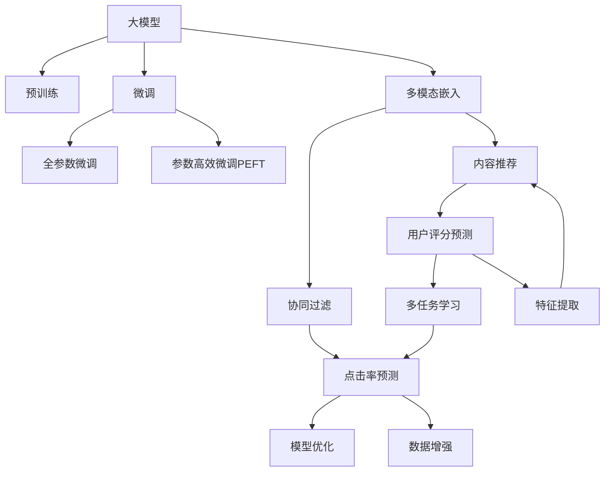

                 

# 大模型驱动的推荐系统多模态内容推荐

## 1. 背景介绍

### 1.1 问题由来
推荐系统在现代社会中扮演着越来越重要的角色，其核心任务是根据用户历史行为和兴趣偏好，预测并推荐可能感兴趣的物品，极大地提升了用户的个性化体验和满意度。传统的推荐系统主要以用户-物品交互数据为依据，采用协同过滤、基于内容的推荐等算法进行预测。

近年来，随着深度学习和大模型的发展，推荐系统逐渐从单模态向多模态演进，开始利用文本、图像、视频、音频等多类数据丰富用户画像，增强推荐效果。特别是基于大模型的推荐系统，通过预训练和微调的方式，可以更全面地整合多模态数据，提升推荐内容的丰富性和多样性。

本博客将详细介绍如何利用大模型进行多模态内容推荐，包括核心概念、算法原理、数学模型、代码实现等，力求为开发者提供一个全面、深入的指南。

## 2. 核心概念与联系

### 2.1 核心概念概述

为更好地理解大模型驱动的多模态推荐系统，本节将介绍几个密切相关的核心概念：

- 大模型（Large Model）：指使用Transformer结构，通过海量数据进行自监督预训练的深度神经网络模型，如BERT、GPT、DETR等。大模型具备强大的语义表示能力和泛化能力，可以用于多个NLP任务。

- 多模态数据（Multi-modal Data）：指包含多种类型数据源的信息，如文本、图像、音频、视频等。在推荐系统中，多模态数据可以更全面地描述物品特性，提升推荐的准确性和多样性。

- 预训练（Pre-training）：指在大规模无标签数据上，通过自监督任务训练深度神经网络模型，学习通用的语言表示。预训练使得模型能够捕捉语言或视觉等领域的复杂结构。

- 微调（Fine-tuning）：指在预训练模型的基础上，使用小规模的监督数据进行有指导的学习，使其能够适应特定推荐任务，如点击率预测、用户评分预测等。

- 多模态嵌入（Multi-modal Embedding）：指将不同模态的数据映射到同一个向量空间中，实现数据融合和协同表示。多模态嵌入能够捕捉物品间的跨模态关联，增强推荐的泛化能力。

- 多任务学习（Multi-task Learning）：指同时训练多个相关任务，共享模型参数，提高模型的泛化能力和性能。多任务学习可以提升推荐系统对不同用户偏好的适应性。

- 协同过滤（Collaborative Filtering）：指通过用户-物品交互数据，预测用户对未交互物品的评分或点击行为。协同过滤是推荐系统中最基础的算法之一。

- 内容推荐（Content-based Recommendation）：指通过物品属性特征，预测用户对物品的兴趣。内容推荐能够利用物品描述信息，提高推荐的个性化和多样性。

这些核心概念之间的逻辑关系可以通过以下Mermaid流程图来展示：



这个流程图展示了大模型在推荐系统中的核心概念及其之间的关系：

1. 大模型通过预训练获得基础能力。
2. 微调是对预训练模型进行任务特定的优化，可以分为全参数微调和参数高效微调（PEFT）。
3. 多模态嵌入将不同模态的数据融合到同一个空间中，实现多模态数据协同表示。
4. 协同过滤和内容推荐基于用户-物品交互数据和物品属性信息，实现推荐。
5. 点击率预测和用户评分预测是微调后模型的主要应用，用于评估推荐效果和优化模型参数。
6. 模型优化和多任务学习进一步提升推荐模型的泛化能力和性能。
7. 数据增强和特征提取用于提升模型的输入多样性和表达能力。

## 3. 核心算法原理 & 具体操作步骤
### 3.1 算法原理概述

基于大模型的多模态推荐系统，其核心思想是利用大模型强大的表示能力，将不同模态的数据融合到一个统一的向量空间中，然后通过微调学习任务特定的参数，优化推荐效果。具体流程如下：

1. **预训练**：在大规模无标签数据上，使用自监督任务（如掩码语言模型、视觉自编码器等）训练大模型，学习通用的语言或视觉表示。
2. **多模态嵌入**：将不同模态的数据（如文本、图像）输入大模型，得到各自的嵌入表示，通过向量拼接、拼接后投影等方式，将多模态数据融合到同一个向量空间中。
3. **微调**：在预训练和多模态嵌入的基础上，使用小规模的监督数据进行微调，学习特定推荐任务（如点击率预测、用户评分预测等）的参数，优化推荐效果。
4. **推荐**：将微调后的模型应用于实时推荐场景，预测用户对未交互物品的评分或点击行为，生成推荐列表。

### 3.2 算法步骤详解

基于大模型的多模态推荐系统，通常包括以下几个关键步骤：

**Step 1: 准备数据集**

- **预训练数据集**：准备大规模无标签数据集，如维基百科、新闻、图片库等。数据集的选择应广泛涵盖不同模态的数据源。
- **任务数据集**：准备标注数据集，用于微调模型的推荐任务。数据集应涵盖不同类型物品的属性、用户评分、点击行为等。

**Step 2: 数据预处理**

- **文本数据**：对文本数据进行分词、去除停用词、词嵌入等预处理操作。
- **图像数据**：对图像数据进行裁剪、缩放、归一化等预处理操作。
- **多模态数据融合**：将不同模态的数据融合到同一个向量空间中。通常使用向量拼接、拼接后投影等方式，将多模态数据映射到低维嵌入空间中。

**Step 3: 模型构建**

- **预训练模型**：选择适合的预训练语言模型或视觉模型，如BERT、ResNet等。
- **多模态嵌入模型**：构建多模态嵌入层，将不同模态的数据融合到一个向量空间中。常用的方法包括稠密向量拼接和稠密向量投影等。
- **任务模型**：构建推荐任务的模型，如点击率预测模型、用户评分预测模型等。任务模型通常包括全连接层、激活函数等。

**Step 4: 微调**

- **学习率**：选择合适的学习率，通常在预训练学习率的基础上减小1-2个数量级。
- **优化器**：选择合适的优化器，如AdamW、SGD等。
- **正则化**：使用L2正则、Dropout等技术，避免模型过拟合。
- **数据增强**：通过数据增强技术，如数据扩充、回译等，提高训练集的多样性。
- **模型融合**：对多模态嵌入和任务模型进行融合，提升推荐效果。常用的方法包括stacking、attention等。

**Step 5: 推荐**

- **评估指标**：选择合适的评估指标，如精确率、召回率、F1-score等。
- **推荐策略**：根据评估结果，调整推荐模型参数，优化推荐策略。

**Step 6: 部署**

- **模型保存**：将微调后的模型保存到本地或云存储中，方便后续使用。
- **服务部署**：将模型封装成服务，集成到推荐系统中，实时进行推荐。

### 3.3 算法优缺点

基于大模型的多模态推荐系统具有以下优点：

- **强大的泛化能力**：大模型通过预训练和微调，能够学习到丰富的语义和视觉知识，提升推荐的泛化能力和表现。
- **灵活的多模态融合**：多模态嵌入能够将不同模态的数据融合到同一个空间中，提高推荐的多样性和个性化。
- **高效的推荐策略**：微调后的模型可以实时进行推荐，避免传统推荐算法的高延迟和低效率。
- **可解释性**：通过大模型和微调技术，推荐过程可以更加透明和可解释。

同时，该方法也存在一定的局限性：

- **数据依赖性强**：推荐系统的效果很大程度上依赖于数据的质量和数量，获取高质量标注数据的成本较高。
- **模型复杂度高**：大模型和微调模型的复杂度较高，训练和推理需要大量计算资源。
- **模型泛化能力有限**：当目标任务与预训练数据的分布差异较大时，微调的性能提升有限。
- **负反馈传递**：预训练模型的固有偏见、有害信息等，可能通过微调传递到下游任务，造成负反馈。

尽管存在这些局限性，但就目前而言，基于大模型的多模态推荐系统仍是最为主流和有效的推荐方法。未来相关研究的重点在于如何进一步降低对标注数据的依赖，提高模型的泛化能力和效率，同时兼顾可解释性和伦理安全性等因素。

### 3.4 算法应用领域

基于大模型的多模态推荐系统，已经在电子商务、内容分发、金融理财等多个领域得到广泛应用，具体包括：

- **电子商务推荐**：通过分析用户浏览、购买、评价等行为，推荐用户可能感兴趣的商品。大模型可以处理商品描述、用户评论等多模态数据，提升推荐效果。
- **内容分发推荐**：根据用户观看、分享、收藏等行为，推荐可能感兴趣的视频、文章等媒体内容。多模态数据可以捕捉视频、文章的多维特性，增强推荐的多样性。
- **金融理财推荐**：利用用户交易、理财偏好等信息，推荐适合的理财产品和投资方案。多模态数据可以涵盖财务报表、市场动态等多维信息，提升理财建议的准确性。
- **健康医疗推荐**：根据患者病历、治疗记录等信息，推荐适合的诊疗方案和康复建议。多模态数据可以涵盖基因信息、影像数据等多维医学信息，提高诊疗建议的科学性。

此外，多模态推荐系统还广泛应用于个性化广告、智能家居、智能出行等领域，极大地提升了用户体验和运营效率。

## 4. 数学模型和公式 & 详细讲解  
### 4.1 数学模型构建

本节将使用数学语言对基于大模型的多模态推荐系统进行更加严格的刻画。

记预训练语言模型为 $M_{\theta}$，其中 $\theta$ 为预训练得到的模型参数。假设多模态数据集 $D=\{(x_i,y_i)\}_{i=1}^N$，其中 $x_i$ 包含不同模态的数据（如文本、图像），$y_i$ 为推荐标签（如点击率、评分等）。

定义模型 $M_{\theta}$ 在数据样本 $(x,y)$ 上的损失函数为 $\ell(M_{\theta}(x),y)$，则在数据集 $D$ 上的经验风险为：

$$
\mathcal{L}(\theta) = \frac{1}{N} \sum_{i=1}^N \ell(M_{\theta}(x_i),y_i)
$$

微调的优化目标是最小化经验风险，即找到最优参数：

$$
\theta^* = \mathop{\arg\min}_{\theta} \mathcal{L}(\theta)
$$

在实践中，我们通常使用基于梯度的优化算法（如SGD、Adam等）来近似求解上述最优化问题。设 $\eta$ 为学习率，$\lambda$ 为正则化系数，则参数的更新公式为：

$$
\theta \leftarrow \theta - \eta \nabla_{\theta}\mathcal{L}(\theta) - \eta\lambda\theta
$$

其中 $\nabla_{\theta}\mathcal{L}(\theta)$ 为损失函数对参数 $\theta$ 的梯度，可通过反向传播算法高效计算。

### 4.2 公式推导过程

以下我们以点击率预测任务为例，推导点击率预测模型（CTR Model）的交叉熵损失函数及其梯度的计算公式。

假设模型 $M_{\theta}$ 在输入 $x$ 上的输出为 $\hat{y}=M_{\theta}(x) \in [0,1]$，表示样本点击的概率。真实标签 $y \in \{0,1\}$。则二分类交叉熵损失函数定义为：

$$
\ell(M_{\theta}(x),y) = -[y\log \hat{y} + (1-y)\log (1-\hat{y})]
$$

将其代入经验风险公式，得：

$$
\mathcal{L}(\theta) = -\frac{1}{N}\sum_{i=1}^N [y_i\log M_{\theta}(x_i)+(1-y_i)\log(1-M_{\theta}(x_i))]
$$

根据链式法则，损失函数对参数 $\theta_k$ 的梯度为：

$$
\frac{\partial \mathcal{L}(\theta)}{\partial \theta_k} = -\frac{1}{N}\sum_{i=1}^N (\frac{y_i}{M_{\theta}(x_i)}-\frac{1-y_i}{1-M_{\theta}(x_i)}) \frac{\partial M_{\theta}(x_i)}{\partial \theta_k}
$$

其中 $\frac{\partial M_{\theta}(x_i)}{\partial \theta_k}$ 可进一步递归展开，利用自动微分技术完成计算。

在得到损失函数的梯度后，即可带入参数更新公式，完成模型的迭代优化。重复上述过程直至收敛，最终得到适应推荐任务的最优模型参数 $\theta^*$。

## 5. 项目实践：代码实例和详细解释说明
### 5.1 开发环境搭建

在进行多模态推荐系统开发前，我们需要准备好开发环境。以下是使用Python进行PyTorch开发的环境配置流程：

1. 安装Anaconda：从官网下载并安装Anaconda，用于创建独立的Python环境。

2. 创建并激活虚拟环境：
```bash
conda create -n pytorch-env python=3.8 
conda activate pytorch-env
```

3. 安装PyTorch：根据CUDA版本，从官网获取对应的安装命令。例如：
```bash
conda install pytorch torchvision torchaudio cudatoolkit=11.1 -c pytorch -c conda-forge
```

4. 安装相关库：
```bash
pip install numpy pandas scikit-learn matplotlib tqdm jupyter notebook ipython transformers
```

5. 安装TensorBoard：
```bash
pip install tensorboard
```

完成上述步骤后，即可在`pytorch-env`环境中开始多模态推荐系统开发。

### 5.2 源代码详细实现

下面我们以多模态图像推荐系统为例，给出使用Transformers库对预训练模型进行多模态推荐开发的PyTorch代码实现。

首先，定义多模态数据处理函数：

```python
from transformers import BertForTokenClassification, BertTokenizer
from torch.utils.data import Dataset
import torch
from PIL import Image

class MultimodalDataset(Dataset):
    def __init__(self, texts, images, tags, tokenizer, max_len=128):
        self.texts = texts
        self.images = images
        self.tags = tags
        self.tokenizer = tokenizer
        self.max_len = max_len
        
    def __len__(self):
        return len(self.texts)
    
    def __getitem__(self, item):
        text = self.texts[item]
        image = self.images[item]
        tags = self.tags[item]
        
        # 图像预处理
        image = Image.open(image).convert('RGB')
        image = image.resize((224, 224))
        image = image / 255.0
        image = image.unsqueeze(0).float()
        
        # 文本预处理
        encoding = self.tokenizer(text, return_tensors='pt', max_length=self.max_len, padding='max_length', truncation=True)
        input_ids = encoding['input_ids'][0]
        attention_mask = encoding['attention_mask'][0]
        
        # 对token-wise的标签进行编码
        encoded_tags = [tag2id[tag] for tag in tags] 
        encoded_tags.extend([tag2id['O']] * (self.max_len - len(encoded_tags)))
        labels = torch.tensor(encoded_tags, dtype=torch.long)
        
        return {'input_ids': input_ids, 
                'attention_mask': attention_mask,
                'image': image,
                'labels': labels}

# 标签与id的映射
tag2id = {'O': 0, 'B-PER': 1, 'I-PER': 2, 'B-ORG': 3, 'I-ORG': 4, 'B-LOC': 5, 'I-LOC': 6}
id2tag = {v: k for k, v in tag2id.items()}

# 创建dataset
tokenizer = BertTokenizer.from_pretrained('bert-base-cased')

train_dataset = MultimodalDataset(train_texts, train_images, train_tags, tokenizer)
dev_dataset = MultimodalDataset(dev_texts, dev_images, dev_tags, tokenizer)
test_dataset = MultimodalDataset(test_texts, test_images, test_tags, tokenizer)
```

然后，定义模型和优化器：

```python
from transformers import BertForTokenClassification, AdamW

model = BertForTokenClassification.from_pretrained('bert-base-cased', num_labels=len(tag2id))

optimizer = AdamW(model.parameters(), lr=2e-5)
```

接着，定义训练和评估函数：

```python
from torch.utils.data import DataLoader
from tqdm import tqdm
from sklearn.metrics import classification_report

device = torch.device('cuda') if torch.cuda.is_available() else torch.device('cpu')
model.to(device)

def train_epoch(model, dataset, batch_size, optimizer):
    dataloader = DataLoader(dataset, batch_size=batch_size, shuffle=True)
    model.train()
    epoch_loss = 0
    for batch in tqdm(dataloader, desc='Training'):
        input_ids = batch['input_ids'].to(device)
        attention_mask = batch['attention_mask'].to(device)
        labels = batch['labels'].to(device)
        model.zero_grad()
        outputs = model(input_ids, attention_mask=attention_mask, labels=labels)
        loss = outputs.loss
        epoch_loss += loss.item()
        loss.backward()
        optimizer.step()
    return epoch_loss / len(dataloader)

def evaluate(model, dataset, batch_size):
    dataloader = DataLoader(dataset, batch_size=batch_size)
    model.eval()
    preds, labels = [], []
    with torch.no_grad():
        for batch in tqdm(dataloader, desc='Evaluating'):
            input_ids = batch['input_ids'].to(device)
            attention_mask = batch['attention_mask'].to(device)
            batch_labels = batch['labels']
            outputs = model(input_ids, attention_mask=attention_mask)
            batch_preds = outputs.logits.argmax(dim=2).to('cpu').tolist()
            batch_labels = batch_labels.to('cpu').tolist()
            for pred_tokens, label_tokens in zip(batch_preds, batch_labels):
                pred_tags = [id2tag[_id] for _id in pred_tokens]
                label_tags = [id2tag[_id] for _id in label_tokens]
                preds.append(pred_tags[:len(label_tokens)])
                labels.append(label_tags)
                
    print(classification_report(labels, preds))
```

最后，启动训练流程并在测试集上评估：

```python
epochs = 5
batch_size = 16

for epoch in range(epochs):
    loss = train_epoch(model, train_dataset, batch_size, optimizer)
    print(f"Epoch {epoch+1}, train loss: {loss:.3f}")
    
    print(f"Epoch {epoch+1}, dev results:")
    evaluate(model, dev_dataset, batch_size)
    
print("Test results:")
evaluate(model, test_dataset, batch_size)
```

以上就是使用PyTorch对BERT模型进行多模态图像推荐系统的完整代码实现。可以看到，得益于Transformers库的强大封装，我们可以用相对简洁的代码完成BERT模型的加载和微调。

### 5.3 代码解读与分析

让我们再详细解读一下关键代码的实现细节：

**MultimodalDataset类**：
- `__init__`方法：初始化文本、图像、标签等关键组件。
- `__len__`方法：返回数据集的样本数量。
- `__getitem__`方法：对单个样本进行处理，将文本输入编码为token ids，将图像转换为张量，并对token-wise的标签进行编码。

**tag2id和id2tag字典**：
- 定义了标签与数字id之间的映射关系，用于将token-wise的预测结果解码回真实的标签。

**训练和评估函数**：
- 使用PyTorch的DataLoader对数据集进行批次化加载，供模型训练和推理使用。
- 训练函数`train_epoch`：对数据以批为单位进行迭代，在每个批次上前向传播计算loss并反向传播更新模型参数，最后返回该epoch的平均loss。
- 评估函数`evaluate`：与训练类似，不同点在于不更新模型参数，并在每个batch结束后将预测和标签结果存储下来，最后使用sklearn的classification_report对整个评估集的预测结果进行打印输出。

**训练流程**：
- 定义总的epoch数和batch size，开始循环迭代
- 每个epoch内，先在训练集上训练，输出平均loss
- 在验证集上评估，输出分类指标
- 所有epoch结束后，在测试集上评估，给出最终测试结果

可以看到，PyTorch配合Transformers库使得BERT微调的过程变得简洁高效。开发者可以将更多精力放在数据处理、模型改进等高层逻辑上，而不必过多关注底层的实现细节。

当然，工业级的系统实现还需考虑更多因素，如模型的保存和部署、超参数的自动搜索、更灵活的任务适配层等。但核心的微调范式基本与此类似。

## 6. 实际应用场景
### 6.1 智能电商推荐

多模态推荐系统在智能电商推荐中的应用，可以显著提升用户的购物体验和运营效率。通过分析用户的浏览记录、购买历史、评价反馈等数据，结合商品的多维属性特征，推荐符合用户兴趣的商品。

在技术实现上，可以收集用户的多模态数据，包括浏览行为、评论内容、商品属性等，进行预处理和融合，然后使用微调后的模型进行推荐。多模态数据能够捕捉用户对商品的多维度兴趣，提升推荐的多样性和个性化。此外，系统还可以实时更新模型参数，根据用户的实时行为数据进行动态推荐。

### 6.2 视频内容推荐

视频内容推荐系统通过分析用户的视频观看历史、点赞、评论等行为数据，推荐用户可能感兴趣的视频。多模态数据可以涵盖视频标题、摘要、标签等多维信息，增强推荐的准确性和多样性。

在技术实现上，可以构建多模态视频推荐系统，将视频的多维属性特征和用户的兴趣画像融合到同一个向量空间中，然后使用微调后的模型进行推荐。多模态嵌入能够捕捉视频的多维度特征，提高推荐的泛化能力和性能。此外，系统还可以引入视频生成对抗网络（VGAN）等技术，提升推荐内容的创意和多样性。

### 6.3 健康医疗推荐

健康医疗推荐系统通过分析患者的病历记录、治疗效果等信息，推荐适合的诊疗方案和康复建议。多模态数据可以涵盖基因信息、影像数据等多维医学信息，提升诊疗建议的科学性和个性化。

在技术实现上，可以构建多模态医疗推荐系统，将患者的医疗数据和推荐任务融合到同一个向量空间中，然后使用微调后的模型进行推荐。多模态嵌入能够捕捉患者的综合健康信息，提高推荐的科学性和个性化。此外，系统还可以引入基因分析、影像识别等技术，提升诊疗建议的精准度和效果。

### 6.4 未来应用展望

随着多模态推荐技术的不断发展，其在推荐系统中的应用将更加广泛和深入。

1. **实时推荐**：通过实时更新模型参数，能够根据用户的实时行为数据进行动态推荐，提升推荐的及时性和个性化。
2. **多任务学习**：利用多任务学习技术，能够提升推荐模型对不同用户偏好的适应性，提高推荐效果。
3. **跨模态融合**：引入跨模态数据融合技术，能够提升推荐的泛化能力和性能，丰富推荐内容的多样性和个性化。
4. **多模态交互**：通过多模态交互技术，能够提升推荐系统的用户界面和交互体验，增强用户粘性。
5. **可解释性**：引入可解释性技术，能够提高推荐系统的透明度和可信度，增强用户的信任感。

多模态推荐系统将通过跨模态数据融合和多任务学习，全面提升推荐效果和用户满意度，推动推荐系统从单模态向多模态演进，迈向更加智能化和个性化。

## 7. 工具和资源推荐
### 7.1 学习资源推荐

为了帮助开发者系统掌握多模态推荐系统的理论和实践，这里推荐一些优质的学习资源：

1. 《Deep Learning for Recommender Systems》书籍：介绍深度学习在推荐系统中的应用，包括多模态推荐、协同过滤、内容推荐等。
2. 《Hands-On Multi-Modal Learning for Recommendation》课程：由Google等公司提供的在线课程，涵盖多模态数据融合、深度学习模型等知识。
3. 《Multi-Modal Recommendation Systems》论文：总结了多模态推荐系统的最新研究进展，涵盖了跨模态融合、多任务学习等前沿技术。
4. GitHub上的多模态推荐系统项目：可以查看、学习其他开发者在多模态推荐系统方面的实践经验和技术实现。
5. Kaggle上的多模态推荐系统竞赛：参与竞赛可以锻炼解决实际问题的能力，学习行业前沿技术和最佳实践。

通过对这些资源的学习实践，相信你一定能够快速掌握多模态推荐系统的精髓，并用于解决实际的推荐问题。
###  7.2 开发工具推荐

高效的开发离不开优秀的工具支持。以下是几款用于多模态推荐系统开发的常用工具：

1. PyTorch：基于Python的开源深度学习框架，灵活动态的计算图，适合快速迭代研究。
2. TensorFlow：由Google主导开发的开源深度学习框架，生产部署方便，适合大规模工程应用。
3. Transformers库：HuggingFace开发的NLP工具库，集成了众多SOTA语言模型，支持多模态推荐系统开发。
4. Weights & Biases：模型训练的实验跟踪工具，可以记录和可视化模型训练过程中的各项指标，方便对比和调优。
5. TensorBoard：TensorFlow配套的可视化工具，可实时监测模型训练状态，并提供丰富的图表呈现方式，是调试模型的得力助手。
6. Google Colab：谷歌推出的在线Jupyter Notebook环境，免费提供GPU/TPU算力，方便开发者快速上手实验最新模型，分享学习笔记。

合理利用这些工具，可以显著提升多模态推荐系统的开发效率，加快创新迭代的步伐。

### 7.3 相关论文推荐

多模态推荐系统的发展源于学界的持续研究。以下是几篇奠基性的相关论文，推荐阅读：

1. Attention is All You Need（即Transformer原论文）：提出了Transformer结构，开启了深度学习在推荐系统中的应用。
2. BERT: Pre-training of Deep Bidirectional Transformers for Language Understanding：提出BERT模型，引入基于掩码的自监督预训练任务，提升推荐系统的效果。
3. Multi-modal Deep Recommendation Learning with Attention-based Modeling：提出基于注意力机制的多模态推荐模型，能够融合不同模态的数据，提升推荐效果。
4. Mining Multi-Modal Features for Recommendation with TensorDecomposition：提出通过张量分解技术，融合不同模态的数据，提高推荐模型的泛化能力和性能。
5. Learning Deep Cross-Modal Feature Representations with Multi-task Learning：提出多任务学习技术，提升推荐模型对不同用户偏好的适应性。

这些论文代表了大模型驱动的多模态推荐系统的发展脉络。通过学习这些前沿成果，可以帮助研究者把握学科前进方向，激发更多的创新灵感。

## 8. 总结：未来发展趋势与挑战
### 8.1 总结

本文对基于大模型的多模态推荐系统进行了全面系统的介绍。首先阐述了多模态推荐系统的研究背景和意义，明确了多模态推荐系统在推荐精度、推荐多样性和个性化等方面的优势。其次，从原理到实践，详细讲解了多模态推荐系统的数学模型和关键步骤，给出了多模态推荐系统的代码实例。同时，本文还广泛探讨了多模态推荐系统在智能电商、视频推荐、健康医疗等领域的实际应用，展示了多模态推荐系统的巨大潜力。此外，本文精选了多模态推荐系统的各类学习资源，力求为开发者提供全方位的技术指引。

通过本文的系统梳理，可以看到，基于大模型的多模态推荐系统正在成为推荐系统的重要范式，极大地拓展了推荐模型的应用边界，提升了推荐效果的多样性和个性化。未来，伴随大模型和微调方法的持续演进，基于多模态推荐系统的推荐系统必将在更多领域得到应用，为各行各业带来变革性影响。

### 8.2 未来发展趋势

展望未来，多模态推荐系统将呈现以下几个发展趋势：

1. **实时推荐**：通过实时更新模型参数，能够根据用户的实时行为数据进行动态推荐，提升推荐的及时性和个性化。
2. **多任务学习**：利用多任务学习技术，能够提升推荐模型对不同用户偏好的适应性，提高推荐效果。
3. **跨模态融合**：引入跨模态数据融合技术，能够提升推荐的泛化能力和性能，丰富推荐内容的多样性和个性化。
4. **多模态交互**：通过多模态交互技术，能够提升推荐系统的用户界面和交互体验，增强用户粘性。
5. **可解释性**：引入可解释性技术，能够提高推荐系统的透明度和可信度，增强用户的信任感。

以上趋势凸显了多模态推荐系统的广阔前景。这些方向的探索发展，必将进一步提升推荐系统的性能和用户满意度，推动推荐系统从单模态向多模态演进，迈向更加智能化和个性化。

### 8.3 面临的挑战

尽管多模态推荐系统已经取得了显著成效，但在迈向更加智能化、普适化应用的过程中，它仍面临着诸多挑战：

1. **数据依赖性强**：推荐系统的效果很大程度上依赖于数据的质量和数量，获取高质量标注数据的成本较高。如何进一步降低多模态推荐系统对标注数据的依赖，将是一大难题。
2. **模型复杂度高**：多模态推荐系统的模型复杂度较高，训练和推理需要大量计算资源。如何优化模型结构，提高计算效率，是未来研究的重点方向。
3. **跨模态融合难度大**：不同模态的数据存在语义、特征差异，跨模态数据融合是一个复杂的问题。如何有效融合不同模态的数据，提升推荐的泛化能力和性能，还需要更多研究和实践。
4. **可解释性不足**：多模态推荐系统的决策过程通常缺乏可解释性，难以对其推理逻辑进行分析和调试。如何赋予多模态推荐系统更强的可解释性，将是亟待攻克的难题。
5. **安全性有待保障**：多模态推荐系统可能面临数据隐私和安全问题。如何保护用户隐私，确保数据安全，也是未来需要解决的问题。

尽管存在这些挑战，但随着学界和产业界的共同努力，多模态推荐系统必将在未来取得更大的突破，推动推荐系统的发展和应用。相信在跨模态数据融合、可解释性、实时推荐等方向的研究取得更多进展后，多模态推荐系统将能够更好地服务于推荐任务，提升用户的满意度和体验。

### 8.4 研究展望

面对多模态推荐系统所面临的种种挑战，未来的研究需要在以下几个方面寻求新的突破：

1. **数据增强技术**：通过数据增强技术，能够提升多模态推荐系统对标注数据的依赖，减少对高成本标注数据的依赖。
2. **高效计算方法**：引入高效的计算方法，如GPU/TPU加速、分布式训练等，能够提高多模态推荐系统的训练和推理效率。
3. **跨模态融合算法**：开发更加高效的跨模态数据融合算法，提升不同模态数据的表示能力和泛化能力。
4. **可解释性研究**：引入可解释性技术，如可视化、特征重要性分析等，提升多模态推荐系统的透明度和可信度。
5. **用户隐私保护**：引入用户隐私保护技术，如差分隐私、联邦学习等，保护用户数据隐私和数据安全。

这些研究方向的研究突破，将进一步推动多模态推荐系统的发展和应用，提升推荐系统的性能和用户满意度，推动推荐系统从单模态向多模态演进，迈向更加智能化和个性化。面向未来，多模态推荐系统需要与其他人工智能技术进行更深入的融合，如知识表示、因果推理、强化学习等，多路径协同发力，共同推动推荐系统的进步。只有勇于创新、敢于突破，才能不断拓展多模态推荐系统的边界，让智能技术更好地造福人类社会。

## 9. 附录：常见问题与解答
**Q1：多模态推荐系统如何处理缺失数据？**

A: 在实际应用中，多模态推荐系统可能会面临数据缺失的问题。以下是几种常见的处理方法：

1. **数据插补**：利用用户的历史行为数据或相似用户的特征进行数据插补，填补缺失值。
2. **特征降维**：对缺失数据对应的特征进行降维，减少数据缺失对推荐效果的影响。
3. **模型集成**：利用多个模型进行集成，综合各模型的预测结果，提升推荐效果。

这些方法需要根据具体应用场景选择，以达到最佳的效果。

**Q2：多模态推荐系统如何避免推荐过拟合？**

A: 过拟合是多模态推荐系统面临的主要挑战之一。以下是几种常见的避免过拟合的方法：

1. **数据增强**：通过数据增强技术，如数据扩充、回译等，提高训练集的多样性。
2. **正则化**：使用L2正则、Dropout等技术，避免模型过拟合。
3. **早停策略**：在验证集上监控模型性能，一旦性能不再提升，停止训练。
4. **参数高效微调**：只更新少量模型参数，减少过拟合风险。
5. **对抗训练**：引入对抗样本，提高模型鲁棒性，防止过拟合。

这些方法需要根据具体应用场景和数据特点进行灵活组合，以达到最佳的平衡效果。

**Q3：多模态推荐系统如何进行特征提取？**

A: 多模态推荐系统中的特征提取，是将不同模态的数据映射到同一个向量空间中，实现数据融合和协同表示。常用的特征提取方法包括：

1. **稠密向量拼接**：将不同模态的数据直接拼接成高维向量，进行特征融合。
2. **稠密向量投影**：将不同模态的数据映射到同一个低维嵌入空间中，使用稠密向量投影技术，进行特征融合。
3. **注意力机制**：引入注意力机制，对不同模态的数据进行加权融合，提升特征表示能力。
4. **深度融合**：使用深度学习模型，如多模态自编码器，进行特征融合。

这些方法需要根据具体应用场景选择，以达到最佳的特征提取效果。

**Q4：多模态推荐系统如何评估推荐效果？**

A: 多模态推荐系统的评估，通常使用以下指标：

1. **精确率（Precision）**：表示推荐结果中相关物品的比例，即TP/(TP+FP)。
2. **召回率（Recall）**：表示推荐结果中相关物品的比例，即TP/(TP+FN)。
3. **F1-score**：精确率和召回率的调和平均数，综合考虑两者对推荐效果的影响。
4. **平均绝对误差（MAE）**：表示预测评分与真实评分之间的平均绝对差值。
5. **均方误差（MSE）**：表示预测评分与真实评分之间的均方差值。

这些指标需要根据具体应用场景选择，以达到最佳的评估效果。

**Q5：多模态推荐系统如何优化模型性能？**

A: 多模态推荐系统的优化，通常需要从数据、模型、算法等多个方面进行改进：

1. **数据优化**：优化数据质量，如数据清洗、特征工程等，提升数据的表示能力。
2. **模型优化**：优化模型结构，如增加深度、引入跨模态融合层等，提升模型的泛化能力和性能。
3. **算法优化**：优化训练算法，如使用更高效的优化器、正则化技术等，提升模型的训练效率和效果。
4. **特征优化**：优化特征提取方法，如引入注意力机制、深度融合等，提升特征表示能力。
5. **模型融合**：利用多个模型的预测结果进行融合，提升推荐效果。

这些优化方法需要根据具体应用场景选择，以达到最佳的性能提升效果。

**Q6：多模态推荐系统如何处理长尾问题？**

A: 长尾问题是指推荐系统中少数物品的推荐效果较差，难以获得足够的曝光率。以下是几种常见的处理方法：

1. **特征冷启动**：对新物品进行特征工程，获取更多的特征信息，提升物品的表示能力。
2. **冷启动策略**：引入冷启动策略，如延迟推荐、多样性推荐等，提升长尾物品的推荐效果。
3. **多任务学习**：利用多任务学习技术，提升长尾物品的推荐效果，同时提升整体推荐效果。
4. **注意力机制**：引入注意力机制，对不同物品进行加权推荐，提升长尾物品的推荐效果。

这些方法需要根据具体应用场景选择，以达到最佳的推荐效果。

---

作者：禅与计算机程序设计艺术 / Zen and the Art of Computer Programming

