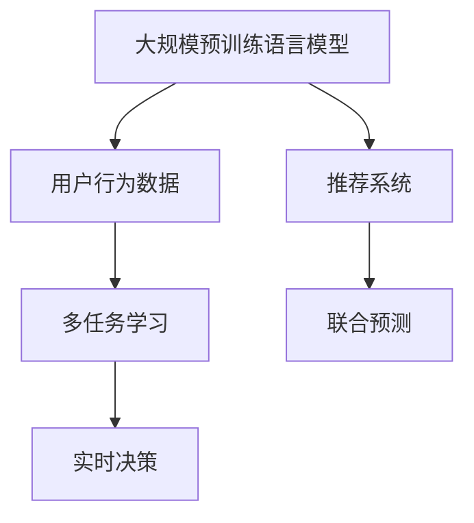

                 

# 大模型驱动的电商个性化活动设计与优化

> 关键词：
    1. 电商个性化推荐
    2. 深度学习模型
    3. 用户行为分析
    4. 情感分析
    5. 转化率预测
    6. 实时决策优化
    7. 超大规模计算

## 1. 背景介绍

### 1.1 问题由来
随着电子商务的迅猛发展，电商平台如淘宝、京东、Amazon等，通过个性化的推荐系统，极大提升了用户体验和转化率。传统的推荐算法主要基于用户行为和历史购买记录进行推荐，但这些方法往往难以应对新用户的冷启动问题，以及用户行为的多样性和动态变化。

为解决这些问题，基于深度学习的大模型推荐系统应运而生。这些系统利用大规模预训练语言模型，能够从海量用户行为数据中自动学习用户兴趣和行为模式，实现更加精准的个性化推荐。然而，大模型推荐系统在大规模部署时，面临计算资源密集、算法复杂度高、系统集成难度大等挑战。

### 1.2 问题核心关键点
大模型驱动的电商个性化推荐系统主要包括以下几个核心关键点：

1. **大规模预训练语言模型的选择与应用**：选择并应用适合电商场景的预训练语言模型，是系统构建的基础。
2. **用户行为数据的收集与处理**：收集用户行为数据，包括浏览、点击、购买、评价等，并进行预处理和特征工程。
3. **多任务学习与联合预测**：将多任务学习与联合预测技术应用到推荐系统中，提升模型的综合性能。
4. **实时决策与优化**：构建实时决策系统，能够根据用户行为动态调整推荐策略，提升推荐效果。
5. **系统部署与性能优化**：在大规模计算资源上部署推荐系统，并对模型、算法和系统架构进行优化，确保系统的稳定性和高效性。

## 2. 核心概念与联系

### 2.1 核心概念概述

为更好地理解大模型推荐系统的构建，本节将介绍几个密切相关的核心概念：

- **大规模预训练语言模型**：如BERT、GPT-3等，通过在大规模无标签文本数据上预训练，学习到丰富的语言表示，具备强大的语义理解能力。
- **用户行为数据**：用户在电商平台上的各种行为数据，如浏览记录、点击行为、购买历史、评价内容等。
- **推荐系统**：通过分析用户行为数据，预测用户感兴趣的商品，并根据预测结果进行推荐，提升用户体验和平台转化率。
- **多任务学习**：将多个相关任务一起学习，共享知识，提升模型性能。
- **联合预测**：将多个预测任务联合求解，提升预测的准确性和鲁棒性。
- **实时决策**：根据用户实时行为数据，动态调整推荐策略，提升推荐效果。

这些核心概念之间的逻辑关系可以通过以下Mermaid流程图来展示：



这个流程图展示了大模型推荐系统的核心概念及其之间的关系：

1. 利用大规模预训练语言模型获得初步语义表示。
2. 通过用户行为数据提取用户兴趣和行为模式。
3. 应用多任务学习和联合预测提升推荐性能。
4. 根据实时决策动态调整推荐策略，优化用户体验。

## 3. 核心算法原理 & 具体操作步骤
### 3.1 算法原理概述

基于深度学习的大模型推荐系统，本质上是一个端到端的学习过程，其核心思想是：

- 利用大规模预训练语言模型，自动学习用户兴趣和行为模式，获取用户语义表示。
- 将用户语义表示作为输入，结合用户行为数据，预测用户感兴趣的商品，并根据预测结果进行推荐。

其工作流程大致可以分为以下几个步骤：

1. 收集用户行为数据。
2. 预处理和特征工程。
3. 在大规模预训练语言模型上进行微调。
4. 应用多任务学习和联合预测技术。
5. 根据实时决策动态调整推荐策略。

### 3.2 算法步骤详解

**Step 1: 用户行为数据收集与处理**

1. 数据收集：收集用户在电商平台上各种行为数据，包括浏览记录、点击行为、购买历史、评价内容等。
2. 数据清洗：去除无效数据，如错误点击、无效评价等。
3. 数据增强：通过数据增强技术，如随机替换、截断等，扩充训练集，提升模型鲁棒性。

**Step 2: 预处理与特征工程**

1. 特征提取：从用户行为数据中提取有意义的特征，如商品ID、浏览时间、点击位置等。
2. 编码与转换：将特征向量转换为模型可以接受的格式，如one-hot编码、序列编码等。
3. 特征融合：通过特征融合技术，如拼接、加权平均等，构建综合特征表示。

**Step 3: 预训练语言模型的微调**

1. 模型选择：选择合适的预训练语言模型，如BERT、GPT-3等。
2. 数据准备：准备微调数据集，包括用户行为数据和商品信息数据。
3. 微调训练：在大规模预训练语言模型上进行微调，学习用户语义表示。

**Step 4: 多任务学习与联合预测**

1. 多任务定义：将推荐任务定义为主任务，如点击预测、购买预测、评价预测等。
2. 联合训练：将多个任务联合训练，共享知识，提升模型性能。
3. 预测输出：将多任务预测结果进行加权融合，输出综合推荐结果。

**Step 5: 实时决策与优化**

1. 实时数据收集：实时收集用户行为数据，如实时点击、浏览记录等。
2. 动态调整：根据实时数据动态调整推荐策略，如调整模型权重、改变推荐排序等。
3. 性能评估：实时评估推荐效果，如点击率、转化率等，并进行优化调整。

### 3.3 算法优缺点

基于大模型驱动的电商推荐系统，具有以下优点：

1. 高效性：利用深度学习模型，自动学习用户兴趣和行为模式，无需人工干预。
2. 准确性：通过大规模预训练语言模型的语义表示，提升推荐预测的准确性和鲁棒性。
3. 泛化能力：在大规模数据上预训练，能够适应不同用户和场景的变化，提升系统泛化能力。
4. 实时优化：通过实时决策系统，动态调整推荐策略，提升推荐效果。

同时，该方法也存在一些局限性：

1. 数据依赖：大模型推荐系统高度依赖用户行为数据，数据质量对系统性能影响较大。
2. 计算资源要求高：预训练语言模型和深度学习模型的训练和推理都需要大量计算资源。
3. 系统集成复杂：需要与电商平台、广告系统、库存系统等多系统集成，系统架构复杂。
4. 解释性不足：深度学习模型的黑盒特性，难以解释推荐决策过程。
5. 隐私问题：用户行为数据涉及用户隐私，需注意数据安全和使用合规性。

尽管存在这些局限性，但基于大模型驱动的电商推荐系统在大数据和计算资源充足的情况下，仍具有显著的优势，广泛应用在电商、金融、媒体等多个领域。

### 3.4 算法应用领域

基于大模型驱动的电商推荐系统，在电商场景中的应用尤为广泛，包括：

1. **商品推荐**：根据用户浏览和点击行为，推荐用户可能感兴趣的商品。
2. **活动推荐**：推荐用户可能感兴趣的活动和促销信息，如优惠券、折扣商品等。
3. **个性化广告**：根据用户兴趣和行为，定制化推荐广告，提升广告点击率和转化率。
4. **内容推荐**：推荐用户可能感兴趣的内容，如文章、视频、商品详情等。

除了电商场景，大模型推荐系统在金融、媒体、游戏等领域也有广泛应用，如基于用户行为数据进行信用评分、游戏推荐等。

## 4. 数学模型和公式 & 详细讲解  
### 4.1 数学模型构建

本节将使用数学语言对大模型驱动的电商推荐系统进行更加严格的刻画。

假设预训练语言模型为 $M_{\theta}:\mathcal{X} \rightarrow \mathcal{Y}$，其中 $\mathcal{X}$ 为用户行为特征空间，$\mathcal{Y}$ 为用户兴趣表示空间，$\theta \in \mathbb{R}^d$ 为模型参数。假设用户行为数据集为 $D=\{(x_i,y_i)\}_{i=1}^N, x_i \in \mathcal{X}, y_i \in \mathcal{Y}$。

定义模型 $M_{\theta}$ 在输入 $x_i$ 上的输出为 $M_{\theta}(x_i)=y_i$，则在数据集 $D$ 上的经验风险为：

$$
\mathcal{L}(\theta) = \frac{1}{N}\sum_{i=1}^N \mathbb{1}(y_i \neq M_{\theta}(x_i))
$$

其中 $\mathbb{1}(\cdot)$ 为示性函数，表示模型预测正确与否。微调的优化目标是最小化经验风险，即找到最优参数：

$$
\theta^* = \mathop{\arg\min}_{\theta} \mathcal{L}(\theta)
$$

在实践中，我们通常使用基于梯度的优化算法（如SGD、Adam等）来近似求解上述最优化问题。设 $\eta$ 为学习率，$\lambda$ 为正则化系数，则参数的更新公式为：

$$
\theta \leftarrow \theta - \eta \nabla_{\theta}\mathcal{L}(\theta) - \eta\lambda\theta
$$

其中 $\nabla_{\theta}\mathcal{L}(\theta)$ 为损失函数对参数 $\theta$ 的梯度，可通过反向传播算法高效计算。

### 4.2 公式推导过程

以下我们以电商推荐系统为例，推导基于点击预测的多任务学习与联合预测公式。

假设模型 $M_{\theta}$ 在输入 $x_i$ 上的输出为 $\hat{y}_i=M_{\theta}(x_i) \in \{0,1\}$，表示预测点击的概率。真实标签 $y_i \in \{0,1\}$。则二分类交叉熵损失函数定义为：

$$
\ell(y_i,\hat{y}_i) = -[y_i\log \hat{y}_i + (1-y_i)\log (1-\hat{y}_i)]
$$

其中 $y_i$ 为真实标签，$\hat{y}_i$ 为模型预测点击概率。

将多任务学习引入电商推荐系统中，假设需要预测用户点击商品 $j$ 的概率，将 $j$ 视作任务编号，$j \in [1,M]$，$M$ 为任务总数。则多任务学习损失函数为：

$$
\mathcal{L}(\theta) = \sum_{j=1}^M \ell(y_{i,j},\hat{y}_{i,j})
$$

其中 $y_{i,j}$ 为第 $j$ 个任务的标签，$\hat{y}_{i,j}=M_{\theta}(x_i,j)$ 为第 $j$ 个任务的预测概率。

为提升预测准确性和鲁棒性，将多任务学习与联合预测结合，定义联合预测损失函数：

$$
\mathcal{L}_{joint}(\theta) = \frac{1}{N} \sum_{i=1}^N \sum_{j=1}^M \ell(y_{i,j},\hat{y}_{i,j})
$$

其中 $\ell(\cdot)$ 为多任务损失函数，$N$ 为训练集样本数，$M$ 为任务总数。

在得到联合预测损失函数后，即可带入参数更新公式，完成模型的迭代优化。重复上述过程直至收敛，最终得到适应电商推荐任务的最优模型参数 $\theta^*$。

## 5. 项目实践：代码实例和详细解释说明
### 5.1 开发环境搭建

在进行电商推荐系统开发前，我们需要准备好开发环境。以下是使用Python进行TensorFlow开发的环境配置流程：

1. 安装Anaconda：从官网下载并安装Anaconda，用于创建独立的Python环境。

2. 创建并激活虚拟环境：
```bash
conda create -n pytorch-env python=3.8 
conda activate pytorch-env
```

3. 安装TensorFlow：根据CUDA版本，从官网获取对应的安装命令。例如：
```bash
conda install tensorflow tensorflow-gpu=cuda11.1 -c pytorch -c conda-forge
```

4. 安装各类工具包：
```bash
pip install numpy pandas scikit-learn matplotlib tqdm jupyter notebook ipython
```

完成上述步骤后，即可在`pytorch-env`环境中开始电商推荐系统的开发。

### 5.2 源代码详细实现

这里以点击预测任务为例，给出使用TensorFlow对BERT模型进行电商推荐系统开发的完整代码实现。

首先，定义多任务学习的数据处理函数：

```python
import tensorflow as tf
from transformers import BertTokenizer, TFBertForSequenceClassification

class ClickPredictionDataset(tf.data.Dataset):
    def __init__(self, texts, labels, tokenizer, max_len=128):
        self.texts = texts
        self.labels = labels
        self.tokenizer = tokenizer
        self.max_len = max_len
        
    def __len__(self):
        return len(self.texts)
    
    def __getitem__(self, item):
        text = self.texts[item]
        label = self.labels[item]
        
        encoding = self.tokenizer(text, return_tensors='tf', max_length=self.max_len, padding='max_length', truncation=True)
        input_ids = encoding['input_ids']
        attention_mask = encoding['attention_mask']
        
        return {'input_ids': input_ids, 
                'attention_mask': attention_mask,
                'labels': tf.constant(label, dtype=tf.int32)}
```

然后，定义模型和优化器：

```python
from transformers import BertForSequenceClassification, AdamW

model = BertForSequenceClassification.from_pretrained('bert-base-cased', num_labels=2)

optimizer = AdamW(model.parameters(), lr=2e-5)
```

接着，定义训练和评估函数：

```python
from tqdm import tqdm

device = tf.device('cuda') if tf.cuda.is_available() else tf.device('cpu')
model.to(device)

def train_epoch(model, dataset, batch_size, optimizer):
    dataloader = tf.data.Dataset.from_generator(lambda: dataset, output_signature={'input_ids': tf.TensorSpec(shape=(None, None), dtype=tf.int32), 
                                                                                'attention_mask': tf.TensorSpec(shape=(None, None), dtype=tf.int32), 
                                                                                'labels': tf.TensorSpec(shape=(), dtype=tf.int32)})
    model.train()
    epoch_loss = 0
    for batch in tqdm(dataloader, desc='Training'):
        with tf.GradientTape() as tape:
            input_ids = batch['input_ids'].to(device)
            attention_mask = batch['attention_mask'].to(device)
            labels = batch['labels']
            outputs = model(input_ids, attention_mask=attention_mask, labels=labels)
            loss = outputs.loss
        epoch_loss += loss.numpy()
        grads = tape.gradient(loss, model.trainable_variables)
        optimizer.apply_gradients(zip(grads, model.trainable_variables))
    return epoch_loss / len(dataloader)

def evaluate(model, dataset, batch_size):
    dataloader = tf.data.Dataset.from_generator(lambda: dataset, output_signature={'input_ids': tf.TensorSpec(shape=(None, None), dtype=tf.int32), 
                                                                                'attention_mask': tf.TensorSpec(shape=(None, None), dtype=tf.int32), 
                                                                                'labels': tf.TensorSpec(shape=(), dtype=tf.int32)})
    model.eval()
    predictions = []
    labels = []
    with tf.GradientTape() as tape:
        for batch in dataloader:
            input_ids = batch['input_ids'].to(device)
            attention_mask = batch['attention_mask'].to(device)
            outputs = model(input_ids, attention_mask=attention_mask)
            logits = outputs.logits.numpy()
            preds = tf.argmax(logits, axis=1).numpy()
            labels.append(batch['labels'])
            predictions.append(preds)
    print(classification_report(labels, predictions))
```

最后，启动训练流程并在测试集上评估：

```python
epochs = 5
batch_size = 16

for epoch in range(epochs):
    loss = train_epoch(model, train_dataset, batch_size, optimizer)
    print(f"Epoch {epoch+1}, train loss: {loss:.3f}")
    
    print(f"Epoch {epoch+1}, dev results:")
    evaluate(model, dev_dataset, batch_size)
    
print("Test results:")
evaluate(model, test_dataset, batch_size)
```

以上就是使用TensorFlow对BERT进行电商推荐系统开发的完整代码实现。可以看到，得益于TensorFlow的强大封装，我们可以用相对简洁的代码完成BERT模型的加载和训练。

### 5.3 代码解读与分析

让我们再详细解读一下关键代码的实现细节：

**ClickPredictionDataset类**：
- `__init__`方法：初始化文本、标签、分词器等关键组件。
- `__len__`方法：返回数据集的样本数量。
- `__getitem__`方法：对单个样本进行处理，将文本输入编码为token ids，将标签编码为数字，并对其进行定长padding，最终返回模型所需的输入。

**train_epoch函数**：
- 使用TensorFlow的DataLoader对数据集进行批次化加载，供模型训练和推理使用。
- 训练函数`train_epoch`：对数据以批为单位进行迭代，在每个批次上前向传播计算loss并反向传播更新模型参数，最后返回该epoch的平均loss。

**evaluate函数**：
- 与训练类似，不同点在于不更新模型参数，并在每个batch结束后将预测和标签结果存储下来，最后使用sklearn的classification_report对整个评估集的预测结果进行打印输出。

**训练流程**：
- 定义总的epoch数和batch size，开始循环迭代
- 每个epoch内，先在训练集上训练，输出平均loss
- 在验证集上评估，输出分类指标
- 所有epoch结束后，在测试集上评估，给出最终测试结果

可以看到，TensorFlow配合BERT模型使得电商推荐系统的代码实现变得简洁高效。开发者可以将更多精力放在数据处理、模型改进等高层逻辑上，而不必过多关注底层的实现细节。

当然，工业级的系统实现还需考虑更多因素，如模型的保存和部署、超参数的自动搜索、更灵活的任务适配层等。但核心的电商推荐范式基本与此类似。

## 6. 实际应用场景
### 6.1 智能客服系统

基于大模型驱动的电商推荐系统，可以广泛应用于智能客服系统的构建。传统客服往往需要配备大量人力，高峰期响应缓慢，且一致性和专业性难以保证。而使用电商推荐系统，可以根据用户浏览和点击行为，推荐用户可能感兴趣的商品，快速解决用户问题。

在技术实现上，可以收集用户的历史浏览和点击记录，构建电商推荐模型，推荐用户可能感兴趣的商品。在用户提出问题时，通过实时收集用户行为数据，动态调整推荐策略，快速提供解决方案，提升客户满意度。

### 6.2 个性化广告投放

电商推荐系统还可以应用于个性化广告投放。传统广告投放基于用户兴趣标签进行粗粒度定向，难以达到精准营销的效果。而电商推荐系统可以根据用户行为数据，推荐用户可能感兴趣的商品广告，实现精准投放，提升广告点击率和转化率。

在技术实现上，可以收集用户的浏览、点击、购买记录，构建个性化广告推荐模型。在广告投放时，根据用户实时行为数据，动态调整广告展示策略，推荐最适合的广告，提升广告效果。

### 6.3 库存管理与促销策略

电商推荐系统还可以应用于库存管理和促销策略的优化。传统库存管理基于历史销售数据和季节性因素进行预测，难以应对用户需求的多变性。而电商推荐系统可以根据用户行为数据，预测用户可能感兴趣的商品，动态调整库存策略，避免库存积压或断货。

在技术实现上，可以收集用户的浏览、点击、购买记录，构建商品需求预测模型。根据预测结果，动态调整库存策略，实现库存的高效管理。同时，根据用户行为数据，动态调整促销策略，提升促销效果。

### 6.4 未来应用展望

随着大模型推荐系统的不断发展，未来将在更多领域得到应用，为各个行业带来变革性影响。

在智慧医疗领域，基于大模型推荐系统，可以为患者推荐最适合的治疗方案和药物，提升诊疗效果。

在智能教育领域，可以推荐最适合的教学资源和学习路径，提高学习效率和质量。

在智慧城市治理中，可以推荐最优的出行路线和交通方式，提升城市管理效率和市民出行体验。

此外，在企业生产、社会治理、文娱传媒等众多领域，基于大模型推荐系统的技术应用也将不断涌现，为经济社会发展注入新的动力。相信随着技术的日益成熟，电商推荐系统必将在更广阔的应用领域大放异彩，深刻影响人类的生产生活方式。

## 7. 工具和资源推荐
### 7.1 学习资源推荐

为了帮助开发者系统掌握大模型推荐系统的理论基础和实践技巧，这里推荐一些优质的学习资源：

1. 《深度学习》课程：斯坦福大学开设的深度学习课程，全面介绍深度学习的基本概念和算法。
2. 《自然语言处理》课程：斯坦福大学开设的NLP明星课程，涵盖NLP的基本理论和经典模型。
3. 《Transformers from Deep to Wide》博文：介绍大语言模型在电商推荐中的应用，探讨模型选择和优化方法。
4. 《Neural Collaborative Filtering》论文：介绍基于深度学习的协同过滤推荐算法，提出多任务学习和联合预测方法。
5. 《Parameter-Efficient Attention for Sequence Prediction》论文：提出 Adapter 技术，实现参数高效的微调方法。

通过对这些资源的学习实践，相信你一定能够快速掌握大模型推荐系统的精髓，并用于解决实际的推荐问题。
###  7.2 开发工具推荐

高效的开发离不开优秀的工具支持。以下是几款用于大模型推荐系统开发的常用工具：

1. TensorFlow：基于Python的开源深度学习框架，适合大规模模型训练和推理。
2. PyTorch：基于Python的开源深度学习框架，灵活动态的计算图，适合快速迭代研究。
3. Keras：基于TensorFlow和Theano的高级深度学习框架，易于上手。
4. Weights & Biases：模型训练的实验跟踪工具，可以记录和可视化模型训练过程中的各项指标，方便对比和调优。
5. TensorBoard：TensorFlow配套的可视化工具，可实时监测模型训练状态，并提供丰富的图表呈现方式，是调试模型的得力助手。

合理利用这些工具，可以显著提升大模型推荐系统的开发效率，加快创新迭代的步伐。

### 7.3 相关论文推荐

大模型推荐系统的发展源于学界的持续研究。以下是几篇奠基性的相关论文，推荐阅读：

1. Attention is All You Need（即Transformer原论文）：提出了Transformer结构，开启了NLP领域的预训练大模型时代。
2. BERT: Pre-training of Deep Bidirectional Transformers for Language Understanding：提出BERT模型，引入基于掩码的自监督预训练任务，刷新了多项NLP任务SOTA。
3. Neural Collaborative Filtering：提出基于深度学习的协同过滤推荐算法，结合多任务学习和联合预测技术。
4. Parameter-Efficient Attention for Sequence Prediction：提出 Adapter 技术，实现参数高效的微调方法。
5. SimCLR: A Simple Framework for Unsupervised Learning of Depth Embeddings from Images：提出SimCLR方法，在大规模无标签数据上预训练模型。

这些论文代表了大模型推荐系统的发展脉络。通过学习这些前沿成果，可以帮助研究者把握学科前进方向，激发更多的创新灵感。

## 8. 总结：未来发展趋势与挑战

### 8.1 总结

本文对基于深度学习的大模型推荐系统进行了全面系统的介绍。首先阐述了电商推荐系统的背景和意义，明确了电商推荐系统的核心任务和目标。其次，从原理到实践，详细讲解了电商推荐系统的构建流程，包括用户行为数据的收集与处理、预训练语言模型的微调、多任务学习和联合预测等关键步骤。同时，本文还广泛探讨了电商推荐系统在多个领域的应用前景，展示了其广阔的应用范围。

通过本文的系统梳理，可以看到，基于深度学习的大模型推荐系统在电商领域的应用已经趋于成熟，并在多个相关领域得到了广泛应用。利用深度学习模型，自动学习用户兴趣和行为模式，能够提升推荐预测的准确性和鲁棒性，提升用户体验和平台转化率。未来，随着大模型推荐系统的发展，必将带来更多创新应用，深刻影响人类的生产生活方式。

### 8.2 未来发展趋势

展望未来，大模型推荐系统将呈现以下几个发展趋势：

1. **多任务学习与联合预测的进一步应用**：利用多任务学习与联合预测技术，提升推荐预测的准确性和鲁棒性。未来，结合更多任务（如点击预测、购买预测、评价预测等），实现更加综合的推荐策略。
2. **模型压缩与优化**：大模型推荐系统在实际部署中，面临计算资源密集、算法复杂度高、系统集成难度大等问题。未来的研究方向将包括模型压缩与优化，减少模型参数量，提升计算效率。
3. **实时决策与优化**：构建实时决策系统，能够根据用户实时行为数据动态调整推荐策略，提升推荐效果。未来，结合更多实时数据源，如点击流数据、社交媒体数据等，实现更加智能化的推荐策略。
4. **隐私保护与安全**：用户行为数据涉及用户隐私，需注意数据安全和使用合规性。未来，将引入更多隐私保护技术，如差分隐私、联邦学习等，保障用户隐私和数据安全。

这些趋势凸显了大模型推荐系统的广阔前景。这些方向的探索发展，必将进一步提升推荐系统的性能和应用范围，为各个行业带来新的机遇和挑战。

### 8.3 面临的挑战

尽管大模型推荐系统已经取得了显著的进展，但在迈向更加智能化、普适化应用的过程中，仍面临诸多挑战：

1. **数据质量与数据量**：大模型推荐系统高度依赖用户行为数据，数据质量对系统性能影响较大。数据不完整、不规范、不平衡等问题，将直接影响模型预测的准确性。
2. **计算资源要求高**：预训练语言模型和深度学习模型的训练和推理都需要大量计算资源。如何在有限的计算资源下，提升模型性能，是未来研究的重要方向。
3. **模型可解释性不足**：深度学习模型的黑盒特性，难以解释推荐决策过程。对于医疗、金融等高风险应用，算法的可解释性和可审计性尤为重要。
4. **隐私与安全**：用户行为数据涉及用户隐私，需注意数据安全和使用合规性。如何在保障隐私的同时，提升推荐效果，是未来研究的重要课题。
5. **算法鲁棒性**：模型在面对噪声、异常数据等问题时，容易产生误导性推荐。如何提升模型的鲁棒性，避免误导性推荐，是未来研究的重要方向。

尽管存在这些挑战，但基于深度学习的大模型推荐系统在数据质量和计算资源充足的情况下，仍具有显著的优势，广泛应用在电商、金融、媒体等多个领域。

### 8.4 研究展望

面对大模型推荐系统所面临的诸多挑战，未来的研究需要在以下几个方面寻求新的突破：

1. **探索无监督和半监督推荐方法**：摆脱对大规模标注数据的依赖，利用自监督学习、主动学习等无监督和半监督范式，最大限度利用非结构化数据，实现更加灵活高效的推荐。
2. **开发参数高效的微调方法**：开发更加参数高效的微调方法，如Adapter、Prefix等，在固定大部分预训练参数的同时，只更新极少量的任务相关参数。
3. **引入因果推断与对比学习**：引入因果推断和对比学习思想，增强推荐模型建立稳定因果关系的能力，学习更加普适、鲁棒的语言表征。
4. **结合专家知识与多模态数据**：将符号化的先验知识，如知识图谱、逻辑规则等，与神经网络模型进行巧妙融合，引导推荐过程学习更准确、合理的语言模型。同时加强不同模态数据的整合，实现视觉、语音等多模态信息与文本信息的协同建模。
5. **纳入伦理道德约束**：在模型训练目标中引入伦理导向的评估指标，过滤和惩罚有偏见、有害的输出倾向。同时加强人工干预和审核，建立模型行为的监管机制，确保输出符合人类价值观和伦理道德。

这些研究方向的探索，必将引领大模型推荐系统走向更高的台阶，为构建安全、可靠、可解释、可控的智能系统铺平道路。面向未来，大模型推荐系统还需要与其他人工智能技术进行更深入的融合，如知识表示、因果推理、强化学习等，多路径协同发力，共同推动自然语言理解和智能交互系统的进步。只有勇于创新、敢于突破，才能不断拓展语言模型的边界，让智能技术更好地造福人类社会。

## 9. 附录：常见问题与解答

**Q1：电商推荐系统如何处理用户冷启动问题？**

A: 用户冷启动问题是指新用户没有历史行为数据，难以使用传统的基于历史行为数据的推荐方法。为了解决冷启动问题，电商推荐系统通常采用以下方法：

1. **随机推荐**：对新用户随机推荐一定数量的商品，收集用户反馈数据，建立用户行为模型。
2. **兴趣引导**：根据用户基本信息（如年龄、性别、地域等），引导用户浏览和点击可能感兴趣的商品，收集行为数据。
3. **集成模型**：结合多模态数据（如搜索历史、社交媒体数据等），建立多模态推荐模型，提升推荐效果。

**Q2：电商推荐系统如何实现个性化广告投放？**

A: 电商推荐系统可以根据用户行为数据，推荐用户可能感兴趣的商品广告，实现精准投放。具体实现步骤如下：

1. **用户画像建立**：收集用户的浏览、点击、购买记录，建立用户兴趣画像。
2. **广告数据收集**：收集各类广告数据，包括商品信息、广告位、投放时间等。
3. **联合预测模型训练**：结合用户行为数据和广告数据，训练联合预测模型，预测用户对广告的兴趣程度。
4. **动态广告投放**：根据预测结果，动态调整广告投放策略，提升广告点击率和转化率。

**Q3：电商推荐系统如何优化库存管理？**

A: 电商推荐系统可以根据用户行为数据，预测用户可能感兴趣的商品，动态调整库存策略，避免库存积压或断货。具体实现步骤如下：

1. **库存数据收集**：收集商品的库存数据，包括库存量、上架时间、销售趋势等。
2. **用户行为数据收集**：收集用户的浏览、点击、购买记录，建立用户行为模型。
3. **需求预测模型建立**：结合库存数据和用户行为数据，建立需求预测模型，预测用户对商品的需求量。
4. **库存动态调整**：根据预测结果，动态调整库存策略，实现库存的高效管理。

**Q4：电商推荐系统如何应对市场变化？**

A: 电商推荐系统需要能够动态适应市场变化，提升推荐效果的适应性。具体实现方法如下：

1. **实时数据收集**：实时收集用户行为数据，包括浏览、点击、购买、评价等。
2. **动态模型调整**：根据实时数据动态调整推荐模型参数，适应市场变化。
3. **多任务学习应用**：将多任务学习技术引入推荐系统，提升模型对市场变化的适应能力。

**Q5：电商推荐系统如何提升用户体验？**

A: 电商推荐系统可以通过以下方法提升用户体验：

1. **个性化推荐**：根据用户兴趣和行为，推荐最适合的商品，提升用户体验。
2. **多样性推荐**：在推荐商品时，考虑商品的多样性，避免用户陷入信息茧房。
3. **实时反馈**：收集用户反馈数据，及时调整推荐策略，提升用户体验。

**Q6：电商推荐系统如何保护用户隐私？**

A: 电商推荐系统需要保护用户隐私，采取以下措施：

1. **数据匿名化**：对用户行为数据进行匿名化处理，去除敏感信息。
2. **差分隐私**：在数据收集和处理过程中，应用差分隐私技术，保护用户隐私。
3. **联邦学习**：利用联邦学习技术，在本地设备上训练模型，保护用户数据隐私。

综上所述，电商推荐系统通过利用深度学习模型，自动学习用户兴趣和行为模式，能够提升推荐预测的准确性和鲁棒性，提升用户体验和平台转化率。未来，随着技术的不断进步，电商推荐系统将在更多领域得到应用，为各个行业带来新的机遇和挑战。

---

作者：禅与计算机程序设计艺术 / Zen and the Art of Computer Programming

