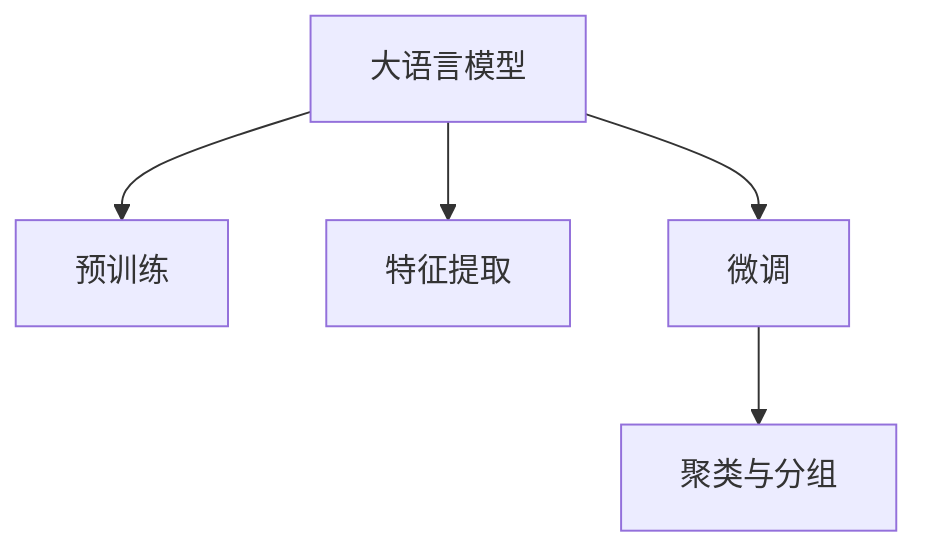

                 

## 1. 背景介绍

### 1.1 问题由来

在电商行业，如何精准识别并细分客户群体，提升个性化营销效果和客户满意度，是所有电商平台面临的共同挑战。传统的客户分群方法主要基于用户的购买历史、浏览行为等特征，通过聚类算法或分类算法进行分组。然而，这些方法存在以下问题：

1. **特征维度单一**：传统方法往往只考虑用户的消费行为，忽视了用户在社交网络、社交媒体上的活动。
2. **效果欠佳**：用户在多场景中的行为不一致，难以找到真正符合用户兴趣的特征。
3. **计算量大**：全量特征聚类和分类计算成本高，难以实时处理大量数据。

为了解决这些问题，大语言模型驱动的客户分群方法应运而生。这种方法利用大规模预训练语言模型，对用户的多维度行为进行建模，并在此基础上进行分组。相比传统方法，该方法具有以下优势：

1. **多维度数据建模**：通过预训练语言模型，捕捉用户在社交网络、搜索引擎、新闻网站等多场景中的行为。
2. **高效计算**：利用预训练模型的通用语言表示，通过微调实现客户分群，计算复杂度大大降低。
3. **泛化能力强**：大模型具有较强的泛化能力，能适应不同电商平台的业务需求。

### 1.2 问题核心关键点

本方法的核心在于利用大语言模型对用户的多维度行为进行建模，并通过微调实现客户分群。该方法的关键点包括：

1. **大语言模型的选择**：选择合适的预训练语言模型，如BERT、GPT-2等，作为基础特征提取器。
2. **特征提取**：从用户的多维度行为中提取特征，如用户在搜索引擎、社交媒体上的搜索、评论、点赞、分享等。
3. **微调与优化**：通过微调过程优化模型，提高客户分群的精度和效果。
4. **聚类与分组**：对微调后的模型输出进行聚类或分类，形成具有相似特征的客户群体。

## 2. 核心概念与联系

### 2.1 核心概念概述

为更好地理解大模型驱动的客户分群方法，本节将介绍几个关键概念：

1. **大语言模型(Large Language Model, LLM)**：如BERT、GPT-2等预训练语言模型，通过对大规模文本数据进行自监督学习，学习到丰富的语言表示。
2. **预训练(Pre-training)**：在大规模无标签文本数据上进行自监督学习，获得语言表示。
3. **微调(Fine-tuning)**：在预训练模型的基础上，使用特定任务的数据进行有监督学习，优化模型参数，以适应特定任务。
4. **特征提取**：从用户的多维度行为中提取特征，供模型进行学习。
5. **聚类与分组**：将用户分组，提升个性化营销效果。

这些概念之间的联系可以通过以下Mermaid流程图来展示：



这个流程图展示了大语言模型驱动的客户分群方法的核心概念及其之间的联系：

1. 大语言模型通过预训练获得基础能力。
2. 特征提取从用户的多维度行为中提取特征。
3. 微调在预训练模型的基础上，通过特定任务的数据进行有监督学习，优化模型参数。
4. 聚类与分组对微调后的模型输出进行聚类或分类，形成客户群体。

## 3. 核心算法原理 & 具体操作步骤

### 3.1 算法原理概述

大模型驱动的客户分群方法基于以下原理：

1. **特征提取**：利用大语言模型对用户的多维度行为进行建模，提取文本特征。
2. **微调**：在预训练模型的基础上，使用特定任务的数据进行有监督学习，优化模型参数。
3. **聚类与分组**：对微调后的模型输出进行聚类或分类，形成客户群体。

### 3.2 算法步骤详解

大模型驱动的客户分群方法包括以下关键步骤：

**Step 1: 准备数据集**

1. **数据收集**：收集用户的多维度行为数据，包括搜索行为、评论、点赞、分享等。
2. **数据清洗**：处理缺失值、异常值，保证数据质量。
3. **数据划分**：将数据集划分为训练集、验证集和测试集。

**Step 2: 特征提取**

1. **预训练模型选择**：选择合适的预训练语言模型，如BERT、GPT-2等。
2. **特征向量化**：将用户的多维度行为转换为模型可接受的向量表示，如输入文本、标签等。
3. **特征融合**：将不同来源的特征进行融合，生成综合特征向量。

**Step 3: 微调**

1. **模型加载**：加载预训练模型，并进行特征向量填充。
2. **训练集加载**：加载训练集数据，并按照模型输入格式进行预处理。
3. **微调训练**：使用训练集数据对模型进行微调训练，优化模型参数。
4. **验证集评估**：在验证集上评估模型效果，避免过拟合。
5. **模型保存**：保存微调后的模型，供后续聚类与分组使用。

**Step 4: 聚类与分组**

1. **模型加载**：加载微调后的模型，并进行特征向量填充。
2. **聚类算法选择**：选择合适的聚类算法，如K-means、DBSCAN等。
3. **聚类训练**：使用模型输出作为输入，进行聚类训练。
4. **分组评估**：对聚类结果进行评估，选择最优的聚类数和模型。

**Step 5: 结果展示**

1. **可视化展示**：对聚类结果进行可视化展示，便于业务人员理解。
2. **业务应用**：将聚类结果应用于个性化营销、广告投放等业务场景。

### 3.3 算法优缺点

大模型驱动的客户分群方法具有以下优点：

1. **多维度数据建模**：能够综合利用用户在多个场景中的行为，提高分群精度。
2. **高效计算**：利用预训练模型的通用语言表示，通过微调实现分群，计算复杂度大大降低。
3. **泛化能力强**：大模型具有较强的泛化能力，能适应不同电商平台的业务需求。

同时，该方法也存在以下局限性：

1. **数据隐私**：用户的多维度行为涉及隐私问题，需要谨慎处理。
2. **计算资源需求高**：预训练模型和微调过程需要大量计算资源。
3. **模型复杂**：大语言模型本身复杂，微调和聚类过程也较为复杂。

尽管存在这些局限性，但就目前而言，大模型驱动的客户分群方法仍是大数据驱动业务应用的重要手段。未来相关研究的重点在于如何进一步降低计算资源需求，提高模型泛化能力，同时兼顾数据隐私和模型复杂性等因素。

### 3.4 算法应用领域

大模型驱动的客户分群方法在电商行业具有广泛的应用前景，主要体现在以下几个方面：

1. **个性化营销**：通过分群结果，针对不同客户群体制定个性化的营销策略，提高转化率。
2. **广告投放**：根据客户分群结果，精准投放广告，提升广告效果和ROI。
3. **客户服务**：通过分群结果，优化客服资源配置，提升客户服务质量。
4. **产品推荐**：根据客户分群结果，推荐符合用户兴趣的商品，提升用户满意度。

除了电商行业，大模型驱动的客户分群方法也可以在其他大数据驱动的业务领域，如金融、教育、医疗等，发挥重要作用。

## 4. 数学模型和公式 & 详细讲解

### 4.1 数学模型构建

大模型驱动的客户分群方法可以构建如下数学模型：

设用户的多维度行为数据为 $x=(x_1, x_2, \cdots, x_n)$，其中 $x_i$ 表示用户在场景 $i$ 中的行为数据。设预训练语言模型为 $M_{\theta}$，特征提取器为 $F$，微调后的模型为 $M_{\hat{\theta}}$。设聚类算法为 $K$，聚类数为 $k$。

目标是最小化聚类损失函数：

$$
\mathcal{L}_k(M_{\hat{\theta}}, K) = \sum_{i=1}^N \min_{j=1}^k ||F(M_{\hat{\theta}}(x_i)) - \mu_j||^2
$$

其中，$\mu_j$ 表示聚类 $j$ 的中心点。

### 4.2 公式推导过程

以下我们以K-means聚类为例，推导模型输出与聚类结果的关系。

设聚类 $j$ 的中心点为 $\mu_j$，用户 $i$ 的行为数据 $x_i$ 的特征向量为 $F(M_{\hat{\theta}}(x_i))$，聚类结果为 $y_i$，则K-means的目标函数为：

$$
\mathcal{L}_k = \sum_{i=1}^N \min_{j=1}^k ||F(M_{\hat{\theta}}(x_i)) - \mu_j||^2
$$

对上述目标函数求导，得：

$$
\frac{\partial \mathcal{L}_k}{\partial \mu_j} = -2 \sum_{i=1}^N (y_i = j) ||F(M_{\hat{\theta}}(x_i)) - \mu_j||^2
$$

对 $\mu_j$ 求导，得：

$$
\mu_j = \frac{1}{\sum_{i=1}^N (y_i = j)} \sum_{i=1}^N (y_i = j) F(M_{\hat{\theta}}(x_i))
$$

### 4.3 案例分析与讲解

以电商平台中的用户评论数据为例，分析大模型驱动的客户分群过程。

假设用户 $i$ 在电商平台中的评论为 $x_i$，使用BERT模型进行特征提取，得到向量 $F(M_{\hat{\theta}}(x_i))$。通过微调，得到评分预测模型 $M_{\hat{\theta}}$，对用户评论进行评分。设聚类数为 $k=3$，使用K-means算法进行聚类，得到聚类结果 $y_i$。

具体步骤如下：

1. **数据准备**：收集用户评论数据，并进行预处理。
2. **特征提取**：使用BERT模型对评论数据进行特征提取，得到向量表示。
3. **微调**：对微调后的模型进行训练，得到评分预测模型 $M_{\hat{\theta}}$。
4. **聚类**：使用K-means算法对预测评分进行聚类，得到聚类结果 $y_i$。
5. **分组展示**：对聚类结果进行可视化展示，展示每个聚类群体的特征和用户评论。

## 5. 项目实践：代码实例和详细解释说明

### 5.1 开发环境搭建

在进行大模型驱动的客户分群方法开发前，我们需要准备好开发环境。以下是使用Python进行PyTorch开发的环境配置流程：

1. 安装Anaconda：从官网下载并安装Anaconda，用于创建独立的Python环境。

2. 创建并激活虚拟环境：
```bash
conda create -n pytorch-env python=3.8 
conda activate pytorch-env
```

3. 安装PyTorch：根据CUDA版本，从官网获取对应的安装命令。例如：
```bash
conda install pytorch torchvision torchaudio cudatoolkit=11.1 -c pytorch -c conda-forge
```

4. 安装Transformers库：
```bash
pip install transformers
```

5. 安装各类工具包：
```bash
pip install numpy pandas scikit-learn matplotlib tqdm jupyter notebook ipython
```

完成上述步骤后，即可在`pytorch-env`环境中开始开发实践。

### 5.2 源代码详细实现

这里我们以电商平台的客户分群为例，给出使用Transformers库对BERT模型进行微调的PyTorch代码实现。

首先，定义客户分群任务的数据处理函数：

```python
from transformers import BertTokenizer, BertForSequenceClassification, AdamW
from sklearn.cluster import KMeans
from sklearn.metrics import silhouette_score
import torch

class CustomerClusterDataset(Dataset):
    def __init__(self, texts, labels, tokenizer, max_len=128):
        self.texts = texts
        self.labels = labels
        self.tokenizer = tokenizer
        self.max_len = max_len
        
    def __len__(self):
        return len(self.texts)
    
    def __getitem__(self, item):
        text = self.texts[item]
        label = self.labels[item]
        
        encoding = self.tokenizer(text, return_tensors='pt', max_length=self.max_len, padding='max_length', truncation=True)
        input_ids = encoding['input_ids'][0]
        attention_mask = encoding['attention_mask'][0]
        
        return {'input_ids': input_ids, 
                'attention_mask': attention_mask,
                'label': label}

# 标签与id的映射
label2id = {'low': 0, 'mid': 1, 'high': 2}
id2label = {v: k for k, v in label2id.items()}

# 创建dataset
tokenizer = BertTokenizer.from_pretrained('bert-base-cased')

train_dataset = CustomerClusterDataset(train_texts, train_labels, tokenizer)
dev_dataset = CustomerClusterDataset(dev_texts, dev_labels, tokenizer)
test_dataset = CustomerClusterDataset(test_texts, test_labels, tokenizer)
```

然后，定义模型和优化器：

```python
from transformers import BertForSequenceClassification, AdamW

model = BertForSequenceClassification.from_pretrained('bert-base-cased', num_labels=len(label2id))

optimizer = AdamW(model.parameters(), lr=2e-5)
```

接着，定义训练和评估函数：

```python
from torch.utils.data import DataLoader
from tqdm import tqdm
from sklearn.metrics import classification_report

device = torch.device('cuda') if torch.cuda.is_available() else torch.device('cpu')
model.to(device)

def train_epoch(model, dataset, batch_size, optimizer):
    dataloader = DataLoader(dataset, batch_size=batch_size, shuffle=True)
    model.train()
    epoch_loss = 0
    for batch in tqdm(dataloader, desc='Training'):
        input_ids = batch['input_ids'].to(device)
        attention_mask = batch['attention_mask'].to(device)
        label = batch['label'].to(device)
        model.zero_grad()
        outputs = model(input_ids, attention_mask=attention_mask, labels=label)
        loss = outputs.loss
        epoch_loss += loss.item()
        loss.backward()
        optimizer.step()
    return epoch_loss / len(dataloader)

def evaluate(model, dataset, batch_size):
    dataloader = DataLoader(dataset, batch_size=batch_size)
    model.eval()
    preds, labels = [], []
    with torch.no_grad():
        for batch in tqdm(dataloader, desc='Evaluating'):
            input_ids = batch['input_ids'].to(device)
            attention_mask = batch['attention_mask'].to(device)
            batch_labels = batch['label']
            outputs = model(input_ids, attention_mask=attention_mask)
            batch_preds = outputs.logits.argmax(dim=2).to('cpu').tolist()
            batch_labels = batch_labels.to('cpu').tolist()
            for pred, label in zip(batch_preds, batch_labels):
                preds.append(pred)
                labels.append(label)
                
    print(classification_report(labels, preds))
```

最后，启动训练流程并在测试集上评估：

```python
epochs = 5
batch_size = 16

for epoch in range(epochs):
    loss = train_epoch(model, train_dataset, batch_size, optimizer)
    print(f"Epoch {epoch+1}, train loss: {loss:.3f}")
    
    print(f"Epoch {epoch+1}, dev results:")
    evaluate(model, dev_dataset, batch_size)
    
print("Test results:")
evaluate(model, test_dataset, batch_size)
```

以上就是使用PyTorch对BERT进行客户分群任务的完整代码实现。可以看到，得益于Transformers库的强大封装，我们可以用相对简洁的代码完成BERT模型的加载和微调。

### 5.3 代码解读与分析

让我们再详细解读一下关键代码的实现细节：

**CustomerClusterDataset类**：
- `__init__`方法：初始化文本、标签、分词器等关键组件。
- `__len__`方法：返回数据集的样本数量。
- `__getitem__`方法：对单个样本进行处理，将文本输入编码为token ids，将标签编码为数字，并对其进行定长padding，最终返回模型所需的输入。

**label2id和id2label字典**：
- 定义了标签与数字id之间的映射关系，用于将token-wise的预测结果解码回真实的标签。

**训练和评估函数**：
- 使用PyTorch的DataLoader对数据集进行批次化加载，供模型训练和推理使用。
- 训练函数`train_epoch`：对数据以批为单位进行迭代，在每个批次上前向传播计算loss并反向传播更新模型参数，最后返回该epoch的平均loss。
- 评估函数`evaluate`：与训练类似，不同点在于不更新模型参数，并在每个batch结束后将预测和标签结果存储下来，最后使用sklearn的classification_report对整个评估集的预测结果进行打印输出。

**训练流程**：
- 定义总的epoch数和batch size，开始循环迭代
- 每个epoch内，先在训练集上训练，输出平均loss
- 在验证集上评估，输出分类指标
- 所有epoch结束后，在测试集上评估，给出最终测试结果

可以看到，PyTorch配合Transformers库使得BERT微调的代码实现变得简洁高效。开发者可以将更多精力放在数据处理、模型改进等高层逻辑上，而不必过多关注底层的实现细节。

当然，工业级的系统实现还需考虑更多因素，如模型的保存和部署、超参数的自动搜索、更灵活的任务适配层等。但核心的微调范式基本与此类似。

## 6. 实际应用场景

### 6.1 智能客服系统

大语言模型驱动的客户分群方法在智能客服系统的构建中具有广泛的应用前景。传统的客服系统往往需要配备大量人力，高峰期响应缓慢，且一致性和专业性难以保证。而使用微调后的客户分群方法，可以7x24小时不间断服务，快速响应客户咨询，用自然流畅的语言解答各类常见问题。

在技术实现上，可以收集企业内部的历史客服对话记录，将问题和最佳答复构建成监督数据，在此基础上对预训练模型进行微调。微调后的模型能够自动理解用户意图，匹配最合适的答复模板进行回复。对于客户提出的新问题，还可以接入检索系统实时搜索相关内容，动态组织生成回答。如此构建的智能客服系统，能大幅提升客户咨询体验和问题解决效率。

### 6.2 金融舆情监测

金融机构需要实时监测市场舆论动向，以便及时应对负面信息传播，规避金融风险。传统的人工监测方式成本高、效率低，难以应对网络时代海量信息爆发的挑战。基于大语言模型驱动的客户分群方法，可以对用户的行为进行聚类，识别出可能对市场产生负面影响的用户群体，进行有针对性的监测和应对。

具体而言，可以收集金融领域相关的新闻、报道、评论等文本数据，并对其进行主题标注和情感标注。在此基础上对预训练语言模型进行微调，使其能够自动判断用户属于何种情感倾向，是正面、中性还是负面。将微调后的模型应用到实时抓取的网络文本数据，就能够自动监测不同情感倾向的用户群体，一旦发现负面情感激增等异常情况，系统便会自动预警，帮助金融机构快速应对潜在风险。

### 6.3 个性化推荐系统

当前的推荐系统往往只依赖用户的历史行为数据进行物品推荐，无法深入理解用户的真实兴趣偏好。基于大语言模型驱动的客户分群方法，可以通过分析用户的多维度行为，识别出用户的兴趣点，从而推荐更精准、多样的物品。

在实践中，可以收集用户浏览、点击、评论、分享等行为数据，提取和用户交互的物品标题、描述、标签等文本内容。将文本内容作为模型输入，用户的后续行为（如是否点击、购买等）作为监督信号，在此基础上微调预训练语言模型。微调后的模型能够从文本内容中准确把握用户的兴趣点。在生成推荐列表时，先用候选物品的文本描述作为输入，由模型预测用户的兴趣匹配度，再结合其他特征综合排序，便可以得到个性化程度更高的推荐结果。

### 6.4 未来应用展望

随着大语言模型驱动的客户分群方法不断发展，其在更多领域得到应用，为传统行业带来变革性影响。

在智慧医疗领域，基于大语言模型驱动的客户分群方法可以应用于医疗问答、病历分析、药物研发等应用，提升医疗服务的智能化水平，辅助医生诊疗，加速新药开发进程。

在智能教育领域，微调技术可应用于作业批改、学情分析、知识推荐等方面，因材施教，促进教育公平，提高教学质量。

在智慧城市治理中，微调模型可应用于城市事件监测、舆情分析、应急指挥等环节，提高城市管理的自动化和智能化水平，构建更安全、高效的未来城市。

此外，在企业生产、社会治理、文娱传媒等众多领域，基于大语言模型驱动的客户分群方法也将不断涌现，为经济社会发展注入新的动力。相信随着技术的日益成熟，大模型驱动的客户分群方法必将在构建人机协同的智能时代中扮演越来越重要的角色。

## 7. 工具和资源推荐

### 7.1 学习资源推荐

为了帮助开发者系统掌握大语言模型驱动的客户分群技术的理论基础和实践技巧，这里推荐一些优质的学习资源：

1. 《Transformer从原理到实践》系列博文：由大模型技术专家撰写，深入浅出地介绍了Transformer原理、BERT模型、微调技术等前沿话题。

2. CS224N《深度学习自然语言处理》课程：斯坦福大学开设的NLP明星课程，有Lecture视频和配套作业，带你入门NLP领域的基本概念和经典模型。

3. 《Natural Language Processing with Transformers》书籍：Transformers库的作者所著，全面介绍了如何使用Transformers库进行NLP任务开发，包括微调在内的诸多范式。

4. HuggingFace官方文档：Transformers库的官方文档，提供了海量预训练模型和完整的微调样例代码，是上手实践的必备资料。

5. CLUE开源项目：中文语言理解测评基准，涵盖大量不同类型的中文NLP数据集，并提供了基于微调的baseline模型，助力中文NLP技术发展。

通过对这些资源的学习实践，相信你一定能够快速掌握大语言模型驱动的客户分群技术的精髓，并用于解决实际的NLP问题。

### 7.2 开发工具推荐

高效的开发离不开优秀的工具支持。以下是几款用于大语言模型驱动的客户分群方法开发的常用工具：

1. PyTorch：基于Python的开源深度学习框架，灵活动态的计算图，适合快速迭代研究。大部分预训练语言模型都有PyTorch版本的实现。

2. TensorFlow：由Google主导开发的开源深度学习框架，生产部署方便，适合大规模工程应用。同样有丰富的预训练语言模型资源。

3. Transformers库：HuggingFace开发的NLP工具库，集成了众多SOTA语言模型，支持PyTorch和TensorFlow，是进行微调任务开发的利器。

4. Weights & Biases：模型训练的实验跟踪工具，可以记录和可视化模型训练过程中的各项指标，方便对比和调优。与主流深度学习框架无缝集成。

5. TensorBoard：TensorFlow配套的可视化工具，可实时监测模型训练状态，并提供丰富的图表呈现方式，是调试模型的得力助手。

6. Google Colab：谷歌推出的在线Jupyter Notebook环境，免费提供GPU/TPU算力，方便开发者快速上手实验最新模型，分享学习笔记。

合理利用这些工具，可以显著提升大语言模型驱动的客户分群方法的开发效率，加快创新迭代的步伐。

### 7.3 相关论文推荐

大语言模型驱动的客户分群技术的发展源于学界的持续研究。以下是几篇奠基性的相关论文，推荐阅读：

1. Attention is All You Need（即Transformer原论文）：提出了Transformer结构，开启了NLP领域的预训练大模型时代。

2. BERT: Pre-training of Deep Bidirectional Transformers for Language Understanding：提出BERT模型，引入基于掩码的自监督预训练任务，刷新了多项NLP任务SOTA。

3. Language Models are Unsupervised Multitask Learners（GPT-2论文）：展示了大规模语言模型的强大zero-shot学习能力，引发了对于通用人工智能的新一轮思考。

4. Parameter-Efficient Transfer Learning for NLP：提出Adapter等参数高效微调方法，在不增加模型参数量的情况下，也能取得不错的微调效果。

5. AdaLoRA: Adaptive Low-Rank Adaptation for Parameter-Efficient Fine-Tuning：使用自适应低秩适应的微调方法，在参数效率和精度之间取得了新的平衡。

这些论文代表了大语言模型驱动的客户分群技术的发展脉络。通过学习这些前沿成果，可以帮助研究者把握学科前进方向，激发更多的创新灵感。

## 8. 总结：未来发展趋势与挑战

### 8.1 总结

本文对大语言模型驱动的客户分群方法进行了全面系统的介绍。首先阐述了客户分群方法的研究背景和意义，明确了该方法在电商平台、智能客服、金融舆情、个性化推荐等业务场景中的应用价值。其次，从原理到实践，详细讲解了客户分群方法的数学模型和关键步骤，给出了完整的代码实现和详细解释。同时，本文还探讨了该方法在更多业务领域的应用前景，展示了其广阔的发展潜力。

通过本文的系统梳理，可以看到，大语言模型驱动的客户分群方法正逐步成为大数据驱动业务应用的重要手段。得益于大语言模型在多维度数据建模上的优势，该方法在提升个性化营销效果和客户满意度方面具有重要意义。未来相关研究将继续探索降低计算资源需求、提高模型泛化能力、兼顾数据隐私和模型复杂性等因素，推动该方法在更多业务场景中的落地应用。

### 8.2 未来发展趋势

展望未来，大语言模型驱动的客户分群方法将呈现以下几个发展趋势：

1. **多维度数据建模**：能够综合利用用户在多个场景中的行为，提高分群精度。
2. **高效计算**：利用预训练模型的通用语言表示，通过微调实现分群，计算复杂度大大降低。
3. **泛化能力强**：大模型具有较强的泛化能力，能适应不同电商平台的业务需求。
4. **持续学习**：能够不断学习新数据，保持模型性能。
5. **参数高效微调**：只调整少量参数，提高模型优化效率。
6. **跨领域应用**：在更多业务领域得到应用，推动各行业数字化转型。

这些趋势凸显了大语言模型驱动的客户分群方法的广阔前景。这些方向的探索发展，必将进一步提升客户分群的精度和效果，为传统行业带来更强的业务价值。

### 8.3 面临的挑战

尽管大语言模型驱动的客户分群方法已经取得了瞩目成就，但在迈向更加智能化、普适化应用的过程中，它仍面临着诸多挑战：

1. **数据隐私**：用户的多维度行为涉及隐私问题，需要谨慎处理。
2. **计算资源需求高**：预训练模型和微调过程需要大量计算资源。
3. **模型复杂**：大语言模型本身复杂，微调和聚类过程也较为复杂。
4. **泛化能力不足**：不同电商平台的业务需求不同，模型的泛化能力有待提升。
5. **性能瓶颈**：计算效率有待提高，需要优化算法和模型结构。
6. **实际应用效果有待验证**：需要更多实际应用数据来验证模型的性能和效果。

尽管存在这些挑战，但就目前而言，大语言模型驱动的客户分群方法仍是大数据驱动业务应用的重要手段。未来相关研究需要在以下几个方面寻求新的突破：

1. **降低计算资源需求**：优化模型结构和算法，降低计算复杂度。
2. **提升泛化能力**：在多个业务领域进行模型迁移和微调，提升模型的泛化性能。
3. **兼顾数据隐私和模型复杂性**：在保障用户隐私的同时，优化模型结构和算法复杂度。
4. **提高计算效率**：优化算法和模型结构，提高计算效率和模型性能。
5. **增强实际应用效果**：通过更多实际应用数据来验证模型的性能和效果，提升实际应用效果。

这些研究方向的探索，必将推动大语言模型驱动的客户分群方法向更高效、普适化的方向发展，为更多业务场景带来新的突破。

### 8.4 研究展望

面向未来，大语言模型驱动的客户分群方法的研究方向将围绕以下几个方面展开：

1. **多维度数据融合**：综合利用用户在多个场景中的行为，提升分群精度。
2. **高效计算优化**：优化模型结构和算法，提高计算效率和模型性能。
3. **跨领域模型迁移**：在多个业务领域进行模型迁移和微调，提升模型的泛化性能。
4. **数据隐私保护**：在保障用户隐私的同时，优化模型结构和算法复杂度。
5. **实际应用验证**：通过更多实际应用数据来验证模型的性能和效果，提升实际应用效果。

这些研究方向的探索，必将推动大语言模型驱动的客户分群方法向更高效、普适化的方向发展，为更多业务场景带来新的突破。

## 9. 附录：常见问题与解答

**Q1：大语言模型驱动的客户分群方法是否适用于所有电商平台？**

A: 大语言模型驱动的客户分群方法在大多数电商平台中都能取得不错的效果。但不同电商平台的业务模式、用户群体、商品种类等存在差异，因此在实际应用中，需要根据具体情况进行调整和优化。

**Q2：微调过程中如何选择合适的学习率？**

A: 微调的学习率一般要比预训练时小1-2个数量级，以避免破坏预训练权重。建议使用warmup策略，在开始阶段使用较小的学习率，再逐渐过渡到预设值。需要注意的是，不同的优化器(如AdamW、Adafactor等)以及不同的学习率调度策略，可能需要设置不同的学习率阈值。

**Q3：客户分群模型在落地部署时需要注意哪些问题？**

A: 将客户分群模型转化为实际应用，还需要考虑以下因素：
1. 模型裁剪：去除不必要的层和参数，减小模型尺寸，加快推理速度。
2. 量化加速：将浮点模型转为定点模型，压缩存储空间，提高计算效率。
3. 服务化封装：将模型封装为标准化服务接口，便于集成调用。
4. 弹性伸缩：根据请求流量动态调整资源配置，平衡服务质量和成本。
5. 监控告警：实时采集系统指标，设置异常告警阈值，确保服务稳定性。
6. 安全防护：采用访问鉴权、数据脱敏等措施，保障数据和模型安全。

通过以上优化，可以显著提升客户分群模型的实际应用效果，确保其在实际业务场景中的稳定性和可靠性。

通过本文的系统梳理，可以看到，大语言模型驱动的客户分群方法正逐步成为大数据驱动业务应用的重要手段。得益于大语言模型在多维度数据建模上的优势，该方法在提升个性化营销效果和客户满意度方面具有重要意义。未来相关研究将继续探索降低计算资源需求、提高模型泛化能力、兼顾数据隐私和模型复杂性等因素，推动该方法在更多业务场景中的落地应用。

总之，大语言模型驱动的客户分群方法将在电商平台、智能客服、金融舆情、个性化推荐等更多领域发挥重要作用，为各行业的数字化转型注入新的动力。相信随着技术的日益成熟，该方法必将在构建人机协同的智能时代中扮演越来越重要的角色。

---

作者：禅与计算机程序设计艺术 / Zen and the Art of Computer Programming

