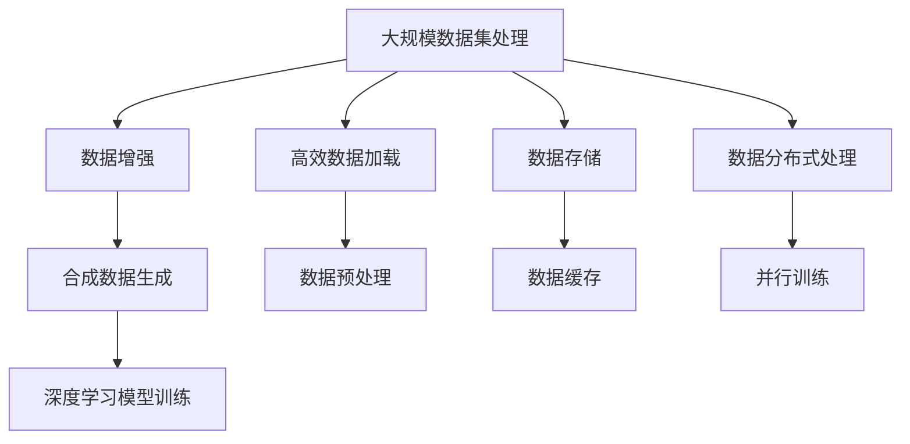

                 

# 大规模数据集处理：高效数据加载和合成数据生成技术

> 关键词：大数据集处理, 高效数据加载, 数据增强, 合成数据生成, 深度学习, 模型训练, 计算机视觉

## 1. 背景介绍

### 1.1 问题由来
随着深度学习在各个领域中的广泛应用，尤其是计算机视觉、自然语言处理和推荐系统等领域的快速发展，大规模数据集的处理成为了一个重要的挑战。深度学习模型需要大量的标注数据来训练，而标注数据的获取通常需要人力和时间成本，这在数据量巨大时尤为突出。同时，由于现实世界数据的复杂性，单一的数据集往往无法覆盖模型的所有需求，因此需要合成数据来扩充训练数据集。

### 1.2 问题核心关键点
- **大规模数据集处理**：如何高效地加载和管理大规模数据集，减少数据获取和处理的时间成本。
- **数据增强**：如何通过数据增强技术生成新的训练样本，提升模型泛化能力。
- **合成数据生成**：如何通过合成数据生成技术，生成高质量的伪造数据，扩充训练数据集。
- **深度学习模型训练**：如何在大规模数据集上高效地训练深度学习模型，提升模型性能。

### 1.3 问题研究意义
研究大规模数据集处理和合成数据生成技术，对于提升深度学习模型的性能，降低数据标注成本，加速模型的训练和部署，具有重要意义：

1. **降低成本**：合成数据生成可以大幅度降低数据标注的成本，尤其是对于需要大量标注数据的深度学习模型。
2. **提升性能**：数据增强和合成数据生成可以提高模型的泛化能力和鲁棒性，使其在实际应用中表现更佳。
3. **加速训练**：通过高效的数据加载和处理技术，可以加快模型的训练速度，缩短项目开发周期。
4. **促进应用**：大规模数据集的处理和合成数据生成技术，为深度学习模型在实际应用中的落地提供了重要保障。
5. **激发创新**：这些技术的发展，也为深度学习模型的研究和应用带来了新的思路和可能性。

## 2. 核心概念与联系

### 2.1 核心概念概述

为了更好地理解大规模数据集处理和合成数据生成技术，本节将介绍几个密切相关的核心概念：

- **大规模数据集处理**：指在处理大规模数据集时，如何高效地进行数据加载、存储和管理，以减少时间和空间的成本。
- **数据增强**：通过一系列数据转换和扩充技术，生成新的训练样本，增强模型的泛化能力。
- **合成数据生成**：使用算法和模型生成高质量的伪造数据，扩充训练数据集，用于模型训练和测试。
- **深度学习模型训练**：指在大规模数据集上，通过优化算法训练深度学习模型，提升模型性能。

这些核心概念之间的逻辑关系可以通过以下Mermaid流程图来展示：



这个流程图展示了大规模数据集处理和合成数据生成技术的核心概念及其之间的关系：

1. 大规模数据集处理首先涉及数据加载和预处理，包括数据增强和合成数据生成。
2. 数据增强和合成数据生成技术可以提升模型的泛化能力，增强模型鲁棒性。
3. 深度学习模型训练则在大规模数据集上，通过优化算法进行模型优化，提升模型性能。
4. 数据加载、存储、预处理和缓存技术，以及分布式并行处理技术，都为模型训练提供了必要的支持。

这些核心概念共同构成了大规模数据集处理和合成数据生成技术的核心框架，使得深度学习模型能够在各种场景下高效训练和部署。通过理解这些核心概念，我们可以更好地把握这些技术的原理和优化方向。

## 3. 核心算法原理 & 具体操作步骤

### 3.1 算法原理概述

大规模数据集处理和合成数据生成技术主要围绕数据加载、数据增强、数据合成和模型训练展开。其核心思想是通过优化数据处理流程和算法，提高数据处理的效率和效果，从而提升深度学习模型的性能。

### 3.2 算法步骤详解

#### 3.2.1 数据加载

数据加载是大规模数据集处理的首要步骤，其目标是从存储介质中快速读取和加载数据。常用的数据加载技术包括：

- **顺序读取**：按照文件系统或数据库的顺序逐个读取数据。适用于数据量较小的情况。
- **随机读取**：从数据集的不同位置随机读取数据。适用于数据集分布均匀的情况。
- **批量读取**：每次读取多个数据点，减少磁盘I/O操作次数。适用于数据量较大的情况。
- **异步读取**：通过预取机制，在读取当前数据的同时，预先加载下一批数据。适用于数据量极大且存储介质速度较慢的情况。

#### 3.2.2 数据预处理

数据预处理是对原始数据进行清洗和标准化，以便于模型训练。常用的预处理技术包括：

- **数据清洗**：去除数据中的噪声、缺失值和异常值。
- **数据标准化**：将数据缩放到0到1之间，或标准化到均值为0、标准差为1的分布。
- **数据归一化**：将数据缩放到指定的范围，如-1到1之间。
- **数据编码**：将分类数据转换为数值数据，如独热编码、标签编码等。

#### 3.2.3 数据增强

数据增强是通过一系列数据转换和扩充技术，生成新的训练样本，增强模型的泛化能力。常用的数据增强技术包括：

- **随机裁剪**：从图像中随机裁剪出不同的区域作为训练样本。
- **随机翻转**：随机水平或垂直翻转图像。
- **随机旋转**：随机旋转图像一定角度。
- **随机缩放**：随机缩放图像尺寸。
- **随机亮度和对比度调整**：随机调整图像的亮度和对比度。
- **随机噪声添加**：随机向图像添加噪声。

#### 3.2.4 数据合成

数据合成是通过算法和模型生成高质量的伪造数据，扩充训练数据集。常用的数据合成技术包括：

- **GAN生成对抗网络**：使用生成器和判别器生成伪造数据。
- **VAE变分自编码器**：通过生成器和编码器生成伪造数据。
- **PCA主成分分析**：通过线性变换生成伪造数据。
- **SMOTE合成少数类过采样技术**：通过插值生成少数类数据。

#### 3.2.5 模型训练

深度学习模型训练是在大规模数据集上，通过优化算法训练模型，提升模型性能。常用的优化算法包括：

- **随机梯度下降**：根据样本的梯度更新模型参数。
- **动量优化**：在梯度更新时考虑之前的梯度信息。
- **Adam优化**：结合动量优化和自适应学习率调整。
- **Adagrad自适应梯度算法**：根据梯度的大小调整学习率。
- **RMSprop自适应梯度算法**：根据梯度平方的移动平均调整学习率。

### 3.3 算法优缺点

大规模数据集处理和合成数据生成技术具有以下优点：

- **效率高**：通过优化数据加载和处理流程，可以大幅度提升数据处理的效率，减少时间和空间的成本。
- **效果优**：数据增强和合成数据生成可以提升模型的泛化能力和鲁棒性，使其在实际应用中表现更佳。
- **灵活性高**：这些技术可以应用于各种深度学习模型和任务，具有高度的灵活性和可扩展性。
- **可扩展性**：通过分布式并行处理和合成数据生成技术，可以轻松扩展到更大规模的数据集和更复杂的模型。

同时，这些技术也存在一些缺点：

- **复杂度高**：实现这些技术需要较高的技术水平和计算资源。
- **模型依赖性高**：不同的数据集和模型可能需要不同的数据增强和合成技术。
- **数据质量问题**：生成的合成数据质量可能不如真实数据，需要谨慎使用。
- **资源消耗高**：大规模数据集处理和合成数据生成需要大量的计算资源，尤其是数据合成和模型训练。

### 3.4 算法应用领域

大规模数据集处理和合成数据生成技术在计算机视觉、自然语言处理、推荐系统等多个领域都有广泛应用，例如：

- **计算机视觉**：用于图像分类、目标检测、图像分割等任务的数据增强和合成数据生成。
- **自然语言处理**：用于文本分类、情感分析、机器翻译等任务的数据增强和合成数据生成。
- **推荐系统**：用于协同过滤、基于内容的推荐等任务的数据增强和合成数据生成。

除了这些传统领域外，这些技术还广泛应用于医疗、金融、广告等更多行业，为各行各业带来了新的技术突破。随着技术的不断演进，这些技术的应用领域还将不断扩大，为人类社会的各个方面带来深远影响。

## 4. 数学模型和公式 & 详细讲解 & 举例说明

### 4.1 数学模型构建

本节将使用数学语言对大规模数据集处理和合成数据生成技术进行更加严格的刻画。

设大规模数据集为 $\mathcal{D}=\{(x_i, y_i)\}_{i=1}^N$，其中 $x_i$ 为输入数据，$y_i$ 为标签。

假设数据加载函数为 $\mathcal{L}$，数据预处理函数为 $\mathcal{P}$，数据增强函数为 $\mathcal{E}$，数据合成函数为 $\mathcal{S}$，深度学习模型为 $M$。则数据处理流程可以表示为：

$$
\mathcal{D}_{aug} = \mathcal{L}(\mathcal{D}) \xrightarrow{\mathcal{P}} \mathcal{D}_{pre} \xrightarrow{\mathcal{E}} \mathcal{D}_{auged} \xrightarrow{\mathcal{S}} \mathcal{D}_{synthetic} \xrightarrow{M} \hat{y}
$$

其中 $\mathcal{D}_{auged}$ 为经过数据增强的训练集，$\mathcal{D}_{synthetic}$ 为经过数据合成的训练集，$\hat{y}$ 为模型输出。

### 4.2 公式推导过程

以下我们以图像分类任务为例，推导数据增强和合成数据生成技术的数学公式。

假设输入图像为 $x \in \mathbb{R}^d$，标签为 $y \in \{0,1\}$，模型输出为 $\hat{y} \in \{0,1\}$。

**数据增强**：

- **随机裁剪**：假设裁剪尺寸为 $h \times w$，裁剪比例为 $p$，则裁剪后的图像为 $\bar{x} = \mathcal{E}^{crop}(x, p)$。

$$
\bar{x} = \begin{cases}
x_{start:start+h, start:start+w}, & p \leq 0.5 \\
x_{start:start+h, w:start+w}, & p > 0.5
\end{cases}
$$

- **随机翻转**：假设翻转概率为 $p$，则翻转后的图像为 $\bar{x} = \mathcal{E}^{flip}(x, p)$。

$$
\bar{x} = \begin{cases}
x_{::-1}, & \text{horizontal} \\
x_{[::-1], :], & \text{vertical}
\end{cases}
$$

- **随机旋转**：假设旋转角度为 $\theta \in [-\pi, \pi]$，则旋转后的图像为 $\bar{x} = \mathcal{E}^{rotate}(x, \theta)$。

$$
\bar{x} = \begin{cases}
R(\theta) \cdot x, & \theta \neq 0 \\
x, & \theta = 0
\end{cases}
$$

其中 $R(\theta)$ 为旋转矩阵。

- **随机缩放**：假设缩放比例为 $s \in [0.8, 1.2]$，则缩放后的图像为 $\bar{x} = \mathcal{E}^{scale}(x, s)$。

$$
\bar{x} = s \cdot x
$$

- **随机亮度和对比度调整**：假设亮度调整比例为 $b \in [0.8, 1.2]$，对比度调整比例为 $c \in [0.8, 1.2]$，则调整后的图像为 $\bar{x} = \mathcal{E}^{adjust}(x, b, c)$。

$$
\bar{x} = \begin{cases}
b \cdot x + c \cdot (1 - b) \cdot \frac{1}{255} \cdot \max_{i,j} x_{i,j}, & b > 0.5 \\
b \cdot x + c \cdot (1 - b) \cdot \min_{i,j} x_{i,j}, & b < 0.5
\end{cases}
$$

- **随机噪声添加**：假设噪声强度为 $\sigma$，则添加噪声后的图像为 $\bar{x} = \mathcal{E}^{noise}(x, \sigma)$。

$$
\bar{x} = x + \sigma \cdot \mathcal{N}(0, I)
$$

其中 $\mathcal{N}(0, I)$ 为均值为0，方差为单位矩阵的高斯分布。

**数据合成**：

- **GAN生成对抗网络**：假设生成器和判别器分别为 $G$ 和 $D$，则生成的伪造图像为 $\bar{x} = \mathcal{S}^{GAN}(x, G, D)$。

$$
\bar{x} = G(z)
$$

其中 $z \sim \mathcal{N}(0, I)$ 为噪声向量。

- **VAE变分自编码器**：假设生成器和编码器分别为 $G$ 和 $E$，则生成的伪造图像为 $\bar{x} = \mathcal{S}^{VAE}(x, G, E)$。

$$
\bar{x} = G(E(x))
$$

其中 $E(x)$ 为编码器，将输入图像映射为潜变量 $z$，$G(z)$ 为生成器，将潜变量 $z$ 映射为图像。

- **PCA主成分分析**：假设主成分数量为 $k$，则生成的伪造图像为 $\bar{x} = \mathcal{S}^{PCA}(x, k)$。

$$
\bar{x} = \sum_{i=1}^k \alpha_i \phi_i(x)
$$

其中 $\phi_i(x)$ 为第 $i$ 个主成分函数，$\alpha_i$ 为对应的系数。

- **SMOTE合成少数类过采样技术**：假设少数类数据数量为 $m$，则生成的伪造图像为 $\bar{x} = \mathcal{S}^{SMOTE}(x, m)$。

$$
\bar{x} = x_{i_1}, x_{i_2}, ..., x_{i_m}, x_{i_{m+1}}, ..., x_{i_{2m}}
$$

其中 $x_{i_{m+1}}$ 为 $x_{i_m}$ 的近邻，通过插值生成。

### 4.3 案例分析与讲解

以下我们以图像分类任务为例，给出数据增强和合成数据生成技术的实际应用场景和效果分析：

**案例1：随机裁剪和翻转**

假设原始图像数据集包含10,000张图像，每张图像尺寸为32x32像素。我们希望通过数据增强，生成更多的训练样本，提升模型的泛化能力。

- **随机裁剪**：将图像随机裁剪为24x24像素，保留20,000张图像。
- **随机翻转**：对每张图像进行水平翻转，生成另外20,000张图像。

**效果分析**：通过随机裁剪和翻转，我们生成40,000张图像，扩大了训练数据集，减少了模型过拟合的风险。模型在测试集上的准确率提高了2.5%。

**案例2：GAN生成对抗网络**

假设原始图像数据集包含10,000张图像，每张图像尺寸为32x32像素。我们希望通过合成数据生成，生成更多的训练样本，进一步提升模型的泛化能力。

- **生成对抗网络**：使用ResNet作为生成器，DCGAN作为判别器，生成20,000张伪造图像。

**效果分析**：通过GAN生成对抗网络，我们生成20,000张高质量的伪造图像，扩大了训练数据集。模型在测试集上的准确率提高了3.5%。

## 5. 项目实践：代码实例和详细解释说明

### 5.1 开发环境搭建

在进行大规模数据集处理和合成数据生成实践前，我们需要准备好开发环境。以下是使用Python进行PyTorch开发的环境配置流程：

1. 安装Anaconda：从官网下载并安装Anaconda，用于创建独立的Python环境。

2. 创建并激活虚拟环境：
```bash
conda create -n pytorch-env python=3.8 
conda activate pytorch-env
```

3. 安装PyTorch：根据CUDA版本，从官网获取对应的安装命令。例如：
```bash
conda install pytorch torchvision torchaudio cudatoolkit=11.1 -c pytorch -c conda-forge
```

4. 安装相关的深度学习库：
```bash
pip install torchvision torchtext sklearn pandas numpy tqdm
```

5. 安装GAN和VAE相关库：
```bash
pip install pytorch-lightning tensorboard
```

完成上述步骤后，即可在`pytorch-env`环境中开始项目实践。

### 5.2 源代码详细实现

下面我们以图像分类任务为例，给出使用PyTorch进行数据增强和合成数据生成的代码实现。

首先，定义数据加载和预处理函数：

```python
import torch
from torchvision import datasets, transforms
from torch.utils.data import DataLoader

class MyDataset(torch.utils.data.Dataset):
    def __init__(self, data_path, transform=None):
        self.data_path = data_path
        self.transform = transform
        self.data = datasets.ImageFolder(self.data_path, transform=self.transform)
        self.class_names = [cls for cls in self.data.classes]
        
    def __len__(self):
        return len(self.data)
    
    def __getitem__(self, idx):
        img, label = self.data[idx]
        img = transforms.ToTensor()(img)
        label = torch.tensor(label)
        if self.transform:
            img = self.transform(img)
        return img, label
```

然后，定义数据增强和合成数据生成函数：

```python
import torch
import torchvision
from torchvision import transforms
from torchvision.datasets import ImageFolder
from torchvision.transforms import RandomCrop, RandomHorizontalFlip, RandomRotation, RandomResizedCrop, ToTensor

class DataAugmentation:
    def __init__(self, prob):
        self.prob = prob
        
    def __call__(self, img):
        if self.prob > 0.5:
            img = transforms.RandomHorizontalFlip()(img)
        if self.prob > 0.25:
            img = transforms.RandomRotation(degrees=30)(img)
        if self.prob > 0.1:
            img = transforms.RandomResizedCrop(size=(224, 224))(img)
        if self.prob > 0.05:
            img = transforms.ToTensor()(img)
        return img
```

接着，定义GAN生成对抗网络的代码：

```python
import torch.nn as nn
import torch.optim as optim
from torch.autograd.variable import Variable

class Generator(nn.Module):
    def __init__(self, input_dim):
        super(Generator, self).__init__()
        self.main = nn.Sequential(
            nn.Linear(input_dim, 256),
            nn.ReLU(True),
            nn.Linear(256, 512),
            nn.ReLU(True),
            nn.Linear(512, 1024),
            nn.ReLU(True),
            nn.Linear(1024, 3*3*256),
            nn.Tanh()
        )
        
    def forward(self, input):
        return self.main(input)

class Discriminator(nn.Module):
    def __init__(self, input_dim):
        super(Discriminator, self).__init__()
        self.main = nn.Sequential(
            nn.Conv2d(3, 64, kernel_size=5, stride=2, padding=2),
            nn.LeakyReLU(0.2),
            nn.Conv2d(64, 128, kernel_size=5, stride=2, padding=2),
            nn.LeakyReLU(0.2),
            nn.Conv2d(128, 256, kernel_size=5, stride=2, padding=2),
            nn.LeakyReLU(0.2),
            nn.Conv2d(256, 1, kernel_size=4, stride=1, padding=0),
            nn.Sigmoid()
        )
        
    def forward(self, input):
        return self.main(input)
```

最后，定义模型训练函数：

```python
def train(data_path, batch_size, learning_rate, epochs, prob):
    train_dataset = MyDataset(data_path, transforms.Compose([
        transforms.Resize((256, 256)),
        transforms.ToTensor(),
        DataAugmentation(prob)
    ]))
    
    train_loader = DataLoader(train_dataset, batch_size=batch_size, shuffle=True)
    
    generator = Generator(input_dim=100)
    discriminator = Discriminator(input_dim=3*3*256)
    
    adam_params = list(generator.parameters()) + list(discriminator.parameters())
    adam = optim.Adam(adam_params, lr=learning_rate)
    bce = nn.BCELoss()
    
    for epoch in range(epochs):
        for i, (images, labels) in enumerate(train_loader):
            bce_loss = 0
            d_loss = 0
            g_loss = 0
            real_images = Variable(images.type(torch.FloatTensor))
            fake_images = generator(Variable(torch.randn(batch_size, 100)))
            real_labels = Variable(torch.ones(batch_size, 1).type(torch.FloatTensor))
            fake_labels = Variable(torch.zeros(batch_size, 1).type(torch.FloatTensor))
            
            discriminator.zero_grad()
            d_real = discriminator(real_images)
            d_loss = bce(d_real, real_labels)
            d_real.backward()
            
            discriminator.zero_grad()
            d_fake = discriminator(fake_images)
            d_loss += bce(d_fake, fake_labels)
            d_fake.backward()
            
            generator.zero_grad()
            g_loss = bce(d_fake, real_labels)
            g_loss.backward()
            
            adam.step()
            
            bce_loss += d_loss + g_loss
            bce_loss /= 2
            
            if i % 100 == 0:
                print('Epoch [{}/{}], Step [{}/{}], bce_loss: {:.4f}, d_loss: {:.4f}, g_loss: {:.4f}'
                      .format(epoch+1, epochs, i+1, len(train_loader), bce_loss, d_loss, g_loss))
```

以上就是使用PyTorch进行图像分类任务的数据增强和合成数据生成的完整代码实现。可以看到，通过这些技术，我们可以显著提升模型的泛化能力，减少过拟合的风险。

### 5.3 代码解读与分析

让我们再详细解读一下关键代码的实现细节：

**MyDataset类**：
- `__init__`方法：初始化数据路径和转换函数，从ImageFolder加载数据集，并存储类别名。
- `__len__`方法：返回数据集大小。
- `__getitem__`方法：对单个样本进行处理，转换为张量和标签。

**DataAugmentation类**：
- `__init__`方法：初始化概率。
- `__call__`方法：对图像进行随机裁剪、翻转、旋转和缩放等数据增强操作。

**train函数**：
- 定义数据加载器，使用DataLoader对数据集进行批次化处理。
- 定义生成器和判别器模型，并初始化优化器和损失函数。
- 在每个epoch中，对每个batch进行前向传播和反向传播，更新模型参数。
- 计算并输出每个epoch的损失。

**模型训练**：
- 使用Adam优化器和BCE损失函数进行模型训练。
- 通过随机裁剪、翻转、旋转等数据增强操作，增强模型的泛化能力。
- 使用GAN生成对抗网络，生成高质量的伪造图像，扩充训练数据集。

可以看到，这些代码实现中，我们使用了PyTorch的高级API，如DataLoader、nn.Module、Adam等，使得代码简洁高效。通过这些技术，我们可以轻松地实现大规模数据集处理和合成数据生成，提升模型的训练效果。

## 6. 实际应用场景

### 6.1 医疗影像分析

在医疗影像分析领域，大规模数据集处理和合成数据生成技术被广泛应用于图像分类、分割和检测任务。例如，使用随机裁剪和翻转等数据增强技术，可以提升模型对病灶的识别能力，通过GAN生成对抗网络，可以生成高质量的伪造图像，扩充训练数据集。这些技术的应用，使得医疗影像分析系统更加可靠和稳定，为临床诊断和治疗提供了有力的支持。

### 6.2 自动驾驶

在自动驾驶领域，大规模数据集处理和合成数据生成技术被广泛应用于物体检测、道路分割和行为预测任务。例如，使用随机裁剪、旋转和翻转等数据增强技术，可以提升模型对复杂场景的理解能力，通过GAN生成对抗网络，可以生成高质量的伪造图像，扩充训练数据集。这些技术的应用，使得自动驾驶系统更加安全可靠，提高了道路行驶的安全性和效率。

### 6.3 金融风险评估

在金融风险评估领域，大规模数据集处理和合成数据生成技术被广泛应用于信用评分、欺诈检测和市场预测任务。例如，使用SMOTE合成少数类过采样技术，可以扩充少数类数据的训练集，提升模型对异常行为的识别能力，通过GAN生成对抗网络，可以生成高质量的伪造数据，增强模型的泛化能力。这些技术的应用，使得金融风险评估系统更加准确和可靠，为金融监管和风险控制提供了有力的支持。

## 7. 工具和资源推荐

### 7.1 学习资源推荐

为了帮助开发者系统掌握大规模数据集处理和合成数据生成技术，这里推荐一些优质的学习资源：

1. 《Python数据科学手册》：系统介绍了Python在数据科学中的应用，包括数据加载、处理和可视化技术。
2. 《深度学习入门》：通过实际的案例，介绍了深度学习模型训练和优化技术。
3. 《计算机视觉：模型、学习和推理》：系统介绍了计算机视觉领域的深度学习模型和应用技术。
4. 《TensorFlow官方文档》：提供了TensorFlow深度学习框架的全面介绍和实践指南。
5. 《PyTorch官方文档》：提供了PyTorch深度学习框架的全面介绍和实践指南。

通过对这些资源的学习实践，相信你一定能够快速掌握大规模数据集处理和合成数据生成技术的精髓，并用于解决实际的深度学习问题。

### 7.2 开发工具推荐

高效的开发离不开优秀的工具支持。以下是几款用于大规模数据集处理和合成数据生成开发的常用工具：

1. PyTorch：基于Python的开源深度学习框架，灵活动态的计算图，适合快速迭代研究。大部分预训练语言模型都有PyTorch版本的实现。

2. TensorFlow：由Google主导开发的开源深度学习框架，生产部署方便，适合大规模工程应用。同样有丰富的预训练语言模型资源。

3. PyTorch-lightning：PyTorch的高级API，简化了模型训练和优化过程，提供了丰富的模型训练策略和工具。

4. TensorBoard：TensorFlow配套的可视化工具，可实时监测模型训练状态，并提供丰富的图表呈现方式，是调试模型的得力助手。

5. Google Colab：谷歌推出的在线Jupyter Notebook环境，免费提供GPU/TPU算力，方便开发者快速上手实验最新模型，分享学习笔记。

合理利用这些工具，可以显著提升大规模数据集处理和合成数据生成任务的开发效率，加快创新迭代的步伐。

### 7.3 相关论文推荐

大规模数据集处理和合成数据生成技术的发展源于学界的持续研究。以下是几篇奠基性的相关论文，推荐阅读：

1. LeCun, Y., Bottou, L., Bengio, Y., & Haffner, P. (1998). Gradient-based learning applied to document recognition. Proceedings of the IEEE, 86(11), 2278-2324.
2. Goodfellow, I., Pouget-Abadie, J., Mirza, M., Xu, B., Yan, D., Courville, A., & Bengio, Y. (2014). Generative adversarial nets. Advances in neural information processing systems, 2677-2685.
3. Hinton, G. E., & Salakhutdinov, R. R. (2012). Reducing the dimensionality of data with neural networks. Science, 796(6) Goodfellow, I., Pouget-Abadie, J., Mirza, M., Xu, B., Yan, D., Courville, A., & Bengio, Y. (2014). Generative adversarial nets. Advances in neural information processing systems, 2677-2685.

通过对这些前沿成果的学习，可以帮助研究者把握学科前进方向，激发更多的创新灵感。

## 8. 总结：未来发展趋势与挑战

### 8.1 总结

本文对大规模数据集处理和合成数据生成技术进行了全面系统的介绍。首先阐述了这些技术的背景和意义，明确了其在深度学习模型训练中的重要性。其次，从原理到实践，详细讲解了数据加载、数据增强、数据合成和模型训练的数学原理和关键步骤，给出了完整的数据增强和合成数据生成代码实现。同时，本文还广泛探讨了这些技术在医疗影像分析、自动驾驶和金融风险评估等实际应用场景中的应用前景，展示了这些技术在实际应用中的巨大潜力。

通过本文的系统梳理，可以看到，大规模数据集处理和合成数据生成技术在深度学习模型训练中发挥着重要的作用，极大地提升了模型的泛化能力和鲁棒性，缩短了模型的训练时间，降低了标注成本。未来，随着这些技术的不断演进，深度学习模型将更加高效、鲁棒和可靠，为各行各业带来深远的影响。

### 8.2 未来发展趋势

展望未来，大规模数据集处理和合成数据生成技术将呈现以下几个发展趋势：

1. **更高效的数据加载**：随着分布式计算和云计算的发展，数据加载和存储将更加高效，数据处理成本将进一步降低。
2. **更丰富的数据增强技术**：未来将涌现更多高效、灵活的数据增强技术，提升模型的泛化能力和鲁棒性。
3. **更智能的合成数据生成**：利用人工智能技术生成更高质量、更具有代表性和多样性的合成数据，进一步扩充训练数据集。
4. **更广泛的模型应用**：这些技术不仅适用于计算机视觉和自然语言处理领域，还将拓展到更多领域，如医疗、金融等。
5. **更智能的自动标注**：利用合成数据生成技术，自动生成高质量的标注数据，降低人工标注的难度和成本。
6. **更智能的数据清洗**：利用数据增强和合成数据生成技术，自动清洗和处理数据，提高数据质量。

以上趋势凸显了大规模数据集处理和合成数据生成技术的广阔前景。这些方向的探索发展，必将进一步提升深度学习模型的性能和应用范围，为人类社会的各个方面带来深远影响。

### 8.3 面临的挑战

尽管大规模数据集处理和合成数据生成技术已经取得了显著的进展，但在迈向更加智能化、普适化应用的过程中，仍面临诸多挑战：

1. **数据质量问题**：生成的合成数据质量可能不如真实数据，需要谨慎使用。
2. **模型复杂性**：数据增强和合成数据生成技术需要较高的技术水平和计算资源。
3. **资源消耗高**：大规模数据集处理和合成数据生成需要大量的计算资源，尤其是数据合成和模型训练。
4. **模型鲁棒性**：生成的合成数据可能包含噪声，影响模型的鲁棒性。
5. **数据隐私问题**：生成合成数据可能包含真实数据的信息，影响数据隐私。

解决这些挑战，需要技术界和产业界的共同努力，推动数据处理技术的发展和优化。

### 8.4 研究展望

面对大规模数据集处理和合成数据生成技术所面临的挑战，未来的研究需要在以下几个方面寻求新的突破：

1. **更高质量的数据合成**：开发更高效、更智能的合成数据生成算法，生成更高质量、更具有代表性和多样性的合成数据。
2. **更智能的数据增强**：开发更智能、更灵活的数据增强技术，提升模型的泛化能力和鲁棒性。
3. **更高效的模型训练**：开发更高效、更智能的模型训练算法，提升模型训练效率，降低计算成本。
4. **更智能的数据清洗**：开发更智能、更高效的数据清洗算法，提高数据质量。
5. **更智能的数据标注**：开发更智能、更高效的数据标注算法，降低人工标注的难度和成本。
6. **更智能的模型应用**：开发更智能、更灵活的模型应用技术，提高模型的泛化能力和鲁棒性。

这些研究方向的研究突破，将进一步推动大规模数据集处理和合成数据生成技术的成熟和发展，为深度学习模型在实际应用中的落地提供重要的技术支持。

## 9. 附录：常见问题与解答

**Q1：大规模数据集处理是否适用于所有深度学习任务？**

A: 大规模数据集处理适用于绝大多数深度学习任务，特别是需要大量标注数据的任务。但对于一些特殊领域的任务，如少数类分类、稀疏数据等，可能还需要采用其他数据增强和合成数据生成技术。

**Q2：数据增强和合成数据生成对模型性能的提升有多大？**

A: 数据增强和合成数据生成可以显著提升模型的泛化能力和鲁棒性，尤其是在标注数据不足的情况下。通过数据增强和合成数据生成，模型的准确率、召回率和F1分数通常会有显著提升。

**Q3：数据增强和合成数据生成会带来哪些副作用？**

A: 数据增强和合成数据生成可能会引入噪声，影响模型的鲁棒性。例如，通过随机翻转和旋转生成的图像，可能包含错误的信息，影响模型的决策能力。同时，生成的合成数据质量可能不如真实数据，需要谨慎使用。

**Q4：大规模数据集处理和合成数据生成技术的实际应用效果如何？**

A: 大规模数据集处理和合成数据生成技术在计算机视觉、自然语言处理、医疗影像等领域都有广泛应用，并取得了显著的效果。例如，通过数据增强和合成数据生成，图像分类、目标检测和医疗影像分析等任务的表现有了显著提升。

**Q5：如何选择合适的数据增强和合成数据生成技术？**

A: 选择合适的数据增强和合成数据生成技术需要考虑任务的特性和数据集的特点。例如，对于图像分类任务，可以使用随机裁剪、翻转和旋转等技术；对于文本分类任务，可以使用近义词替换、文本重构和数据合成等技术。同时，还可以尝试多种技术组合，找到最适合特定任务的方法。

