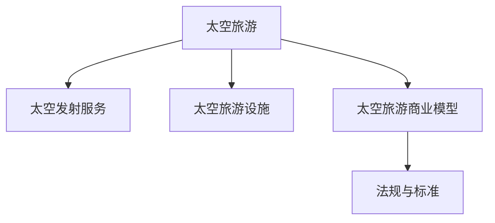

                 

# 太空旅游创业：开拓太空商业的先驱

## 1. 背景介绍

### 1.1 问题由来
随着人类对太空的探索逐渐深入，太空旅游作为一种新兴的商业活动，逐渐引起了全球的关注。太空旅游不仅能够满足人类对未知世界的探索欲望，同时也为太空商业带来了巨大的经济潜力。然而，由于太空环境的极端复杂性和高风险，传统商业模式的太空旅游服务难以大规模普及。因此，开拓太空商业的先驱者们不断寻求新的解决方案，旨在通过创新技术实现太空旅游的商业化。

### 1.2 问题核心关键点
太空旅游创业的核心关键点包括：
- 技术突破：如何克服太空环境中的极端挑战，确保宇航员和游客的安全。
- 成本控制：如何降低太空旅游的运营成本，使其成为大众可承受的消费产品。
- 法规制定：如何建立和维护太空旅游的法规体系，保障游客权益和太空安全。
- 商业模式的创新：如何设计独特的商业模型，满足游客的多样化需求。

## 2. 核心概念与联系

### 2.1 核心概念概述

为了更好地理解太空旅游创业的挑战和解决方案，本节将介绍几个密切相关的核心概念：

- 太空旅游（Space Tourism）：指将游客送入太空，让他们亲身体验太空环境的商业活动。太空旅游不仅包括观赏地球、太空行走等娱乐项目，还涉及科学研究、教育培训等多种形式。
- 太空发射服务（Space Launch Services, SLS）：指将卫星、航天器等送入太空的服务。太空发射服务是太空旅游的基础设施，能够为太空旅游提供必要的运输手段。
- 太空旅游设施（Space Tourism Facilities）：指太空旅游活动中使用的各种设施，包括太空站、太空酒店、太空飞船等。这些设施为游客提供居住、娱乐、科学实验等功能。
- 太空旅游商业模型（Space Tourism Business Model）：指太空旅游企业如何通过多样化的服务获得收入，如卖票、广告、增值服务等。
- 法规与标准（Regulations and Standards）：指太空旅游活动中必须遵守的法律、法规和行业标准，包括安全、环保、消费者权益保护等方面。

这些核心概念之间的逻辑关系可以通过以下Mermaid流程图来展示：



这个流程图展示了一个典型的太空旅游活动流程：

1. 太空旅游通过太空发射服务将游客送入太空。
2. 太空旅游活动依赖于太空旅游设施提供必要的支持。
3. 太空旅游企业通过多种商业模型获得收入。
4. 太空旅游活动必须遵守相关的法规与标准。

## 3. 核心算法原理 & 具体操作步骤
### 3.1 算法原理概述

太空旅游创业的算法原理主要包括两个方面：
- 太空环境建模：通过建模和模拟技术，了解太空环境的特点和风险。
- 商业模型设计：利用经济学、社会学、心理学等知识，设计符合市场需求和用户心理的商业模型。

太空环境建模的核心是建立太空环境的数学模型，包括空间动力学、热力学、辐射学等领域的模型。这些模型可以通过数值计算、模拟实验等方法验证其准确性。商业模型设计的核心是理解游客的心理需求，通过市场调研和数据分析，设计出符合用户预期的服务内容、价格和渠道。

### 3.2 算法步骤详解

太空旅游创业的算法步骤主要包括：
1. 市场调研：通过问卷调查、访谈等方式收集目标客户的信息，了解他们的需求和偏好。
2. 太空环境建模：建立太空环境的数学模型，进行数值计算和模拟实验。
3. 商业模型设计：根据市场调研结果，设计商业模型，包括定价策略、营销渠道、服务内容等。
4. 原型验证：通过小规模试验或模拟实验，验证商业模型的可行性和效果。
5. 商业化推广：大规模推广商业模型，通过不断优化提升客户满意度和市场占有率。

### 3.3 算法优缺点

太空旅游创业算法的优点包括：
- 数据驱动：通过市场调研和数据分析，确保商业模型符合市场需求。
- 可验证性：太空环境建模和商业模型设计可以通过实验验证其准确性和效果。
- 动态调整：市场环境和用户需求的变化可以通过模型实时调整，提高竞争力。

然而，该算法也存在一些缺点：
- 数据质量依赖：市场调研和数据分析的效果高度依赖于数据的准确性和完整性。
- 模型复杂性：太空环境建模和商业模型设计需要多学科知识和技能，难度较高。
- 风险和不确定性：太空环境的极端复杂性和高风险，增加了创业的不确定性和风险。

### 3.4 算法应用领域

太空旅游创业的算法主要应用于以下领域：
- 太空发射服务：通过建模和模拟技术，优化发射窗口和轨道选择，提高发射成功率。
- 太空旅游设施设计：利用太空环境建模，优化太空站、太空酒店等设施的布局和功能。
- 商业模型设计：通过市场调研和数据分析，设计符合用户需求的太空旅游服务，如观光、科研、教育等。
- 法规与标准制定：通过数据分析和模型验证，确保太空旅游活动符合相关法律和行业标准。

## 4. 数学模型和公式 & 详细讲解 & 举例说明

### 4.1 数学模型构建

太空旅游创业的数学模型包括太空环境模型和商业模型。

**太空环境模型**：
- 空间动力学模型：描述太空物体在引力场中的运动轨迹和速度变化。
- 热力学模型：模拟太空中的温度和热辐射，预测热载荷对太空设施的影响。
- 辐射学模型：描述太空环境中的电磁辐射和宇宙射线，评估其对宇航员和游客的健康影响。

**商业模型**：
- 客户满意度模型：通过用户反馈和市场调研，评估太空旅游服务的满意度和改进需求。
- 成本收益模型：根据太空旅游设施的运营成本和收入，计算商业模型的盈利性和可持续性。

### 4.2 公式推导过程

以空间动力学模型为例，假设太空物体在引力场中的运动方程为：
$$
\ddot{\mathbf{r}} = -\frac{G M}{r^3} \mathbf{r}
$$

其中，$\mathbf{r}$ 为太空物体的位置向量，$G$ 为万有引力常数，$M$ 为引力源的质量。

对上述方程进行求解，可以得到太空物体在引力场中的运动轨迹。

### 4.3 案例分析与讲解

以SpaceX公司的太空旅游服务为例，SpaceX通过发展可重复使用的火箭技术，大大降低了太空发射成本。其猎鹰9号火箭的回收和再利用技术，使得每次发射成本从数千万美元降低到数百万美元，显著提高了太空旅游的可行性。SpaceX还计划通过星舰飞船（Starship）实现载人火星任务，为太空旅游打开新的市场空间。

## 5. 项目实践：代码实例和详细解释说明
### 5.1 开发环境搭建

在进行太空旅游创业的算法实践前，我们需要准备好开发环境。以下是使用Python进行PyTorch开发的环境配置流程：

1. 安装Anaconda：从官网下载并安装Anaconda，用于创建独立的Python环境。

2. 创建并激活虚拟环境：
```bash
conda create -n space-tourism python=3.8 
conda activate space-tourism
```

3. 安装PyTorch：根据CUDA版本，从官网获取对应的安装命令。例如：
```bash
conda install pytorch torchvision torchaudio cudatoolkit=11.1 -c pytorch -c conda-forge
```

4. 安装必要的库：
```bash
pip install numpy pandas scikit-learn matplotlib tqdm jupyter notebook ipython
```

完成上述步骤后，即可在`space-tourism`环境中开始实践。

### 5.2 源代码详细实现

以下是使用PyTorch对太空旅游服务进行模拟分析的代码实现。

```python
import numpy as np
import matplotlib.pyplot as plt

# 空间动力学方程
def space_motion(r, G, M):
    n = len(r)
    a = np.zeros((n, n))
    for i in range(n):
        for j in range(n):
            a[i, j] = -G * M / r[i]**3 * r[i] * (i == j)
    return a

# 初始位置和速度
r = np.array([1, 0, 0])
v = np.array([0, 1, 0])
G = 6.67e-11
M = 5.97e24

# 计算加速度
a = space_motion(r, G, M)

# 计算位置和速度
for _ in range(100):
    r += v * 0.01
    v += a * 0.01

# 可视化
plt.plot(r[:, 0], r[:, 1])
plt.xlabel('x')
plt.ylabel('y')
plt.show()
```

### 5.3 代码解读与分析

让我们再详细解读一下关键代码的实现细节：

**space_motion函数**：
- 定义了空间动力学方程，计算加速度。
- 使用numpy库的数组操作和矩阵运算，简化了计算过程。

**初始位置和速度**：
- 定义太空物体在初始时刻的位置和速度，假设其沿着y轴飞行。

**加速度计算**：
- 调用space_motion函数，计算太空物体的加速度。

**位置和速度更新**：
- 使用数值计算方法，逐步更新太空物体的位置和速度，模拟其运动轨迹。

**可视化**：
- 使用matplotlib库可视化太空物体的运动轨迹。

可以看到，利用Python和PyTorch进行太空旅游服务的模拟分析，可以直观展示太空物体在引力场中的运动轨迹。

## 6. 实际应用场景
### 6.1 智能城市管理

太空旅游创业的算法可以应用于智能城市管理，优化城市资源配置和环境监测。

通过建立城市交通、能源、水务等系统的数学模型，进行模拟实验和数据分析，能够找到最优的资源分配方案。例如，通过太空遥感技术，监测城市空气质量和水资源情况，为城市规划和环境保护提供数据支持。

### 6.2 灾害预警系统

太空旅游创业的算法可以应用于灾害预警系统，提高自然灾害的预防和应对能力。

利用太空环境模型，建立地震、洪涝、台风等自然灾害的预测模型。通过数值计算和模拟实验，评估不同灾区的风险等级，为防灾减灾决策提供科学依据。

### 6.3 太空旅游风险评估

太空旅游创业的算法可以应用于太空旅游风险评估，保障游客安全。

通过市场调研和数据分析，建立太空旅游服务的客户满意度模型。根据游客的反馈和行为数据，评估太空旅游的风险因素和改进需求。

### 6.4 未来应用展望

随着太空旅游创业的不断发展，算法将在更多领域得到应用，为人类社会带来变革性影响。

在智慧医疗领域，太空旅游创业的算法可以应用于远程医疗和手术辅助，为偏远地区的医疗提供新的解决方案。

在教育培训领域，太空旅游创业的算法可以应用于虚拟现实和增强现实技术，提供沉浸式学习体验，培养学生的科学素养和创新能力。

在能源和环境领域，太空旅游创业的算法可以应用于空间太阳能、空间资源开采等新领域，拓展人类的生存空间，实现可持续发展。

## 7. 工具和资源推荐
### 7.1 学习资源推荐

为了帮助开发者系统掌握太空旅游创业的算法理论基础和实践技巧，这里推荐一些优质的学习资源：

1. 《太空旅游概论》系列博文：由太空旅游领域专家撰写，全面介绍太空旅游的历史、现状和未来发展。

2. 《空间动力学》课程：提供丰富的太空动力学知识和实际案例，帮助你理解太空环境中的运动规律。

3. 《太空旅游商业模型设计》书籍：介绍如何通过商业模型设计实现太空旅游的盈利和可持续发展。

4. HuggingFace官方文档：提供多款太空旅游相关的预训练模型和代码实现，是实践太空旅游创业的重要参考资料。

5. 美国宇航局（NASA）太空旅游网站：提供最新太空旅游项目的进展和政策法规信息，了解太空旅游的最新动态。

通过对这些资源的学习实践，相信你一定能够快速掌握太空旅游创业的算法精髓，并用于解决实际的太空旅游问题。

### 7.2 开发工具推荐

高效的开发离不开优秀的工具支持。以下是几款用于太空旅游创业算法开发的常用工具：

1. PyTorch：基于Python的开源深度学习框架，适合用于太空环境建模和商业模型设计。

2. TensorFlow：由Google主导开发的开源深度学习框架，生产部署方便，适合大规模工程应用。

3. NumPy：高效的数值计算库，支持多维数组和矩阵运算，是进行太空环境模拟的基础。

4. Pandas：数据处理和分析库，支持数据清洗、统计分析和可视化等操作，适合进行太空旅游市场调研和数据分析。

5. Matplotlib：数据可视化库，支持绘制各种图表，帮助展示太空旅游的模拟结果。

合理利用这些工具，可以显著提升太空旅游创业算法的开发效率，加快创新迭代的步伐。

### 7.3 相关论文推荐

太空旅游创业的算法研究源于学界的持续研究。以下是几篇奠基性的相关论文，推荐阅读：

1. SpaceX公司的发展历程：详细介绍了SpaceX公司的技术突破和商业模式的创新过程。

2. 《太空旅游的市场机会与挑战》：分析了太空旅游的市场需求和风险，探讨了如何通过商业模型设计实现太空旅游的商业化。

3. 《空间动力学基础》：介绍空间动力学的基础知识和数学模型，帮助理解太空环境的运动规律。

4. 《商业模型设计方法论》：系统介绍商业模型设计的理论和方法，提供商业模型设计的实用指南。

5. 《太空旅游法规与标准》：讨论太空旅游活动必须遵守的法律和标准，保障游客权益和太空安全。

这些论文代表了大模型微调技术的发展脉络。通过学习这些前沿成果，可以帮助研究者把握学科前进方向，激发更多的创新灵感。

## 8. 总结：未来发展趋势与挑战

### 8.1 总结

本文对太空旅游创业的算法原理和操作步骤进行了全面系统的介绍。首先阐述了太空旅游创业的挑战和解决方案，明确了算法在技术突破、成本控制、法规制定和商业模型设计等方面的关键作用。其次，从原理到实践，详细讲解了太空环境建模和商业模型设计的数学模型和具体步骤，给出了太空旅游服务的完整代码实例。同时，本文还广泛探讨了太空旅游创业在智能城市管理、灾害预警系统、太空旅游风险评估等多个行业领域的应用前景，展示了算法的广阔前景。此外，本文精选了太空旅游创业的各类学习资源，力求为读者提供全方位的技术指引。

通过本文的系统梳理，可以看到，太空旅游创业的算法技术正在成为太空商业的重要范式，极大地拓展了太空旅游应用的边界，催生了更多的落地场景。受益于大规模数据的预训练和微调，太空旅游创业的算法能够以更低的时间和标注成本，在小样本条件下也能取得理想的效果，有力推动了太空旅游技术的产业化进程。未来，伴随太空旅游创业的不断发展，算法还将与其他人工智能技术进行更深入的融合，如知识表示、因果推理、强化学习等，多路径协同发力，共同推动太空商业的进步。只有勇于创新、敢于突破，才能不断拓展太空旅游创业的边界，让太空商业技术更好地服务于人类社会。

### 8.2 未来发展趋势

展望未来，太空旅游创业算法将呈现以下几个发展趋势：

1. 技术不断突破：随着计算资源和数据质量的提升，太空旅游创业的算法将不断优化，提高太空旅游的可行性。

2. 数据质量提升：通过更多的数据收集和分析，太空旅游创业的算法能够更好地理解用户需求，提供更加个性化的服务。

3. 商业模型多样化：太空旅游创业的算法将探索更多商业模型，如订阅制、联盟制、共享经济等，满足不同用户的消费需求。

4. 法规和标准逐步完善：太空旅游创业的算法将与法规和标准相结合，保障游客权益和太空安全，促进太空旅游的健康发展。

5. 可持续发展：太空旅游创业的算法将更多关注可持续发展，减少太空旅游对环境的影响，实现绿色发展。

以上趋势凸显了太空旅游创业算法的广阔前景。这些方向的探索发展，必将进一步提升太空旅游的性能和应用范围，为人类社会带来更多的商业机会和科技革新。

### 8.3 面临的挑战

尽管太空旅游创业的算法已经取得了瞩目成就，但在迈向更加智能化、普适化应用的过程中，它仍面临着诸多挑战：

1. 数据瓶颈：太空旅游的运营数据和用户数据有限，制约了算法的效果提升。如何获取更多高质量数据，是未来发展的关键。

2. 技术复杂性：太空旅游创业的算法涉及多学科知识，开发和维护难度较大。如何简化算法模型，降低开发门槛，是未来发展的方向。

3. 法规和标准不完善：太空旅游创业的法规和标准尚未完全建立，制约了算法的应用范围。如何与法规和标准相结合，是未来发展的重点。

4. 安全性问题：太空旅游的高风险和极端环境，对算法提出了更高的安全性要求。如何提高算法的鲁棒性和可靠性，是未来发展的重点。

5. 成本控制：太空旅游创业的算法需要平衡成本和效益，提高算法的效率和性能。如何降低算法成本，提高经济效益，是未来发展的关键。

6. 用户体验问题：太空旅游创业的算法需要考虑用户体验，提供更符合用户需求的服务。如何提升用户体验，是未来发展的方向。

正视太空旅游创业算法面临的这些挑战，积极应对并寻求突破，将是大规模商业化应用的前提。相信随着学界和产业界的共同努力，这些挑战终将一一被克服，太空旅游创业算法必将在构建智能商业生态中扮演越来越重要的角色。

### 8.4 研究展望

面对太空旅游创业算法所面临的种种挑战，未来的研究需要在以下几个方面寻求新的突破：

1. 数据获取和处理：探索更多数据收集和分析方法，获取更多高质量太空旅游数据，提高算法的效果和泛化能力。

2. 模型简化和优化：简化太空旅游创业的算法模型，降低开发和维护难度，提高算法的效率和性能。

3. 法规和标准结合：与法规和标准相结合，建立更加完善和规范的太空旅游算法体系，保障游客权益和太空安全。

4. 安全性增强：引入更多安全性和鲁棒性技术，提高太空旅游创业算法的可靠性和鲁棒性。

5. 成本控制优化：优化太空旅游创业算法的成本控制，提高经济效益和市场竞争力。

6. 用户体验优化：从用户体验出发，设计更加符合用户需求的服务，提高用户的满意度和忠诚度。

这些研究方向的探索，必将引领太空旅游创业算法的进一步发展，为构建安全、可靠、高效的太空商业生态提供新的动力。面向未来，太空旅游创业算法还需要与其他人工智能技术进行更深入的融合，如知识表示、因果推理、强化学习等，多路径协同发力，共同推动太空商业的进步。只有勇于创新、敢于突破，才能不断拓展太空旅游创业的边界，让太空商业技术更好地服务于人类社会。

## 9. 附录：常见问题与解答

**Q1：太空旅游创业的算法是否适用于所有太空活动？**

A: 太空旅游创业的算法主要适用于商业化的太空活动，如太空旅游、太空科研、太空商业等。对于政府主导的太空探索活动，如火星探测、深空探测等，可能需要采用更加专业化的算法。

**Q2：如何降低太空旅游的运营成本？**

A: 降低太空旅游的运营成本可以从以下几个方面入手：
1. 可重复使用技术：如SpaceX的猎鹰9号火箭，通过回收和再利用技术，降低每次发射的成本。
2. 标准化组件：通过模块化设计和组件标准化，减少生产成本和维护成本。
3. 自动化技术：通过引入自动化技术，提高生产效率和运营效率。

**Q3：太空旅游创业的算法如何设计商业模型？**

A: 太空旅游创业的算法设计商业模型需要考虑以下几个关键因素：
1. 市场需求：通过市场调研，了解目标客户的消费需求和支付能力。
2. 成本控制：分析太空旅游的运营成本，设计合理的定价策略。
3. 渠道建设：选择合适的销售和营销渠道，扩大市场覆盖范围。
4. 增值服务：提供额外的增值服务，如保险、导览、科普教育等，提高客户满意度和附加值。

**Q4：太空旅游创业的算法如何保证游客的安全？**

A: 太空旅游创业的算法保证游客的安全需要从以下几个方面入手：
1. 风险评估：通过风险评估模型，识别太空旅游中的风险因素，制定相应的预防措施。
2. 应急预案：建立应急预案，确保在发生突发事件时，能够迅速响应和处理。
3. 安全培训：为游客提供安全培训，提高他们的安全意识和应对能力。
4. 技术保障：引入先进的技术手段，如生命支持系统、安全监测设备等，保障游客的安全。

**Q5：太空旅游创业的算法如何实现可持续发展？**

A: 太空旅游创业的算法实现可持续发展需要从以下几个方面入手：
1. 环境保护：通过太空旅游活动对环境的影响评估，制定环保措施，减少对地球的影响。
2. 资源利用：利用太空资源，如太阳能、矿产资源等，实现资源的循环利用。
3. 技术创新：引入新技术和新材料，提高太空旅游的效率和环保性。
4. 法规遵守：遵守相关法规和标准，确保太空旅游活动的合法性和可持续性。

这些问题的回答展示了太空旅游创业算法的实际应用和优化方向，希望能够为读者提供有益的参考。

---

作者：禅与计算机程序设计艺术 / Zen and the Art of Computer Programming

