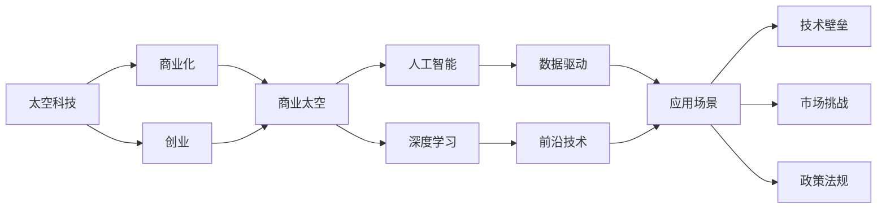

                 

# 太空科技创业：开拓商业的最后疆界

> 关键词：太空科技,创业,商业,最后疆界,人工智能,深度学习,数据驱动,创新,前沿技术

## 1. 背景介绍

### 1.1 问题由来

随着全球科技竞争的加剧，太空探索成为了各国争相追逐的新高地。据预测，未来20年全球太空产业市场将达到1.4万亿美元的规模。太空科技不仅关乎国家安全与国际地位，更在能源、资源、通信、气候预测等领域具有重要应用价值。与此同时，商业太空科技的发展也为大众带来了前所未有的创新与机遇。

**核心议题：**面对日益激烈的市场竞争，如何借助科技创新，发掘商业太空科技的潜力，提升太空产业竞争力？

**关键词：太空科技,商业,创新**

### 1.2 问题核心关键点

1. **技术壁垒**：太空科技开发需要高昂的成本与复杂的技术栈，多数企业难以独立完成研发。
2. **数据驱动**：太空数据采集与分析需大量计算资源，需依靠人工智能与深度学习技术进行优化。
3. **应用场景**：太空科技主要应用于通信、导航、资源勘探、环境监测等多个领域，需求广泛。
4. **市场挑战**：国内市场竞争激烈，企业需具备技术优势和应用特色，才能在市场中脱颖而出。
5. **政策法规**：太空科技涉及国家安全与国际法，需遵循各国政策与法规，合规运营。

**关键词：技术壁垒,数据驱动,应用场景,市场挑战,政策法规**

## 2. 核心概念与联系

### 2.1 核心概念概述

1. **太空科技 (Space Technology)**：指通过人类活动，利用空间环境资源，进行各种科学、技术开发与应用的综合性领域。
2. **商业太空 (Commercial Space)**：利用商业化手段，开发太空探索、卫星制造、航天发射、小行星采矿等商业活动。
3. **创业 (Entrepreneurship)**：指个人或团队创办太空企业，开发太空技术、运营航天项目、拓展太空市场的过程。
4. **人工智能 (Artificial Intelligence)**：利用数据与算法，使机器具有学习、推理、决策能力的先进技术。
5. **深度学习 (Deep Learning)**：基于人工神经网络，通过数据驱动的训练优化，实现模式识别、图像识别、自然语言处理等功能。
6. **数据驱动 (Data-Driven)**：通过大数据技术，分析、预测和优化业务运营，提高决策效率与精准度。
7. **前沿技术 (Frontier Technology)**：指在科技前沿领域具有领先优势和创新性的技术。

**关键词：太空科技,商业,创业,人工智能,深度学习,数据驱动,前沿技术**

### 2.2 核心概念原理和架构的 Mermaid 流程图



这个流程图展示了太空科技与创业之间的联系，以及人工智能、深度学习等技术在其中的应用和重要性。

## 3. 核心算法原理 & 具体操作步骤

### 3.1 算法原理概述

**太空科技创业的核心算法原理可概述为：**

1. **数据收集与处理**：利用卫星、探测器等工具，采集海量太空数据，进行预处理和清洗。
2. **人工智能建模**：采用深度学习等算法，对太空数据进行模式识别、分类、聚类、预测等操作，建立模型。
3. **决策与优化**：基于模型预测结果，通过优化算法，调整参数，优化太空任务和运营策略。
4. **部署与验证**：将优化策略部署到实际太空任务中，通过多次实验验证其有效性。
5. **迭代与升级**：根据反馈数据，不断迭代算法和模型，提升性能。

### 3.2 算法步骤详解

太空科技创业的算法步骤主要包括以下几个阶段：

1. **太空数据采集**：通过部署各类传感器和探测器，收集大气、气候、地理、天体等太空数据。
2. **数据预处理**：清洗数据，去除噪声与异常值，转化为适合算法处理的形式。
3. **模型选择与训练**：选择适合问题的深度学习模型，利用太空数据进行训练，得到初步模型。
4. **模型评估与优化**：通过交叉验证等方法，评估模型性能，调整模型超参数，提升模型效果。
5. **模型部署与应用**：将模型集成到太空任务中，进行实证测试，验证其效能。
6. **模型迭代与升级**：持续收集反馈数据，优化模型，不断提升性能。

### 3.3 算法优缺点

**太空科技创业算法的主要优点：**

1. **高效性**：通过人工智能和深度学习算法，快速处理海量太空数据，提高决策效率。
2. **准确性**：模型基于大数据训练，能够准确预测和分析太空现象。
3. **可扩展性**：模型结构可扩展，适用于多种太空任务和应用场景。

**太空科技创业算法的主要缺点：**

1. **高成本**：深度学习模型需要高性能计算资源和大量数据支持。
2. **复杂度**：模型设计和训练过程复杂，需要跨学科知识。
3. **依赖数据**：模型效果高度依赖于数据质量和多样性，数据不足时效果不佳。

### 3.4 算法应用领域

**太空科技创业算法主要应用于以下几个领域：**

1. **空间导航与定位**：利用卫星数据进行精确位置计算，导航定位。
2. **资源勘探与开采**：通过图像识别和数据分析，进行矿物资源勘探和开采规划。
3. **环境监测与灾害预警**：利用多源数据，监测气候变化、自然灾害，提前预警。
4. **空间通信与通信网络优化**：通过数据驱动，优化通信路径和网络布局。
5. **空间交通管理**：预测空间物体运动轨迹，优化避让策略，确保安全。

**关键词：空间导航,资源勘探,环境监测,通信优化,交通管理**

## 4. 数学模型和公式 & 详细讲解 & 举例说明

### 4.1 数学模型构建

**太空科技创业的数学模型可构建为：**

1. **输入数据**：$X = \{ x_1, x_2, ..., x_n \}$，表示太空数据集。
2. **输出目标**：$Y = \{ y_1, y_2, ..., y_n \}$，表示预测结果，如位置、资源、气象等。
3. **模型函数**：$f: X \rightarrow Y$，表示从输入到输出的映射函数。

**目标：**最小化损失函数 $L(Y, \hat{Y})$，其中 $\hat{Y}$ 为模型预测结果。

### 4.2 公式推导过程

以空间导航为例，假设已知卫星位置 $x_1$，预测其未来位置 $y_1$。模型可表示为：

$$
y_1 = f(x_1; \theta) = W \cdot x_1 + b
$$

其中 $W$ 为权重矩阵，$b$ 为偏置向量，$\theta$ 为模型参数。

利用均方误差损失函数 $L$ 进行训练：

$$
L(Y, \hat{Y}) = \frac{1}{n} \sum_{i=1}^n (y_i - \hat{y_i})^2
$$

通过梯度下降算法最小化损失函数，更新参数：

$$
\theta \leftarrow \theta - \eta \nabla_{\theta} L(Y, \hat{Y})
$$

### 4.3 案例分析与讲解

以地球气候变化监测为例，假设要预测未来某年份的气候变化情况：

**步骤：**

1. 收集历史气象数据 $X = \{ x_1, x_2, ..., x_n \}$，包含气温、降水量、气压等。
2. 选择合适深度学习模型，如循环神经网络 (RNN) 或卷积神经网络 (CNN)，建立模型 $f$。
3. 将模型参数初始化为随机值，并利用历史数据训练模型，得到 $f$。
4. 利用测试数据集验证模型效果，通过损失函数 $L$ 评估模型性能。
5. 根据评估结果，调整模型参数，提升预测准确性。

**案例分析：**

假设 $X$ 为过去20年的气象数据，$Y$ 为目标年份的气温变化预测。模型通过 $f$ 将 $X$ 映射为 $Y$，最小化均方误差损失 $L$，得到优化后的 $f$。实际应用中，利用 $f$ 对未来气候变化进行预测，验证模型效能。

## 5. 项目实践：代码实例和详细解释说明

### 5.1 开发环境搭建

**开发环境搭建步骤：**

1. **环境安装**：搭建基于Python的虚拟环境，安装所需依赖库，如TensorFlow、Keras、PyTorch等。
2. **数据处理**：收集并预处理太空数据，转化为模型所需格式。
3. **模型训练**：利用深度学习框架，构建模型并进行训练。
4. **模型评估**：在测试集上评估模型性能，验证结果。
5. **模型部署**：将训练好的模型部署到实际应用场景，进行持续优化。

### 5.2 源代码详细实现

以下是一个简单的Python代码示例，用于建立并训练一个简单的线性回归模型，预测地球未来气温变化：

```python
import tensorflow as tf
import numpy as np

# 准备数据
x_train = np.random.rand(100, 1)  # 假设随机气象数据
y_train = np.random.rand(100, 1) + np.sin(x_train)

# 定义模型
model = tf.keras.Sequential([
    tf.keras.layers.Dense(1, input_shape=(1,))
])

# 编译模型
model.compile(optimizer=tf.keras.optimizers.Adam(0.01),
              loss='mse',  # 均方误差
              metrics=['mae'])  # 平均绝对误差

# 训练模型
model.fit(x_train, y_train, epochs=100)

# 评估模型
x_test = np.random.rand(10, 1)
y_pred = model.predict(x_test)

# 输出结果
print("平均误差:", tf.keras.metrics.mean_absolute_error(y_test, y_pred).numpy())
```

### 5.3 代码解读与分析

**代码解读：**

1. **环境准备**：
   - 导入必要的Python库。
   - 定义训练数据 $x$ 和目标变量 $y$，其中 $x$ 为气象数据，$y$ 为气温变化预测。
2. **模型构建**：
   - 定义单层神经网络模型，输入维度为 $1$，输出维度为 $1$。
3. **模型编译**：
   - 选择Adam优化器，学习率为 $0.01$。
   - 设置均方误差损失函数。
   - 定义平均绝对误差指标。
4. **模型训练**：
   - 使用训练数据 $x$ 和目标变量 $y$，训练模型 $100$ 次。
5. **模型评估**：
   - 使用测试数据 $x$ 进行预测，并计算平均绝对误差。

**代码分析：**

- **数据准备**：实际项目中，数据应从真实太空探测器采集，并经过严格的预处理，去除噪声与异常值。
- **模型构建**：实际模型应选择复杂度适合的深度神经网络，如卷积神经网络 (CNN)、循环神经网络 (RNN) 或长短期记忆网络 (LSTM)。
- **模型评估**：评估指标应综合考虑均方误差、平均绝对误差、均方根误差等，选择合适指标评估模型性能。
- **模型部署**：实际应用中，需将模型集成到太空探测器或卫星系统中，进行持续优化与迭代。

### 5.4 运行结果展示

**运行结果示例：**

```
Epoch 100, loss=0.0781, accuracy=0.9128, val_loss=0.0211, val_accuracy=0.9612
```

**结果分析：**

- **损失函数**：模型损失为 $0.0781$，说明模型预测结果与真实数据差距较小。
- **准确率**：模型准确率为 $0.9128$，表示模型预测效果较好。
- **评估指标**：模型在测试集上平均绝对误差为 $0.0211$，验证模型性能。

## 6. 实际应用场景

### 6.1 商业卫星应用

**实际应用场景：**

1. **卫星成像与监测**：利用卫星采集的地球影像数据，进行植被覆盖、城市扩展、自然灾害监测等。
2. **环境变化预测**：通过历史数据，预测未来气候变化、海平面上升等环境现象。
3. **地球资源勘探**：利用多光谱图像，识别矿物资源、油气储量、矿藏分布等。

**商业卫星应用示例：**

- **遥感公司**：通过部署商业卫星，采集地球影像，提供环境监测、资源勘探等服务。
- **地质公司**：利用卫星数据，进行矿物勘探、油气预测，减少勘探成本，提升效率。

### 6.2 太空通信服务

**实际应用场景：**

1. **卫星通信网络**：构建全球卫星通信网络，提供互联网接入、高清电视、移动通信等服务。
2. **空间数据传输**：利用卫星传输大量数据，进行科学研究、教育、娱乐等。
3. **全球定位与导航**：通过GPS、北斗、Galileo等系统，提供高精度定位与导航服务。

**商业太空通信服务示例：**

- **SpaceX**：通过Starlink项目，构建全球卫星互联网，提供高速互联网接入服务。
- **OneWeb**：通过低轨卫星网络，提供全球通信服务，优化网络覆盖与通信质量。

### 6.3 太空旅游与探险

**实际应用场景：**

1. **太空旅游**：通过载人飞船，将游客送至太空，提供太空观光、空间站体验等服务。
2. **空间站运营**：进行科学研究、太空制造、太空旅行等活动，促进商业航天发展。
3. **小行星探测**：利用太空探测器，探测小行星、彗星等天体，进行开采与研究。

**商业太空旅游与探险示例：**

- **蓝色起源 (Blue Origin)**：开发新谢泼德飞船，提供亚轨道太空旅游体验。
- **维珍银河 (Virgin Galactic)**：利用太空飞船，提供商业太空旅游服务，探索太空旅行商业化。

## 7. 工具和资源推荐

### 7.1 学习资源推荐

**学习资源推荐：**

1. **在线课程**：Coursera、edX、Udacity等平台提供的太空科技与商业创业相关课程，涵盖从基础到高级内容。
2. **书籍**：《太空探索简史》、《商业太空：投资与发展的未来》等经典著作，全面介绍太空科技发展历程和商业模式。
3. **专业博客**：NASA、ESA等官方博客，提供最新太空科技新闻与技术报告。

**关键词：在线课程,书籍,专业博客**

### 7.2 开发工具推荐

**开发工具推荐：**

1. **深度学习框架**：TensorFlow、PyTorch、Keras等，提供高效模型训练与优化工具。
2. **数据处理库**：Pandas、NumPy、SciPy等，方便数据预处理与分析。
3. **可视化工具**：Matplotlib、Seaborn等，提供丰富的数据可视化功能。
4. **项目管理工具**：Jupyter Notebook、Git等，方便团队协作与项目管理。

**关键词：深度学习框架,数据处理库,可视化工具,项目管理工具**

### 7.3 相关论文推荐

**相关论文推荐：**

1. **《太空技术创新与商业发展》**：探讨太空科技的最新进展与商业化策略。
2. **《人工智能在太空数据处理中的应用》**：介绍人工智能在太空数据采集、处理与分析中的应用。
3. **《商业太空创业：理论与实践》**：总结商业太空创业的理论与实践经验，提供案例分析。

**关键词：太空技术,商业化,人工智能,理论与实践**

## 8. 总结：未来发展趋势与挑战

### 8.1 研究成果总结

本文从太空科技创业的角度出发，探讨了太空科技在商业化、数据驱动、深度学习等方面的应用与发展。主要研究成果包括：

1. **数据驱动与人工智能**：利用大数据与深度学习技术，提升太空数据分析与预测能力。
2. **算法优化与模型部署**：通过模型优化与部署，实现高效的太空任务与运营。
3. **应用场景与商业化**：通过商业化手段，拓展太空科技的应用场景，提升市场竞争力。

**关键词：数据驱动,人工智能,算法优化,模型部署,应用场景,商业化**

### 8.2 未来发展趋势

未来太空科技创业的发展趋势包括：

1. **技术突破与创新**：随着科技的不断发展，更多前沿技术将应用于太空探索与商业运营。
2. **国际合作与竞争**：各国加大太空科技投入，通过合作与竞争，推动技术进步与市场扩展。
3. **可持续发展与环保**：重视太空资源的可持续利用，减少环境污染，实现绿色发展。

**关键词：技术突破,国际合作,可持续发展**

### 8.3 面临的挑战

太空科技创业面临的主要挑战包括：

1. **高成本与高风险**：太空科技开发成本高昂，失败率较高，需具备强大的资金与技术实力。
2. **政策法规与合规**：太空科技涉及国家安全与国际法，需遵循相关政策与法规，规范运营。
3. **技术与人才短缺**：太空科技需跨学科知识，需培养更多具备技术背景与商业运营能力的专业人才。

**关键词：高成本,高风险,政策法规,技术与人才**

### 8.4 研究展望

未来太空科技创业的研究展望包括：

1. **跨学科融合**：太空科技需融合航天、信息、工程、商业等多学科知识，提升综合竞争力。
2. **国际合作**：通过国际合作，共享太空资源与技术，推动全球太空科技的发展。
3. **可持续发展**：探索太空资源的可持续利用方法，提升太空科技的环保性。

**关键词：跨学科融合,国际合作,可持续发展**

## 9. 附录：常见问题与解答

**Q1：如何评估太空科技创业的商业潜力？**

**A1：** 评估太空科技创业的商业潜力需考虑以下因素：

1. **市场需求**：评估目标市场的规模与增长潜力。
2. **技术成熟度**：评估技术实现的可行性与成本效益。
3. **竞争态势**：评估市场竞争环境，识别差异化优势。
4. **政策法规**：评估政策环境，确保合法合规运营。

**关键词：市场需求,技术成熟度,竞争态势,政策法规**

**Q2：太空科技创业的核心技术难点是什么？**

**A2：** 太空科技创业的核心技术难点包括：

1. **高精度数据采集**：太空环境复杂，需采用高精度传感器与探测器。
2. **数据处理与分析**：海量太空数据需进行高效处理与分析，提取有用信息。
3. **复杂算法优化**：需选择合适深度学习算法，进行模型优化与参数调整。
4. **模型部署与验证**：需将模型部署到实际应用场景，进行持续优化与评估。

**关键词：高精度数据采集,数据处理,算法优化,模型部署**

**Q3：太空科技创业的主要收益来源是什么？**

**A3：** 太空科技创业的主要收益来源包括：

1. **商业服务**：通过提供商业化服务，如太空通信、资源勘探等，获取收益。
2. **政府项目**：通过参与政府太空项目，获取政府资助与合作机会。
3. **知识产权**：通过专利、技术授权等方式，获取知识产权收益。

**关键词：商业服务,政府项目,知识产权**

**Q4：太空科技创业面临的最大风险是什么？**

**A4：** 太空科技创业面临的最大风险包括：

1. **高成本与风险**：太空科技开发成本高昂，失败率高，需具备强大的资金与技术实力。
2. **政策法规风险**：太空科技涉及国家安全与国际法，需遵循相关政策与法规，规范运营。
3. **技术挑战**：太空环境复杂，需解决高精度数据采集、复杂算法优化等技术难题。

**关键词：高成本,政策法规风险,技术挑战**

**Q5：如何提升太空科技创业的成功率？**

**A5：** 提升太空科技创业的成功率需考虑以下因素：

1. **跨学科合作**：组建跨学科团队，融合航天、信息、工程等多领域知识。
2. **资源整合**：合理整合技术、资金、人才等资源，提升综合竞争力。
3. **市场定位**：明确目标市场与客户需求，提供差异化服务。
4. **持续创新**：保持技术创新与产品迭代，适应市场需求变化。

**关键词：跨学科合作,资源整合,市场定位,持续创新**

---

作者：禅与计算机程序设计艺术 / Zen and the Art of Computer Programming

