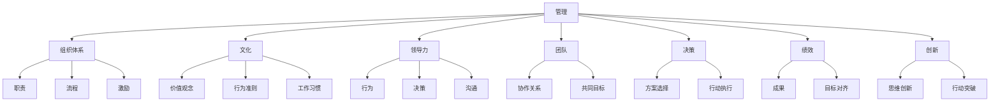
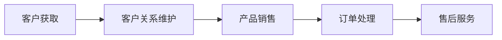
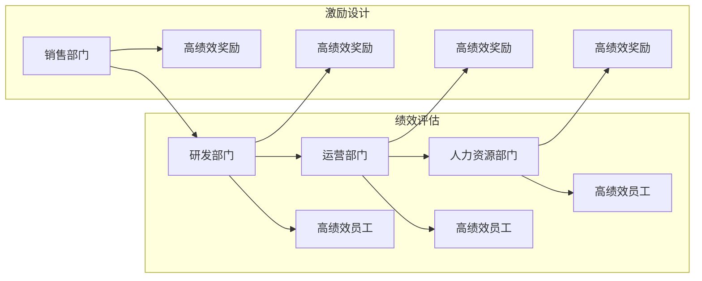

                 

# 好的管理者和普通管理者的差距：体系的重要性

> 关键词：管理，组织，体系，文化，领导力，团队，决策，绩效，创新，可持续发展

## 1. 背景介绍

### 1.1 问题由来

管理，在企业运营中扮演着至关重要的角色。一个好的管理者，能够通过高效的组织、协调和决策，推动企业快速增长；而一个普通的管理者，则可能陷入事倍功半、目标不明确的困境。那么，好与普通管理者之间究竟有何差距？又是什么导致了这种差距的产生？本文旨在探讨这些关键问题，从组织体系的重要性出发，阐述管理的核心理念和方法。

### 1.2 问题核心关键点

管理者的好坏，关键在于其能否构建一个行之有效的体系，来指导和激励团队，实现组织的战略目标。一个高效的体系不仅能够明确职责，优化流程，还能激发员工的创造力和积极性。

- 明确职责：通过体系设计，合理分配工作任务，让每个员工明确自己的职责和目标。
- 优化流程：通过体系改进，消除冗余和低效环节，提升整体运作效率。
- 激发潜力：通过体系建设，营造良好的企业文化，鼓励创新和自我提升。
- 提升绩效：通过体系落实，实现目标的精准对齐和执行力的集中。

本文将从这几个方面入手，深入分析管理的体系要素，并给出具体的实践建议。

## 2. 核心概念与联系

### 2.1 核心概念概述

为更好地理解管理者与组织体系的关系，本节将介绍几个关键概念：

- 管理：通过对资源的有效组织和利用，实现组织目标的过程。
- 组织体系：企业内部管理的结构框架，包括职责分工、流程控制、激励机制等。
- 文化：组织成员共同遵守的价值观念、行为准则和工作习惯，是组织体系的核心。
- 领导力：管理者通过行为、决策和沟通，影响和激励团队的能力。
- 团队：具有共同目标和协作关系的一组人，是体系落实的基石。
- 决策：在信息不完全情况下，管理者选择行动方案的过程，是体系执行的关键。
- 绩效：组织或个人在一定时期内实现目标的成果，是体系落地的最终衡量标准。
- 创新：通过新的思维和行动，带来突破和变革，是体系可持续发展的动力。

这些核心概念之间相互联系，形成一个有机整体，共同影响组织的运作和发展。以下是一个Mermaid流程图，展示了它们之间的联系：



这个流程图展示了核心概念之间的逻辑关系，明确了体系构建在管理中的关键作用。

## 3. 核心算法原理 & 具体操作步骤
### 3.1 算法原理概述

基于体系的重要性，管理者在构建管理团队时，需要遵循以下几个基本原则：

- **明确职责**：每个员工应清楚自己的工作范围和责任，避免职责交叉和职责空白。
- **优化流程**：流程应简洁高效，消除冗余环节，提升整体运作效率。
- **激励机制**：通过合理的激励措施，激发员工的积极性和创造力。
- **目标对齐**：确保团队的目标与组织的战略目标一致，提升整体绩效。

### 3.2 算法步骤详解

基于上述原则，管理者可以采取以下步骤来构建高效的管理体系：

1. **需求分析**：通过调研和访谈，了解组织的业务需求和目标，明确管理的重点和难点。
2. **体系设计**：根据需求分析结果，设计职责分工、流程控制和激励机制，构建初步的体系框架。
3. **文化塑造**：通过组织活动和培训，强化企业文化，让员工认同并遵守共同的价值观和行为准则。
4. **领导力提升**：通过培训和实践，提升管理者的领导能力，使之能够有效激励和指导团队。
5. **团队建设**：通过招聘和培养，组建一支高效协作的团队，确保每个成员都能发挥最大潜力。
6. **体系落实**：通过执行和监控，确保体系的各项措施得到有效实施，实现组织目标。
7. **绩效评估**：通过定期的绩效考核，评估体系的效果，并根据反馈进行调整和优化。
8. **持续改进**：根据环境变化和内部反馈，不断改进和优化管理体系，保持组织的持续发展。

### 3.3 算法优缺点

基于体系的重要性，构建管理系统的优势在于：

- **系统化管理**：通过明确职责、优化流程和激励机制，确保管理体系的系统性和可执行性。
- **提升效率**：通过消除冗余环节和优化流程，提升整体运作效率。
- **增强凝聚力**：通过塑造企业文化和提升领导力，增强团队的凝聚力和执行力。
- **促进创新**：通过合理的激励机制和目标对齐，激发员工的创造力和创新精神。

同时，体系构建也存在以下局限：

- **实施难度大**：体系设计复杂，实施过程中需要多方协调，难度较大。
- **成本高**：体系建设需要投入大量时间和资源，对中小企业来说成本较高。
- **灵活性不足**：体系一旦形成，难以快速应对环境变化，灵活性不足。
- **依赖管理者**：体系的有效实施依赖于管理者的能力和执行力，存在一定的风险。

### 3.4 算法应用领域

基于体系的重要性，管理体系在多个领域都有广泛应用：

- **企业运营**：通过明确职责、优化流程和激励机制，提升企业运营效率。
- **项目管理**：通过制定项目流程、明确角色和责任，确保项目按时按质完成。
- **人力资源管理**：通过优化招聘流程、设计薪酬体系和激励机制，提升员工满意度和忠诚度。
- **供应链管理**：通过优化供应链流程、加强供应商管理，提升供应链的响应速度和效率。
- **研发管理**：通过明确研发流程、激励创新和团队合作，提升研发效率和产品质量。
- **销售管理**：通过制定销售流程、明确销售目标和激励机制，提升销售团队的绩效和客户满意度。

## 4. 数学模型和公式 & 详细讲解  
### 4.1 数学模型构建

为了更好地分析管理体系的运行效果，我们引入几个关键数学模型：

- **职责矩阵**：通过矩阵形式描述员工间的职责关系，确保职责明确、无交叉。
- **流程模型**：使用流程图或状态机描述流程各环节的关系，消除冗余和瓶颈。
- **激励模型**：建立激励机制的数学模型，评估激励效果和公平性。
- **绩效模型**：通过KPI和OKR等指标，评估团队和个人的绩效表现。
- **创新模型**：通过创新激励和知识分享机制，评估团队的创新效果。

### 4.2 公式推导过程

以下我们将简要推导几个关键数学模型的公式。

**职责矩阵**：

假设一个企业有n个员工，m个职责，则职责矩阵A可以表示为：

$$
A = \begin{pmatrix}
a_{11} & a_{12} & \cdots & a_{1m} \\
a_{21} & a_{22} & \cdots & a_{2m} \\
\vdots & \vdots & \ddots & \vdots \\
a_{n1} & a_{n2} & \cdots & a_{nm}
\end{pmatrix}
$$

其中，$a_{ij}$表示第i个员工是否承担第j项职责，取值0或1。

**流程模型**：

流程模型可以使用有向无环图(DAG)来描述，其中每个节点表示一个步骤，有向边表示流程的执行顺序。假设有n个节点，则流程模型G可以表示为：

$$
G = (V,E)
$$

其中，$V$为节点集合，$E$为边集合。

**激励模型**：

假设激励模型中，每个员工i可以得到奖励r_i，则激励模型可以表示为：

$$
\text{Reward} = \sum_{i=1}^n r_i
$$

其中，$r_i$为第i个员工的奖励值，可以通过绩效评估和员工满意度调查来确定。

**绩效模型**：

绩效模型中，我们使用KPI和OKR等指标来评估团队和个人绩效。假设有n个团队成员，m个KPI指标，则绩效矩阵P可以表示为：

$$
P = \begin{pmatrix}
p_{11} & p_{12} & \cdots & p_{1m} \\
p_{21} & p_{22} & \cdots & p_{2m} \\
\vdots & \vdots & \ddots & \vdots \\
p_{n1} & p_{n2} & \cdots & p_{nm}
\end{pmatrix}
$$

其中，$p_{ij}$表示第i个成员在第j个KPI指标上的得分。

**创新模型**：

创新模型中，我们使用专利申请数量、新产品推出速度等指标来评估团队创新效果。假设有n个团队成员，则创新矩阵I可以表示为：

$$
I = \begin{pmatrix}
i_{11} & i_{12} & \cdots & i_{1m} \\
i_{21} & i_{22} & \cdots & i_{2m} \\
\vdots & \vdots & \ddots & \vdots \\
i_{n1} & i_{n2} & \cdots & i_{nm}
\end{pmatrix}
$$

其中，$i_{ij}$表示第i个成员在第j项创新指标上的得分。

### 4.3 案例分析与讲解

以一个企业为例，我们进行分析：

**职责矩阵设计**：

假设一家企业有销售、研发、运营和人力资源四个部门，每个部门的职责如表所示：

| 部门    | 职责1   | 职责2   | 职责3   | 职责4   | 职责5   |
| ------- | ------- | ------- | ------- | ------- | ------- |
| 销售    | 1       | 0       | 0       | 1       | 0       |
| 研发    | 0       | 1       | 1       | 0       | 0       |
| 运营    | 1       | 1       | 0       | 0       | 0       |
| 人力资源 | 0       | 0       | 1       | 1       | 1       |

**流程模型优化**：

假设该企业的销售流程包括客户获取、客户关系维护、产品销售、订单处理和售后服务五个环节。可以使用DAG来表示，如下图：



**激励模型设计**：

假设企业的激励机制中，每个部门的员工可以根据绩效和创新得分获得不同的奖励。通过员工满意度调查和绩效评估，设计激励模型，如下图：



**绩效模型评估**：

假设企业的销售部门有三个成员，销售绩效KPI包括销售额、客户满意度、订单转化率等指标，则绩效矩阵P可以表示为：

$$
P = \begin{pmatrix}
p_{11} & p_{12} & p_{13} \\
p_{21} & p_{22} & p_{23} \\
p_{31} & p_{32} & p_{33}
\end{pmatrix}
$$

其中，$p_{ij}$表示第i个成员在第j个KPI指标上的得分。

**创新模型评估**：

假设企业的研发部门有三个成员，创新指标包括专利申请数量、新产品推出速度等，则创新矩阵I可以表示为：

$$
I = \begin{pmatrix}
i_{11} & i_{12} & i_{13} \\
i_{21} & i_{22} & i_{23} \\
i_{31} & i_{32} & i_{33}
\end{pmatrix}
$$

其中，$i_{ij}$表示第i个成员在第j项创新指标上的得分。

## 5. 项目实践：代码实例和详细解释说明
### 5.1 开发环境搭建

在进行管理体系建设实践前，我们需要准备好开发环境。以下是使用Python进行项目开发的环境配置流程：

1. 安装Anaconda：从官网下载并安装Anaconda，用于创建独立的Python环境。

2. 创建并激活虚拟环境：
```bash
conda create -n management-env python=3.8 
conda activate management-env
```

3. 安装必要的库：
```bash
pip install pandas numpy matplotlib jupyter notebook ipywidgets
```

完成上述步骤后，即可在`management-env`环境中开始管理体系建设实践。

### 5.2 源代码详细实现

下面以一个企业管理体系为例，给出使用Python进行管理体系建设的代码实现。

```python
import pandas as pd

# 职责矩阵设计
jobs = {'销售': [1, 0, 0, 1, 0],
        '研发': [0, 1, 1, 0, 0],
        '运营': [1, 1, 0, 0, 0],
        '人力资源': [0, 0, 1, 1, 1]}
job_matrix = pd.DataFrame(jobs).transpose()

# 流程模型优化
流程 = ['客户获取', '客户关系维护', '产品销售', '订单处理', '售后服务']
流程模型 = {流程[i-1]: i for i in range(1, len(流程) + 1)}

# 激励模型设计
激励 = {'销售': {'高绩效奖励': 1, '研发': {'高绩效奖励': 1, '运营': {'高绩效奖励': 1}, '人力资源': {'高绩效奖励': 1}}
激励矩阵 = pd.DataFrame(激励)

# 绩效模型评估
销售部门 = ['张三', '李四', '王五']
销售绩效 = pd.DataFrame({'销售额': [100, 150, 200], '客户满意度': [4.5, 4.7, 4.8], '订单转化率': [90, 95, 98]}, index=销售部门)
销售绩效['KPI总得分'] = (销售绩效[['销售额', '客户满意度', '订单转化率']].mean(axis=1))

# 创新模型评估
研发部门 = ['小张', '小王', '小李']
研发创新 = pd.DataFrame({'专利申请数量': [10, 20, 15], '新产品推出速度': [1.2, 1.5, 1.3]}, index=研发部门)
研发创新['创新总得分'] = (研发创新[['专利申请数量', '新产品推出速度']].mean(axis=1))

# 输出职责矩阵、流程模型、激励模型、绩效模型、创新模型
print(job_matrix)
print(流程模型)
print(激励矩阵)
print(销售绩效)
print(研发创新)
```

以上就是使用Python进行管理体系建设的完整代码实现。可以看到，通过Python的强大数据处理能力，可以轻松实现职责矩阵、流程模型、激励模型、绩效模型和创新模型的设计。

### 5.3 代码解读与分析

让我们再详细解读一下关键代码的实现细节：

**职责矩阵设计**：
- 定义一个字典`jobs`，表示每个部门的职责，用1表示负责，0表示不负责。
- 将字典转换为DataFrame，并转置，得到职责矩阵`job_matrix`。

**流程模型优化**：
- 定义一个流程列表`流程`，表示企业的主要流程。
- 使用字典表示流程模型，键为流程名称，值为顺序号。

**激励模型设计**：
- 定义一个字典`激励`，表示每个部门的激励机制。
- 将字典转换为DataFrame，得到激励矩阵`激励矩阵`。

**绩效模型评估**：
- 定义销售部门的成员列表`销售部门`，表示部门内的员工。
- 创建一个DataFrame`销售绩效`，包含销售额、客户满意度和订单转化率等指标。
- 计算每个员工的KPI总得分，添加到`销售绩效`中。

**创新模型评估**：
- 定义研发部门的成员列表`研发部门`，表示部门内的员工。
- 创建一个DataFrame`研发创新`，包含专利申请数量和新产品推出速度等指标。
- 计算每个员工的创新总得分，添加到`研发创新`中。

## 6. 实际应用场景
### 6.1 智能客服系统

基于管理体系的智能客服系统，通过明确职责、优化流程和激励机制，能够快速响应客户咨询，提升服务质量。

- 职责明确：将客服分为咨询、处理、反馈等多个职责，明确每个客服的职责范围。
- 流程优化：设计一套高效的客户服务流程，包括客户识别、问题解答、满意度调查等环节。
- 激励设计：通过绩效考核和客户评价，激励客服人员提高服务质量。

### 6.2 金融舆情监测

基于管理体系的金融舆情监测系统，通过明确职责、优化流程和激励机制，能够实时监测市场舆论动向，提升舆情响应速度。

- 职责明确：将舆情监测分为数据收集、分析、预警等多个职责，明确每个岗位的职责范围。
- 流程优化：设计一套高效的舆情监测流程，包括数据抓取、情感分析、风险预警等环节。
- 激励设计：通过绩效考核和风险预警，激励舆情监测人员提高监测准确性。

### 6.3 个性化推荐系统

基于管理体系的个性化推荐系统，通过明确职责、优化流程和激励机制，能够提供精准的个性化推荐，提升用户体验。

- 职责明确：将推荐分为数据处理、模型训练、效果评估等多个职责，明确每个岗位的职责范围。
- 流程优化：设计一套高效的推荐流程，包括数据采集、模型训练、推荐呈现等环节。
- 激励设计：通过推荐效果和用户满意度，激励推荐人员提高推荐质量。

### 6.4 未来应用展望

随着管理体系的不断发展和完善，其在更多领域的应用前景将更加广阔。

在智慧医疗领域，基于管理体系的智慧诊疗系统，通过明确职责、优化流程和激励机制，能够提高诊疗效率和效果，帮助医生精准诊断。

在智能教育领域，基于管理体系的在线教育平台，通过明确职责、优化流程和激励机制，能够提供个性化的学习方案，提高学生学习效果。

在智慧城市治理中，基于管理体系的智慧城市管理平台，通过明确职责、优化流程和激励机制，能够提高城市管理效率，提升居民生活质量。

## 7. 工具和资源推荐
### 7.1 学习资源推荐

为了帮助管理者系统掌握管理体系的理论基础和实践技巧，这里推荐一些优质的学习资源：

1. 《管理学基础》：系统介绍了管理的理论基础、方法论和实践案例，适合入门学习和深入研究。
2. 《精益管理》：介绍了精益管理的基本原则和实践方法，适合提升企业的运营效率和创新能力。
3. 《OKR工作法》：介绍了OKR（Objectives and Key Results）工作法的原理和应用，适合提升团队的目标管理和执行能力。
4. 《领导力精进》：介绍了领导力的本质和提升方法，适合管理者提升自身的领导力。
5. 《创新思维》：介绍了创新思维的基本方法和案例，适合提升企业的创新能力和竞争力。

通过对这些资源的学习实践，相信管理者能够更好地理解管理体系的重要性，并将其应用到企业的运营中，实现组织目标的快速达成。

### 7.2 开发工具推荐

高效的管理体系建设离不开优秀的工具支持。以下是几款用于管理体系建设开发的常用工具：

1. Microsoft Visio：一款流程设计和管理工具，支持创建复杂的工作流和流程模型。
2. Microsoft Excel：一款数据管理和分析工具，支持创建职责矩阵和绩效模型。
3. JIRA：一款项目管理工具，支持任务分配、进度跟踪和绩效评估。
4. Trello：一款看板管理工具，支持任务可视化管理和流程优化。
5. Monday.com：一款全能管理工具，支持项目管理、任务分配、流程优化等多种功能。

合理利用这些工具，可以显著提升管理体系建设的管理效率和可视化程度，帮助管理者更好地理解和管理企业运营。

### 7.3 相关论文推荐

管理体系的研究源于学界的持续研究。以下是几篇奠基性的相关论文，推荐阅读：

1. 《管理科学与工程学概论》：介绍了管理学的基本概念、原理和方法，适合全面了解管理体系的理论基础。
2. 《管理学大辞典》：介绍了管理学的各个分支和前沿问题，适合深入研究和参考。
3. 《精益管理实践指南》：介绍了精益管理的理念、方法和工具，适合提升企业的运营效率和创新能力。
4. 《OKR工作法实践指南》：介绍了OKR工作法的原理、方法和实践案例，适合提升团队的目标管理和执行能力。
5. 《领导力实践指南》：介绍了领导力的本质和提升方法，适合管理者提升自身的领导力。

这些论文代表了大管理体系的研究方向，通过学习这些前沿成果，可以帮助管理者更好地理解管理体系的重要性，并将其应用到企业的运营中，实现组织目标的快速达成。

## 8. 总结：未来发展趋势与挑战
### 8.1 总结

本文对管理体系的重要性进行了全面系统的介绍。首先阐述了管理体系在企业管理中的关键作用，明确了职责、流程、激励、目标对齐和创新在管理体系中的重要性。其次，从职责矩阵、流程模型、激励模型、绩效模型和创新模型的角度，详细介绍了管理体系的构建方法和实现工具。最后，本文还探讨了管理体系在多个行业领域的应用前景，给出了具体的实践建议和推荐工具。

通过本文的系统梳理，可以看到，管理体系在企业管理中的重要作用，通过明确职责、优化流程和激励机制，能够显著提升企业的运营效率和创新能力，实现组织目标的快速达成。

### 8.2 未来发展趋势

展望未来，管理体系将呈现以下几个发展趋势：

1. **系统化管理**：随着技术的进步，管理体系将更加自动化和智能化，通过数据驱动的方式，实现更高效的管理和决策。
2. **透明化管理**：通过引入区块链等技术，管理体系将更加透明和可信，提升企业的运营效率和风险控制能力。
3. **个性化管理**：根据员工的个性和特点，设计更加个性化和灵活的管理体系，提升员工的满意度和工作效率。
4. **全球化管理**：随着企业国际化程度的提高，管理体系将更加国际化，能够应对全球市场的多样性和复杂性。
5. **持续改进**：通过持续改进和优化，管理体系将不断提升自身的适应性和竞争力，适应不断变化的市场环境。
6. **可持续发展**：管理体系将更加注重企业的社会责任和可持续发展，实现经济效益和社会效益的双赢。

以上趋势凸显了管理体系在企业管理中的重要作用，通过不断优化和升级，管理体系将能够更好地支撑企业的长期发展。

### 8.3 面临的挑战

尽管管理体系在企业管理中已经得到了广泛应用，但在实施过程中仍然面临诸多挑战：

1. **实施难度大**：管理体系的设计和实施需要多方协调，涉及人员众多，难度较大。
2. **成本高**：管理体系的实施需要投入大量时间和资源，对中小企业来说成本较高。
3. **灵活性不足**：管理体系一旦形成，难以快速应对环境变化，灵活性不足。
4. **依赖管理者**：管理体系的有效实施依赖于管理者的能力和执行力，存在一定的风险。
5. **数据隐私问题**：管理体系的实施涉及大量数据的收集和分析，需要注重数据隐私和安全。
6. **文化差异**：不同企业文化的差异可能导致管理体系的实施效果不佳，需要注重文化融合。

正视管理体系面临的这些挑战，积极应对并寻求突破，将是大管理体系迈向成熟的必由之路。

### 8.4 研究展望

面对管理体系所面临的种种挑战，未来的研究需要在以下几个方面寻求新的突破：

1. **自动化和智能化**：通过引入AI和机器学习技术，实现管理体系的自动化和智能化，提升管理效率和决策精度。
2. **数据驱动管理**：通过大数据和智能分析，实现数据驱动的管理体系，提升企业的运营效率和竞争力。
3. **跨文化管理**：通过文化融合和国际化管理，实现全球化管理体系，提升企业的国际竞争力。
4. **持续改进机制**：通过建立持续改进机制，实现管理体系的动态优化和升级，提升企业的适应性和竞争力。
5. **可持续发展管理**：通过注重企业的社会责任和可持续发展，实现管理体系的可持续发展，提升企业的社会价值。

这些研究方向的探索，必将引领管理体系的研究方向，为企业管理提供更科学、更高效、更可持续的解决方案。面向未来，管理体系需要不断创新和优化，以应对不断变化的市场环境和经营需求。

## 9. 附录：常见问题与解答
**Q1：如何构建高效的管理体系？**

A: 构建高效的管理体系需要遵循以下几个步骤：

1. 需求分析：通过调研和访谈，了解企业的业务需求和目标，明确管理的重点和难点。
2. 体系设计：根据需求分析结果，设计职责分工、流程控制和激励机制，构建初步的体系框架。
3. 文化塑造：通过组织活动和培训，强化企业文化，让员工认同并遵守共同的价值观和行为准则。
4. 领导力提升：通过培训和实践，提升管理者的领导能力，使之能够有效激励和指导团队。
5. 团队建设：通过招聘和培养，组建一支高效协作的团队，确保每个成员都能发挥最大潜力。
6. 体系落实：通过执行和监控，确保体系的各项措施得到有效实施，实现组织目标。
7. 绩效评估：通过定期的绩效考核，评估体系的效果，并根据反馈进行调整和优化。
8. 持续改进：根据环境变化和内部反馈，不断改进和优化管理体系，保持组织的持续发展。

**Q2：如何提升管理者的领导力？**

A: 提升管理者的领导力需要从以下几个方面入手：

1. 自我认知：了解自己的优势和劣势，明确自身领导风格。
2. 学习提升：通过培训和实践，提升自身的管理知识和技能。
3. 沟通能力：学会有效沟通，倾听员工需求，建立良好的沟通渠道。
4. 决策能力：通过数据驱动和经验积累，提升决策的准确性和科学性。
5. 激励能力：通过合理的激励措施，激发员工的积极性和创造力。
6. 团队建设：通过团队协作和人才培养，打造高效的团队。
7. 文化建设：通过塑造企业文化，营造良好的工作氛围和价值观。

通过不断学习和实践，管理者可以不断提升自己的领导力，成为优秀的管理者。

**Q3：如何处理数据隐私问题？**

A: 处理数据隐私问题需要从以下几个方面入手：

1. 数据安全：建立完善的数据安全体系，防止数据泄露和滥用。
2. 数据匿名化：对敏感数据进行匿名化处理，防止个人隐私被侵犯。
3. 数据合规：遵守相关法律法规，如GDPR、CCPA等，保护员工和客户的数据隐私。
4. 员工培训：对员工进行数据隐私和安全培训，提升其数据保护意识和能力。
5. 技术手段：采用先进的加密和解密技术，保障数据的安全性和隐私性。

通过多方努力，企业可以有效应对数据隐私问题，保障数据安全和员工隐私。

**Q4：如何应对环境变化？**

A: 应对环境变化需要从以下几个方面入手：

1. 持续监控：通过数据监控和反馈机制，及时发现环境变化。
2. 快速响应：建立快速响应机制，对环境变化做出及时反应。
3. 灵活调整：根据环境变化，及时调整管理体系和策略。
4. 创新能力：通过持续创新，提升企业的适应性和竞争力。
5. 企业文化：建立灵活开放的企业文化，增强企业的应变能力。

通过多方努力，企业可以有效应对环境变化，保持持续发展和竞争力。

---

作者：禅与计算机程序设计艺术 / Zen and the Art of Computer Programming

