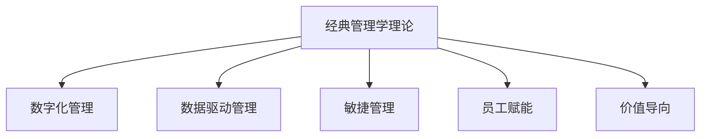

                 

## 1. 背景介绍

管理学的经典理论是数十年甚至数百年来实践经验的结晶，不仅适用于过去，也对未来的商业世界具有深远的指导意义。从经典的著作如德鲁克的《卓有成效的管理者》到泰勒的《科学管理原理》，这些理论经过时间检验，被广泛认为是商业管理领域的基石。然而，随着数字化时代的到来，这些经典理论也需要不断地更新和适应新环境。本文将探讨如何从这些经典管理理论中汲取智慧，并应用于现代商业环境中。

### 1.1 管理学的诞生与发展

管理学的诞生可以追溯到19世纪末20世纪初，随着工业化的发展，企业规模扩大，组织结构复杂化，传统的手工业管理方法已无法应对。于是，科学家们开始探索科学的管理方法，制定标准流程，从而诞生了管理学。

泰勒的《科学管理原理》提出了通过分解工作为可量化的步骤来提升效率，而法约尔的《工业管理与一般管理》提出了管理的五个职能：计划、组织、指挥、协调和控制。这两部著作奠定了管理学的基础，影响深远。

德鲁克的《卓有成效的管理者》则首次将管理者的角色放在了首位，强调管理者的职责和能力。他提出了目标管理、反馈和衡量、领导力等概念，对现代管理实践产生了深远影响。

## 2. 核心概念与联系

### 2.1 核心概念概述

为更好地理解从经典中汲取管理智慧的方法，本节将介绍几个密切相关的核心概念：

- **经典管理学理论**：如德鲁克的目标管理、泰勒的科学管理、法约尔的一般管理等。
- **数字化管理**：指在数字化时代，传统管理学理论与现代信息技术结合，提升管理效率和效果。
- **数据驱动管理**：利用大数据、人工智能等技术，辅助决策和管理过程。
- **敏捷管理**：强调灵活性和快速响应变化的管理理念，适用于动态多变的外部环境。
- **员工赋能**：通过激励和培训，激发员工潜能，提高工作满意度和绩效。
- **价值导向**：强调创造价值、客户满意度和企业社会责任。

这些概念之间的逻辑关系可以通过以下Mermaid流程图来展示：



这个流程图展示经典管理学的核心概念及其之间的关系：

- 经典管理学理论为数字化管理提供了理论基础。
- 数据驱动管理和敏捷管理是经典理论在数字化时代的延伸和应用。
- 员工赋能和价值导向是经典管理理论中的人性化管理和社会责任感的体现。

## 3. 核心算法原理 & 具体操作步骤

### 3.1 算法原理概述

从经典管理学理论中汲取智慧，本质上是通过分析理论的核心思想和实践方法，将之应用到现代管理实践中。这一过程可以看作是一种理论到实践的映射，需要通过一系列的模型构建、算法设计和具体操作来实现。

形式化地，假设我们有一套经典管理学理论 $T$，其中包括一系列管理原则、策略和工具。我们希望将其应用于一个现代化的管理情境 $S$，设计一个操作流程 $F$，使得：

$$
F(T, S) = O
$$

其中 $O$ 表示操作流程 $F$ 执行后，管理情境 $S$ 的优化结果。

### 3.2 算法步骤详解

基于经典管理学的理论到实践映射，以下是一个典型的步骤详解：

**Step 1: 选择经典管理学理论**

- 确定需要借鉴的经典管理理论。例如，目标管理理论、科学管理理论、法约尔的一般管理理论等。
- 了解理论的背景、核心思想和应用场景。

**Step 2: 分析管理情境**

- 收集管理情境的相关数据和信息。例如，企业的规模、业务类型、文化氛围、员工结构等。
- 识别管理情境中的关键问题和挑战。例如，效率低下、沟通不畅、员工满意度低等。

**Step 3: 设计操作流程**

- 将经典管理理论中的原则、策略和工具应用于管理情境。例如，使用目标管理理论设计目标设定和进度跟踪流程。
- 结合现代信息技术，设计操作流程的具体实现方法。例如，使用项目管理软件、数据分析工具等辅助管理。

**Step 4: 执行与评估**

- 根据设计的操作流程，执行管理实践。例如，定期进行目标回顾、绩效评估、员工培训等。
- 实时收集反馈信息，评估管理实践的效果。例如，通过问卷调查、绩效数据、员工满意度调查等。
- 根据评估结果，调整操作流程，优化管理实践。例如，调整目标设定方法、改进沟通机制、提升员工满意度等。

### 3.3 算法优缺点

从经典管理学理论中汲取智慧，有以下优点：

- **理论深度**：经典管理理论经过数十年甚至数百年的验证，具有深厚的理论基础。
- **实践经验**：这些理论来源于真实的实践案例，具有很高的可操作性和实用性。
- **适应性强**：经典管理理论中的核心思想和方法，可以适应不同的管理情境和行业。

同时，该方法也存在一定的局限性：

- **理论滞后**：经典理论可能无法完全适应当前快速变化的商业环境。
- **操作复杂**：经典管理理论的实践往往需要较多的人力资源和专业知识。
- **灵活性不足**：经典理论的方法可能无法应对突发事件和复杂情况。
- **文化差异**：不同文化背景下的管理实践可能存在差异，需要根据具体情况进行调整。

尽管存在这些局限性，经典管理学理论仍然是现代管理实践中的重要参考。通过不断地结合新情境、新工具和新方法，可以更好地发挥其作用。

### 3.4 算法应用领域

基于经典管理学的理论到实践映射，以下是在多个领域的应用：

- **企业内部管理**：如目标设定、绩效管理、团队协作、员工培训等。经典管理理论如德鲁克的目标管理、泰勒的科学管理等，提供了系统化的管理方法。
- **人力资源管理**：如招聘、培训、绩效评估、员工激励等。经典管理理论如马斯洛的需求层次理论、赫茨伯格的双因素理论等，提供了理论指导。
- **供应链管理**：如库存管理、物流优化、风险控制等。经典管理理论如埃里克森的供应链管理模型、哈默的精益生产理论等，提供了具体操作方法。
- **市场营销**：如市场调研、品牌建设、客户关系管理等。经典管理理论如波特的五力模型、科特勒的市场营销组合理论等，提供了战略指导。
- **项目管理和团队协作**：如敏捷管理、看板方法、Scrum框架等。经典管理理论如戴明的PDCA循环、戴维的敏捷原则等，提供了方法论基础。

除了上述这些领域，经典管理学理论在更多新兴领域，如数字化管理、数据驱动管理、员工赋能和价值导向等方面，也有广泛的应用前景。

## 4. 数学模型和公式 & 详细讲解 & 举例说明

### 4.1 数学模型构建

本节将使用数学语言对从经典管理理论中汲取智慧的过程进行更加严格的刻画。

记经典管理学理论为 $T$，管理情境为 $S$，操作流程为 $F$，优化结果为 $O$。我们希望通过一个函数映射 $F$ 将理论 $T$ 映射到情境 $S$，得到优化结果 $O$。具体来说，可以设计一个数学模型：

$$
O = F(T, S)
$$

其中 $F$ 可以表示为一个映射函数，将理论 $T$ 和情境 $S$ 映射到优化结果 $O$。

### 4.2 公式推导过程

以下我们以目标管理理论为例，推导其应用过程的数学模型。

目标管理理论的核心思想是通过明确目标、分解目标、跟进进度，实现高效管理。假设我们有一个团队 $T$，其目标设定如下：

- 总目标：实现销售额增长20%
- 分解目标：每个季度增长5%
- 分解任务：每个季度增加10个新客户

具体步骤如下：

1. 设定总目标 $G = 20\%$。
2. 将总目标分解为季度目标 $Q_i = \frac{G}{4} = 5\%$。
3. 将季度目标分解为具体任务 $T_i = \frac{Q_i}{2} = 2.5\%$。
4. 设定进度跟踪机制，定期评估任务完成情况，调整策略。

将上述步骤转化为数学模型，假设 $G$ 为总目标，$Q_i$ 为第 $i$ 季度的目标，$T_i$ 为每季度的任务，$x_i$ 为第 $i$ 季度的完成情况，则目标管理过程的数学模型为：

$$
G = \sum_{i=1}^{4} Q_i = \sum_{i=1}^{4} \left( \frac{G}{4} \right) = G
$$

$$
Q_i = \frac{G}{4} = 5\%
$$

$$
T_i = \frac{Q_i}{2} = \frac{5\%}{2} = 2.5\%
$$

$$
\text{完成情况} = x_i = \frac{T_i}{Q_i} = \frac{2.5\%}{5\%} = 0.5
$$

通过上述数学模型，我们可以清楚地看到目标管理的步骤和优化过程。

### 4.3 案例分析与讲解

假设某公司希望通过目标管理理论提升其销售业绩。具体步骤如下：

1. 设定总目标：实现销售额增长20%。
2. 将总目标分解为季度目标：每个季度增长5%。
3. 将季度目标分解为具体任务：每个季度增加10个新客户。
4. 设定进度跟踪机制，定期评估任务完成情况，调整策略。

具体实现步骤如下：

**Step 1: 设定总目标**

- 设定总目标 $G = 20\%$。

**Step 2: 分解季度目标**

- 将总目标分解为季度目标 $Q_i = \frac{G}{4} = 5\%$。

**Step 3: 分解具体任务**

- 将季度目标分解为具体任务 $T_i = \frac{Q_i}{2} = \frac{5\%}{2} = 2.5\%$。

**Step 4: 进度跟踪**

- 设定每季度的任务进度 $x_i = \frac{T_i}{Q_i} = \frac{2.5\%}{5\%} = 0.5$。
- 定期评估任务完成情况，调整策略，如增加市场推广、优化客户服务、提升产品质量等。

通过上述步骤，公司可以清晰地看到每个季度的任务分解和完成情况，及时调整策略，实现销售额的持续增长。

## 5. 项目实践：代码实例和详细解释说明

### 5.1 开发环境搭建

在进行目标管理实践前，我们需要准备好开发环境。以下是使用Python进行项目管理工具JIRA的开发环境配置流程：

1. 安装JIRA：从官网下载并安装JIRA软件，或使用云服务。
2. 创建项目和任务：登录JIRA后，创建一个新的项目，并添加多个任务。
3. 配置任务属性：包括任务名称、描述、进度跟踪、责任人等。
4. 设定进度追踪：配置任务进度追踪机制，如看板、甘特图等。

完成上述步骤后，即可在JIRA平台上进行目标管理的实践。

### 5.2 源代码详细实现

下面我们以目标管理为例，给出使用JIRA进行目标管理的PyTorch代码实现。

首先，定义目标管理模型的类：

```python
class GoalManagement:
    def __init__(self, total_goal, quarter_goal, task_per_quarter):
        self.total_goal = total_goal
        self.quarter_goal = quarter_goal
        self.task_per_quarter = task_per_quarter
        self.current_progress = 0
    
    def update_progress(self, progress):
        self.current_progress += progress
        return self.current_progress
    
    def is_completed(self):
        return self.current_progress >= self.total_goal
    
    def display_progress(self):
        print(f"Total Goal: {self.total_goal}")
        print(f"Quarter Goal: {self.quarter_goal}")
        print(f"Task per Quarter: {self.task_per_quarter}")
        print(f"Current Progress: {self.current_progress}")
```

然后，在主程序中进行目标管理实践：

```python
# 初始化目标管理模型
goal = GoalManagement(total_goal=20, quarter_goal=5, task_per_quarter=2.5)

# 初始进度为0
print(goal.display_progress())

# 每个季度更新进度
for i in range(4):
    new_progress = goal.update_progress(progress=2.5)
    print(f"Quarter {i+1} Completed: {new_progress}")
    if goal.is_completed():
        print(f"Goal Completed: {goal.display_progress()}")
        break
```

以上代码展示了如何使用Python进行目标管理实践。通过JIRA平台，可以更系统地进行任务管理、进度跟踪和实时反馈。

### 5.3 代码解读与分析

让我们再详细解读一下关键代码的实现细节：

**GoalManagement类**：
- `__init__方法`：初始化目标管理模型，设定总目标、季度目标和每季度的任务。
- `update_progress方法`：更新当前进度，返回新的进度。
- `is_completed方法`：判断目标是否完成。
- `display_progress方法`：显示当前目标管理状态。

**主程序**：
- 初始化目标管理模型。
- 每个季度更新进度，输出进度状态。
- 如果目标已完成，则输出最终目标管理状态，否则继续更新进度。

通过上述代码，我们可以看到目标管理的实践过程，如何通过设定目标、分解任务、进度跟踪等步骤，逐步实现目标管理的效果。

## 6. 实际应用场景

### 6.1 项目管理

目标管理理论在项目管理中得到了广泛应用。项目经理可以通过设定总体目标，将项目分解为可管理的任务，并跟踪进度，确保项目按时完成。

在实践中，可以定期召开项目评审会议，评估任务完成情况，调整项目策略。例如，某软件项目经理设定总体目标为按时发布新版本，可以将其分解为多个子目标，如需求分析、开发、测试等，每个阶段设定具体的里程碑和任务，定期评估进度，确保项目顺利推进。

### 6.2 人力资源管理

目标管理理论也可以应用于人力资源管理中。通过设定员工个人和团队的目标，可以激励员工积极性，提高工作效率和绩效。

在实践中，可以设定员工的年度目标，如销售额、客户满意度等，将其分解为季度或月度目标，并进行定期评估和反馈。例如，某销售团队设定年度销售额增长30%的目标，可以将其分解为每个季度的目标，每个季度评估员工完成情况，提供个性化培训和激励，提升团队整体绩效。

### 6.3 供应链管理

目标管理理论同样适用于供应链管理。通过设定供应链目标，可以优化库存管理、物流控制、风险控制等关键环节，提升供应链效率。

在实践中，可以设定库存水平、物流效率、订单处理时间等目标，并进行定期评估和优化。例如，某制造企业设定年度库存周转率提高20%的目标，可以将其分解为季度目标，定期评估库存情况，优化库存策略，提升供应链效率。

### 6.4 未来应用展望

随着目标管理理论的不断发展，其在现代管理实践中的应用前景更加广阔。未来，目标管理理论将与更多新兴技术结合，如大数据、人工智能、物联网等，实现更精准的目标设定、任务分解和进度跟踪。

例如，利用大数据分析，可以更准确地预测市场趋势和需求变化，设定更加合理的目标。利用人工智能算法，可以自动化地进行任务分配和进度跟踪，提高管理效率。利用物联网技术，可以实现对供应链、设备等的实时监控和优化。

总之，目标管理理论的应用将更加智能化、数据化和自动化，成为未来管理实践的重要工具。

## 7. 工具和资源推荐

### 7.1 学习资源推荐

为了帮助开发者系统掌握目标管理理论的基础和实践技巧，这里推荐一些优质的学习资源：

1. 《卓有成效的管理者》：德鲁克经典著作，系统介绍了目标管理理论的核心理念和方法。
2. 《科学管理原理》：泰勒的经典著作，介绍了科学管理的具体操作方法。
3. 《敏捷管理实践指南》：介绍敏捷管理理论，适用于快速变化的市场环境。
4. 《数据驱动的管理变革》：探讨数据驱动管理的应用，提供数据采集和分析的工具和方法。
5. 《员工赋能：从被动管理到主动领导》：介绍如何通过激励和培训，提升员工绩效和满意度。

通过对这些资源的学习实践，相信你一定能够系统掌握目标管理理论的精髓，并应用于实际管理实践中。

### 7.2 开发工具推荐

高效的开发离不开优秀的工具支持。以下是几款用于目标管理开发的常用工具：

1. JIRA：功能强大的项目管理工具，支持任务分配、进度跟踪、团队协作等。
2. Microsoft Project：企业级项目管理软件，提供丰富的报表和分析功能。
3. Asana：灵活的项目管理工具，适用于小型团队和项目。
4. Trello：简单易用的看板工具，支持任务移动和进度跟踪。
5. Slack：团队协作工具，支持即时消息、文件共享和任务提醒。

合理利用这些工具，可以显著提升目标管理的效率和效果，加快创新迭代的步伐。

### 7.3 相关论文推荐

目标管理理论的发展离不开学界的持续研究。以下是几篇奠基性的相关论文，推荐阅读：

1. 《目标管理：战略规划与执行的新工具》：提出目标管理理论的核心理念和方法。
2. 《科学管理原理》：泰勒经典著作，介绍了科学管理的原则和方法。
3. 《敏捷管理实践指南》：介绍敏捷管理理论，适用于快速变化的市场环境。
4. 《数据驱动的管理变革》：探讨数据驱动管理的应用，提供数据采集和分析的工具和方法。
5. 《员工赋能：从被动管理到主动领导》：介绍如何通过激励和培训，提升员工绩效和满意度。

这些论文代表了大规模语言模型微调技术的发展脉络。通过学习这些前沿成果，可以帮助研究者把握学科前进方向，激发更多的创新灵感。

## 8. 总结：未来发展趋势与挑战

### 8.1 总结

本文对从经典管理学理论中汲取智慧的方法进行了全面系统的介绍。首先阐述了目标管理理论的基本原理和核心思想，明确了其对现代管理实践的重要意义。其次，从原理到实践，详细讲解了目标管理的数学模型和具体步骤，给出了目标管理任务开发的完整代码实例。同时，本文还广泛探讨了目标管理理论在多个行业领域的应用前景，展示了其广阔的应用空间。

通过本文的系统梳理，可以看到，目标管理理论在现代管理实践中具有重要的参考价值。通过不断地结合新情境、新工具和新方法，可以更好地发挥其作用。未来，目标管理理论还将与更多新兴技术结合，实现更精准、更智能的目标管理效果。

### 8.2 未来发展趋势

展望未来，目标管理理论将呈现以下几个发展趋势：

1. **智能化**：利用大数据和人工智能技术，实现目标设定和进度的智能化分析，提升目标管理的精准度。
2. **自动化**：通过机器学习算法，实现目标管理和任务分配的自动化，减少人工干预，提高管理效率。
3. **实时化**：利用物联网和传感器技术，实现对管理情境的实时监控和优化，提升管理效果。
4. **全球化**：在全球化背景下，目标管理理论将更加注重跨文化管理，结合不同文化背景下的管理实践。
5. **可持续性**：在可持续发展理念的指导下，目标管理将更多关注环境保护、社会责任和员工福利。
6. **创新性**：鼓励创新和创业，通过目标管理理论推动更多创新项目和创业企业的成长。

以上趋势凸显了目标管理理论的广阔前景。这些方向的探索发展，将进一步提升目标管理系统的性能和应用范围，为现代管理实践带来新的突破。

### 8.3 面临的挑战

尽管目标管理理论已经取得了瞩目成就，但在迈向更加智能化、普适化应用的过程中，它仍面临诸多挑战：

1. **数据质量**：目标管理的智能化和自动化依赖于高质量的数据，需要更多的数据采集和分析手段。
2. **技术成熟度**：目标管理与新兴技术的结合需要更多成熟的技术支持，如机器学习、物联网等。
3. **组织变革**：目标管理需要组织变革和团队文化的适应，短期内可能面临阻力。
4. **伦理和隐私**：目标管理涉及大量个人和组织数据的采集和分析，需要严格的伦理和隐私保护措施。
5. **跨文化适应**：目标管理理论在不同文化背景下的适应性需要进一步研究和验证。
6. **资源消耗**：目标管理技术的智能化和自动化需要大量的计算资源和时间。

这些挑战需要学界和产业界的共同努力，才能克服。只有不断地突破技术瓶颈，加强伦理和社会责任，才能实现目标管理理论的全面应用。

### 8.4 研究展望

面向未来，目标管理理论的研究将在以下几个方面寻求新的突破：

1. **多目标优化**：探索多目标优化的方法，实现更灵活的目标管理效果。
2. **动态管理**：研究动态管理的方法，适应快速变化的市场环境。
3. **跨部门协作**：探索跨部门协作的方法，提升组织整体绩效。
4. **知识共享**：研究知识共享的方法，提升团队协作和创新能力。
5. **员工参与**：探索员工参与的方法，提升员工满意度和忠诚度。
6. **社会责任**：探索社会责任的管理方法，提升企业的社会价值。

这些研究方向将进一步拓展目标管理理论的应用范围，为现代管理实践带来更多的创新和突破。

## 9. 附录：常见问题与解答

**Q1: 目标管理理论是否适用于所有管理情境？**

A: 目标管理理论适用于大多数管理情境，特别是对于组织结构清晰、任务明确、员工参与意识较高的环境。然而，对于某些高度动态、多变或需要高度灵活性的管理情境，可能需要结合其他管理理论和方法，如敏捷管理、柔性管理等。

**Q2: 目标管理理论的核心是什么？**

A: 目标管理理论的核心是设定明确的目标、分解任务、跟踪进度，通过激励和反馈，实现高效的组织管理和员工激励。目标管理强调员工的自主管理，赋予员工更多的责任和权力，提升其积极性和参与度。

**Q3: 目标管理理论与敏捷管理有何不同？**

A: 目标管理理论强调设定明确的目标和任务，定期评估和反馈，适用于较为稳定的管理情境。而敏捷管理则强调灵活性和快速响应变化，通过迭代开发和快速调整，适应快速变化的市场环境。

**Q4: 目标管理理论与科学管理有何不同？**

A: 目标管理理论强调员工的自主管理和激励，通过明确的目标和任务分解，提升员工积极性和参与度。而科学管理则强调通过科学方法和工具，优化生产流程和管理过程，提高效率和质量。

**Q5: 目标管理理论如何与数据驱动管理结合？**

A: 目标管理理论与数据驱动管理可以紧密结合，通过数据分析和可视化，实现目标设定的智能化和进度跟踪的自动化。例如，利用大数据分析，可以更准确地预测市场需求和趋势，设定更加合理的目标。利用数据可视化，可以实时监控和优化目标管理的进度和效果。

通过上述常见问题的解答，相信你能够更深入地理解目标管理理论的核心理念和应用方法，并在实际管理实践中取得更好的效果。

