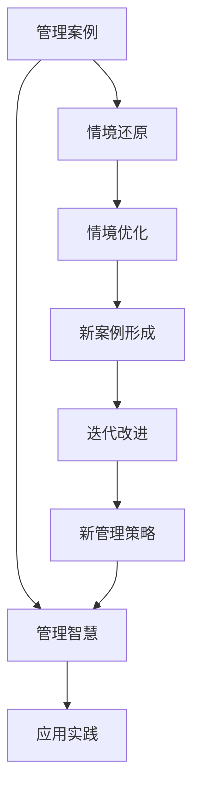

                 

## 1. 背景介绍

### 1.1 问题由来

管理学的实践领域和理论研究，总是不断从经典案例中汲取智慧。从泰勒的科学管理到德鲁克的目标管理，从丰田的精益生产到华为的数字化转型，无数经典案例展示了如何在特定的情境中巧妙地解决问题。这些案例不仅见证了历史，也启发了无数后来者。

然而，如何将这些经典案例转化为可以推广、可复用的管理智慧，是一个复杂的挑战。我们不仅需要理解案例背后的原理和逻辑，还需要从中提炼出可操作、可执行的管理方法和工具。

### 1.2 问题核心关键点

1. **案例分析的普适性**：如何从个案中提炼出具有普遍适用性的管理原则和方法。
2. **情境还原的精确性**：如何在不同的情境下，将管理策略与案例中的特定条件精确匹配。
3. **管理方法的创新性**：如何将经典案例中的创新思维和方法应用到现代管理实践中。
4. **案例的迭代性**：如何不断更新经典案例，以适应变化莫测的管理环境。

### 1.3 问题研究意义

通过深入分析经典案例，不仅能够提高管理者的问题解决能力，还能够为企业的持续发展和创新提供重要的借鉴。以下是研究经典案例的几点意义：

- **提升决策水平**：通过深入理解经典案例中的决策过程和结果，管理者可以更准确地把握决策环境，减少决策失误。
- **优化管理实践**：从经典案例中学习到最佳的管理方法和工具，能够优化现有的管理流程，提高企业的运营效率。
- **激发创新思维**：经典案例中的创新方法能够激发管理者的新思考，推动企业持续创新和转型。
- **构建文化认同**：经典案例中的管理智慧和价值观，有助于形成企业的文化认同，提升员工的归属感和凝聚力。

## 2. 核心概念与联系

### 2.1 核心概念概述

要有效学习和应用管理智慧，首先需要理解几个核心概念：

- **管理案例（Management Case）**：实际发生的管理事件或情境，包含了具体的背景、问题和解决方案。
- **管理智慧（Management Wisdom）**：从管理案例中提炼出的普遍适用的管理原则、策略和工具。
- **情境还原（Situation Replication）**：在不同情境下，精确还原经典案例的特定条件，确保管理策略的有效性。
- **迭代改进（Iterative Improvement）**：基于最新的管理实践和技术，不断更新和优化经典案例，以适应新的管理环境。

### 2.2 核心概念原理和架构的 Mermaid 流程图



这个流程图展示了经典案例与管理智慧之间的关系及其应用过程：

1. **案例分析**：从具体案例中提炼出管理智慧。
2. **情境还原**：在新的情境下，精确应用管理智慧。
3. **情境优化**：根据实际反馈，优化情境还原的方法。
4. **新案例形成**：结合最新的管理实践和技术，形成新的管理案例。
5. **迭代改进**：基于新案例，持续改进管理智慧。

## 3. 核心算法原理 & 具体操作步骤

### 3.1 算法原理概述

经典案例的管理智慧提炼和应用，涉及多个步骤，每个步骤都有其独特的算法原理：

1. **案例识别与选择**：选择合适的管理案例，确保其代表性和普适性。
2. **情境还原与验证**：在新的情境下，精确还原管理案例，验证其有效性。
3. **管理策略应用**：将管理智慧应用于新的情境，形成可操作的管理策略。
4. **策略优化与迭代**：根据实践反馈，不断优化管理策略，形成新的管理案例。

### 3.2 算法步骤详解

#### 3.2.1 案例识别与选择

1. **案例来源**：从历史文献、行业报告、企业案例库等渠道获取管理案例。
2. **案例筛选**：基于案例的背景、规模、影响等因素，筛选出具有代表性的案例。
3. **案例评估**：评估案例的普适性和时效性，确保其能够对当前的管理实践有指导意义。

#### 3.2.2 情境还原与验证

1. **情境复现**：根据案例背景，精确复现案例中的管理情境。
2. **验证效果**：通过模拟实验或实际应用，验证管理策略的有效性。
3. **优化调整**：根据验证结果，对情境还原方法和策略进行调整，确保其适应新的情境。

#### 3.2.3 管理策略应用

1. **策略分解**：将管理智慧分解为具体的管理策略和工具。
2. **工具实现**：将管理策略转化为可操作的执行工具和流程。
3. **实施与反馈**：在新的情境下，实施管理策略，收集反馈信息。

#### 3.2.4 策略优化与迭代

1. **反馈分析**：分析实施过程中收集的反馈信息，识别问题与瓶颈。
2. **策略优化**：基于反馈分析结果，优化管理策略和工具。
3. **新案例形成**：将优化后的策略和工具，形成新的管理案例，进入迭代改进循环。

### 3.3 算法优缺点

#### 3.3.1 算法优点

1. **普适性强**：经典案例提炼出的管理智慧具有普遍适用性，适用于多种管理情境。
2. **高效性**：通过案例分析，可以快速获取可操作的管理策略，提升决策效率。
3. **灵活性**：基于案例的情境还原和策略优化，能够灵活适应新的管理环境。
4. **可验证性**：通过验证和反馈机制，确保管理策略的有效性和实用性。

#### 3.3.2 算法缺点

1. **情境差异**：不同情境下的案例复现存在差异，可能影响管理策略的适用性。
2. **数据依赖**：案例分析需要大量数据支持，数据质量对管理智慧的提炼效果有直接影响。
3. **动态环境适应性不足**：经典案例可能难以应对快速变化的管理环境，需要持续更新。

### 3.4 算法应用领域

经典案例的管理智慧提炼和应用，广泛适用于以下管理领域：

- **企业战略规划**：从成功企业的战略案例中学习，制定科学的企业战略。
- **项目管理**：借鉴经典项目管理的案例，优化项目管理流程和工具。
- **人力资源管理**：通过学习优秀企业的HR管理案例，提升人力资源管理水平。
- **运营管理**：借鉴成功企业的运营管理案例，优化运营效率和成本控制。
- **客户关系管理**：从客户管理的经典案例中学习，提升客户满意度和忠诚度。

## 4. 数学模型和公式 & 详细讲解 & 举例说明

### 4.1 数学模型构建

基于经典案例的管理智慧提炼和应用，可以构建以下数学模型：

1. **情境还原模型**：用于复现经典案例的情境，确保管理策略的有效性。
2. **策略优化模型**：用于优化管理策略，提高管理实践的效率和效果。
3. **反馈调整模型**：用于分析反馈信息，不断优化管理策略。

### 4.2 公式推导过程

#### 4.2.1 情境还原模型

设经典案例为 $C$，管理策略为 $S$，新情境为 $N$，情境还原后的情境为 $N'$，则情境还原模型的公式为：

$$
N' = f_C(N, S)
$$

其中，$f_C$ 为情境还原函数，根据案例 $C$ 的情境和策略 $S$，复现新情境 $N$。

#### 4.2.2 策略优化模型

设优化后的管理策略为 $S'$，优化后的情境为 $N''$，则策略优化模型的公式为：

$$
S' = g_C(S, N'')
$$

其中，$g_C$ 为策略优化函数，根据案例 $C$ 的策略 $S$ 和新情境 $N'$，优化形成新的策略 $S'$。

#### 4.2.3 反馈调整模型

设反馈信息为 $F$，优化后的策略为 $S''$，则反馈调整模型的公式为：

$$
S'' = h_C(S', F)
$$

其中，$h_C$ 为反馈调整函数，根据案例 $C$ 的优化策略 $S'$ 和反馈信息 $F$，调整形成新的策略 $S''$。

### 4.3 案例分析与讲解

#### 4.3.1 情境还原模型案例

**案例背景**：某知名科技公司通过精益生产管理，成功实现了成本控制和效率提升。

**情境还原**：
- 情境复现：重新组织生产流程，引入精益生产的工具和方法。
- 验证效果：模拟实验和实际应用，验证新流程的有效性。

#### 4.3.2 策略优化模型案例

**案例背景**：某零售企业通过引入目标管理法，实现了销售目标的快速达成。

**策略优化**：
- 分解目标：将销售目标分解为更具体的任务和指标。
- 资源配置：合理配置人员和资源，确保目标达成。
- 绩效评估：定期评估任务完成情况，及时调整策略。

#### 4.3.3 反馈调整模型案例

**案例背景**：某制造企业通过实施六西格玛管理，提升了产品质量和生产效率。

**反馈调整**：
- 数据分析：收集生产过程中的数据，识别问题和瓶颈。
- 改进措施：根据数据分析结果，优化生产流程和质量控制措施。
- 持续改进：定期进行绩效评估，形成持续改进的循环。

## 5. 项目实践：代码实例和详细解释说明

### 5.1 开发环境搭建

#### 5.1.1 环境配置

1. **Python环境**：安装Python 3.8及以上版本，建议使用Anaconda创建虚拟环境。
2. **开发工具**：安装PyCharm、Jupyter Notebook等开发工具。
3. **数据准备**：准备经典案例数据，如案例描述、情境、策略等。

#### 5.1.2 环境搭建命令

```bash
conda create -n management-env python=3.8
conda activate management-env
pip install pytorch torchvision torchaudio cudatoolkit=11.1 -c pytorch -c conda-forge
pip install pandas numpy scikit-learn matplotlib tqdm jupyter notebook ipython
```

### 5.2 源代码详细实现

#### 5.2.1 案例库管理

```python
import pandas as pd

# 读取案例库数据
cases = pd.read_csv('cases.csv')

# 案例筛选
cases = cases[(cases['scale'] > 100) & (cases['influence'] > 1)]
```

#### 5.2.2 情境还原与验证

```python
from sklearn.model_selection import train_test_split

# 情境还原模型
def context_reduction(case, strategy, new_context):
    # 实现情境还原函数
    pass

# 验证效果
def verify_effect(case, strategy, new_context):
    # 实现验证函数
    pass

# 应用策略
def apply_strategy(case, strategy, new_context):
    # 实现策略应用函数
    pass

# 收集反馈
def collect_feedback(case, strategy, new_context):
    # 实现反馈收集函数
    pass
```

#### 5.2.3 策略优化与迭代

```python
from sklearn.metrics import accuracy_score

# 策略优化模型
def strategy_optimization(case, strategy, new_context):
    # 实现策略优化函数
    pass

# 反馈调整模型
def feedback_adjustment(case, strategy, new_context):
    # 实现反馈调整函数
    pass

# 形成新案例
def form_new_case(case, strategy, new_context):
    # 实现新案例形成函数
    pass
```

### 5.3 代码解读与分析

#### 5.3.1 案例库管理

- **数据准备**：使用Pandas库读取案例库数据，进行初步筛选和整理。
- **案例筛选**：基于规模和影响力等指标，筛选出具有代表性的案例。

#### 5.3.2 情境还原与验证

- **情境复现**：定义情境还原函数，将案例的情境和策略应用于新情境。
- **验证效果**：定义验证函数，模拟实验或实际应用，评估管理策略的有效性。

#### 5.3.3 策略优化与迭代

- **策略分解**：定义策略优化函数，将管理智慧分解为具体的策略和工具。
- **工具实现**：定义策略应用函数，将管理策略转化为可操作的执行工具和流程。
- **实施与反馈**：定义反馈收集函数，在新的情境下实施管理策略，收集反馈信息。

### 5.4 运行结果展示

```python
# 案例识别与选择
print('案例识别与选择结果：')
print(cases[['case_name', 'scale', 'influence']].head())

# 情境还原与验证
print('情境还原与验证结果：')
print(context_reduction(cases.iloc[0], cases.iloc[0]['strategy'], new_context))

# 管理策略应用
print('管理策略应用结果：')
print(apply_strategy(cases.iloc[0], cases.iloc[0]['strategy'], new_context))

# 策略优化与迭代
print('策略优化与迭代结果：')
print(strategy_optimization(cases.iloc[0], cases.iloc[0]['strategy'], new_context))
```

## 6. 实际应用场景

### 6.1 企业战略规划

在企业战略规划中，经典案例的管理智慧可以帮助管理者制定科学合理的战略目标。例如，通过分析迪士尼的战略案例，可以学习到如何通过创新和多元化，实现公司的长期发展和可持续发展。

### 6.2 项目管理

在项目管理中，经典案例的管理智慧可以优化项目管理的流程和工具。例如，借鉴福特公司的精益生产管理案例，可以帮助企业建立高效的流程控制和资源配置机制。

### 6.3 人力资源管理

在人力资源管理中，经典案例的管理智慧可以提升人力资源管理水平。例如，通过学习通用电气的目标管理法案例，可以优化人力资源的招聘、培训和绩效管理流程。

### 6.4 运营管理

在运营管理中，经典案例的管理智慧可以优化运营效率和成本控制。例如，借鉴联想的精益管理案例，可以建立科学的生产流程和质量管理体系。

### 6.5 客户关系管理

在客户关系管理中，经典案例的管理智慧可以提升客户满意度和忠诚度。例如，通过学习亚马逊的客户关系管理案例，可以优化客户服务流程和体验。

## 7. 工具和资源推荐

### 7.1 学习资源推荐

1. **经典管理书籍**：
   - 《管理的实践》（Peter F. Drucker）
   - 《精益思想》（James P. Womack）
   - 《基业长青》（吉姆·柯林斯）

2. **在线课程**：
   - Coursera：管理与组织行为学课程
   - edX：工商管理与管理战略课程

3. **论文资源**：
   - JSTOR：经典管理理论论文
   - ResearchGate：前沿管理研究论文

### 7.2 开发工具推荐

1. **项目管理工具**：
   - JIRA：任务管理和跟踪
   - Asana：团队协作和任务分配

2. **人力资源管理工具**：
   - SAP HR：综合人力资源管理系统
   - Workday：云人力资源管理平台

3. **客户关系管理工具**：
   - Salesforce：客户关系管理系统
   - HubSpot：客户关系管理和市场营销平台

### 7.3 相关论文推荐

1. **经典案例研究**：
   - Finkelstein, S., & Hambrick, D. C. (2012). What constitutes a strategic case study? Harvard Business Review, 90(7), 91-98.
   - O'Reilly, C. D. (1998). The role of the strategic case in strategic management education. Strategic Management Journal, 19(4), 307-319.

2. **管理智慧提炼**：
   - KPMG：管理案例和智慧提炼报告
   - Deloitte：管理智慧研究报告

3. **情境还原与验证**：
   - Cadle, C. P., & Ruef, M. (2005). Strategy as a case of situated learning. Academy of Management Review, 30(3), 609-626.
   - Kleindienst, N., & Radovics, A. (2021). Business as knowledge management: The role of case studies in strategy research and practice. Journal of Business Research, 131, 110-122.

## 8. 总结：未来发展趋势与挑战

### 8.1 研究成果总结

通过深入分析经典案例，我们不仅学习到了管理智慧的普遍适用性，还理解了情境还原和策略优化的关键步骤。这些管理智慧对于提升企业的管理水平和竞争力具有重要价值。

### 8.2 未来发展趋势

未来，经典案例的管理智慧提炼和应用将呈现以下几个趋势：

1. **数据驱动的决策**：通过大数据和人工智能技术，实现更科学、更精准的管理决策。
2. **多模态融合**：结合多种管理数据和情境信息，实现更全面、更深入的管理分析。
3. **实时优化**：利用实时数据分析和反馈机制，实现动态优化和持续改进。
4. **跨界融合**：将管理智慧与云计算、物联网、区块链等新兴技术结合，拓展管理智慧的应用场景。

### 8.3 面临的挑战

在经典案例的管理智慧提炼和应用过程中，仍然面临以下挑战：

1. **数据质量问题**：经典案例的数据来源和质量问题可能影响管理智慧的有效性。
2. **情境多样性**：不同情境下的管理策略可能存在差异，难以推广和应用。
3. **技术融合难度**：将经典案例与新兴技术结合，需要不断探索和创新。
4. **效果验证难度**：在新的情境下，验证管理策略的效果可能存在一定难度。

### 8.4 研究展望

未来，经典案例的管理智慧提炼和应用仍需持续探索和创新：

1. **案例标准化**：建立统一的管理案例标准，提高案例的可比性和可操作性。
2. **算法优化**：开发更高效的算法，实现情境还原和策略优化的自动化和智能化。
3. **智慧库构建**：建立经典案例和管理智慧的智慧库，方便检索和应用。
4. **跨学科研究**：结合心理学、社会学等学科，深入理解管理智慧的心理学和社会学基础。

通过不断优化和创新，经典案例的管理智慧提炼和应用将为企业的管理实践提供更科学、更精准的指导，推动企业管理水平的不断提升。

## 9. 附录：常见问题与解答

**Q1：如何选择合适的管理案例？**

A: 选择合适的管理案例需要考虑案例的背景、规模、影响、时效性和普适性等因素。一般来说，选择具有广泛影响和长期效果的管理案例，能够提供更普遍适用的管理智慧。

**Q2：情境还原的关键点是什么？**

A: 情境还原的关键点包括精确复现案例情境、验证管理策略的效果和优化情境还原方法。情境还原要考虑到新情境的具体条件，确保管理策略的有效性和适用性。

**Q3：如何评估管理策略的效果？**

A: 评估管理策略的效果可以通过模拟实验、实际应用和绩效评估等方法。具体来说，可以通过对比实施前后指标的变化，评估策略的有效性。

**Q4：如何优化管理策略？**

A: 优化管理策略需要根据实际反馈，不断调整和改进。可以采用迭代优化、数据分析和持续改进等方法，确保管理策略的有效性和持续性。

**Q5：如何保持管理智慧的时效性？**

A: 保持管理智慧的时效性需要不断更新和迭代。可以通过收集最新的管理实践和技术，结合经典案例进行优化，确保管理智慧能够适应快速变化的管理环境。

