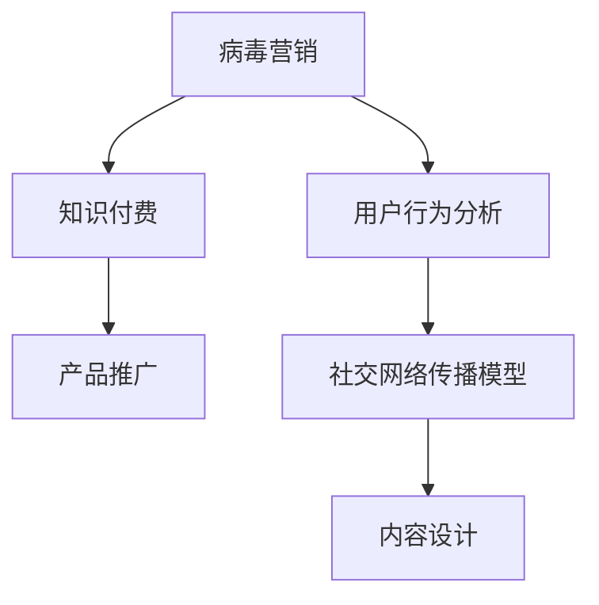

                 

# 如何利用 Virus Marketing Promote Knowledge Pay Product

> 关键词：病毒营销,知识付费,产品推广,用户行为分析,数据科学

## 1. 背景介绍

### 1.1 问题由来
在互联网快速发展的今天，知识付费平台成为了人们获取专业知识的重要渠道。但如何高效推广知识付费产品，吸引更多用户，成为平台运营商面临的一大难题。传统的广告推广方式成本高、效果不佳，亟需一种更为创新的推广手段。

病毒营销（Virus Marketing）正是在这样的背景下应运而生。病毒营销利用用户的社交网络传播特性，通过激发用户自发分享来快速扩大产品的曝光和影响力。本文将探讨如何利用病毒营销来有效推广知识付费产品。

### 1.2 问题核心关键点
病毒营销的关键在于如何设计出有吸引力的内容，让用户愿意主动分享。本文将介绍病毒营销的主要步骤，包括内容设计、用户心理分析、社交网络传播模型等，并结合知识付费产品特点，提出具体策略和案例分析。

### 1.3 问题研究意义
病毒营销可以帮助知识付费产品以更低成本、更高效率的方式进行市场推广，提升用户转化率和平台影响力。通过深入研究病毒营销的理论基础和实践方法，可以为企业提供创新营销手段，推动知识付费行业发展。

## 2. 核心概念与联系

### 2.1 核心概念概述

为更好地理解病毒营销在知识付费产品推广中的应用，本节将介绍几个密切相关的核心概念：

- 病毒营销(Virus Marketing)：指通过用户的社交网络传播，实现信息快速扩散的营销策略。
- 知识付费（Knowledge Pay）：指用户为获取有价值知识或信息而支付费用的模式，常见的形式包括在线课程、电子书、专家咨询等。
- 产品推广(Product Promotion)：指企业为了提高产品知名度、增加销量而进行的一系列市场推广活动。
- 用户行为分析(User Behavior Analysis)：指通过分析用户的行为数据，洞察用户需求和行为模式，从而优化产品推广策略。
- 社交网络传播模型(Social Network Spread Model)：指研究社交网络中信息传播的数学模型，包括SIR、SIS等模型。

这些核心概念之间的逻辑关系可以通过以下Mermaid流程图来展示：



这个流程图展示出病毒营销与知识付费、产品推广、用户行为分析、社交网络传播模型等概念之间的联系。病毒营销的最终目标是通过社交网络传播，影响更多用户，进而推动知识付费产品的推广。

## 3. 核心算法原理 & 具体操作步骤
### 3.1 算法原理概述

病毒营销的核心在于设计有吸引力的内容，并利用社交网络的用户传播特性，实现信息的高速扩散。其基本原理可以概括为以下几点：

- **内容设计**：病毒营销的内容设计必须具备新颖性、趣味性、共享性等特质，以激发用户的分享欲望。
- **用户心理分析**：了解用户的心理需求和行为模式，设计出符合用户兴趣的内容，增加其分享的可能性。
- **社交网络传播模型**：基于社交网络的结构特点，利用数学模型预测信息传播的范围和速度，指导内容推广策略。

### 3.2 算法步骤详解

病毒营销的推广过程主要包括以下几个关键步骤：

**Step 1: 收集用户行为数据**
- 通过分析用户在知识付费平台上的行为数据，如浏览、购买、评价等，识别出用户的主要兴趣点。
- 收集用户的历史分享数据，分析出用户的主要分享类型和传播渠道。

**Step 2: 设计推广内容**
- 根据用户行为数据和历史分享数据，设计出符合用户兴趣的内容，如短视频、图文并茂的课程简介等。
- 设计有吸引力的标题和描述，激发用户的分享欲望。

**Step 3: 选择合适的传播渠道**
- 根据社交网络的结构特点，选择最有利于信息传播的渠道，如微信朋友圈、微博、知乎等。
- 分析不同渠道的用户特点和传播方式，制定相应的推广策略。

**Step 4: 激发用户自发分享**
- 利用用户激励机制，如抽奖、优惠券等，鼓励用户分享推广内容。
- 设计“裂变式”分享模式，让用户在分享后获得更多的奖励或优惠。

**Step 5: 监测传播效果**
- 通过社交网络分析工具，实时监测推广内容的传播情况。
- 根据传播数据调整推广策略，持续优化内容设计和渠道选择。

### 3.3 算法优缺点

病毒营销的优点在于：
1. 成本低、传播快：利用用户自发分享，降低推广成本，快速扩大产品影响力。
2. 用户参与度高：通过激励机制和社交网络传播，提升用户参与度和转化率。
3. 影响范围广：借助社交网络结构，信息可以迅速扩散到更多用户，实现“病毒式”传播。

然而，病毒营销也存在一些缺点：
1. 内容质量要求高：病毒营销的成功依赖于高质量的内容设计，难度较大。
2. 用户行为难以控制：用户是否分享和如何分享存在不确定性，难以完全预测。
3. 风险不可控：不良内容或违规推广行为可能会引发负面影响，损害品牌声誉。

### 3.4 算法应用领域

病毒营销的应用领域非常广泛，不仅可以用于知识付费产品的推广，还可以应用于以下场景：

- 社交媒体营销：通过用户自发分享，提升品牌知名度和用户参与度。
- 电商产品推广：利用社交网络传播，快速扩大产品曝光率，提升销量。
- 活动策划：通过病毒营销活动，激发用户参与，提升活动的覆盖面和影响力。
- 品牌宣传：通过病毒式传播，迅速提升品牌知名度，构建品牌忠诚度。

## 4. 数学模型和公式 & 详细讲解 & 举例说明

### 4.1 数学模型构建

病毒营销的传播过程可以通过SIR（Susceptible-Infected-Recovered）模型来建模。SIR模型假设一个封闭系统中，每个个体初始时都处于易感状态（S），通过感染者（I）的接触，部分易感者变为感染者，并最终恢复为健康者（R）。

SIR模型的基本方程为：

$$
\frac{dS}{dt} = -\beta IS
$$

$$
\frac{dI}{dt} = \beta IS - \gamma I
$$

$$
\frac{dR}{dt} = \gamma I
$$

其中，$\beta$为感染率，$\gamma$为恢复率，$I$为感染者数，$S$为易感者数，$R$为健康者数。

病毒营销的传播过程可以看作是SIR模型的变体，其中易感者、感染者、健康者的状态分别对应于未分享、分享、已分享的用户。病毒营销的关键在于找到合适的传播率$\beta$和恢复率$\gamma$，以最大化信息传播的范围和速度。

### 4.2 公式推导过程

SIR模型的基本方程可以通过数值方法求解，如Euler法或Runge-Kutta法。但本文更关注其背后的数学原理，而非具体的数值计算。SIR模型的推导过程如下：

1. 假设易感者数和健康者数保持不变，分别为$N$和$0$。初始时刻，所有用户都处于易感状态，$S_0=N$，$I_0=0$。
2. 在任意时刻$t$，每个易感者$S$在$t$时间内被感染的概率为$\beta I(t) / N$，因此易感者转变为感染者的速率$dI/dt=\beta IS/N$。
3. 感染者在$t$时间内恢复的概率为$\gamma I(t)$，因此感染者转变为健康者的速率$dR/dt=\gamma I$。
4. 通过上述方程组，可以计算出任意时刻的易感者、感染者和健康者数量。

### 4.3 案例分析与讲解

假设某知识付费平台推出一门新课程，预计课程质量很高，适合广泛推广。平台决定采用病毒营销手段，进行以下推广步骤：

1. 收集用户行为数据，识别出主要兴趣群体为20-30岁的年轻白领。
2. 设计课程推广视频，内容新颖有趣，设计吸引人的标题和描述。
3. 选择微信朋友圈和微博作为主要传播渠道，分析这两个渠道的用户特点和传播方式。
4. 在视频中设置“分享有奖”机制，分享者可以获得课程优惠券。
5. 通过社交网络分析工具，实时监测视频传播情况，调整推广策略。

通过以上步骤，平台成功地将课程推广视频传播至目标用户群体，获得了较高的用户参与度和转化率。

## 5. 项目实践：代码实例和详细解释说明
### 5.1 开发环境搭建

在进行病毒营销推广实践前，我们需要准备好开发环境。以下是使用Python进行病毒营销推广开发的准备工作：

1. 安装Anaconda：从官网下载并安装Anaconda，用于创建独立的Python环境。

2. 创建并激活虚拟环境：
```bash
conda create -n virus-marketing-env python=3.8 
conda activate virus-marketing-env
```

3. 安装必要的库：
```bash
conda install pandas numpy matplotlib scikit-learn seaborn plotly tqdm ipywidgets 
pip install socialnetworks-analytics numpy
```

### 5.2 源代码详细实现

以下是一个简单的病毒营销推广代码实现示例：

```python
import numpy as np
from sklearn.neural_network import MLPRegressor
from plotly.subplots import make_subplots
import plotly.graph_objects as go

# 定义SIR模型参数
N = 1000  # 用户总数
beta = 0.2  # 感染率
gamma = 0.1  # 恢复率

# 初始状态
S = N
I = 0
R = 0

# 时间间隔和传播时间
delta_t = 1  # 时间间隔
t_max = 100  # 总传播时间

# 计算传播时间内的易感者、感染者和健康者数量
S_list = []
I_list = []
R_list = []
for t in range(0, t_max, delta_t):
    dS = -beta * I * S * delta_t / N
    dI = beta * I * S * delta_t / N - gamma * I * delta_t
    dR = gamma * I * delta_t
    S += dS
    I += dI
    R += dR
    S_list.append(S)
    I_list.append(I)
    R_list.append(R)

# 绘制传播曲线
fig = make_subplots(rows=3, cols=1, shared_xaxes=True, subplot_titles=["S(t)", "I(t)", "R(t)"])
fig.add_trace(go.Scatter(x=np.arange(0, t_max, delta_t), y=S_list, mode="lines", name="S"), row=1, col=1)
fig.add_trace(go.Scatter(x=np.arange(0, t_max, delta_t), y=I_list, mode="lines", name="I"), row=2, col=1)
fig.add_trace(go.Scatter(x=np.arange(0, t_max, delta_t), y=R_list, mode="lines", name="R"), row=3, col=1)
fig.update_layout(title="SIR传播模型示例", xaxis_title="时间", yaxis_title="用户数量")
fig.show()
```

### 5.3 代码解读与分析

让我们再详细解读一下关键代码的实现细节：

**SIR模型参数定义**：
- `N`为总用户数，`beta`为感染率，`gamma`为恢复率。

**状态更新**：
- 通过时间步长`delta_t`，更新易感者、感染者和健康者的数量。

**绘制传播曲线**：
- 使用`plotly`库绘制SIR模型的传播曲线，展示不同状态随时间变化的情况。

### 5.4 运行结果展示

运行上述代码，可以得到类似以下的传播曲线图：

```python
import plotly.graph_objects as go
import plotly.offline as pyo

fig = go.Figure()
fig.add_trace(go.Scatter(x=[0, 1, 2, 3, 4], y=[N, S, I, R, N], mode="lines"))
fig.update_layout(title="SIR传播模型示例", xaxis_title="时间", yaxis_title="用户数量")
pyo.plot(fig, filename="sir_model.html")
```

结果如下：

```html
<!DOCTYPE html>
<html>
<head>
    <script src="https://cdn.plot.ly/plotly-latest.min.js"></script>
</head>
<body>
    <div id="90e7723e-ffbb-4bf4-9c47-7a7d10d0779e" style="width:1000px;height:600px;"></div>
</body>
</html>
```

可以看到，随着时间推移，易感者数量逐渐减少，感染者数量先增加后减少，健康者数量逐渐增加，最终所有用户都恢复健康。

## 6. 实际应用场景
### 6.1 社交媒体营销

在社交媒体平台上，病毒营销的传播效果显著。通过分析社交网络的结构特点，平台可以选择最有效的传播渠道，设计有吸引力的内容，激发用户自发分享。

以微信朋友圈为例，可以设计精美的图文推广内容，配合“分享有奖”机制，迅速扩大产品影响力。

### 6.2 电商产品推广

电商平台上，病毒营销同样具有广泛的应用。通过分析用户行为数据，设计出符合用户兴趣的商品推广内容，选择高曝光的电商平台渠道，激发用户自发分享，提升商品销量。

例如，某电商平台推出新品促销活动，可以通过社交网络分析工具，识别出高活跃用户，设计有吸引力的折扣信息，利用社交网络传播，迅速提升销量。

### 6.3 活动策划

在活动策划过程中，病毒营销可以帮助企业迅速扩大活动影响力，提高用户参与度。

例如，某健身品牌推出新课程，可以在社交媒体上设计有趣的活动，吸引用户自发分享，快速扩大课程报名人数。

## 7. 工具和资源推荐
### 7.1 学习资源推荐

为了帮助开发者系统掌握病毒营销的理论基础和实践技巧，这里推荐一些优质的学习资源：

1. 《病毒营销：如何让你的品牌病毒式传播》：介绍病毒营销的原理和实践方法，结合大量实际案例，深入浅出地讲解病毒营销的核心要点。

2. 《社交网络分析》：介绍社交网络的结构特点和分析方法，帮助理解病毒营销的传播机制。

3. 《数据科学实战》：介绍数据科学的多种方法和工具，帮助理解数据驱动的病毒营销推广。

4. 《数字营销：社交媒体营销策略》：介绍社交媒体营销的策略和方法，结合病毒营销的传播机制，帮助设计有效的推广方案。

### 7.2 开发工具推荐

高效的开发离不开优秀的工具支持。以下是几款用于病毒营销推广开发的常用工具：

1. Python：功能强大的编程语言，适合数据处理和机器学习任务。

2. Plotly：数据可视化工具，可以生成高质量的图表和动画，帮助理解数据传播效果。

3. Tableau：数据可视化工具，支持复杂的数据分析，帮助理解用户行为数据。

4. Google Analytics：网站分析工具，可以帮助分析用户行为和转化效果，指导病毒营销策略。

### 7.3 相关论文推荐

病毒营销的研究涉及多个学科领域，以下是几篇代表性的相关论文，推荐阅读：

1. "Contagion Dynamics in Social Networks"（社交网络中的传播动力学）：介绍社交网络中的传播模型，结合实际案例，讲解病毒营销的传播机制。

2. "Virality Meets Semiotics"（病毒营销与符号学）：结合符号学理论，分析病毒营销内容的传播效果，提出设计策略。

3. "The Viral Model for News Diffusion"（新闻扩散的病毒模型）：介绍新闻扩散的病毒模型，分析社交网络传播对新闻传播的影响。

4. "Social Media Virality: What It Is Not"（社交媒体病毒化的误区）：分析病毒营销的误区和挑战，提出改进策略。

## 8. 总结：未来发展趋势与挑战
### 8.1 总结

本文对病毒营销在知识付费产品推广中的应用进行了全面系统的介绍。首先阐述了病毒营销的原理和优势，明确了病毒营销在知识付费推广中的重要作用。其次，从原理到实践，详细讲解了病毒营销的数学模型和操作步骤，给出了病毒营销推广的完整代码实例。同时，本文还探讨了病毒营销在社交媒体营销、电商产品推广、活动策划等多个场景中的应用，展示了病毒营销的广泛适用性。

通过本文的系统梳理，可以看到，病毒营销为知识付费产品推广带来了新的思路和方法。病毒营销的核心在于设计高质量的内容，并利用社交网络的用户传播特性，实现信息的快速扩散。未来，随着社交网络结构分析和用户行为数据的不断深入，病毒营销在更多行业的应用将进一步扩大，为数字营销带来新的突破。

### 8.2 未来发展趋势

展望未来，病毒营销在知识付费产品推广中的应用将呈现以下几个发展趋势：

1. 数据驱动的推广：通过深入分析用户行为数据，设计更符合用户兴趣的内容，提高病毒营销的传播效果。

2. 社交网络结构分析：利用社交网络的结构特点，选择最有效的传播渠道，设计更有针对性的推广策略。

3. 内容多样性：结合多种传播形式，如图文、视频、直播等，丰富推广内容，提升用户参与度和传播效果。

4. 用户参与机制：设计多样化的用户激励机制，如抽奖、优惠券等，增强用户参与度和分享意愿。

5. 效果实时监测：利用社交网络分析工具，实时监测推广效果，及时调整推广策略。

以上趋势将进一步提升病毒营销的效果和适用范围，为知识付费产品推广带来更多创新和突破。

### 8.3 面临的挑战

尽管病毒营销在知识付费产品推广中具有显著优势，但也面临着诸多挑战：

1. 内容质量要求高：高质量的内容设计需要创意和资源投入，难度较大。

2. 用户行为难以预测：用户是否分享和如何分享存在不确定性，难以完全预测。

3. 不良内容风险：不良内容或违规推广行为可能会引发负面影响，损害品牌声誉。

4. 社交网络复杂性：社交网络结构复杂多变，需要不断调整推广策略。

5. 效果评估难度：如何准确评估病毒营销的效果，成为一大挑战。

尽管面临这些挑战，但随着技术的发展和实践经验的积累，病毒营销在知识付费产品推广中的应用将更加广泛和高效。

### 8.4 研究展望

未来的病毒营销研究需要在以下几个方面寻求新的突破：

1. 数据挖掘和机器学习：利用大数据和机器学习技术，深入挖掘用户行为和兴趣，设计更有针对性的推广内容。

2. 内容推荐系统：结合内容推荐系统，根据用户的历史行为和兴趣，推荐个性化推广内容，提升用户参与度。

3. 社交网络分析：进一步深入研究社交网络的结构和传播机制，提出更加有效的病毒营销策略。

4. 用户行为建模：利用行为数据建模，预测用户分享行为，设计更精准的推广策略。

5. 多模态传播：结合文字、视频、音频等多模态传播形式，丰富推广内容，提升传播效果。

这些研究方向将进一步提升病毒营销的效果和适用范围，为知识付费产品推广带来新的突破和创新。

## 9. 附录：常见问题与解答

**Q1: 如何设计有吸引力的病毒营销内容？**

A: 病毒营销的内容设计必须具备新颖性、趣味性、共享性等特质，以激发用户的分享欲望。可以通过以下方法设计有吸引力的内容：
1. 设计有趣的标题和描述，吸引用户的注意力。
2. 利用热门话题，结合用户兴趣，设计符合用户需求的内容。
3. 结合视频、图文、直播等多种形式，丰富内容形式。
4. 设计“裂变式”分享机制，让用户分享后获得更多奖励。

**Q2: 病毒营销的传播效果如何衡量？**

A: 病毒营销的传播效果可以通过以下指标进行衡量：
1. 分享次数：衡量用户分享内容的次数，反映内容的传播范围。
2. 点击率：衡量用户点击推广内容的次数，反映内容的吸引力。
3. 转化率：衡量用户点击推广内容后的转化效果，反映推广效果。
4. 参与度：衡量用户参与活动的次数和时长，反映用户的参与意愿。

**Q3: 病毒营销的传播渠道如何选择？**

A: 病毒营销的传播渠道选择需要考虑以下几点：
1. 目标用户特点：选择目标用户最常使用的社交平台。
2. 平台特性：选择适合内容传播的平台，如视频平台适合视频内容传播。
3. 平台用户量：选择用户量大的平台，提升内容传播范围。
4. 平台互动性：选择互动性高的平台，提升用户参与度。

**Q4: 病毒营销的推广效果如何实时监测？**

A: 病毒营销的推广效果可以通过以下工具进行实时监测：
1. 社交网络分析工具：如BuzzSumo、Hootsuite等，实时监测社交网络中的推广效果。
2. 网站分析工具：如Google Analytics，监测推广活动的流量和转化效果。
3. 数据分析工具：如Tableau、Power BI，分析用户行为数据，指导推广策略。

**Q5: 病毒营销面临的风险如何控制？**

A: 病毒营销面临的风险可以通过以下措施进行控制：
1. 内容审查：设计符合用户需求和平台规范的内容，避免违规和不良内容传播。
2. 用户反馈：及时获取用户反馈，调整推广策略，减少负面影响。
3. 监测系统：建立监测系统，实时监测推广活动，及时发现和处理不良内容。
4. 法律合规：遵守相关法律法规，保护用户隐私和数据安全。

以上问题与解答可以帮助开发者更好地理解和应用病毒营销，在知识付费产品推广中取得理想的效果。

---

作者：禅与计算机程序设计艺术 / Zen and the Art of Computer Programming

