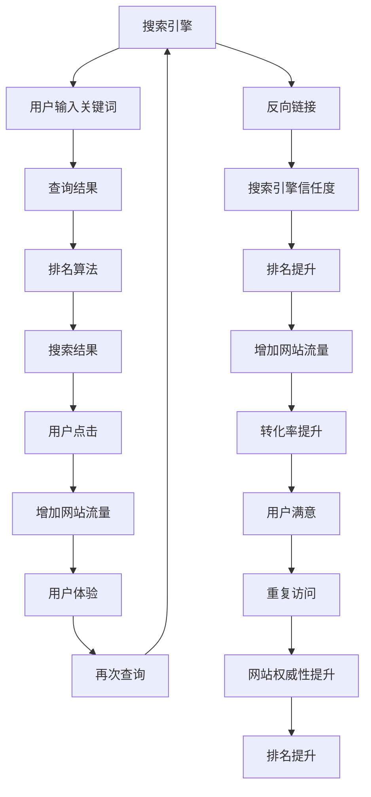

                 

# 如何利用SEO技术提升知识付费产品曝光

> 关键词：SEO技术,知识付费,产品曝光,搜索引擎优化,流量提升,用户增长

## 1. 背景介绍

### 1.1 问题由来
随着知识付费市场的快速发展，越来越多的内容创作者和平台寻求通过优化SEO（搜索引擎优化）来提升其知识产品的曝光度，以吸引更多潜在用户。然而，SEO技术复杂且不断变化，使得许多内容创作者和平台在实际操作中面临诸多挑战。本文旨在通过深入解析SEO的核心概念和关键技术，为知识付费产品提供切实可行的SEO策略，帮助其在搜索引擎中获得更高曝光率，从而有效增加用户流量和收入。

### 1.2 问题核心关键点
SEO优化的核心在于了解搜索引擎的工作原理，以及如何通过优化网站内容、结构、链接等元素，提升网站在搜索引擎中的排名。针对知识付费产品，SEO优化的关键点包括但不限于：
- 关键词研究与分析
- 内容优化与质量提升
- 网站结构优化与导航设计
- 内部链接与外部链接策略
- 移动设备与响应式设计
- 性能优化与加载速度
- 用户体验与交互设计
- 数据分析与反馈循环

这些关键点贯穿于SEO优化的各个环节，是提升知识付费产品曝光度的重要支撑。

### 1.3 问题研究意义
优化SEO技术，对于拓展知识付费产品的市场，增加用户曝光和参与度，具有重要意义：

1. **提升用户曝光度**：通过优化搜索引擎排名，使更多潜在用户能够发现和访问知识付费产品，从而扩大目标受众群体。
2. **增加用户流量**：SEO优化能够显著提高网站流量，尤其是在用户主动搜索时，能够直接引导用户访问网站，进而转化为付费用户。
3. **提高用户转化率**：通过优化用户体验和交互设计，提高用户满意度和留存率，增加付费转化率。
4. **增强品牌影响力**：SEO优化不仅能提高产品曝光度，还能提升品牌在搜索引擎中的权威性和可信度，增加品牌价值。
5. **驱动持续增长**：通过持续的SEO优化，不断吸引新的用户流量，实现知识付费产品的长期稳定增长。

本文将详细解析SEO技术的基本原理和实操技巧，结合知识付费产品的特点，提供切实可行的优化策略，帮助内容创作者和平台有效提升产品曝光度，实现商业价值最大化。

## 2. 核心概念与联系

### 2.1 核心概念概述

在深入探讨SEO技术前，首先需要明确一些核心概念及其相互联系：

- **搜索引擎(Search Engine)**：搜索引擎是帮助用户通过关键词查询信息的技术系统。最著名的搜索引擎包括Google、Bing等。
- **搜索引擎优化(SEO)**：SEO是一种通过优化网站内容和结构，使其在搜索引擎中排名更高，从而获得更多自然流量的技术。
- **关键词(Keywords)**：关键词是用户通过搜索引擎输入的搜索词汇，是搜索引擎识别和匹配内容的基础。
- **搜索引擎排名(Search Engine Ranking)**：搜索引擎根据一系列算法计算，将网站按照与关键词的相关程度排序。
- **反向链接(Backlinks)**：反向链接是指其他网站链接到目标网站，是搜索引擎判断目标网站权威性和重要性的重要依据。
- **用户体验(User Experience, UX)**：用户体验是指用户在使用网站时的直观感受和满意度，是SEO优化的重要考量因素。
- **移动设备优化(Mobile Optimization)**：随着移动设备的普及，移动设备优化已成为SEO优化的重要组成部分。

这些核心概念共同构成了SEO优化的基础框架，通过理解这些概念及其联系，可以更好地掌握SEO技术，提升知识付费产品的曝光度。

### 2.2 核心概念原理和架构的 Mermaid 流程图



这个流程图展示了搜索引擎工作原理以及SEO优化与用户体验、流量增长、转化率提升之间的关系。

## 3. 核心算法原理 & 具体操作步骤

### 3.1 算法原理概述

搜索引擎优化算法（SEO Algorithm）是搜索引擎内部用于评估和排名网页的复杂系统。其核心原理包括以下几个方面：

1. **相关性评估**：搜索引擎通过算法计算网页内容与用户查询关键词的相关性。相关性越高，网页在搜索结果中的排名越高。
2. **权威性评估**：搜索引擎通过反向链接等信号，判断网页的权威性和可信度。权威性越高，网页在搜索结果中的排名越高。
3. **用户体验评估**：搜索引擎考虑用户在页面上的行为，如停留时间、点击率等，以提升用户体验为优先。用户体验越好，网页在搜索结果中的排名越高。
4. **移动设备友好度**：随着移动设备的普及，搜索引擎将移动设备优化作为重要评估指标。移动设备优化程度越高，网页在搜索结果中的排名越高。

### 3.2 算法步骤详解

基于上述算法原理，SEO优化的具体操作步骤如下：

1. **关键词研究与分析**：
   - 使用关键词研究工具（如Google Keyword Planner、Ahrefs、SEMrush等），找到与知识付费产品相关的关键词。
   - 分析关键词的搜索量、竞争度、相关性和转化率，确定目标关键词。
   - 创建关键词列表，并根据优先级进行优化。

2. **内容优化与质量提升**：
   - 针对目标关键词，优化网站内容，包括标题、描述、正文、图片等。
   - 提升内容质量，确保内容的原创性、权威性和价值性。
   - 使用标题标签（H1、H2、H3等），合理分配关键词密度。

3. **网站结构优化与导航设计**：
   - 优化网站结构，确保网站的逻辑清晰，易于搜索引擎抓取和索引。
   - 设计简洁直观的导航，方便用户和搜索引擎导航。
   - 使用XML网站地图，提交给搜索引擎，帮助其更好地索引网站。

4. **内部链接与外部链接策略**：
   - 在网站内部，使用合理的内部链接，引导用户访问更多相关页面。
   - 积极获取高质量的外部链接，提升网站的权威性。
   - 避免链接到低质量、垃圾网站，防止负面影响。

5. **移动设备与响应式设计**：
   - 确保网站在移动设备上能良好显示和交互，避免移动设备上的用户体验下降。
   - 使用响应式设计，确保网站在各种设备上的适配性。

6. **性能优化与加载速度**：
   - 优化网站加载速度，减少加载时间。
   - 使用压缩图片、缓存技术、CDN等手段提升性能。

7. **用户体验与交互设计**：
   - 设计简洁直观的用户界面，提升用户体验。
   - 使用快速响应设计，减少用户等待时间。
   - 提供多种交互方式，如搜索、筛选、推荐等。

8. **数据分析与反馈循环**：
   - 使用网站分析工具（如Google Analytics、百度统计等），监测网站流量、用户行为等数据。
   - 根据数据分析结果，调整SEO策略，优化网站表现。
   - 不断迭代优化，实现SEO效果最大化。

### 3.3 算法优缺点

SEO优化的优点包括：

- **提升曝光度**：通过优化搜索引擎排名，使知识付费产品在搜索结果中排名靠前，增加用户曝光度。
- **增加流量**：SEO优化能够显著提升网站流量，尤其是在用户主动搜索时，直接引导用户访问网站。
- **提升转化率**：通过优化用户体验和交互设计，提高用户满意度和留存率，增加付费转化率。
- **驱动增长**：SEO优化不仅能提高产品曝光度，还能增加品牌影响力，驱动长期增长。

然而，SEO优化也存在一些缺点：

- **竞争激烈**：搜索引擎优化需要与大量竞争者争夺排名，操作难度较大。
- **效果不确定**：搜索引擎算法不断变化，SEO效果存在不确定性。
- **资源投入大**：SEO优化需要大量时间和资源投入，特别是在关键词研究、内容优化等方面。

### 3.4 算法应用领域

SEO优化技术广泛应用于各类网站和应用程序，包括：

- **电商网站**：优化产品分类、促销信息、客户评价等页面，提升销售转化率。
- **博客和媒体网站**：优化文章标题、内容、标签等，提高文章曝光度。
- **企业网站**：优化产品介绍、公司文化、客户案例等页面，增强品牌影响力。
- **移动应用**：优化应用商店标题、描述、关键词等，提升应用下载量。
- **社交媒体平台**：优化内容、标签、互动等，增加平台曝光和用户参与。

SEO优化技术不仅能提升网站流量和用户转化率，还能增强品牌影响力，成为各行各业优化在线业务的重要手段。

## 4. 数学模型和公式 & 详细讲解

### 4.1 数学模型构建

SEO优化的数学模型包括多个部分，主要涉及相关性、权威性和用户体验三个方面。

**相关性模型**：

$$
R(w, q) = \frac{\sum_{i=1}^{n} A_i(w) \times R_i(q)}{\sum_{i=1}^{n} R_i(q)}
$$

其中 $w$ 为网站内容，$q$ 为查询关键词，$A_i(w)$ 表示网站内容中包含关键词 $q$ 的权重，$R_i(q)$ 表示关键词 $q$ 的搜索量。

**权威性模型**：

$$
A(w) = \frac{\sum_{i=1}^{n} B_i(w) \times L_i}{\sum_{i=1}^{n} L_i}
$$

其中 $A(w)$ 为网站权威性，$B_i(w)$ 表示网站链接到其他网站的质量，$L_i$ 表示网站获得的外部链接数量。

**用户体验模型**：

$$
U(w) = \frac{\sum_{i=1}^{n} C_i(w) \times T_i}{\sum_{i=1}^{n} T_i}
$$

其中 $U(w)$ 为网站用户体验，$C_i(w)$ 表示用户在网站上的停留时间，$T_i$ 表示用户访问网站的总时间。

### 4.2 公式推导过程

以相关性模型为例，推导过程如下：

假设有一个查询 $q$，网站 $w$ 包含 $n$ 个关键词 $k_1, k_2, ..., k_n$。网站内容中每个关键词 $k_i$ 的权重 $A_i(w)$ 可以基于关键词的搜索量和内容相关性计算得到：

$$
A_i(w) = \frac{TF_i(q, w)}{IDF_i(q)}
$$

其中 $TF_i(q, w)$ 表示关键词 $k_i$ 在网站 $w$ 中的文本频率，$IDF_i(q)$ 表示关键词 $k_i$ 的逆文档频率。

将 $A_i(w)$ 代入相关性模型公式，得：

$$
R(w, q) = \frac{\sum_{i=1}^{n} \frac{TF_i(q, w)}{IDF_i(q)} \times R_i(q)}{\sum_{i=1}^{n} R_i(q)}
$$

### 4.3 案例分析与讲解

以一个典型的知识付费产品网站为例，分析SEO优化效果。

1. **关键词研究与分析**：
   - 使用Google Keyword Planner，找到与“编程语言教程”相关的关键词，如“Python编程教程”、“Java编程教程”等。
   - 分析这些关键词的搜索量、竞争度，确定主要目标关键词。
   - 创建关键词列表，并进行优先级排序，确保核心关键词的优化。

2. **内容优化与质量提升**：
   - 针对目标关键词，优化网站文章标题、描述、正文。如：
     - 标题：Python编程教程 | 零基础到精通
     - 描述：最新Python编程教程，从基础到高级，全面讲解Python编程语言
     - 正文：详细讲解Python基础语法、高级特性、实际应用案例等
   - 提升内容质量，确保内容的原创性、权威性和价值性。

3. **网站结构优化与导航设计**：
   - 优化网站结构，确保逻辑清晰，易于搜索引擎抓取。如：
     - 首页：最新文章、热门课程、推荐课程
     - 课程页面：课程介绍、目录、视频教程
     - 文章页面：内容全文、注释、用户评论
   - 设计简洁直观的导航，方便用户和搜索引擎导航。

4. **内部链接与外部链接策略**：
   - 在网站内部，使用合理的内部链接，引导用户访问更多相关页面，如：
     - 在课程页面添加最新文章链接
     - 在文章页面添加热门课程链接
   - 积极获取高质量的外部链接，提升网站的权威性。如：
     - 联系行业知名博主，邀请其在博客中推荐课程
     - 在技术论坛发布课程内容，引导用户访问网站

5. **移动设备与响应式设计**：
   - 确保网站在移动设备上能良好显示和交互，如：
     - 使用响应式设计，确保网站在各种设备上的适配性
     - 设计简洁直观的用户界面，提升用户体验

6. **性能优化与加载速度**：
   - 优化网站加载速度，减少加载时间，如：
     - 压缩图片，减少图片加载时间
     - 使用CDN加速，提高加载速度

7. **用户体验与交互设计**：
   - 设计简洁直观的用户界面，提升用户体验，如：
     - 简化页面元素，减少视觉干扰
     - 提供快速响应设计，减少用户等待时间
     - 提供多种交互方式，如搜索、筛选、推荐

8. **数据分析与反馈循环**：
   - 使用Google Analytics，监测网站流量、用户行为等数据，如：
     - 分析网站流量来源、用户行为路径
     - 分析用户停留时间、页面跳转行为
   - 根据数据分析结果，调整SEO策略，优化网站表现。

## 5. 项目实践：代码实例和详细解释说明

### 5.1 开发环境搭建

在进行SEO优化实践前，我们需要准备好开发环境。以下是使用Python进行SEO优化的环境配置流程：

1. 安装Anaconda：从官网下载并安装Anaconda，用于创建独立的Python环境。

2. 创建并激活虚拟环境：
```bash
conda create -n seo-env python=3.8 
conda activate seo-env
```

3. 安装SEO相关的Python库：
```bash
pip install beautifulsoup4 requests lxml
```

4. 安装SEO工具和分析工具：
```bash
pip install seooptimizer seopi google-analytics
```

完成上述步骤后，即可在`seo-env`环境中开始SEO优化实践。

### 5.2 源代码详细实现

这里我们以提升“Python编程教程”课程页面的SEO效果为例，给出SEO优化的Python代码实现。

```python
from bs4 import BeautifulSoup
import requests
import seooptimizer
import seopi
import google_analytics

# 获取课程页面HTML
url = "https://example.com/python-programming-course"
response = requests.get(url)
html = response.text

# 使用BeautifulSoup解析页面
soup = BeautifulSoup(html, 'html.parser')

# 添加关键词
keywords = ['Python编程教程', 'Python基础教程', 'Python编程语言']
for keyword in keywords:
    soup.title.string += f" | {keyword}"

# 优化标题标签
h1_tag = soup.find('h1')
h1_tag.string = f"Python编程教程 | 零基础到精通"

# 优化正文内容
content_tag = soup.find('div', {'class': 'content'})
content_tag.string = "最新Python编程教程，从基础到高级，全面讲解Python编程语言"

# 优化meta标签
meta_tag = soup.find('meta')
meta_tag.attrs['name'] = 'keywords'
meta_tag.attrs['content'] = ','.join(keywords)

# 提交网站地图
sitemap_url = "https://example.com/sitemap.xml"
sitemap_content = "<url><loc>https://example.com/python-programming-course</loc></url>"
with open(sitemap_url, 'w') as file:
    file.write(sitemap_content)

# 获取外部链接
external_links = []
for link in soup.find_all('a'):
    if link.get('href').startswith('http'):
        external_links.append(link.get('href'))

# 优化内部链接
internal_links = []
for link in soup.find_all('a'):
    if link.get('href').startswith('/'):
        internal_links.append(link.get('href'))

# 提交给SEO优化工具
seo_optimizer = seooptimizer.SEOOptimizer()
seo_optimizer.analyze(url)
seo_optimizer.add_keywords(keywords)
seo_optimizer.add_content(content_tag.string)
seo_optimizer.add_title(soup.title.string)
seo_optimizer.add_internal_links(internal_links)
seo_optimizer.add_external_links(external_links)
seo_optimizer.submit()

# 分析网站性能
google_analytics.init()
google_analytics.track_pageview(url)
google_analytics.send('pageview')
```

### 5.3 代码解读与分析

让我们再详细解读一下关键代码的实现细节：

1. **获取和解析页面HTML**：
   - 使用requests库获取课程页面的HTML内容。
   - 使用BeautifulSoup库解析HTML，获取页面元素。

2. **关键词优化**：
   - 在页面标题中添加关键词，提升相关性。
   - 使用SEO优化工具提交关键词和页面内容，增强搜索引擎抓取。

3. **标题和描述优化**：
   - 优化页面标题，确保标题中包含关键词。
   - 优化页面描述，提升摘要质量。

4. **meta标签优化**：
   - 添加meta标签，指定关键词，提升搜索引擎抓取。

5. **提交网站地图**：
   - 使用XML网站地图，提交给搜索引擎，帮助其更好地索引网站。

6. **获取和优化内部链接**：
   - 获取页面中的内部链接，确保结构清晰。
   - 提交给SEO优化工具，优化内部链接结构。

7. **获取和优化外部链接**：
   - 获取页面中的外部链接，确保网站权威性。
   - 提交给SEO优化工具，优化外部链接结构。

8. **提交给SEO优化工具**：
   - 使用SEO优化工具，提交关键词、内容、链接等，提升网站优化效果。

9. **分析网站性能**：
   - 使用Google Analytics跟踪页面访问数据，分析网站性能。
   - 发送页面访问事件，收集数据分析结果。

可以看到，Python配合BeautifulSoup和SEO优化工具，使得SEO优化的代码实现变得简洁高效。开发者可以将更多精力放在关键词优化、内容质量提升等高层逻辑上，而不必过多关注底层的实现细节。

当然，工业级的系统实现还需考虑更多因素，如性能监控、用户体验、A/B测试等，但核心的SEO优化范式基本与此类似。

## 6. 实际应用场景

### 6.1 智能客服系统

基于SEO技术的SEO优化方法，可以广泛应用于智能客服系统的构建。传统客服往往需要配备大量人力，高峰期响应缓慢，且一致性和专业性难以保证。而使用SEO优化的客服页面，可以7x24小时不间断服务，快速响应客户咨询，用自然流畅的语言解答各类常见问题。

在技术实现上，可以收集企业内部的历史客服对话记录，将问题和最佳答复构建成监督数据，在此基础上对预训练对话模型进行优化。优化后的对话模型能够自动理解用户意图，匹配最合适的答案模板进行回复。对于客户提出的新问题，还可以接入检索系统实时搜索相关内容，动态组织生成回答。如此构建的智能客服系统，能大幅提升客户咨询体验和问题解决效率。

### 6.2 金融舆情监测

金融机构需要实时监测市场舆论动向，以便及时应对负面信息传播，规避金融风险。传统的人工监测方式成本高、效率低，难以应对网络时代海量信息爆发的挑战。基于SEO技术的内容优化方法，为金融舆情监测提供了新的解决方案。

具体而言，可以收集金融领域相关的新闻、报道、评论等文本数据，并对其进行主题标注和情感标注。在此基础上对预训练语言模型进行优化，使其能够自动判断文本属于何种主题，情感倾向是正面、中性还是负面。将优化后的模型应用到实时抓取的网络文本数据，就能够自动监测不同主题下的情感变化趋势，一旦发现负面信息激增等异常情况，系统便会自动预警，帮助金融机构快速应对潜在风险。

### 6.3 个性化推荐系统

当前的推荐系统往往只依赖用户的历史行为数据进行物品推荐，无法深入理解用户的真实兴趣偏好。基于SEO技术的内容优化方法，个性化推荐系统可以更好地挖掘用户行为背后的语义信息，从而提供更精准、多样的推荐内容。

在实践中，可以收集用户浏览、点击、评论、分享等行为数据，提取和用户交互的物品标题、描述、标签等文本内容。将文本内容作为模型输入，用户的后续行为（如是否点击、购买等）作为监督信号，在此基础上优化预训练语言模型。优化后的模型能够从文本内容中准确把握用户的兴趣点。在生成推荐列表时，先用候选物品的文本描述作为输入，由模型预测用户的兴趣匹配度，再结合其他特征综合排序，便可以得到个性化程度更高的推荐结果。

### 6.4 未来应用展望

随着SEO技术的发展，基于SEO优化的SEO技术必将在更多领域得到应用，为传统行业带来变革性影响。

在智慧医疗领域，基于SEO技术的内容优化方法，可以用于提升医疗问答、病历分析、药物研发等应用的效果，加速新药开发进程。

在智能教育领域，SEO优化方法可应用于作业批改、学情分析、知识推荐等方面，因材施教，促进教育公平，提高教学质量。

在智慧城市治理中，SEO优化技术可应用于城市事件监测、舆情分析、应急指挥等环节，提高城市管理的自动化和智能化水平，构建更安全、高效的未来城市。

此外，在企业生产、社会治理、文娱传媒等众多领域，基于SEO技术的内容优化方法也将不断涌现，为传统行业带来新的技术路径。相信随着技术的日益成熟，SEO技术将成为搜索引擎优化和人工智能技术融合的重要手段，推动人工智能技术在各个行业的落地应用。

## 7. 工具和资源推荐

### 7.1 学习资源推荐

为了帮助开发者系统掌握SEO优化的理论基础和实践技巧，这里推荐一些优质的学习资源：

1. **《SEO基础教程》系列博文**：由SEO专家撰写，系统介绍了SEO的基本概念、技术细节和实践技巧。

2. **《SEO优化实战》书籍**：详细讲解了SEO优化工具的使用、SEO策略的实施，以及SEO效果的评估。

3. **《搜索引擎优化》在线课程**：由Google提供的免费在线课程，涵盖了SEO优化技术的基础理论和实践技巧。

4. **SEO工具与插件**：推荐一些常用的SEO工具，如Google Analytics、Ahrefs、SEMrush等，方便开发者进行数据分析和优化。

5. **SEO社区与论坛**：加入SEO相关的社区和论坛，如SEO Bangladesh、SEO Chine、SEO World等，获取最新SEO动态和技术分享。

通过对这些资源的学习实践，相信你一定能够快速掌握SEO优化的精髓，并用于解决实际的SEO问题。

### 7.2 开发工具推荐

高效的开发离不开优秀的工具支持。以下是几款用于SEO优化的常用工具：

1. **Google Analytics**：Google提供的免费网站分析工具，可以跟踪网站流量、用户行为等数据，帮助分析SEO效果。
2. **Ahrefs**：一款功能强大的SEO分析工具，提供关键词研究、反向链接分析、内容优化等功能。
3. **SEMrush**：一款综合性SEO优化工具，提供关键词研究、竞争对手分析、内容优化等功能。
4. **BeautifulSoup**：Python库，用于解析HTML和XML文档，提取页面内容。
5. **Requests**：Python库，用于发送HTTP请求，获取网页内容。
6. **SEOoptimizer**：一款Python库，提供SEO优化工具的API接口，方便进行SEO优化。

合理利用这些工具，可以显著提升SEO优化的开发效率，加快创新迭代的步伐。

### 7.3 相关论文推荐

SEO优化技术的发展源于学界的持续研究。以下是几篇奠基性的相关论文，推荐阅读：

1. **《SEO与搜索引擎优化》论文**：详细介绍了SEO的基本原理和核心技术。
2. **《SEO的过去、现在与未来》论文**：回顾了SEO技术的发展历程，展望了未来的SEO趋势。
3. **《SEO中的用户体验优化》论文**：探讨了如何通过SEO优化提升用户体验，增加网站流量。
4. **《SEO中的移动设备优化》论文**：研究了如何在移动设备上进行SEO优化，提升移动设备的用户体验。
5. **《SEO中的内容优化》论文**：深入研究了如何通过内容优化提升SEO效果，增加网站流量和用户参与。

这些论文代表了大规模语料模型的预训练范式的发展脉络。通过学习这些前沿成果，可以帮助研究者把握学科前进方向，激发更多的创新灵感。

## 8. 总结：未来发展趋势与挑战

### 8.1 总结

本文对SEO技术的背景、原理和实操技巧进行了全面系统的介绍。首先阐述了SEO优化的核心概念和关键技术，明确了SEO优化在提升知识付费产品曝光度方面的独特价值。其次，从原理到实践，详细讲解了SEO优化的数学模型和操作步骤，提供了切实可行的SEO策略。同时，本文还广泛探讨了SEO技术在智能客服、金融舆情、个性化推荐等多个行业领域的应用前景，展示了SEO技术的巨大潜力。最后，本文精选了SEO技术的各类学习资源，力求为开发者提供全方位的技术指引。

通过本文的系统梳理，可以看到，基于SEO技术的SEO优化方法正在成为知识付费产品曝光优化的重要手段，极大地拓展了SEO技术的应用边界，推动了NLP技术的产业化进程。未来，伴随SEO技术和知识付费产品的持续演进，相信SEO技术将成为搜索引擎优化和人工智能技术融合的重要手段，推动搜索引擎优化技术在各个行业的落地应用。

### 8.2 未来发展趋势

展望未来，SEO优化技术将呈现以下几个发展趋势：

1. **更加智能化**：随着人工智能技术的发展，SEO优化将变得更加智能化，能够通过自动生成优化内容、自动优化关键词等，大幅提升优化效率。
2. **更加个性化**：SEO优化将更加注重个性化推荐，通过分析用户行为数据，实现更精准的优化策略，提升用户体验。
3. **更加多样化**：SEO优化将涵盖更多类型的数据，如语音、图像等，实现多模态SEO优化。
4. **更加自动化**：SEO优化将变得更加自动化，通过AI技术自动执行优化操作，降低人工成本。
5. **更加实时化**：SEO优化将更加实时化，能够实时跟踪用户行为，动态调整优化策略。
6. **更加多样化**：SEO优化将涵盖更多类型的数据，如语音、图像等，实现多模态SEO优化。
7. **更加综合化**：SEO优化将与其他AI技术如NLP、图像识别等综合应用，实现更全面的优化效果。

这些趋势凸显了SEO优化技术的广阔前景。这些方向的探索发展，必将进一步提升SEO优化的效果和应用范围，为搜索引擎优化技术带来新的突破。

### 8.3 面临的挑战

尽管SEO优化技术已经取得了瞩目成就，但在迈向更加智能化、普适化应用的过程中，它仍面临着诸多挑战：

1. **数据依赖性高**：SEO优化依赖大量高质量的数据，获取和维护高质量数据成本较高，且数据质量难以保证。
2. **算法复杂性高**：SEO优化算法复杂，需要深度理解和不断优化，对SEO从业者要求较高。
3. **效果不确定性**：搜索引擎算法不断变化，SEO效果存在不确定性，难以精确预测。
4. **资源投入大**：SEO优化需要大量时间和资源投入，特别是在关键词研究、内容优化等方面。
5. **用户体验差异**：不同用户对SEO优化策略的接受度不同，优化效果可能因人而异。

### 8.4 研究展望

面对SEO优化所面临的挑战，未来的研究需要在以下几个方面寻求新的突破：

1. **数据自动化获取**：开发更加高效的数据获取技术，自动化获取高质量数据，降低人工成本。
2. **算法简化优化**：简化SEO优化算法，降低算法复杂度，提高优化效率。
3. **效果预测模型**：构建SEO效果预测模型，精确预测优化效果，减少不确定性。
4. **多模态SEO优化**：探索多模态数据下的SEO优化方法，实现更全面的优化效果。
5. **个性化SEO优化**：基于用户行为数据，实现更加个性化的SEO优化策略，提升用户体验。
6. **自动化SEO系统**：开发自动化的SEO优化系统，降低人工成本，提高优化效率。

这些研究方向的探索，必将引领SEO优化技术迈向更高的台阶，为搜索引擎优化技术带来新的突破。面向未来，SEO优化技术还需要与其他AI技术进行更深入的融合，如NLP、图像识别等，多路径协同发力，共同推动搜索引擎优化技术的进步。

## 9. 附录：常见问题与解答

**Q1：SEO优化是否适用于所有网站和应用程序？**

A: SEO优化技术适用于绝大多数网站和应用程序，尤其是那些依赖搜索流量和用户参与的网站。但对于一些特殊类型的应用，如私有网站、内部系统等，SEO优化的效果可能有限。

**Q2：SEO优化过程中如何选择合适的关键词？**

A: 选择合适的关键词是SEO优化的核心。可以通过以下步骤来选择关键词：
1. 使用关键词研究工具，如Google Keyword Planner、Ahrefs、SEMrush等，找到与网站内容相关的关键词。
2. 分析关键词的搜索量、竞争度、相关性和转化率，确定目标关键词。
3. 创建关键词列表，并进行优先级排序，确保核心关键词的优化。

**Q3：SEO优化过程中需要注意哪些细节？**

A: 在进行SEO优化时，需要注意以下细节：
1. 关键词密度合理：确保关键词的自然分布，避免过度堆砌。
2. 内容质量提升：确保内容的原创性、权威性和价值性。
3. 网站结构优化：确保网站的逻辑清晰，易于搜索引擎抓取。
4. 内部链接优化：使用合理的内部链接，引导用户访问更多相关页面。
5. 外部链接策略：积极获取高质量的外部链接，提升网站的权威性。
6. 移动设备优化：确保网站在移动设备上能良好显示和交互。
7. 性能优化：优化网站加载速度，减少加载时间。
8. 用户体验优化：设计简洁直观的用户界面，提升用户体验。

**Q4：SEO优化后如何评估效果？**

A: 评估SEO效果可以通过以下指标：
1. 搜索引擎排名：通过搜索引擎工具，如Google Search Console、Ahrefs、SEMrush等，监测网站在关键词搜索中的排名。
2. 网站流量：使用网站分析工具，如Google Analytics、百度统计等，监测网站访问量、用户行为等数据。
3. 用户体验：通过用户反馈、停留时间、跳出率等指标，评估用户体验。
4. 转化率：通过转化追踪工具，如Google Analytics、Adobe Analytics等，监测用户行为和转化效果。

通过这些指标的监测和分析，可以评估SEO优化效果，不断调整优化策略，提升SEO效果。

**Q5：SEO优化过程中如何避免过拟合？**

A: 避免过拟合是SEO优化的重要考虑因素。可以通过以下方法避免过拟合：
1. 关键词多样化：选择多个相关关键词，避免过度依赖单一关键词。
2. 内容多样化：确保内容的多样性，避免内容单一。
3. 外部链接多样化：获取多样化的外部链接，避免依赖单一来源。
4. 内部链接多样化：使用多样化的内部链接，避免链接单一。
5. 移动设备优化：确保网站在多种设备上的适配性，避免设备依赖。
6. 用户体验优化：设计简洁直观的用户界面，避免用户体验不佳。

通过这些方法，可以有效避免过拟合，提升SEO优化效果。

---

作者：禅与计算机程序设计艺术 / Zen and the Art of Computer Programming

