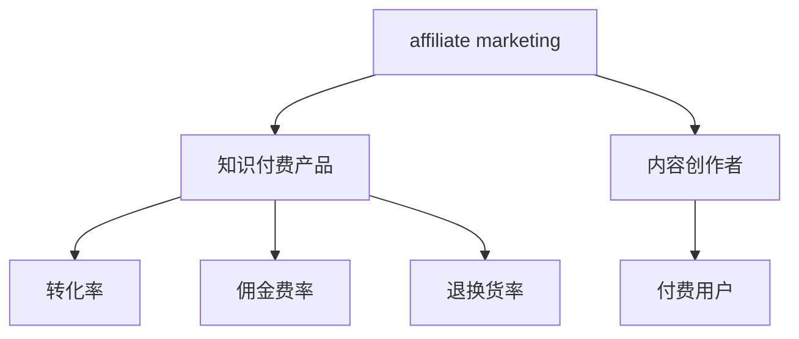

                 

# 如何利用affiliate营销推广知识付费产品

## 1. 背景介绍

随着互联网的发展和普及，越来越多的人开始寻求在线学习，以便不断提升个人技能和知识储备。这其中，知识付费产品成为了一种趋势，通过购买高质量的课程和书籍，用户能够获得结构化的知识和技能，迅速提升自身竞争力。然而，知识付费产品的推广一直是个难题。传统依赖广告和SEO的方式成本高、效果差，而利用affiliate营销可以更加高效地推广知识付费产品，为内容创作者带来可观的收益。

## 2. 核心概念与联系

### 2.1 核心概念概述

为更好地理解affiliate营销在知识付费产品中的应用，本节将介绍几个关键概念：

- **affiliate marketing**: 即联盟营销，指的是商家通过网络平台，将用户导向其他商家并从中获取佣金的模式。在知识付费领域，可以看作是将用户引流至特定的付费课程或书籍，从而实现佣金收益。

- **知识付费产品**: 指通过在线平台提供的各类付费课程、电子书、专业工具等内容产品，用户购买后获取有价值的知识或技能。常见的知识付费平台包括Coursera、Udemy、网易云课堂等。

- **内容创作者**: 指通过制作有价值的内容，吸引用户并产生付费转化。内容形式可以是文字、视频、音频、图片等。内容创作者通过affiliate营销可以直接从每次用户购买行为中获得收益。

- **转化率**: 指通过广告、推广等手段，将用户流量转化为付费用户的比例。高效的转化率是affiliate营销成功的关键。

- **佣金费率**: 即联盟平台给予内容创作者的佣金比例。不同平台和产品的佣金费率差异较大，一般为产品销售额的5%至30%不等。

- **退换货率**: 指用户购买产品后的退换货比例。过高的退换货率会严重影响转化率和利润。

这些核心概念之间的逻辑关系可以通过以下Mermaid流程图来展示：



这个流程图展示了affiliate营销的各个环节，从用户引流到最终产生付费，并贯穿整个推广过程的关键指标。

## 3. 核心算法原理 & 具体操作步骤
### 3.1 算法原理概述

利用affiliate营销推广知识付费产品，其核心在于通过广告、推广等手段将用户流量引入课程或书籍，从而实现用户购买并产生收益。算法原理可以简化为以下步骤：

1. 选择合适的联盟平台和产品。
2. 设计吸引人的推广内容。
3. 利用SEO和社交媒体等手段提高曝光率。
4. 监测用户行为，优化推广策略。
5. 获取佣金收益。

### 3.2 算法步骤详解

**Step 1: 选择合适的联盟平台和产品**

选择联盟平台和产品是affiliate营销的第一步，关键在于找到与自己内容匹配度高的平台和产品，以便获得更高的转化率和佣金费率。具体步骤包括：

- 调查市场：了解当前流行的知识付费平台和产品，选择目标用户活跃的平台。
- 查看佣金费率：对比不同平台和产品的佣金费率，选择佣金较高的平台和产品。
- 查看广告政策：了解平台的广告政策，包括广告形式、推广要求、结算方式等。

**Step 2: 设计吸引人的推广内容**

设计吸引人的推广内容是affiliate营销的关键。推广内容要简洁明了，突出产品优势，以吸引用户的注意力。具体步骤包括：

- 制作图文广告：使用吸引人的标题和图片，展示课程或书籍的特点和价值。
- 编写推广文案：使用简洁、有力的语言，强调产品优势和用户收益，提高点击率。
- 使用推荐信和用户评价：利用用户的好评和推荐，增加信任度和吸引力。

**Step 3: 利用SEO和社交媒体等手段提高曝光率**

曝光率是affiliate营销成功的关键，通过提高产品页面的搜索引擎排名，以及利用社交媒体等渠道进行推广，可以吸引更多的潜在用户。具体步骤包括：

- 关键词优化：通过关键词优化，提高产品页面在搜索引擎中的排名。
- 社交媒体推广：利用Twitter、Facebook、WeChat等社交媒体平台，进行广泛的推广。
- 视频推广：制作产品相关的短视频，提高曝光率和吸引力。

**Step 4: 监测用户行为，优化推广策略**

在推广过程中，通过监测用户行为，不断优化推广策略，可以提高转化率和效率。具体步骤包括：

- 设置跟踪代码：通过设置跟踪代码，实时监测用户的点击、浏览、购买等行为。
- 分析数据：利用数据分析工具，了解用户的兴趣和行为模式。
- 优化推广内容：根据数据反馈，优化推广内容，提高转化率。

**Step 5: 获取佣金收益**

一旦用户完成购买，内容创作者即可获取佣金收益。具体步骤包括：

- 提交订单：用户完成购买后，提交订单信息，联盟平台进行结算。
- 收取佣金：联盟平台将佣金直接支付给内容创作者。

### 3.3 算法优缺点

利用affiliate营销推广知识付费产品，具有以下优点：

1. **成本低**：无需大量资金投入，只需设计推广内容和利用已有资源即可。
2. **效果显著**：通过精准的推广内容设计和曝光手段，可以获得较高的转化率和收益。
3. **风险低**：联盟平台承担大部分风险，内容创作者只需负责推广内容的制作。

同时，该方法也存在一定的局限性：

1. **依赖平台**：联盟平台的政策和技术支持对推广效果有很大影响，平台政策变化可能导致收益降低。
2. **效果不稳定**：推广内容设计和曝光手段需不断优化，才能保持稳定的转化率。
3. **难以控制**：用户行为和市场需求难以完全控制，推广效果存在不确定性。

尽管存在这些局限性，但affiliate营销在知识付费产品推广中仍具有重要地位，特别是在中小企业和独立内容创作者中广泛应用。

### 3.4 算法应用领域

affiliate营销作为一种有效的推广手段，不仅在知识付费产品推广中得到广泛应用，还在多个领域展示了其巨大的潜力：

- **电子商务**：利用联盟营销推广商品，提高销量和品牌知名度。
- **健康保健**：推广各类健康产品、服务，如保健品、瑜伽课程、健康咨询等。
- **旅游出行**：推广旅游景点、酒店、旅行社等，吸引用户预订旅游产品。
- **金融理财**：推广各类理财课程、基金产品，吸引用户进行投资。
- **教育培训**：推广各类在线课程、书籍、学习工具等，吸引学生和专业人士提升技能。

以上领域只是affiliate营销应用的冰山一角，随着技术的不断进步和市场需求的变化，affiliate营销的应用场景将更加广泛。

## 4. 数学模型和公式 & 详细讲解 & 举例说明
### 4.1 数学模型构建

affiliate营销的数学模型可以简化为以下公式：

$$
R = C \times CR \times CRR \times P
$$

其中：
- $R$ 为联盟平台给予内容创作者的佣金收益。
- $C$ 为每次点击的成本（CPC）或展示成本（CPM）。
- $CR$ 为点击转化率。
- $CRR$ 为购买转化率。
- $P$ 为平均每用户收益（Lifetime Value, LTV）。

通过优化各个变量，可以最大化收益。

### 4.2 公式推导过程

- **点击成本（CPC）**：每次点击支付的成本，如点击广告时的实际花费。
- **展示成本（CPM）**：每千次展示支付的成本，如展示横幅广告时的实际花费。
- **点击转化率（CR）**：点击广告后完成购买的概率，即点击行为转化为购买行为的效率。
- **购买转化率（CRR）**：广告展示后完成购买的概率，即展示行为转化为购买行为的效率。
- **平均每用户收益（LTV）**：用户购买后产生的平均收益，即每个用户带来的利润。

根据以上公式，内容创作者可以通过控制点击成本、展示成本、点击转化率、购买转化率和平均每用户收益，来最大化自己的收益。

### 4.3 案例分析与讲解

以下是一个affiliate营销的实际案例分析：

**案例背景**：某在线教育平台提供各类职业技能培训课程，希望通过affiliate营销推广其课程，提高用户购买率和收益。

**推广内容设计**：
- 制作课程推广广告：标题为“掌握Python编程，成为高薪软件开发工程师”，展示课程内容、老师介绍、学员评价等信息。
- 编写推广文案：使用简洁有力的语言，强调课程的实用性、老师的专业性和学员的高满意度。
- 利用社交媒体推广：在Facebook、WeChat、LinkedIn等平台上进行推广，覆盖潜在用户群体。
- 设置跟踪代码：在广告链接中嵌入跟踪代码，实时监测用户的点击、浏览和购买行为。

**数据监测与优化**：
- 监测点击数据：使用Google Analytics等工具，实时了解广告点击情况。
- 分析用户行为：通过数据分析，了解用户兴趣和行为模式。
- 优化推广内容：根据数据反馈，优化推广内容，提高点击率和转化率。

**收益计算**：
- 假设每次点击成本为$0.1元，点击转化率为5%，购买转化率为3%，平均每用户收益为200元。
- 计算每次点击的收益：$0.1 \times 5\% \times 3\% = 0.000015$元。
- 计算每次展示的收益：$0.1 \times 3\% = 0.003$元。

## 5. 项目实践：代码实例和详细解释说明
### 5.1 开发环境搭建

在进行affiliate营销实践前，我们需要准备好开发环境。以下是使用Python进行affiliate营销代码实现的环境配置流程：

1. 安装Anaconda：从官网下载并安装Anaconda，用于创建独立的Python环境。

2. 创建并激活虚拟环境：
```bash
conda create -n affiliate-env python=3.8 
conda activate affiliate-env
```

3. 安装必要的Python库：
```bash
pip install requests beautifulsoup4 pandas
```

4. 设置联盟平台API密钥和参数：
```bash
echo "YOUR_API_KEY=your_api_key" >> .env
echo "YOUR_PARTNER_ID=your_partner_id" >> .env
```

5. 编写affiliate营销代码：
```python
from flask import Flask, request, jsonify
import requests

app = Flask(__name__)

@app.route('/track', methods=['POST'])
def track_click():
    # 获取联盟平台API密钥和参数
    api_key = request.environ.get('API_KEY')
    partner_id = request.environ.get('PARTNER_ID')
    
    # 解析请求参数
    click_id = request.json.get('click_id')
    click_cost = request.json.get('click_cost')
    click_rate = request.json.get('click_rate')
    purchase_rate = request.json.get('purchase_rate')
    ltv = request.json.get('ltv')
    
    # 计算每次点击的收益
    click_revenue = click_cost * click_rate * purchase_rate
    
    # 发送请求给联盟平台
    url = f"https://api.affiliate.com/click/{click_id}?api_key={api_key}&partner_id={partner_id}&click_revenue={click_revenue}&ltv={ltv}"
    response = requests.get(url)
    
    # 返回联盟平台响应
    return jsonify(response.json())

if __name__ == '__main__':
    app.run(debug=True)
```

### 5.2 源代码详细实现

以下是一个简单的affiliate营销服务器的实现代码：

```python
from flask import Flask, request, jsonify
import requests

app = Flask(__name__)

@app.route('/track', methods=['POST'])
def track_click():
    # 获取联盟平台API密钥和参数
    api_key = request.environ.get('API_KEY')
    partner_id = request.environ.get('PARTNER_ID')
    
    # 解析请求参数
    click_id = request.json.get('click_id')
    click_cost = request.json.get('click_cost')
    click_rate = request.json.get('click_rate')
    purchase_rate = request.json.get('purchase_rate')
    ltv = request.json.get('ltv')
    
    # 计算每次点击的收益
    click_revenue = click_cost * click_rate * purchase_rate
    
    # 发送请求给联盟平台
    url = f"https://api.affiliate.com/click/{click_id}?api_key={api_key}&partner_id={partner_id}&click_revenue={click_revenue}&ltv={ltv}"
    response = requests.get(url)
    
    # 返回联盟平台响应
    return jsonify(response.json())

if __name__ == '__main__':
    app.run(debug=True)
```

### 5.3 代码解读与分析

让我们再详细解读一下关键代码的实现细节：

**Flask框架**：
- 使用Flask框架搭建一个简单的affiliate营销服务器。
- 设置路由`/track`，处理点击事件的跟踪请求。

**环境变量配置**：
- 通过设置.env文件，配置联盟平台的API密钥和参数，以便在代码中使用。
- 在Flask应用中使用`request.environ.get`方法获取环境变量。

**请求处理**：
- 解析请求参数，获取点击ID、点击成本、点击率、购买率和平均每用户收益。
- 计算每次点击的收益。
- 发送请求给联盟平台API，获取联盟平台的响应。
- 返回联盟平台的响应。

### 5.4 运行结果展示

在实际应用中，affiliate营销服务器可以部署在云平台上，接受用户点击事件的异步请求，并实时计算收益，向联盟平台发送跟踪请求，获取联盟平台响应。这样，内容创作者可以实时了解推广效果，优化推广策略，最大化收益。

## 6. 实际应用场景

### 6.1 在线教育平台推广

在线教育平台通过affiliate营销推广各类职业技能培训课程，覆盖广泛用户群体，吸引潜在用户购买，提升平台知名度和用户数。联盟平台提供详细的数据分析工具，帮助平台了解用户行为和转化率，优化推广策略。

### 6.2 健康产品推广

健康产品公司通过affiliate营销推广各类保健品、健康课程和咨询服务，吸引用户关注和购买，提升品牌影响力和用户黏性。联盟平台提供实时的点击和购买数据，帮助健康产品公司优化推广内容，提高转化率。

### 6.3 旅游产品推广

旅游公司通过affiliate营销推广各类旅游产品、景点和酒店，吸引用户预订旅游套餐和单项服务，提升旅游产品销售和用户满意度。联盟平台提供详细的转化率和用户行为数据，帮助旅游公司优化推广策略，提高收益。

### 6.4 金融理财产品推广

金融公司通过affiliate营销推广各类理财课程、基金产品、投资服务，吸引用户进行理财和投资，提升金融公司品牌影响力和用户忠诚度。联盟平台提供实时的点击和购买数据，帮助金融公司优化推广策略，提高收益。

## 7. 工具和资源推荐

### 7.1 学习资源推荐

为了帮助开发者系统掌握affiliate营销的理论基础和实践技巧，这里推荐一些优质的学习资源：

1. **联盟营销官网**：各大联盟平台如Amazon Affiliate、Google AdSense等提供的官方文档和教程，深入浅出地介绍了联盟营销的基础知识、政策和收益计算方法。

2. **联盟营销书籍**：如《联盟营销的秘诀》、《affiliate营销实战指南》等，系统全面地介绍了affiliate营销的各个环节和策略。

3. **在线课程**：如Coursera、Udemy等平台提供的affiliate营销课程，系统学习affiliate营销的理论基础和实战技巧。

4. **联盟营销博客和社区**：如AffiliateMarketingGuru、联盟营销网等，汇聚了大量实战经验和案例分享，可供学习和借鉴。

5. **联盟营销工具**：如Google Analytics、Clicky等，提供详细的点击、转化和收益数据分析工具，帮助内容创作者优化推广策略。

通过这些学习资源的学习实践，相信你一定能够快速掌握affiliate营销的精髓，并用于解决实际的推广问题。

### 7.2 开发工具推荐

高效的开发离不开优秀的工具支持。以下是几款用于affiliate营销开发的常用工具：

1. **Google Analytics**：提供详细的网站流量、点击、转化和收益数据，帮助内容创作者优化推广策略。

2. **Clicky**：提供实时的网站点击和流量分析，帮助内容创作者实时了解推广效果。

3. **Hotjar**：提供用户行为热图和点击路径分析，帮助内容创作者优化推广内容和用户体验。

4. **Flask**：基于Python的开源web框架，轻量级、易用性强，适合快速迭代研究。

5. **联盟营销API**：各大联盟平台提供的API接口，方便内容创作者实时监测点击和收益。

6. **SEO工具**：如SEMrush、Ahrefs等，提供详细的SEO优化建议和关键词排名数据，帮助内容创作者提高曝光率。

合理利用这些工具，可以显著提升affiliate营销任务的开发效率，加快创新迭代的步伐。

### 7.3 相关论文推荐

affiliate营销作为一种高效的推广手段，已经得到了广泛的研究。以下是几篇奠基性的相关论文，推荐阅读：

1. **点击和转化率优化**：研究如何通过优化广告内容和推广策略，提高点击率和转化率，提升联盟营销效果。

2. **联盟平台收益计算**：探讨不同联盟平台和产品模型的收益计算方法和策略，帮助内容创作者最大化收益。

3. **联盟营销模型**：提出基于机器学习的联盟营销模型，通过预测用户行为和转化率，优化推广策略和投放时间。

4. **联盟平台政策**：分析不同联盟平台的政策和收益计算方法，帮助内容创作者选择最合适的联盟平台。

5. **联盟营销案例研究**：分享各类affiliate营销的成功案例，提供实战经验和借鉴。

这些论文代表了大联盟营销的发展脉络。通过学习这些前沿成果，可以帮助研究者把握学科前进方向，激发更多的创新灵感。

## 8. 总结：未来发展趋势与挑战

### 8.1 总结

本文对affiliate营销在知识付费产品中的应用进行了全面系统的介绍。首先阐述了affiliate营销的背景和意义，明确了affiliate营销在推广知识付费产品中的独特价值。其次，从原理到实践，详细讲解了affiliate营销的数学模型和具体操作步骤，给出了affiliate营销任务开发的完整代码实例。同时，本文还广泛探讨了affiliate营销在多个行业领域的应用前景，展示了affiliate营销的巨大潜力。此外，本文精选了affiliate营销的相关学习资源，力求为读者提供全方位的技术指引。

通过本文的系统梳理，可以看到，利用affiliate营销推广知识付费产品，是实现快速高效推广的有效途径。不仅能够降低推广成本，提升转化率和收益，还能实现联盟平台与内容创作者的共赢。未来，伴随联盟平台和内容创作者的共同努力，affiliate营销必将在知识付费产品推广中发挥更大的作用。

### 8.2 未来发展趋势

展望未来，affiliate营销将呈现以下几个发展趋势：

1. **自动化优化**：利用机器学习和大数据技术，自动优化推广内容和投放策略，提高转化率和收益。
2. **跨平台整合**：将不同平台的数据和分析工具整合，提供统一的联盟营销解决方案，提升效率和效果。
3. **用户行为分析**：利用先进的数据分析技术，深入了解用户行为和需求，提供更加精准的推广内容。
4. **多元化推广**：结合内容创作、广告投放、社交媒体等多种手段，形成多渠道、多策略的推广体系。
5. **实时监测**：提供实时的点击、转化和收益数据，帮助内容创作者实时优化推广策略，提高效果。

以上趋势凸显了affiliate营销技术的广阔前景。这些方向的探索发展，必将进一步提升affiliate营销的效果和应用范围，为内容创作者带来更多的机会和收益。

### 8.3 面临的挑战

尽管affiliate营销在知识付费产品推广中取得了显著成效，但在迈向更加智能化、普适化应用的过程中，它仍面临着诸多挑战：

1. **联盟平台政策变化**：联盟平台的政策和技术支持对推广效果有很大影响，平台政策变化可能导致收益降低。
2. **推广效果不稳定**：推广内容设计和曝光手段需不断优化，才能保持稳定的转化率。
3. **广告成本高**：广告投放成本较高，特别是高质量点击的获取难度较大。

尽管存在这些挑战，但affiliate营销作为一种高效的推广手段，仍具有重要的市场价值，特别是在中小企业和独立内容创作者中广泛应用。未来，内容创作者需要不断探索新的推广渠道和方法，优化推广策略，以应对市场变化和竞争压力。

### 8.4 研究展望

面对affiliate营销面临的种种挑战，未来的研究需要在以下几个方面寻求新的突破：

1. **自动化优化**：开发更加智能化的优化算法，利用机器学习和大数据分析，自动化优化推广策略，提高效果和效率。
2. **跨平台整合**：研究如何将不同联盟平台的数据和分析工具整合，提供统一的联盟营销解决方案，提升效果和效率。
3. **用户行为分析**：利用先进的数据分析技术，深入了解用户行为和需求，提供更加精准的推广内容。
4. **多元化推广**：结合内容创作、广告投放、社交媒体等多种手段，形成多渠道、多策略的推广体系。
5. **实时监测**：提供实时的点击、转化和收益数据，帮助内容创作者实时优化推广策略，提高效果。

这些研究方向的探索，必将引领affiliate营销技术迈向更高的台阶，为内容创作者提供更加高效、精准、可靠的推广手段。只有勇于创新、敢于突破，才能不断拓展affiliate营销的边界，让内容创作者实现更大的收益。

## 9. 附录：常见问题与解答

**Q1：如何选择合适的联盟平台和产品？**

A: 选择联盟平台和产品是affiliate营销的第一步，关键在于找到与自己内容匹配度高的平台和产品，以便获得更高的转化率和佣金费率。具体步骤包括：
1. 调查市场：了解当前流行的联盟平台和产品，选择目标用户活跃的平台。
2. 查看佣金费率：对比不同平台和产品的佣金费率，选择佣金较高的平台和产品。
3. 查看广告政策：了解平台的广告政策，包括广告形式、推广要求、结算方式等。

**Q2：如何进行有效的推广内容设计？**

A: 设计吸引人的推广内容是affiliate营销的关键。推广内容要简洁明了，突出产品优势，以吸引用户的注意力。具体步骤包括：
1. 制作图文广告：使用吸引人的标题和图片，展示课程或书籍的特点和价值。
2. 编写推广文案：使用简洁有力的语言，强调产品优势和用户收益，提高点击率。
3. 使用推荐信和用户评价：利用用户的好评和推荐，增加信任度和吸引力。

**Q3：如何利用SEO和社交媒体等手段提高曝光率？**

A: 曝光率是affiliate营销成功的关键，通过提高产品页面的搜索引擎排名，以及利用社交媒体等渠道进行推广，可以吸引更多的潜在用户。具体步骤包括：
1. 关键词优化：通过关键词优化，提高产品页面在搜索引擎中的排名。
2. 社交媒体推广：利用Twitter、Facebook、WeChat等社交媒体平台，进行广泛的推广。
3. 视频推广：制作产品相关的短视频，提高曝光率和吸引力。

**Q4：如何监测用户行为，优化推广策略？**

A: 在推广过程中，通过监测用户行为，不断优化推广策略，可以提高转化率和效率。具体步骤包括：
1. 设置跟踪代码：通过设置跟踪代码，实时监测用户的点击、浏览和购买行为。
2. 分析数据：利用数据分析工具，了解用户的兴趣和行为模式。
3. 优化推广内容：根据数据反馈，优化推广内容，提高点击率和转化率。

**Q5：如何获取佣金收益？**

A: 一旦用户完成购买，内容创作者即可获取佣金收益。具体步骤包括：
1. 提交订单：用户完成购买后，提交订单信息，联盟平台进行结算。
2. 收取佣金：联盟平台将佣金直接支付给内容创作者。

---

作者：禅与计算机程序设计艺术 / Zen and the Art of Computer Programming

