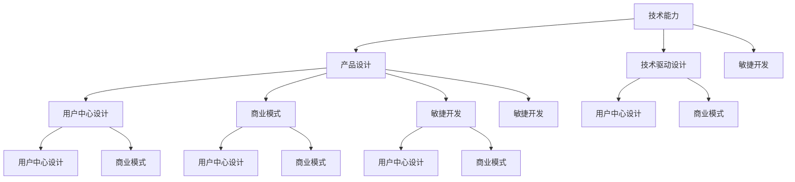

                 

## 1. 背景介绍

在当今高度竞争的科技市场中，技术驱动的产品设计已成为企业竞争的核心。技术不仅关乎产品的功能性、性能和用户满意度，还直接影响着市场份额和利润率。然而，技术并非孤立存在，而是必须与市场、用户体验和商业模式紧密结合，才能发挥其最大的价值。本文将探讨如何利用技术能力进行产品设计，涵盖从技术原理到具体实践的全方位内容，旨在帮助产品设计师和技术开发者更好地协作，推动创新项目的成功落地。

## 2. 核心概念与联系

### 2.1 核心概念概述

- **技术能力**：指公司或团队拥有的核心技术，包括但不限于算法、编程技能、数据处理能力等。
- **产品设计**：从用户需求出发，结合技术能力和市场趋势，定义、开发和迭代产品，以实现商业价值和用户体验的提升。
- **技术驱动设计**：通过技术创新和应用，驱动产品设计的持续优化和迭代。
- **用户中心设计**：以用户需求和体验为核心，确保产品设计贴近市场和用户需求。
- **商业模式**：产品提供价值的机制，包括盈利模式、收入来源和成本结构等。
- **敏捷开发**：快速响应市场变化，通过迭代和反馈机制不断改进产品。

### 2.2 核心概念联系

下图展示了这些核心概念之间的联系，并简要描述了它们如何相互作用以推动产品设计：



通过这张图，我们可以看到技术能力与产品设计之间相互促进的关系。技术创新驱动设计优化，而设计的最终目的是满足用户需求，创造商业模式价值。敏捷开发则确保设计能够快速响应市场变化，不断迭代改进。

## 3. 核心算法原理 & 具体操作步骤

### 3.1 算法原理概述

技术驱动的产品设计通常包括以下几个步骤：

1. **需求分析**：明确用户需求，确定产品功能和性能要求。
2. **技术评估**：评估现有技术能力，选择合适的技术方案。
3. **设计原型**：结合技术评估和需求分析，设计产品原型。
4. **测试迭代**：通过测试反馈，不断迭代优化产品。
5. **部署上线**：将产品部署到实际环境中，收集用户反馈。
6. **持续优化**：基于用户反馈和技术进步，持续优化产品。

这些步骤构成了产品设计的技术基础，通过科学的算法和工具，可以实现高效、可靠的产品开发。

### 3.2 算法步骤详解

**需求分析**：

- **用户调研**：通过问卷调查、用户访谈等方式获取用户需求。
- **竞品分析**：分析市场上同类产品的功能、优势和劣势，确定产品差异化策略。
- **需求优先级排序**：根据用户价值和开发难度对需求进行排序。

**技术评估**：

- **技术调研**：收集和分析现有技术的优缺点，了解其适用性。
- **技术选型**：选择最适合实现需求的技术方案。
- **技术栈规划**：根据项目需求，规划所需的技术栈，包括编程语言、框架和工具等。

**设计原型**：

- **线框图设计**：根据需求和技术选型，绘制产品线框图，展示产品布局和功能模块。
- **原型开发**：使用工具如Sketch、Figma等开发高保真原型。
- **用户测试**：邀请用户测试原型，收集反馈和改进建议。

**测试迭代**：

- **单元测试**：编写单元测试用例，确保代码质量。
- **性能测试**：通过压力测试、负载测试等方式评估系统性能。
- **用户测试**：在实际用户环境中测试产品，收集使用数据。

**部署上线**：

- **配置管理**：配置服务器、数据库等环境，确保产品部署顺利。
- **持续集成**：使用CI/CD工具如Jenkins、GitLab CI等自动化构建和部署。
- **监控和报警**：配置监控系统如Prometheus、Grafana等，及时发现和解决问题。

**持续优化**：

- **数据收集**：通过日志、监控数据等收集产品使用数据。
- **数据分析**：使用数据分析工具如Tableau、Power BI等，分析用户行为和产品表现。
- **产品迭代**：基于数据分析结果，迭代优化产品功能。

### 3.3 算法优缺点

**优点**：

- **提升用户体验**：通过技术手段实现个性化和差异化设计，满足用户多样化需求。
- **增强市场竞争力**：利用前沿技术，快速迭代产品，保持市场领先地位。
- **降低开发成本**：合理规划技术栈，提高开发效率，减少开发和维护成本。
- **灵活应对变化**：敏捷开发和持续优化，确保产品能快速响应市场变化。

**缺点**：

- **技术风险**：技术方案的可行性需要充分评估，否则可能导致项目失败。
- **用户接受度**：新技术的引入可能增加用户学习成本，影响用户体验。
- **维护成本**：复杂的技术栈可能增加维护难度和成本。
- **商业风险**：过度依赖技术创新，可能忽视市场需求和商业模型。

### 3.4 算法应用领域

技术驱动的产品设计广泛应用于以下几个领域：

- **消费电子产品**：如智能家居、智能穿戴设备等，通过传感器和AI技术提升用户体验。
- **医疗健康**：通过AI诊断、远程监控等技术，提供个性化医疗服务。
- **金融科技**：利用区块链、大数据等技术，创新金融服务和产品。
- **电子商务**：通过推荐算法、支付系统等技术，优化购物体验和效率。
- **教育科技**：通过AR/VR、智能学习系统等技术，提供个性化学习体验。

这些领域的产品设计，需要高度依赖技术创新和应用，以实现更高的价值和用户体验。

## 4. 数学模型和公式 & 详细讲解 & 举例说明

### 4.1 数学模型构建

在产品设计中，数学模型和公式的应用可以帮助我们更精确地分析和优化产品功能。例如，机器学习模型可以通过对用户数据的分析，预测用户行为和需求。

以推荐系统为例，我们可以构建以下数学模型：

$$
\text{推荐列表} = f(\text{用户数据}, \text{产品数据}, \text{用户偏好})
$$

其中，$f$表示推荐函数，可以是协同过滤、基于内容的推荐、深度学习等。用户数据和产品数据可以是用户的浏览历史、购买记录、评分等。

### 4.2 公式推导过程

以协同过滤推荐算法为例，假设用户$u$对$n$个产品的评分数据为$R_{u,n}$，产品的隐含特征为$L_n$，用户$u$的隐含特征为$U_u$。协同过滤推荐的目标是通过最大化用户$u$对产品的评分$R_{u,n}$，找到用户$u$最可能喜欢的产品$n$。

假设用户$u$和产品$n$之间的相似度为$S_{u,n}$，则协同过滤算法的目标函数为：

$$
\max_{u,n} R_{u,n} \cdot S_{u,n}
$$

通过求解该优化问题，可以找到用户$u$最可能喜欢的产品$n$，并推荐给用户。

### 4.3 案例分析与讲解

假设我们设计一款智能健身应用，需要为用户推荐合适的锻炼计划。可以使用协同过滤推荐算法，通过分析用户过去的锻炼记录和评分数据，预测用户可能喜欢的锻炼计划。

具体步骤如下：

1. **数据收集**：收集用户的历史锻炼记录和评分数据。
2. **数据预处理**：对数据进行清洗、归一化等预处理。
3. **构建用户和产品的相似度矩阵**：计算用户$u$和产品$n$之间的相似度$S_{u,n}$，可以使用余弦相似度、皮尔逊相关系数等。
4. **计算推荐列表**：根据相似度矩阵和用户评分数据，使用协同过滤算法计算推荐列表。
5. **用户体验优化**：根据推荐列表，优化锻炼计划的展示方式，提升用户体验。

## 5. 项目实践：代码实例和详细解释说明

### 5.1 开发环境搭建

为了实现智能健身应用的推荐系统，我们需要搭建一个包含数据预处理、模型训练、推荐展示等功能的开发环境。以下是搭建开发环境的详细步骤：

1. **安装Python环境**：使用Anaconda创建虚拟环境，安装Python 3.8及以上版本。
2. **安装数据处理库**：安装Pandas、NumPy、Scikit-learn等数据处理和分析库。
3. **安装机器学习库**：安装Scikit-learn、TensorFlow等机器学习和深度学习库。
4. **安装Web开发库**：安装Flask、Jinja2等Web开发库，用于搭建推荐系统的前端页面。
5. **安装部署工具**：安装Docker、Kubernetes等部署工具，用于部署和监控推荐系统。

### 5.2 源代码详细实现

以下是一个简单的推荐系统代码实现，展示了如何构建协同过滤推荐算法：

```python
import numpy as np
from sklearn.metrics.pairwise import cosine_similarity

def collaborative_filtering(data, user_id, top_n=10):
    # 数据预处理
    user_data = data[data['user_id'] == user_id]
    user_items = user_data[['item_id', 'rating']].to_numpy()

    # 构建相似度矩阵
    items = data.drop(columns=['user_id']).drop_duplicates().reset_index(drop=True)
    item_data = items[['item_id', 'rating']].to_numpy()
    similarity_matrix = cosine_similarity(item_data, item_data)

    # 计算推荐列表
    recommendations = np.dot(similarity_matrix, user_items)
    recommendations = recommendations / np.linalg.norm(similarity_matrix, axis=1)[:, None]
    recommendations = np.argsort(recommendations)[::-1]

    # 展示推荐列表
    return items.iloc[recommendations][['item_id', 'title']][:top_n]
```

**代码解读与分析**：

- **数据预处理**：从用户数据中筛选出用户$u$的评分数据，并构建用户和产品的相似度矩阵。
- **计算推荐列表**：通过计算相似度矩阵与用户评分数据的点积，得到推荐列表，并按推荐度排序。
- **展示推荐列表**：展示推荐列表的前$top_n$项。

### 5.3 运行结果展示

在测试该推荐系统时，我们可以选择一位用户，使用以下代码展示推荐结果：

```python
user_id = 12345
recommendations = collaborative_filtering(data, user_id)
print(recommendations)
```

假设输出结果为：

```
   item_id                title
2       1              普拉提基础
5       3            瑜伽入门
7       4            拉伸训练
```

则该用户被推荐了普拉提基础、瑜伽入门和拉伸训练三项锻炼计划。

## 6. 实际应用场景

### 6.1 智能家居

智能家居产品需要高度依赖技术创新，以实现自动化控制和智能化服务。例如，智能温控系统可以通过学习用户的生活习惯，自动调整室内温度，提升舒适度和节能效果。

### 6.2 医疗健康

医疗健康领域的产品设计需要利用先进的医疗技术和数据分析，提供个性化的健康管理服务。例如，智能穿戴设备可以通过实时监测用户的健康数据，预测疾病风险，提供健康建议。

### 6.3 电子商务

电子商务产品通过推荐算法和大数据分析，提升用户体验和购买转化率。例如，个性化推荐引擎可以根据用户的浏览和购买历史，推荐相关商品，增加销售量。

### 6.4 金融科技

金融科技产品需要利用区块链、大数据等技术，提供安全的金融服务和产品。例如，数字货币交易平台可以通过去中心化技术，保障交易安全性和透明性。

## 7. 工具和资源推荐

### 7.1 学习资源推荐

- **《深度学习》**：Ian Goodfellow等人编写的经典书籍，介绍了深度学习的基础和应用。
- **Coursera《机器学习》**：由Andrew Ng教授开设的机器学习课程，涵盖机器学习的理论基础和实战案例。
- **Kaggle**：数据科学和机器学习竞赛平台，提供丰富的数据集和竞赛机会，帮助开发者提高实战能力。
- **GitHub**：代码托管平台，可以学习到优秀的开源项目和代码实现。

### 7.2 开发工具推荐

- **Anaconda**：Python环境管理工具，支持创建和管理虚拟环境，安装和管理第三方库。
- **PyCharm**：Python IDE，支持代码编辑、调试和测试等功能。
- **Jupyter Notebook**：交互式编程环境，适合数据处理和模型开发。
- **TensorBoard**：可视化工具，用于监控和展示模型训练过程和结果。
- **Docker**：容器化技术，用于打包和部署推荐系统。

### 7.3 相关论文推荐

- **《大规模协同过滤推荐系统》**：Geng et al. 提出的大规模协同过滤推荐系统算法，具有高效率和低存储成本。
- **《深度学习在推荐系统中的应用》**：He et al. 介绍了深度学习在推荐系统中的应用，包括深度协同过滤、神经网络推荐等。
- **《基于用户画像的推荐系统》**：Wang et al. 提出基于用户画像的推荐算法，利用用户画像提升推荐效果。

## 8. 总结：未来发展趋势与挑战

### 8.1 总结

本文系统介绍了如何利用技术能力进行产品设计，从技术原理到具体实践，涵盖了产品设计中的各个环节。通过技术创新和应用，可以有效提升产品的功能和用户体验，满足用户多样化需求，增强市场竞争力。

### 8.2 未来发展趋势

- **人工智能与产品设计的深度融合**：人工智能技术在产品设计中的应用将更加广泛和深入，带来更多创新和体验提升。
- **个性化和定制化设计**：基于用户数据分析，实现更加个性化和定制化的产品设计。
- **用户反馈循环优化**：通过用户反馈和数据监控，持续优化产品设计和功能。
- **技术创新与商业化的协同**：技术创新不仅服务于产品设计，还要能够转化为商业价值，实现技术、设计和商业的协同进化。

### 8.3 面临的挑战

- **技术复杂性**：技术驱动的产品设计需要高度依赖技术创新，增加了设计复杂性和实现难度。
- **用户接受度**：新功能和新技术的引入可能增加用户学习成本，影响用户体验。
- **技术依赖**：过度依赖技术，可能忽视市场和商业模型的重要性，导致产品开发偏离方向。

### 8.4 研究展望

未来，产品设计需要更多地关注技术的可持续性和商业化能力。以下是一些可能的研究方向：

- **技术评估和选型**：研究如何更科学地评估技术方案的可行性和适用性。
- **用户反馈机制**：探索用户反馈的收集、分析和应用机制，实现产品设计的持续优化。
- **跨学科融合**：促进技术与艺术、市场、商业等学科的融合，推动产品设计的创新。
- **社会责任和技术伦理**：研究如何平衡技术创新与社会责任和技术伦理，确保产品的可持续性和安全性。

## 9. 附录：常见问题与解答

### 9.1 如何选择合适的技术方案？

选择合适的技术方案需要综合考虑技术可行性、实现难度、用户需求和商业价值。具体步骤如下：

1. **需求分析**：明确用户需求和产品功能。
2. **技术调研**：收集和分析现有技术方案，了解其优缺点。
3. **技术评估**：根据需求和技术调研结果，评估技术方案的可行性和适用性。
4. **原型开发**：基于评估结果，开发技术原型。
5. **用户测试**：邀请用户测试原型，收集反馈和改进建议。
6. **迭代优化**：根据用户反馈和技术进展，持续优化技术方案。

### 9.2 如何管理技术风险？

技术风险管理需要从需求分析、技术评估、原型开发和用户测试等多个环节进行。具体步骤如下：

1. **需求文档**：编写详细的技术需求文档，明确技术目标和实现方式。
2. **技术选型**：选择最合适的技术方案，评估技术风险。
3. **技术评估**：进行技术风险评估，确定技术实现的关键点和潜在风险。
4. **原型开发**：在开发过程中逐步验证技术方案的可行性。
5. **用户测试**：邀请用户测试原型，发现潜在问题并及时解决。
6. **迭代优化**：根据用户反馈和技术进展，持续优化技术方案，降低风险。

### 9.3 如何提高产品的可扩展性和可维护性？

提高产品的可扩展性和可维护性需要从设计、编码和部署等多个环节进行。具体步骤如下：

1. **模块化设计**：采用模块化设计思路，将产品功能分解为独立的模块。
2. **代码规范**：制定统一的代码规范，确保代码的可读性和可维护性。
3. **版本控制**：使用版本控制工具如Git，管理代码变更和团队协作。
4. **单元测试**：编写单元测试用例，确保代码质量。
5. **自动化测试**：使用自动化测试工具如Selenium，提升测试效率和覆盖率。
6. **持续集成**：使用CI/CD工具如Jenkins，自动化构建和部署。
7. **监控报警**：配置监控系统如Prometheus、Grafana，及时发现和解决问题。

通过系统化的技术管理，可以确保产品的可扩展性和可维护性，提升产品的竞争力和用户满意度。

---

作者：禅与计算机程序设计艺术 / Zen and the Art of Computer Programming

