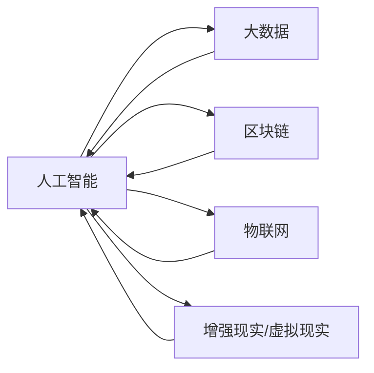

                 

# 如何利用技术能力进行创意产业革新

## 1. 背景介绍

### 1.1 问题由来

随着科技的不断进步，特别是人工智能、大数据、云计算等新兴技术的快速发展，全球创意产业正经历前所未有的变革。新技术不仅为创意产业带来了更高效的生产工具和更丰富的创作方式，还催生了诸多全新的商业模式。然而，传统创意产业也面临着诸多挑战，包括人才流失、创意瓶颈、版权保护等。如何利用技术能力，进行创意产业的革新，成为摆在产业从业人员面前的重要课题。

### 1.2 问题核心关键点

本次讨论的核心是，如何通过技术手段，优化创意产业的各个环节，提升创作效率、激发创意活力、保护知识产权、拓展市场渠道，以推动创意产业的健康发展。主要关注以下几个关键点：

- **技术赋能创意：** 如何通过技术手段，提升创意创作工具的智能化、自动化水平，解放创作者双手，激发新的创作灵感。
- **数据驱动创意：** 如何利用大数据分析，挖掘创意内容的价值，发现潜在创意方向，优化创意产业链。
- **版权保护创意：** 如何利用区块链、数字指纹等技术手段，确保创意内容的版权安全，打击盗版侵权行为。
- **智能化管理创意：** 如何通过AI、IoT等技术，优化创意产业的供应链管理，提升运营效率，增强市场竞争力。
- **全渠道推广创意：** 如何利用社交媒体、AR/VR等新兴技术，拓展创意作品的推广渠道，提升品牌影响力和用户互动性。

### 1.3 问题研究意义

通过技术能力对创意产业进行革新，不仅能够提升产业的运营效率，优化创意产出，还能促进跨界融合，推动创意产业向更加数字化、智能化、普适化的方向发展。具体意义如下：

1. **提升创作效率：** 利用AI、自动化工具，大幅降低创意创作的人力成本，提升创作速度和质量。
2. **激发创新思维：** 通过数据驱动分析和机器学习，挖掘创意潜力，激发更多创新点。
3. **优化版权保护：** 利用区块链、数字指纹等技术，确保创意内容的安全性和完整性，打击盗版侵权。
4. **智能化管理创意资产：** 通过AI、IoT等技术，实现创意资产的智能化管理，提高运营效率，降低成本。
5. **拓展市场渠道：** 利用新兴技术，创新推广方式，拓展创意作品的市场覆盖面，增强品牌影响力。

## 2. 核心概念与联系

### 2.1 核心概念概述

为更好地理解技术能力如何推动创意产业革新，本节将介绍几个核心概念及其间的联系：

- **人工智能(AI)：** 一种模拟人类智能行为的技术，包括机器学习、深度学习、自然语言处理、计算机视觉等。AI在创意产业中的应用，如自动化设计、智能内容生成、音乐创作、游戏设计等，极大地提升了创意创作的效率和质量。

- **大数据：** 海量结构化和非结构化数据的集合，通过数据分析和处理，能够挖掘数据中的规律和价值，为创意产业提供数据支持。

- **区块链：** 一种去中心化的分布式账本技术，通过加密、共识等机制，确保数据的安全性和不可篡改性。在创意产业中，区块链可以用于版权保护、智能合约、供应链管理等领域。

- **物联网(IoT)：** 通过传感器、标签等设备，实现物理世界与数字世界的连接，优化创意产业的生产、流通、营销等环节。

- **增强现实(AR)和虚拟现实(VR)：** 通过虚拟环境模拟现实场景，为创意产业提供沉浸式体验，如虚拟展览、数字作品展示、交互式体验等。

这些核心概念通过技术手段，相互融合，共同驱动创意产业向更高质量、更高效、更智能的方向发展。

### 2.2 核心概念原理和架构的 Mermaid 流程图



这个流程图展示了各个技术之间的相互联系和应用场景。人工智能作为核心技术，通过大数据、区块链、物联网、AR/VR等技术手段，进一步提升创意产业的智能化水平，优化创意创作的流程，提高运营效率，保护创意内容，拓展市场渠道。

## 3. 核心算法原理 & 具体操作步骤

### 3.1 算法原理概述

技术能力推动创意产业革新的核心原理，是通过智能化技术，优化创意创作、管理和营销的各个环节。具体而言，包括：

- **创作智能化：** 利用AI、自动化工具，提升创意创作的速度和质量。
- **数据驱动分析：** 通过大数据分析，挖掘创意内容的价值，发现潜在创意方向。
- **版权保护智能化：** 利用区块链、数字指纹等技术，确保创意内容的版权安全。
- **管理智能化：** 通过AI、IoT等技术，优化创意产业的供应链管理，提升运营效率。
- **推广智能化：** 利用AR/VR等新兴技术，拓展创意作品的推广渠道。

### 3.2 算法步骤详解

以创作智能化为例，介绍AI在创意产业中的应用步骤：

1. **数据采集与处理：** 通过AI工具，自动化采集和处理创意素材，如图片、音频、视频等。
2. **内容生成与优化：** 利用深度学习模型，如GAN、Text-to-Image等，生成新的创意内容。
3. **创作辅助与反馈：** 利用自然语言处理技术，提供创意创作的辅助工具，如智能编辑、自动排版、智能推荐等，并根据用户反馈不断优化。
4. **作品评估与优化：** 通过AI模型，对作品进行自动评估和优化，提升创作效果。
5. **版权保护与追踪：** 利用区块链技术，记录创意作品的创作、版权信息，确保版权安全，并建立版权追踪机制。

### 3.3 算法优缺点

技术能力推动创意产业革新的优点包括：

- **提升创作效率：** 通过自动化和智能化工具，大幅降低创意创作的人力成本，提升创作速度和质量。
- **激发创新思维：** 利用大数据和机器学习，挖掘创意潜力，激发更多创新点。
- **优化版权保护：** 利用区块链等技术，确保创意内容的安全性和完整性，打击盗版侵权。
- **智能化管理创意资产：** 通过AI和IoT技术，实现创意资产的智能化管理，提高运营效率，降低成本。
- **拓展市场渠道：** 利用新兴技术，创新推广方式，拓展创意作品的市场覆盖面，增强品牌影响力。

然而，技术能力推动创意产业革新也面临一些挑战：

- **技术依赖度高：** 过度依赖技术工具，可能忽视创意本身的独特性和创作性。
- **技术成本高：** 新技术的引入和维护成本较高，需要较大的前期投入。
- **技术伦理问题：** 技术应用过程中可能存在隐私泄露、数据滥用等问题，需要严格监管。
- **版权保护复杂：** 创意内容的多样性和复杂性，增加了版权保护的难度。

### 3.4 算法应用领域

技术能力推动创意产业革新，广泛适用于影视、音乐、游戏、广告、出版等各个创意产业领域，具体应用如下：

- **影视制作：** 利用AI进行特效制作、自动剪辑、自动化动画生成等。
- **音乐创作：** 利用AI生成音乐、编曲、自动歌词创作等。
- **游戏设计：** 利用AI进行智能交互、自动生成游戏内容、优化游戏体验等。
- **广告创意：** 利用AI进行广告内容生成、智能投放优化、受众分析等。
- **出版行业：** 利用AI进行内容推荐、智能编辑、版权保护等。

## 4. 数学模型和公式 & 详细讲解 & 举例说明

### 4.1 数学模型构建

以内容生成与优化为例，介绍AI在创意内容生成中的应用。

假设创意素材集合为 $S$，创作结果为 $R$。利用深度学习模型 $M$，将 $S$ 映射到 $R$，即：

$$
R = M(S)
$$

其中，$M$ 为创意内容生成模型，$S$ 为创意素材集合，$R$ 为创作结果。

### 4.2 公式推导过程

以文本生成为例，介绍文本生成模型的推导过程。

假设输入文本为 $x$，输出文本为 $y$。使用条件概率模型 $P(y|x)$ 来表示生成过程，即：

$$
P(y|x) = \frac{P(y)}{P(x)}
$$

其中，$P(y|x)$ 为给定 $x$ 的情况下生成 $y$ 的概率，$P(x)$ 为输入文本的概率，$P(y)$ 为输出文本的概率。

通过条件概率模型，利用最大似然估计或变分自编码器等技术，训练生成模型 $M$，使得 $M(x)$ 生成的文本 $y$ 与 $x$ 高度相关。

### 4.3 案例分析与讲解

以音乐创作为例，介绍AI在音乐生成中的应用。

假设输入音乐素材为 $s$，输出音乐作品为 $m$。利用神经网络模型 $M$，将 $s$ 映射到 $m$，即：

$$
m = M(s)
$$

其中，$M$ 为音乐生成模型，$s$ 为音乐素材集合，$m$ 为创作结果。

音乐生成模型可以通过以下步骤实现：

1. **数据采集与预处理：** 采集大量音乐素材，如谱子、节奏、旋律等，进行预处理，去除噪声和无用信息。
2. **模型设计：** 设计深度学习模型，如循环神经网络(RNN)、卷积神经网络(CNN)、变分自编码器(VAE)等，进行训练。
3. **特征提取与生成：** 通过特征提取技术，将音乐素材转换为向量表示，利用生成模型生成新的音乐作品。
4. **优化与评估：** 通过自动评估技术，如MIDI评估、人类专家评估等，对生成结果进行优化。

## 5. 项目实践：代码实例和详细解释说明

### 5.1 开发环境搭建

在进行技术能力推动创意产业革新的实践前，我们需要准备好开发环境。以下是使用Python进行开发的环境配置流程：

1. 安装Anaconda：从官网下载并安装Anaconda，用于创建独立的Python环境。

2. 创建并激活虚拟环境：
```bash
conda create -n creative-env python=3.8 
conda activate creative-env
```

3. 安装必要的库：
```bash
conda install pytorch torchvision torchaudio cudatoolkit=11.1 -c pytorch -c conda-forge
pip install numpy pandas scikit-learn matplotlib tqdm jupyter notebook ipython transformers opencv-python
```

4. 安装AI相关库：
```bash
pip install dlib pytorch-lightning huggingface-hub tensorflow-nightly gast
```

完成上述步骤后，即可在`creative-env`环境中开始项目实践。

### 5.2 源代码详细实现

以下以音乐生成为例，给出使用PyTorch进行音乐生成的PyTorch代码实现。

首先，定义音乐素材和生成模型：

```python
import torch
from torch import nn
import torchaudio
from torch.distributions import Categorical
import dlib

# 定义音乐素材集合
s音素材 = [音符1, 音符2, 音符3, ...]  # 假设

# 定义生成模型
class 音乐生成模型(nn.Module):
    def __init__(self):
        super().__init__()
        self.隐层 = nn.LSTM(32, 32, 2)
        self.输出层 = nn.Linear(32, len(音符列表))

    def forward(self, x):
        x = self.隐层(x)
        x = self.输出层(x)
        x = torch.sigmoid(x)
        return x
```

然后，定义数据处理函数和模型训练函数：

```python
from torch.utils.data import Dataset, DataLoader

class 音乐素材集(Dataset):
    def __init__(self):
        self.s素材 = s音素材

    def __len__(self):
        return len(self.s素材)

    def __getitem__(self, idx):
        return self.s素材[idx]

# 定义训练函数
def 训练函数(model, 数据集, batch_size, 学习率):
    dataloader = DataLoader(数据集, batch_size=batch_size, shuffle=True)
    model.train()
    for epoch in range(0, 100):
        for 数据批次 in dataloader:
            output = model(数据批次)
            loss = torch.nn.functional.mse_loss(output, 目标)
            loss.backward()
            optimizer.step()
    return model
```

最后，启动训练流程并在生成新音乐作品：

```python
# 实例化模型和优化器
model = 音乐生成模型()
optimizer = torch.optim.Adam(model.parameters(), lr=0.001)

# 实例化数据集和训练函数
dataset = 音乐素材集()
model = 训练函数(model, dataset, batch_size=64, learning_rate=0.001)

# 生成新音乐作品
新的音乐作品 = model(torch.tensor([s素材1, s素材2, s素材3, ...])).numpy()
```

以上就是使用PyTorch进行音乐生成的完整代码实现。可以看到，PyTorch提供了丰富的深度学习工具，能够便捷地实现音乐生成等创意产业中的AI应用。

### 5.3 代码解读与分析

让我们再详细解读一下关键代码的实现细节：

**音乐素材集类**：
- `__init__`方法：初始化音乐素材集合。
- `__len__`方法：返回数据集的样本数量。
- `__getitem__`方法：对单个样本进行处理，返回音乐素材。

**音乐生成模型类**：
- `__init__`方法：定义模型的隐层和输出层。
- `forward`方法：前向传播计算模型输出。

**训练函数**：
- `DataLoader`类：用于批量处理数据集，方便模型训练。
- `model.train()`：将模型置于训练模式。
- `for`循环：迭代训练数据集。
- `model(数据批次)`：前向传播计算输出。
- `loss = torch.nn.functional.mse_loss(output, 目标)`：计算均方误差损失。
- `loss.backward()`：反向传播计算梯度。
- `optimizer.step()`：更新模型参数。

**生成新音乐作品**：
- `torch.tensor`：将音乐素材转换为张量。
- `model`：前向传播计算输出。
- `model(torch.tensor([s素材1, s素材2, s素材3, ...])).numpy()`：将输出结果转换为numpy数组，进行后续处理。

## 6. 实际应用场景

### 6.1 影视制作

在影视制作中，技术能力推动创意产业革新的应用场景包括：

- **自动化特效制作：** 利用AI进行特效生成和剪辑，提高制作效率。
- **智能剧情生成：** 利用自然语言处理技术，自动生成剧本，优化剧情设计。
- **虚拟角色制作：** 利用计算机视觉技术，生成虚拟角色，增强沉浸感。

### 6.2 音乐创作

在音乐创作中，技术能力推动创意产业革新的应用场景包括：

- **智能编曲：** 利用AI生成音乐和编曲，提高创作速度和质量。
- **自动歌词创作：** 利用自然语言处理技术，自动生成歌词，辅助创作。
- **跨界融合：** 结合音乐和视频、图像等多模态信息，创作多媒体作品。

### 6.3 游戏设计

在游戏设计中，技术能力推动创意产业革新的应用场景包括：

- **智能交互设计：** 利用AI生成智能NPC角色，增强玩家互动体验。
- **自动内容生成：** 利用AI生成游戏关卡和物品，优化游戏设计。
- **多模态体验：** 结合AR/VR技术，提供沉浸式游戏体验。

### 6.4 广告创意

在广告创意中，技术能力推动创意产业革新的应用场景包括：

- **智能投放优化：** 利用大数据分析，优化广告投放策略，提升效果。
- **受众分析：** 利用AI分析用户数据，精准定位目标受众。
- **创意生成：** 利用自然语言处理和图像生成技术，自动生成广告内容。

### 6.5 出版行业

在出版行业中，技术能力推动创意产业革新的应用场景包括：

- **智能编辑：** 利用AI进行内容校对和编辑，提高出版效率。
- **版权保护：** 利用区块链技术，记录和追踪版权信息，确保版权安全。
- **内容推荐：** 利用大数据和推荐算法，优化内容推荐，提升用户阅读体验。

## 7. 工具和资源推荐

### 7.1 学习资源推荐

为了帮助开发者系统掌握技术能力如何推动创意产业革新的理论基础和实践技巧，这里推荐一些优质的学习资源：

1. **《深度学习与计算机视觉》书籍：** 介绍深度学习在计算机视觉中的应用，包括图像生成、视频分析、语音识别等。
2. **CS231n《深度学习与计算机视觉》课程：** 斯坦福大学开设的计算机视觉课程，有Lecture视频和配套作业，全面讲解计算机视觉的前沿技术。
3. **《计算机视觉：现代方法》书籍：** 介绍计算机视觉的原理和应用，涵盖图像处理、目标检测、图像生成等领域。
4. **Kaggle：** 全球最大的数据科学竞赛平台，提供丰富的创意产业相关的数据集和挑战赛，激发创意灵感。
5. **Pixar的Innovation Toolkit：** 皮克斯公司公开的创意产业技术手册，涵盖动画制作、特效生成等领域的最佳实践。

通过对这些资源的学习实践，相信你一定能够快速掌握技术能力如何推动创意产业革新的精髓，并用于解决实际的创意产业问题。

### 7.2 开发工具推荐

高效的开发离不开优秀的工具支持。以下是几款用于技术能力推动创意产业革新的常用工具：

1. **PyTorch：** 基于Python的开源深度学习框架，灵活动态的计算图，适合快速迭代研究。
2. **TensorFlow：** 由Google主导开发的开源深度学习框架，生产部署方便，适合大规模工程应用。
3. **OpenAI的GPT模型：** 目前最先进的自然语言处理模型之一，可以用于文本生成、对话系统、内容推荐等。
4. **Blender：** 开源3D创作软件，支持影视动画制作、虚拟现实、游戏设计等。
5. **Unity：** 全球领先的3D游戏引擎，支持游戏设计和开发。

合理利用这些工具，可以显著提升创意产业的开发效率，加快创新迭代的步伐。

### 7.3 相关论文推荐

技术能力推动创意产业革新的发展源于学界的持续研究。以下是几篇奠基性的相关论文，推荐阅读：

1. **《深度学习与计算机视觉》论文：** 介绍深度学习在计算机视觉中的应用，包括图像生成、视频分析、语音识别等。
2. **《计算机视觉：现代方法》论文：** 介绍计算机视觉的原理和应用，涵盖图像处理、目标检测、图像生成等领域。
3. **《人工智能与创意产业》论文：** 探讨AI技术如何推动创意产业的发展，包括自动化创作、数据驱动分析、版权保护等。

这些论文代表了大语言模型微调技术的发展脉络。通过学习这些前沿成果，可以帮助研究者把握学科前进方向，激发更多的创新灵感。

## 8. 总结：未来发展趋势与挑战

### 8.1 总结

本文对技术能力如何推动创意产业革新的核心概念、原理和应用进行了全面系统的介绍。通过实例分析，展示了AI、大数据、区块链、IoT、AR/VR等技术手段在创意产业中的广泛应用，为读者提供了一个全面的视角。

通过本文的系统梳理，可以看到，技术能力如何推动创意产业革新，已成为当前创意产业转型升级的重要推动力。伴随技术的持续进步，未来创意产业必将迎来更加智能化、普适化、个性化的发展新阶段。

### 8.2 未来发展趋势

展望未来，技术能力推动创意产业革新的趋势包括：

1. **智能化水平提升：** 利用AI、IoT等技术，提升创意产业的智能化水平，实现自动创作、自动分析、自动管理等。
2. **跨界融合深化：** 结合多种技术手段，推动创意产业的跨界融合，形成新的产业生态系统。
3. **版权保护加强：** 利用区块链等技术，建立完善的版权保护机制，确保创意内容的合法权益。
4. **市场渠道拓展：** 利用AR/VR等新兴技术，拓展创意作品的推广渠道，提升品牌影响力和用户互动性。
5. **用户体验优化：** 通过AI和大数据分析，优化用户体验，提高用户满意度和忠诚度。

### 8.3 面临的挑战

尽管技术能力如何推动创意产业革新取得了显著进展，但在迈向更加智能化、普适化应用的过程中，仍面临诸多挑战：

1. **技术门槛高：** 新技术的引入和应用需要较高的技术门槛，对创意产业从业人员的素质要求更高。
2. **数据隐私问题：** 创意产业涉及大量个人数据，数据隐私和安全性问题需要严格监管。
3. **版权保护复杂：** 创意内容的多样性和复杂性，增加了版权保护的难度。
4. **市场接受度低：** 部分创意产业从业者对新技术的接受度较低，对新模式的适应性需要加强。
5. **成本投入高：** 新技术的应用需要较大的前期投入，包括设备采购、培训成本等。

### 8.4 研究展望

面对技术能力推动创意产业革新所面临的挑战，未来的研究需要在以下几个方面寻求新的突破：

1. **降低技术门槛：** 开发更加易用、易理解的工具和平台，降低创意产业从业者的技术门槛。
2. **提升数据隐私保护：** 利用技术手段，确保数据隐私和安全，提高用户信任度。
3. **优化版权保护机制：** 结合区块链等技术，建立更加完善的版权保护机制，打击盗版侵权。
4. **拓展市场渠道：** 利用新兴技术，创新推广方式，拓展创意作品的市场覆盖面，增强品牌影响力。
5. **提高用户接受度：** 通过教育和培训，提高创意产业从业者对新技术的接受度和理解度。

## 9. 附录：常见问题与解答

**Q1：技术能力如何推动创意产业革新面临的主要挑战是什么？**

A: 技术能力推动创意产业革新面临的主要挑战包括：

- **技术门槛高：** 新技术的引入和应用需要较高的技术门槛，对创意产业从业人员的素质要求更高。
- **数据隐私问题：** 创意产业涉及大量个人数据，数据隐私和安全性问题需要严格监管。
- **版权保护复杂：** 创意内容的多样性和复杂性，增加了版权保护的难度。
- **市场接受度低：** 部分创意产业从业者对新技术的接受度较低，对新模式的适应性需要加强。
- **成本投入高：** 新技术的应用需要较大的前期投入，包括设备采购、培训成本等。

**Q2：如何利用技术能力提升创意产业的运营效率？**

A: 利用技术能力提升创意产业的运营效率，可以通过以下几种方式实现：

- **自动化工具：** 利用AI和自动化工具，自动化处理创意素材，提升创作速度和质量。
- **智能管理：** 利用IoT和IoT技术，实现创意资产的智能化管理，提高运营效率，降低成本。
- **智能分析：** 利用大数据和机器学习，挖掘创意内容的价值，发现潜在创意方向。

**Q3：技术能力如何推动创意产业的跨界融合？**

A: 技术能力推动创意产业的跨界融合，可以通过以下几种方式实现：

- **多模态融合：** 结合音乐、视频、图像等多模态信息，创作多媒体作品，拓展创意表现形式。
- **跨领域应用：** 结合其他领域的技术手段，如医疗、教育、金融等，推动创意产业的创新发展。
- **合作与创新：** 通过与科技公司、研究机构的合作，引入新技术和新思路，推动创意产业的创新。

**Q4：如何利用技术能力保护创意内容的版权？**

A: 利用技术能力保护创意内容的版权，可以通过以下几种方式实现：

- **区块链技术：** 利用区块链技术，记录创意作品的创作、版权信息，确保版权安全，并建立版权追踪机制。
- **数字指纹技术：** 利用数字指纹技术，生成创意作品的唯一标识，用于版权验证和追踪。
- **智能合约：** 利用智能合约技术，自动执行版权保护相关的合约条款，确保版权权益的执行。

**Q5：技术能力推动创意产业革新的未来发展趋势是什么？**

A: 技术能力推动创意产业革新的未来发展趋势包括：

- **智能化水平提升：** 利用AI、IoT等技术，提升创意产业的智能化水平，实现自动创作、自动分析、自动管理等。
- **跨界融合深化：** 结合多种技术手段，推动创意产业的跨界融合，形成新的产业生态系统。
- **版权保护加强：** 利用区块链等技术，建立完善的版权保护机制，确保创意内容的合法权益。
- **市场渠道拓展：** 利用AR/VR等新兴技术，拓展创意作品的推广渠道，提升品牌影响力和用户互动性。
- **用户体验优化：** 通过AI和大数据分析，优化用户体验，提高用户满意度和忠诚度。

