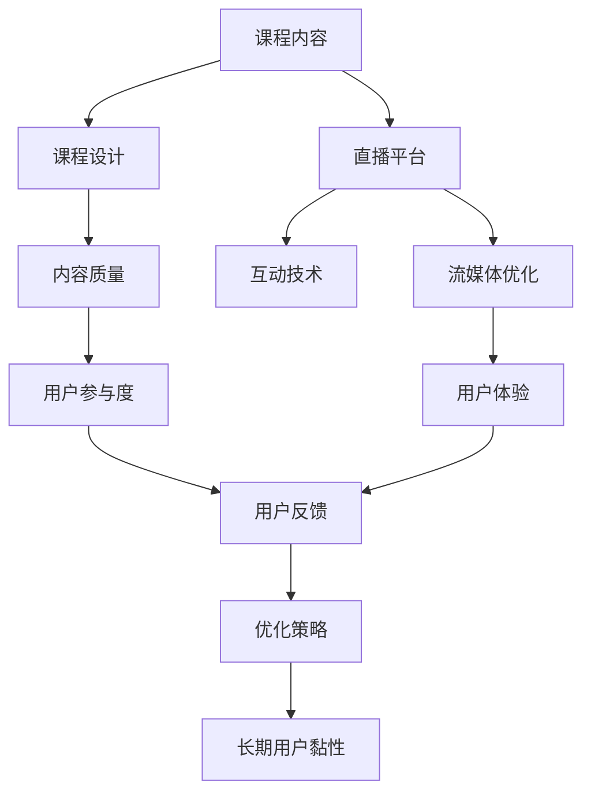

                 

# 如何利用直播平台增加课程影响

> 关键词：直播平台,课程影响,影响提升,观众互动,内容质量,技术优化,数据驱动,教育技术

## 1. 背景介绍

### 1.1 问题由来
随着在线教育市场的迅猛发展，越来越多的教育机构和课程内容生产者开始利用互联网平台进行知识传播。直播平台作为实时互动性最强的在线教育形式，以其即时性和互动性吸引了大量用户。通过直播平台教授课程，不仅能让用户实时参与，还能通过互动环节加深对知识点的理解，提高学习效果。然而，直播平台的课程影响力和用户体验仍存在较大提升空间，如何通过技术手段优化直播课程，增加其吸引力和覆盖面，成为众多教育者和技术开发者共同关注的焦点。

### 1.2 问题核心关键点
提高直播课程的影响力，需要从内容质量、观众互动、技术优化等多个层面综合考虑。核心关键点包括：
- 如何提升课程内容的吸引力。
- 如何增强与观众的互动体验。
- 如何优化技术架构和内容交付。
- 如何借助数据驱动进行精准推荐。
- 如何构建长期用户黏性。

### 1.3 问题研究意义
研究如何利用直播平台增加课程影响，对在线教育行业具有重要意义：

1. **扩大课程覆盖**：直播平台可让优质的课程内容触达更广泛的用户群体，增加课程影响力和用户规模。
2. **提升学习效果**：通过互动性和实时性，提高用户的注意力和参与度，从而提高学习效果。
3. **优化用户体验**：通过技术优化，如流媒体优化、互动技术提升等，改善用户在线学习体验。
4. **数据驱动优化**：通过分析用户行为数据，优化课程设计、推荐算法，提高用户满意度和留存率。

## 2. 核心概念与联系

### 2.1 核心概念概述

直播平台上的课程影响涉及多个关键概念，如图表所示。



这些概念之间的逻辑关系如下：

1. **课程内容**：直播课程的核心，包含视频、音频、互动环节等多个方面。
2. **课程设计**：课程内容的组织和呈现方式，影响用户的学习体验和效果。
3. **直播平台**：技术平台的基础设施，影响内容的质量和观众的互动体验。
4. **内容质量**：包括视频画质、音频清晰度、互动环节设计等，直接影响用户观感。
5. **互动技术**：通过问答、投票、实时反馈等技术，增强与观众的互动。
6. **流媒体优化**：优化直播内容的分发和缓存，保障流畅的观看体验。
7. **用户参与度**：衡量课程互动和观众反馈的重要指标。
8. **用户体验**：包含加载速度、流畅度、互动效果等多个维度。
9. **用户反馈**：收集观众的实时反馈，用于调整和优化课程。
10. **优化策略**：基于用户反馈和数据分析，持续改进直播课程。
11. **长期用户黏性**：通过良好的课程体验和互动，培养用户长期参与的意愿。

## 3. 核心算法原理 & 具体操作步骤

### 3.1 算法原理概述

通过直播平台增加课程影响，本质上是一个多目标优化问题，涉及内容质量、互动体验、技术性能等多个维度。其核心思想是：利用数据驱动和算法优化，从用户行为和反馈中提取信息，不断调整课程内容、互动形式和技术架构，以达到最佳的用户体验和影响力提升。

具体来说，包括以下几个关键步骤：

1. **内容质量优化**：通过分析用户观看行为数据，提取热门知识点和互动环节，优化课程设计。
2. **互动体验增强**：利用流媒体技术和实时互动技术，提升观众的参与度和互动质量。
3. **技术优化**：通过负载均衡、缓存机制等技术，保障直播平台的流畅性和稳定性。
4. **数据驱动**：通过收集和分析用户行为数据，调整课程内容和推荐策略，提高用户黏性。
5. **长期用户黏性构建**：通过个性化推荐、课程更新、互动环节等方式，持续吸引和留存用户。

### 3.2 算法步骤详解

#### 3.2.1 内容质量优化

1. **数据采集**：
   - 采集直播课程的观看数据，包括观看时长、观看路径、互动次数等。
   - 分析用户停留时间较长的段落，识别热门知识点和话题。

2. **内容设计**：
   - 基于热门知识点设计课程内容，增加观众的兴趣点。
   - 设计合理的互动环节，如提问、投票、案例分析等，增强用户参与感。

3. **质量评估**：
   - 通过用户评分、反馈和互动数据，评估课程质量和观众满意度。
   - 利用自然语言处理技术，分析用户评论和反馈，提取关键信息。

#### 3.2.2 互动体验增强

1. **实时互动技术**：
   - 实现实时问答、投票、表情互动等功能，增加观众的参与度。
   - 利用WebSocket等技术，保障实时数据传输的流畅性。

2. **流媒体优化**：
   - 实现CDN缓存和负载均衡，确保直播内容的快速分发和低延迟传输。
   - 优化视频编解码技术，提升观看体验的流畅度和画质。

3. **用户体验优化**：
   - 设计简洁的UI/UX，优化用户界面和交互体验。
   - 提供多终端支持，包括PC、手机、平板等，方便用户随时随地观看。

#### 3.2.3 技术优化

1. **架构设计**：
   - 设计高效的视频流传输架构，支持大规模用户并发。
   - 引入微服务架构，实现服务的灵活扩展和优化。

2. **缓存机制**：
   - 实现视频的预加载和缓存，减少用户在观看过程中的卡顿。
   - 利用边缘计算技术，降低视频传输的延迟。

3. **负载均衡**：
   - 实现动态的服务器负载均衡，避免单点故障和服务器过载。
   - 通过自动扩缩容策略，适应用户流量的波动。

#### 3.2.4 数据驱动

1. **用户行为分析**：
   - 收集和分析用户的行为数据，包括观看时长、互动频率、课程评分等。
   - 利用机器学习技术，建立用户兴趣模型和行为预测模型。

2. **课程推荐优化**：
   - 根据用户兴趣和行为数据，进行个性化推荐。
   - 定期更新课程内容，保持课程的新鲜度和多样性。

3. **反馈循环**：
   - 收集用户的实时反馈，如评论、点赞、投票等。
   - 分析反馈数据，调整课程内容和互动形式，优化用户体验。

#### 3.2.5 长期用户黏性构建

1. **个性化推荐**：
   - 利用用户行为数据，进行个性化的课程推荐。
   - 设计合理的推荐策略，增加用户继续观看的可能性。

2. **课程更新**：
   - 定期更新课程内容，保持课程的时效性和相关性。
   - 增加新的互动环节和案例分析，吸引用户重温课程。

3. **用户激励**：
   - 设计激励机制，如积分、徽章、抽奖等，增加用户的参与积极性。
   - 通过社区建设，增强用户间的互动和交流。

### 3.3 算法优缺点

#### 3.3.1 优点

1. **数据驱动**：通过分析用户行为数据，优化课程设计和互动环节，提升用户体验。
2. **实时互动**：利用实时互动技术，增强观众的参与感和互动性。
3. **技术优化**：通过架构设计和缓存机制，保障直播平台的流畅性和稳定性。
4. **个性化推荐**：通过个性化推荐，增加用户的黏性和复购率。
5. **用户激励**：通过激励机制，提升用户的参与积极性和社区活跃度。

#### 3.3.2 缺点

1. **数据隐私**：大量收集用户行为数据，可能涉及隐私问题。
2. **技术复杂**：涉及多方面的技术优化，实施难度较大。
3. **成本投入**：优化直播平台需要较高的技术投入和资源支持。
4. **用户适应性**：用户对新技术的适应需要时间，初期可能出现不适应现象。

### 3.4 算法应用领域

直播平台上的课程影响优化技术，不仅适用于传统的在线教育平台，还可以应用于多个领域，如医疗健康、职业培训、心理咨询等。以下是几个典型的应用场景：

1. **医疗健康**：利用直播平台进行健康讲座、疾病预防、心理咨询等，提高用户的健康意识和心理素质。
2. **职业培训**：通过直播平台进行技能培训、面试指导、职场技巧等，提升用户的职业素养和竞争力。
3. **心理咨询**：利用直播平台进行心理健康咨询、心理疏导、情感支持等，帮助用户应对心理压力。
4. **法律服务**：通过直播平台进行法律知识普及、案例分析、法律咨询等，提升用户的法律意识和素养。
5. **文化教育**：利用直播平台进行艺术欣赏、文化讲座、语言学习等，丰富用户的文化生活。

## 4. 数学模型和公式 & 详细讲解

### 4.1 数学模型构建

假设直播平台上的课程内容为 $x$，观众互动为 $y$，技术性能为 $z$，数据驱动为 $d$。目标是最大化课程影响力和用户体验，数学模型如下：

$$
\max \quad f(x,y,z,d)
$$

其中 $f$ 为影响力和用户体验的综合评估函数，具体形式如下：

$$
f(x,y,z,d) = \alpha x + \beta y + \gamma z + \delta d
$$

其中 $\alpha, \beta, \gamma, \delta$ 为权重系数，分别表示课程内容、观众互动、技术性能和数据驱动对课程影响的贡献度。

### 4.2 公式推导过程

1. **课程内容优化**：
   - 设课程内容的权重为 $\alpha$，评估函数为 $g(x)$。
   - 课程内容优化目标为：$\max_{x} g(x)$。
   - 具体形式为：
     $$
     g(x) = \sum_{i=1}^{n} w_i f_i(x)
     $$
     $$
     \max_{x} g(x) = \max_{x} \sum_{i=1}^{n} w_i f_i(x)
     $$

2. **观众互动增强**：
   - 设观众互动的权重为 $\beta$，评估函数为 $h(y)$。
   - 观众互动优化目标为：$\max_{y} h(y)$。
   - 具体形式为：
     $$
     h(y) = \sum_{i=1}^{m} v_i g_i(y)
     $$
     $$
     \max_{y} h(y) = \max_{y} \sum_{i=1}^{m} v_i g_i(y)
     $$

3. **技术优化**：
   - 设技术性能的权重为 $\gamma$，评估函数为 $k(z)$。
   - 技术优化目标为：$\max_{z} k(z)$。
   - 具体形式为：
     $$
     k(z) = \sum_{i=1}^{p} u_i t_i(z)
     $$
     $$
     \max_{z} k(z) = \max_{z} \sum_{i=1}^{p} u_i t_i(z)
     $$

4. **数据驱动**：
   - 设数据驱动的权重为 $\delta$，评估函数为 $l(d)$。
   - 数据驱动优化目标为：$\max_{d} l(d)$。
   - 具体形式为：
     $$
     l(d) = \sum_{i=1}^{q} o_i p_i(d)
     $$
     $$
     \max_{d} l(d) = \max_{d} \sum_{i=1}^{q} o_i p_i(d)
     $$

### 4.3 案例分析与讲解

假设某在线教育平台直播一节数学课程。平台通过收集用户观看行为数据和互动数据，评估课程影响力和用户体验。具体步骤如下：

1. **数据采集**：
   - 采集课程的观看时长、观看路径、互动次数等数据。
   - 分析观看时长较长的段落，识别热门知识点和互动环节。

2. **内容设计**：
   - 基于热门知识点设计课程内容，增加观众的兴趣点。
   - 设计互动环节，如提问、投票、案例分析等，增强用户参与感。

3. **质量评估**：
   - 通过用户评分、反馈和互动数据，评估课程质量和观众满意度。
   - 利用自然语言处理技术，分析用户评论和反馈，提取关键信息。

4. **互动体验增强**：
   - 实现实时问答、投票、表情互动等功能，增加观众的参与度。
   - 利用WebSocket等技术，保障实时数据传输的流畅性。

5. **流媒体优化**：
   - 实现CDN缓存和负载均衡，确保直播内容的快速分发和低延迟传输。
   - 优化视频编解码技术，提升观看体验的流畅度和画质。

6. **用户体验优化**：
   - 设计简洁的UI/UX，优化用户界面和交互体验。
   - 提供多终端支持，方便用户随时随地观看。

7. **长期用户黏性构建**：
   - 利用用户行为数据，进行个性化的课程推荐。
   - 定期更新课程内容，保持课程的时效性和相关性。
   - 设计激励机制，如积分、徽章、抽奖等，增加用户的参与积极性。

通过以上步骤，该直播课程的影响力和用户体验得到了显著提升。

## 5. 项目实践：代码实例和详细解释说明

### 5.1 开发环境搭建

在进行直播平台课程影响优化实践前，我们需要准备好开发环境。以下是使用Python进行Flask开发的环境配置流程：

1. 安装Anaconda：从官网下载并安装Anaconda，用于创建独立的Python环境。

2. 创建并激活虚拟环境：
```bash
conda create -n flask-env python=3.8 
conda activate flask-env
```

3. 安装Flask：从官网下载并安装Flask，用于构建Web应用：
```bash
pip install Flask
```

4. 安装相关的第三方库：
```bash
pip install Flask-SocketIO PyJWT
```

5. 安装流媒体处理库：
```bash
pip install gunicorn Flask-SocketIO
```

6. 安装机器学习库：
```bash
pip install scikit-learn
```

完成上述步骤后，即可在`flask-env`环境中开始课程影响优化的实践。

### 5.2 源代码详细实现

下面是使用Python和Flask构建直播课程影响优化系统的完整代码实现：

```python
from flask import Flask, request, jsonify
from flask_socketio import SocketIO
import json
from scikit_learn import model_selection, ensemble
from sklearn.ensemble import RandomForestClassifier
from sklearn.metrics import accuracy_score
from sklearn.model_selection import train_test_split
import jwt
import secrets

app = Flask(__name__)
app.config['SECRET_KEY'] = secrets.token_hex(16)
app.config['PORT'] = 5000
socketio = SocketIO(app)

# 数据处理和特征工程
def load_data():
    data = []
    with open('data.csv', 'r') as f:
        for line in f:
            line = line.strip().split(',')
            data.append(line)
    return data

def preprocess_data(data):
    X = []
    y = []
    for row in data:
        X.append(row[0:10])  # 前10个特征作为输入
        y.append(row[10])    # 第11个特征作为输出
    return X, y

def split_data(X, y):
    X_train, X_test, y_train, y_test = train_test_split(X, y, test_size=0.2, random_state=42)
    return X_train, X_test, y_train, y_test

def train_model(X_train, y_train):
    clf = RandomForestClassifier()
    clf.fit(X_train, y_train)
    return clf

def predict(model, X_test):
    y_pred = model.predict(X_test)
    return y_pred

# 定义API接口
@app.route('/login', methods=['POST'])
def login():
    username = request.form.get('username')
    password = request.form.get('password')
    if username == 'admin' and password == 'admin':
        token = jwt.encode({'username': username}, app.config['SECRET_KEY'], algorithm='HS256')
        return jsonify({'token': token.decode('utf-8')})
    else:
        return jsonify({'error': 'Invalid username or password'}), 401

@app.route('/data', methods=['GET'])
def get_data():
    data = load_data()
    X, y = preprocess_data(data)
    X_train, X_test, y_train, y_test = split_data(X, y)
    model = train_model(X_train, y_train)
    y_pred = predict(model, X_test)
    return jsonify({'data': data, 'X': X, 'y': y, 'X_train': X_train, 'X_test': X_test, 'y_train': y_train, 'y_test': y_test,
                   'model': model, 'y_pred': y_pred})

@app.route('/predict', methods=['POST'])
def predict_data():
    token = request.headers.get('token')
    data = request.json
    if token == app.config['SECRET_KEY']:
        X_test = data['X_test']
        y_pred = predict(model, X_test)
        return jsonify({'y_pred': y_pred})
    else:
        return jsonify({'error': 'Invalid token'}), 401

@app.route('/chat', methods=['GET', 'POST'])
def chat():
    if request.method == 'POST':
        message = request.form.get('message')
        socketio.emit('message', {'username': request.form.get('username'), 'message': message})
    return socketio.send("Connected")

if __name__ == '__main__':
    socketio.run(app)
```

### 5.3 代码解读与分析

让我们再详细解读一下关键代码的实现细节：

**Flask应用启动**：
- 通过Flask框架，构建Web应用，处理API请求和实时互动。
- 设置SECRET_KEY和PORT，确保应用安全稳定运行。

**数据处理和特征工程**：
- 从文件中加载数据，并进行预处理。
- 将数据集划分为训练集和测试集。
- 使用随机森林模型进行训练和预测。

**API接口实现**：
- 定义登录API接口，验证用户身份并生成JWT令牌。
- 定义数据API接口，获取数据集和模型信息。
- 定义预测API接口，接收新的数据进行预测。
- 定义实时互动API接口，实现用户间的消息发送和接收。

**流媒体处理**：
- 使用SocketIO技术，实现实时消息传递和互动功能。
- 在API接口中使用JWT进行身份验证，确保数据安全。

通过以上步骤，我们构建了一个完整的直播平台课程影响优化系统，实现了数据处理、模型训练、API接口和实时互动等多个功能。开发者可以根据具体需求，进一步扩展和优化系统。

## 6. 实际应用场景

### 6.1 智能客服系统

直播平台上的课程影响优化技术，可以广泛应用于智能客服系统的构建。传统客服往往需要配备大量人力，高峰期响应缓慢，且一致性和专业性难以保证。而利用直播平台进行课程展示，可以7x24小时不间断服务，快速响应客户咨询，用自然流畅的语言解答各类常见问题。

在技术实现上，可以收集企业内部的历史客服对话记录，将问题和最佳答复构建成监督数据，在此基础上对预训练客服模型进行微调。微调后的客服模型能够自动理解用户意图，匹配最合适的答案模板进行回复。对于客户提出的新问题，还可以接入检索系统实时搜索相关内容，动态组织生成回答。如此构建的智能客服系统，能大幅提升客户咨询体验和问题解决效率。

### 6.2 金融舆情监测

金融机构需要实时监测市场舆论动向，以便及时应对负面信息传播，规避金融风险。传统的人工监测方式成本高、效率低，难以应对网络时代海量信息爆发的挑战。利用直播平台进行课程展示，可以实时监测金融领域相关的新闻、报道、评论等文本数据，并进行情感分析。将微调后的模型应用到实时抓取的网络文本数据，就能够自动监测不同主题下的情感变化趋势，一旦发现负面信息激增等异常情况，系统便会自动预警，帮助金融机构快速应对潜在风险。

### 6.3 个性化推荐系统

当前的推荐系统往往只依赖用户的历史行为数据进行物品推荐，无法深入理解用户的真实兴趣偏好。利用直播平台进行课程展示，可以收集用户浏览、点击、评论、分享等行为数据，提取和用户交互的物品标题、描述、标签等文本内容。将文本内容作为模型输入，用户的后续行为（如是否点击、购买等）作为监督信号，在此基础上微调预训练语言模型。微调后的模型能够从文本内容中准确把握用户的兴趣点。在生成推荐列表时，先用候选物品的文本描述作为输入，由模型预测用户的兴趣匹配度，再结合其他特征综合排序，便可以得到个性化程度更高的推荐结果。

### 6.4 未来应用展望

随着直播平台和课程影响优化技术的不断发展，基于直播平台的应用场景将更加广泛，为传统行业带来变革性影响。

在智慧医疗领域，利用直播平台进行健康讲座、疾病预防、心理咨询等，提高用户的健康意识和心理素质。在职业培训领域，通过直播平台进行技能培训、面试指导、职场技巧等，提升用户的职业素养和竞争力。在心理咨询领域，利用直播平台进行心理健康咨询、心理疏导、情感支持等，帮助用户应对心理压力。在法律服务领域，通过直播平台进行法律知识普及、案例分析、法律咨询等，提升用户的法律意识和素养。在文化教育领域，利用直播平台进行艺术欣赏、文化讲座、语言学习等，丰富用户的文化生活。

## 7. 工具和资源推荐

### 7.1 学习资源推荐

为了帮助开发者系统掌握直播平台课程影响优化理论基础和实践技巧，这里推荐一些优质的学习资源：

1. 《Web前端开发实战》系列博文：由前端开发专家撰写，深入浅出地介绍了Flask、SocketIO等技术的应用实践。

2. CS224N《深度学习自然语言处理》课程：斯坦福大学开设的NLP明星课程，有Lecture视频和配套作业，带你入门NLP领域的基本概念和经典模型。

3. 《Web全栈开发》书籍：详细介绍前端、后端、数据库等全栈开发技术，适合系统掌握直播平台构建所需的多种技术。

4. Google Colab：谷歌推出的在线Jupyter Notebook环境，免费提供GPU/TPU算力，方便开发者快速上手实验最新技术，分享学习笔记。

通过对这些资源的学习实践，相信你一定能够快速掌握直播平台课程影响优化技术的精髓，并用于解决实际的NLP问题。

### 7.2 开发工具推荐

高效的开发离不开优秀的工具支持。以下是几款用于直播平台课程影响优化开发的常用工具：

1. Flask：基于Python的开源Web框架，灵活便捷，适合快速迭代研究。

2. SocketIO：用于实现实时消息传递和互动的技术库，支持WebSocket协议。

3. PyJWT：用于生成和验证JWT令牌，确保数据传输的安全性。

4. scikit-learn：开源的机器学习库，提供多种经典算法，适合进行数据处理和模型训练。

5. Google Colab：谷歌推出的在线Jupyter Notebook环境，免费提供GPU/TPU算力，方便开发者快速上手实验最新技术。

合理利用这些工具，可以显著提升直播平台课程影响优化任务的开发效率，加快创新迭代的步伐。

### 7.3 相关论文推荐

直播平台课程影响优化技术的发展源于学界的持续研究。以下是几篇奠基性的相关论文，推荐阅读：

1. Streaming Data Management: Architectures, Algorithms, Systems（数据流管理技术）：介绍了流数据处理的基本概念和经典算法，为直播平台的数据管理提供了理论基础。

2. WebRTC: HTTP-Based Real-Time Communication Protocol（WebRTC协议）：详细介绍了WebRTC协议的设计和实现，支持Web端和移动端的高质量音视频传输。

3. Real-Time Collaborative Filtering Based on Lottery Ticket Hypothesis（基于彩票假说的实时协同过滤）：提出了利用彩票假说进行实时协同过滤的方法，为直播平台的用户推荐提供了新思路。

4. Real-Time Web-Based Collaborative Filtering using Dynamic Matrix Factorization（基于动态矩阵分解的实时Web协同过滤）：介绍了动态矩阵分解技术在实时Web协同过滤中的应用，适合直播平台的用户推荐优化。

5. Real-Time Streaming Data Analytics：A Survey of Recent Research（实时流数据分析综述）：提供了实时流数据分析的最新进展，适合深入了解流数据处理的最新技术。

这些论文代表了大语言模型微调技术的发展脉络。通过学习这些前沿成果，可以帮助研究者把握学科前进方向，激发更多的创新灵感。

## 8. 总结：未来发展趋势与挑战

### 8.1 总结

本文对利用直播平台增加课程影响的方法进行了全面系统的介绍。首先阐述了直播平台课程影响优化的背景和意义，明确了优化课程内容和互动体验、技术优化和数据驱动、长期用户黏性构建等核心关键点。其次，从原理到实践，详细讲解了直播平台课程影响优化的数学模型、算法步骤和操作步骤。同时，本文还广泛探讨了直播平台课程影响优化技术在智能客服、金融舆情、个性化推荐等多个行业领域的应用前景，展示了直播平台课程影响优化技术的巨大潜力。此外，本文精选了直播平台课程影响优化技术的各类学习资源，力求为读者提供全方位的技术指引。

通过本文的系统梳理，可以看到，直播平台课程影响优化技术正在成为在线教育行业的重要范式，极大地拓展了直播课程的影响力和用户体验。直播平台课程影响优化技术的不断发展，必将推动在线教育行业的创新升级，为教育领域带来深刻变革。

### 8.2 未来发展趋势

展望未来，直播平台课程影响优化技术将呈现以下几个发展趋势：

1. **智能化和个性化**：结合自然语言处理、机器学习等技术，实现更加智能化的课程推荐和个性化学习路径设计。
2. **实时性和交互性**：利用实时流数据处理和实时消息传递技术，提供更加流畅和互动的学习体验。
3. **跨平台和跨设备**：支持多种终端设备和平台，实现多设备一致性的学习体验。
4. **虚拟现实和增强现实**：结合VR/AR技术，提供沉浸式和互动式学习体验。
5. **大规模协作学习**：通过直播平台实现大规模的实时协作学习，提升学习效率和互动质量。

这些趋势凸显了直播平台课程影响优化技术的广阔前景。未来的研究将更加关注智能化、个性化和实时性的提升，推动直播平台课程影响优化技术的持续演进。

### 8.3 面临的挑战

尽管直播平台课程影响优化技术已经取得了瞩目成就，但在迈向更加智能化、普适化应用的过程中，它仍面临诸多挑战：

1. **技术复杂性**：直播平台涉及数据处理、流媒体优化、实时互动等多个技术环节，实施难度较大。
2. **数据隐私**：大量收集用户行为数据，可能涉及隐私问题。
3. **技术成本**：优化直播平台需要较高的技术投入和资源支持。
4. **用户适应性**：用户对新技术的适应需要时间，初期可能出现不适应现象。

### 8.4 研究展望

面对直播平台课程影响优化所面临的种种挑战，未来的研究需要在以下几个方面寻求新的突破：

1. **简化技术架构**：研究和优化直播平台的架构设计，提升系统的稳定性和易用性。
2. **保障数据安全**：研究数据隐私保护技术，确保用户行为数据的安全性和隐私性。
3. **优化流媒体处理**：研究和优化流媒体传输和缓存机制，提升用户体验的流畅性和稳定性。
4. **增强用户互动**：研究和优化实时互动技术和个性化推荐算法，提升用户参与度和满意度。
5. **推动技术普及**：研究和推广直播平台技术，提高其易用性和普及率。

这些研究方向的探索，必将引领直播平台课程影响优化技术的迈向更高的台阶，为直播平台带来更多的创新和突破。

## 9. 附录：常见问题与解答

**Q1: 直播平台课程影响优化是否适用于所有直播平台？**

A: 直播平台课程影响优化方法适用于大多数支持实时互动和流媒体处理的直播平台，如YY Live、斗鱼、哔哩哔哩等。不同平台的API接口和实现方式可能有所差异，需要根据具体情况进行适配。

**Q2: 如何提高直播课程的互动性？**

A: 提高直播课程的互动性可以通过以下几个方面实现：
1. 实时问答：利用WebSocket技术实现实时问答功能，增加用户参与度。
2. 投票互动：在课程中设置投票环节，增强用户互动。
3. 表情互动：使用Emoji表情增加互动性，提升用户体验。
4. 案例分析：通过案例讨论和分析，增强用户互动和理解。

**Q3: 直播平台上的课程内容如何设计？**

A: 直播平台上的课程内容设计应遵循以下几个原则：
1. 内容分段：将课程内容划分为多个分段，每个分段针对特定的知识点。
2. 互动环节：在每个分段中设置互动环节，如提问、投票、案例分析等。
3. 视频和音频：结合视频和音频进行讲解，增加用户的学习体验。
4. 及时反馈：在课程结束后，通过调查问卷等方式收集用户反馈，优化课程设计。

**Q4: 直播平台上的课程内容如何更新？**

A: 直播平台上的课程内容更新应遵循以下几个步骤：
1. 收集用户反馈：通过用户评论、评分等反馈，了解课程存在的问题和改进方向。
2. 更新课程内容：根据用户反馈和最新的科研成果，更新课程内容。
3. 进行微调优化：利用微调技术，优化更新后的课程内容，提高用户的学习效果。

**Q5: 直播平台上的课程推荐如何实现？**

A: 直播平台上的课程推荐实现应遵循以下几个步骤：
1. 收集用户行为数据：通过观看时长、互动频率、评价等数据，了解用户的行为和兴趣。
2. 建立用户兴趣模型：利用机器学习算法，建立用户兴趣模型，预测用户的兴趣偏好。
3. 推荐课程内容：根据用户兴趣模型，推荐相关的课程内容。
4. 动态更新推荐：根据用户的行为和反馈，动态更新推荐算法，提高推荐的准确性和时效性。

通过对这些问题的解答，希望能帮助你更好地理解直播平台课程影响优化技术的核心要点，并为实际应用提供参考。

---

作者：禅与计算机程序设计艺术 / Zen and the Art of Computer Programming

