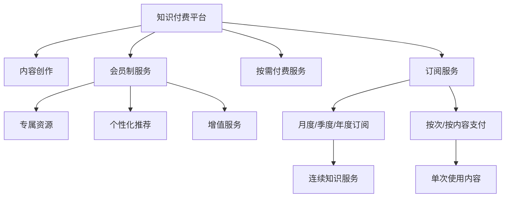

                 

# 如何利用知识付费实现会员制盈利？

## 1. 背景介绍

随着信息爆炸和知识经济时代的到来，知识付费市场逐渐兴起，成为各大平台和企业争相布局的新蓝海。在教育、科技、医疗、娱乐等诸多领域，越来越多的用户愿意为高质量、有价值的内容付费，希望通过付费订阅获得更加专业、深度、系统的知识服务。在这种背景下，如何有效地利用知识付费模式，实现会员制盈利，成为各类企业和组织关注的焦点。

本文将深入探讨知识付费的商业模式，分析其核心概念、发展现状、盈利策略，并结合实际案例，提出相应的建议和方案，帮助相关企业构建健康可持续发展的知识付费平台。

## 2. 核心概念与联系

### 2.1 核心概念概述

- **知识付费(Knowledge Pricing)**：指用户为获取专业、系统的知识服务支付费用，获取内容版权，并享受平台提供的学习、咨询、课程培训等多样化服务。
- **会员制(Membership Model)**：通过设置会员身份，提供分级服务，让用户以较低成本享受多种权益，包括专属资源、个性化推荐、增值服务等。
- **订阅制(Subscription Model)**：用户按月、按季度或按年支付固定费用，享受连续的、持续的知识服务。
- **按需付费(Pay-as-You-Go Model)**：用户根据自身需求，按次或按内容支付费用，获得单次使用的知识资源。
- **内容矩阵(Content Matrix)**：根据不同用户群体，设计层次分明、差异化显著的内容产品矩阵，满足不同用户需求。

### 2.2 核心概念原理和架构的 Mermaid 流程图



以上流程图示意了知识付费平台的核心架构，主要包括内容创作、订阅服务、按需付费服务、会员制服务等多个部分，彼此之间通过数据流和业务逻辑连接，共同支撑平台的运行和发展。

## 3. 核心算法原理 & 具体操作步骤

### 3.1 算法原理概述

知识付费平台的盈利主要依赖于订阅、按需付费、广告、增值服务等多种模式，其中会员制和订阅制是其核心盈利方式。通过设置不同的会员等级，平台可以根据用户的付费能力和价值，提供差异化的服务和权益，从而实现精准营销和最大化盈利。

### 3.2 算法步骤详解

1. **用户画像分析**：通过大数据分析，了解不同用户群体的特征和需求，如年龄、职业、兴趣爱好等。
2. **内容产品设计**：根据用户画像，设计多层次、多样化的内容产品，满足用户差异化需求。
3. **会员体系构建**：设置会员等级，定义不同等级的权益，如免费资源、专属特权、个性化服务等。
4. **订阅与续费策略**：制定合理的订阅价格和续费机制，鼓励用户持续付费。
5. **用户行为分析**：利用机器学习算法分析用户行为，提供个性化推荐，提升用户体验和粘性。
6. **数据分析与优化**：定期对平台数据进行统计分析，优化产品和服务，提升平台盈利能力。

### 3.3 算法优缺点

#### 优点
- **精准营销**：通过会员等级和订阅机制，实现精准营销，提升用户转化率和续订率。
- **用户粘性提升**：提供专属权益和个性化服务，提升用户忠诚度和粘性。
- **收入稳定性**：通过会员和订阅服务，获得稳定的收入来源，降低风险。

#### 缺点
- **成本较高**：内容创作和平台运营需要大量投入，初期成本较高。
- **运营复杂性**：需要综合考虑用户体验、内容差异化、运营策略等多方面因素，运营复杂度较高。
- **市场竞争激烈**：知识付费市场竞争激烈，需要不断创新和优化，保持竞争优势。

### 3.4 算法应用领域

知识付费模型在教育、科技、医疗、娱乐、金融等多个领域均有广泛应用，具体包括：

- **在线教育**：提供各类线上课程、学习资源，满足不同用户的学习需求。
- **科技资讯**：提供前沿科技资讯、技术教程、行业报告等，助力科技创新。
- **健康医疗**：提供专业医疗知识、健康资讯、心理咨询等服务。
- **文化娱乐**：提供电子书、电影、音乐、艺术品等文化娱乐内容。
- **金融理财**：提供理财知识、投资咨询、市场分析等服务。

## 4. 数学模型和公式 & 详细讲解 & 举例说明

### 4.1 数学模型构建

以会员制知识付费平台为例，假设平台有$N$个用户，$M$个内容产品，用户$u_i$支付的费用为$P_i$，会员等级为$L_i$，平台总收益为$R$。会员等级与订阅费用之间的关系可以用以下数学模型表示：

$$ R = \sum_{i=1}^{N} P_i \times \mathbb{I}(L_i = 1) $$

其中$\mathbb{I}(\cdot)$为示性函数，表示当用户$u_i$为会员时，支付的费用$P_i$将计入平台总收益$R$。

### 4.2 公式推导过程

1. **会员订阅率计算**：假设平台每月新增会员率为$R_m$，平均订阅费用为$P_{avg}$，则平台每月新增会员带来的收益为$R_{new} = R_m \times P_{avg}$。

2. **续订率优化**：假设会员续订率为$R_r$，则平台每月从现有会员处获得的收益为$R_{cur} = R_{avg} \times R_r$，其中$R_{avg}$为现有会员的平均支付费用。

3. **按需付费策略**：对于按需付费用户，平台通过设定不同价格和付费方式，获取更多单次支付的用户。假设单次付费的平均费用为$P_{pay}$，按需付费用户占比为$R_{pay}$，则平台通过按需付费获得的收益为$R_{pay} \times P_{pay}$。

### 4.3 案例分析与讲解

以Coursera平台为例，分析其会员制盈利策略：

- **会员等级设计**：Coursera提供两种会员类型：基础会员和专业会员。基础会员可以免费使用部分课程和资料，专业会员则提供无限次观看所有课程的权限。
- **订阅费用**：基础会员月费为$49，专业会员月费为$99。
- **续订率**：Coursera的会员续订率较高，基础会员续订率约为60%，专业会员续订率约为85%。
- **按需付费**：Coursera还提供了单次付费课程选项，用户可以单独购买特定课程，费用从$19至$150不等。

通过这种会员制和按需付费的结合，Coursera实现了稳定的收入流和较高的用户粘性。平台通过数据分析和个性化推荐，进一步提升了用户体验和转化率。

## 5. 项目实践：代码实例和详细解释说明

### 5.1 开发环境搭建

本节介绍知识付费平台开发的开发环境搭建步骤：

1. **服务器配置**：选择合适的服务器硬件配置，如CPU、内存、存储等，确保平台的稳定运行。
2. **数据库部署**：搭建MySQL或MongoDB等关系型或非关系型数据库，用于存储用户数据、内容信息、交易记录等。
3. **API开发环境**：安装Django、Flask等Python Web框架，用于开发后端API接口。
4. **前端开发环境**：使用React、Vue等前端框架，开发用户交互界面和页面展示。
5. **支付集成**：与支付宝、微信支付等第三方支付平台集成，实现支付功能。

### 5.2 源代码详细实现

以下以Coursera平台为例，展示会员制知识付费平台的主要功能模块和代码实现：

```python
# 用户注册与登录模块
class UserRegistrationService:
    def __init__(self, user_db):
        self.user_db = user_db
    
    def register_user(self, username, password, email):
        # 创建新用户并保存到数据库
        user = User(username=username, password=hash(password), email=email)
        self.user_db.add_user(user)
        return True
    
    def login_user(self, username, password):
        # 从数据库中查询用户信息，验证登录凭证
        user = self.user_db.get_user(username)
        if user and user.password == hash(password):
            return user
        return None
    
# 内容订阅与续费模块
class SubscriptionService:
    def __init__(self, user_db, subscription_db):
        self.user_db = user_db
        self.subscription_db = subscription_db
    
    def subscribe_user(self, user, membership_level, payment_method):
        # 订阅用户为指定会员等级，并更新订阅信息
        subscription = Subscription(user=user, membership_level=membership_level, payment_method=payment_method)
        self.subscription_db.add_subscription(subscription)
        user.subscription = subscription
        return True
    
    def renew_subscription(self, user, payment_method):
        # 续费用户订阅，更新订阅信息
        subscription = user.subscription
        subscription.renew(payment_method)
        return True
    
# 内容推荐与个性化服务模块
class ContentRecommendationService:
    def __init__(self, user_db, content_db):
        self.user_db = user_db
        self.content_db = content_db
    
    def get_content_recommendations(self, user):
        # 根据用户行为和偏好，提供个性化内容推荐
        # 具体算法可以根据实际需求选择，如协同过滤、基于内容的推荐等
        recommendations = []
        for content in self.content_db.get_contents():
            if content.user_interests.match(user.interests):
                recommendations.append(content)
        return recommendations
```

### 5.3 代码解读与分析

上述代码展示了知识付费平台的核心功能模块，包括用户注册与登录、内容订阅与续费、内容推荐与个性化服务。具体解读如下：

- **UserRegistrationService类**：用于用户注册和登录，包括创建新用户、验证登录凭证等。
- **SubscriptionService类**：用于处理用户的订阅和续费，包括订阅用户为指定会员等级、续费订阅等。
- **ContentRecommendationService类**：用于提供个性化内容推荐，根据用户行为和偏好推荐相关内容。

这些模块通过接口调用和数据交互，共同支撑知识付费平台的核心功能。需要注意的是，实际开发中还需考虑内容安全、数据加密、支付安全等多方面因素，确保平台稳定、安全、高效运行。

### 5.4 运行结果展示

以下以Coursera平台为例，展示其用户注册、订阅和推荐结果：

- **用户注册与登录**：用户通过邮箱注册，登录后可以看到推荐内容和个性化服务。
- **内容订阅与续费**：用户可以选择基础会员或专业会员，并使用信用卡或支付宝进行续费。
- **内容推荐**：平台根据用户的学习行为和兴趣，提供个性化课程推荐，提升用户体验和粘性。

## 6. 实际应用场景

### 6.1 在线教育平台

在线教育平台是知识付费领域的重要应用场景，如Coursera、Udemy、edX等。这些平台通过会员制和订阅制相结合，提供各类线上课程和资源，满足用户的学习需求。平台通过数据分析和个性化推荐，提升用户转化率和续订率，实现稳定盈利。

### 6.2 科技资讯平台

科技资讯平台如36kr、TechCrunch等，通过提供前沿科技资讯、技术教程、行业报告等内容，吸引大量科技爱好者和专业人士。平台通过会员制和按需付费相结合，提供专属特权和增值服务，提升用户粘性和盈利能力。

### 6.3 健康医疗平台

健康医疗平台如丁香园、春雨医生等，通过提供专业医疗知识、健康资讯、心理咨询等服务，帮助用户解决健康问题。平台通过会员制和订阅制，提供健康报告、专家咨询等个性化服务，提升用户体验和平台盈利。

### 6.4 文化娱乐平台

文化娱乐平台如网易云课堂、腾讯课堂等，通过提供电子书、电影、音乐、艺术品等文化娱乐内容，满足用户的多样化需求。平台通过会员制和按需付费相结合，提供专属权益和增值服务，提升用户粘性和平台收益。

## 7. 工具和资源推荐

### 7.1 学习资源推荐

为了帮助开发者掌握知识付费平台的开发技能，推荐以下学习资源：

1. **《知识付费平台开发实战》**：深入解析知识付费平台的开发流程和技术栈，提供详细的开发实例和案例分析。
2. **《知识付费商业运营手册》**：介绍知识付费平台的商业运营策略和盈利模式，帮助企业制定有效的运营方案。
3. **Coursera平台开发文档**：详细文档和API接口，帮助开发者快速上手Coursera平台的开发。
4. **edX平台开发文档**：提供edX平台的开发文档和API接口，帮助开发者开发自己的知识付费平台。

### 7.2 开发工具推荐

1. **Django框架**：强大的Web框架，适用于后端API开发和数据库管理。
2. **React框架**：流行的前端框架，适用于用户交互界面和页面展示。
3. **MySQL数据库**：稳定的关系型数据库，适用于用户数据和内容信息的存储。
4. **Alipay和微信支付API**：与第三方支付平台集成，实现支付功能。

### 7.3 相关论文推荐

1. **《知识付费平台盈利模式研究》**：探讨知识付费平台的盈利模式和运营策略，提供实践经验和方法。
2. **《在线教育平台用户行为分析》**：介绍在线教育平台的用户行为分析方法，提升用户转化率和平台收益。
3. **《个性化推荐系统设计》**：介绍个性化推荐系统的设计和实现方法，提升用户体验和平台粘性。

## 8. 总结：未来发展趋势与挑战

### 8.1 研究成果总结

本文系统地介绍了知识付费的商业模式，分析了会员制和订阅制盈利策略的核心概念和操作步骤，并结合实际案例进行讲解。通过深入探讨知识付费平台的开发和运营，提出相应的建议和方案，帮助企业构建健康可持续发展的知识付费平台。

### 8.2 未来发展趋势

未来知识付费平台将呈现以下几个发展趋势：

1. **内容多样化**：随着知识付费市场的发展，内容产品将更加多样化，涵盖更多领域的知识和信息。
2. **用户个性化**：平台将更加注重个性化推荐和定制化服务，提升用户体验和平台粘性。
3. **技术创新**：利用AI、大数据、区块链等新技术，提升平台的智能化和安全性。
4. **生态系统构建**：构建知识付费平台的生态系统，形成内容创作者、平台、用户等多方共赢的良性循环。
5. **国际化发展**：拓展国际市场，提升平台的全球影响力。

### 8.3 面临的挑战

知识付费平台在发展过程中面临诸多挑战：

1. **市场竞争**：知识付费市场竞争激烈，需要不断创新和优化，保持竞争优势。
2. **内容质量**：高质量内容的获取和创作成本较高，需要持续投入。
3. **用户流失**：用户粘性不足，需要持续优化用户体验和运营策略。
4. **技术安全**：平台需要保障内容安全、用户隐私和交易安全，防止数据泄露和欺诈。
5. **法律合规**：需要遵守相关法律法规，避免侵权和违规行为。

### 8.4 研究展望

面对知识付费平台面临的挑战，未来的研究需要在以下几个方面寻求新的突破：

1. **内容获取与创作**：通过合作与激励机制，吸引更多优质内容的创作和分享。
2. **个性化推荐系统**：利用机器学习算法，提升个性化推荐的效果和用户满意度。
3. **技术安全和隐私保护**：采用先进的安全技术和加密算法，保障平台的安全性和隐私保护。
4. **法律法规合规**：制定符合法律法规的运营策略，避免侵权和违规行为。
5. **国际市场拓展**：拓展国际市场，提升平台的全球影响力和竞争力。

通过不断创新和优化，知识付费平台将逐步克服现有挑战，实现可持续发展，为更多用户提供高质量的知识服务。

## 9. 附录：常见问题与解答

**Q1: 知识付费平台如何提高用户转化率？**

A: 知识付费平台提高用户转化率的关键在于提供优质内容和个性化服务。具体措施包括：

- **高质量内容**：平台需要持续投入优质内容的创作和更新，满足用户多样化需求。
- **个性化推荐**：利用机器学习算法，分析用户行为和偏好，提供个性化推荐，提升用户体验和粘性。
- **用户反馈**：收集用户反馈，及时优化内容和产品，提升用户满意度。
- **社交互动**：通过社区、论坛等形式，增强用户互动和粘性。
- **营销推广**：进行精准营销和推广，吸引更多潜在用户。

**Q2: 知识付费平台如何提升用户续费率？**

A: 提升用户续费率的关键在于提供持续的、有价值的服务，增强用户忠诚度和粘性。具体措施包括：

- **增值服务**：提供专属权益和增值服务，如专属课程、VIP会员、专家咨询等，提升用户价值。
- **个性化服务**：根据用户行为和偏好，提供个性化推荐和定制化服务，提升用户体验。
- **持续优化**：根据用户反馈和市场变化，持续优化平台和服务，提升用户满意度。
- **续订优惠**：提供续订优惠和折扣，吸引用户续费。
- **社区建设**：通过社区、论坛等形式，增强用户互动和粘性，提升续费意愿。

**Q3: 知识付费平台如何进行内容推荐？**

A: 内容推荐是知识付费平台的重要功能，可以通过以下几种方法实现：

- **协同过滤**：分析用户和内容的相似性，推荐相似内容。
- **基于内容的推荐**：根据内容特征，推荐相关内容。
- **混合推荐**：结合协同过滤和基于内容的推荐，提供更精准的推荐结果。
- **实时推荐**：根据用户实时行为，动态更新推荐结果，提升推荐效果。
- **社交网络**：利用社交网络数据，推荐用户感兴趣的内容。

通过合理设计推荐算法和系统架构，平台可以实现高质量的内容推荐，提升用户体验和平台收益。

**Q4: 知识付费平台如何进行数据分析和优化？**

A: 数据分析和优化是知识付费平台的关键环节，可以通过以下几种方法实现：

- **数据收集与处理**：收集用户行为数据、内容访问数据、交易数据等，进行数据清洗和处理。
- **用户画像分析**：通过数据分析，了解不同用户群体的特征和需求，进行精准营销。
- **模型训练与优化**：利用机器学习算法，训练推荐模型和用户画像模型，提升推荐效果和用户满意度。
- **A/B测试**：进行A/B测试，评估不同策略和功能的效果，优化平台和服务。
- **持续优化**：根据数据分析结果，持续优化平台和内容，提升用户体验和平台收益。

通过合理设计和实施数据分析和优化策略，平台可以实现用户转化率和续费率的提升，实现可持续发展。

**Q5: 知识付费平台如何进行技术安全和隐私保护？**

A: 技术安全和隐私保护是知识付费平台的重要保障，可以通过以下几种方法实现：

- **数据加密**：对用户数据和内容数据进行加密存储和传输，防止数据泄露。
- **访问控制**：通过身份验证和权限控制，保障平台和内容的安全性。
- **安全审计**：定期进行安全审计和风险评估，及时发现和修复安全漏洞。
- **备份与恢复**：建立数据备份和恢复机制，保障数据安全。
- **法律法规合规**：遵守相关法律法规，避免侵权和违规行为，保护用户隐私和权益。

通过合理设计和实施技术安全和隐私保护策略，平台可以保障用户数据和内容的安全性，提升用户信任度和平台竞争力。

---

作者：禅与计算机程序设计艺术 / Zen and the Art of Computer Programming

