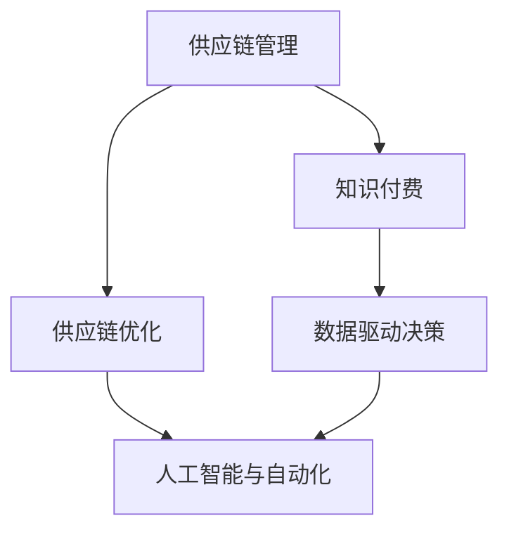
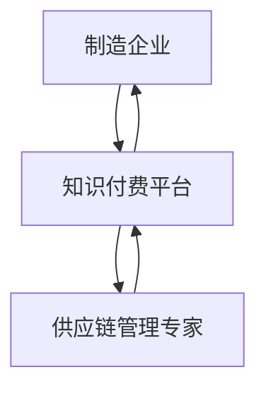

                 

# 如何利用知识付费实现供应链管理与优化？

> 关键词：知识付费, 供应链管理, 供应链优化, 数据驱动, 自动化, 机器学习, 人工智能

## 1. 背景介绍

### 1.1 问题由来
随着全球化经济的不断深入，供应链管理成为企业在全球竞争中的关键要素。供应链优化不仅能够降低成本、提升效率，还能增强企业的市场竞争力。然而，传统供应链管理往往依赖于人工和简单的统计方法，难以应对市场变化和不确定性。

知识付费作为一种新兴的服务模式，通过向用户提供专业知识和解决方案，不仅能够帮助企业提升供应链管理水平，还能够促进企业的数据驱动决策和智能化转型。本文将探讨如何利用知识付费实现供应链管理与优化，通过具体案例和技术手段，为读者提供可行的解决方案。

### 1.2 问题核心关键点
1. **供应链管理与优化**：供应链管理涉及产品采购、库存控制、物流配送等多个环节，优化供应链能够降低成本、提升效率、缩短交货时间，增强企业市场竞争力。
2. **知识付费**：知识付费模式是指企业或个人向用户提供有价值的知识或信息，用户支付相应的费用以获取这些知识。
3. **数据驱动决策**：利用大数据、机器学习等技术，通过分析供应链数据，提供决策支持和优化方案。
4. **人工智能与自动化**：利用人工智能和自动化技术，实现供应链的智能化管理和自动化运行，提高效率和准确性。

## 2. 核心概念与联系

### 2.1 核心概念概述

为更好地理解知识付费在供应链管理与优化中的应用，本节将介绍几个密切相关的核心概念：

- **供应链管理（Supply Chain Management, SCM）**：指企业通过计划、执行和控制供应链活动，确保产品或服务从供应商到客户的顺畅流动。包括采购、库存、物流、配送等环节。
- **供应链优化**：指通过优化供应链流程，降低成本、提升效率、缩短交货时间，提高客户满意度。常用的优化方法包括精益供应链、流程再造等。
- **知识付费**：指企业或个人向用户提供专业知识和解决方案，用户支付相应的费用以获取这些知识。知识付费模式在供应链管理中的应用，可以提供定制化的咨询服务和优化方案。
- **数据驱动决策**：指利用数据分析和挖掘技术，提供决策支持和优化建议，提升供应链管理的科学性和有效性。
- **人工智能与自动化**：利用人工智能和自动化技术，实现供应链的智能化管理和自动化运行，提高效率和准确性。

这些核心概念之间的逻辑关系可以通过以下Mermaid流程图来展示：



这个流程图展示了大语言模型的核心概念及其之间的关系：

1. 供应链管理通过优化提升效率。
2. 人工智能和自动化技术支持供应链智能化运行。
3. 数据驱动决策提供优化建议。
4. 知识付费模式提供定制化服务。
5. 知识付费与数据驱动决策相辅相成，共同提升供应链管理水平。

## 3. 核心算法原理 & 具体操作步骤
### 3.1 算法原理概述

利用知识付费实现供应链管理与优化的核心思想，是通过专业知识和解决方案，辅助企业进行供应链流程优化和管理。这包括：

1. **数据收集与处理**：从供应链各个环节收集数据，如供应商信息、库存量、物流状态等。
2. **数据分析与挖掘**：利用数据挖掘、统计分析等技术，识别供应链中的瓶颈和问题。
3. **知识提供与咨询**：通过知识付费模式，提供定制化的咨询和解决方案，帮助企业优化供应链流程。
4. **自动化与智能化**：利用人工智能和自动化技术，实现供应链的智能化管理和自动化运行。

### 3.2 算法步骤详解

基于知识付费的供应链管理与优化通常包括以下几个关键步骤：

**Step 1: 数据收集与预处理**
- 从供应链各个环节收集数据，如供应商信息、库存量、物流状态等。
- 对数据进行清洗、去重、归一化等预处理，确保数据的质量和一致性。

**Step 2: 数据分析与挖掘**
- 利用数据挖掘、统计分析等技术，识别供应链中的瓶颈和问题。
- 对供应链数据进行可视化展示，帮助企业直观了解供应链状态。

**Step 3: 知识提供与咨询**
- 根据企业需求，提供定制化的咨询服务，如库存管理、物流优化、供应商评估等。
- 通过知识付费模式，用户支付相应的费用以获取这些知识。

**Step 4: 自动化与智能化**
- 利用人工智能和自动化技术，实现供应链的智能化管理和自动化运行。
- 采用机器学习算法，如回归分析、决策树、深度学习等，优化供应链流程。

**Step 5: 实施与反馈**
- 将优化方案应用到供应链管理中，实时监控和调整。
- 根据实施效果，进行反馈和优化，进一步提升供应链管理水平。

### 3.3 算法优缺点

利用知识付费实现供应链管理与优化具有以下优点：
1. **专业性强**：知识付费提供的是经过实践验证的专业知识和解决方案，能够有效帮助企业优化供应链流程。
2. **定制化服务**：根据企业需求，提供定制化的咨询服务，满足企业的个性化需求。
3. **数据驱动决策**：通过数据分析和挖掘，提供决策支持和优化建议，提升供应链管理的科学性和有效性。
4. **智能化管理**：利用人工智能和自动化技术，实现供应链的智能化管理和自动化运行，提高效率和准确性。

同时，该方法也存在一定的局限性：
1. **成本较高**：知识付费模式需要支付相应的费用，对于小型企业可能存在成本压力。
2. **实施复杂**：知识付费模式需要企业具备一定的技术和管理能力，实施过程中可能面临技术挑战。
3. **依赖外部专家**：知识付费模式依赖于外部专家提供的专业知识和解决方案，可能存在信息不对称的风险。

尽管存在这些局限性，但就目前而言，利用知识付费模式在供应链管理与优化中仍具有重要的应用价值。未来相关研究的重点在于如何降低成本、提高实施效率，同时兼顾可解释性和伦理安全性等因素。

### 3.4 算法应用领域

基于知识付费的供应链管理与优化方法，在多个领域中已经得到了广泛的应用，例如：

- **制造业供应链**：制造业企业通过知识付费获得供应链管理咨询和优化方案，提高生产效率和降低成本。
- **零售业供应链**：零售企业通过知识付费获得库存管理和物流优化服务，提升用户体验和市场竞争力。
- **物流行业**：物流公司通过知识付费获得供应链流程再造和自动化管理解决方案，提高物流效率和客户满意度。
- **电商行业**：电商平台通过知识付费获得供应链数据分析和优化建议，提升供应链运营效率和市场响应速度。

除了上述这些经典领域外，知识付费模式还被创新性地应用到更多场景中，如供应链金融、供应链协同管理等，为供应链管理带来新的突破。

## 4. 数学模型和公式 & 详细讲解 & 举例说明

### 4.1 数学模型构建

本节将使用数学语言对基于知识付费的供应链管理与优化过程进行更加严格的刻画。

假设供应链管理的数据集为 $D=\{(x_i,y_i)\}_{i=1}^N$，其中 $x_i$ 表示供应链各环节的状态数据，如库存量、物流状态等，$y_i$ 表示相应的优化目标，如库存水平、交货时间等。定义模型的损失函数为：

$$
\mathcal{L}(\theta) = \frac{1}{N} \sum_{i=1}^N \ell(x_i, y_i, f(x_i; \theta))
$$

其中 $\ell$ 表示损失函数，$f(x_i; \theta)$ 表示模型的预测输出，$\theta$ 为模型的参数。

在实践中，我们通常使用梯度下降等优化算法来最小化损失函数，更新模型参数 $\theta$。假设优化算法为 $g(\theta)$，则更新公式为：

$$
\theta \leftarrow \theta - \eta \nabla_{\theta}\mathcal{L}(\theta)
$$

其中 $\eta$ 为学习率，$\nabla_{\theta}\mathcal{L}(\theta)$ 为损失函数对参数 $\theta$ 的梯度。

### 4.2 公式推导过程

以下我们以库存管理为例，推导损失函数及其梯度的计算公式。

假设库存管理的目标是优化库存水平，使得库存成本最低。库存状态 $x_i$ 表示当前库存量，目标 $y_i$ 表示最优库存水平。定义库存成本函数为 $C(x)$，目标优化函数为 $L(x)$。假设模型预测输出为 $f(x_i; \theta)$，则损失函数为：

$$
\mathcal{L}(\theta) = \frac{1}{N} \sum_{i=1}^N \ell(x_i, y_i, f(x_i; \theta))
$$

假设 $f(x_i; \theta)$ 为线性回归模型，则有：

$$
f(x_i; \theta) = \theta_0 + \theta_1 x_i
$$

其中 $\theta_0$ 和 $\theta_1$ 为模型的参数。

根据均方误差损失函数，有：

$$
\ell(x_i, y_i, f(x_i; \theta)) = \frac{1}{2} (y_i - f(x_i; \theta))^2
$$

代入损失函数公式，得：

$$
\mathcal{L}(\theta) = \frac{1}{2N} \sum_{i=1}^N (y_i - (\theta_0 + \theta_1 x_i))^2
$$

求导得：

$$
\frac{\partial \mathcal{L}(\theta)}{\partial \theta_0} = -\frac{1}{N} \sum_{i=1}^N (y_i - f(x_i; \theta))
$$

$$
\frac{\partial \mathcal{L}(\theta)}{\partial \theta_1} = -\frac{1}{N} \sum_{i=1}^N x_i (y_i - f(x_i; \theta))
$$

通过优化算法更新模型参数，最小化损失函数，即可实现供应链库存管理的优化。

### 4.3 案例分析与讲解

假设某制造企业需要优化其供应链库存管理，具体步骤如下：

1. **数据收集**：收集企业的生产计划、市场需求、库存水平等数据。
2. **数据分析**：通过数据分析，识别库存管理的瓶颈和问题，如库存量过高导致成本增加。
3. **知识提供**：利用知识付费平台，提供库存管理的咨询服务，如预测需求、优化库存水平等。
4. **模型训练**：根据专家建议，建立线性回归模型，利用历史数据进行训练。
5. **预测与优化**：利用训练好的模型，预测未来的库存需求，优化库存水平，降低成本。

例如，下图展示了利用知识付费平台提供库存管理咨询的场景：



这个流程图展示了制造企业通过知识付费平台获取专家咨询，优化供应链库存管理的流程。通过知识付费模式，制造企业能够获得专业化的建议和解决方案，提升供应链管理水平。

## 5. 项目实践：代码实例和详细解释说明

### 5.1 开发环境搭建

在进行供应链管理与优化实践前，我们需要准备好开发环境。以下是使用Python进行Pandas和Scikit-learn开发的环境配置流程：

1. 安装Anaconda：从官网下载并安装Anaconda，用于创建独立的Python环境。

2. 创建并激活虚拟环境：
```bash
conda create -n scm-env python=3.8 
conda activate scm-env
```

3. 安装Pandas和Scikit-learn：
```bash
conda install pandas scikit-learn
```

4. 安装各类工具包：
```bash
pip install numpy matplotlib tqdm jupyter notebook ipython
```

完成上述步骤后，即可在`scm-env`环境中开始供应链管理与优化的开发实践。

### 5.2 源代码详细实现

下面我们以库存管理优化为例，给出使用Pandas和Scikit-learn进行供应链管理优化的PyTorch代码实现。

首先，定义库存管理的数据处理函数：

```python
import pandas as pd
from sklearn.linear_model import LinearRegression

def read_data(file):
    data = pd.read_csv(file)
    return data

def preprocess_data(data):
    # 处理缺失值和异常值
    data.fillna(method='ffill', inplace=True)
    data.dropna(inplace=True)
    
    # 标准化数据
    data = (data - data.mean()) / data.std()
    
    return data

def split_data(data):
    # 划分训练集和测试集
    train_size = int(len(data) * 0.8)
    train_data, test_data = data[:train_size], data[train_size:]
    return train_data, test_data
```

然后，定义模型和优化器：

```python
from sklearn.linear_model import LinearRegression

def train_model(data, X, y):
    model = LinearRegression()
    model.fit(X, y)
    return model

def evaluate_model(model, data, X, y):
    y_pred = model.predict(X)
    mse = ((y_pred - y) ** 2).mean()
    return mse
```

接着，定义训练和评估函数：

```python
from sklearn.metrics import mean_squared_error

def train_epoch(model, data, X, y):
    model.fit(X, y)
    return model

def evaluate_epoch(model, data, X, y):
    mse = evaluate_model(model, data, X, y)
    return mse
```

最后，启动训练流程并在测试集上评估：

```python
epochs = 10
batch_size = 32

for epoch in range(epochs):
    model = train_epoch(train_data, X, y)
    mse = evaluate_epoch(test_data, X, y)
    print(f"Epoch {epoch+1}, test MSE: {mse:.4f}")
    
print("Training complete.")
```

以上就是使用Pandas和Scikit-learn进行供应链管理优化的完整代码实现。可以看到，得益于Scikit-learn的高效封装，我们可以用相对简洁的代码完成供应链管理的优化任务。

### 5.3 代码解读与分析

让我们再详细解读一下关键代码的实现细节：

**read_data函数**：
- 读取CSV文件，将数据加载到Pandas数据框中。

**preprocess_data函数**：
- 处理缺失值和异常值，标准化数据，确保数据的质量和一致性。

**split_data函数**：
- 将数据集划分为训练集和测试集，通常以80:20的比例进行划分。

**train_model函数**：
- 使用线性回归模型进行训练，返回训练好的模型。

**evaluate_model函数**：
- 在测试集上评估模型性能，计算均方误差（MSE）。

**train_epoch和evaluate_epoch函数**：
- 在每个epoch上，分别进行模型训练和评估，记录损失函数（如MSE）。

**训练流程**：
- 定义总的epoch数和batch size，开始循环迭代。
- 每个epoch内，先在训练集上训练，输出每个epoch的平均MSE。
- 在测试集上评估，输出训练完成的提示。

可以看到，Pandas和Scikit-learn使得供应链管理优化的代码实现变得简洁高效。开发者可以将更多精力放在数据处理、模型改进等高层逻辑上，而不必过多关注底层的实现细节。

当然，工业级的系统实现还需考虑更多因素，如模型的保存和部署、超参数的自动搜索、更灵活的任务适配层等。但核心的优化范式基本与此类似。

## 6. 实际应用场景

### 6.1 智能制造

智能制造是制造业未来的发展方向，通过知识付费模式，智能制造企业能够获取供应链优化和管理的专业知识。例如，某智能制造企业需要优化其供应链管理，可以向知识付费平台购买以下服务：

1. **供应链数据分析**：利用数据分析工具，帮助企业识别供应链中的瓶颈和问题。
2. **库存管理咨询**：通过专家咨询，提供库存管理的优化方案，如预测需求、优化库存水平等。
3. **物流优化**：利用物流优化算法，提高物流效率和降低成本。

通过这些服务，企业能够更好地管理供应链，提高生产效率和市场竞争力。

### 6.2 零售业

零售业通过知识付费模式，获取供应链优化和管理的专业知识。例如，某零售企业需要优化其供应链管理，可以向知识付费平台购买以下服务：

1. **库存管理咨询**：通过专家咨询，提供库存管理的优化方案，如预测需求、优化库存水平等。
2. **需求预测**：利用数据分析工具，预测未来的市场需求，优化库存水平。
3. **物流优化**：利用物流优化算法，提高物流效率和降低成本。

通过这些服务，企业能够更好地管理供应链，提升用户体验和市场竞争力。

### 6.3 物流行业

物流公司通过知识付费模式，获取供应链优化和管理的专业知识。例如，某物流公司需要优化其供应链管理，可以向知识付费平台购买以下服务：

1. **物流优化咨询**：通过专家咨询，提供物流优化方案，如优化物流路线、提高配送效率等。
2. **需求预测**：利用数据分析工具，预测未来的物流需求，优化物流计划。
3. **库存管理**：通过库存管理咨询，优化库存水平，降低库存成本。

通过这些服务，企业能够更好地管理供应链，提高物流效率和客户满意度。

### 6.4 未来应用展望

随着知识付费模式的普及和供应链管理的数字化转型，基于知识付费的供应链优化将迎来更广泛的应用，为各行各业带来变革性影响。

在智慧制造领域，知识付费模式能够帮助制造企业提升供应链管理水平，实现智能化转型。

在智能零售领域，知识付费模式能够帮助零售企业优化库存管理，提升用户体验和市场竞争力。

在智慧物流领域，知识付费模式能够帮助物流公司提高物流效率，降低成本。

未来，伴随供应链管理的数字化、智能化，知识付费模式将在更广泛的领域发挥重要作用，助力企业提升供应链管理水平，实现高质量发展。

## 7. 工具和资源推荐
### 7.1 学习资源推荐

为了帮助开发者系统掌握供应链管理与优化的理论基础和实践技巧，这里推荐一些优质的学习资源：

1. 《供应链管理与优化》系列书籍：详细介绍了供应链管理的基本概念和优化方法，适合供应链领域的新手入门。
2. 《数据驱动的供应链管理》课程：在线课程，讲解了数据驱动的供应链管理技术和方法，适合有一定数学基础的读者。
3. 《机器学习在供应链中的应用》文章：介绍了机器学习在供应链中的应用，如需求预测、库存管理等，适合了解最新技术进展的读者。

通过对这些资源的学习实践，相信你一定能够快速掌握供应链管理与优化的精髓，并用于解决实际的供应链问题。

### 7.2 开发工具推荐

高效的开发离不开优秀的工具支持。以下是几款用于供应链管理与优化开发的常用工具：

1. Python：功能强大的编程语言，支持Pandas、Scikit-learn等数据处理库，适合供应链优化任务开发。
2. Excel：常用的数据处理工具，适合简单数据处理和可视化。
3. Tableau：强大的数据可视化工具，适合复杂数据处理和展示。
4. Tableau Public：免费的可视化工具，适合公开数据共享和展示。

合理利用这些工具，可以显著提升供应链管理与优化的开发效率，加快创新迭代的步伐。

### 7.3 相关论文推荐

供应链管理与优化领域的研究历史悠久，以下是几篇奠基性的相关论文，推荐阅读：

1. "A Review of Supply Chain Management"：系统回顾了供应链管理的基本概念、方法和实践，适合供应链领域的新手入门。
2. "Supply Chain Optimization: An Overview"：介绍了供应链优化的基本概念、方法和技术，适合了解最新技术进展的读者。
3. "Data-Driven Supply Chain Management"：介绍了数据驱动的供应链管理技术和方法，适合有一定数学基础的读者。

这些论文代表了大语言模型微调技术的发展脉络。通过学习这些前沿成果，可以帮助研究者把握学科前进方向，激发更多的创新灵感。

## 8. 总结：未来发展趋势与挑战

### 8.1 总结

本文对基于知识付费的供应链管理与优化方法进行了全面系统的介绍。首先阐述了供应链管理与优化的重要性，明确了知识付费在提升供应链管理水平方面的独特价值。其次，从原理到实践，详细讲解了知识付费模式的应用流程，给出了供应链管理优化的完整代码实例。同时，本文还广泛探讨了知识付费模式在智能制造、智能零售、智慧物流等多个行业领域的应用前景，展示了知识付费模式的广阔潜力。

通过本文的系统梳理，可以看到，基于知识付费的供应链管理与优化方法能够有效提升企业供应链管理水平，实现智能化转型。未来，随着知识付费模式的普及和供应链管理的数字化转型，基于知识付费的供应链优化将迎来更广泛的应用，为各行各业带来变革性影响。

### 8.2 未来发展趋势

展望未来，基于知识付费的供应链管理与优化技术将呈现以下几个发展趋势：

1. **数据驱动决策**：随着大数据和机器学习技术的进步，供应链管理将更加依赖数据驱动决策，提升决策的科学性和准确性。
2. **智能化管理**：利用人工智能和自动化技术，实现供应链的智能化管理和自动化运行，提高效率和准确性。
3. **持续学习**：随着供应链环境的变化，供应链管理模型需要不断学习新知识，以保持模型的高效性和准确性。
4. **跨领域融合**：供应链管理将与物联网、区块链、人工智能等技术深度融合，提升供应链的智能化水平。
5. **全球化管理**：随着全球化的深入，供应链管理将更加注重全球化管理和供应链协同，提高供应链的稳定性和抗风险能力。

以上趋势凸显了大语言模型微调技术的广阔前景。这些方向的探索发展，必将进一步提升供应链管理的智能化水平，为企业的全球竞争提供坚实保障。

### 8.3 面临的挑战

尽管基于知识付费的供应链管理与优化技术已经取得了瞩目成就，但在迈向更加智能化、普适化应用的过程中，它仍面临诸多挑战：

1. **数据质量问题**：供应链管理依赖于高质量的数据，数据收集和处理过程中可能存在噪音和误差，影响模型性能。
2. **技术实施复杂**：知识付费模式需要企业具备一定的技术和管理能力，实施过程中可能面临技术挑战。
3. **外部专家依赖**：知识付费模式依赖于外部专家提供的专业知识和解决方案，可能存在信息不对称的风险。
4. **成本问题**：知识付费模式需要支付相应的费用，对于小型企业可能存在成本压力。
5. **市场接受度**：部分企业可能对知识付费模式存在抵触心理，需要进一步推广和教育。

尽管存在这些挑战，但就目前而言，基于知识付费的供应链管理与优化技术仍具有重要的应用价值。未来相关研究的重点在于如何降低成本、提高实施效率，同时兼顾可解释性和伦理安全性等因素。

### 8.4 研究展望

面对知识付费模式在供应链管理与优化中面临的挑战，未来的研究需要在以下几个方面寻求新的突破：

1. **大数据与机器学习**：利用大数据和机器学习技术，提升供应链管理的科学性和准确性，降低数据质量问题对模型性能的影响。
2. **知识图谱与规则库**：将符号化的先验知识与神经网络模型结合，增强模型的推理能力和决策解释性。
3. **跨领域融合**：将供应链管理与物联网、区块链、人工智能等技术深度融合，提升供应链的智能化水平。
4. **低成本解决方案**：开发低成本、高效率的供应链管理与优化方法，适合小型企业应用。
5. **市场教育与推广**：加强对知识付费模式的宣传和教育，提高市场接受度，推广知识付费模式在供应链管理中的应用。

这些研究方向的探索，必将引领供应链管理与优化技术的进步，为企业的全球竞争提供坚实保障。面向未来，知识付费模式将在供应链管理中发挥越来越重要的作用，成为企业提升供应链管理水平的重要工具。

## 9. 附录：常见问题与解答

**Q1：供应链管理与优化是否适用于所有行业？**

A: 供应链管理与优化技术在多个行业中都能得到应用，如制造业、零售业、物流行业等。但不同行业的供应链管理特点和优化需求有所不同，需要根据具体情况进行调整和优化。

**Q2：知识付费模式如何降低供应链管理成本？**

A: 知识付费模式能够提供定制化的咨询服务，帮助企业优化供应链流程，减少运营成本和资源浪费。例如，通过专家咨询优化库存管理，降低库存成本；通过物流优化算法，提高物流效率，降低运输成本等。

**Q3：如何评估知识付费模式的效果？**

A: 知识付费模式的效果可以通过多个指标进行评估，如库存成本、物流效率、客户满意度等。具体评估方法包括：
1. 定量指标：如库存水平、物流成本、订单完成率等。
2. 定性指标：如客户满意度、市场竞争力等。

**Q4：知识付费模式的应用场景有哪些？**

A: 知识付费模式在供应链管理中的应用场景包括：
1. 供应链数据分析：利用数据分析工具，识别供应链中的瓶颈和问题。
2. 库存管理咨询：通过专家咨询，提供库存管理的优化方案，如预测需求、优化库存水平等。
3. 物流优化：利用物流优化算法，提高物流效率和降低成本。

**Q5：知识付费模式与传统供应链管理有什么区别？**

A: 知识付费模式与传统供应链管理的主要区别在于：
1. 数据驱动决策：知识付费模式通过数据分析和挖掘，提供决策支持和优化建议，提升供应链管理的科学性和有效性。
2. 专业性更强：知识付费模式提供的是经过实践验证的专业知识和解决方案，能够有效帮助企业优化供应链流程。
3. 灵活性更高：知识付费模式提供定制化咨询服务，能够满足企业的个性化需求。

总之，知识付费模式在供应链管理中的应用，能够有效提升企业供应链管理水平，实现智能化转型。随着知识付费模式的普及和供应链管理的数字化转型，知识付费模式将在更广泛的领域发挥重要作用，助力企业提升供应链管理水平，实现高质量发展。

