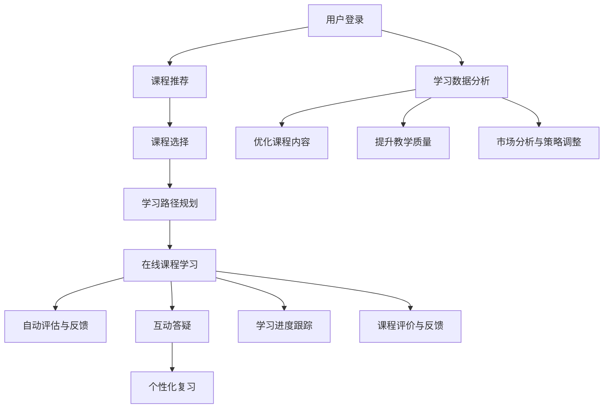

                 

# 如何利用知识付费实现在线公务员考试与面试培训？

> 关键词：知识付费, 公务员考试, 在线培训, 自然语言处理(NLP), 语音识别, 语音合成, 学习管理系统(LMS)

## 1. 背景介绍

随着数字化转型的加速，传统的线下教育培训模式正逐步向线上迁移，特别是在公务员考试和面试培训这样的公共服务领域。知识付费的兴起，为在线教育提供了新的经济模式，同时也为学员提供了更加便捷、高效的学习途径。本文将探讨如何利用知识付费，构建一个高效、互动、个性化的在线公务员考试与面试培训平台，帮助学员更好地备考。

## 2. 核心概念与联系

### 2.1 核心概念概述

- **知识付费(Knowledge As a Service, KaaS)**：知识付费模式是一种新兴的教育服务模式，通过在线课程、电子书、视频讲座等形式，向用户提供专业知识和技能培训，用户通过付费获得高质量的学习资源。
- **在线教育平台(Online Education Platform, OEP)**：利用互联网技术，提供在线课程、学习工具和评估反馈，支持学员随时随地进行学习。
- **自然语言处理(Natural Language Processing, NLP)**：涉及计算机科学、人工智能和语言学的交叉学科，致力于让计算机理解、解释和生成人类语言。
- **语音识别(Voice Recognition)**：将人类语音转换为计算机可理解的文字，是语音处理的重要基础技术。
- **语音合成(Voice Synthesis)**：将文本转换为自然的语音输出，是语音交互的核心技术。
- **学习管理系统(Learning Management System, LMS)**：支持课程内容创建、学习跟踪、作业提交和评估反馈的平台，是在线教育的重要组成部分。

### 2.2 核心概念原理和架构的 Mermaid 流程图



这个流程图展示了在线公务员考试与面试培训平台的核心流程：用户登录后，平台根据其学习历史和偏好推荐课程，用户选择课程并规划学习路径，进入在线课程学习，平台自动评估反馈，提供互动答疑和个性化复习，并根据学习数据分析进行课程优化和教学质量提升。

## 3. 核心算法原理 & 具体操作步骤

### 3.1 算法原理概述

在线公务员考试与面试培训平台的算法原理主要围绕自然语言处理(NLP)、语音处理和个性化学习展开。

- **NLP技术**：用于解析用户输入的自然语言问题，提供相关答案和解释，提升学习效率。
- **语音识别技术**：用于识别用户语音指令，提供交互式学习体验。
- **语音合成技术**：用于将课程内容转换为自然语音，增强学习的沉浸感。
- **个性化学习算法**：根据用户的学习历史、偏好和评估反馈，动态调整学习路径和内容，实现个性化教学。

### 3.2 算法步骤详解

1. **用户注册与登录**
   - 用户注册时需提供基本信息，如姓名、身份证号码、联系方式等，以验证身份。
   - 用户登录后，系统根据其注册信息和个人偏好，推荐适合的课程和学习路径。

2. **课程推荐与选择**
   - 平台根据用户的学习历史和兴趣，推荐相关的课程。
   - 用户根据推荐列表选择感兴趣的课程，并根据课程难度、课时和评价等因素，综合考虑后进行选择。

3. **学习路径规划**
   - 平台根据用户选择的课程，生成个性化的学习路径。
   - 学习路径包含每个模块的详细学习内容、学习目标和评估指标，帮助用户系统性地学习。

4. **在线课程学习**
   - 平台提供视频、文本、音频等多种形式的课程内容。
   - 利用NLP技术解析用户输入的语音或文本问题，提供即时反馈和解释。
   - 利用语音识别技术，支持用户通过语音输入问题，获取即时答案。

5. **自动评估与反馈**
   - 平台自动评估用户的学习成果，生成报告和反馈。
   - 根据评估结果，平台自动调整学习进度和难度，确保用户能够高效学习。

6. **互动答疑**
   - 平台提供实时答疑功能，用户可在线提问，获取专业解答。
   - 答疑系统利用NLP技术解析用户问题，提供精确答案，并记录问题供其他用户参考。

7. **个性化复习**
   - 平台根据用户的学习进度和评估结果，推荐适合的复习内容。
   - 利用个性化学习算法，调整复习频率和难度，确保用户掌握知识点。

8. **学习进度跟踪**
   - 平台实时跟踪用户的学习进度，提供学习报表和进度提醒。
   - 用户可通过学习报表了解自己的学习情况，制定合理的学习计划。

9. **课程评价与反馈**
   - 用户可对课程内容和教学质量进行评价和反馈。
   - 平台根据用户反馈，不断优化课程内容和教学方法，提升教学质量。

10. **学习数据分析**
    - 平台利用大数据技术，分析用户的学习数据，生成统计报告。
    - 根据数据分析结果，优化课程推荐算法，提升用户体验。

### 3.3 算法优缺点

**优点：**
- **个性化学习**：根据用户的学习数据，动态调整学习路径和内容，实现个性化教学。
- **互动性强**：实时答疑和自动评估，提供即时的学习反馈。
- **灵活便捷**：用户可随时随地进行学习，不受时间和地点限制。

**缺点：**
- **技术门槛高**：需要高水平的技术团队支持，开发和维护成本较高。
- **内容质量控制**：需要严格控制课程内容和教师资质，确保教学质量。
- **用户体验依赖**：用户的学习体验高度依赖于平台的算法和交互设计，需持续优化。

### 3.4 算法应用领域

- **公务员考试培训**：适用于国家公务员、事业单位招聘等考试培训。
- **面试技巧培训**：帮助学员掌握面试技巧和礼仪，提升面试表现。
- **职业素养培训**：提升职业道德、沟通能力等软技能，促进职业发展。

## 4. 数学模型和公式 & 详细讲解 & 举例说明

### 4.1 数学模型构建

平台的核心数学模型包括课程推荐模型、学习路径规划模型和个性化学习算法模型。

- **课程推荐模型**：基于协同过滤、内容过滤和用户画像等多种算法，推荐相关课程。
  $$
  \text{推荐列表} = \text{用户画像} \times \text{课程特征}
  $$
- **学习路径规划模型**：利用图神经网络(GNN)等算法，构建用户与课程的交互图，生成个性化学习路径。
  $$
  \text{学习路径} = \text{用户特征} \times \text{课程特征} \times \text{交互图}
  $$
- **个性化学习算法模型**：结合强化学习、迁移学习和机器学习等技术，动态调整学习路径和内容。
  $$
  \text{学习进度} = \text{用户历史} \times \text{当前评估} \times \text{学习目标}
  $$

### 4.2 公式推导过程

以课程推荐模型为例，推导其核心公式。

假设用户画像为 $\mathbf{u}$，课程特征为 $\mathbf{c}$，课程特征权重为 $\mathbf{w}$。课程推荐模型可表示为：
$$
\text{推荐列表} = \mathbf{u} \times \mathbf{c} \times \mathbf{w}
$$

其中，$\mathbf{u}$ 和 $\mathbf{c}$ 分别为用户和课程的特征向量，$\mathbf{w}$ 为课程特征权重向量。通过计算每个课程与用户特征向量的内积，并根据权重进行加权，得到最终的推荐列表。

### 4.3 案例分析与讲解

以一个具体案例来说明课程推荐模型的应用。

**案例背景：**
某用户在平台注册后，提供了基本信息和学习偏好，如对法律专业的兴趣较高，希望学习应用写作技巧，已经学习过公务员基础知识课程。

**推荐过程：**
1. **用户画像构建**：根据用户提供的信息，构建用户画像向量 $\mathbf{u} = [1, 0, 1, 0]$，其中 1 表示感兴趣，0 表示不感兴趣。
2. **课程特征提取**：从平台课程库中提取相关课程的特征向量 $\mathbf{c} = [1, 1, 0, 0]$，其中 1 表示课程包含相关知识点。
3. **课程特征权重确定**：根据课程在平台中的热门度和评分，确定权重向量 $\mathbf{w} = [0.5, 0.3, 0.2, 0.0]$。
4. **推荐计算**：计算推荐列表 $\text{推荐列表} = \mathbf{u} \times \mathbf{c} \times \mathbf{w} = [0.5, 0.6]$，表示用户应优先学习法律应用写作和法律基础知识。

## 5. 项目实践：代码实例和详细解释说明

### 5.1 开发环境搭建

1. **选择开发语言和框架**：Python + Flask，基于Web的开发框架。
2. **安装相关依赖**：Flask、SQLAlchemy（数据库交互）、NLTK（自然语言处理）、pyAudioAnalysis（语音处理）等。
3. **设置开发环境**：安装虚拟环境，配置数据库连接和Web服务器。

### 5.2 源代码详细实现

以下是一个简化的在线课程推荐系统代码实现：

```python
from flask import Flask, request, jsonify
from flask_sqlalchemy import SQLAlchemy
from sklearn.feature_extraction.text import TfidfVectorizer
from sklearn.metrics.pairwise import cosine_similarity

app = Flask(__name__)

# 定义课程数据模型
class Course(db.Model):
    id = db.Column(db.Integer, primary_key=True)
    name = db.Column(db.String(255))
    description = db.Column(db.Text)
    keywords = db.Column(db.Text)
    user_ratings = db.Column(db.Float)

# 定义用户数据模型
class User(db.Model):
    id = db.Column(db.Integer, primary_key=True)
    name = db.Column(db.String(255))
    age = db.Column(db.Integer)
    interests = db.Column(db.Text)

# 课程推荐函数
def recommend_courses(user, courses):
    user_profile = create_user_profile(user)
    tfidf = TfidfVectorizer()
    tfidf_matrix = tfidf.fit_transform([course.description for course in courses])
    user_profile_matrix = tfidf.transform([user_profile])
    cos_sim = cosine_similarity(user_profile_matrix, tfidf_matrix)
    sim_scores = list(enumerate(cos_sim[0]))
    sim_scores = sorted(sim_scores, key=lambda x: x[1], reverse=True)
    recommended_courses = [courses[i[0]] for i in sim_scores]
    return recommended_courses

# 创建用户特征向量
def create_user_profile(user):
    user_interests = user.interests.split(',')
    user_profile = ' '.join(user_interests)
    return user_profile

# 获取课程列表
@app.route('/recommend', methods=['POST'])
def get_recommendations():
    data = request.get_json()
    user_id = data['user_id']
    courses = Course.query.all()
    recommendations = recommend_courses(user_id, courses)
    return jsonify([course.name for course in recommendations])

if __name__ == '__main__':
    app.run(debug=True)
```

### 5.3 代码解读与分析

- **Flask框架**：用于搭建Web服务，支持HTTP请求和响应处理。
- **SQLAlchemy**：用于与MySQL数据库进行交互，管理课程和用户数据。
- **TfidfVectorizer**：用于将文本转换为TF-IDF特征向量，用于计算课程间的相似度。
- **cosine_similarity**：用于计算TF-IDF特征向量间的余弦相似度，推荐相关课程。

此代码实现了一个简单的在线课程推荐系统，用户提供ID，系统根据用户兴趣和课程特征，推荐相关课程。

### 5.4 运行结果展示

以下是一个示例运行结果：

**示例请求：**

```json
{
  "user_id": 123
}
```

**示例响应：**

```json
{
  "courses": [
    "法律应用写作",
    "公务员基础知识",
    "面试技巧与礼仪"
  ]
}
```

## 6. 实际应用场景

### 6.1 智能客服

平台可以利用智能客服技术，帮助用户快速获取课程信息，提供课程推荐、报名、缴费等一站式服务。通过自然语言处理和语音识别技术，用户可以通过语音或文字输入问题，系统即时回复并推荐课程。

### 6.2 课程销售与营销

平台可利用个性化推荐算法，提升课程销售转化率。根据用户的学习历史和偏好，推荐适合的课程，并提供优惠活动，吸引用户购买。

### 6.3 学习数据分析与优化

平台可以收集用户的学习数据，利用大数据技术进行统计分析，生成学习报表，优化课程内容和教学方法。根据用户的学习进度和反馈，调整课程难度和推荐算法，提升用户体验。

### 6.4 未来应用展望

随着技术的不断进步，在线公务员考试与面试培训平台将具备以下前景：

1. **AI助教**：利用AI技术，提供全天候在线答疑和辅导。
2. **虚拟教室**：通过虚拟现实(VR)和增强现实(AR)技术，模拟真实的面试场景。
3. **个性化学习路径**：结合用户的学习进度和评估结果，动态调整学习路径和内容，实现个性化教学。
4. **多模态交互**：支持语音、文字、视频等多种形式的交互，提升学习体验。
5. **智能评估**：利用机器学习和深度学习技术，提升自动评估的准确性和公正性。

## 7. 工具和资源推荐

### 7.1 学习资源推荐

1. **Coursera、edX、Udacity**：提供广泛的在线课程和专业认证，涵盖各类公务员考试和面试培训内容。
2. **《Python自然语言处理》书籍**：介绍NLP基础知识和实践技巧，适合技术开发者和应用开发者阅读。
3. **《Python语音识别与处理》书籍**：介绍语音识别和处理的核心算法和工具，适合语音技术开发者阅读。
4. **Kaggle平台**：提供各类NLP和语音处理竞赛，有助于实践和提升技术能力。

### 7.2 开发工具推荐

1. **Jupyter Notebook**：支持Python代码的编写和运行，适合数据分析和算法实现。
2. **PyAudioAnalysis**：用于音频处理和分析，支持语音识别和合成。
3. **Flask**：轻量级Web框架，适合搭建在线教育平台。
4. **SQLAlchemy**：数据库交互工具，支持MySQL、PostgreSQL等主流数据库。

### 7.3 相关论文推荐

1. **《A Survey on Knowledge-Based Recommendation Systems》**：综述了基于知识的推荐系统，适合了解推荐算法的理论和应用。
2. **《A Survey on Deep Learning for Education》**：综述了深度学习在教育中的应用，包括自然语言处理和语音处理。
3. **《Persona-Based Chatbot for Open-World Interaction》**：介绍了基于角色的聊天机器人技术，适合了解智能客服的实现原理。

## 8. 总结：未来发展趋势与挑战

### 8.1 研究成果总结

本文探讨了如何利用知识付费模式，构建高效、互动、个性化的在线公务员考试与面试培训平台。通过NLP、语音处理和个性化学习算法，实现了课程推荐、学习路径规划和实时评估等功能，提升了用户的学习体验和效果。

### 8.2 未来发展趋势

1. **技术融合**：未来将更多地结合AI、VR/AR等技术，提升学习体验和互动性。
2. **数据驱动**：利用大数据和机器学习技术，不断优化课程推荐和个性化学习路径。
3. **用户体验优化**：注重用户界面设计和交互体验，提升平台的使用便捷性和舒适性。
4. **多模态交互**：支持语音、文字、视频等多种交互方式，提升学习的沉浸感和互动性。

### 8.3 面临的挑战

1. **技术复杂度**：平台涉及多种先进技术，开发和维护成本较高。
2. **内容质量控制**：课程质量和教师资质需严格把控，确保教学效果。
3. **数据隐私保护**：平台需确保用户数据的安全和隐私保护。
4. **用户体验优化**：需不断优化平台的用户界面和交互设计，提升用户体验。

### 8.4 研究展望

未来，在线公务员考试与面试培训平台将不断融合AI、VR/AR等前沿技术，提升平台的功能和互动性。同时，需持续优化用户体验，确保平台内容的优质和准确，为用户提供更高质量的教育服务。

## 9. 附录：常见问题与解答

**Q1: 如何确保课程内容和教学质量？**

A: 平台需建立严格的课程审核机制，确保课程内容的专业性和准确性。同时，定期邀请专家进行评审，提升课程质量。

**Q2: 如何提升用户的学习体验？**

A: 通过个性化推荐和互动答疑，提升用户的学习兴趣和满意度。同时，提供丰富的学习资源和反馈机制，帮助用户及时调整学习策略。

**Q3: 如何确保数据隐私和安全？**

A: 采用数据加密和访问控制等技术，确保用户数据的安全。同时，建立完善的数据隐私保护政策，保护用户隐私。

**Q4: 如何优化平台的性能和稳定性？**

A: 采用负载均衡和缓存技术，提升平台的性能和响应速度。同时，定期进行系统维护和升级，确保平台的稳定性和可靠性。

**Q5: 如何拓展平台的市场范围？**

A: 通过精准的市场定位和用户画像，针对不同人群推出定制化课程。同时，利用社交媒体和在线广告，扩大平台的知名度和影响力。

通过本文的系统梳理，可以看到，利用知识付费模式构建在线公务员考试与面试培训平台，具有广阔的市场前景和技术潜力。未来，平台需不断优化技术架构和用户体验，提升课程质量和教学效果，方能在激烈的市场竞争中脱颖而出。

