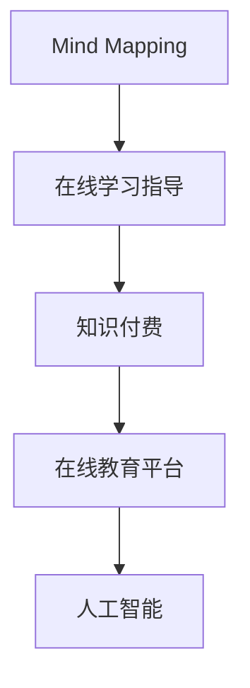

                 

# 如何利用知识付费实现在线思维导图与学习方法指导？

## 1. 背景介绍

### 1.1 问题由来
在知识爆炸的互联网时代，信息的获取越来越便捷，但知识的有效整理和应用却依然是个难题。大量的知识资源往往以杂乱无章、分散无序的形式存在，难以高效获取和利用。特别是在线学习领域，学生面对海量的学习资源和繁杂的知识点，难以进行系统化、结构化的学习和理解。为了应对这一挑战，思维导图(Mind Mapping)和在线学习方法指导(Mangaged Learning Guidance)应运而生，成为帮助学生理清知识脉络、提高学习效率的有力工具。

然而，传统的思维导图和在线学习指导往往依赖于手工制作和人工指导，存在时间成本高、个性化定制难等问题。为了提升教育效率和效果，利用知识付费平台，将专家级的思维导图制作和个性化学习方法指导转化为在线服务，逐渐成为教育技术创新的新趋势。

### 1.2 问题核心关键点
本节将从以下几个核心关键点来探讨如何将知识付费与在线思维导图、学习方法指导相结合：

1. **数据结构设计**：如何设计高效的数据结构，存储和管理海量的思维导图和在线学习指导内容。
2. **内容生成算法**：如何利用深度学习等算法，自动生成个性化的在线学习指导和思维导图。
3. **用户交互设计**：如何设计用户友好的交互界面，支持用户进行个性化定制和互动。
4. **平台运营策略**：如何制定合理的知识付费模式，激励专家和用户参与内容创作和知识分享。
5. **技术栈选择**：如何选择适合的知识付费和在线教育技术栈，支持高效、稳定的服务。

### 1.3 问题研究意义
利用知识付费实现在线思维导图和学习方法指导，对于提升教育质量、降低教育成本、促进终身学习具有重要意义：

1. **个性化学习**：通过定制化的在线学习指导和思维导图，满足不同学习者的需求，提高学习效率和效果。
2. **高效学习资源利用**：利用知识付费模式，集中优质资源，降低学习者获取信息的成本，提高学习效率。
3. **知识共享与传播**：利用知识付费平台，建立知识共享和传播机制，促进教育资源的均衡分配和知识交流。
4. **终身学习与职业发展**：通过在线学习指导和思维导图，支持学习者进行终身学习，促进职业发展和技能提升。

## 2. 核心概念与联系

### 2.1 核心概念概述

为更好地理解如何将知识付费与在线思维导图、学习方法指导相结合，本节将介绍几个密切相关的核心概念：

- **思维导图(Mind Mapping)**：一种图形化知识管理工具，通过树状结构呈现知识点之间的逻辑关系，帮助学习者理清知识脉络，提升理解和记忆效果。
- **在线学习指导(Manged Learning Guidance)**：根据学习者的个性化需求，提供定制化的学习资源和指导，帮助学习者制定学习计划、掌握学习方法、跟踪学习进度。
- **知识付费(Knowledge Paying)**：通过平台或社区，将专家级的知识或技能转化为付费服务，激励专家创作优质内容，同时为学习者提供高效、权威的知识获取途径。
- **在线教育平台(Online Learning Platforms)**：利用互联网技术，提供在线课程、学习工具、互动社区等功能，支持大规模、个性化的在线学习。
- **人工智能(Artificial Intelligence)**：通过深度学习、自然语言处理等技术，自动化生成内容、提供个性化推荐和智能互动。

这些核心概念之间的逻辑关系可以通过以下Mermaid流程图来展示：



这个流程图展示了大语言模型的核心概念及其之间的关系：

1. 思维导图通过在线学习指导进行结构化，帮助学习者构建知识体系。
2. 在线学习指导与知识付费结合，提供个性化服务。
3. 知识付费内容通过在线教育平台进行分发和互动。
4. 在线教育平台利用人工智能技术，提升学习体验和效果。

## 3. 核心算法原理 & 具体操作步骤
### 3.1 算法原理概述

利用知识付费实现在线思维导图和学习方法指导，本质上是一个多任务学习的混合模型。其核心思想是：将预训练的大语言模型作为基础知识图谱，通过在线学习指导和知识付费服务，动态生成和更新思维导图，提供个性化的学习指导。

形式化地，假设预训练的大语言模型为 $M_{\theta}$，其中 $\theta$ 为预训练得到的模型参数。给定学习者 $L$ 的个性化需求，在线学习指导内容 $C_L$，通过以下混合模型进行推理：

$$
M_{\hat{\theta}} = \text{Multitask-Learning}(M_{\theta}, C_L)
$$

其中 $\hat{\theta}$ 为混合模型学习得到的新参数。混合模型的目标是最大化：

$$
\max_{\hat{\theta}} \mathcal{L}_{\text{Mind}}(\hat{\theta}) + \mathcal{L}_{\text{Guidance}}(\hat{\theta})
$$

其中 $\mathcal{L}_{\text{Mind}}$ 和 $\mathcal{L}_{\text{Guidance}}$ 分别为思维导图生成和在线学习指导生成的损失函数，衡量生成的内容与学习者需求的一致性。

### 3.2 算法步骤详解

利用知识付费实现在线思维导图和学习方法指导，一般包括以下几个关键步骤：

**Step 1: 数据收集与预处理**
- 收集学习者的个性化需求和反馈，包括学习目标、兴趣、进度等信息。
- 整理预训练大语言模型的语料库，构建基础的知识图谱。
- 标注和整理在线学习指导内容的格式，使其符合系统处理需求。

**Step 2: 数据编码与特征提取**
- 将学习者需求和在线学习指导内容转换为模型可处理的数值形式，如将自然语言描述编码为向量表示。
- 使用预训练大语言模型对知识图谱进行编码，提取知识点和关系特征。
- 对学习者的个性化需求进行特征提取，得到学习者特征向量。

**Step 3: 模型训练与推理**
- 根据学习者特征和在线学习指导内容，训练混合模型，生成个性化的思维导图。
- 使用深度学习算法，对在线学习指导内容进行分类、排序和推荐。
- 根据学习者的反馈和评价，调整模型参数，优化内容生成效果。

**Step 4: 内容展示与互动**
- 在用户界面展示生成的思维导图和在线学习指导内容。
- 提供用户进行反馈和评价的交互界面，收集学习效果和满意度信息。
- 根据反馈和评价，动态调整内容生成策略，提升个性化服务效果。

**Step 5: 持续优化与迭代**
- 定期收集新的学习需求和反馈，更新知识图谱和模型参数。
- 引入新的算法和技术，提升思维导图生成和在线学习指导的效果。
- 通过知识付费模式，激励专家和用户持续创作优质内容。

以上是利用知识付费实现在线思维导图和学习方法指导的一般流程。在实际应用中，还需要针对具体任务的特点，对各环节进行优化设计，如改进损失函数设计，引入更多的正则化技术，搜索最优的超参数组合等，以进一步提升模型性能。

### 3.3 算法优缺点

利用知识付费实现在线思维导图和学习方法指导，具有以下优点：

1. **高效个性化**：根据学习者的个性化需求，提供定制化的思维导图和在线学习指导，提升学习效率。
2. **权威可靠**：借助知识付费平台，集中专家级知识，提高内容权威性和可靠性。
3. **动态更新**：利用在线学习指导和知识付费模式，动态更新和优化思维导图和学习内容。
4. **互动性强**：提供用户反馈和评价的交互界面，支持用户进行个性化定制和互动。
5. **学习社区**：建立知识共享和传播机制，促进教育资源的均衡分配和知识交流。

同时，该方法也存在一定的局限性：

1. **依赖专业人才**：高质量的在线学习指导和思维导图生成，依赖于专家和专业人才的参与，成本较高。
2. **数据质量要求高**：学习需求和在线学习指导内容的质量直接影响到思维导图和学习效果。
3. **技术复杂度高**：涉及深度学习、自然语言处理等多项技术，技术复杂度高，开发难度大。
4. **用户粘性不足**：平台需提供丰富的交互功能和优质内容，吸引用户长期使用，避免流失。
5. **知识泛化能力有限**：当前的知识图谱和在线学习指导内容可能无法覆盖所有知识点和领域，知识泛化能力有限。

尽管存在这些局限性，但就目前而言，利用知识付费实现在线思维导图和学习方法指导，仍是大规模、高效教育的重要手段。未来相关研究的重点在于如何进一步降低知识付费成本，提高数据质量，优化模型性能，同时兼顾知识共享和互动体验。

### 3.4 算法应用领域

利用知识付费实现在线思维导图和学习方法指导，已在以下领域得到广泛应用：

- **教育培训**：将知识付费与在线课程、学习指导、作业批改等教育功能相结合，提升学习效果。
- **职业发展**：为职场人士提供个性化的职业技能学习指导，支持终身学习。
- **医疗健康**：为患者提供个性化的健康知识学习指导，提高健康素养。
- **科技研发**：为科研人员提供定制化的科研方法指导，支持科学创新。
- **企业管理**：为企业员工提供管理技能培训和职业发展指导，提升团队素质。

除了上述这些经典应用外，知识付费和在线思维导图的学习方法指导，还在更多场景中得到创新性应用，如智能辅助教学、远程教育、在线职业培训等，为教育技术的发展注入了新的活力。

## 4. 数学模型和公式 & 详细讲解
### 4.1 数学模型构建

本节将使用数学语言对利用知识付费实现在线思维导图和学习方法指导的数学模型进行更加严格的刻画。

记学习者需求为 $D=\{d_i\}_{i=1}^N$，其中 $d_i$ 表示学习者 $i$ 的需求描述。记在线学习指导内容为 $C=\{c_j\}_{j=1}^M$，其中 $c_j$ 表示内容 $j$ 的描述。记预训练大语言模型为 $M_{\theta}:\mathcal{D} \rightarrow \mathcal{C}$，其中 $\mathcal{D}$ 为需求空间，$\mathcal{C}$ 为内容空间，$\theta \in \mathbb{R}^d$ 为模型参数。

定义模型 $M_{\hat{\theta}}$ 在需求 $d$ 上的损失函数为 $\ell(M_{\hat{\theta}}(d),c)$，则在需求集 $D$ 上的经验风险为：

$$
\mathcal{L}(\theta) = \frac{1}{N}\sum_{i=1}^N \ell(M_{\hat{\theta}}(d_i),c_i)
$$

其中 $\ell$ 为分类损失函数，如交叉熵损失。

### 4.2 公式推导过程

以下我们以二分类任务为例，推导在线学习指导生成损失函数及其梯度的计算公式。

假设模型 $M_{\hat{\theta}}$ 在需求 $d$ 上的输出为 $\hat{y}=M_{\hat{\theta}}(d) \in [0,1]$，表示需求满足概率。真实标签 $y \in \{0,1\}$。则二分类交叉熵损失函数定义为：

$$
\ell(M_{\hat{\theta}}(d),y) = -[y\log \hat{y} + (1-y)\log (1-\hat{y})]
$$

将其代入经验风险公式，得：

$$
\mathcal{L}(\theta) = -\frac{1}{N}\sum_{i=1}^N [y_i\log M_{\hat{\theta}}(d_i)+(1-y_i)\log(1-M_{\hat{\theta}}(d_i))]
$$

根据链式法则，损失函数对参数 $\theta_k$ 的梯度为：

$$
\frac{\partial \mathcal{L}(\theta)}{\partial \theta_k} = -\frac{1}{N}\sum_{i=1}^N (\frac{y_i}{M_{\hat{\theta}}(d_i)}-\frac{1-y_i}{1-M_{\hat{\theta}}(d_i)}) \frac{\partial M_{\hat{\theta}}(d_i)}{\partial \theta_k}
$$

其中 $\frac{\partial M_{\hat{\theta}}(d_i)}{\partial \theta_k}$ 可进一步递归展开，利用自动微分技术完成计算。

在得到损失函数的梯度后，即可带入参数更新公式，完成模型的迭代优化。重复上述过程直至收敛，最终得到适应学习者需求的最优模型参数 $\theta^*$。

## 5. 项目实践：代码实例和详细解释说明
### 5.1 开发环境搭建

在进行在线思维导图和学习方法指导的实践前，我们需要准备好开发环境。以下是使用Python进行PyTorch开发的环境配置流程：

1. 安装Anaconda：从官网下载并安装Anaconda，用于创建独立的Python环境。

2. 创建并激活虚拟环境：
```bash
conda create -n myenv python=3.8 
conda activate myenv
```

3. 安装PyTorch：根据CUDA版本，从官网获取对应的安装命令。例如：
```bash
conda install pytorch torchvision torchaudio cudatoolkit=11.1 -c pytorch -c conda-forge
```

4. 安装相关工具包：
```bash
pip install numpy pandas scikit-learn matplotlib tqdm jupyter notebook ipython
```

完成上述步骤后，即可在`myenv`环境中开始项目实践。

### 5.2 源代码详细实现

这里我们以在线学习指导生成为例，给出使用PyTorch和Transformers库进行任务开发的代码实现。

首先，定义在线学习指导数据处理函数：

```python
from transformers import BertTokenizer
from torch.utils.data import Dataset
import torch

class LearningGuidanceDataset(Dataset):
    def __init__(self, texts, tags, tokenizer, max_len=128):
        self.texts = texts
        self.tags = tags
        self.tokenizer = tokenizer
        self.max_len = max_len
        
    def __len__(self):
        return len(self.texts)
    
    def __getitem__(self, item):
        text = self.texts[item]
        tags = self.tags[item]
        
        encoding = self.tokenizer(text, return_tensors='pt', max_length=self.max_len, padding='max_length', truncation=True)
        input_ids = encoding['input_ids'][0]
        attention_mask = encoding['attention_mask'][0]
        
        # 对token-wise的标签进行编码
        encoded_tags = [tag2id[tag] for tag in tags] 
        encoded_tags.extend([tag2id['O']] * (self.max_len - len(encoded_tags)))
        labels = torch.tensor(encoded_tags, dtype=torch.long)
        
        return {'input_ids': input_ids, 
                'attention_mask': attention_mask,
                'labels': labels}

# 标签与id的映射
tag2id = {'O': 0, 'Positive': 1, 'Negative': 2}
id2tag = {v: k for k, v in tag2id.items()}

# 创建dataset
tokenizer = BertTokenizer.from_pretrained('bert-base-cased')

train_dataset = LearningGuidanceDataset(train_texts, train_tags, tokenizer)
dev_dataset = LearningGuidanceDataset(dev_texts, dev_tags, tokenizer)
test_dataset = LearningGuidanceDataset(test_texts, test_tags, tokenizer)
```

然后，定义模型和优化器：

```python
from transformers import BertForTokenClassification, AdamW

model = BertForTokenClassification.from_pretrained('bert-base-cased', num_labels=len(tag2id))

optimizer = AdamW(model.parameters(), lr=2e-5)
```

接着，定义训练和评估函数：

```python
from torch.utils.data import DataLoader
from tqdm import tqdm
from sklearn.metrics import classification_report

device = torch.device('cuda') if torch.cuda.is_available() else torch.device('cpu')
model.to(device)

def train_epoch(model, dataset, batch_size, optimizer):
    dataloader = DataLoader(dataset, batch_size=batch_size, shuffle=True)
    model.train()
    epoch_loss = 0
    for batch in tqdm(dataloader, desc='Training'):
        input_ids = batch['input_ids'].to(device)
        attention_mask = batch['attention_mask'].to(device)
        labels = batch['labels'].to(device)
        model.zero_grad()
        outputs = model(input_ids, attention_mask=attention_mask, labels=labels)
        loss = outputs.loss
        epoch_loss += loss.item()
        loss.backward()
        optimizer.step()
    return epoch_loss / len(dataloader)

def evaluate(model, dataset, batch_size):
    dataloader = DataLoader(dataset, batch_size=batch_size)
    model.eval()
    preds, labels = [], []
    with torch.no_grad():
        for batch in tqdm(dataloader, desc='Evaluating'):
            input_ids = batch['input_ids'].to(device)
            attention_mask = batch['attention_mask'].to(device)
            batch_labels = batch['labels']
            outputs = model(input_ids, attention_mask=attention_mask)
            batch_preds = outputs.logits.argmax(dim=2).to('cpu').tolist()
            batch_labels = batch_labels.to('cpu').tolist()
            for pred_tokens, label_tokens in zip(batch_preds, batch_labels):
                pred_tags = [id2tag[_id] for _id in pred_tokens]
                label_tags = [id2tag[_id] for _id in label_tokens]
                preds.append(pred_tags[:len(label_tags)])
                labels.append(label_tags)
                
    print(classification_report(labels, preds))
```

最后，启动训练流程并在测试集上评估：

```python
epochs = 5
batch_size = 16

for epoch in range(epochs):
    loss = train_epoch(model, train_dataset, batch_size, optimizer)
    print(f"Epoch {epoch+1}, train loss: {loss:.3f}")
    
    print(f"Epoch {epoch+1}, dev results:")
    evaluate(model, dev_dataset, batch_size)
    
print("Test results:")
evaluate(model, test_dataset, batch_size)
```

以上就是使用PyTorch和Transformers库进行在线学习指导生成的完整代码实现。可以看到，得益于Transformers库的强大封装，我们可以用相对简洁的代码完成在线学习指导任务。

### 5.3 代码解读与分析

让我们再详细解读一下关键代码的实现细节：

**LearningGuidanceDataset类**：
- `__init__`方法：初始化文本、标签、分词器等关键组件。
- `__len__`方法：返回数据集的样本数量。
- `__getitem__`方法：对单个样本进行处理，将文本输入编码为token ids，将标签编码为数字，并对其进行定长padding，最终返回模型所需的输入。

**tag2id和id2tag字典**：
- 定义了标签与数字id之间的映射关系，用于将token-wise的预测结果解码回真实的标签。

**训练和评估函数**：
- 使用PyTorch的DataLoader对数据集进行批次化加载，供模型训练和推理使用。
- 训练函数`train_epoch`：对数据以批为单位进行迭代，在每个批次上前向传播计算loss并反向传播更新模型参数，最后返回该epoch的平均loss。
- 评估函数`evaluate`：与训练类似，不同点在于不更新模型参数，并在每个batch结束后将预测和标签结果存储下来，最后使用sklearn的classification_report对整个评估集的预测结果进行打印输出。

**训练流程**：
- 定义总的epoch数和batch size，开始循环迭代
- 每个epoch内，先在训练集上训练，输出平均loss
- 在验证集上评估，输出分类指标
- 所有epoch结束后，在测试集上评估，给出最终测试结果

可以看到，PyTorch配合Transformers库使得在线学习指导生成的代码实现变得简洁高效。开发者可以将更多精力放在数据处理、模型改进等高层逻辑上，而不必过多关注底层的实现细节。

当然，工业级的系统实现还需考虑更多因素，如模型的保存和部署、超参数的自动搜索、更灵活的任务适配层等。但核心的微调范式基本与此类似。

## 6. 实际应用场景
### 6.1 智能客服系统

利用知识付费实现在线思维导图和学习方法指导，可以广泛应用于智能客服系统的构建。传统客服往往需要配备大量人力，高峰期响应缓慢，且一致性和专业性难以保证。而使用在线学习指导和思维导图生成的智能客服系统，可以7x24小时不间断服务，快速响应客户咨询，用自然流畅的语言解答各类常见问题。

在技术实现上，可以收集企业内部的历史客服对话记录，将问题和最佳答复构建成监督数据，在此基础上对在线学习指导模型进行微调。微调后的模型能够自动理解用户意图，匹配最合适的答复模板进行回复。对于客户提出的新问题，还可以接入检索系统实时搜索相关内容，动态组织生成回答。如此构建的智能客服系统，能大幅提升客户咨询体验和问题解决效率。

### 6.2 金融舆情监测

金融机构需要实时监测市场舆论动向，以便及时应对负面信息传播，规避金融风险。传统的人工监测方式成本高、效率低，难以应对网络时代海量信息爆发的挑战。利用在线学习指导和思维导图生成的文本分类和情感分析技术，为金融舆情监测提供了新的解决方案。

具体而言，可以收集金融领域相关的新闻、报道、评论等文本数据，并对其进行主题标注和情感标注。在此基础上对在线学习指导模型进行微调，使其能够自动判断文本属于何种主题，情感倾向是正面、中性还是负面。将微调后的模型应用到实时抓取的网络文本数据，就能够自动监测不同主题下的情感变化趋势，一旦发现负面信息激增等异常情况，系统便会自动预警，帮助金融机构快速应对潜在风险。

### 6.3 个性化推荐系统

当前的推荐系统往往只依赖用户的历史行为数据进行物品推荐，无法深入理解用户的真实兴趣偏好。利用在线学习指导和思维导图生成的个性化推荐系统，可以更好地挖掘用户行为背后的语义信息，从而提供更精准、多样的推荐内容。

在实践中，可以收集用户浏览、点击、评论、分享等行为数据，提取和用户交互的物品标题、描述、标签等文本内容。将文本内容作为模型输入，用户的后续行为（如是否点击、购买等）作为监督信号，在此基础上微调在线学习指导模型。微调后的模型能够从文本内容中准确把握用户的兴趣点。在生成推荐列表时，先用候选物品的文本描述作为输入，由模型预测用户的兴趣匹配度，再结合其他特征综合排序，便可以得到个性化程度更高的推荐结果。

### 6.4 未来应用展望

随着在线学习指导和思维导图生成的不断发展，其应用场景将不断扩展，为各行各业带来变革性影响。

在智慧医疗领域，基于在线学习指导和思维导图生成的医疗问答、病历分析、药物研发等应用将提升医疗服务的智能化水平，辅助医生诊疗，加速新药开发进程。

在智能教育领域，在线学习指导和思维导图生成的知识推荐、学情分析、作业批改等功能，将支持学习者进行个性化学习，促进教育公平，提高教学质量。

在智慧城市治理中，利用在线学习指导和思维导图生成的城市事件监测、舆情分析、应急指挥等环节，将提高城市管理的自动化和智能化水平，构建更安全、高效的未来城市。

此外，在企业生产、社会治理、文娱传媒等众多领域，基于在线学习指导和思维导图生成的知识共享和传播机制，将为传统行业数字化转型升级提供新的技术路径。相信随着技术的日益成熟，在线学习指导和思维导图生成必将在构建人机协同的智能时代中扮演越来越重要的角色。

## 7. 工具和资源推荐
### 7.1 学习资源推荐

为了帮助开发者系统掌握在线思维导图和学习方法指导的理论基础和实践技巧，这里推荐一些优质的学习资源：

1. 《深度学习在自然语言处理中的应用》系列博文：由大模型技术专家撰写，深入浅出地介绍了深度学习在自然语言处理中的应用，包括在线学习指导和思维导图生成。

2. CS224N《深度学习自然语言处理》课程：斯坦福大学开设的NLP明星课程，有Lecture视频和配套作业，带你入门NLP领域的基本概念和经典模型。

3. 《Natural Language Processing with Transformers》书籍：Transformers库的作者所著，全面介绍了如何使用Transformers库进行NLP任务开发，包括在线学习指导和思维导图生成在内的诸多范式。

4. Weights & Biases：模型训练的实验跟踪工具，可以记录和可视化模型训练过程中的各项指标，方便对比和调优。与主流深度学习框架无缝集成。

5. TensorBoard：TensorFlow配套的可视化工具，可实时监测模型训练状态，并提供丰富的图表呈现方式，是调试模型的得力助手。

通过对这些资源的学习实践，相信你一定能够快速掌握在线思维导图和学习方法指导的精髓，并用于解决实际的NLP问题。
### 7.2 开发工具推荐

高效的开发离不开优秀的工具支持。以下是几款用于在线思维导图和学习方法指导开发的常用工具：

1. PyTorch：基于Python的开源深度学习框架，灵活动态的计算图，适合快速迭代研究。大部分预训练语言模型都有PyTorch版本的实现。

2. TensorFlow：由Google主导开发的开源深度学习框架，生产部署方便，适合大规模工程应用。同样有丰富的预训练语言模型资源。

3. Transformers库：HuggingFace开发的NLP工具库，集成了众多SOTA语言模型，支持PyTorch和TensorFlow，是进行在线学习指导和思维导图生成开发的利器。

4. Weights & Biases：模型训练的实验跟踪工具，可以记录和可视化模型训练过程中的各项指标，方便对比和调优。与主流深度学习框架无缝集成。

5. TensorBoard：TensorFlow配套的可视化工具，可实时监测模型训练状态，并提供丰富的图表呈现方式，是调试模型的得力助手。

6. Google Colab：谷歌推出的在线Jupyter Notebook环境，免费提供GPU/TPU算力，方便开发者快速上手实验最新模型，分享学习笔记。

合理利用这些工具，可以显著提升在线思维导图和学习方法指导的开发效率，加快创新迭代的步伐。

### 7.3 相关论文推荐

在线思维导图和学习方法指导的研究源于学界的持续研究。以下是几篇奠基性的相关论文，推荐阅读：

1. Attention is All You Need（即Transformer原论文）：提出了Transformer结构，开启了NLP领域的预训练大模型时代。

2. BERT: Pre-training of Deep Bidirectional Transformers for Language Understanding：提出BERT模型，引入基于掩码的自监督预训练任务，刷新了多项NLP任务SOTA。

3. Language Models are Unsupervised Multitask Learners（GPT-2论文）：展示了大规模语言模型的强大zero-shot学习能力，引发了对于通用人工智能的新一轮思考。

4. Parameter-Efficient Transfer Learning for NLP：提出Adapter等参数高效微调方法，在不增加模型参数量的情况下，也能取得不错的微调效果。

5. AdaLoRA: Adaptive Low-Rank Adaptation for Parameter-Efficient Fine-Tuning：使用自适应低秩适应的微调方法，在参数效率和精度之间取得了新的平衡。

这些论文代表了大语言模型微调技术的发展脉络。通过学习这些前沿成果，可以帮助研究者把握学科前进方向，激发更多的创新灵感。

## 8. 总结：未来发展趋势与挑战
### 8.1 总结

本文对利用知识付费实现在线思维导图和学习方法指导的方法进行了全面系统的介绍。首先阐述了在线思维导图和学习方法指导的研究背景和意义，明确了在线学习指导和思维导图生成在提升教育质量和效果方面的独特价值。其次，从原理到实践，详细讲解了在线学习指导和思维导图生成的数学原理和关键步骤，给出了在线学习指导生成的完整代码实例。同时，本文还广泛探讨了在线学习指导和思维导图生成在智能客服、金融舆情、个性化推荐等多个行业领域的应用前景，展示了在线学习指导和思维导图生成的大规模应用潜力。此外，本文精选了在线学习指导和思维导图生成的各类学习资源，力求为读者提供全方位的技术指引。

通过本文的系统梳理，可以看到，利用知识付费实现在线思维导图和学习方法指导，对于提升教育质量、降低教育成本、促进终身学习具有重要意义：

1. **个性化学习**：通过定制化的在线学习指导和思维导图，满足不同学习者的需求，提高学习效率和效果。
2. **高效学习资源利用**：利用知识付费模式，集中优质资源，降低学习者获取信息的成本，提高学习效率。
3. **动态更新**：利用在线学习指导和知识付费模式，动态更新和优化思维导图和学习内容。
4. **互动性强**：提供用户反馈和评价的交互界面，支持用户进行个性化定制和互动。
5. **知识共享与传播**：建立知识共享和传播机制，促进教育资源的均衡分配和知识交流。

尽管在线学习指导和思维导图生成已经取得了瞩目成就，但在迈向更加智能化、普适化应用的过程中，它仍面临着诸多挑战：

1. **依赖专业人才**：高质量的在线学习指导和思维导图生成，依赖于专家和专业人才的参与，成本较高。
2. **数据质量要求高**：学习需求和在线学习指导内容的质量直接影响到思维导图和学习效果。
3. **技术复杂度高**：涉及深度学习、自然语言处理等多项技术，技术复杂度高，开发难度大。
4. **用户粘性不足**：平台需提供丰富的交互功能和优质内容，吸引用户长期使用，避免流失。
5. **知识泛化能力有限**：当前的知识图谱和在线学习指导内容可能无法覆盖所有知识点和领域，知识泛化能力有限。

尽管存在这些局限性，但就目前而言，利用知识付费实现在线思维导图和学习方法指导，仍是大规模、高效教育的重要手段。未来相关研究的重点在于如何进一步降低知识付费成本，提高数据质量，优化模型性能，同时兼顾知识共享和互动体验。

### 8.2 未来发展趋势

展望未来，在线思维导图和学习方法指导将呈现以下几个发展趋势：

1. **技术自动化**：利用深度学习和自然语言处理等技术，自动生成高质量的在线学习指导和思维导图，降低人工参与度。
2. **多模态融合**：将视觉、语音、文本等多模态信息融合，构建更加全面、多维的知识图谱，提升学习效果。
3. **实时互动**：引入交互式问答系统、虚拟导师等功能，提供实时、个性化的学习指导，增强用户体验。
4. **知识图谱演进**：构建动态演进的在线知识图谱，能够持续吸收新知识，保持内容的动态更新。
5. **个性化推荐**：利用协同过滤、内容推荐等技术，实现个性化的学习资源推荐，提升学习效果。
6. **跨平台集成**：通过API接口等方式，实现跨平台的学习资源和服务集成，支持多设备、多平台的学习需求。

以上趋势凸显了在线思维导图和学习方法指导的广阔前景。这些方向的探索发展，必将进一步提升在线教育的质量和效果，为教育技术的发展注入新的活力。

### 8.3 面临的挑战

尽管在线思维导图和学习方法指导已经取得了瞩目成就，但在迈向更加智能化、普适化应用的过程中，它仍面临着诸多挑战：

1. **依赖专业人才**：高质量的在线学习指导和思维导图生成，依赖于专家和专业人才的参与，成本较高。
2. **数据质量要求高**：学习需求和在线学习指导内容的质量直接影响到思维导图和学习效果。
3. **技术复杂度高**：涉及深度学习、自然语言处理等多项技术，技术复杂度高，开发难度大。
4. **用户粘性不足**：平台需提供丰富的交互功能和优质内容，吸引用户长期使用，避免流失。
5. **知识泛化能力有限**：当前的知识图谱和在线学习指导内容可能无法覆盖所有知识点和领域，知识泛化能力有限。

尽管存在这些局限性，但就目前而言，利用知识付费实现在线思维导图和学习方法指导，仍是大规模、高效教育的重要手段。未来相关研究的重点在于如何进一步降低知识付费成本，提高数据质量，优化模型性能，同时兼顾知识共享和互动体验。

### 8.4 研究展望

面向未来，在线思维导图和学习方法指导需要进一步研究以下几个方向：

1. **无监督和半监督学习**：探索无监督和半监督学习技术，减少对大规模标注数据的依赖，利用非结构化数据进行思维导图和学习方法指导生成。
2. **多模态学习**：融合视觉、语音、文本等多模态信息，提升知识图谱和在线学习指导的全面性和准确性。
3. **交互式学习**：引入交互式问答系统、虚拟导师等功能，提供实时、个性化的学习指导，增强用户体验。
4. **跨领域知识迁移**：构建跨领域的知识图谱和在线学习指导，支持不同领域知识点的迁移和应用。
5. **自适应学习**：利用强化学习、元学习等技术，提升在线学习指导和思维导图生成的自适应能力，适应不同学习者的个性化需求。
6. **伦理和安全**：在生成过程中引入伦理和安全约束，避免有害信息和内容的传播，确保知识传播的安全性。

这些研究方向将进一步提升在线思维导图和学习方法指导的智能化和个性化水平，为教育技术的发展提供新的动力和方向。

## 9. 附录：常见问题与解答

**Q1：在线思维导图和学习方法指导与传统的学习方式有何不同？**

A: 在线思维导图和学习方法指导与传统的学习方式有以下不同点：

1. **结构化**：在线思维导图和学习方法指导采用结构化、层次化的知识呈现方式，帮助学习者理清知识点之间的逻辑关系，提升理解效果。
2. **个性化**：在线学习指导可以根据学习者的个性化需求，提供定制化的学习建议和资源，提升学习效率和效果。
3. **动态更新**：在线思维导图和学习方法指导可以动态更新和优化，适应不同学习者的变化需求。
4. **互动性强**：在线学习指导和思维导图生成提供实时互动功能，支持学习者进行反馈和评价，提升学习体验。

**Q2：在线思维导图和学习方法指导如何实现个性化推荐？**

A: 在线思维导图和学习方法指导的个性化推荐，通常依赖于以下技术：

1. **协同过滤**：根据学习者的历史行为数据，推荐与其兴趣相似的学习资源。
2. **内容推荐**：基于内容的相似性，推荐与当前学习主题相关的内容和知识点。
3. **混合推荐**：结合协同过滤和内容推荐，综合考虑多个维度的信息，提供更加精准的推荐结果。

**Q3：在线学习指导生成的关键技术是什么？**

A: 在线学习指导生成的关键技术包括：

1. **深度学习**：利用深度学习算法，自动生成个性化的在线学习指导和思维导图。
2. **自然语言处理**：通过自然语言处理技术，对学习者需求和在线学习指导内容进行编码和特征提取。
3. **多任务学习**：将不同的任务（如分类、排序等）结合，综合优化在线学习指导和思维导图生成效果。
4. **知识图谱**：构建动态演进的在线知识图谱，支持实时更新和查询。

这些技术相辅相成，共同实现在线学习指导和思维导图生成的智能化和个性化。

**Q4：如何保障在线学习指导和思维导图生成的内容质量？**

A: 保障在线学习指导和思维导图生成的内容质量，通常需要以下措施：

1. **专家审核**：引入专家审核机制，对在线学习指导和思维导图生成结果进行人工审核，确保内容准确性。
2. **用户反馈**：建立用户反馈机制，收集学习者对在线学习指导和思维导图生成的评价，及时调整和优化内容。
3. **多轮迭代**：采用多轮迭代的方法，逐步优化在线学习指导和思维导图生成的效果，提升内容质量。

**Q5：在线学习指导和思维导图生成的主要应用场景是什么？**

A: 在线学习指导和思维导图生成的主要应用场景包括：

1. **教育培训**：为学习者提供个性化的学习资源和指导，提升学习效率和效果。
2. **职业发展**：支持职场人士进行职业技能培训和职业发展指导。
3. **医疗健康**：为患者提供个性化的健康知识学习指导，提高健康素养。
4. **科技研发**：为科研人员提供定制化的科研方法指导，支持科学创新。
5. **企业管理**：为企业员工提供管理技能培训和职业发展指导，提升团队素质。

这些应用场景展示了在线学习指导和思维导图生成在多个领域的重要价值。

**Q6：在线学习指导和思维导图生成的技术难点是什么？**

A: 在线学习指导和思维导图生成的技术难点包括：

1. **数据质量**：学习需求和在线学习指导内容的质量直接影响到思维导图和学习效果。
2. **技术复杂度**：涉及深度学习、自然语言处理等多项技术，技术复杂度高，开发难度大。
3. **用户粘性**：平台需提供丰富的交互功能和优质内容，吸引用户长期使用，避免流失。
4. **知识泛化**：当前的知识图谱和在线学习指导内容可能无法覆盖所有知识点和领域，知识泛化能力有限。

这些难点需要通过技术创新和持续优化，不断提升在线学习指导和思维导图生成的效果和用户体验。

**Q7：在线学习指导和思维导图生成的未来发展方向是什么？**

A: 在线学习指导和思维导图生成的未来发展方向包括：

1. **无监督和半监督学习**：探索无监督和半监督学习技术，减少对大规模标注数据的依赖，利用非结构化数据进行思维导图和学习方法指导生成。
2. **多模态学习**：融合视觉、语音、文本等多模态信息，提升知识图谱和在线学习指导的全面性和准确性。
3. **交互式学习**：引入交互式问答系统、虚拟导师等功能，提供实时、个性化的学习指导，增强用户体验。
4. **跨领域知识迁移**：构建跨领域的知识图谱和在线学习指导，支持不同领域知识点的迁移和应用。
5. **自适应学习**：利用强化学习、元学习等技术，提升在线学习指导和思维导图生成的自适应能力，适应不同学习者的个性化需求。
6. **伦理和安全**：在生成过程中引入伦理和安全约束，避免有害信息和内容的传播，确保知识传播的安全性。

这些研究方向将进一步提升在线思维导图和学习方法指导的智能化和个性化水平，为教育技术的发展提供新的动力和方向。

---

作者：禅与计算机程序设计艺术 / Zen and the Art of Computer Programming

