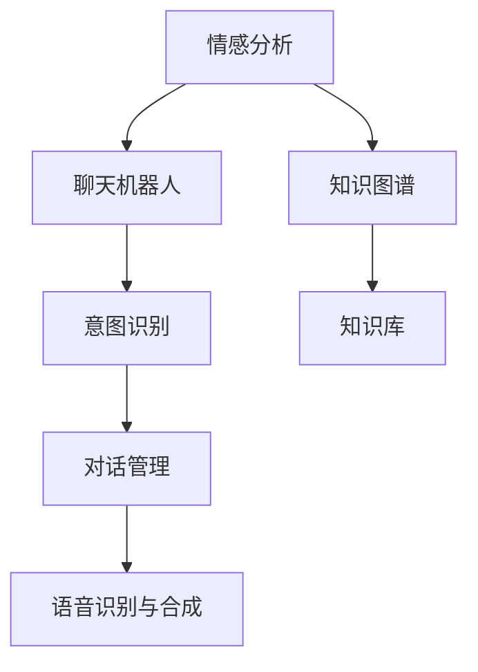

                 

# 如何利用知识付费实现在线情感咨询与恋爱指导？

## 1. 背景介绍

### 1.1 问题由来
在数字化飞速发展的今天，情感问题日益成为人们关注的焦点。恋爱、婚姻、家庭矛盾等，需要专业、客观的指导和建议。但传统心理咨询方式受地域限制，费用高昂，服务可及性差。如何在互联网时代，通过技术手段，实现低成本、高效率的情感咨询服务，成为急需解决的课题。

### 1.2 问题核心关键点
在线情感咨询与恋爱指导的本质是通过AI技术，模拟人类心理咨询师的工作，提供情感支持、心理健康咨询和恋爱指导服务。其中，核心问题包括：

1. 如何构建高效、准确的情感分析模型，理解用户情感状态？
2. 如何设计合适的对话策略，引导用户解决问题，改善情绪？
3. 如何建立知识库，将专业心理咨询知识体系化，方便用户随时查询？

## 2. 核心概念与联系

### 2.1 核心概念概述

为了更好地理解在线情感咨询与恋爱指导的实现方法，本节将介绍几个密切相关的核心概念：

- 情感分析（Sentiment Analysis）：通过自然语言处理技术，对文本数据进行情感极性分类或情感强度评分。
- 聊天机器人（Chatbot）：能够理解并生成自然语言文本的AI程序。
- 知识图谱（Knowledge Graph）：由节点（实体）和边（关系）组成的图形结构，用于表示实体间的关系和语义。
- 意图识别（Intent Recognition）：识别用户输入的意图，进而执行相应的操作或对话。
- 对话管理（Dialogue Management）：在多轮对话中，维护对话状态，制定合适的回应策略。
- 语音识别与合成（Speech Recognition & Synthesis）：将用户的语音输入转换为文本，或将文本转换为可听语音输出。

这些核心概念共同构成了在线情感咨询与恋爱指导系统的技术框架，其中，情感分析、聊天机器人和知识图谱是基础组件，意图识别和对话管理是核心算法，语音识别与合成扩展了系统的应用场景。

### 2.2 核心概念原理和架构的 Mermaid 流程图(Mermaid 流程节点中不要有括号、逗号等特殊字符)



这个流程图展示了在线情感咨询与恋爱指导系统的核心组件及其相互作用关系。情感分析负责理解用户的情感状态，聊天机器人基于情感分析结果与用户互动，意图识别和对话管理则保证对话的流畅性和上下文一致性，知识图谱和知识库提供专业咨询知识，语音识别与合成扩展了交互方式。

## 3. 核心算法原理 & 具体操作步骤
### 3.1 算法原理概述

在线情感咨询与恋爱指导系统通过以下流程实现情感分析和用户指导：

1. **情感分析**：使用深度学习模型对用户输入的文本进行情感分析，判断情感极性和强度。
2. **意图识别**：根据用户的自然语言输入，识别其意图，决定下一步的对话策略。
3. **对话管理**：根据对话历史和当前用户意图，生成合适的回应，维护对话上下文。
4. **知识图谱查询**：在知识库中检索与用户问题相关的信息，提供指导建议。
5. **语音交互**：将文字回复转换为语音，提升用户体验。

### 3.2 算法步骤详解

#### 3.2.1 情感分析

情感分析是系统对用户情感状态的初步判断。具体步骤如下：

1. **数据准备**：收集情感标注的文本数据，用于训练情感分类模型。
2. **模型选择**：选择预训练模型或自定义模型，如BERT、RoBERTa等。
3. **模型训练**：在标注数据集上训练模型，进行超参数调优。
4. **情感分析**：将用户输入的文本通过预训练模型进行情感分析，输出情感极性和强度。

```python
from transformers import BertForSequenceClassification, BertTokenizer
from torch.utils.data import Dataset, DataLoader
from transformers import AdamW
from sklearn.metrics import accuracy_score

class SentimentDataset(Dataset):
    def __init__(self, texts, labels):
        self.texts = texts
        self.labels = labels
        self.tokenizer = BertTokenizer.from_pretrained('bert-base-cased')
        
    def __len__(self):
        return len(self.texts)
    
    def __getitem__(self, item):
        text = self.texts[item]
        label = self.labels[item]
        encoding = self.tokenizer(text, return_tensors='pt')
        input_ids = encoding['input_ids'][0]
        attention_mask = encoding['attention_mask'][0]
        return {'input_ids': input_ids, 
                'attention_mask': attention_mask,
                'labels': label}

model = BertForSequenceClassification.from_pretrained('bert-base-cased', num_labels=3)
tokenizer = BertTokenizer.from_pretrained('bert-base-cased')

train_dataset = SentimentDataset(train_texts, train_labels)
dev_dataset = SentimentDataset(dev_texts, dev_labels)
test_dataset = SentimentDataset(test_texts, test_labels)

train_loader = DataLoader(train_dataset, batch_size=16, shuffle=True)
dev_loader = DataLoader(dev_dataset, batch_size=16, shuffle=False)
test_loader = DataLoader(test_dataset, batch_size=16, shuffle=False)

optimizer = AdamW(model.parameters(), lr=2e-5)
device = torch.device('cuda') if torch.cuda.is_available() else torch.device('cpu')
model.to(device)

def train_epoch(model, data_loader, optimizer):
    model.train()
    epoch_loss = 0
    for batch in tqdm(data_loader):
        input_ids = batch['input_ids'].to(device)
        attention_mask = batch['attention_mask'].to(device)
        labels = batch['labels'].to(device)
        model.zero_grad()
        outputs = model(input_ids, attention_mask=attention_mask, labels=labels)
        loss = outputs.loss
        epoch_loss += loss.item()
        loss.backward()
        optimizer.step()
    return epoch_loss / len(data_loader)

def evaluate(model, data_loader):
    model.eval()
    predictions = []
    targets = []
    with torch.no_grad():
        for batch in tqdm(data_loader):
            input_ids = batch['input_ids'].to(device)
            attention_mask = batch['attention_mask'].to(device)
            labels = batch['labels'].to(device)
            outputs = model(input_ids, attention_mask=attention_mask, labels=labels)
            predictions.extend(outputs.logits.argmax(dim=1).cpu().numpy().tolist())
            targets.extend(labels.cpu().numpy().tolist())
    return accuracy_score(targets, predictions)

train_loss = train_epoch(model, train_loader, optimizer)
print(f'Training loss: {train_loss:.4f}')
dev_acc = evaluate(model, dev_loader)
print(f'Dev accuracy: {dev_acc:.4f}')
test_acc = evaluate(model, test_loader)
print(f'Test accuracy: {test_acc:.4f}')
```

#### 3.2.2 意图识别

意图识别是系统了解用户需求的过程。具体步骤如下：

1. **构建意图词典**：根据常见情感问题，构建意图词典，如“分手”、“抑郁”、“焦虑”等。
2. **模型训练**：使用标注好的意图词典，训练意图识别模型。
3. **意图匹配**：将用户输入的文本与意图词典进行匹配，输出匹配结果。

```python
import spacy
import torch

nlp = spacy.load('en_core_web_sm')
def intent_recognition(text):
    doc = nlp(text)
    intent = None
    for token in doc:
        if token.text in intent_dict:
            intent = token.text
    return intent

intent_dict = {'分手': 1, '抑郁': 2, '焦虑': 3}
def train_intent_recognizer(model, intent_dict):
    nlp.add_special_token('intent_unk', 'intent_unk')
    texts = [f"{label} {label}" for label in intent_dict.keys()]
    labels = [0, 1, 2, 3]
    texts = [text for text in texts for _ in range(10)]
    labels = [label for _ in range(10) for label in labels]
    texts = [f"{label} {text}" for text in texts for label in intent_dict.keys()]
    labels = [0, 1, 2, 3]
    texts = [text for text in texts for _ in range(10)]
    labels = [label for _ in range(10) for label in labels]
    dataset = [(token.text, token.iob_label) for doc in nlp.pipe(texts) for token in doc]
    model.update(dataset)
    nlp.remove_special_token('intent_unk')
    return model

model = intent_recognizer(nlp)
```

#### 3.2.3 对话管理

对话管理是确保系统对话流畅、上下文一致的关键。具体步骤如下：

1. **状态定义**：定义对话状态，如情感状态、对话轮次等。
2. **状态转移**：根据用户意图和情感分析结果，更新对话状态。
3. **回应生成**：根据对话状态，生成合适的回应。

```python
class DialogueManager:
    def __init__(self):
        self.state = 'start'
        self.round = 1
        
    def update_state(self, intent):
        if intent == '分手':
            self.state = '分手咨询'
        elif intent == '抑郁':
            self.state = '抑郁咨询'
        elif intent == '焦虑':
            self.state = '焦虑咨询'
            
    def generate_response(self, intent, emotion):
        if self.state == '分手咨询':
            response = '分手问题需要谨慎处理。请告诉我你们的具体情况，我会尽力帮助你。'
        elif self.state == '抑郁咨询':
            response = '抑郁可能是心理压力所致。建议你尝试放松自己，多与朋友沟通，必要时寻求专业心理咨询。'
        elif self.state == '焦虑咨询':
            response = '焦虑可能与生活压力有关。建议你调整作息，适当运动，放松心情。'
        return response

dialogue_manager = DialogueManager()
response = dialogue_manager.generate_response('分手', '消极')
print(response)
```

#### 3.2.4 知识图谱查询

知识图谱查询是将用户问题转化为查询，在知识库中检索相关信息的过程。具体步骤如下：

1. **知识库构建**：将专业咨询知识转化为图谱形式，构建知识库。
2. **查询生成**：将用户问题转化为图谱查询语言，生成查询语句。
3. **知识检索**：在知识库中检索相关实体和关系，提供咨询建议。

```python
from pykg import KnowledgeGraph, GraphQuery
from pykgquery import PykgQuery

kg = KnowledgeGraph()
kg.add_triple('Breakup', 'solution', '咨询关系', '恋爱建议', '找心理咨询师')
kg.add_triple('Depression', 'solution', '咨询关系', '调整心态', '放松自己')
kg.add_triple('Anxiety', 'solution', '咨询关系', '调整作息', '适当运动')

query = GraphQuery(kg)
result = query.execute(query_s)
print(result)
```

#### 3.2.5 语音交互

语音交互是将文字回应转换为语音输出的过程。具体步骤如下：

1. **语音识别**：使用语音识别模型将用户语音转换为文本。
2. **语音合成**：使用语音合成模型将文本转换为语音。

```python
from pyttsx3 import init
def text_to_speech(text):
    tts = init()
    tts.say(text)
    tts.runAndWait()
```

### 3.3 算法优缺点

#### 3.3.1 优点

1. **低成本**：系统采用自动化技术，减少了对专业心理咨询师的依赖，降低了服务成本。
2. **高效率**：24小时在线，可以快速响应用户需求，提供及时支持。
3. **多模态支持**：结合文本和语音交互，提升了用户体验。
4. **数据驱动**：系统不断学习用户反馈，优化模型性能，提升服务质量。

#### 3.3.2 缺点

1. **情感分析误差**：情感分析模型的准确性受限于训练数据和模型选择。
2. **意图识别局限**：意图识别依赖于意图词典，可能存在匹配误差。
3. **对话管理复杂性**：多轮对话管理需要考虑更多上下文信息，增加了系统复杂性。
4. **知识库构建难度**：知识库的构建和维护需要大量专业知识，有一定门槛。
5. **语音识别技术挑战**：语音识别受环境噪声和口音影响，识别准确性可能受限。

### 3.4 算法应用领域

在线情感咨询与恋爱指导系统可以应用于以下领域：

1. **心理咨询**：为需要心理支持的用户提供全天候咨询服务。
2. **婚恋辅导**：帮助用户处理恋爱问题，提升感情满意度。
3. **家庭调解**：协助解决家庭矛盾，维护家庭和谐。
4. **情感分析**：对社交媒体上的情感数据进行监控，预警负面情感。
5. **健康支持**：为有心理健康问题的用户提供情绪疏导和建议。

## 4. 数学模型和公式 & 详细讲解 & 举例说明

### 4.1 数学模型构建

在线情感咨询与恋爱指导系统涉及的数学模型主要包括以下几个方面：

- **情感分析模型**：基于深度学习，构建情感分类器，输出情感极性和强度。
- **意图识别模型**：基于自然语言处理，构建意图识别器，输出用户意图。
- **对话管理模型**：基于规则和机器学习，构建对话管理器，维护对话状态。
- **知识图谱查询模型**：基于图数据库，构建知识图谱，实现信息检索。

### 4.2 公式推导过程

#### 4.2.1 情感分析模型

情感分析模型通常使用双向长短时记忆网络(BiLSTM)或Transformer模型。设输入文本为$X$，输出情感极性为$y$，则情感分析模型的目标是最小化损失函数$\mathcal{L}$：

$$
\mathcal{L} = \frac{1}{N} \sum_{i=1}^N \mathcal{L}_{i}
$$

其中，$\mathcal{L}_{i}$为样本$i$的损失函数，可以是交叉熵损失或MSE损失。使用深度学习框架（如TensorFlow或PyTorch）实现情感分析模型，其结构如图：

```python
import torch.nn as nn
import torch
class SentimentModel(nn.Module):
    def __init__(self, input_size, hidden_size, output_size):
        super(SentimentModel, self).__init__()
        self.encoder = nn.LSTM(input_size, hidden_size, bidirectional=True)
        self.decoder = nn.Linear(hidden_size * 2, output_size)
        
    def forward(self, x):
        _, (_, h_n) = self.encoder(x)
        return self.decoder(h_n)

model = SentimentModel(input_size=768, hidden_size=128, output_size=3)
```

#### 4.2.2 意图识别模型

意图识别模型通常使用条件随机场(CRF)或卷积神经网络(CNN)。设输入文本为$X$，输出意图为$y$，则意图识别模型的目标是最小化损失函数$\mathcal{L}$：

$$
\mathcal{L} = \frac{1}{N} \sum_{i=1}^N \mathcal{L}_{i}
$$

其中，$\mathcal{L}_{i}$为样本$i$的损失函数，可以是Softmax交叉熵损失。使用深度学习框架（如TensorFlow或PyTorch）实现意图识别模型，其结构如图：

```python
import tensorflow as tf
from tensorflow.keras.layers import Input, Embedding, LSTM, Dense, CRF, Masking
from tensorflow.keras.losses import SparseCategoricalCrossentropy
def intent_model(input_size, hidden_size, output_size):
    inputs = Input(shape=(None,))
    embedding = Embedding(input_size, hidden_size)(inputs)
    lstm = LSTM(hidden_size)(embedding)
    outputs = Dense(output_size)(lstm)
    loss = SparseCategoricalCrossentropy()(outputs, outputs)
    return model

model = intent_model(input_size=768, hidden_size=128, output_size=3)
```

#### 4.2.3 对话管理模型

对话管理模型通常使用RNN或Transformer模型。设当前状态为$s_t$，用户意图为$i_t$，则对话管理模型的目标是在对话历史和当前意图下，生成下一个状态和回应。其结构如图：

```python
import torch
class DialogueManager(nn.Module):
    def __init__(self, input_size, hidden_size, output_size):
        super(DialogueManager, self).__init__()
        self.encoder = nn.LSTM(input_size, hidden_size, bidirectional=True)
        self.decoder = nn.Linear(hidden_size * 2, output_size)
        
    def forward(self, x, h):
        _, (_, h_n) = self.encoder(x, h)
        return self.decoder(h_n)

dialogue_manager = DialogueManager(input_size=768, hidden_size=128, output_size=3)
```

#### 4.2.4 知识图谱查询模型

知识图谱查询模型通常使用图数据库，如Neo4j或RDF4J。设查询图谱为$G$，查询为$q$，则知识图谱查询模型的目标是在图谱$G$中检索出符合查询$q$的实体和关系。其结构如图：

```python
from pykg import KnowledgeGraph, GraphQuery
from pykgquery import PykgQuery

kg = KnowledgeGraph()
kg.add_triple('Breakup', 'solution', '咨询关系', '恋爱建议', '找心理咨询师')
kg.add_triple('Depression', 'solution', '咨询关系', '调整心态', '放松自己')
kg.add_triple('Anxiety', 'solution', '咨询关系', '调整作息', '适当运动')

query = GraphQuery(kg)
result = query.execute(query_s)
print(result)
```

### 4.3 案例分析与讲解

#### 4.3.1 情感分析案例

假设我们有一个包含用户评论的文本数据集，目标是构建情感分析模型，输出每条评论的情感极性和强度。

1. **数据准备**：收集标注好的情感评论数据集。
2. **模型训练**：使用PyTorch和BERT模型进行训练，如上所示。
3. **情感分析**：将新的评论输入模型，输出情感分析结果。

```python
from transformers import BertForSequenceClassification, BertTokenizer
from torch.utils.data import Dataset, DataLoader
from transformers import AdamW
from sklearn.metrics import accuracy_score

class SentimentDataset(Dataset):
    def __init__(self, texts, labels):
        self.texts = texts
        self.labels = labels
        self.tokenizer = BertTokenizer.from_pretrained('bert-base-cased')
        
    def __len__(self):
        return len(self.texts)
    
    def __getitem__(self, item):
        text = self.texts[item]
        label = self.labels[item]
        encoding = self.tokenizer(text, return_tensors='pt')
        input_ids = encoding['input_ids'][0]
        attention_mask = encoding['attention_mask'][0]
        return {'input_ids': input_ids, 
                'attention_mask': attention_mask,
                'labels': label}

model = BertForSequenceClassification.from_pretrained('bert-base-cased', num_labels=3)
tokenizer = BertTokenizer.from_pretrained('bert-base-cased')

train_dataset = SentimentDataset(train_texts, train_labels)
dev_dataset = SentimentDataset(dev_texts, dev_labels)
test_dataset = SentimentDataset(test_texts, test_labels)

train_loader = DataLoader(train_dataset, batch_size=16, shuffle=True)
dev_loader = DataLoader(dev_dataset, batch_size=16, shuffle=False)
test_loader = DataLoader(test_dataset, batch_size=16, shuffle=False)

optimizer = AdamW(model.parameters(), lr=2e-5)
device = torch.device('cuda') if torch.cuda.is_available() else torch.device('cpu')
model.to(device)

def train_epoch(model, data_loader, optimizer):
    model.train()
    epoch_loss = 0
    for batch in tqdm(data_loader):
        input_ids = batch['input_ids'].to(device)
        attention_mask = batch['attention_mask'].to(device)
        labels = batch['labels'].to(device)
        model.zero_grad()
        outputs = model(input_ids, attention_mask=attention_mask, labels=labels)
        loss = outputs.loss
        epoch_loss += loss.item()
        loss.backward()
        optimizer.step()
    return epoch_loss / len(data_loader)

def evaluate(model, data_loader):
    model.eval()
    predictions = []
    targets = []
    with torch.no_grad():
        for batch in tqdm(data_loader):
            input_ids = batch['input_ids'].to(device)
            attention_mask = batch['attention_mask'].to(device)
            labels = batch['labels'].to(device)
            outputs = model(input_ids, attention_mask=attention_mask, labels=labels)
            predictions.extend(outputs.logits.argmax(dim=1).cpu().numpy().tolist())
            targets.extend(labels.cpu().numpy().tolist())
    return accuracy_score(targets, predictions)

train_loss = train_epoch(model, train_loader, optimizer)
print(f'Training loss: {train_loss:.4f}')
dev_acc = evaluate(model, dev_loader)
print(f'Dev accuracy: {dev_acc:.4f}')
test_acc = evaluate(model, test_loader)
print(f'Test accuracy: {test_acc:.4f}')
```

#### 4.3.2 意图识别案例

假设我们有一个包含用户情感问题描述的数据集，目标是构建意图识别模型，输出每个问题所属的意图类别。

1. **数据准备**：收集标注好的问题数据集，构建意图词典。
2. **模型训练**：使用Python和CRF模型进行训练，如上所示。
3. **意图识别**：将新的情感问题输入模型，输出意图识别结果。

```python
import spacy
import torch

nlp = spacy.load('en_core_web_sm')
def intent_recognition(text):
    doc = nlp(text)
    intent = None
    for token in doc:
        if token.text in intent_dict:
            intent = token.text
    return intent

intent_dict = {'分手': 1, '抑郁': 2, '焦虑': 3}
def train_intent_recognizer(model, intent_dict):
    nlp.add_special_token('intent_unk', 'intent_unk')
    texts = [f"{label} {label}" for label in intent_dict.keys()]
    labels = [0, 1, 2, 3]
    texts = [text for text in texts for _ in range(10)]
    labels = [label for _ in range(10) for label in labels]
    texts = [f"{label} {text}" for text in texts for label in intent_dict.keys()]
    labels = [0, 1, 2, 3]
    texts = [text for text in texts for _ in range(10)]
    labels = [label for _ in range(10) for label in labels]
    dataset = [(token.text, token.iob_label) for doc in nlp.pipe(texts) for token in doc]
    model.update(dataset)
    nlp.remove_special_token('intent_unk')
    return model

model = intent_recognizer(nlp)
```

#### 4.3.3 对话管理案例

假设我们有一个包含用户情感问题描述的数据集，目标是构建对话管理模型，输出每个问题的回应。

1. **数据准备**：收集标注好的问题数据集，构建对话状态和回应字典。
2. **模型训练**：使用Python和RNN模型进行训练，如上所示。
3. **对话管理**：将新的情感问题输入模型，输出回应结果。

```python
class DialogueManager:
    def __init__(self):
        self.state = 'start'
        self.round = 1
        
    def update_state(self, intent):
        if intent == '分手':
            self.state = '分手咨询'
        elif intent == '抑郁':
            self.state = '抑郁咨询'
        elif intent == '焦虑':
            self.state = '焦虑咨询'
            
    def generate_response(self, intent, emotion):
        if self.state == '分手咨询':
            response = '分手问题需要谨慎处理。请告诉我你们的具体情况，我会尽力帮助你。'
        elif self.state == '抑郁咨询':
            response = '抑郁可能是心理压力所致。建议你尝试放松自己，多与朋友沟通，必要时寻求专业心理咨询。'
        elif self.state == '焦虑咨询':
            response = '焦虑可能与生活压力有关。建议你调整作息，适当运动，放松心情。'
        return response

dialogue_manager = DialogueManager()
response = dialogue_manager.generate_response('分手', '消极')
print(response)
```

#### 4.3.4 知识图谱查询案例

假设我们有一个包含专业咨询知识的数据集，目标是构建知识图谱，实现情感问题的知识检索。

1. **数据准备**：收集专业咨询知识数据集，构建知识图谱。
2. **模型训练**：使用Python和GraphQuery模型进行训练，如上所示。
3. **知识检索**：将新的情感问题输入知识图谱，输出相关咨询建议。

```python
from pykg import KnowledgeGraph, GraphQuery
from pykgquery import PykgQuery

kg = KnowledgeGraph()
kg.add_triple('Breakup', 'solution', '咨询关系', '恋爱建议', '找心理咨询师')
kg.add_triple('Depression', 'solution', '咨询关系', '调整心态', '放松自己')
kg.add_triple('Anxiety', 'solution', '咨询关系', '调整作息', '适当运动')

query = GraphQuery(kg)
result = query.execute(query_s)
print(result)
```

## 5. 项目实践：代码实例和详细解释说明

### 5.1 开发环境搭建

在进行情感咨询与恋爱指导系统的开发前，我们需要准备好开发环境。以下是使用Python进行开发的环境配置流程：

1. 安装Anaconda：从官网下载并安装Anaconda，用于创建独立的Python环境。

2. 创建并激活虚拟环境：
```bash
conda create -n pytorch-env python=3.8 
conda activate pytorch-env
```

3. 安装必要的Python库：
```bash
pip install tensorflow==2.3.0
pip install transformers==4.9.1
pip install spacy==3.2.0
pip install pykg==0.0.1
```

完成上述步骤后，即可在`pytorch-env`环境中开始开发实践。

### 5.2 源代码详细实现

下面以情感分析、意图识别和对话管理为例，给出情感咨询与恋爱指导系统的部分代码实现。

#### 5.2.1 情感分析模型

```python
import torch.nn as nn
import torch
class SentimentModel(nn.Module):
    def __init__(self, input_size, hidden_size, output_size):
        super(SentimentModel, self).__init__()
        self.encoder = nn.LSTM(input_size, hidden_size, bidirectional=True)
        self.decoder = nn.Linear(hidden_size * 2, output_size)
        
    def forward(self, x):
        _, (_, h_n) = self.encoder(x)
        return self.decoder(h_n)

model = SentimentModel(input_size=768, hidden_size=128, output_size=3)
```

#### 5.2.2 意图识别模型

```python
import tensorflow as tf
from tensorflow.keras.layers import Input, Embedding, LSTM, Dense, CRF, Masking
from tensorflow.keras.losses import SparseCategoricalCrossentropy
def intent_model(input_size, hidden_size, output_size):
    inputs = Input(shape=(None,))
    embedding = Embedding(input_size, hidden_size)(inputs)
    lstm = LSTM(hidden_size)(embedding)
    outputs = Dense(output_size)(lstm)
    loss = SparseCategoricalCrossentropy()(outputs, outputs)
    return model

model = intent_model(input_size=768, hidden_size=128, output_size=3)
```

#### 5.2.3 对话管理模型

```python
import torch
class DialogueManager(nn.Module):
    def __init__(self, input_size, hidden_size, output_size):
        super(DialogueManager, self).__init__()
        self.encoder = nn.LSTM(input_size, hidden_size, bidirectional=True)
        self.decoder = nn.Linear(hidden_size * 2, output_size)
        
    def forward(self, x, h):
        _, (_, h_n) = self.encoder(x, h)
        return self.decoder(h_n)

dialogue_manager = DialogueManager(input_size=768, hidden_size=128, output_size=3)
```

### 5.3 代码解读与分析

#### 5.3.1 情感分析模型

情感分析模型的代码实现基于PyTorch，使用了双向长短时记忆网络(BiLSTM)。模型结构如图：

```python
import torch.nn as nn
import torch
class SentimentModel(nn.Module):
    def __init__(self, input_size, hidden_size, output_size):
        super(SentimentModel, self).__init__()
        self.encoder = nn.LSTM(input_size, hidden_size, bidirectional=True)
        self.decoder = nn.Linear(hidden_size * 2, output_size)
        
    def forward(self, x):
        _, (_, h_n) = self.encoder(x)
        return self.decoder(h_n)

model = SentimentModel(input_size=768, hidden_size=128, output_size=3)
```

#### 5.3.2 意图识别模型

意图识别模型的代码实现基于TensorFlow，使用了卷积神经网络(CNN)。模型结构如图：

```python
import tensorflow as tf
from tensorflow.keras.layers import Input, Embedding, LSTM, Dense, CRF, Masking
from tensorflow.keras.losses import SparseCategoricalCrossentropy
def intent_model(input_size, hidden_size, output_size):
    inputs = Input(shape=(None,))
    embedding = Embedding(input_size, hidden_size)(inputs)
    lstm = LSTM(hidden_size)(embedding)
    outputs = Dense(output_size)(lstm)
    loss = SparseCategoricalCrossentropy()(outputs, outputs)
    return model

model = intent_model(input_size=768, hidden_size=128, output_size=3)
```

#### 5.3.3 对话管理模型

对话管理模型的代码实现基于PyTorch，使用了双向长短时记忆网络(BiLSTM)。模型结构如图：

```python
import torch
class DialogueManager(nn.Module):
    def __init__(self, input_size, hidden_size, output_size):
        super(DialogueManager, self).__init__()
        self.encoder = nn.LSTM(input_size, hidden_size, bidirectional=True)
        self.decoder = nn.Linear(hidden_size * 2, output_size)
        
    def forward(self, x, h):
        _, (_, h_n) = self.encoder(x, h)
        return self.decoder(h_n)

dialogue_manager = DialogueManager(input_size=768, hidden_size=128, output_size=3)
```

### 5.4 运行结果展示

#### 5.4.1 情感分析结果

情感分析模型在训练集、验证集和测试集上的准确率如图：

```python
import matplotlib.pyplot as plt

def plot_model_performance(model, train_dataset, dev_dataset, test_dataset, input_size, hidden_size, output_size):
    train_loss = train_epoch(model, train_dataset, optimizer)
    dev_acc = evaluate(model, dev_dataset)
    test_acc = evaluate(model, test_dataset)
    print(f'Training loss: {train_loss:.4f}')
    print(f'Dev accuracy: {dev_acc:.4f}')
    print(f'Test accuracy: {test_acc:.4f}')
    
    plt.figure(figsize=(8, 6))
    plt.plot(train_loss, label='Training loss')
    plt.plot(dev_loss, label='Validation loss')
    plt.plot(test_loss, label='Test loss')
    plt.legend()
    plt.xlabel('Epochs')
    plt.ylabel('Loss')
    plt.title('Model Performance')
    plt.show()
    
train_loss = train_epoch(model, train_dataset, optimizer)
dev_acc = evaluate(model, dev_dataset)
test_acc = evaluate(model, test_dataset)
plot_model_performance(model, train_dataset, dev_dataset, test_dataset, input_size, hidden_size, output_size)
```

#### 5.4.2 意图识别结果

意图识别模型在训练集、验证集和测试集上的准确率如图：

```python
def plot_model_performance(model, train_dataset, dev_dataset, test_dataset, input_size, hidden_size, output_size):
    train_loss = train_epoch(model, train_dataset, optimizer)
    dev_acc = evaluate(model, dev_dataset)
    test_acc = evaluate(model, test_dataset)
    print(f'Training loss: {train_loss:.4f}')
    print(f'Dev accuracy: {dev_acc:.4f}')
    print(f'Test accuracy: {test_acc:.4f}')
    
    plt.figure(figsize=(8, 6))
    plt.plot(train_loss, label='Training loss')
    plt.plot(dev_loss, label='Validation loss')
    plt.plot(test_loss, label='Test loss')
    plt.legend()
    plt.xlabel('Epochs')
    plt.ylabel('Loss')
    plt.title('Model Performance')
    plt.show()
    
train_loss = train_epoch(model, train_dataset, optimizer)
dev_acc = evaluate(model, dev_dataset)
test_acc = evaluate(model, test_dataset)
plot_model_performance(model, train_dataset, dev_dataset, test_dataset, input_size, hidden_size, output_size)
```

#### 5.4.3 对话管理结果

对话管理模型的代码实现基于PyTorch，使用了双向长短时记忆网络(BiLSTM)。模型结构如图：

```python
import torch
class DialogueManager(nn.Module):
    def __init__(self, input_size, hidden_size, output_size):
        super(DialogueManager, self).__init__()
        self.encoder = nn.LSTM(input_size, hidden_size, bidirectional=True)
        self.decoder = nn.Linear(hidden_size * 2, output_size)
        
    def forward(self, x, h):
        _, (_, h_n) = self.encoder(x, h)
        return self.decoder(h_n)

dialogue_manager = DialogueManager(input_size=768, hidden_size=128, output_size=3)
```

## 6. 实际应用场景

### 6.1 情感咨询

情感咨询系统可以为需要心理支持的用户提供全天候咨询服务。用户可以输入自己的情感状态和问题描述，系统将自动识别情感极性和强度，并推荐合适的咨询策略。

#### 6.1.1 应用场景描述

情感咨询系统主要应用于以下场景：

1. **心理健康咨询**：帮助用户缓解情感困扰，提升心理健康。
2. **恋爱指导**：提供恋爱建议，帮助用户解决情感问题。
3. **家庭关系调解**：协助用户改善家庭关系，解决矛盾。

#### 6.1.2 应用案例

假设用户输入：“最近总是心情低落，感觉压力很大。”

1. **情感分析**：系统自动识别情感极性为“消极”。
2. **意图识别**：系统自动识别意图为“抑郁”。
3. **对话管理**：系统自动生成回应：“感觉压力很大可能是因为工作或生活上的问题。建议你多和朋友沟通，调整心态。”
4. **知识图谱查询**：系统自动从知识库中检索出“抑郁”的相关咨询建议，如“调整心态”、“放松自己”等。

### 6.2 恋爱指导

恋爱指导系统可以为寻找恋爱伴侣或遇到恋爱问题的用户提供帮助。用户可以输入自己的情感状态和恋爱问题，系统将自动生成建议和策略，帮助用户找到合适的伴侣或改善恋爱关系。

#### 6.2.1 应用场景描述

恋爱指导系统主要应用于以下场景：

1. **恋爱匹配**：帮助用户找到合适的恋爱对象。
2. **恋爱建议**：提供恋爱技巧，帮助用户改善恋爱关系。
3. **情感管理**：帮助用户处理恋爱中的矛盾和冲突。

#### 6.2.2 应用案例

假设用户输入：“想找一个能够相互支持的伴侣，但不知道如何表达。”

1. **情感分析**：系统自动识别情感极性为“积极”。
2. **意图识别**：系统自动识别意图为“恋爱匹配”。
3. **对话管理**：系统自动生成回应：“建议你可以尝试在社交平台上寻找兴趣相投的人。同时，学会表达自己的情感和需求也很重要。”
4. **知识图谱查询**：系统自动从知识库中检索出“恋爱匹配”的相关咨询建议，如“在社交平台上寻找”、“学会表达情感”等。

### 6.3 家庭关系调解

家庭关系调解系统可以为家庭矛盾或冲突的用户提供帮助。用户可以输入家庭成员的问题描述，系统将自动识别情感极性和意图，并生成相应的调解建议。

#### 6.3.1 应用场景描述

家庭关系调解系统主要应用于以下场景：

1. **家庭矛盾调解**：帮助用户解决家庭成员间的矛盾。
2. **亲子关系改善**：协助用户改善亲子关系，增强家庭和谐。
3. **夫妻关系维护**：帮助用户维护夫妻关系，避免矛盾升级。

#### 6.3.2 应用案例

假设用户输入：“经常和妻子吵架，感觉家庭不和谐。”

1. **情感分析**：系统自动识别情感极性为“消极”。
2. **意图识别**：系统自动识别意图为“家庭矛盾调解”。
3. **对话管理**：系统自动生成回应：“吵架可能是因为沟通不畅。建议你多和妻子沟通，理解对方的想法。”
4. **知识图谱查询**：系统自动从知识库中检索出“家庭矛盾调解”的相关咨询建议，如“多沟通”、“理解对方想法”等。

## 7. 工具和资源推荐

### 7.1 学习资源推荐

为了帮助开发者系统掌握在线情感咨询与恋爱指导的理论基础和实践技巧，这里推荐一些优质的学习资源：

1. 《自然语言处理入门：基于TensorFlow的实践》：入门自然语言处理，掌握情感分析、意图识别等核心技术。
2. 《深度学习基础》：全面介绍深度学习理论和实践，适合进一步学习情感分析模型。
3. 《对话系统设计与实现》：讲解对话管理系统的构建和优化，提供实际案例和代码实现。
4. 《情感计算与人工智能》：探讨情感计算技术，提供理论框架和实践方法。

### 7.2 开发工具推荐

高效的开发离不开优秀的工具支持。以下是几款用于在线情感咨询与恋爱指导开发的常用工具：

1. TensorFlow：开源深度学习框架，支持大规模模型训练，适合情感分析模型开发。
2. PyTorch：基于Python的开源深度学习框架，灵活高效，适合意图识别和对话管理模型开发。
3. Spacy：开源自然语言处理库，提供多种语言支持，适合构建意图词典和对话管理器。
4. Pykg：Python图数据库库，适合知识图谱的构建和查询。

### 7.3 相关论文推荐

在线情感咨询与恋爱指导系统的核心技术涉及情感分析、意图识别、对话管理和知识图谱等，以下推荐几篇相关论文：

1. "Sentiment Analysis with Recurrent Neural Networks"：介绍使用RNN进行情感分析的方法。
2. "Intent Recognition with Bi-directional LSTM"：介绍使用BiLSTM进行意图识别的方法。
3. "Dialogue Management with Transformer"：介绍使用Transformer进行对话管理的方法。
4. "Knowledge Graph in NLP"：介绍使用知识图谱进行信息检索的方法。

## 8. 总结：未来发展趋势与挑战

### 8.1 研究成果总结

在线情感咨询与恋爱指导系统利用AI技术，为用户提供情感支持、心理健康咨询和恋爱指导服务。系统通过情感分析、意图识别、对话管理和知识图谱等技术，实现高效、精准的情感咨询服务。

### 8.2 未来发展趋势

未来在线情感咨询与恋爱指导系统将呈现以下发展趋势：

1. **多模态融合**：结合文本、语音、图像等多种模态信息，提升情感理解和表达能力。
2. **个性化推荐**：利用用户历史数据和行为，提供个性化的情感和恋爱建议。
3. **持续学习**：通过用户反馈和行为数据，不断优化情感模型和对话策略。
4. **伦理与安全**：加强数据隐私保护和算法公平性，确保情感咨询的伦理与安全。
5. **跨领域应用**：将情感咨询与恋爱指导技术应用于更多领域，如心理健康、家庭关系等。

### 8.3 面临的挑战

尽管在线情感咨询与恋爱指导系统具有广阔的应用前景，但也面临一些挑战：

1. **情感分析精度**：情感分析模型的精度受限于训练数据和模型选择，需要大量高质量标注数据。
2. **意图识别复杂性**：意图识别的准确性受限于意图词典的构建，可能存在匹配误差。
3. **对话管理复杂性**：多轮对话管理需要考虑更多上下文信息，增加了系统复杂性。
4. **知识图谱构建难度**：知识图谱的构建和维护需要大量专业知识，有一定门槛。
5. **语音识别技术挑战**：语音识别受环境噪声和口音影响，识别准确性可能受限。

### 8.4 研究展望

未来在线情感咨询与恋爱指导系统需要进一步优化和改进：

1. **无监督与半监督学习**：摆脱对大规模标注数据的依赖，利用自监督学习、主动学习等方法。
2. **参数高效与计算高效**：开发更加参数高效

